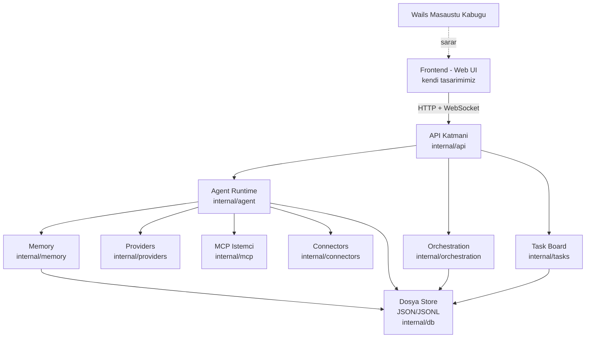

# SwarmGo — Mimari

## Yüksek Seviye Mimari



## Katmanlar

### 1. Sunum Katmanı (Frontend)
- Bağımsız geliştirilen web UI (React + Tailwind + shadcn/ui önerilir).
- Backend ile yalnızca **JSON API + WebSocket** üzerinden konuşur.
- Wails, build çıktısını binary'ye gömer → tek `.exe`.
- UI/UX SwarmClaw'a benzer ama tamamen kendi tasarım dilimiz.

### 2. API Katmanı (`internal/api`)
- HTTP router: **stdlib `net/http` ServeMux** (Go 1.22+ method+path pattern → Chi/Echo gerekmedi). Rotalar domain-bazlı `register*Routes` yardımcılarına bölünmüştür (`server.go`).
- REST uçları: `/api/agents`, `/api/sessions`, `/api/chat`, `/api/tasks`, `/api/schedules`, `/api/flows`, `/api/mcp-servers`, `/api/settings`, `/api/workspaces` (tam liste için `server.go`). (`/api/connectors` Faz 9'da gelecek.)
- Canlı akış: kalıcı WebSocket hub'ı yerine **SSE** (`POST /api/chat/stream`) — sohbet turu adım adım UI'a akar (bkz. `07-CHAT-UX.md`).

### 3. Agent Runtime (`internal/agent`)
Sistemin kalbi. Her ajan bir **goroutine** olarak çalışır.

```mermaid
graph LR
    W[Wake Signal<br/>heartbeat/mesaj/orchestrator] --> CTX[Context Assembly<br/>gecmis + hafiza + gorevler]
    CTX --> CALL[Provider Call<br/>LLM cagrisi]
    CALL --> TOOL[Tool Loop<br/>arac calistirma]
    TOOL --> OUT[Outcome Classification<br/>basari/hata + backoff]
    OUT --> PERSIST[Message Persist<br/>session_messages]
    PERSIST --> DELIVER[Connector Delivery<br/>outbox retry]
    DELIVER --> MEMUP[Memory Update<br/>reflection/dream]
    MEMUP --> DISPATCH[Task Dispatch<br/>delege gorevler]
```



**Anahtar mekanizmalar:**
- Her ajan = goroutine; ajanlar arası mesaj = channel.
- Heartbeat = `time.Ticker`; zamanlama = `robfig/cron`.
- 10 ardışık hatada exponential backoff + otomatik devre dışı.
- Paralel yürütme = düz goroutine + `sync` (orchestration parallel node). `errgroup` planlanmıştı ama gerekmedi; `go.mod`'da yalnızca `google/uuid` + `robfig/cron/v3` var.

### 4. Orchestration (`internal/orchestration`)
- Yapılandırılmış oturumlar: dallanma (branch), döngü (loop), paralel birleşme (join).
- Şablon (template) tabanlı, restart-safe run state.
- Facilitator + participant rolleri.

### 5. Memory (`internal/memory`)
- Hibrit hatırlama: doküman + journal + reflection.
- Recall: **saf Go lexical cosine** (token-frekans) — anahtarsız/çevrimdışı; semantik embedding ileride aynı `Store` arkasına takılabilir.
- "Dream" döngüsü (`agent/reflector.go` → `Reflect`): journal'ı provider'a özetletip reflection üretir.

### 5b. Conversation (`internal/conversation`)
- Token-bütçeli **compaction**: oturum geçmişi eşiği aşınca eski turlar rolling summary'ye katlanır; sadece özet + son N tur gönderilir → uzun sohbetlerde context taşması yok.

### 5c. Bütçe Guardrail (`agent/budget.go`)
- `guardedComplete`: tüm runtime provider çağrılarının tek hunisi. Otonom çağrılarda (heartbeat/scheduler) ajan başına günlük limit (`agent_usage`) uygulanır; manuel chat muaf.

### 6. Providers (`internal/providers`)
- Ortak `Provider` arayüzü; her LLM için ayrı implementasyon.
- **Mevcut:** `anthropic` (ince HTTP istemci, SDK yok), `claude-cli` (anahtarsız, OAuth/abonelik), `minimax` (OpenAI-uyumlu — herhangi bir OpenAI-stili uca da uyar). Ortak HTTP iskeleti `transport.go` (`postJSON`).
- OpenAI/Ollama/Gemini gibi ekler aynı `Provider` arayüzü arkasına takılabilir.
- Akış: claude-cli stream-json + SSE köprüsü (bkz. `07-CHAT-UX.md`).

### 7. Diğer Modüller
- **MCP (`internal/mcp`):** Model Context Protocol istemcisi — SDK'sız elle JSON-RPC 2.0; şu an **stdio** taşıma (SSE/HTTP hedef, henüz yok).
- **Connectors (`internal/connectors`):** Discord, Slack, Telegram köprüleri + outbox retry kuyruğu.
- **Tasks (`internal/tasks`):** Pano, atama, delegasyon, yürütme politikası.
- **DB (`internal/db`):** Dosya-tabanlı store — entity-başına JSON + oturum-başına JSONL, bellek-içi maps + atomik diske yazma (SQLite yok). Bkz. `_Docs/08-DEPOLAMA.md`.
- **Config (`internal/config`):** Ortam değişkenleri, şifreli kimlik bilgileri (credential secret).

## Dizin Yapısı

> Yukarıdaki yüksek seviye diyagram **hedef** mimaridir. Aşağıdaki yapı **2026-06-15 itibarıyla gerçekte mevcut** olandır (Faz 0–8). `orchestration`, `mcp`, `tools` artık mevcut; `connectors` Faz 9'da eklenecek (klasör boş placeholder). Ayrı bir `tasks` paketi yerine görev mantığı `db` + `api` + `agent/executor.go` içinde yaşar.

```
SwarmGo/
├── _Docs/                       # Plan ve tasarim dokumanlari (Turkce)
├── cmd/swarmgo/main.go          # Giris: Manager + API server + graceful shutdown
├── internal/
│   ├── config/                  # env + AES-GCM secret
│   ├── db/                      # Dosya store (JSON/JSONL, DB yok): db.go (maps+load+atomik yaz) + store_*.go (agent/session/task/run/schedule/memory/usage/mcp/flow)
│   ├── providers/               # provider arayüzü, anthropic, claudecli, registry
│   ├── agent/                   # runtime, worker, executor (RunTask), scheduler (cron), reflector, budget, titler, toolloop, toolsetup, climcp (claude-cli --mcp-config), trace (aktivite izi), tunables, flow
│   ├── memory/                  # vector.go (lexical cosine), memory.go (Store)
│   ├── conversation/            # token-bütçeli compaction (tokens.go, manager.go)
│   ├── orchestration/           # akış graf motoru (model.go, engine.go)
│   ├── mcp/                     # SDK'sız stdio JSON-RPC istemci (client.go, manager.go)
│   ├── tools/                   # built-in + MCP birleşik registry (registry.go, builtin_*.go)
│   ├── settings/                # uygulama-geneli ayarlar (settings.go, store.go — şifreli settings.json)
│   ├── workspace/               # workspace başına DB + Runtime + Scheduler (manager.go)
│   └── api/                     # HTTP handler'ları (stdlib ServeMux): agents/sessions/chat/files/runtime/tasks/schedules/memory/usage/mcp/agent_tools/flows/settings/workspaces
├── frontend/                    # React + Vite + TS + Tailwind v4
└── go.mod
```

> Henüz eklenmemiş (ileri fazlar): `internal/connectors` (Faz 9 — şu an boş placeholder), Wails paketleme (Faz 10), WebSocket streaming. Not: MCP istemcisi yalnızca **stdio** taşımayı destekler; SSE/HTTP henüz yok.

## Tasarım İlkeleri

1. **Modülerlik:** Her sorumluluk ayrı pakette, kod ayrı dosyalara bölünmüş.
2. **Arayüz odaklı:** Provider, Connector, Memory gibi katmanlar interface ile soyutlanır → kolay test ve genişletme.
3. **Restart-safe:** Run state DB'de tutulur; çökme sonrası kaldığı yerden devam.
4. **Dil kuralı:** Kod ve yorumlar İngilizce; dokümanlar Türkçe.
