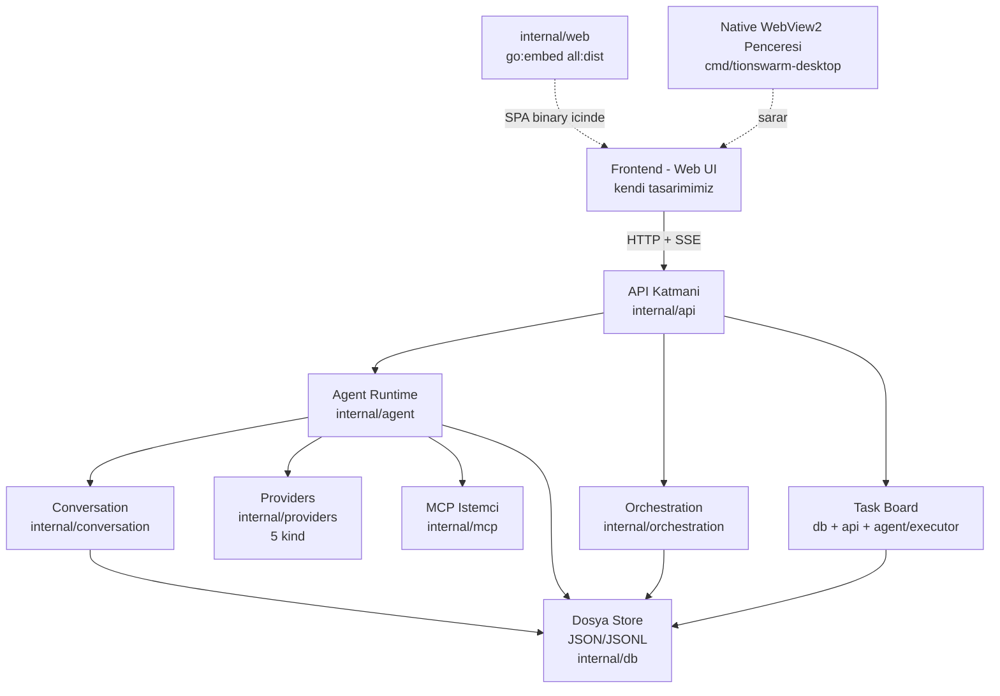
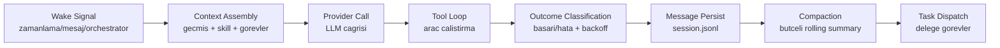

# TionSwarm — Mimari

## Yüksek Seviye Mimari



> **Not:** `Task Board` ayrı bir paket değildir (bkz. §7); diyagramda mantıksal
> katman olarak gösterilir.

## Katmanlar

### 1. Sunum Katmanı (Frontend)
- Bağımsız geliştirilen web UI (React + Vite + TS + Tailwind v4, kendi bileşenlerimiz).
- Backend ile yalnızca **JSON API + SSE** üzerinden konuşur.
- Frontend `dist/` çıktısı `go:embed all:dist` ile Go binary'sine gömülür (`internal/web/embed.go`) → tek çalıştırılabilir dosya, ayrı statik sunucu gerekmez.
- Native masaüstü kabuğu: `cmd/tionswarm-desktop` (WebView2, CGO'suz). Wails planı iptal edildi — bkz. `32-NATIVE-PENCERE.md`.
- UI/UX tamamen kendi tasarım dilimizdir.

### 2. API Katmanı (`internal/api`)
- HTTP router: **stdlib `net/http` ServeMux** (Go 1.22+ method+path pattern → Chi/Echo gerekmedi). Rotalar domain-bazlı `register*Routes` yardımcılarına bölünmüştür (`server.go`).
- REST uçları: `/api/agents`, `/api/sessions`, `/api/chat`, `/api/tasks`, `/api/schedules`, `/api/flows`, `/api/mcp-servers`, `/api/artifacts`, `/api/skills`, `/api/settings`, `/api/workspaces`, `/api/logs`, `/api/events` (tam liste için `server.go`).
- Canlı akış: kalıcı WebSocket hub'ı yerine **SSE** (`POST /api/chat/stream`) — sohbet turu adım adım UI'a akar (bkz. `07-CHAT-UX.md`).

### 3. Agent Runtime (`internal/agent`)
Sistemin kalbi. Her ajan bir **goroutine** olarak çalışır.



**Anahtar mekanizmalar:**
- Her ajan = goroutine; ajanlar arası mesaj = channel.
- Zamanlama = `robfig/cron` (cron + tek seferlik wake timer'ları).
- Paralel yürütme = düz goroutine + `sync` (orchestration parallel node). `errgroup` planlanmıştı ama gerekmedi; `go.mod`'daki doğrudan bağımlılıklar `google/uuid` + `robfig/cron/v3` + `jchv/go-webview2` (native masaüstü pencere, Faz 9) — DB ve runtime saf stdlib.
- **Skill sistemi:** `internal/skills` — 2 katmanlı (global + workspace), frontmatter-only katalog sistem promptuna girer, `use_skill` ile lazy body yüklenir, `subskills` ile aşamalı yükleme. **Ölçek (SK-2):** `paths:` taşıyan **koşullu skill** katalogda görünmez (prompt şişmez), `skill_search` aracıyla bulunur. **Çok-dosyalı (SK-1):** gövdede `${SKILL_DIR}` ikamesi + skill klasöründeki ek dosyalar "Bundled files" footer'ıyla ilan edilir (`fs` ile on-demand). **SK-3:** `use_skill` skill'in `always_allow` desenlerini oturum grant'larına ekler. **SK-4:** `version`/`source_url`/`license`/`user_invocable` provenance. (CLI köprüsü: `skill_search`/use_skill auto-grant `mcp_interaction.go`'da.)
- **Lazy tool loading:** Self-management suite + MCP araçları şemaları tura girmez; sistem promptunda özet katalog yayımlanır, `activate_tools` ile istenince tam şema gelir (`internal/tools/activetools.go`, `builtin_activate.go`).

### 4. Orchestration (`internal/orchestration`)
- Yapılandırılmış oturumlar: dallanma (branch), döngü (loop), paralel birleşme (join).
- Şablon (template) tabanlı, restart-safe run state.
- Facilitator + participant rolleri.

### 5. ~~Memory (`internal/memory`)~~ — **KALDIRILDI (2026-07-05)**
Hafıza alt sistemi (journal recall + core memory + hafıza grafiği + ilgili tool/API/UI)
projeden tamamen çıkarıldı. Kalıcılık artık yalnız **retrieval** katmanıdır:
`conversation_search`, artifact'lar ve kalıcı ilerleme (`36-KALICI-ILERLEME.md`).
Tarihsel tasarım: [`arsiv/31-MEMGPT-CORE-MEMORY.md`](arsiv/31-MEMGPT-CORE-MEMORY.md).

### 5b. Conversation (`internal/conversation`)
- Token-bütçeli **compaction**: oturum geçmişi eşiği aşınca eski turlar rolling summary'ye katlanır; sadece özet + son N tur gönderilir → uzun sohbetlerde context taşması yok.

### 5c. Bütçe Guardrail (`agent/budget.go`)
- `guardedComplete`: tüm runtime provider çağrılarının tek hunisi. Otonom çağrılar global otonomi-pause frenine takılır; her çağrı kullanım sayaçlarına (`store_usage.go`) işlenir. **Per-ajan günlük limitler 2026-07-01'de kaldırıldı** — yalnız kullanım takibi kaldı.

### 6. Providers (`internal/providers`)
- Ortak `Provider` arayüzü; her LLM için ayrı implementasyon.
- **Mevcut (6 kind):** `anthropic` (ince HTTP istemci, SDK yok), `claude-cli` (anahtarsız, OAuth/abonelik), `minimax` (OpenAI-uyumlu), `minimax-anthropic` (Anthropic uyumlu MiniMax ucu), `openrouter` (OpenAI-uyumlu proxy, yüzlerce model — `kind_openrouter.go`), `zai` (Z.ai GLM ailesi, Anthropic uyumlu uç `https://api.z.ai/api/anthropic` — `kind_zai.go`, `minimax-anthropic` kalıbı, kendi anahtarı). Ortak HTTP iskeleti `transport.go` (`postJSON`).
- Her kind `init()` içinde `RegisterKind` ile kaydolur; yeni transport = yeni `kind_*.go` dosyası, başka hiçbir yere dokunulmaz.
- **Streaming birinci sınıf:** opsiyonel `Streamer` arayüzü (`Stream(ctx, req, onDelta)`); `anthropic` + `minimax` native token akışı yapar, claude-cli kendi stream-json izini yayınlar. UI'a SSE ile akar (bkz. `07-CHAT-UX.md`).

### 7. Diğer Modüller
- **MCP (`internal/mcp`):** Model Context Protocol istemcisi — SDK'sız elle JSON-RPC 2.0; **stdio + Streamable HTTP** taşıma. Kalıcı bağlantı havuzu (`pool.go`) turlar arası paylaşılır; hibrit kapsam (`scope: shared|scoped`) ile per-`(session,agent)` izole bağlantı mümkün (bkz. `52-MCP-GATEWAY.md`).
- **Görevler (ayrı paket yok):** Kanban/pano + atama + yürütme mantığı `internal/db` (model+store) + `internal/api` + `internal/agent/executor.go` içinde yaşar — ayrı bir `internal/tasks` paketi yoktur.
- **DB (`internal/db`):** Dosya-tabanlı store — entity-başına JSON + oturum-başına JSONL, bellek-içi maps + atomik diske yazma (SQLite yok). Bkz. `_Docs/08-DEPOLAMA.md`.
- **Config (`internal/config`):** Ortam değişkenleri, şifreli kimlik bilgileri (credential secret).
- **Web (`internal/web`):** `embed.go` — `//go:embed all:dist` ile derleme anında `frontend/dist/` SPA'sini binary'ye gömer; `Handler()` ile SPA + fallback to `index.html` sunar. Ayrı statik sunum/CDN gerekmez.
- **Prefix'li ID'ler (`internal/workspace/id.go`):** Workspace'ler `WS<n>`, ajan ve oturum kayıtları `AGT<n>`/`SES<n>` biçiminde monoton insan-okunabilir ID'ler alır; `ws-counter.json` ile yeniden başlamada sayaç korunur. Tek seferlik migrasyon: `cmd/migrate-ids/`.

## Dizin Yapısı

> Yukarıdaki yüksek seviye diyagram **hedef** mimaridir. Aşağıdaki yapı **gerçekte mevcut** olandır (Faz 0–8). `orchestration`, `mcp`, `tools` artık mevcut. Ayrı bir `tasks` paketi yerine görev mantığı `db` + `api` + `agent/executor.go` içinde yaşar.

```
TionSwarm/
├── _Docs/                       # Plan ve tasarim dokumanlari (Turkce)
├── cmd/
│   ├── tionswarm/main.go          # Bassiz giris (internal/app.Bootstrap)
│   ├── tionswarm-desktop/       # Native WebView2 masaustu penceresi (_Docs/32)
│   └── migrate-ids/             # Tek-seferlik WS/AGT/SES prefix'li ID migrasyon araci
├── internal/
│   ├── config/                  # env + AES-GCM secret
│   ├── db/                      # Dosya store (JSON/JSONL, DB yok): db.go (maps+load+atomik yaz) + store_*.go (task/run/schedule/usage/mcp/flow/artifact/hook/automation/lessons/search)
│   ├── providers/               # provider arayüzü (+Streamer), anthropic, claudecli, minimax, minimax-anthropic, openrouter, zai, catalog, transport, registry
│   ├── web/                     # embed.go — go:embed all:dist → frontend SPA'yi binary'ye gömer, http.Handler sunar
│   ├── agent/                   # runtime, worker, executor (RunTask), scheduler (cron), reflector, budget, titler, toolloop, toolsetup, climcp (claude-cli --mcp-config), trace (aktivite izi/StepKind), tunables, flow
│   ├── conversation/            # token-bütçeli compaction (tokens.go, manager.go, reactive.go, repair.go)
│   ├── orchestration/           # akış graf motoru (model.go, engine.go)
│   ├── mcp/                     # SDK'sız JSON-RPC istemci: stdio + Streamable HTTP (client.go, manager.go, pool.go)
│   ├── tools/                   # built-in (fs/shell akan + todo_write/ask_user + artifact + lazy-load meta) + MCP birleşik registry (registry.go, builtin_*.go, activetools.go, builtin_activate.go)
│   ├── skills/                  # dosya-tabanlı skill sistemi (2 katman: global ~/.tionswarm/skills + workspace/skills); frontmatter-only katalog, lazy body; subskills; koşullu paths:+skill_search (SK-2); ${SKILL_DIR}+bundled files (SK-1); allowed_tools auto-grant (SK-3); provenance (SK-4); varsayılan seeding (defaults/)
│   ├── settings/                # uygulama-geneli ayarlar (settings.go, store.go — şifreli settings.json)
│   ├── logbuf/                  # slog → ring buffer (tüm app+workspace logları); /api/logs (bkz. 12-LOGLAMA.md)
│   ├── events/                  # Event + Bus (süreç-geneli pub/sub); otonom bildirimler → /api/events SSE
│   ├── workspace/               # workspace başına DB + Runtime + Scheduler (manager.go); prefix'li ID'ler (id.go, ws-counter.json)
│   └── api/                     # HTTP handler'ları (stdlib ServeMux): agents/sessions/chat(+stream/control)/files/runtime/tasks/schedules/usage/mcp/agent_tools/flows/artifacts/settings/workspaces/logs/events/insight
├── frontend/                    # React + Vite + TS + Tailwind v4; vis-network + vis-data (ilişki grafiği), @xyflow/react (flow canvas), lucide-react (ikonlar), @fontsource-variable/inter + jetbrains-mono
└── go.mod
```

> Not: Canlı akış WebSocket değil **SSE** ile yapılır (bilinçli seçim). Wails planı iptal
> edildi → native pencere `cmd/tionswarm-desktop` (WebView2). Yukarıdaki ağaç kısaltılmıştır;
> güncel tam liste için `internal/` dizinine bakın.

## Tasarım İlkeleri

1. **Modülerlik:** Her sorumluluk ayrı pakette, kod ayrı dosyalara bölünmüş.
2. **Arayüz odaklı:** Provider, Memory gibi katmanlar interface ile soyutlanır → kolay test ve genişletme.
3. **Restart-safe:** Run state DB'de tutulur; çökme sonrası kaldığı yerden devam.
4. **Dil kuralı:** Kod ve yorumlar İngilizce; dokümanlar Türkçe.
