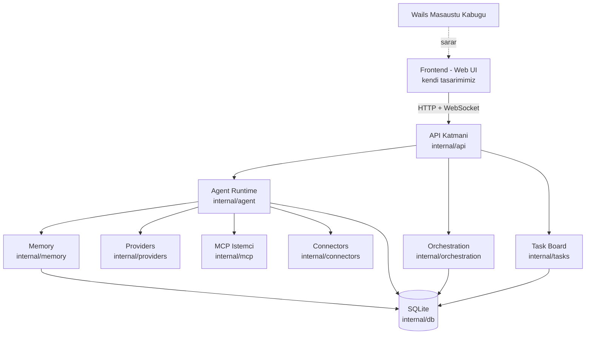

# SwarmGo — Mimari

## Yüksek Seviye Mimari



## Katmanlar

### 1. Sunum Katmanı (Frontend)
- Bağımsız geliştirilen web UI (React + Tailwind + shadcn/ui önerilir).
- Backend ile yalnızca **JSON API + WebSocket** üzerinden konuşur.
- Wails, build çıktısını binary'ye gömer → tek `.exe`.
- UI/UX SwarmClaw'a benzer ama tamamen kendi tasarım dilimiz.

### 2. API Katmanı (`internal/api`)
- HTTP router (Chi veya Echo) + WebSocket hub.
- REST uçları: `/api/agents`, `/api/sessions`, `/api/tasks`, `/api/schedules`, `/api/connectors`, `/api/providers`, `/api/mcp-servers`.
- WebSocket: canlı ajan çıktısı, görev durumu, oturum mesajları.

### 3. Agent Runtime (`internal/agent`)
Sistemin kalbi. Her ajan bir **goroutine** olarak çalışır.

```mermaid
graph LR
    W[Wake Signal<br/>heartbeat/mesaj/orchestrator] --> CTX[Context Assembly<br/>gecmis + hafiza + gorevler]
    CTX --> CALL[Provider Call<br/>LLM cagrisi]
    CALL --> TOOL[Tool Loop<br/>arac calistirma]
    TOOL --> OUT[Outcome Classification<br/>basari/hata + backoff]
    OUT --> PERSIST[Message Persist<br/>session_messages]
    PERSIST --> DELIVER[Connector Delivery<br/>outbox retry]
    DELIVER --> MEMUP[Memory Update<br/>reflection/dream]
    MEMUP --> DISPATCH[Task Dispatch<br/>delege gorevler]
```



**Anahtar mekanizmalar:**
- Her ajan = goroutine; ajanlar arası mesaj = channel.
- Heartbeat = `time.Ticker`; zamanlama = `robfig/cron`.
- 10 ardışık hatada exponential backoff + otomatik devre dışı.
- Paralel yürütme = `golang.org/x/sync/errgroup`.

### 4. Orchestration (`internal/orchestration`)
- Yapılandırılmış oturumlar: dallanma (branch), döngü (loop), paralel birleşme (join).
- Şablon (template) tabanlı, restart-safe run state.
- Facilitator + participant rolleri.

### 5. Memory (`internal/memory`)
- Hibrit hatırlama: doküman + journal + reflection.
- Embedding tabanlı benzerlik araması (opsiyonel).
- Arka plan "dream" döngüsü ile hafıza konsolidasyonu (ucuz model).

### 6. Providers (`internal/providers`)
- Ortak `Provider` arayüzü; her LLM için ayrı implementasyon.
- Anthropic, OpenAI, Ollama, OpenRouter, Gemini...
- Akış (streaming) desteği.

### 7. Diğer Modüller
- **MCP (`internal/mcp`):** Model Context Protocol istemcisi (stdio/SSE/HTTP).
- **Connectors (`internal/connectors`):** Discord, Slack, Telegram köprüleri + outbox retry kuyruğu.
- **Tasks (`internal/tasks`):** Pano, atama, delegasyon, yürütme politikası.
- **DB (`internal/db`):** SQLite şema, migration, sorgular.
- **Config (`internal/config`):** Ortam değişkenleri, şifreli kimlik bilgileri (credential secret).

## Dizin Yapısı

```
SwarmGo/
├── _Docs/                       # Plan ve tasarim dokumanlari (Turkce)
├── cmd/swarmgo/main.go          # Giris noktasi
├── internal/
│   ├── agent/                   # Agent runtime (heartbeat, schedule, delegation)
│   ├── orchestration/           # Yapilandirilmis oturumlar
│   ├── memory/                  # Recall, journal, reflection
│   ├── providers/               # LLM saglayicilari
│   ├── mcp/                      # MCP istemci
│   ├── connectors/              # Discord, Slack, Telegram
│   ├── tasks/                   # Task board
│   ├── db/                      # SQLite katmani
│   ├── api/                     # HTTP/WS handler
│   └── config/                  # Konfig + kimlik bilgileri
├── frontend/                    # Kendi web UI'imiz
├── wails.json
└── go.mod
```

## Tasarım İlkeleri

1. **Modülerlik:** Her sorumluluk ayrı pakette, kod ayrı dosyalara bölünmüş.
2. **Arayüz odaklı:** Provider, Connector, Memory gibi katmanlar interface ile soyutlanır → kolay test ve genişletme.
3. **Restart-safe:** Run state DB'de tutulur; çökme sonrası kaldığı yerden devam.
4. **Dil kuralı:** Kod ve yorumlar İngilizce; dokümanlar Türkçe.
