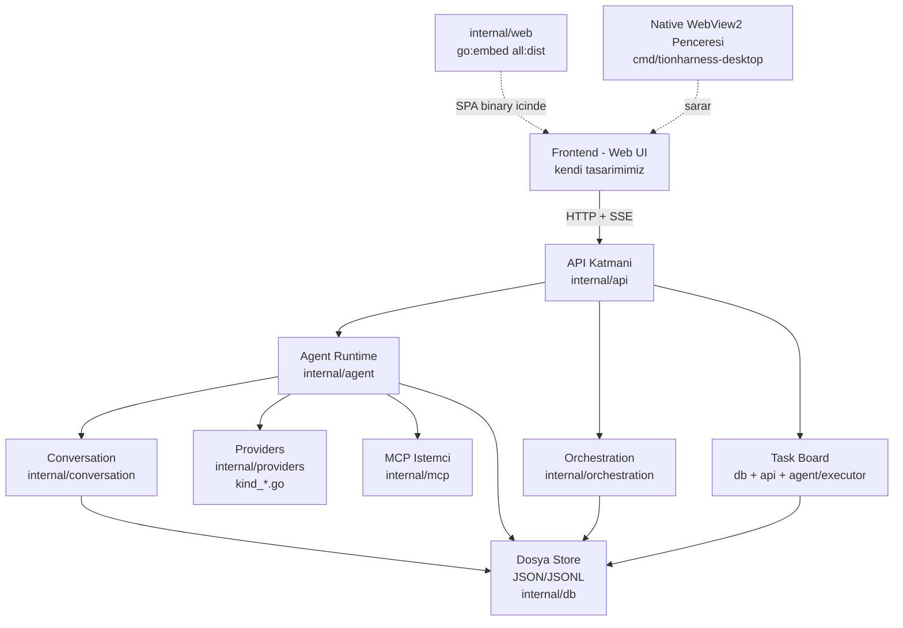
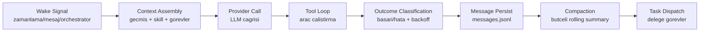

# TionHarness — Mimari

> **Özet (2026-09-03):** Sistemin katmanlı mimarisini anlatır — frontend (React+Vite, go:embed ile binary'ye gömülü), API katmanı (stdlib `net/http` ServeMux + SSE), Agent Runtime (`internal/agent`, ajan-başına goroutine + tool loop + compaction), Orchestration (flow motoru), Providers (6+ kind: anthropic/claude-cli/minimax/openrouter/zai/…) ve dosya-tabanlı DB (`internal/db`). Durum: **uygulandı**, Faz 0–8 tamam; memory katmanı 2026-07-05'te tamamen kaldırıldı. En önemli kararlar: SSE (WebSocket değil) canlı akış için, arayüz-odaklı Provider soyutlaması, restart-safe run state, kod İngilizce/doküman Türkçe kuralı. Dayandığı paketler: `internal/api`, `internal/agent`, `internal/orchestration`, `internal/providers`, `internal/db`, `internal/mcp`, `internal/tools`.

## Yüksek Seviye Mimari


```mermaid
graph TD
    UI[Frontend - Web UI<br/>kendi tasarimimiz] -->|HTTP + SSE| API[API Katmani<br/>internal/api]
    API --> RT[Agent Runtime<br/>internal/agent]
    API --> ORC[Orchestration<br/>internal/orchestration]
    API --> TASK[Task Board<br/>db + api + agent/executor]
    RT --> CONV[Conversation<br/>internal/conversation]
    RT --> PROV[Providers<br/>internal/providers<br/>kind_*.go]
    RT --> MCP[MCP Istemci<br/>internal/mcp]
    CONV --> DB[Dosya Store<br/>JSON/JSONL<br/>internal/db]
    TASK --> DB
    RT --> DB
    ORC --> DB
    EMBED[internal/web<br/>go:embed all:dist] -.SPA binary icinde.-> UI
    DESK[Native WebView2 Penceresi<br/>cmd/tionharness-desktop] -.sarar.-> UI
```

> **Not:** `Task Board` ayrı bir paket değildir (bkz. §7); diyagramda mantıksal
> katman olarak gösterilir.

## Katmanlar

### 1. Sunum Katmanı (Frontend)
- Bağımsız geliştirilen web UI (React + Vite + TS + Tailwind v4, kendi bileşenlerimiz).
- Backend ile yalnızca **JSON API + SSE** üzerinden konuşur.
- Frontend'in `internal/web/dist/` çıktısı `go:embed all:dist` ile Go binary'sine gömülür (`internal/web/embed.go`) → tek çalıştırılabilir dosya, ayrı statik sunucu gerekmez.
- Native masaüstü kabuğu: `cmd/tionharness-desktop` (WebView2, CGO'suz). Wails planı iptal edildi — bkz. `32-NATIVE-PENCERE.md`.
- UI/UX tamamen kendi tasarım dilimizdir.

### 2. API Katmanı (`internal/api`)
- HTTP router: **stdlib `net/http` ServeMux** (Go 1.22+ method+path pattern → Chi/Echo gerekmedi). Rotalar domain-bazlı `register*Routes` yardımcılarına bölünmüştür (`server.go`).
- REST uçları: `/api/agents`, `/api/sessions`, `/api/chat`, `/api/tasks`, `/api/schedules`, `/api/flows`, `/api/mcp-servers`, `/api/artifacts`, `/api/skills`, `/api/settings`, `/api/workspaces`, `/api/logs`, `/api/events` (tam liste için `server.go`).
- Canlı akış: kalıcı WebSocket hub'ı yerine **SSE** (`POST /api/chat/stream`) — sohbet turu adım adım UI'a akar (bkz. `07-CHAT-UX.md`).

### 3. Agent Runtime (`internal/agent`)
Sistemin kalbi. Her ajan bir **goroutine** olarak çalışır.


```mermaid
graph LR
    W[Wake Signal<br/>zamanlama/mesaj/orchestrator] --> CTX[Context Assembly<br/>gecmis + skill + gorevler]
    CTX --> CALL[Provider Call<br/>LLM cagrisi]
    CALL --> TOOL[Tool Loop<br/>arac calistirma]
    TOOL --> OUT[Outcome Classification<br/>basari/hata + backoff]
    OUT --> PERSIST[Message Persist<br/>messages.jsonl]
    PERSIST --> COMPACT[Compaction<br/>butceli rolling summary]
    COMPACT --> DISPATCH[Task Dispatch<br/>delege gorevler]
```

**Anahtar mekanizmalar:**
- Her ajan = goroutine; ajanlar arası mesaj = channel.
- Zamanlama = `robfig/cron` (cron + tek seferlik wake timer'ları).
- Paralel yürütme = düz goroutine + `sync` (orchestration parallel node). `errgroup` planlanmıştı ama gerekmedi; bağımlılıkların güncel listesi `go.mod` içindedir. `coder/websocket` monitor kaynaklarında, `golang.org/x/sys` Windows süreç ve dosya işlemlerinde kullanılır.
- **Skill sistemi:** `internal/skills` — 2 katmanlı (global + workspace), frontmatter-only katalog sistem promptuna girer, `use_skill` ile lazy body yüklenir, `subskills` ile aşamalı yükleme. **Ölçek (SK-2):** `paths:` taşıyan **koşullu skill** katalogda görünmez (prompt şişmez), `skill_search` aracıyla bulunur. **Çok-dosyalı (SK-1):** gövdede `${SKILL_DIR}` ikamesi + skill klasöründeki ek dosyalar "Bundled files" footer'ıyla ilan edilir (`fs` ile on-demand). **SK-3:** `use_skill` skill'in `always_allow` desenlerini oturum grant'larına ekler. **SK-4:** `version`/`source_url`/`license`/`user_invocable` provenance. (CLI köprüsü: `skill_search`/use_skill auto-grant `mcp_interaction.go`'da.)
- **Lazy tool loading:** Self-management suite + MCP araçları şemaları tura girmez; sistem promptunda özet katalog yayımlanır, `activate_tools` ile istenince tam şema gelir (`internal/tools/activetools.go`, `builtin_activate.go`).

### 4. Orchestration (`internal/orchestration`)
- Yapılandırılmış oturumlar: dallanma (branch), döngü (loop), paralel birleşme (join).
- Şablon (template) tabanlı, restart-safe run state.

### 5. ~~Memory (`internal/memory`)~~ — **KALDIRILDI (2026-07-05)**
Hafıza alt sistemi (journal recall + core memory + hafıza grafiği + ilgili tool/API/UI)
projeden tamamen çıkarıldı. Kalıcılık artık yalnız **retrieval** katmanıdır:
`conversation_search`, artifact'lar ve kalıcı ilerleme (`36-KALICI-ILERLEME.md`).
Tarihsel tasarım: [`arsiv/31-MEMGPT-CORE-MEMORY.md`](arsiv/31-MEMGPT-CORE-MEMORY.md).

### 5b. Conversation (`internal/conversation`)
- Token-bütçeli **compaction**: oturum geçmişi eşiği aşınca eski turlar rolling summary'ye katlanır; sadece özet + son N tur gönderilir → uzun sohbetlerde context taşması yok.

### 5c. Bütçe Guardrail (`agent/budget.go`)
- `guardedComplete`: tüm runtime provider çağrılarının tek hunisi. Otonom çağrılar global otonomi-pause frenine takılır; her çağrı kullanım sayaçlarına (`store_usage.go`) işlenir. **Per-ajan günlük limitler 2026-07-01'de kaldırıldı** — yalnız kullanım takibi kaldı.

### 6. Providers (`internal/providers`)
- Ortak `Provider` arayüzü; her LLM için ayrı implementasyon.
- **Mevcut kind'lar:** her biri bir `internal/providers/kind_*.go` dosyası (güncel liste için oraya bak); `anthropic` ince HTTP istemcidir (SDK yok), `claude-cli`/`codex-cli` anahtarsız CLI köprüleridir. Ortak HTTP iskeleti `transport.go` (`postJSON`).
- **DeepSeek + Z.ai model aileleri (2026-09-22):** `deepseek` / `deepseek-anthropic` aynı model listesini paylaşır (`deepseekModels`): varsayılan `deepseek-flash` (DeepSeek-V4.1-Flash, 2026-09-10), `deepseek-v4-pro` (V4-Pro-0813) ve V4.1 Flash'a yönlenen eski ad `deepseek-v4-flash`. `zai`'nin varsayılanı `glm-5.3`; listede `glm-5.3-flash` / `glm-5.3-flashx` da var. Bu iki aile **kaba-effort** sınıfındadır (`thinking_effort.go`): derinlik `low|high|max` effort'uyla taşınır (`budget_tokens` yok sayılır), "kapalı" açıkça gönderilir, GLM-5.3'te düşünme kapatılamaz — ayrıntı `07-CHAT-UX.md` "Kaba-effort sınıfı".
- Her kind `init()` içinde `RegisterKind` ile kaydolur; yeni transport = yeni `kind_*.go` dosyası, başka hiçbir yere dokunulmaz.
- **Streaming birinci sınıf:** opsiyonel `Streamer` arayüzü (`Stream(ctx, req, onDelta)`); `anthropic` + `minimax` native token akışı yapar, claude-cli kendi stream-json izini yayınlar. UI'a SSE ile akar (bkz. `07-CHAT-UX.md`).

### 6b. Karar katmanı (`internal/decider`)
- Chat provider'ı olmayan **karar modelleri** (tipli evet/hayır, birini seç, puanla — ilk backend: OpenRouter Decisions API üzerinden TypeSafe Jev) için ayrı katman. Backend'ler `decider.Register` ile kaydolur; anahtar bir provider örneğinden `Registry.HTTPAccess` ile (string olarak değil, `Authorize` kapanışı olarak) ödünç alınır.
- Uygulama çapında tek `decider.Hub` (API sunucusunda kurulur, `Tunables.Decider()` ile her workspace runtime'ına ulaşır). Karar noktaları: stall judge, shell komutu risk kontrolü, flow `judge` eşleşme modu, Rota `judge` kapısı; her biri `off/shadow/on`. `internal/agent`'ı import etmez (`scripts/depcheck.sh`). Ayrıntı: `87-KARAR-KATMANI.md`.

### 7. Diğer Modüller
- **MCP (`internal/mcp`):** Model Context Protocol istemcisi — SDK'sız elle JSON-RPC 2.0; **stdio + Streamable HTTP** taşıma. Kalıcı bağlantı havuzu (`pool.go`) turlar arası paylaşılır; hibrit kapsam (`scope: shared|scoped`) ile per-`(session,agent)` izole bağlantı mümkün (bkz. `52-MCP-GATEWAY.md`).
- **`internal/agent`'tan ayrılan saf paketler (2026-09-03, `_Docs/81`):** `internal/climcp`
  (claude-cli `--mcp-config`/`--tools`/`--settings` üretimi, `Host` arayüzü),
  `internal/trajectory` (Rota graf mantığı, özet, geçiş differ'ı, reçete istatistikleri),
  `internal/mcp/repair` (MCP çağrı koruması: argüman ön-kontrolü, not-indexed onarımı,
  başarısızlık serisi/breaker, sunucu-yok notu), `internal/flows` (state-delta yazıcısı,
  varsayılan flow tohumlama). Hiçbiri `internal/agent`'ı import etmez (`scripts/depcheck.sh`).
- **Görevler (ayrı paket yok):** Kanban/pano + atama + yürütme mantığı `internal/db` (model+store) + `internal/api` + `internal/agent/executor.go` (`invokeTraced`/`complete`) içinde yaşar — ayrı bir `internal/tasks` paketi yoktur.
- **DB (`internal/db`):** Dosya-tabanlı store — entity-başına JSON + oturum-başına JSONL, bellek-içi maps + atomik diske yazma (SQLite yok). Bkz. `_Docs/08-DEPOLAMA.md`.
- **Config (`internal/config`):** Ortam değişkenleri, şifreli kimlik bilgileri (credential secret).
- **Web (`internal/web`):** `embed.go` — `//go:embed all:dist` ile derleme anında `internal/web/dist/` SPA'sini binary'ye gömer; `Handler()` ile SPA + fallback to `index.html` sunar. Ayrı statik sunum/CDN gerekmez.
- **Prefix'li ID'ler (`internal/workspace/id.go`):** Workspace'ler `WS<n>`, ajan ve oturum kayıtları `AGT<n>`/`SES<n>` biçiminde monoton insan-okunabilir ID'ler alır; `ws-counter.json` ile yeniden başlamada sayaç korunur. (UUID'li eski depoların tek seferlik migrasyon aracı 2026-09-06'da kaldırıldı.)

## Dizin Yapısı

> Yukarıdaki yüksek seviye diyagram **hedef** mimaridir. Aşağıdaki yapı **gerçekte mevcut** olandır (Faz 0–8). `orchestration`, `mcp`, `tools` artık mevcut. Ayrı bir `tasks` paketi yerine görev mantığı `db` + `api` + `agent/executor.go` içinde yaşar.

```
TionHarness/
├── _Docs/                       # Plan ve tasarim dokumanlari (Turkce)
├── cmd/
│   ├── tionharness/main.go          # Bassiz giris (internal/app.Bootstrap)
│   └── tionharness-desktop/       # Native WebView2 masaustu penceresi (_Docs/32)
├── internal/
│   ├── config/                  # env + AES-GCM secret
│   ├── db/                      # Dosya store (JSON/JSONL, DB yok): db.go (maps+load+atomik yaz) + store_*.go (task/run/schedule/usage/mcp/flow/artifact/hook/automation/lessons/search)
│   ├── providers/               # provider arayüzü (+Streamer), kind_*.go (her kind bir dosya), catalog, transport, registry
│   ├── web/                     # embed.go — go:embed all:dist → frontend SPA'yi binary'ye gömer, http.Handler sunar
│   ├── agent/                   # runtime, worker, executor, scheduler (cron), budget, titler, toolloop, toolsetup, trace (aktivite izi/StepKind), tunables, flow
│   ├── climcp/                  # claude-cli --mcp-config/--tools/--settings üretimi (climcp.go, allowlist.go, matcher.go, hookcmd.go, settings.go)
│   ├── conversation/            # token-bütçeli compaction (tokens.go, manager.go, reactive.go, repair.go)
│   ├── turnqueue/               # per-session tur kabul kuyruğu (tek FIFO, _Docs/58)
│   ├── orchestration/           # akış graf motoru (model.go, engine.go)
│   ├── mcp/                     # SDK'sız JSON-RPC istemci: stdio + Streamable HTTP (client.go, manager.go, pool.go)
│   ├── tools/                   # built-in (fs/shell akan + todo_write/ask_user + artifact + lazy-load meta) + MCP birleşik registry (registry.go, builtin_*.go, activetools.go, builtin_activate.go)
│   ├── skills/                  # dosya-tabanlı skill sistemi (2 katman: global ~/.tionharness/skills + workspace/skills); frontmatter-only katalog, lazy body; subskills; koşullu paths:+skill_search (SK-2); ${SKILL_DIR}+bundled files (SK-1); allowed_tools auto-grant (SK-3); provenance (SK-4); varsayılan seeding (defaults/) — internal/seed ile sürüm-farkında tazelenir + "Varsayılan"a döndürme
│   ├── seed/                    # gömülü default ağaçlarının SÜRÜM-FARKINDA tazelenmesi (seed.go, manifest.go): .shipped-versions.json hash ledger'ı ile "kullanıcı düzenledi mi?" tahmin edilmez, kanıtlanır → dokunulmamış dosyalar yeni sürümü alır, düzenlenmişler korunur. Tüketiciler: skills, insight (bkz. _Docs\60 Faz 6.4)
│   │                            # DİKKAT (SKILL.md): tazeleme yalnız GÖVDEYİ yayar; frontmatter kullanıcı config'i sayılır ve korunur (defaults.go::seedConfig Merge). Yani bir shipped skill'in `description`/`when_to_use` alanını repo default'unda düzeltmek KURULU kopyaya geçmez — kurulu SKILL.md'leri elle güncelle ya da "Varsayılan'a döndür" (RestoreDefault) kullan.
│   ├── settings/                # uygulama-geneli ayarlar (settings.go, store.go — şifreli settings.json)
│   ├── logbuf/                  # slog → ring buffer (tüm app+workspace logları); /api/logs (bkz. 12-LOGLAMA.md)
│   ├── procwatch/               # ajanlar adına başlatılan YEREL SÜREÇLERİN defteri (canlı + sınırlı geçmiş); /api/workspace/processes, list_processes, Workspace → İşlemler (bkz. 88-SUREC-IZLEME.md)
│   ├── events/                  # Event + Bus (süreç-geneli pub/sub); otonom bildirimler → /api/events SSE
│   ├── workspace/               # workspace başına DB + Runtime + Scheduler (manager.go); prefix'li ID'ler (id.go, ws-counter.json)
│   └── api/                     # HTTP handler'ları (stdlib ServeMux): agents/sessions/chat(+stream/control)/files/runtime/tasks/schedules/usage/mcp/agent_tools/flows/artifacts/settings/workspaces/logs/events/insight
├── frontend/                    # React + Vite + TS + Tailwind v4; vis-network + vis-data (Harita ekranı), @xyflow/react (flow canvas), lucide-react (ikonlar), @fontsource-variable/inter + jetbrains-mono
└── go.mod
```

> Not: Canlı akış WebSocket değil **SSE** ile yapılır (bilinçli seçim). Wails planı iptal
> edildi → native pencere `cmd/tionharness-desktop` (WebView2). Yukarıdaki ağaç kısaltılmıştır;
> güncel tam liste için `internal/` dizinine bakın.

## Tasarım İlkeleri

1. **Modülerlik:** Her sorumluluk ayrı pakette, kod ayrı dosyalara bölünmüş.
2. **Arayüz odaklı:** Provider, MCP gibi katmanlar interface ile soyutlanır → kolay test ve genişletme.
3. **Restart-safe:** Run state DB'de tutulur; çökme sonrası kaldığı yerden devam.
4. **Dil kuralı:** Kod ve yorumlar İngilizce; dokümanlar Türkçe.
