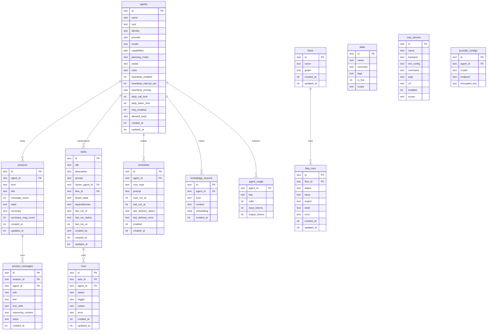

# SwarmGo — Veri Modeli

> ⚠️ **GÜNCEL (2026-06-15):** Depolama SQLite'tan **dosya sistemine** taşındı. Aşağıdaki
> entity'ler ve ilişkiler **kavramsal olarak geçerli**, ancak artık SQL tabloları değil
> entity-başına **JSON dosyaları** (oturumlar `session.jsonl`) olarak saklanıyor. Diske
> yazım biçimi, dizin yapısı ve eşzamanlılık için: **`_Docs/08-DEPOLAMA.md`**.

Entity modeli SwarmClaw'un şemasından türetilmiştir (başta SQLite tabloları olarak tasarlandı, sonra dosya-store'a taşındı).

## Tablolar (ER Diyagramı)

## Tablo Açıklamaları

| Tablo | Sorumluluk |
|-------|-----------|
| `agents` | Ajan tanımı: soul, kimlik, sağlayıcı, model, planlama modu; **heartbeat** ayarları; **günlük bütçe limitleri** (`daily_call_limit`/`daily_token_limit`); **araç ayarları** (`mcp_enabled`/`allowed_tools` allowlist) |
| `sessions` | Oturum: ajan ilişkisi, başlık, mesaj sayısı, durum; **compaction** özeti (`summary` + `summary_msg_count`) |
| `session_messages` | Tur geçmişi: rol, metin, araç çağrıları, akıl yürütme içeriği, aktivite izi (`steps`); **`agent_id`** = turu üreten ajan (çok-ajanlı oturumda mesaj başına ajan) |
| `agent_usage` | Ajan başına gün bazlı kullanım sayacı (çağrı + giriş/çıkış token) — bütçe guardrail'i için |
| `tasks` | Pano durumu (`board_state`), sahiplik, ajana verilen `prompt`, son çalışma özeti, bağımlılıklar. **`flow_id`** dolu ise görev "flow-backed" — çalıştırılınca ajana prompt yerine o orchestration akışı koşar. **`created_by`** = görevi oluşturan ajan ("" = kullanıcı; ajan yalnız kendi oluşturduğunu silebilir) |
| `schedules` | Cron zamanlama; ajana doğrudan `prompt` teslimi (panodan bağımsız — görev çalıştırmaz); sonraki/son çalışma + teslim durumu; etkin mi. **`expires_at`** dolu ise (opsiyonel son tarih, unix saniye) o tarihten sonra zamanlama çalışmaz ve otomatik pasifleşir (0 = süresiz) |
| `runs` | Yürütme kaydı: durum, tetikleyici (`trigger`), ajan çıktısı (`output`), hata |
| `knowledge_sources` | Doküman, journal, reflection notları + embedding |
| `mcp_servers` | İsim, taşıma (stdio; SSE/HTTP henüz yok), `command`/`args`/`url`, env config, `enabled`, `scope` (workspace) |
| `flows` | Akış tanımı: `graph` (JSON `orchestration.Graph` — agent/branch/parallel node) |
| `flow_runs` | Akış yürütmesi: durum, girdi/çıktı, **restart-safe** `state` (her node sonrası persist), hata |
| `artifacts` | Ajanın ürettiği kalıcı, sürümlenen içerik (doküman/kod/HTML/metin/SVG/Mermaid). `kind`+`language`, güncel `content`/`version` ve **inline revizyon geçmişi** (`revisions`, eskiden yeniye); köken `session_id`/`agent_id`. Workspace-scoped — SwarmGo'nun Claude.ai artifact karşılığı |

## Güvenlik / Şifreleme

- `encrypted_key` alanları **AES-GCM** ile şifrelenir.
- Şifre anahtarı çözümü: `CREDENTIAL_SECRET` env → `DATA_DIR/credential-secret` dosyası → otomatik üretim.
- Sırlar asla düz metin loglanmaz veya workspace manifestlerine yazılmaz.

## Ortam Değişkenleri

| Değişken | Açıklama |
|----------|----------|
| `SWARMGO_ADDR` | HTTP dinleme adresi (varsayılan loopback `127.0.0.1:8080`; geliştirmede `127.0.0.1:8090`; ağa açmak için `0.0.0.0:8090`). Loopback, Windows Güvenlik Duvarı'nın izin sormasını önler |
| `SWARMGO_DATA_DIR` | Kalıcı durum dizini (varsayılan `~/.swarmgo`) |
| `SWARMGO_WORKSPACE_DIR` | Görev workspace kökü |
| `SWARMGO_MAX_CONTEXT_TOKENS` | Bağlam sıkıştırma eşiği (varsayılan 12000) |
| `SWARMGO_KEEP_RECENT_MSGS` | Sıkıştırmada korunan son mesaj sayısı (varsayılan 8) |
| `CREDENTIAL_SECRET` | Şifreleme anahtarı |
| `ACCESS_KEY` | Dashboard auth token (hosted dağıtım) |
| `ANTHROPIC_API_KEY` | `anthropic` sağlayıcı anahtarı (claude-cli'da gerekmez) |

## Şema Evrimi (Migration yok)

> Dosya-tabanlı depolamada **SQL migration kavramı yoktur** — şema yoktur, her kayıt
> bir JSON dosyasıdır. Yeni alanlar Go model struct'ına eklenir; eski JSON dosyaları
> okunurken eksik alanlar Go'nun sıfır değerleriyle doldurulur (geriye dönük uyumlu).
> Geçmişte (SQLite döneminde) `0001_init` … `0007_message_steps` migration'larıyla
> eklenen alanlar bugün ilgili model struct'larında yaşar:

- **Ana entity'ler** (eski `0001_init`): agents, sessions, session_messages, tasks,
  schedules, runs, knowledge_sources, mcp_servers — `models*.go`.
- **Heartbeat** (eski `0002`): `Agent.Heartbeat*` alanları.
- **Tasks/Schedules** (eski `0003`): `Task.Prompt/LastRun*`, `Schedule.TaskID/Prompt`, `Run.Output/Trigger`.
- **Context/Budget** (eski `0004`): `Session.Summary*`, `Agent.Daily*Limit`, `Usage` (gün-bazlı dosya).
- **MCP/Tools** (eski `0005`): `MCPServer.Command/Args/URL/Enabled/Scope`, `Agent.MCPEnabled/AllowedTools`.
- **Flows** (eski `0006`): `Flow.Graph`, `FlowRun` (restart-safe `State` JSON, status/input/output/error).
- **Message steps** (eski `0007`): `Message.Steps` (JSON `[]TurnStep`: zengin sohbet tur izi — thinking/ara metin/tool çağrıları).

Diske yazım ve dizin yapısı için: **`_Docs/08-DEPOLAMA.md`**.
