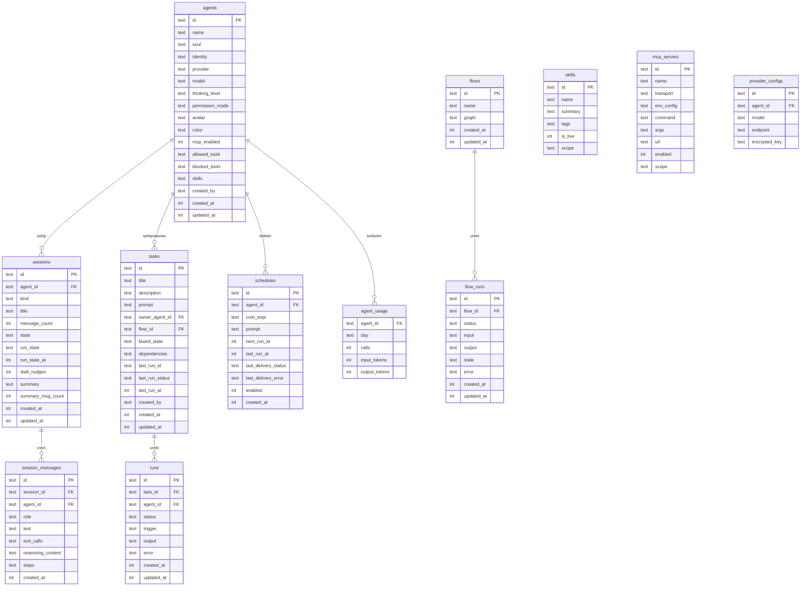

# TionSwarm — Veri Modeli

> ⚠️ **GÜNCEL (2026-06-15):** Depolama SQLite'tan **dosya sistemine** taşındı. Aşağıdaki
> entity'ler ve ilişkiler **kavramsal olarak geçerli**, ancak artık SQL tabloları değil
> entity-başına **JSON dosyaları** (oturumlar `session.jsonl`) olarak saklanıyor. Diske
> yazım biçimi, dizin yapısı ve eşzamanlılık için: **`_Docs/08-DEPOLAMA.md`**.

Entity modeli başta SQLite tabloları olarak tasarlandı, sonra dosya-store'a taşındı.

## Tablolar (ER Diyagramı)

## Tablo Açıklamaları

| Tablo | Sorumluluk |
|-------|-----------|
| `agents` | Ajan tanımı: soul, kimlik, sağlayıcı, model, `thinking_level`, `permission_mode`; **araç ayarları** (`mcp_enabled`; `blocked_tools` ajan denylist = varsayılan tüm araçlar açık, listelenenler engelli; `allowed_tools` legacy allowlist yalnız subagent profilleri için). *(Per-ajan günlük bütçe limitleri 2026-07-01'de kaldırıldı.)* **`deleted`/`deleted_at`** = yumuşak silme: ajan silinince kaydı **durur** ve sahip olduğu **oturumlar da durur** — geçmiş sohbetler okunur kalsın, yazarı ham id'ye düşmek yerine gerçek adıyla "silinmiş" görünsün diye. `ListAgents` silinmişleri eler (roster/seçiciler onu asla sunamaz), `GetAgent` elemez (geçmiş render'ı çözsün), `/api/agents` ise bayrakla **hepsini** döner — istemci `agents` (canlı) / `allAgents` (hepsi) diye ayırır. Zamanlamalar ve sahip olunan görevler+run'lar gerçekten silinir (ileriye dönük; ajansız çalışamazlar). **Çalışan ajan silinemez:** tek karar noktası `Runtime.AgentBusy` — ajanın sahip olduğu **ve katıldığı** oturumları canlı kayıtlarla kesiştirir, artı ajana atanmış koşan run'a bakar. Silmenin **iki** yolu da (HTTP `handleDeleteAgent` → **409**, ve self-management `delete_agent` aracı → hata) aynı fonksiyondan geçer; yalnız birini koruyan bir kontrol, koruma gibi göründüğü için hiç kontrol olmamasından kötüdür. Canlı kayıtlar oturum-bazlıdır ve **interaktif** turlar api sunucusunda yaşadığı için `Manager.SetExternalActiveSessions` ile runtime'a enjekte edilir (`SetAutonomousInteraction` ile aynı desen); enjeksiyon olmadan runtime yalnız otonom işleri görürdü. |
| `sessions` | Oturum: ajan ilişkisi, başlık, mesaj sayısı, durum; **compaction** özeti (`summary` + `summary_msg_count`). **`state` ile `run_state` KARIŞTIRILMAMALI** — aşağıya bakın |
| `session_messages` | Tur geçmişi: rol, metin, araç çağrıları, akıl yürütme içeriği, aktivite izi (`steps`); **`agent_id`** = turu üreten ajan (çok-ajanlı oturumda mesaj başına ajan) |
| `agent_usage` | Ajan başına gün bazlı kullanım sayacı (çağrı + giriş/çıkış token) — `db.Usage`, `store_usage.go`. **Yalnız takip/raporlama** (Tasarruf Merkezi + spend metre); limit uygulamaz |
| `tasks` | Pano durumu (`board_state`), sahiplik, ajana verilen `prompt`, son çalışma özeti, bağımlılıklar. **`flow_id`** dolu ise görev "flow-backed" — çalıştırılınca ajana prompt yerine o orchestration akışı koşar. **`created_by`** = görevi oluşturan ajan ("" = kullanıcı; yalnız köken/görüntü, silme kapısı değil) |
| `schedules` | Cron zamanlama; ajana doğrudan `prompt` teslimi (panodan bağımsız — görev çalıştırmaz); sonraki/son çalışma + teslim durumu; etkin mi. **`expires_at`** dolu ise (opsiyonel son tarih, unix saniye) o tarihten sonra zamanlama çalışmaz ve otomatik pasifleşir (0 = süresiz) |
| `runs` | Yürütme kaydı: durum, tetikleyici (`trigger`), ajan çıktısı (`output`), hata |
| ~~`knowledge_sources`~~ | **KALDIRILDI (2026-07-05)** — hafıza alt sistemiyle birlikte çıkarıldı |
| `mcp_servers` | İsim, taşıma (stdio; SSE/HTTP henüz yok), `command`/`args`/`url`, env config, `enabled`, `scope` (workspace). **`created_by`** = sunucuyu ekleyen ajan ("" = kullanıcı tanımlı; yalnız köken/görüntü, silme kapısı değil) |
| `flows` | Akış tanımı: `graph` (JSON `orchestration.Graph` — agent/branch/parallel node). **`created_by`** = akışı oluşturan ajan ("" = kullanıcı) |
| `flow_runs` | Akış yürütmesi: durum, girdi/çıktı, **restart-safe** `state` (her node sonrası persist), hata |
| `artifacts` | Ajanın ürettiği kalıcı içerik. **Sürümlenmez** — `update` içeriği yerinde ezer (revizyon geçmişi yok). `kind` ∈ metin kindleri (`markdown`/`code`/`html`/`text`/`svg`/`mermaid`) **veya** medya/dosya kindleri (`image`/`video`/`audio`/`file`) + `language` (kod için). Metin kindlerinde gövde diskte `artifacts/<session>/<id><ext>` altında tutulur, JSON `content_file` ile referanslar (yükte `content`'e okunur). Medya/dosya kindlerinde bytes diskte yaşar, `source_path` (workspace-göreli) ile referanslanır — `create_artifact sourcePath` ile verilen workspace-dışı dosyalar `artifacts/`'a kopyalanır. `origin` ∈ `chat`/`manual`/`tool` (+ tarihsel `agent` — otomatik yakalama kaldırıldı, yeni artifact üretmez); köken `session_id`/`agent_id`. **Otomatik yakalama YOK:** artifact yalnız araçla (`create_artifact`/`update_artifact`) veya API/UI ile bilerek oluşturulur; dosya yazmak artifact üretmez. Workspace-scoped — TionSwarm'nun Claude.ai artifact karşılığı |

> **`state` (görünürlük) ve `run_state` (koşu sonucu) AYRI alanlardır.**
>
> - **`state`** yalnız iki değer alır: `active` | `archived`. Bu bir **görünürlük**
>   alanıdır — kenar çubuğu filtresi (`SessionsSidebar.tsx`) ve API doğrulaması
>   (`internal/api/sessions.go`, `handleSetSessionState`) tam olarak bu iki değere
>   bağlıdır. Buraya bir koşu sonucu yazmak her ikisini de bozar.
> - **`run_state`** oturumun **son arka plan (worker) turunun nasıl bittiğini**
>   saklar; değerler `turnoutcome.go`'daki sabitlerdir: `completed` | `failed` |
>   `killed` | `timeout` | `incomplete`. Yanında `run_state_at` (unix saniye)
>   damgası bulunur. `internal/agent/coordination.go` içinde, tur sonucu
>   sınıflandırıldıktan **sonra** ve **her dal için** yazılır — sağlayıcı hatasıyla
>   ölen ya da iptal edilen bir koşu da `failed`/`killed` olarak kaydedilir.
>
> Amaç kalıcılık: transkript mesajı, `worker` olayı ve etiketler yalnız o an
> yayınlanan sinyallerdir; yeniden başlatmadan sonra **bitmiş bir worker'ı canlı
> olanından ayırt eden tek şey** `run_state`'tir. **Runtime'a aittir, salt-okunur**
> olarak sunulur — API'nin oturum güncelleme uçları bu alanı girdi olarak kabul
> etmez. `omitempty`: alanı taşımayan eski `session.json` dosyaları **olduğu gibi
> yüklenir**, hiçbir migrasyon diskteki dosyaları yeniden yazmaz; eski oturumlarda
> `run_state` basitçe boştur.
>
> **`stall_nudges`** koordinatör "hayalet spawn" sayacıdır (bkz. `_Docs/47`):
> bellekteki ardışık seri (`slot.spawnHallucStreak`) temiz bir koordinasyon
> çağrısında sıfırlanır ve süreçle birlikte kaybolur; bu alan ise **kümülatif** ve
> yeniden başlatmaya dayanıklıdır, böylece sonraki bir eskalasyon katmanı geçmişe
> bakarak karar verebilir.

> **Köken (provenance) konvansiyonu — `created_by`:** Self-management ile ajan
> tarafından oluşturulabilen entity'ler (`agents`, `tasks`, `schedules`, `flows`,
> `automations`, `hooks`, `mcp_servers`, `artifacts`, **`workspaces`** — `workspaces.json`
> `createdBy`) ortak bir `created_by` (artifacts'te `agent_id`) alanı taşır: **boş** =
> kullanıcı tarafından (UI/API) oluşturulmuş; **ajan id'si** = o ajan tarafından bir
> self-management tool'u ile oluşturulmuş. **2026-08-05'ten beri bu alan çoğu türde
> yalnız köken/görüntü amaçlıdır — silme/düzenleme kapısını kapatmaz.** Eskiden ajan
> yalnız ajan-oluşturduğunu düzenleyip silebilirdi; bu guard `agents`/`tasks`/
> `schedules`/`flows`/`automations`/`hooks`/`mcp_servers`/`artifacts` için **kaldırıldı**.
> **Tek istisna `workspaces`:** benzersiz yıkıcı olduğu için (tüm workspace verisini
> siler) köken guard'ı **workspace silmede korunur** — ajan yalnız kendi oluşturduğu
> (`createdBy` dolu) workspace'i silebilir.
> (Workspace silmede ayrıca **mevcut çalıştığı** ve **son kalan** workspace
> operasyonel olarak korumalı kalır; ajan ayrıca **kendini** silemez.)

## Güvenlik / Şifreleme

- `encrypted_key` alanları **AES-GCM** ile şifrelenir.
- Şifre anahtarı çözümü: `CREDENTIAL_SECRET` env → `DATA_DIR/credential-secret` dosyası → otomatik üretim.
- Sırlar asla düz metin loglanmaz veya workspace manifestlerine yazılmaz.

## Ortam Değişkenleri

| Değişken | Açıklama |
|----------|----------|
| `TIONSWARM_ADDR` | HTTP dinleme adresi (varsayılan loopback `127.0.0.1:8080`; geliştirmede `127.0.0.1:8090`; ağa açmak için `0.0.0.0:8090`). Loopback, Windows Güvenlik Duvarı'nın izin sormasını önler |
| `TIONSWARM_DATA_DIR` | Kalıcı durum dizini (varsayılan `~/.tionswarm`) |
| `TIONSWARM_WORKSPACE_DIR` | Görev workspace kökü |
| `TIONSWARM_MAX_CONTEXT_TOKENS` | Bağlam sıkıştırma eşiği (varsayılan 12000) |
| `TIONSWARM_KEEP_RECENT_MSGS` | Sıkıştırmada korunan son mesaj sayısı (varsayılan 8) |
| `CREDENTIAL_SECRET` | Şifreleme anahtarı |
| `ACCESS_KEY` | Dashboard auth token (hosted dağıtım) |
| `ANTHROPIC_API_KEY` | `anthropic` sağlayıcı anahtarı (claude-cli'da gerekmez) |

## Şema Evrimi (Migration yok)

> Dosya-tabanlı depolamada **SQL migration kavramı yoktur** — şema yoktur, her kayıt
> bir JSON dosyasıdır. Yeni alanlar Go model struct'ına eklenir; eski JSON dosyaları
> okunurken eksik alanlar Go'nun sıfır değerleriyle doldurulur (geriye dönük uyumlu).
> Geçmişte (SQLite döneminde) `0001_init` … `0007_message_steps` migration'larıyla
> eklenen alanlar bugün ilgili model struct'larında yaşar:

- **Ana entity'ler** (eski `0001_init`): agents, sessions, session_messages, tasks,
  schedules, runs, mcp_servers — `models*.go`. (`knowledge_sources` 2026-07-05'te kaldırıldı.)
- **Tasks/Schedules** (eski `0003`): `Task.Prompt/LastRun*`, `Schedule.TaskID/Prompt`, `Run.Output/Trigger`.
- **Context/Budget** (eski `0004`): `Session.Summary*`, `Usage` (gün-bazlı dosya). *(`Agent.Daily*Limit` alanları 2026-07-01'de kaldırıldı.)*
- **MCP/Tools** (eski `0005`): `MCPServer.Command/Args/URL/Enabled/Scope`, `Agent.MCPEnabled/AllowedTools`. **Ajan denylist (2026-06-26):** `Agent.BlockedTools` (JSON dizi) eklendi — ajan-düzeyi araç erişimi allowlist'ten denylist'e geçti; varsayılan tüm araçlar açık, listelenenler engelli. `AllowedTools` legacy (subagent profilleri); eski allowlist'ler `GET tools`'ta denylist'e çevrilir, ilk kaydetmede temizlenir. Eski JSON'da boş → "[]" (geriye uyumlu). **Yeni-agent default (2026-06-29):** `db.CreateAgent` `MCPEnabled=false` (Go zero value) gelen çağrıları `true`'ya çevirir — tüm oluşturma yolları (UI/API `POST /api/agents`, market/ingest install, workspace-template seeding, `create_agent` self-management aracı) tutarlı şekilde **tool-açık** ajan üretir. Chat-only ajan isteyen sonradan `UpdateAgentTools` ile `MCPEnabled=false`'ya çekebilir (`POST /api/agents/{id}/tools`). Test: `TestCreateAgent_DefaultsMCPEnabledOn` + `TestUpdateAgentTools_Toggle` (`internal/db/store_agent_default_test.go`). **Ajan araç override haritası (2026-07-27):** `Agent.ToolOverrides` (JSON object: araç adı veya `prefix*` deseni → tier) eklendi — 4 görünürlük tier'ı + `blocked` tek skalada birleşti, `blocked` eski denylist'in yerini aldı. `BlockedTools` artık **türetilmiş ayna**: `UpdateAgentTools` her yazışta `blocked` girdilerinden sıralı üretip yazar (eski okuyucular + market/şablon paketleri bozulmaz). Okuma daima `agent.ParseToolOverrides` üzerinden — legacy denylist `blocked` olarak katlanır. Detay `_Docs/19`.
- **Self-management köken** (sürümsüz, son eklenen): `created_by` alanı `Agent`/`Task`/`Schedule`/`Flow`/`Hook`/`MCPServer` struct'larına eklendi (boş = kullanıcı). Eski JSON dosyaları okunurken boş kalır → kullanıcı varlığı sayılır (geriye dönük uyumlu). **Not (2026-08-05):** alan artık yalnız köken/görüntü amaçlı; silme/düzenleme kapısı olarak kullanılmıyor.
- **Flows** (eski `0006`): `Flow.Graph`, `FlowRun` (restart-safe `State` JSON, status/input/output/error).
- **Message steps** (eski `0007`): `Message.Steps` (JSON `[]TurnStep`: zengin sohbet tur izi — thinking/ara metin/tool çağrıları).

Diske yazım ve dizin yapısı için: **`_Docs/08-DEPOLAMA.md`**.
