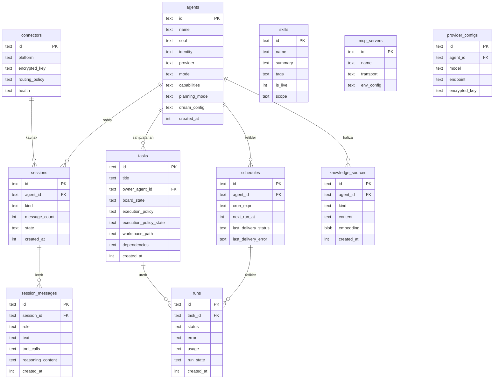

# SwarmGo — Veri Modeli

SwarmClaw'un SQLite şemasını temel alır. Veritabanı: **modernc.org/sqlite** (saf Go, CGO gerektirmez).

## Tablolar (ER Diyagramı)

## Tablo Açıklamaları

| Tablo | Sorumluluk |
|-------|-----------|
| `agents` | Ajan tanımı: isim, ruh (soul), kimlik, sağlayıcı, model, yetenekler, planlama modu |
| `sessions` | Oturum: ajan/chatroom ilişkisi, mesaj sayısı, durum |
| `session_messages` | Tur geçmişi: rol, metin, araç çağrıları, akıl yürütme içeriği |
| `tasks` | Pano durumu, sahiplik, yürütme politikası, workspace yolu, bağımlılıklar |
| `schedules` | Cron/interval zamanlama, sonraki çalışma, son teslim durumu |
| `runs` | Yürütme kaydı: durum, hata, kullanım (token), restart için run state |
| `connectors` | Platform, şifreli kimlik, yönlendirme politikası, sağlık |
| `knowledge_sources` | Doküman, journal, reflection notları + embedding |
| `skills` | İsim, özet, etiket, canlı/taslak, kapsam |
| `mcp_servers` | İsim, taşıma (stdio/SSE/HTTP), env config |
| `provider_configs` | Ajan başına LLM override: model, endpoint, anahtar |

## Güvenlik / Şifreleme

- `encrypted_key` alanları **AES-GCM** ile şifrelenir.
- Şifre anahtarı çözümü: `CREDENTIAL_SECRET` env → `DATA_DIR/credential-secret` dosyası → otomatik üretim.
- Sırlar asla düz metin loglanmaz veya workspace manifestlerine yazılmaz.

## Ortam Değişkenleri

| Değişken | Açıklama |
|----------|----------|
| `SWARMGO_DATA_DIR` | Kalıcı durum dizini (varsayılan `~/.swarmgo`) |
| `SWARMGO_WORKSPACE_DIR` | Görev workspace kökü |
| `CREDENTIAL_SECRET` | Şifreleme anahtarı |
| `ACCESS_KEY` | Dashboard auth token (hosted dağıtım) |
| `ANTHROPIC_API_KEY` / `OPENAI_API_KEY` ... | Sağlayıcı anahtarları |
| `DISCORD_BOT_TOKEN` / `SLACK_BOT_TOKEN` ... | Connector anahtarları |

## Migration Stratejisi

- Sürümlü SQL migration dosyaları: `internal/db/migrations/0001_init.sql`, ...
- Uygulama açılışında otomatik uygulanır (golang-migrate veya basit kendi runner).
- Şema değişiklikleri geriye dönük uyumlu tutulur.
