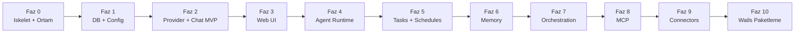

# SwarmGo — Yol Haritası (Aşama Aşama)

> İlke: **MVP ile başla, katman katman büyüt.** Her faz çalışan ve test edilebilir bir çıktı verir.

---

> **Durum (2026-06-15):** Faz 0–6 + Ara Faz (Workspace İzolasyonu) + Faz 6.5 (Sağlamlaştırma) + **Faz 8 (Tool-use + MCP)** + **Faz 7 (Orchestration)** tamamlandı ve Chrome'da canlı test edildi. (Faz 8, kullanıcı talebiyle Faz 7'den önce yapıldı.) Ayrıca üç plan-dışı **ara özellik** eklendi: otomatik başlık (auto-title), uygulama-geneli **Ayarlar ekranı** (`internal/settings`, şifreli `settings.json`) ve **zengin sohbet arayüzü** (Chat UX: markdown/tool kartları/diff/görsel — [07-CHAT-UX.md](07-CHAT-UX.md)). Sıradaki: **Faz 9 — Connectors.** Aşağıda ✅ tamamlanan, parantez içinde **gerçekle ayrışan** kararlar belirtilmiştir. Canlı detay: [05-ILERLEME.md](05-ILERLEME.md).

## Faz 0 — İskelet ve Ortam ✅
- [x] Go kurulumu (1.26.4)
- [x] Proje klasör yapısı + `go mod init`
- [x] `_Docs` plan dokümanları
- [x] `main.go` temel HTTP sunucu (health check)
- [~] Wails v2 → **Faz 10'a ertelendi**
- **Çıktı:** `go run` ile ayağa kalkan, `/health` dönen sunucu. ✅

## Faz 1 — Kalıcılık ve Config ✅
- [x] `internal/db`: (başlangıçta SQLite + migration runner; **2026-06-15'te dosya-tabanlı store'a taşındı** — JSON/JSONL, DB yok, bkz. `08-DEPOLAMA.md`)
- [x] `internal/config`: env + AES-GCM credential secret
- **Çıktı:** Açılışta veriyi diskten yükleyen uygulama. ✅

> › **Güncelleme (2026-06-15):** SQLite (`modernc.org/sqlite`), migration runner ve `migrations/*.sql` tamamen kaldırıldı; kalıcılık bellek-içi maps + atomik diske yazma ile dosya sistemine taşındı.

## Faz 2 — Provider Katmanı + Chat MVP ✅
- [x] `internal/providers`: `Provider` arayüzü
- [x] **anthropic** (SDK yerine ince HTTP istemci) **+ claude-cli** (anahtarsız, OAuth/abonelik) **+ minimax** (OpenAI-uyumlu)
- [x] Streaming → **SSE** ile geldi (`POST /api/chat/stream`, Chat UX fazında — bkz. [07-CHAT-UX.md](07-CHAT-UX.md))
- [x] `/api/chat`: mesaj → LLM → DB
- **Çıktı:** Çok-turlu sohbet, hafıza korunuyor. ✅

## Faz 3 — Web UI ✅
- [x] `frontend/`: React + Vite + TS + **Tailwind v4** (shadcn/ui yerine kendi bileşenlerimiz)
- [x] Chat ekranı (mesaj listesi + composer, optimistic UI)
- [x] Canlı streaming → **SSE** (WebSocket değil) ile sonradan eklendi — bkz. [07-CHAT-UX.md](07-CHAT-UX.md)
- [x] Ajan listesi / oluşturma
- **Çıktı:** Tarayıcıdan kullanılabilir koyu temalı arayüz. ✅

## Faz 4 — Agent Runtime ✅
- [x] `internal/agent`: goroutine tabanlı ajan döngüsü (worker.go)
- [x] Wake signal (heartbeat `time.Ticker` + manuel wake kanalı)
- [~] Tool loop → bu fazda yoktu; **Faz 8'de eklendi** (`agent/toolloop.go`)
- [x] Outcome classification + exponential backoff (10 hata → devre dışı)
- **Çıktı:** Otonom çalışan, kendi kendine uyanan ajan. ✅

## Ara Faz — Workspace İzolasyonu ✅ (plan dışı, kullanıcı talebiyle)
- [x] Her workspace = ayrı `store/` dizini + ayrı Runtime + ayrı Scheduler (fiziksel ayrım)
- [x] `internal/workspace/manager.go`, `withWorkspace` middleware, switcher UI
- **Çıktı:** Sızıntısız çoklu workspace. Detay: [06-WORKSPACES.md](06-WORKSPACES.md). ✅

## Faz 5 — Tasks + Schedules ✅
- [x] Görev panosu (kanban), `tasks`/`runs` CRUD, `RunTask` executor ("şimdi çalıştır" + run geçmişi)
- [~] Delegasyon (alt-ajan) → **Faz 7'ye taşındı**
- [x] `internal/agent/scheduler.go`: `robfig/cron` (workspace başına)
- [x] UI: Task board + Schedules ekranı
- **Çıktı:** Zamanlanmış görev/prompt teslimi. ✅

## Faz 6 — Memory ✅
- [x] `internal/memory`: doküman + journal + reflection
- [x] Recall: **embedding yerine saf Go lexical cosine** (anahtarsız/çevrimdışı; embedding ileride takılabilir)
- [x] Dream cycle (`Reflect`) — journal'ı provider'a özetletip reflection üret
- **Çıktı:** Hatırlayan, yansıtan ajanlar; sohbet+göreve otomatik enjeksiyon. ✅

## Faz 6.5 — Sağlamlaştırma ✅ (plan dışı, SwarmClaw kıyas açığı)
- [x] `internal/conversation`: token-bütçeli **compaction** (rolling summary)
- [x] Otonom döngü **bütçe guardrail'i** (`guardedComplete` + `agent_usage`, ajan başına günlük limit)
- [x] UI: context + bütçe meter; 3 kolonlu yerleşim (NavRail)
- **Çıktı:** Uzun oturumlarda taşma yok, otonom maliyet sınırlı. ✅

## Faz 7 — Orchestration ✅ (Faz 8'den sonra yapıldı)
- [x] `internal/orchestration`: graf motoru (`model.go`/`engine.go`), yapılandırılmış akışlar
- [x] Branch / parallel join (agent/branch/parallel node; `maxSteps` döngü guard)
- [x] Şablon sistemi (`{{input}}`/`{{last}}`/`{{node.<id>}}`) + restart-safe run state (`flow_runs`, her node sonrası persist + boot'ta resume)
- [x] UI: görsel protokol builder (`FlowsPanel.tsx`, "🔀 Akışlar")
- [~] Loop node → **henüz yok** (branch + maxSteps ile döngüler dolaylı kurulabilir)
- **Çıktı:** Çok adımlı, dallanan iş akışları. ✅

## Faz 8 — Tool-use + MCP Entegrasyonu ✅ (Faz 7'den önce yapıldı)
- [x] `internal/mcp`: **SDK yerine elle JSON-RPC 2.0** istemci (mark3labs/mcp-go değil — bağımlılıksız felsefe)
- [~] Transport: **yalnızca stdio**; SSE / HTTP → henüz yok (net "desteklenmiyor")
- [x] Native tool-use protokolü (`providers` ToolDef/ToolCall/ToolResult + anthropic content-block + `agent/toolloop.go`) **ve** anahtarsız claude-cli MCP delegasyonu (`--mcp-config`)
- [x] `internal/tools`: built-in (get_current_time/http_get/memory_recall) + MCP birleşik registry; ajan başına `mcp_enabled` + allowlist
- [x] UI: "🔌 Araçlar" paneli (`ToolsPanel.tsx`) + "🔀 Akışlar"
- **Çıktı:** Harici MCP sunucularına bağlanan, araç kullanan ajanlar. ✅

## Faz 9 — Connectors
- [ ] `internal/connectors`: Discord (discordgo) ilk
- [ ] Outbox retry kuyruğu + dedup
- [ ] Slack, Telegram ekleme
- [ ] Group policy gate
- **Çıktı:** Mesajlaşma platformlarından erişilen ajanlar.

## Faz 10 — Wails Paketleme + Çoklu Platform
- [ ] Wails ile native pencere entegrasyonu
- [ ] `wails build` → Windows `.exe`
- [ ] GitHub Actions: Win/macOS/Linux otomatik derleme
- **Çıktı:** Dağıtıma hazır masaüstü uygulaması.

---

## Önceliklendirme Notu

İlk **görünür sonuç** Faz 3'te (çalışan chat UI). Buraya kadar olan kısım (Faz 0-3) projenin "iskelet + nabız" aşamasıdır ve en kritik temeli atar. Sonraki fazlar bu temelin üzerine eklenir.
