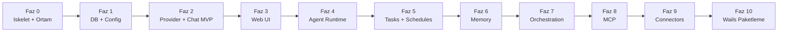

# SwarmGo — Yol Haritası (Aşama Aşama)

> İlke: **MVP ile başla, katman katman büyüt.** Her faz çalışan ve test edilebilir bir çıktı verir.

---

## Faz 0 — İskelet ve Ortam ✅ (devam ediyor)
- [x] Go kurulumu (1.26.4)
- [x] Proje klasör yapısı
- [x] `go mod init`
- [x] `_Docs` plan dokümanları
- [ ] Wails v2 CLI kurulumu
- [ ] `main.go` temel HTTP sunucu (health check)
- **Çıktı:** `go run` ile ayağa kalkan, `/health` dönen sunucu.

## Faz 1 — Veritabanı ve Config
- [ ] `internal/db`: SQLite bağlantısı (modernc.org/sqlite)
- [ ] Migration runner + `0001_init.sql` (agents, sessions, session_messages tabloları)
- [ ] `internal/config`: env okuma + credential secret (AES-GCM)
- **Çıktı:** Açılışta DB oluşturan, şema migrate eden uygulama.

## Faz 2 — Provider Katmanı + Chat MVP
- [ ] `internal/providers`: `Provider` arayüzü
- [ ] İlk implementasyon (Anthropic **veya** Ollama — kullanıcı seçimi)
- [ ] Streaming desteği
- [ ] `/api/chat` ucu: mesaj gönder → LLM cevabı al → DB'ye yaz
- **Çıktı:** Tek ajanla terminal/HTTP üzerinden sohbet.

## Faz 3 — Web UI (Kendi Tasarımımız)
- [ ] `frontend/`: React + Vite + Tailwind + shadcn/ui kurulumu
- [ ] Chat ekranı (mesaj listesi + giriş kutusu)
- [ ] WebSocket ile canlı streaming
- [ ] Ajan listesi / oluşturma ekranı
- **Çıktı:** Tarayıcıdan kullanılabilir sohbet arayüzü.

## Faz 4 — Agent Runtime
- [ ] `internal/agent`: goroutine tabanlı ajan döngüsü
- [ ] Wake signal (heartbeat `time.Ticker` + mesaj)
- [ ] Context assembly (geçmiş + görevler)
- [ ] Tool loop (araç çağrısı parse + çalıştır)
- [ ] Outcome classification + backoff (10 hata → devre dışı)
- **Çıktı:** Otonom çalışabilen, kendi kendine uyanan ajan.

## Faz 5 — Tasks + Schedules
- [ ] `internal/tasks`: pano, atama, durum akışı
- [ ] Delegasyon (ajan → alt-ajan görev oluşturma)
- [ ] `internal/agent/scheduler.go`: robfig/cron entegrasyonu
- [ ] Retry / deadletter mantığı
- [ ] UI: Task board ekranı
- **Çıktı:** Zamanlanmış ve delege edilen görevler.

## Faz 6 — Memory
- [ ] `internal/memory`: doküman + journal + reflection
- [ ] Embedding tabanlı recall (opsiyonel)
- [ ] Dream cycle (arka plan konsolidasyon)
- **Çıktı:** Hatırlayan, yansıtan ajanlar.

## Faz 7 — Orchestration
- [ ] `internal/orchestration`: yapılandırılmış oturumlar
- [ ] Branch / loop / parallel join
- [ ] Şablon sistemi + restart-safe run state
- [ ] UI: görsel protokol builder (basit sürüm)
- **Çıktı:** Çok adımlı, dallanan iş akışları.

## Faz 8 — MCP Entegrasyonu
- [ ] `internal/mcp`: mark3labs/mcp-go ile istemci
- [ ] stdio / SSE / HTTP transport
- [ ] Ajanların MCP araçlarını kullanması
- **Çıktı:** Harici MCP sunucularına bağlanan ajanlar.

## Faz 9 — Connectors
- [ ] `internal/connectors`: Discord (discordgo) ilk
- [ ] Outbox retry kuyruğu + dedup
- [ ] Slack, Telegram ekleme
- [ ] Group policy gate
- **Çıktı:** Mesajlaşma platformlarından erişilen ajanlar.

## Faz 10 — Wails Paketleme + Çoklu Platform
- [ ] Wails ile native pencere entegrasyonu
- [ ] `wails build` → Windows `.exe`
- [ ] GitHub Actions: Win/macOS/Linux otomatik derleme
- **Çıktı:** Dağıtıma hazır masaüstü uygulaması.

---

## Önceliklendirme Notu

İlk **görünür sonuç** Faz 3'te (çalışan chat UI). Buraya kadar olan kısım (Faz 0-3) projenin "iskelet + nabız" aşamasıdır ve en kritik temeli atar. Sonraki fazlar bu temelin üzerine eklenir.
