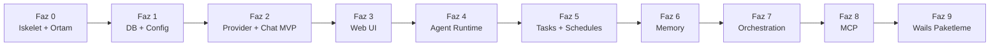

# SwarmGo — Yol Haritası (Aşama Aşama)

> İlke: **MVP ile başla, katman katman büyüt.** Her faz çalışan ve test edilebilir bir çıktı verir.

---

> **Durum (2026-06-16):** Faz 0–8 (Faz 8, Faz 7'den önce) + Workspace İzolasyonu + Faz 6.5 + SDK paritesi P1/P2 tamamlandı; ✅ işaretleri canlı durumu yansıtır. **Sıradaki:** Yapılacaklar / Backlog. Plan-dışı ara özellikler ve günlük: [05-ILERLEME.md](05-ILERLEME.md).

## Faz 0 — İskelet ve Ortam ✅
- [x] Go kurulumu (1.26.4)
- [x] Proje klasör yapısı + `go mod init`
- [x] `_Docs` plan dokümanları
- [x] `main.go` temel HTTP sunucu (health check)
- [~] Wails v2 → **Faz 9'a ertelendi**
- **Çıktı:** `go run` ile ayağa kalkan, `/health` dönen sunucu. ✅

## Faz 1 — Kalıcılık ve Config ✅
- [x] `internal/db`: (başlangıçta SQLite + migration runner; **2026-06-15'te dosya-tabanlı store'a taşındı** — JSON/JSONL, DB yok, bkz. `08-DEPOLAMA.md`)
- [x] `internal/config`: env + AES-GCM credential secret
- **Çıktı:** Açılışta veriyi diskten yükleyen uygulama. ✅

> › **Güncelleme (2026-06-15):** SQLite (`modernc.org/sqlite`), migration runner ve `migrations/*.sql` kaldırıldı; kalıcılık bellek-içi maps + atomik diske yazma ile dosya sistemine taşındı.

## Faz 2 — Provider Katmanı + Chat MVP ✅
- [x] `internal/providers`: `Provider` arayüzü
- [x] **anthropic** (SDK yerine ince HTTP istemci) **+ claude-cli** (anahtarsız, OAuth/abonelik) **+ minimax** (OpenAI-uyumlu)
- [x] Streaming → **SSE** ile geldi (`POST /api/chat/stream`, Chat UX fazında — bkz. [07-CHAT-UX.md](07-CHAT-UX.md))
- [x] `/api/chat`: mesaj → LLM → DB
- **Çıktı:** Çok-turlu sohbet, hafıza korunuyor. ✅

## Faz 3 — Web UI ✅
- [x] `frontend/`: React + Vite + TS + **Tailwind v4** (shadcn/ui yerine kendi bileşenlerimiz)
- [x] Chat ekranı (mesaj listesi + composer, optimistic UI)
- [x] Canlı streaming → **SSE** (WebSocket değil) ile sonradan eklendi — bkz. [07-CHAT-UX.md](07-CHAT-UX.md)
- [x] Ajan listesi / oluşturma
- **Çıktı:** Tarayıcıdan kullanılabilir koyu temalı arayüz. ✅

## Faz 4 — Agent Runtime ✅
- [x] `internal/agent`: goroutine tabanlı ajan döngüsü (worker.go)
- [x] Wake signal (heartbeat `time.Ticker` + manuel wake kanalı)
- [~] Tool loop → bu fazda yoktu; **Faz 8'de eklendi** (`agent/toolloop.go`)
- [x] Outcome classification + exponential backoff (10 hata → devre dışı)
- **Çıktı:** Otonom çalışan, kendi kendine uyanan ajan. ✅

## Ara Faz — Workspace İzolasyonu ✅ (plan dışı, kullanıcı talebiyle)
- [x] Her workspace = ayrı `store/` dizini + ayrı Runtime + ayrı Scheduler (fiziksel ayrım)
- [x] `internal/workspace/manager.go`, `withWorkspace` middleware, switcher UI
- **Çıktı:** Sızıntısız çoklu workspace. Detay: [06-WORKSPACES.md](06-WORKSPACES.md). ✅

## Faz 5 — Tasks + Schedules ✅
- [x] Görev panosu (kanban), `tasks`/`runs` CRUD, `RunTask` executor ("şimdi çalıştır" + run geçmişi)
- [~] Delegasyon (alt-ajan) → **Faz 7'ye taşındı**
- [x] `internal/agent/scheduler.go`: `robfig/cron` (workspace başına)
- [x] UI: Task board + Schedules ekranı
- **Çıktı:** Zamanlanmış görev/prompt teslimi. ✅

## Faz 6 — Memory ✅
- [x] `internal/memory`: doküman + journal + reflection
- [x] Recall: **embedding yerine saf Go lexical cosine** (anahtarsız/çevrimdışı; embedding ileride takılabilir)
- [x] Dream cycle (`Reflect`) — journal'ı provider'a özetletip reflection üret
- **Çıktı:** Hatırlayan, yansıtan ajanlar; sohbet+göreve otomatik enjeksiyon. ✅

## Faz 6.5 — Sağlamlaştırma ✅ (plan dışı, SwarmClaw kıyas açığı)
- [x] `internal/conversation`: token-bütçeli **compaction** (rolling summary)
- [x] Otonom döngü **bütçe guardrail'i** (`guardedComplete` + `agent_usage`, ajan başına günlük limit)
- [x] UI: context + bütçe meter; 3 kolonlu yerleşim (NavRail)
- **Çıktı:** Uzun oturumlarda taşma yok, otonom maliyet sınırlı. ✅

## Faz 7 — Orchestration ✅ (Faz 8'den sonra yapıldı)
- [x] `internal/orchestration`: graf motoru (`model.go`/`engine.go`), yapılandırılmış akışlar
- [x] Branch / parallel join (agent/branch/parallel node; `maxSteps` döngü guard)
- [x] Şablon sistemi (`{{input}}`/`{{last}}`/`{{node.<id>}}`) + restart-safe run state (`flow_runs`, her node sonrası persist + boot'ta resume)
- [x] UI: görsel protokol builder (`FlowsPanel.tsx`, "🔀 Akışlar")
- [~] Loop node → **henüz yok** (branch + maxSteps ile döngüler dolaylı kurulabilir)
- **Çıktı:** Çok adımlı, dallanan iş akışları. ✅

## Faz 8 — Tool-use + MCP Entegrasyonu ✅ (Faz 7'den önce yapıldı)
- [x] `internal/mcp`: **SDK yerine elle JSON-RPC 2.0** istemci (mark3labs/mcp-go değil — bağımlılıksız felsefe)
- [~] Transport: **yalnızca stdio**; SSE / HTTP → henüz yok (net "desteklenmiyor")
- [x] Native tool-use protokolü (`providers` ToolDef/ToolCall/ToolResult + anthropic content-block + `agent/toolloop.go`) **ve** anahtarsız claude-cli MCP delegasyonu (`--mcp-config`)
- [x] `internal/tools`: built-in (get_current_time/http_get/memory_recall) + MCP birleşik registry; ajan başına `mcp_enabled` + allowlist
- [x] UI: "🔌 Araçlar" paneli (`ToolsPanel.tsx`) + "🔀 Akışlar"
- **Çıktı:** Harici MCP sunucularına bağlanan, araç kullanan ajanlar. ✅

## Faz 9 — Wails Paketleme + Çoklu Platform
- [ ] Wails ile native pencere entegrasyonu
- [ ] `wails build` → Windows `.exe`
- [ ] GitHub Actions: Win/macOS/Linux otomatik derleme
- **Çıktı:** Dağıtıma hazır masaüstü uygulaması.

> **Not (2026-06-16):** **Connectors fazı (Discord/Slack/Telegram köprüleri) kapsamdan çıkarıldı.** İhtiyaç olursa ayrı bir faz olarak yeniden değerlendirilebilir.

---

## Yapılacaklar / Backlog (canlı liste)

> SDK paritesi (P1–P4) + `observed-behavior` mimari incelemesinden çıkan işler. Kavramsal detay: [10-KAVRAMSAL-TASARIM-NOTLARI.md](10-KAVRAMSAL-TASARIM-NOTLARI.md). Her madde bittiğinde işaretle ve [05-ILERLEME.md](05-ILERLEME.md)'ye günlük gir.

### Tamamlananlar ✅
- [x] **Faz P2** — Built-in dosya/shell araçları (sandbox'lı `read/write/edit/list/glob/grep` + gate'li `shell`)
- [x] **D2 (kısmi)** — Provider native token streaming (`Streamer`: anthropic+minimax) + claude-cli stream-json → SSE
- [x] **Faz P1** — Etkileşim araçları: `todo_write` (checklist) + `ask_user` (SSE-blok suspend/resume)
- [x] **E3** — Trace `StepKind` genişletme: `ask`/`todo`/`recovery`/`error`/`steer` + `tool_delta`/`tombstone` (akan shell üreticili) + **Ayarlar ▸ Adım Türleri** referans ekranı
- [x] **Faz A1** — Artifact sistemi: sürümlü içerik (doküman/kod/HTML/SVG/Mermaid), `create/update_artifact` araçları, Artifactlar ekranı + sohbet kartı
- [x] **İki-seviyeli araç yönetimi** — workspace-geneli aktivasyon (denylist `tools-config.json`) + ajan-bazlı seçim (allowlist); `WorkspaceToolCatalog`/`ActiveToolCatalog`/`ToolCatalog` + `GET/PUT /api/workspace-tools`
- [x] **Talep-üzerine özetler** — "/" komut paleti: hafıza/görev panosu/akışlar (ucuz model) + araç listesi (deterministik); `Runtime.Summarize` + `POST /api/sessions/{id}/summary`
- [x] **D2** — Provider **retry middleware**: `transport.go` `doWithRetry` (üstel backoff + jitter, `Retry-After` saygılı, 429/5xx/529 + ağ hatası); `postJSON`/`postSSE` sarıldı (+ token streaming `Streamer`)
- [x] **C1** — Sistem-prompt **cache sınırı**: `Request.System` (statik: persona+profil) / `Request.SystemDynamic` (dinamik: bellek+özet); Anthropic cache breakpoint yalnız statik blokta → araç+statik prefix cache'lenir, dinamik suffix cache'i bozmaz
- [x] **Ara özellikler** — otonom olay akışı (`/api/events`), workspace switcher + çapraz-ws rozet, tıklanabilir bildirimler, sessions-only sidebar + okundu/okunmadı, tema presetleri

### Sıradaki — düşük efor / yüksek değer
- [ ] **A1** — Agent loop **recovery + `continuationReason`**: kurtarma yollarını (max-token/compaction/iptal) yapısal hale getir (`recovery` StepKind hazır)

### Mimari sıçrama
- [ ] **A2** — **Subagent / Task izolasyonu**: `AgentContext` (parent'tan klon, mutasyon izole, altyapı paylaşılır) + `subagent` StepKind. SwarmGo'nun en büyük boşluğu.
- [ ] **A3** — İptal hiyerarşisi: yarım kalan tool_call'lara sentetik `cancelled` sonucu (orphan tool_use önler)

### Araç & yetki katmanı
- [ ] **B1** — Tool sözleşmesi v2: `ReadOnly()`/`ConcurrencySafe()`/`ValidateInput()` + `BaseTool` varsayılanları
- [ ] **B4** — Paralel tool yürütme (read-only'leri `errgroup`) + büyük çıktı için disk-spill + referans
- [ ] **B2** — İzin modeli (`allow/ask/deny`, arg-bazlı desen eşleme `Bash(git *)`) — `ask_user` altyapısını yeniden kullanır
- [ ] **Faz P3** — Permission/onay modu (`auto`/`ask`/`read-only`); shell'i UI onayıyla aç
- [ ] **Faz P4** — Hooks (`PreToolUse`/`PostToolUse`, subprocess JSON I/O)

### Bağlam, bellek, trace
- [ ] **C3** — memdir benzeri bellek **yazma/indeksleme** (`memory_write`, frontmatter türleri) — şu an sadece recall
- [ ] **C4** — Maliyet takibi: `cache_creation` vs `cache_read` ayrımı + oturumlar arası toplam (caching ROI)
- [ ] **E3 kalan** — `subagent` (A2 ile) + `tombstone`/`tool_delta` (canlı adım güncelleme altyapısı)
- [ ] **C2** — Compaction emniyet katmanı (`snip`) — 1M tampon var, düşük öncelik

### MCP & dağıtım
- [ ] **D1** — MCP çoklu-transport (stdio + SSE/HTTP factory) + config kapsam-zinciri (local<user<project)
- [ ] **Faz 9** — Wails paketleme (yukarıdaki Faz 9 bloğu)
- [ ] **D3** — Server/Remote/Bridge (kapsam dışı, not olarak saklanır)

---

## external-agent-oss İncelemesinden (2026-06-17)

> Kaynak: [external-agent-project/external-agent-oss](https://github.com/external-agent-project/external-agent-oss) v0.2.19→v0.10.3 (71 release) analizi. Tam gerekçe + kod-doğrulama (EXISTS/MISSING) + sürüm-sürüm liste: [13-CRAFT-AGENTS-INCELEME.md](13-CRAFT-AGENTS-INCELEME.md). Maddeler SwarmGo koduna karşı doğrulandı.

### 🔴 P0 — Doğrulanmış boşluklar (yüksek etki)
- [ ] **CG-1 — Tool çıktısı boyut sınırı**: `res.Content` → `TurnStep.Output` → JSONL'e sınırsız akıyor (`toolloop.go:254`). Persistence + modele gönderim öncesi char/byte cap (örn. 100K + "…[truncated]"). OOM + bağlam taşması + JSONL şişmesi önler. *(craft v0.4.4)* — **düşük efor / yüksek değer**
- [ ] **CG-2 — http_get SSRF koruması**: boyut cap var (64KB) ama IP/host doğrulama yok (`builtin_http.go`). localhost/127.0.0.1, özel ağlar (10/8,172.16/12,192.168/16), link-local 169.254/16, cloud-metadata engeli ekle. *(craft v0.3.2, v0.5.0)*
- [ ] **CG-3 — Thinking resolver model-sınıf farkındalığı**: `thinkingBudgetForLevel` sabit (`toolloop.go:17`). Registry'ye `requiresAdaptiveThinking` ekle; Fable/Mythos 5 sınıfı `thinking: disabled`'ı reddediyor (API 400) → "off"u low-effort adaptive'e map et. **Fable 5 eklenmeden önce şart.** *(craft v0.10.3)*
- [ ] **CG-4 — MCP şema normalizasyonu**: dış MCP `InputSchema` ham geçiyor. Provider'a göndermeden `$schema` strip et, `additionalProperties` koru, oneOf/anyOf/allOf ele al. Aksi halde tool parametreleri sessizce kaybolur / çağrı 400. *(craft v0.7.3, v0.7.5, v0.7.12)*

### 🟠 P1 — Çok-ajan mimarisine uyan
- [ ] **CG-5 — Ajanlar-arası mesajlaşma** (`send_agent_message`): bir oturumun başka aktif oturuma mesaj göndermesi. Orkestrasyon motoruyla (`orchestration`) entegre. *(craft v0.8.8)* — **A2 subagent izolasyonuyla ilişkili**
- [ ] **CG-6 — Oturum öz-yönetim araçları**: ajana `set_session_labels`/`set_session_status`/`get_session_info`/`list_sessions` built-in tool'ları → kendini-kapatan otomasyon (görev bitince status=done → trigger). *(craft v0.8.3)*
- [ ] **CG-7 — Hooks + koşullu otomasyon + webhook**: (a) command/prompt hook'ları (olay→shell/prompt), rate limiter + zorla-sonlandırma; (b) otomasyon koşulları (time/state/label gate); (c) webhook action (exp. backoff retry). `events` bus + `scheduler` ile örtüşür. *(craft v0.4.3, v0.7.5, v0.7.7)* — **Faz P4 (Hooks) ile birleştir**
- [ ] **CG-8 — Otomasyon/flow geçmişi cap + compaction**: `flow_runs` sınırla (örn. 20/flow, 1000 global) + periyodik compaction. *(craft v0.7.8)*

### 🟡 P2 — Sağlamlaştırma (file-based depolama)
- [ ] **CG-9 — Density-aware token tahmini**: sabit `chars/4` (`tokens.go:8`) base64/yoğun içerikte ~%25 eksik sayıyor → `chars/1.5` dal + tool-result eşiğini context window'a göre dinamik (floor 2K/ceil 15K). *(craft v0.9.1, v0.9.3)*
- [ ] **CG-10 — Config oto-onarım**: başlangıçta bozuk config/`~/.claude.json` (boş/BOM/invalid) tespit+onarım+backup; Windows file-lock retry. *(craft v0.2.33)*
- [ ] **CG-11 — Volatile-context kuralını koru**: tarih/saat/session-state eklenirse **yalnız `SystemDynamic`'e veya user-mesaj kuyruğuna** (statik cache prefix'e değil). Mevcut iki-parçalı tasarım zaten doğru — regression'a karşı not. *(craft v0.10.2)* ✅ tasarım uyumlu

### 🟢 P3 — Güvenlik (web UI / remote açılırsa)
- [ ] **CG-12 — URL şema blocklist**: `Markdown.tsx:58` `javascript:`/`file:`/`data:`'yı `<a href>`'e geçiriyor → blocklist + DOM href sanitization (middle/cmd-click kaçışı dahil). *(craft v0.8.12, v0.9.6)*
- [ ] **CG-13 — Shell sandbox escape**: `find -exec` vb. engelle (shell açıkken). *(craft v0.5.0)* — **Faz P3 ile birlikte**
- [ ] **CG-14 — Remote açılırsa**: WebUI auth (argon2id + JWT + rate limiter) · WS TLS zorunlu (`wss://`) · upload/artifact yollarında path-traversal sanitize doğrula · CI'da `go mod verify`. *(craft v0.8.2, v0.7.0, v0.3.2, v0.8.0)*

### 🔵 P4 — UI/UX & ekosistem (opsiyonel)
- [ ] **CG-15 — Render blokları**: Mermaid native · HTML/PDF/image/markdown preview · datatable/spreadsheet + `transform_data`. Artifact sistemine eklenebilir. *(craft v0.3.0, v0.4.2, v0.4.6, v0.9.6)*
- [ ] **CG-16 — Cross-session full-text arama** (ripgrep/Go). *(craft v0.3.1)*
- [ ] **CG-17 — Mini agents** (hafif prompt + hızlı model profili). *(craft v0.3.1)*
- [ ] **CG-18 — Session labels + auto-label + batch işlemler**. *(craft v0.2.27, v0.4.6)*
- [ ] **CG-19 — Generic OpenAI-uyumlu custom endpoint** (minimax provider'ı genelleştir) + opsiyonel Gemini/Bedrock/DeepSeek. *(craft v0.7.4, v0.5.0)*
- [ ] **CG-20 — Doküman araçları** (`markitdown`/`pdf-tool`/`xlsx-tool`) attachment işleme için. *(craft v0.6.0)*
- [ ] **CG-21 — Messaging gateway** (Telegram/WhatsApp/Lark): response mode enum + subprocess izolasyon + **erişim kontrol** (güvenlik kritik). Not: Connectors fazı kapsam dışıydı. *(craft v0.8.10, v0.9.1)*

---

## Önceliklendirme Notu

İlk **görünür sonuç** Faz 3'te (çalışan chat UI). Faz 0-3 projenin "iskelet + nabız" aşamasıdır ve en kritik temeli atar; sonraki fazlar bunun üzerine eklenir.
