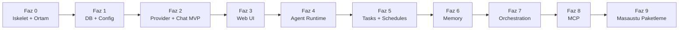

# TionHarness — Yol Haritası (Aşama Aşama)

> **Özet (2026-09-03):** Projenin faz-faz gelişim planını (Faz 0 İskelet → Faz 9 Masaüstü Paketleme) ve canlı backlog listesini (external-agent-oss/the external agent-Agent incelemelerinden türeyen P0–P4 maddeleri, mimari sıçrama, araç/yetki katmanı) tutar. Durum: **kısmen tarihsel, kısmen canlı** — Faz 0–8 tamamlandı ✅, Faz 6 (Memory) sonradan tamamen kaldırıldı (2026-07-05), Faz 9'da yalnız CI/paketleme kalemi açık. En önemli kararlar: MVP-önce-büyüt ilkesi, Wails yerine native WebView2, pasif kanban pano pivotu (2026-06-18). Backlog maddelerinin çoğu ✅ işaretli; güncel ilerleme günlüğü için `05-ILERLEME.md`'ye bakılmalı.

> İlke: **MVP ile başla, katman katman büyüt.** Her faz çalışan ve test edilebilir bir çıktı verir.

---

> **Durum (2026-06-16):** Faz 0–8 (Faz 8, Faz 7'den önce) + Workspace İzolasyonu + Faz 6.5 + SDK paritesi P1/P2 tamamlandı; ✅ işaretleri canlı durumu yansıtır. **Sıradaki:** Yapılacaklar / Backlog. Plan-dışı ara özellikler ve günlük: [05-ILERLEME.md](05-ILERLEME.md).

## Faz 0 — İskelet ve Ortam ✅
- [x] Go kurulumu (1.26.4)
- [x] Proje klasör yapısı + `go mod init`
- [x] `_Docs` plan dokümanları
- [x] `main.go` temel HTTP sunucu (health check)
- [~] Wails v2 → **Faz 9'a ertelendi**
- **Çıktı:** `go run` ile ayağa kalkan, `/health` dönen sunucu. ✅

## Faz 1 — Kalıcılık ve Config ✅
- [x] `internal/db`: (başlangıçta SQLite + migration runner; **2026-06-15'te dosya-tabanlı store'a taşındı** — JSON/JSONL, DB yok, bkz. `08-DEPOLAMA.md`)
- [x] `internal/config`: env + AES-GCM credential secret
- **Çıktı:** Açılışta veriyi diskten yükleyen uygulama. ✅

> › **Güncelleme (2026-06-15):** SQLite (`modernc.org/sqlite`), migration runner ve `migrations/*.sql` kaldırıldı; kalıcılık bellek-içi maps + atomik diske yazma ile dosya sistemine taşındı.

## Faz 2 — Provider Katmanı + Chat MVP ✅
- [x] `internal/providers`: `Provider` arayüzü
- [x] **anthropic** (SDK yerine ince HTTP istemci) **+ claude-cli** (anahtarsız, OAuth/abonelik) **+ minimax** (OpenAI-uyumlu)
- [x] Streaming → **SSE** ile geldi (`POST /api/chat/stream`, Chat UX fazında — bkz. [07-CHAT-UX.md](07-CHAT-UX.md))
- [x] `/api/chat`: mesaj → LLM → DB
- **Çıktı:** Çok-turlu sohbet, hafıza korunuyor. ✅

## Faz 3 — Web UI ✅
- [x] `frontend/`: React + Vite + TS + **Tailwind v4** (shadcn/ui yerine kendi bileşenlerimiz)
- [x] Chat ekranı (mesaj listesi + composer, optimistic UI)
- [x] Canlı streaming → **SSE** (WebSocket değil) ile sonradan eklendi — bkz. [07-CHAT-UX.md](07-CHAT-UX.md)
- [x] Ajan listesi / oluşturma
- **Çıktı:** Tarayıcıdan kullanılabilir koyu temalı arayüz. ✅

## Faz 4 — Agent Runtime ✅
- [x] `internal/agent`: goroutine tabanlı ajan döngüsü (worker.go)
- [x] Wake signal (heartbeat `time.Ticker` + manuel wake kanalı)
- [~] Tool loop → bu fazda yoktu; **Faz 8'de eklendi** (`agent/toolloop.go`)
- [x] Outcome classification + exponential backoff (10 hata → devre dışı)
- **Çıktı:** Otonom çalışan, kendi kendine uyanan ajan. ✅

## Ara Faz — Workspace İzolasyonu ✅ (plan dışı, kullanıcı talebiyle)
- [x] Her workspace = ayrı `store/` dizini + ayrı Runtime + ayrı Scheduler (fiziksel ayrım)
- [x] `internal/workspace/manager.go`, `withWorkspace` middleware, switcher UI
- **Çıktı:** Sızıntısız çoklu workspace. Detay: [06-WORKSPACES.md](06-WORKSPACES.md). ✅

## Faz 5 — Tasks + Schedules ✅
- [x] Görev panosu (kanban), `tasks`/`runs` CRUD, `RunTask` executor ("şimdi çalıştır" + run geçmişi)
- [~] Delegasyon (alt-ajan) → **Faz 7'ye taşındı**
- [x] `internal/agent/scheduler.go`: `robfig/cron` (workspace başına)
- [x] UI: Task board + Schedules ekranı
- **Çıktı:** Zamanlanmış görev/prompt teslimi. ✅
- **Kanban iyileştirme turu (2026-06-17):** ajan avatarları, sağ detay/düzenleme paneli
  (sürükle-genişlet), ajan görev tool ailesi (`builtin_taskmgmt.go`). Detay: `05-ILERLEME.md`.
- **⚠️ Pivot — Pasif durum panosu (2026-06-18):** pano artık **iş çalıştırmaz**, sadece
  durum yansıtır; iş flow/schedule/agent oturumunda yapılır. Karttan çalıştırma, cron bağlama,
  geçmiş, prompt kaldırıldı; oluşturma **açıklama** ile (başlık otomatik), Ajan/Flow opsiyonel
  bilgi etiketi. Backend temizliği: `run_task` agent tool + schedule↔task (karttan-cron) bağı
  **silindi**; ajan görev tool ailesi 5 araca indi (list/create/update/move/delete). Yetim run yolu
  da temizlendi: `RunTask`/`RunTaskStream`/`runTaskFlow` + `/run`·`/run-stream`·`/runs` uçları +
  ölü DB metotları silindi. (`db.Run` o turda korunmuştu; 2026-08-16'da entity'nin
  tamamı kaldırıldı — hiçbir yol run üretmiyordu.) Detay: `05-ILERLEME.md`.
- [~] **Görev dispatcher'ı:** pivot sonrası **kapsam dışı** — pano pasif olduğundan
  "ajan todo'yu otomatik koşar" akışı artık hedef değil. Otomasyon flow/schedule katmanında.

## Faz 6 — Memory ✅ → **KALDIRILDI (2026-07-05)**
> ⚠️ Memory alt sistemi (journal recall + core memory + hafıza grafiği + ilgili tool/API/UI/veri)
> projeden **tamamen çıkarıldı**. Aşağısı tarihsel kayıttır; bu özellikler artık yoktur.
- [x] ~~`internal/memory`: doküman + journal + reflection~~ — paket depodan **silindi**
- [x] Recall: **embedding yerine saf Go lexical cosine** (anahtarsız/çevrimdışı; embedding ileride takılabilir)
- [x] Dream cycle (`Reflect`) — journal'ı provider'a özetletip reflection üret
- **Çıktı:** Hatırlayan, yansıtan ajanlar; sohbet+göreve otomatik enjeksiyon. ✅

## Faz 6.5 — Sağlamlaştırma ✅ (plan dışı, kıyas açığı kapatma)
- [x] `internal/conversation`: token-bütçeli **compaction** (rolling summary)
- [x] Otonom döngü **bütçe guardrail'i** (`guardedComplete` + `agent_usage`, ajan başına günlük limit)
- [x] UI: context + bütçe meter; 3 kolonlu yerleşim (NavRail)
- **Çıktı:** Uzun oturumlarda taşma yok, otonom maliyet sınırlı. ✅

## Faz 7 — Orchestration ✅ (Faz 8'den sonra yapıldı)
- [x] `internal/orchestration`: graf motoru (`model.go`/`engine.go`), yapılandırılmış akışlar
- [x] Branch / parallel join (agent/branch/parallel node; `maxSteps` döngü guard)
- [x] Şablon sistemi (`{{input}}`/`{{last}}`/`{{node.<id>}}`) + restart-safe run state (`flow_runs`, her node sonrası persist + boot'ta resume)
- [x] UI: görsel protokol builder (`FlowsPanel.tsx`, "🔀 Akışlar")
- [x] Loop node ✅ (2026-07-25) — `Body`/`LoopNext`/`MaxIters`/`Until` ile gövde alt-zincirini yineler; ayrıca `await-input`/`subflow` node'ları (bkz. `62-BIRLESIK-RUN-AWAIT.md`)
- **Çıktı:** Çok adımlı, dallanan iş akışları. ✅

## Faz 8 — Tool-use + MCP Entegrasyonu ✅ (Faz 7'den önce yapıldı)
- [x] `internal/mcp`: **SDK yerine elle JSON-RPC 2.0** istemci (mark3labs/mcp-go değil — bağımlılıksız felsefe)
- [x] Transport: **stdio + Streamable HTTP** ✅; kalıcı bağlantı havuzu (`pool.go`) + hibrit kapsam (`shared`/`scoped`)
- [x] Native tool-use protokolü (`providers` ToolDef/ToolCall/ToolResult + anthropic content-block + `agent/toolloop.go`) **ve** anahtarsız claude-cli MCP delegasyonu (`--mcp-config`)
- [x] `internal/tools`: built-in (get_current_time/http_get) + MCP birleşik registry; ajan başına `mcp_enabled` + allowlist _(memory_recall sonradan KALDIRILDI 2026-07-05)_
- [x] UI: "🔌 Araçlar" paneli (`ToolsPanel.tsx`) + "🔀 Akışlar"
- **Çıktı:** Harici MCP sunucularına bağlanan, araç kullanan ajanlar. ✅

## Faz 9 — Masaüstü Paketleme + Çoklu Platform

> ⚠️ **Wails planı İPTAL (2026-06-22).** Native pencere Wails yerine **CGO'suz WebView2**
> ile çözüldü → `cmd/tionharness-desktop`. Detay: [32-NATIVE-PENCERE.md](32-NATIVE-PENCERE.md).

- [x] Native pencere entegrasyonu ✅ — WebView2 (`jchv/go-webview2`), CGO'suz
- [x] Çoklu pencere (N süreç / N pencere) ✅ — [30-COKLU-PENCERE.md](30-COKLU-PENCERE.md)
- [ ] GitHub Actions: Win/macOS/Linux otomatik derleme
- **Çıktı:** Dağıtıma hazır masaüstü uygulaması. *(Pencere kısmı tamam; kalan iş CI/paketleme.)*

> **Fikir (2026-06-22) — Sistem tepsisi (system tray) entegrasyonu.** TionHarness arka planda
> çalışan otonom-ajanlı bir runtime; masaüstü dağıtımında **tray'e küçülme + durum göstergesi**
> (kaç ajan aktif/çalışıyor) + hızlı menü (workspace aç/durdur, çıkış) + mevcut tür-bazlı
> masaüstü bildirimleriyle bütünleşme doğal bir tamamlayıcı.
> - **Önce Wails'in yerleşik tray API'sine bak** — varsa ayrı bağımlılığa gerek yok.
> - **B planı:** [`gogpu/systray`](https://github.com/gogpu/systray) — **saf Go, CGO'suz** tray
>   kütüphanesi (Win `Shell_NotifyIconW` · macOS `NSStatusBar` · Linux D-Bus
>   StatusNotifierItem). TionHarness'in "tek binary, çapraz-derleme, minimal bağımlılık"
>   felsefesiyle birebir uyumlu. **Uyarılar:** (1) v0.1.0 — çok genç, üretime erken; (2) Wails'in
>   kendi event loop'u ile systray message-pump'ı çakışabilir (özellikle macOS main-thread →
>   deadlock riski), entegrasyonda test şart. Yalnız native masaüstü modunda anlamlı; web
>   dağıtımında işlevsiz.

> **Not (2026-06-16):** **Connectors fazı (Discord/Slack/Telegram köprüleri) kapsamdan çıkarıldı.** İhtiyaç olursa ayrı bir faz olarak yeniden değerlendirilebilir.

---

## Yapılacaklar / Backlog (canlı liste)

> SDK paritesi (P1–P4) ve mimari inceleme çıktılarından türeyen işler. Her madde bittiğinde işaretle ve [05-ILERLEME.md](05-ILERLEME.md)'ye günlük gir.

### Tamamlananlar ✅

SDK paritesi P1/P2/P4, built-in fs+shell araçları, etkileşim araçları
(`todo_write`/`ask_user`), artifact sistemi, trace `StepKind` genişletmesi,
provider streaming + retry, sistem-prompt cache sınırı (C1), iki-seviyeli araç
yönetimi, lazy araç yükleme, self-management ailesi, ayarlar canlı-uygulama,
ilişki grafiği, CLI araç köprüsü, prefix'li ID'ler ve tek-binary dağıtım
**tamamlandı**.

> Madde madde döküm burada tekrarlanmaz — tarih, dosya ve doğrulama detayı için
> [05-ILERLEME.md](05-ILERLEME.md) (2026-07+) ve [05-ARSIV.md](05-ARSIV.md)
> (2026-06 ve öncesi). Alt sistemlerin kendi dokümanları:
> [19](19-LAZY-TOOL-LOADING.md) · [24](24-SELF-MANAGEMENT.md) ·
> [23](23-ILISKI-GRAFIGI.md) · [11](11-INTERACTION-MCP.md).

### Mimari sıçrama
- [x] **A2** ✅ (2026-06-19) — **Subagent / Task izolasyonu**: `AgentContext` + `runAgent` çekirdeği; `run_subagent` aracı (profil: `explore`/`coder`/`reviewer`); paralel fan-out; `subagent` StepKind + `SubagentStep.tsx`. `call_agent`/`send_agent_message` kaldırıldı; `spawn_session` native tool'dan kaldırıldı (`run_subagent` async moduna taşındı). **Detay:** `25-SUBAGENT-ISOLATION.md`.
- [x] **A3** — İptal hiyerarşisi: tur-içi iptalde (`toolloop.go`) yarım kalan tool_call'lara sentetik `cancelled` tool_result (`fillCancelledResults`) → dangling tool_use yok; `cancel_test.go` (2026-06-19)

### Araç & yetki katmanı
- [x] **B1** — ✅ **farklı çözüldü**: Tool arabirimine `ReadOnly()`/`ConcurrencySafe()` metotları eklemek yerine merkezî risk tablosu (`tools/classify.go`: `RiskRead`/`RiskWrite`/`RiskExec`) → izin katmanının tek kaynağı. Bkz. [40](40-PLAN-MODE.md).
- [x] **B4** — ✅ (2026-08-28) Paralel tool yürütme (`TurnStep.Batch` ile gruplanır, UI'da "⚡ N paralel araç çağrısı") + büyük çıktı için spill & referans deseni: eşiği (`maxToolOutputKB`, varsayılan 100 KB) aşan çıktı `capToolOutputOffload` ile tam olarak bir text artifact'e yazılır, modele baş+son+artifact kimliği döner, orta kısım `read_artifact` ile geri okunur (`internal/tools/registry.go`). Sink yoksa/yazım hata verirse düz kırpmaya düşer.
- [x] **Faz P4** — Hooks (`PreToolUse`/`PostToolUse`, subprocess JSON I/O) ✅ 2026-06-18 — `internal/agent/hooks.go`, Ayarlar → Hooks; bkz. `_Docs/18-HOOKS.md`

### Bağlam, bellek, trace
> ⚠️ **Bellek (C3/C5/C6) — KALDIRILDI (2026-07-05):** memory alt sistemi tamamen çıkarıldı;
> aşağıdaki bellek maddeleri artık geçersiz tarihsel kayıttır. Bağlam maddeleri (compaction/handoff) geçerli.
- ~~**C5 / C6 / C3**~~ — recency+importance ağırlıklı recall, MemGPT tarzı
  self-editing çekirdek bellek ve memdir benzeri `memory_write` indeksleme.
  **Hepsi 2026-07-05'te düştü** (memory alt sistemi kaldırıldı). Tarihsel tasarım:
  [`arsiv/31-MEMGPT-CORE-MEMORY.md`](arsiv/31-MEMGPT-CORE-MEMORY.md).
- [x] **C4** — Maliyet takibi: `cache_creation` vs `cache_read` ayrımı (uçtan uca) + oturumlar arası kümülatif toplam & `cacheHitRate` (caching ROI) — Bütçe ekranı pencere-kümülatif kartları + trend maliyet/tasarruf (2026-06-19)
- [~] **E3 kalan** — `subagent` StepKind ✅ (A2 ile tamamlandı); `tombstone`/`tool_delta` (canlı adım güncelleme altyapısı) — kalan
- [ ] **C2** — Compaction emniyet katmanı (`snip`) — 1M tampon var, düşük öncelik

### MCP & dağıtım
- [~] **D1** — MCP çoklu-transport: stdio + Streamable HTTP ✅ (+ hibrit `shared`/`scoped` kapsam); kalan: config kapsam-zinciri (local<user<project)
- [~] **Faz 9** — Masaüstü: native pencere ✅ (WebView2, Wails iptal); kalan: çapraz-platform CI/paketleme
- [ ] **D3** — Server/Remote/Bridge (kapsam dışı, not olarak saklanır)

---

## external-agent-oss İncelemesinden (2026-06-17)

> Kaynak: [external-agent-project/external-agent-oss](https://github.com/external-agent-project/external-agent-oss) v0.2.19→v0.10.3 (71 release) analizi. Tam gerekçe + kod-doğrulama (EXISTS/MISSING) + sürüm-sürüm liste: [13-CRAFT-AGENTS-INCELEME.md](arsiv/13-CRAFT-AGENTS-INCELEME.md). Maddeler TionHarness koduna karşı doğrulandı.

### 🔴 P0 — Doğrulanmış boşluklar (yüksek etki)
- [x] **CG-1 — Tool çıktısı boyut sınırı** ✅ **YAPILDI** (commit `69601ab`, 2026-06-17): `tools/registry.go` `capToolOutput()` (100K bayt, UTF-8 sınırında trunc + `…[truncated N bytes]`) `Registry.Call`/`CallStream`'de built-in + MCP tüm başarılı çıktılara uygulanır. `registry_cap_test.go`. *(craft v0.4.4)*
- [x] **CG-2 — http_get SSRF koruması** ✅ **YAPILDI** (commit `69601ab`, 2026-06-17): `builtin_http.go` özel `net.Dialer.Control` guard'ı çözülen IP'yi her dial'da denetler (loopback/unspecified/link-local/private/ULA/CGNAT + 169.254.169.254 metadata reddedilir; redirect/DNS-rebind kapsanır) + http/https şema kontrolü. `builtin_http_test.go`. *(craft v0.3.2, v0.5.0)*
- [x] **CG-3 — Thinking resolver model-sınıf farkındalığı** ✅ **YAPILDI** (commit `69601ab`, 2026-06-17): `providers.RequiresAdaptiveThinking(model)` + `agent.resolveThinkingBudget`; Fable/Mythos 5'te "off"/"low" → `MinAdaptiveThinkingBudget=1024`, Opus/Sonnet/Haiku değişmez. `thinking_test.go`. *(craft v0.10.3)*
- [x] **CG-4 — MCP şema normalizasyonu** ✅ **YAPILDI** (commit `69601ab`, 2026-06-17): `mcp.NormalizeSchema()` `Registry.Defs`'te her MCP şemasına uygulanır — `$schema`/`$id`/`$ref`/`$defs`/`definitions` recursive strip, kök object garanti; `additionalProperties`/`required`/`oneOf`/`anyOf`/`allOf` korunur. `normalize_test.go`. *(craft v0.7.3, v0.7.5, v0.7.12)*

### 🟠 P1 — Çok-ajan mimarisine uyan
- [x] **CG-5 — Ajanlar-arası mesajlaşma** (`send_agent_message`) ✅ **YAPILDI** (commit `69601ab`, 2026-06-17): `tools/builtin_agentmsg.go` self-manage gate'li — hedef ajanın `agent-inbox` oturumuna user-mesaj append + `Runtime.Wake` (fire-and-forget; `call_agent` senkron delegasyonun async tamamlayıcısı). `agentmsg_test.go`. Native yolunda. *(craft v0.8.8)* — **Sonraki durum (A2, 2026-06-19):** `send_agent_message` ve `call_agent` kaldırıldı; `run_subagent` ile birleştirildi.
- [~] **CG-6 — Oturum öz-yönetim araçları** *(kısmî)*: **`list_sessions`** built-in tool'u **var** (`tools/builtin_sessions.go`, cross-session farkındalık, commit `54ab736`). **Kalan:** `set_session_labels`/`set_session_status`/`get_session_info` → kendini-kapatan otomasyon (görev bitince status=done → trigger). *(craft v0.8.3)*
- [~] **CG-7 — Hooks + koşullu otomasyon + webhook** *(kısmî)*: (a) command hook'ları (olay→shell, timeout + fail-open) **✅ YAPILDI** — Faz P4 (`internal/agent/hooks.go`, bkz. `_Docs/18-HOOKS.md`); ajan da `create_hook`/`update_hook`/`delete_hook` ile yönetebilir (`_Docs/24-SELF-MANAGEMENT.md`). **Kalan:** (b) otomasyon koşulları (time/state/label gate); (c) webhook action (exp. backoff retry); prompt-hook'ları + rate limiter. `events` bus + `scheduler` ile örtüşür. *(craft v0.4.3, v0.7.5, v0.7.7)*
- [ ] **CG-8 — Otomasyon/flow geçmişi cap + compaction**: `flow_runs` sınırla (örn. 20/flow, 1000 global) + periyodik compaction. *(craft v0.7.8)*

### 🟡 P2 — Sağlamlaştırma (file-based depolama)
- [x] **CG-9 — Density-aware token tahmini** ✅ **YAPILDI** (2026-06-22, iki yarı): (1) `conversation/tokens.go`
  `estimateText` density-aware — yoğun/encoded içerik (`<%3` whitespace, ≥256 rune) **~1.5 chars/token**
  (`runes*2/3`), düz metin **~4**; "session poisoning" kapandı (`tokens_test.go`). (2) Tool eşikleri (A bayt cap +
  B eşiği) **transcript bütçesine orantılı** ölçeklenir (`Tunables.budgetScaleLocked`, `budget/12000` clamp
  [1×,5×]; A>B değişmezi korunur; `tunables_compact_test.go`). Wiring `SetContextBudget` `api` paketi paralel
  WIP'ten kurtulunca commit'lenir (dormant-güvenli). Detay: `17-TOKEN-OPTIMIZASYON.md` §4–5. *(craft v0.9.1, v0.9.3)*
- [ ] **CG-10 — Config oto-onarım**: başlangıçta bozuk config/`~/.claude.json` (boş/BOM/invalid) tespit+onarım+backup; Windows file-lock retry. *(craft v0.2.33)*
- [ ] **CG-11 — Volatile-context kuralını koru**: tarih/saat/session-state eklenirse **yalnız `SystemDynamic`'e veya user-mesaj kuyruğuna** (statik cache prefix'e değil). Mevcut iki-parçalı tasarım zaten doğru — regression'a karşı not. *(craft v0.10.2)* ✅ tasarım uyumlu

### 🟢 P3 — Güvenlik (web UI / remote açılırsa)
- [ ] **CG-12 — URL şema blocklist** *(düşük risk — kontrol edildi)*: `Markdown.tsx` `isExternal` yalnız `http(s)` eşliyor; `mailto:`/`#`/`http(s)` → `<a href>`, **diğer tüm şemalar** (`javascript:`/`file:`/`data:`/`vscode:`…) `onOpenFile` (yerel dosya) dalına düşüyor → doğrudan `href` XSS yok, ama keyfi şema string'i callback'e gidiyor. Açık allowlist/blocklist + `onOpenFile`'da şema doğrulaması ekle. *(craft v0.8.12, v0.9.6)*
- [ ] **CG-13 — Shell sandbox escape**: `find -exec` vb. engelle (shell açıkken). *(craft v0.5.0)* — **Faz P3 ile birlikte**
- [ ] **CG-14 — Remote açılırsa**: WebUI auth (argon2id + JWT + rate limiter) · WS TLS zorunlu (`wss://`) · upload/artifact yollarında path-traversal sanitize doğrula · CI'da `go mod verify`. *(craft v0.8.2, v0.7.0, v0.3.2, v0.8.0)*

### 🔵 P4 — UI/UX & ekosistem (opsiyonel)
- [ ] **CG-15 — Render blokları**: Mermaid native · HTML/PDF/image/markdown preview · datatable/spreadsheet + `transform_data`. Artifact sistemine eklenebilir. *(craft v0.3.0, v0.4.2, v0.4.6, v0.9.6)*
- [x] **CG-16 — Cross-session full-text arama** (ripgrep/Go) ✅ **YAPILDI** (2026-06-22):
  saf-Go RAM-içi tarama (`db.SearchMessages`, oturumlar boot'ta `d.messages`'a yüklü → ripgrep/FTS
  gerekmedi) + `conversation_search` ajan aracı (**N5 kapandı**) + `GET /api/sessions/search` +
  **görsel arama** (sidebar kutusu başlık+mesaj arar, sonuç→oturum/mesaj deep-link + flash). Plan +
  uygulama notu: [`27-CROSS-SESSION-SEARCH.md`](27-CROSS-SESSION-SEARCH.md). İlişkili: **HA-1**, **N5**. *(craft v0.3.1)*
- [ ] **CG-17 — Mini agents** (hafif prompt + hızlı model profili). *(craft v0.3.1)*
- [ ] **CG-18 — Session labels + auto-label + batch işlemler**. *(craft v0.2.27, v0.4.6)*
- [x] **CG-19 — Generic OpenAI-uyumlu custom endpoint** ✅ (commit `cf7d718` generic `OpenAICompat` tool-use + `35ec373` data-instance özel sağlayıcılar: kullanıcı OpenAI- veya Anthropic-uyumlu herhangi bir ucu — OpenRouter/Gemini/Kimi/Ollama — ekleyip ajan sağlayıcısı seçebiliyor; `<think>` ayıklama `7273a62`). Bedrock/DeepSeek özel-eklenti yolundan karşılanıyor. *(craft v0.7.4, v0.5.0)*
- [ ] **CG-20 — Doküman araçları** (`markitdown`/`pdf-tool`/`xlsx-tool`) attachment işleme için. *(craft v0.6.0)*
- [ ] **CG-21 — Messaging gateway** (Telegram/WhatsApp/Lark): response mode enum + subprocess izolasyon + **erişim kontrol** (güvenlik kritik). Not: Connectors fazı kapsam dışıydı. *(craft v0.8.10, v0.9.1)*

---

## Provider ekosistemi genişletme (2026-06-18)

> Kaynak + tam analiz: [14-PROVIDER-MIMARISI-INCELEME.md](arsiv/14-PROVIDER-MIMARISI-INCELEME.md).
> İncelenen referans proje ~70 provider'ı "metadata'yı protokolden ayır" deseniyle düşük eforla ekliyor;
> TionHarness zaten aynı mimaride (CG-19). Aşağıdakiler opsiyonel genişletmeler. **Plan — uygulanmadı.**

- [x] **SC-1 — Built-in API provider preset kataloğu** (CLI değil) ✅ (2026-06-25): market'e **22 provider pack'i** eklendi (toplam 26), her biri `{id,label,kind,baseUrl,defaultModel,models}` — DeepSeek/Groq/OpenRouter/Ollama (mevcut) + xAI/Mistral/Gemini/Together/Fireworks/Perplexity/Cerebras/SambaNova/DeepInfra/Hyperbolic/Novita/Nebius/NVIDIA-NIM/Cohere/Moonshot/Qwen/Zhipu-GLM/MiniMax/SiliconFlow/GitHub-Models + Anthropic-uyumlu kimi/glm. Sıfır yeni protokol kodu; tek-tıkla market kurulumu. Betik: `gen_providers.py`. bkz. `21-MARKET.md`.
- [ ] **SC-2 — Generic CLI factory** (CLI ailesi): referans projenin `streamGenericCliChat` deseni (binary spawn + stdout satır-stream, JSON parse yok) ile yapısal çıktısı olmayan onlarca coding-CLI'yi tek handler + veri listesiyle ekle. Yeni `kind_genericcli.go` + `[]genericCLI{id,label,binary}`. **CLI işi — CLI fazı açılınca, SC-1'den sonra.**

---

## the external agent-Agent incelemesinden — Kendini-geliştiren ajan özellikleri (2026-06-19)

> Kaynak: [nousresearch/external-context-agent](https://github.com/nousresearch/external-context-agent) ("seninle büyüyen ajan")
> ile TionHarness karşılaştırması. the external agent mesajlaşma-merkezli, kendini-geliştiren bir kişisel asistan;
> TionHarness web-UI merkezli, tek-binary self-hosted orkestrasyon. İki alanda the external agent açık ara önde ve
> TionHarness'e değer katacak. **Plan — uygulanmadı; ileride eklenebilecek featureler.**

- [ ] **HA-1 — Gelişmiş hafıza: tam-metin arama + LLM özet + kullanıcı modelleme** *(yüksek değer)*:
  the external agent hafızası üç katman taşıyor — (a) **FTS5 tam-metin arama** oturumlar üzerinde (TionHarness'te
  mevcut **CG-16** ile örtüşür; Go tarafında ripgrep veya bleve/saf-Go ters-indeks ile, DB-siz
  felsefeye uygun), (b) **LLM-destekli özetleme** ile çapraz-oturum recall (TionHarness'te `Reflect`
  dream-cycle + rolling summary kısmen var; oturumlar-arası kalıcı özet indeksine genişletilir),
  (c) **Honcho-benzeri kullanıcı modelleme** — etkileşimlerden kalıcı kullanıcı profili çıkarma
  (tercihler/bağlam/davranış). TionHarness'in mevcut lexical-cosine recall'ı (Faz 6) bunun altyapısı;
  üzerine kalıcı kullanıcı-profili entity'si + oto-güncelleme eklenir. İlişkili: **CG-16**, **C3** (memory_write).
  > ✅ **(c) kullanıcı modelleme TAMAMLANDI (2026-06-23):** `human` çekirdek bloğu dream-cycle'a
  > piggyback eden bir geçişle journal'dan otomatik doldurulur (C6 / `31-MEMGPT-CORE-MEMORY.md` Parça 4b).
  > Kalan: (a) FTS5 tam-metin arama + (b) çapraz-oturum kalıcı özet indeksi.
- [ ] **HA-2 — Kendini-geliştiren prosedürel skill + skill hub** *(yüksek değer — ayırt edici)*:
  harici ajanin en özgün yanı: ajan zor bir görevi tamamladıktan sonra **kendi prosedürel skill'ini
  otonom yazar** ve tekrar kullanımla **iyileştirir** (procedural memory); skill'ler
  [agentskills.io](https://agentskills.io) merkezi hub'ında paylaşılır. TionHarness'te skill sistemi
  (dosya-tabanlı, global/workspace tier, `create_skill`/`delete_skill`) + market (HarnessPack v1)
  **zaten var** — eksik olan **otonom skill üretimi** (görev sonrası ajanın deneyimden skill
  damıtması) ve **skill'in zamanla iyileşmesi** (kullanım geri-bildirimiyle revizyon). Mevcut
  self-management skill araçları + `Reflect` döngüsü bunun temelini oluşturuyor; üzerine
  "görev-sonrası skill-damıtma" hook'u + agentskills.io uyumlu içe/dışa aktarım eklenir.
  İlişkili: market (`_Docs/21-MARKET.md`), self-management (`_Docs/24-SELF-MANAGEMENT.md`).

> **Not:** İkisi de TionHarness'in mevcut alt sistemlerinin (Faz 6 hafıza, skill sistemi, market,
> `Reflect`) **üzerine** kurulabilir; sıfırdan değil. harici ajanin diğer güçlü yanları (mesajlaşma
> gateway → **CG-21**; çoklu çalıştırma backend'i Docker/SSH/Modal → kapsam dışı/D3) ayrı maddelerde.

---

## Claude Code skill içe-aktarma (porter) — Seviye 2 (2026-06-23)

> Kaynak: bu oturumda caveman (juliusbrussee/caveman) + genel CC skill ekosistemi
> (anthropics/skills, agentskills.io, tonsofskills, alirezarezvani/claude-skills…) incelemesi.
> CC ile TionHarness skill formatının **çekirdeği aynı** (SKILL.md = frontmatter + markdown gövde)
> → "talimat" skill'leri ~kopyala-yapıştır portlanır. **Kısmen uygulandı (2026-06-24).**

- [x] **SK-IMP — Gömülü CC skill importer** *(Seviye 2)* ✅ **TAMAMLANDI (2026-06-24)** — çekirdek + local + GitHub + agent tool + UI:
  `internal/skills/import.go` (`mapCCSkill`+`Store.ImportCCSkill`): frontmatter eşler (name/description/
  when_to_use→aynı; `allowed-tools`→`always_allow`; `paths`→koşullu; version/license→aynı; source_url
  provenance; `disable-model-invocation:true`→shared değil; `user-invocable`→`user_invocable`),
  uyumsuzu (`context:fork`/`hooks`/`model`/`agent`/`effort`/slash-arg/`!`+inline-shell) **ayıklayıp
  warning** döndürür, bundled dosyaları (path-traversal reddiyle) kopyalar, workspace tier'a yazıp reload
  eder. API `POST /api/skills/import` (`source:local`, path+slug?+shared?). Testler: `import_test.go`.
  **GitHub kaynağı ✅:** `github.go` (`fetchGitHubSkill`+`parseGitHubURL`) github.com tree/blob URL'sini
  contents API ile çeker (host-allowlist; 8MB cap), `Store.ImportFromSource(source,location,…)` local|github
  ayrımını yapar. **`import_skill` aracı ✅:** self-management tool (`SkillWriter.ImportSkill` + `ImportSkillTool`,
  `toolsetup`'ta create/update/delete yanında), CLI bridge üzerinden de çalışır.
  **Canlı doğrulandı:** local `~/.claude/skills/gsd-add-tests`, GitHub `anthropics/skills/.../skill-creator`
  (bundled LICENSE.txt kopyalandı), ve claude-cli ajanı `import_skill` ile `gsd-capture` import etti.
  **UI ✅:** Skills panelinde "İçe Aktar" butonu + `SkillImportDialog` (GitHub/yerel seçici, slug, paylaşımlı
  toggle) → sonuçta slug + kopyalanan dosyalar + uyarılar gösterilir, liste yenilenip skill seçilir
  (`SkillImportDialog.tsx`, `skillApi.importSkill`). agentskills.io açık standardını hedefler. İlişkili:
  **HA-2**, `21-MARKET.md`.
  - **(eski hedef tanımı)** Market (HarnessPack) içine "Claude Code skill
  içe aktar" akışı — GitHub URL / yerel klasör → backend çeker, frontmatter eşler (name/description→aynı;
  `allowed-tools`→`always_allow`; `disable-model-invocation`→`access`; version/license/source passthrough),
  uyumsuzu (`context:fork`, `hooks:`, slash-komut, bundled script) ayıklayıp **rapor eder**, `skill_validate`
  ile doğrular, workspace tier'a kurar. agentskills.io açık standardını hedefler. İlişkili: **HA-2**, `21-MARKET.md`.
  - **Önkoşul iyileştirmeler (entegrasyondan ÖNCE — kendi skill sistemimizde).**
    > Desen kaynağı: Claude Code'un gözlemlenen skill yükleme davranışı.
    - [x] **SK-1 ✅ (2026-06-23) — Çok-dosyalı skill (bundled resources):** skill bir KLASÖR olabilsin; SKILL.md gövdesinin
      atıf yaptığı ek dosyalar (reference.md, şablon, script) on-demand `fs` ile okunsun. Bugün skill tek-dosya
      → birçok CC skill'i tam portlanamaz. **CC deseni:** `createSkillCommand` `baseDir` taşır + gövdede
      `${CLAUDE_SKILL_DIR}`/`${CLAUDE_SESSION_ID}` ikamesi → gömülü dosyalara/scriptlere atıf. TionHarness'te
      `Store.Body`'ye `${SKILL_DIR}` ikamesi + ajanın sibling dosyaları `fs` ile okuması. **Porter için ön-şart.**
    - [x] **SK-2 ✅ (2026-06-23) — Ölçeklenebilir keşif (`skill_search` + koşullu `paths:`):**
      Uygulandı: `paths:` taşıyan skill auto-advertise'dan çıkar + `Store.Search` + `skill_search`
      aracı (native + CLI bridge). **Ertelendi (alt-madde):** fs-touch ile OTOMATİK koşullu aktivasyon —
      Store workspace-singleton olduğundan session-scoped aktivasyon state'i gerekir; şu an koşullu
      skill'ler `skill_search`/explicit assignment ile erişilir. Detay (orijinal hedef): yüzlerce skill içe aktarınca tüm
      shared özetleri her tura enjekte etmek prompt'u şişirir. **CC iki mekanizma kullanıyor (örnek al):**
      (a) `paths:` frontmatter ile **koşullu skill** — skill yalnız eşleşen dosyaya dokunulunca aktive olur
      (`activateConditionalSkillsForPaths`, gitignore-tarzı eşleşme); (b) dosya yolundan yukarı yürüyüp
      `.claude/skills` keşfi. TionHarness'te: `paths:` koşullu aktivasyon (PostToolUse/fs-touch ile) + `skill_search`
      aracı (`tool_search` ikizi) + `estimateSkillFrontmatterTokens` benzeri özet-token ölçümü. **Ölçek ön-şartı.**
    - [x] **SK-3 ✅ (2026-06-23) — `allowed_tools` enforcement:** `AlwaysAllow` bugün yalnız UI'da, **uygulanmıyor**. **CC deseni:**
      skill çalışırken `allowedTools` → `alwaysAllowRules.command`'a enjekte edilir (skill kapsamında auto-allow).
      TionHarness'te skill yüklenince ilan ettiği araçları oturum/skill kapsamında scope/auto-allow et.
    - [x] **SK-4 ✅ (2026-06-23) — Zengin frontmatter passthrough:** CC `version`/`disable-model-invocation`/`user-invocable`/
      `context: fork`/`agent`/`model`/`effort`/`hooks`/`paths` taşıyor. En azından `version`/`source_url`/`license`
      (provenance) + `user-invocable` TionHarness'e eklensin; gerisi degrade-gracefully korunur (parser zaten bilinmeyen
      anahtarı tutuyor).
    - [ ] **SK-5 — Kategori/etiket + onay-guard + dedup:** etiketli filtreli katalog; `disable-model-invocation`
      muadili "yan-etkili skill, otomatik tetikleme yok" guard'ı; **realpath ile dedup** (CC `getFileIdentity` —
      symlink/çift-dizin aynı skill'i bir kez yükler).

> Seviye 1 (offline dönüştürücü script, `Progs` altı) bu oturumda PoC olarak önerildi; Seviye 2 onun
> ürünleşmiş/gömülü hali. İlişkili: **HA-2** (kendini-geliştiren skill — CC `skillify` bundled skill'i örnek),
> `mcpSkillBuilders.ts` (MCP kaynağından skill üretimi — ileri fikir).

---

## Faz R — Çok-ajan yarış & kurtarma guard'ları (oturum analizinden, 2026-06-19)

> Kaynak: bir dev-oturumunun (`260617-gentle-coyote`) analizi. Oturumda agent'ın
> **kendi muhakemesiyle** çözdüğü üç sürtünme (paralel-commit yarışı, port çakışması,
> elle temizlik) ve bir yanlış karar (varlık-kontrolü yapmadan "özellik yok" demek)
> TionHarness'in da yaşayacağı gerçek mimari boşluklara birebir oturuyor — çünkü ürün de
> birden çok ajanı **aynı workspace'te** shell/fs/git araçlarıyla eşzamanlı koşturuyor.
> Amaç: bu davranışları muhakemeden **mekanizmaya** taşımak. Önceliklendirme: 1. dalga
> RG-6 + RG-1 + RG-4; 2. dalga RG-2 + RG-3 + RG-5.

- [ ] **RG-1 — Entity versioning + CAS** *(1. dalga, S-M, yüksek değer)*: `db` entity'lerine `Version int`; her `mutate*Locked` bump'lar; yazım araç/API'sinde opsiyonel `If-Match` → bayat sürüm reddedilir. Belgelenmiş **"son yazan kazanır"** veri-kaybını kapatır. Temel: atomik `*.tmp`→`rename` + `store.go mutateSessionLocked` deseni (zaten var).
- [ ] **RG-2 — Workspace git-lock + provenance-scoped staging** *(2. dalga, M, yüksek değer)*: workspace başına tek-yazar git kilidi + ajan yalnız dokunduğu/`created_by` path'leri stage eder (oturumda elle Python ile yapılanın ürünleşmiş hali). Temel: `created_by` provenance (`_Docs/24-SELF-MANAGEMENT.md`) + `builtin_shell.go` git çağrıları.
- [ ] **RG-3 — Kaynak kira (lease) registry** *(2. dalga, M, orta değer)*: ajan port/temp-dir ister, runtime boş olanı verir, `stop`'ta otomatik bırakır. `:8090` çakışması bir daha olmaz; TionHarness'in kendi açılış preflight'ı için de kullanılır. Yer: `agent/runtime.go` yaşam döngüsü.
- [ ] **RG-4 — Tur yan-etki defteri → otomatik teardown** *(1. dalga, M, yüksek değer)*: tur başına spawn edilen PID / geçici workspace / temp dosya kaydı; tur biter veya çökerse otomatik teardown. Agent'ın elle yaptığı "test ws sil, sunucu durdur" işini garantiye alır. Temel: `agent/recovery.go` (A1) + `db/inflight.go` sidecar deseni.
- [ ] **RG-5 — Boot orphan reconcile genişletmesi** *(2. dalga, S-M, orta değer)*: açılışta takılı child süreç + sahipsiz temp workspace temizliği. Şu an yalnız tur (`inflight.go`) ve flow (`ResumeRunningFlows`, `flow.go`) resume ediliyor; aynı boot yoluna süreç/kaynak reconcile eklenir.
- [x] **RG-6 — Implement-öncesi keşif guard'ı** ✅ (2026-06-22) *(1. dalga, XS, yüksek değer — KOD YOK)*: agent'a "uygulamadan önce ilgili dosyaları okuyup özelliğin zaten var olup olmadığını doğrula" adımını zorunlu kıldık. `tionharness-guide` SKILL.md'ye **"Before you build: discover first"** bölümü (search→read→confirm→extend; "X yok" demeden önce ne aradığını söyle, sıfırdan yazmak yerine genişlet) + `tionharness-self-management` "Prefer reading first" maddesi güçlendirildi (entity oluşturmadan önce mevcudu kontrol et). Var olan özelliği "yok" sanıp yeniden yazma riskini önler. Skill düzeyi → tüm ajanlara uygulanır.

> **Ürün mü, skill mi?** RG-1/2/3/4/5 = TionHarness **ürün kodu** (runtime ajanlarına verilen guard'lar); RG-6 = **skill/system-prompt**. İkisi farklı yere yazar.

---

## En Sona Ertelenenler (en düşük öncelik)

> Kullanıcı talebiyle (2026-06-17) bilinçli olarak en sona alındı. Diğer tüm backlog maddelerinden sonra ele alınacak.

- [x] **B2** — İzin modeli (`allow/ask/deny`, **arg-bazlı desen eşleme** `Bash(git *)`): `tools/permpattern.go` (`PermRule`/glob/`RepresentativeArg`/`DeriveGrantRule`) + `grants.go` kural deposu (`Matches`/`GrantRule`); "Her zaman izin ver" exec araçta komut ailesine daraltılır (`shell(git *)`); native + CLI yolu ortak; izin kartı gated komutu gösterir. `permpattern_test.go`+`permission_test.go` (2026-06-19)
- [x] **Faz P3** — Permission/onay modu (`auto`/`ask`/`read-only`) *(Aşama 1-4 ✅ YAPILDI; 1-3: 2026-06-17, 4: 2026-06-19)*: claude-cli mod bayrakları (`permission.go`/`claudecli.go`), native risk-sınıflı gate (`tools/classify.go` read/write/exec + `agent/permission.go permGate` + `AskPrompt` onayı), UI (ajan formu + composer 🛡 Shift+Tab + Settings varsayılanı). **Aşama 4:** claude-cli "ask" → Interaction MCP `permission_prompt` tool'u (`mcp_interaction.go callPermission`, `--permission-prompt-tool`) + native+CLI ortak `StepPermission` kartı (`PermissionPrompt.tsx`) + oturum-ömürlü "Always allow" (`tools/grants.go`, native ile aynı grant seti). `permission_test.go`.

> Not: `PermissionMode` gate'i, B2 arg-bazlı desen eşlemesi ve P3 Aşama 4 (CLI permission-prompt + StepPermission + oturum-ömürlü grant) **tamamlandı** (2026-06-19). Bu bölümde bekleyen izin işi kalmadı.

---

## Önceliklendirme Notu

İlk **görünür sonuç** Faz 3'te (çalışan chat UI). Faz 0-3 projenin "iskelet + nabız" aşamasıdır ve en kritik temeli atar; sonraki fazlar bunun üzerine eklenir.
