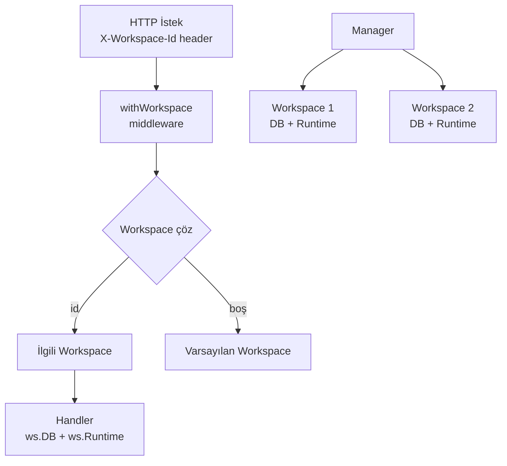

# TionSwarm — Workspace İzolasyonu

> Her workspace **tamamen bağımsızdır**: kendi dosya-tabanlı `store/` dizini + kendi agent runtime'ı. Bir workspace'in içeriği asla diğerine sızmaz.
> Depolama biçimi (JSON/JSONL) için: **`_Docs/08-DEPOLAMA.md`**.

## Başlangıç (favori) workspace (2026-06-23)

Workspace switcher dropdown'ında her satırda bir **yıldız** ile bir workspace
"başlangıç favorisi" olarak işaretlenebilir. Soğuk açılışta (URL'de açık bir
workspace deep-link'i yokken) favori workspace açılır; deep-link verildiğinde
route makinesi onu sonradan uygular, yani açık linkler favoriyi ezer. Cihaz-yerel
saklanır (`localStorage: tionswarm.favoriteWs`), aktif-workspace işaretçisiyle aynı
desen. Seçim sırası: `(işaretçi yoksa) favori → son-aktif → favori → ilk`.
Kod: `hooks/useWorkspaces.ts`, `WorkspaceSwitcher.tsx`.

## Workspace'e Özel Görünüm/Tema (2026-06-25)

Görünüm ayarları artık **uygulama-geneli Ayarlar'da değil**, NavRail ▸ **Workspace**
penceresinin **Görünüm** sekmesindedir (`WorkspaceView.tsx` sekmeleri: Genel ▸
**Görünüm** ▸ Proje ▸ Promptlar & Dosyalar). Ayar **aktif workspace'e özeldir**:
her workspace kendi tema paletini, temel modunu (koyu/açık/sistem) ve vurgu
rengini (accent) saklar; **workspace değiştirince arayüz teması da değişir**.

- **Saklama:** `ws-settings.json` içinde `theme`/`accent`/`themePreset` alanları
  (`internal/workspace/settings.go` → `WSSettings`). Boş alan = **uygulama-geneli
  görünümü miras alır** (`settings.json`'daki `theme`/`accent`/`themePreset`
  varsayılan rolünü sürdürür).
- **Çözümleme:** `frontend/src/lib/theme.ts::resolveAppearance(ws, global)` her
  alanı tek tek birleştirir (boş → global). `applyAppearance` belgeye uygular.
- **Uygulama akışı:** `App.tsx` global görünümü ve aktif workspace override'ını
  iki ref'te tutar; workspace değişiminde `GET /api/workspace-settings` ile
  override çekilip `applyResolvedTheme()` çağrılır. Global ayar kaydı (örn. Profil)
  workspace seçimini ezmez.
- **Düzenleme:** `AppearancePanel` (self-contained; global+workspace ayarını kendi
  çeker) override'ı doğrudan `PUT /api/workspace-settings` ile kaydeder, düzenlerken
  **canlı önizleme** uygular, kaydedilmeden çıkılırsa önizlemeyi geri alır. "Genele
  sıfırla" butonu alanları temizleyip workspace'i tekrar global görünüme döndürür.
  Panel `WorkspaceView`'in Görünüm sekmesinde gömülüdür (kendi Kaydet/Sıfırla
  butonlarını taşır → ortak header Kaydet'i bu sekmede gizli).
- **Dil seçeneği** Görünüm'den çıkarılıp uygulama-geneli **Profil** kategorisine
  (Ayarlar) taşındı; dil uygulama-geneli kalır (workspace'e özel değildir).

## Workspace Dışa Aktarımı (Şablon) — "Dışa Aktar" Sekmesi (2026-07-01)

Workspace'i taşınabilir bir **şablon paketine** dönüştürme (eski "Şablon olarak yayınla")
artık `WorkspaceView`'in kendi **Dışa Aktar** sekmesindedir (Genel ▸ Görünüm ▸ Proje ▸
Promptlar & Dosyalar ▸ **Dışa Aktar**). Genel tab'ından çıkarıldı çünkü içerik seçimi
detaylandırıldı. Panel: `frontend/src/components/workspace/WorkspaceExportPanel.tsx`.

- **Öğe-bazlı seçim (2026-07-01):** Ajanlar, Akışlar, Workspace skill'leri, Zamanlamalar
  ve **Otomasyonlar** (2026-08-11) **tek tek** seçilir (beş ayrı checkbox listesi —
  yeniden kullanılabilir `ExportPickList.tsx`). Her liste varsayılan tümü-seçili;
  ajanlarda ≥1 zorunlu. Dosya kategorileri (Talimatlar / Promptlar & README / Pano
  sütunları) toggle olarak kalır.
- **Otomasyonlar (2026-08-11):** kural, ajana `agentKey` / akışa `flowName` ile referans
  verir ve kurulumda **pasif** gelir. Hedefi hariç bırakılmış olanlar (orphan) atılır —
  panel bunu bağımlılık uyarısı ve canlı önizleme sayacıyla gösterir. Gömülü pano
  varsayılanları (`Seed != ""`) dışa aktarılmaz: her workspace açılışta kendi kopyasını
  üretir, taşımak çift kural veya kullanıcının sildiği kuralın dirilmesi demek olurdu.
- **Koordinatörlük (2026-08-11):** ajanın
  `coordinatorMode`/`coordinatorWorkflow`/`coordinatorPrompt` varsayılanı da taşınır —
  yayınlanan bir ekip orkestrasyon şeklini de, ajana özel delegasyon yönergesini de
  kaybetmez.
- **Promptlar & README (2026-07-01):** "Promptlar & Dosyalar" ekranındaki runtime promptları
  (summary/reflect/title/…) ve README de dışa aktarılabilir — **yalnız varsayılandan farklı
  olanlar**. Panel `getWorkspaceConfig`'ten non-default prompt + README sayısını gösterir.
  Backend `WorkspacePayload.Prompts/Readme` taşır; install'da `config/prompts/` + `config/README.md`
  olarak seed edilir (`seedTemplateConfigFiles`). Dokunulmamış promptlar hedefte güncel varsayılanı korur.
- **Şablon metadata (2026-07-01):** panelin üstünde **Şablon adı / Açıklama / Sürüm**
  alanları vardır. Ad workspace adından seed edilir; açıklama/sürüm boş bırakılırsa
  sunucu varsayılan üretir (açıklama → otomatik satır, sürüm → `1.0.0`). Ad slug'ı
  belirlediği için farklı ad = farklı pack id (`workspace-<slug>`).
- **Bağımlılık uyarısı (2026-07-01):** bir ajan hariç bırakıldığında panel, o ajana
  bağlı **akış** ve **zamanlamaları** listeler. Etki net gösterilir: akışlar dışa
  aktarımda **kopuk referans** taşır (backend yalnız dışa aktardığı id'leri yeniden
  yazabilir), zamanlamalar **tamamen düşer** (orphan atlanır). Flow bağımlılığı,
  `flow.graph` JSON'u client'ta parse edilip `type==='agent'` düğümlerinin `agentId`'leri
  toplanarak hesaplanır.
- **Canlı önizleme (2026-07-01):** kategori toggle'larının altında, mevcut seçimin **tam
  çıktısını** gösteren bir kart. Sayımlar backend kurallarını birebir yansıtır: akış/skill/
  talimat/pano toggle'ına uyar; **zamanlama yalnızca seçili ajana bağlıysa** sayılır (orphan
  düşer). Kart ayrıca çözümlenen **ad · sürüm · pack id**'yi (`workspace-<slug>`) ve aynı
  slug'a yeniden yayında **üzerine yazma** uyarısını gösterir. Slug, Go `slugify`'ın frontend
  kopyasıyla hesaplanır (Türkçe/ASCII-dışı harfler düşer → önizleme sunucuyla aynı id'yi verir).
- **API:** `api.publishPack('workspace', ws.id, include, meta)` → `POST /api/market/publish`.
  `include` = `WorkspaceExportInclude`: `agentIds/flowIds/skillSlugs/scheduleIds: string[]|null`
  (**tri-state**: null=tümü, `[]`=hiçbiri, liste=tam üyeler) + `instructions/prompts/boardColumns`
  boolean'ları; `meta` = `WorkspaceExportMeta` (`name?/description?/version?`, boş alanlar düşürülür).
  `include`/`meta` gönderilmezse davranış eskisi gibi "her şey" (geriye uyumlu).
- **Backend:** `publishRequest.{Name,Description,Version,Include}`; workspace kind'ında
  bunlar `market.BuildWorkspacePack(slug, name, desc, version, …)`'e geçirilir (boş =
  türetilmiş varsayılan; `BuildWorkspacePack` boş sürümü `1.0.0`'a düşürür).
  `buildWorkspaceTemplatePayload(ctx, wsp, inc)` — `inc==nil` iken her şey, aksi halde
  `wantSet(all, ids)` (nil=tümü / `[]`=hiçbiri) ile agents/flows/skills/schedules bağımsız
  filtreler ve dosya flag'lerini onurlandırır (`internal/api/market_publish.go`). **Sırlar ve
  oturum geçmişi asla dahil edilmez** (sunucu-zorunlu). Yayınlanan şablon market + workspace
  oluşturma ekranında görünür (`s.market.Reload()`).
- Panel kendi publish aksiyonunu taşır → ortak header "Kaydet" bu sekmede gizli (Görünüm gibi).

## Neden Ayrı Store Dizini?

Tek depo + `workspace_id` ayrımı yerine **her workspace için ayrı `store/` dizini** seçildi:

| Yaklaşım | İzolasyon | Risk |
|----------|-----------|------|
| Tek depo + workspace_id ayrımı | Mantıksal (her erişim filtrelemeli) | Bir erişim filtreyi unutursa **sızıntı** |
| **Ayrı store dizini (seçilen)** | **Fiziksel** | Sıfır — erişim değişmez, karışma imkânsız |

## Mimari



## Disk Yapısı

```
DATA_DIR/
├── workspaces.json              # [{id, name, createdAt}] kayıt defteri (id artık WS<n>)
├── ws-counter.json              # workspace id sayacı ({"n":N}) — tekrar-kullanımsız
├── credential-secret            # global şifreleme anahtarı
└── workspaces/
    ├── {id-1}/                   # örn. WS1/ (eski kayıtlar UUID kalabilir; bkz. cmd/migrate-ids)
    │   ├── store/               # Workspace 1'in TÜM verisi (JSON/JSONL dosyaları)
    │   ├── config/              # Editlenebilir config: prompts/*.md, instructions.md, README.md
    │   ├── ws-settings.json     # Workspace ayarları (override + instructions)
    │   └── workspace/           # Workspace 1'in görev dosyaları (ajan fs/shell çalışma dizini tabanı; artık KİLİT değil — bkz. not)
    └── {id-2}/
        ├── store/
        ├── config/
        └── workspace/
```

> **`config/` klasörü (2026-06-17):** runtime yardımcı promptları (summary/reflect/title),
> workspace talimatları ve README **editlenebilir dosyalar** olarak burada tutulur. Hem
> kullanıcı (diskten) hem uygulama (Ayarlar ▸ Bu Workspace ▸ Promptlar & Dosyalar) düzenler.
> Bir prompt dosyası boş/yoksa uygulama gömülü varsayılana düşer. Detay: `agent/wsconfig.go`,
> `api/workspace_config.go`.

## İlk Kurulum: Oluştur veya Mevcut Klasör Seç (2026-07-05)

Fresh install'da (hiç workspace yokken) `OnboardingScreen` gösterilir; backend
**varsayılan workspace tohumlamaz** (üstteki "Çalışma Şekli 2." maddesi eski
davranıştır). Karşılama kartında **iki** aksiyon vardır:

- **Workspace Oluştur** → `WorkspaceCreateModal` (ad + emoji + şablon + **opsiyonel
  proje dizini**) → `POST /api/workspaces`. Veri klasörü **artık seçilmez**: data dir
  daima uygulama varsayılan konumunu kullanır (`Create(name, "", "")`). Girilen proje
  dizini workspace'in `DefaultWorkingDir`'ine (oturum cwd'si) yazılır (istek alanı
  `projectDir`). Proje dizininin hemen altında **"Git deposu başlat"** onay kutusu
  vardır (istek alanı `gitInit`): işaretliyse workspace oluşturulduktan sonra o
  klasörde `git init -b main` çalışır (klasör yoksa önce açılır, klasör zaten repo
  ise dokunulmaz) ve başlangıç `.gitignore`'ı yazılır (var olan dosya ezilmez —
  bkz. `_Docs/26-CALISMA-DIZINI.md`). Onay kutusu yalnız yol girildiğinde, **makinede git kuruluysa**
  ve klasör henüz repo değilse etkindir — durum `GET /api/fs/gitinfo`'nun yeni
  `gitInstalled` alanından okunur ve sebep kutunun altında yazar. Git adımı
  tavsiye niteliğindedir: başarısızlık workspace oluşturmayı bozmaz, yanıttaki
  `gitInitError` alanıyla döner ve hata bandında gösterilir.
- **Mevcut Workspace Seç** → native klasör seçici (`POST /api/pick-folder`) → seçilen
  yol `POST /api/workspaces/attach` ile **taşınmadan** kayıt defterine eklenir. Bu,
  başka makineden kopyalanan ya da önceki kurulumdan kalan bir workspace veri
  klasörünü olduğu yerde benimsemek içindir.

**Geçerlilik (validasyon):** Bir klasörün "geçerli workspace" sayılması için içinde
**`store/` alt klasörü** (dosya-tabanlı DB) bulunmalıdır — `Manager.isWorkspaceDir`.
Geçersiz klasör veya **zaten ekli** bir klasör 400 + Türkçe mesajla reddedilir ve
mesaj onboarding ekranında satır-içi gösterilir (`data-testid="onboarding-error"`).

- **Backend:** `Manager.Attach(path)` (`internal/workspace/manager.go`) — yeni `WS<n>`
  id verir, `Meta.Path`'i **doğrudan seçilen klasöre** ayarlar (Create'in `tionswarm-<id>`
  alt klasörü açmasının aksine), `open()` mevcut `store/config/workspace` içeriğini
  yerinde yeniden kullanır, `persist()` eder. Ad, klasör adından türetilir (`tionswarm-`
  öneki soyulur) — özgün ad klasörde saklanmadığından kullanıcı sonradan yeniden
  adlandırabilir. İkon/renk `ws-settings.json`'dan otomatik gelir. Aynı klasörün iki
  kez eklenmesi `sameDir` (Windows'ta büyük/küçük harf duyarsız) ile engellenir.
- **Frontend:** `api.attachWorkspace(path)` → `useWorkspaces.attachWorkspace` (hata
  **fırlatır**, `createWorkspace`'in aksine, ki onboarding satır-içi gösterebilsin) →
  başarıda yeni workspace aktifleşir ve App uygulama kabuğuna geçer. Kod:
  `components/workspace/OnboardingScreen.tsx`, `hooks/useWorkspaces.ts`,
  `api/workspaces.ts`.

## Çalışma Şekli

1. **Manager** (`internal/workspace/manager.go`) açılışta `workspaces.json`'ı okur, her workspace için `store/` dizinini açar (diskten belleğe yükler) + runtime başlatır.
2. Hiç workspace yoksa **"Varsayılan"** otomatik oluşturulur.
3. Her HTTP isteği `X-Workspace-Id` header'ı taşır; `withWorkspace` middleware'i doğru workspace'i çözüp context'e koyar.
4. Handler'lar `ws(r).DB` ve `ws(r).Runtime` ile yalnızca o workspace'in verisine erişir.
5. Frontend aktif workspace id'sini **URL hash'inde** (`#/w/{id}/{view}`) kaynak-doğru olarak tutar; `localStorage` yalnızca hash'siz açılışta tohum (fallback) olarak okunur. Switcher'dan geçince tüm liste (ajan/oturum/mesaj) sıfırlanıp yeniden yüklenir.

## Çoklu Pencere / Derin Bağlantı (Deep-Link)

Tüm navigasyon durumu URL hash'inde adreslenir → **her workspace ayrı bir tarayıcı
penceresinde/sekmesinde eşzamanlı açılabilir** (paylaşılan localStorage'a rağmen
çapraz-sızıntı yok).

```
#/w/{workspaceId}/{view}[/{entityId}]
   workspaceId → isteği izole backend DB'sine kapsar (X-Workspace-Id header'ına dönüşür)
   view        → NavRail görünümü (chat/board/agents/…)
   entityId    → görünüme göre: chat→sessionId, agents/memory/tools→agentId,
                 artifacts→artifactId, schedules→scheduleId
```

**Nasıl çalışır:**
- `lib/url.ts` (`parseRoute`/`buildRoute`/`routeIdForView`) + `hooks/useUrlSync.ts`
  (state↔URL iki-yönlü senkron: ilk yazım `replaceState`, sonrası `pushState` →
  geri/ileri tuşları çalışır).
- `App.tsx` modül yüklenirken `INITIAL_ROUTE = parseRoute(hash)`'i okur; hash bir
  workspace adresliyorsa **hemen** `setActiveWorkspace` ile api istemcisine pinler.
- Aktif workspace `api/client.ts`'te **modül-düzeyi değişkende** tutulur; runtime'da
  yalnızca buradan okunur (localStorage runtime'da yeniden okunmaz). Her pencere kendi
  JS realm'ine sahip olduğundan, bir penceredeki workspace değişimi diğerini etkilemez.
- **WorkspaceSwitcher** her satırda **"Ayrı pencerede aç"** (↗ `ExternalLink`) butonu
  sunar → `window.open(origin+pathname+#/w/{id}/chat)` ile o workspace'e pinli yeni
  pencere açar; mevcut pencerenin seçimini bozmaz.

> Not: Bu bir **web uygulaması** (Electron/native değil) — "ayrı pencere" tarayıcı
> penceresi/sekmesi demektir. Görev çubuğunda bağımsız uygulama penceresi istenirse
> ileride Electron/Tauri sarmalayıcı veya tarayıcının PWA modu gerekir.

### Çapraz-pencere "okunmadı" rozet senkronu

Workspace etkinlik rozetleri (`unreadWs`) **tüm pencereler arasında paylaşılır**
(`localStorage` anahtarı `tionswarm.unreadWs` + `storage` event). TionSwarm tek-kullanıcılı
olduğundan ilke: **"herhangi bir pencerede görüldü = her yerde okundu"**.

- `hooks/useWorkspaces.ts` paylaşılan ham seti `localStorage`'da tutar; her yazımda
  (`writeSharedUnread`) diğer pencereler `storage` event'iyle anında senkron olur
  (`storage` yazan dökümanda tetiklenmez, yalnız diğerlerinde → yazım/okuma döngüsü yok).
- `markWorkspaceUnread(id)` rozet ekler (kendi aktif workspace'i hariç),
  `markWorkspaceRead(id)` her yerden temizler. `App.tsx` olay feed'inde: başka
  workspace'te etkinlik → `markWorkspaceUnread`; **aktif workspace'te canlı etkinlik veya
  o workspace'e geçiş** → `markWorkspaceRead` (görüldü kabul edilir).
- **Görüntülenen** set her pencerede ham setten **kendi aktif workspace'i çıkarılarak**
  türetilir (aktif olan asla rozetlenmez). Aktif-workspace değişiminde bir effect onu
  paylaşılan setten de siler → yeni açılan pencere mevcut rozetleri **devralır** ve
  baktığı workspace'i her yerde okundu işaretler.

**Playwright doğrulaması (2026-06-18):** 3 workspace (X/Y/Z), 2 pencere (aktif X, aktif Y).
Paylaşılan set `[X,Y,Z]` yazıldığında pencere-X `{Y,Z}`, pencere-Y `{X,Z}` gösterdi
(her biri kendi aktifini filtreledi) ✅. Pencere-X Z'ye geçince Z her iki pencereden
düştü ✅. Z'siz durumda açılan **yeni** pencere (aktif Y) `{X}` rozetini devraldı ✅.

## API Uçları

| Metod | Yol | Açıklama |
|-------|-----|----------|
| GET | `/api/workspaces` | Workspace listesi |
| POST | `/api/workspaces` | Yeni workspace oluştur |
| POST | `/api/workspaces/attach` | Mevcut bir workspace klasörünü (`{path}`) ekle (bkz. aşağıdaki bölüm) |
| DELETE | `/api/workspaces/{id}` | Workspace sil (son workspace de silinebilir → ilk kurulum ekranına döner) |

Diğer tüm uçlar (`/api/agents`, `/api/chat`, `/api/runtime` ...) `X-Workspace-Id` header'ına göre çalışır.

## Test Sonucu (2026-06-15)

- WS1 "Varsayılan" → sadece Ajan-A görüyor ✅
- WS2 "İş" → sadece Ajan-B görüyor ✅
- Ayrı klasör + ayrı `store/` dizinleri ✅
- UI switcher ile geçiş: liste anında o workspace'e göre değişiyor ✅

### Çoklu pencere doğrulaması (2026-06-18, Playwright)

- İki sekme iki farklı workspace hash'iyle açıldı (`#/w/A/chat`, `#/w/B/chat`) → her
  biri kendi workspace adını + oturum listesini gösterdi ✅
- Tab B yüklenince paylaşılan `localStorage` B'ye döndü; **Tab A'ya geri dönüldüğünde
  hâlâ A workspace'inde** (hash A, ad "Varsayilan") → çapraz-sızıntı yok ✅
- Sonuç: pencere-başına workspace izolasyonu URL pinning ile uçtan uca çalışıyor.

## Workspace Ayarları (`ws-settings.json`)

Her workspace, ayarlar ekranındaki **"Genel"** kategorisinden düzenlenen kendi
override'larını `store/` yanındaki `ws-settings.json` dosyasında tutar
(`internal/workspace/settings.go` → `WSSettings`).

| Alan | Açıklama |
|------|----------|
| `icon`, `color` | Switcher/rail'de görsel kimlik |
| `pauseAutonomy` | Sadece bu workspace'in otonomisini (scheduler) durdurur — anahtar **Zamanlamalar** ekranının üstünde (2026-07-01: app-geneli pause kaldırıldı, pause artık yalnız workspace-özel) |
| `instructions` | **Bu workspace'teki tüm agent'lara eklenen serbest metin yönergeler** |
| `terseMode` | **Terse (caveman) yanıt stili** — açıkken `terse` registry promptu statik prefix'e eklenir (aşağıya bak) |

> **Not (2026-07-25):** Hem workspace-özel `defaultProvider`/`defaultModel` alanı hem de
> app-geneli varsayılan sağlayıcı/model **tamamen kaldırıldı**. Sağlayıcı/model soyut bir
> "varsayılan" değildir; her ajan kendi net kurulumunu taşır. Yeni ajan oluşturulurken boş
> bırakılan sağlayıcı/model workspace'teki **ilk (en yeni) ajanın** kurulumundan →
> `claude-cli` + provider'ın kendi yerleşik varsayılan modelinden miras alınır
> (`handleCreateAgent` → `firstAgentProviderModel`). Eski `ws-settings.json` dosyalarındaki
> dead anahtarlar yüklemede bir kez temizlenir.

### Instructions enjeksiyonu

`instructions`, agent'ın **statik** system prompt önekine (`persona` → soul + identity'den
sonra) `# Workspace Instructions` başlığıyla eklenir. Statik prefix'te kaldığı için
prompt cache'i bozmaz.

- **İnteraktif chat:** `internal/api/chat.go` ve `chat_stream.go` → `ws(r).Settings().Instructions`
- **Otonom yollar** (schedule / task / flow / reflection): `internal/agent/runtime.go` →
  `Runtime.systemPrompt(agent)`. Runtime, değeri `SetInstructions` ile ayarlardan
  senkron tutar (ilk yükleme `loadSettings`, sonraki güncellemeler `UpdateSettings`).

### Terse (caveman) mod (`terseMode`)

**Sorun:** yanıt stili kuralı ancak **her zaman yürürlükteyse** işe yarar. Skill olarak
tutulduğunda Available Skills kataloğunda yalnız tek satır özet görünür ve modele ancak
kendisi `use_skill` çağırmaya karar verirse ulaşır — pratikte kullanıcı "terse" demedikçe
hiç ateşlenmez. Bu yüzden skill değil, **prompt**.

Anahtar açıkken `terse` **registry promptu** (`_Docs\61`) her ajanın statik system
prefix'ine, workspace instructions'ın **ardından** eklenir (sıra bilinçli: workspace
kuralı stili ezebilsin diye). Kapalıyken tek bayt gönderilmez.

- **Metin düzenlenebilir:** çözümleme `<workspace>/config/prompts/terse.md` override →
  gömülü `internal/prompts/defaults/terse.md`. Boş/bozuk override varsayılana düşer, yani
  kötü bir edit modu sessizce devre dışı bırakamaz.
- **Maliyet:** statik prefix → prompt-cache penceresi başına bir kez ödenir, her tur değil.
- **Epoch:** `EpochAffecting: true` — anahtarı veya metni değiştirmek **açık oturumları**
  anında etkilemez; `/refresh-context` ya da yeni oturum gerekir (cache'i koruyan mevcut
  davranış).
- **Tek kaynak:** `Runtime.TerseModeBlock()` — hem headless (`systemPrompt`) hem api tarafı
  (chat turu, bağlam önizlemesi, oturum bilgisi) aynı metni ve aynı anahtarı okur.
- **Varsayılan metnin kaynağı:** [juliusbrussee/caveman](https://github.com/juliusbrussee/caveman)
  (MIT) uyarlaması — sıkıştırma kuralları, "stili asla ilan etme" ve auto-clarity istisnaları
  oradan. Üstüne ajan-özgü **iki** kural eklendi (o proje sohbet skill'i olduğu için içermiyor):
  **(a)** stil yalnız sohbet cevabını yönetir, diske yazılan içeriği (kod/commit/doküman) DEĞİL;
  **(b)** çıktıyı kısaltır, **işi** değil — kısalık için dosya okumayı/test koşmayı atlamak yasak.
  Seviyeler (lite/full/ultra) bilerek alınmadı: seçici yok, ölü ağırlık olurdu.
- **Kod:** `internal/agent/tersemode.go`, `WSSettings.TerseMode` → `Runtime.SetTerseMode`.
- **UI:** Workspace ▸ Genel ▸ "Yanıt stili" ▸ *Terse mod (caveman)*; metin Workspace ▸
  Promptlar & Dosyalar ▸ "Terse (caveman) yanıt stili".

## Notlar / Gelecek

- **Runtime izolasyonu:** Her workspace'in kendi agent runtime'ı var → bir workspace'in otonom ajanları diğerini etkilemez. Tüm workspace'lerin zamanlayıcıları paralel çalışır.
- **Süreç-geneli per-session yapılar `(workspace, session)` ile anahtarlanır.** Oturum/ajan id'leri her store'un kendi sayacından gelir (`SES1`/`AGT1` HER workspace'te vardır), bu yüzden tüm workspace'ler için tek olan yapılar — session hub, gönderi kuyruğu, koşan turlar, etkileşim kartları, izin grant'ları — session id'yi tek başına anahtar olarak kullanamaz. 2026-08-14'te tam bu yüzden bir workspace'in oturumu diğerinde görünüyordu; detay `58-QUEUE-SENKRON.md` → "Workspace kapsamı".
- **Silme koruması:** En az bir workspace her zaman kalır.
- **fs/shell artık kilitli DEĞİL (2026-06-22):** `workspace/` dizini eskiden built-in
  `Read`/`Write`/`Edit`/`LS`/`Glob`/`Grep`/`Bash` araçları için
  bir **güvenlik kilidiydi** (mutlak yol yasak, `..` kaçışı reddedilir). Bu kilit
  kullanıcı kararıyla **kaldırıldı**: artık bu araçlar makinedeki herhangi bir yolu
  okuyup yazabilir ve her yerde komut çalıştırabilir. `Sandbox.Root` yalnızca göreli
  yolların tabanı (varsayılan çalışma dizini) — bir sınır değil. Güvenlik halkası
  artık tek başına **izin modu** (salt-okunur / sor / otomatik). Tek istisna:
  Windows'ta `/foo` ve `/mnt/c/x` gibi sürücüsüz, slash-rooted girdiler geçerli
  mutlak yol sayılmaz ve `Root` altına sessizce birleştirilmek yerine açıkça
  reddedilir; UNC (`//server/share` veya `\\server\share`) yolları istisnadır.
  Mutlak Windows yolu sürücü niteleyicisiyle (`C:\...`) verilmelidir.
  Diğer istisna:
  **config araçları** (`read_config`/`write_config`/`list_config`) hâlâ
  `<workspace>/config/` içine **kilitli** (`Sandbox.Confined=true`, the external agent project benzeri
  ayrım). Kod: `internal/tools/sandbox.go` (`NewSandbox` kilitsiz / `NewConfinedSandbox`
  kilitli), kablolama `internal/agent/toolsetup.go`.
- **Oturum-başına çalışma dizini (2026-06-22):** `workspace/` artık yalnızca
  **varsayılan** çalışma dizini. Her oturum kendi `Session.WorkingDir`'ini
  belirleyebilir (Composer'daki klasör rozeti) → fs/shell o dizinden çalışır, ajan
  cwd'sini + git branch'ini bağlamda görür. Otonom turlar için `autonomousConfine`
  (varsayılan açık) bu dizine yeniden kilitler. Detay: `_Docs/26-CALISMA-DIZINI.md`.
  (Not: per-session git worktree izolasyonu 2026-07-28'de kaldırıldı; ileride
  kapsamlı biçimde yeniden eklenecek.)
- **Yeniden adlandırma ✅:** `rename_workspace` aracı (`internal/tools/builtin_workspacemgmt.go`) + WorkspaceBridge üzerinden yapılır.
- **Workspace başına tema ✅:** görünüm/tema workspace-özeldir (`WSSettings`).
- **Gelecek:** dışa/içe aktarma (export/import). *(Periyodik zip yedekleme zaten var → `34-YEDEKLEME.md`.)*
