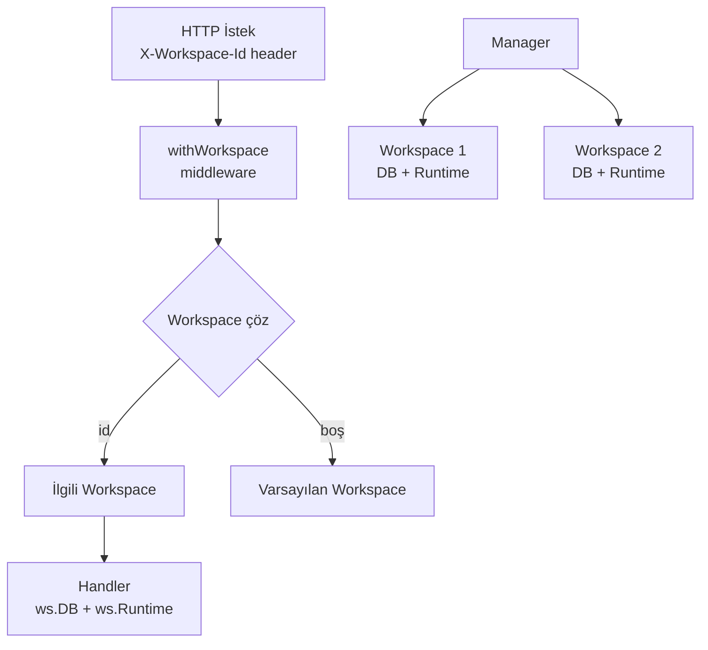

# SwarmGo — Workspace İzolasyonu

> Her workspace **tamamen bağımsızdır**: kendi SQLite veritabanı + kendi agent runtime'ı. Bir workspace'in içeriği asla diğerine sızmaz.

## Neden Ayrı DB Dosyası?

Tek DB + `workspace_id` kolonu yaklaşımı yerine **her workspace için ayrı `swarmgo.db`** seçildi:

| Yaklaşım | İzolasyon | Risk |
|----------|-----------|------|
| Tek DB + workspace_id kolonu | Mantıksal (her sorgu filtrelemeli) | Bir sorgu filtreyi unutursa **sızıntı** |
| **Ayrı DB dosyası (seçilen)** | **Fiziksel** | Sıfır — sorgular değişmez, karışma imkânsız |

## Mimari



## Disk Yapısı

```
DATA_DIR/
├── workspaces.json              # [{id, name, createdAt}] kayıt defteri
├── credential-secret            # global şifreleme anahtarı
└── workspaces/
    ├── {id-1}/
    │   ├── swarmgo.db           # Workspace 1'in TÜM verisi
    │   └── workspace/           # Workspace 1'in görev dosyaları
    └── {id-2}/
        ├── swarmgo.db           # Workspace 2'nin TÜM verisi
        └── workspace/
```

## Çalışma Şekli

1. **Manager** (`internal/workspace/manager.go`) açılışta `workspaces.json`'ı okur, her workspace için DB açar + runtime başlatır.
2. Hiç workspace yoksa **"Varsayılan"** otomatik oluşturulur.
3. Her HTTP isteği `X-Workspace-Id` header'ı taşır; `withWorkspace` middleware'i doğru workspace'i çözüp context'e koyar.
4. Handler'lar `ws(r).DB` ve `ws(r).Runtime` ile yalnızca o workspace'in verisine erişir.
5. Frontend aktif workspace id'sini `localStorage`'da tutar; switcher'dan geçince tüm liste (ajan/oturum/mesaj) sıfırlanıp yeniden yüklenir.

## API Uçları

| Metod | Yol | Açıklama |
|-------|-----|----------|
| GET | `/api/workspaces` | Workspace listesi |
| POST | `/api/workspaces` | Yeni workspace oluştur |
| DELETE | `/api/workspaces/{id}` | Workspace sil (son workspace silinemez) |

Diğer tüm uçlar (`/api/agents`, `/api/chat`, `/api/runtime` ...) `X-Workspace-Id` header'ına göre çalışır.

## Test Sonucu (2026-06-15)

- WS1 "Varsayılan" → sadece Ajan-A görüyor ✅
- WS2 "İş" → sadece Ajan-B görüyor ✅
- Ayrı klasör + ayrı `swarmgo.db` dosyaları ✅
- UI switcher ile geçiş: liste anında o workspace'e göre değişiyor ✅

## Notlar / Gelecek

- **Runtime izolasyonu:** Her workspace'in kendi agent runtime'ı var → bir workspace'in otonom ajanları diğerini etkilemez. Tüm workspace'lerin heartbeat'leri paralel çalışır.
- **Silme koruması:** En az bir workspace her zaman kalır.
- **Gelecek:** Workspace yeniden adlandırma, dışa/içe aktarma (export/import), workspace başına ayrı tema.
