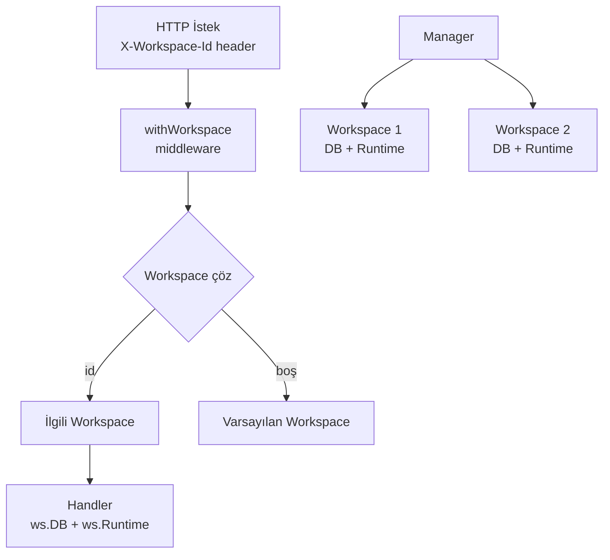

# SwarmGo — Workspace İzolasyonu

> Her workspace **tamamen bağımsızdır**: kendi dosya-tabanlı `store/` dizini + kendi agent runtime'ı. Bir workspace'in içeriği asla diğerine sızmaz.
> Depolama biçimi (JSON/JSONL) için: **`_Docs/08-DEPOLAMA.md`**.

## Neden Ayrı Store Dizini?

Tek depo + `workspace_id` ayrımı yerine **her workspace için ayrı `store/` dizini** seçildi:

| Yaklaşım | İzolasyon | Risk |
|----------|-----------|------|
| Tek depo + workspace_id ayrımı | Mantıksal (her erişim filtrelemeli) | Bir erişim filtreyi unutursa **sızıntı** |
| **Ayrı store dizini (seçilen)** | **Fiziksel** | Sıfır — erişim değişmez, karışma imkânsız |

## Mimari



## Disk Yapısı

```
DATA_DIR/
├── workspaces.json              # [{id, name, createdAt}] kayıt defteri
├── credential-secret            # global şifreleme anahtarı
└── workspaces/
    ├── {id-1}/
    │   ├── store/               # Workspace 1'in TÜM verisi (JSON/JSONL dosyaları)
    │   └── workspace/           # Workspace 1'in görev dosyaları
    └── {id-2}/
        ├── store/               # Workspace 2'nin TÜM verisi (JSON/JSONL dosyaları)
        └── workspace/
```

## Çalışma Şekli

1. **Manager** (`internal/workspace/manager.go`) açılışta `workspaces.json`'ı okur, her workspace için `store/` dizinini açar (diskten belleğe yükler) + runtime başlatır.
2. Hiç workspace yoksa **"Varsayılan"** otomatik oluşturulur.
3. Her HTTP isteği `X-Workspace-Id` header'ı taşır; `withWorkspace` middleware'i doğru workspace'i çözüp context'e koyar.
4. Handler'lar `ws(r).DB` ve `ws(r).Runtime` ile yalnızca o workspace'in verisine erişir.
5. Frontend aktif workspace id'sini `localStorage`'da tutar; switcher'dan geçince tüm liste (ajan/oturum/mesaj) sıfırlanıp yeniden yüklenir.

## API Uçları

| Metod | Yol | Açıklama |
|-------|-----|----------|
| GET | `/api/workspaces` | Workspace listesi |
| POST | `/api/workspaces` | Yeni workspace oluştur |
| DELETE | `/api/workspaces/{id}` | Workspace sil (son workspace silinemez) |

Diğer tüm uçlar (`/api/agents`, `/api/chat`, `/api/runtime` ...) `X-Workspace-Id` header'ına göre çalışır.

## Test Sonucu (2026-06-15)

- WS1 "Varsayılan" → sadece Ajan-A görüyor ✅
- WS2 "İş" → sadece Ajan-B görüyor ✅
- Ayrı klasör + ayrı `store/` dizinleri ✅
- UI switcher ile geçiş: liste anında o workspace'e göre değişiyor ✅

## Workspace Ayarları (`ws-settings.json`)

Her workspace, ayarlar ekranındaki **"Genel"** kategorisinden düzenlenen kendi
override'larını `store/` yanındaki `ws-settings.json` dosyasında tutar
(`internal/workspace/settings.go` → `WSSettings`).

| Alan | Açıklama |
|------|----------|
| `icon`, `color` | Switcher/rail'de görsel kimlik |
| `defaultProvider`, `defaultModel` | Boş = uygulama varsayılanı |
| `pauseAutonomy` | Sadece bu workspace'in otonomisini (heartbeat + scheduler) durdurur |
| `instructions` | **Bu workspace'teki tüm agent'lara eklenen serbest metin yönergeler** |

### Instructions enjeksiyonu

`instructions`, agent'ın **statik** system prompt önekine (`persona` → soul + identity'den
sonra) `# Workspace Instructions` başlığıyla eklenir. Statik prefix'te kaldığı için
prompt cache'i bozmaz.

- **İnteraktif chat:** `internal/api/chat.go` ve `chat_stream.go` → `ws(r).Settings().Instructions`
- **Otonom yollar** (heartbeat / task / flow / reflection): `internal/agent/runtime.go` →
  `Runtime.systemPrompt(agent)`. Runtime, değeri `SetInstructions` ile ayarlardan
  senkron tutar (ilk yükleme `loadSettings`, sonraki güncellemeler `UpdateSettings`).

## Notlar / Gelecek

- **Runtime izolasyonu:** Her workspace'in kendi agent runtime'ı var → bir workspace'in otonom ajanları diğerini etkilemez. Tüm workspace'lerin heartbeat'leri paralel çalışır.
- **Silme koruması:** En az bir workspace her zaman kalır.
- **Gelecek:** Workspace yeniden adlandırma, dışa/içe aktarma (export/import), workspace başına ayrı tema.
