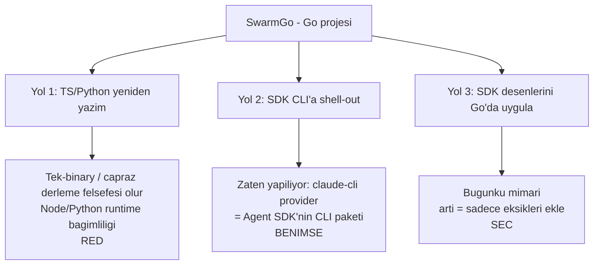

# Karar — Claude Agent SDK ve "SDK Paritesi" Yol Haritası

> Bu doküman bir **karar kaydı** (ADR) + **yol haritası**dır. Soru şuydu:
> *"SwarmGo'yu Claude Agent SDK'ya geçirmenin artıları ne olur?"*
> Cevap: SwarmGo bir **Go** projesi ve Claude Agent SDK'nın **resmi Go desteği yok**
> (yalnız Python + TypeScript). Bu yüzden "geçiş" temiz bir `import` değil; üç
> yoldan birini seçmek demek. Aşağıda yetenek karşılaştırması, yolların gerçek
> maliyeti, alınan karar ve özelliklerin fazlara dağılımı var.

## Özet Karar

- **Tam geçiş (backend'i TS/Python'a taşımak) YAPILMAYACAK.** Projenin varlık
  sebebini (Go, CGO-free, tek binary, çapraz derleme — bkz. `01-MIMARI.md`,
  `04-TEKNOLOJI-SECIMLERI.md`) yok eder.
- **`claude-cli` provider, Agent SDK'nın resmi köprüsü olarak benimsenir.** Yerel
  `claude` CLI **zaten Agent SDK'nın CLI paketlemesidir**; native döngüyü CLI
  kendi sürer, anahtarsız çalışır. SDK değerinin büyük kısmına bu yoldan zaten
  erişiliyor.
- **Native (anthropic) yolda eksik SDK özellikleri Go'da seçerek eklenir:**
  built-in araç seti → permission katmanı → hooks. "Geçiş" değil, **parite**.

## SDK'nın Sağladıkları vs. SwarmGo'nun Mevcut Durumu

| Yetenek | Agent SDK | SwarmGo (bugün) | Boşluk |
|---|---|---|---|
| Built-in araçlar (file/bash/grep/glob/web) | Kutudan | Sadece `get_current_time` / `http_get` / `memory_recall` | **Var** |
| Agentic tool döngüsü | Olgun | `agent/toolloop.go` (`maxToolIters=8`) | Yok |
| Context yönetimi / compaction | Otomatik | `internal/conversation` (token-bütçeli) | Yok |
| Prompt caching | İnce ayarlı | Yok (native HTTP) | Küçük |
| Permission / onay modları | Var (mod + hook) | Yok (native); claude-cli'de `--allowedTools` ile kısmi | **Var** |
| Hooks (PreToolUse / PostToolUse) | Var | Yok | **Var** |
| Subagents | Var | `internal/orchestration` graf motoru | Kısmi |
| MCP | Var | `internal/mcp` (stdio JSON-RPC) | Yok |
| Anthropic ile güncel kalma | Bakım Anthropic'te | Bakım bizde | Yapısal |

**Net artı:** Eksik yetenekleri sıfırdan yazıp bakımını üstlenmek yerine olgun bir
katmana yaslanmak. Ama bu, Go projesinde yalnızca **claude-cli yolu** üzerinden
"bedava" gelir; native yolda her özellik elle yazılır.

## Üç Yol ve Gerçek Maliyeti

1. **TS/Python'a yeniden yazım** — SDK'yı gerçekten "kullanmak" budur ama
   tek-binary kimliğini bozar, son kullanıcıya Node/Python runtime'ı taşıtır.
   **Reddedildi.**
2. **SDK CLI'a shell-out** — `claude-cli` provider bunu zaten yapıyor. Agentic
   döngü + built-in araçlar + anahtarsız OAuth bu yoldan geliyor. **Benimsenir.**
3. **SDK desenlerini Go'da uygulamak** — Bugünkü mimari. "Geçiş" yok; sadece
   **eksikleri** (built-in dosya/bash araçları, permission, hooks) eklenir.
   **Seçilen yol.**

## SDK Paritesi Yol Haritası (fazlar)

> Tüm özellikler **native (anthropic) yolda** anlamlı; claude-cli yolunda döngüyü
> CLI sürdüğü için bu işler oradan zaten karşılanır. Sıra düşük riskliden yükseğe.

### Faz P1 — İnteraktif Araçlar (düşük risk, hızlı değer)
- `todo_write` built-in aracı → `internal/tools/builtin_todo.go`. Yeni step kind
  `todo`; son liste session'a kaydedilir; chat içinde checklist kartı + canlı
  "Yapılacaklar" yan paneli.
- `ask_user` built-in aracı → `internal/tools/builtin_ask.go`. "Terminal-tool"
  deseni: model `ask_user` çağırınca `toolloop` döngüyü kırar, pending soruyu
  (call ID + payload) session'a yazar; `POST /api/sessions/{id}/answer` cevabı
  `tool_result` olarak besleyip döngüye devam eder. Frontend: opsiyon butonları +
  metin girişi olan soru kartı.

### Faz P2 — Built-in Araç Seti (SDK'nın en güçlü yanı)
- `read_file` / `write_file` / `edit_file` / `list_dir` / `grep` / `glob` →
  `internal/tools/builtin_fs.go` (workspace-scoped kök, path-traversal koruması).
- `bash` (veya PowerShell) → `internal/tools/builtin_shell.go` (timeout + sandbox
  dizini). **Permission katmanından sonra** açılmalı.
- `web_fetch` → mevcut `http_get`'in üstüne içerik özetleme.

### Faz P3 — Permission / Onay Katmanı
- Araç çalıştırmadan önce risk sınıflandırması (read-only / yazma / shell).
- Mod: `auto` | `ask` | `read-only`. Ajan başına ayar (`agents` tablosuna kolon).
- Yazma/shell araçlarında UI onay diyaloğu (ask_user altyapısını yeniden kullanır).

### Faz P4 — Hooks
- `PreToolUse` / `PostToolUse` kancaları: `internal/agent/hooks.go`.
- Kullanım: audit log, araç çağrısını engelleme/değiştirme, otomatik onay kuralları.

## Bağlı / İlgili Dokümanlar
- `01-MIMARI.md` — provider soyutlaması, CGO-free kararı
- `04-TEKNOLOJI-SECIMLERI.md` — "SDK yok, ince HTTP" gerekçesi
- `07-CHAT-UX.md` — `TurnStep` / trace altyapısı (P1 kartları buna oturur)
- `05-ILERLEME.md` — fazlar bittikçe güncellenecek

## Kaynaklar
- Agent SDK genel bakış: <https://platform.claude.com/docs/en/agent-sdk/overview>
- Go SDK feature request (açık, implemente değil): <https://github.com/anthropics/claude-agent-sdk-python/issues/498>
- CLI / SDK'lar / kütüphaneler: <https://platform.claude.com/docs/en/api/client-sdks>
