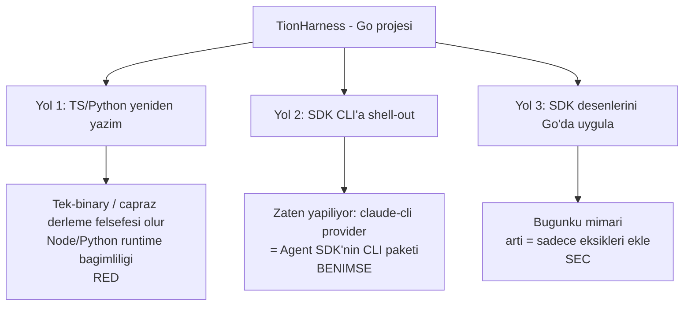

# Karar — Claude Agent SDK ve "SDK Paritesi" Yol Haritası

> Bu doküman bir **karar kaydı** (ADR) + **yol haritası**dır. Soru şuydu:
> *"TionHarness'i Claude Agent SDK'ya geçirmenin artıları ne olur?"*
> Cevap: TionHarness bir **Go** projesi ve Claude Agent SDK'nın **resmi Go desteği yok**
> (yalnız Python + TypeScript). Bu yüzden "geçiş" temiz bir `import` değil; üç
> yoldan birini seçmek demek. Aşağıda yetenek karşılaştırması, yolların gerçek
> maliyeti, alınan karar ve özelliklerin fazlara dağılımı var.

## Özet Karar

- **Tam geçiş (backend'i TS/Python'a taşımak) YAPILMAYACAK.** Projenin varlık
  sebebini (Go, CGO-free, tek binary, çapraz derleme — bkz. `01-MIMARI.md`,
  `04-TEKNOLOJI-SECIMLERI.md`) yok eder.
- **`claude-cli` provider, Agent SDK'nın resmi köprüsü olarak benimsenir.** Yerel
  `claude` CLI **zaten Agent SDK'nın CLI paketlemesidir**; native döngüyü CLI
  kendi sürer, anahtarsız çalışır. SDK değerinin büyük kısmına bu yoldan zaten
  erişiliyor.
- **Native (anthropic) yolda eksik SDK özellikleri Go'da seçerek eklenir:**
  built-in araç seti → permission katmanı → hooks. "Geçiş" değil, **parite**.

## SDK'nın Sağladıkları vs. TionHarness'in Mevcut Durumu

| Yetenek | Agent SDK | TionHarness (bugün) | Boşluk |
|---|---|---|---|
| Built-in araçlar (file/bash/grep/glob/web) | Kutudan | `Read`/`Write`/`Edit`/`LS`/`Glob`/`Grep`/`Bash`/`WebFetch` (claude-cli ile aynı isimler) | Kapandı (P2) |
| Agentic tool döngüsü | Olgun | `agent/toolloop.go` (`maxToolIters` varsayılan 24, `TIONHARNESS_MAX_TOOL_ITERS` ile override) + tur kurtarma (`recovery.go`: max-token resume + reaktif compaction, A1) | Yok |
| Context yönetimi / compaction | Otomatik | `internal/conversation` (token-bütçeli) | Yok |
| Prompt caching | İnce ayarlı | Yok (native HTTP) | Küçük |
| Permission / onay modları | Var (mod + hook) | **Var** — `internal/agent/permission.go` + `tools/permission.go` (auto/ask/read-only modları, arg-bazlı grant desenleri, claude-cli `--permission-prompt-tool`) | ✅ (Faz P3) |
| Hooks (PreToolUse / PostToolUse) | Var | **Var** (Faz P4, native yol; `internal/agent/hooks.go`) | ✅ |
| Subagents | Var | **Var** — `internal/agent/subagent.go` + `internal/tools/subagent.go` (`run_subagent`: izole alt-ajan, objective/output_format/boundaries) + `internal/orchestration` graf motoru | ✅ |
| MCP | Var | `internal/mcp` (stdio JSON-RPC) | Yok |
| Anthropic ile güncel kalma | Bakım Anthropic'te | Bakım bizde | Yapısal |

**Net artı:** Eksik yetenekleri sıfırdan yazıp bakımını üstlenmek yerine olgun bir
katmana yaslanmak. Ama bu, Go projesinde yalnızca **claude-cli yolu** üzerinden
"bedava" gelir; native yolda her özellik elle yazılır.

## Üç Yol ve Gerçek Maliyeti

1. **TS/Python'a yeniden yazım** — SDK'yı gerçekten "kullanmak" budur ama
   tek-binary kimliğini bozar, son kullanıcıya Node/Python runtime'ı taşıtır.
   **Reddedildi.**
2. **SDK CLI'a shell-out** — `claude-cli` provider bunu zaten yapıyor. Agentic
   döngü + built-in araçlar + anahtarsız OAuth bu yoldan geliyor. **Benimsenir.**
3. **SDK desenlerini Go'da uygulamak** — Bugünkü mimari. "Geçiş" yok; sadece
   **eksikleri** (built-in dosya/bash araçları, permission, hooks) eklenir.
   **Seçilen yol.**

## SDK Paritesi Yol Haritası (fazlar)

> Tüm özellikler **native (anthropic) yolda** anlamlı; claude-cli yolunda döngüyü
> CLI sürdüğü için bu işler oradan zaten karşılanır. Sıra düşük riskliden yükseğe.

### Faz P1 — İnteraktif Araçlar (düşük risk, hızlı değer)
- `todo_write` built-in aracı → `internal/tools/builtin_todo.go`. Yeni step kind
  `todo`; son liste session'a kaydedilir; chat içinde checklist kartı + canlı
  "Yapılacaklar" yan paneli.
- `ask_user` built-in aracı → `internal/tools/builtin_ask.go`. "Terminal-tool"
  deseni: model `ask_user` çağırınca `toolloop` döngüyü kırar, pending soruyu
  (call ID + payload) session'a yazar; `POST /api/sessions/{id}/answer` cevabı
  `tool_result` olarak besleyip döngüye devam eder. Frontend: opsiyon butonları +
  metin girişi olan soru kartı.

### Faz P2 — Built-in Araç Seti (SDK'nın en güçlü yanı) ✅ (2026-06-16)
- [x] `Read` / `Write` / `Edit` / `LS` / `Grep` / `Glob` →
  `internal/tools/builtin_fs.go` (workspace-scoped kök, path-traversal koruması →
  `internal/tools/sandbox.go`). (İsimler 2026-06-22'de claude-cli ile hizalandı;
  eski `read_file`/`write_file`/… adları.)
- [x] `Bash` (Windows'ta Git Bash, diğerinde `/bin/sh`; eski ad `shell`) → `internal/tools/builtin_shell.go`
  (timeout + sandbox cwd + 64KB çıktı cap). Windows Bash komutuna
  `LC_ALL=C.UTF-8`/`LANG=C.UTF-8` ve mevcutsa korumalı `chcp.com 65001` öneki
  eklenir; çıktı `strings.ToValidUTF8` ile geçerli UTF-8'e çevrilir ve 64KB kesimi
  rune sınırında yapılır. **Varsayılan KAPALI** (`Tunables.shellEnabled`);
  `TIONHARNESS_ENABLE_SHELL=1` ile açılır. Permission katmanı (P3) gelene dek opt-in kalır.
- [x] `WebFetch` (2026-06-22) — `http_get` zengin fetch'e yükseltildi: HTML→Markdown (stdlib-only converter `htmltomarkdown.go`, script/style/nav ayıklama, göreli link çözümleme), metinsel içerik verbatim, ikili içerik özet; SSRF guard korunur. `builtin_http.go` (`WebFetchTool`).

### Faz SM — Self-Management Araçları ✅ (2026-06-17)
- [x] Ajanın **kendi runtime'ını yönetmesi**: `create/update/delete/list_agent`,
  `…_flow`, `…_schedule`, `delete/list_artifact`, `read_logs`
  (`internal/tools/builtin_*mgmt.go` + `builtin_logs.go`). _(`memory_add` KALDIRILDI 2026-07-05.)_
- [x] **Kanban panosu yönetimi (2026-06-18, COMMITSİZ):** `list_tasks`, `create_task`
  (açıklama; başlık otomatik), `update_task`, `move_task`, `delete_task`
  (`builtin_taskmgmt.go`, **5 araç** — pano pasif bir durum panosudur, **`run_task` YOK**:
  ajan görevi çalıştırmaz, yalnız durumu okur/günceller; iş flow/schedule/agent oturumunda yapılır).
- [x] **Provenance:** `db.Agent/Flow/Schedule/Task.CreatedBy` (Artifact/Memory zaten `AgentID`);
  ajan yalnız agent-created kaynakları siler, kullanıcınınkine dokunamaz. **Görevde sınır
  gevşek:** oku/oluştur/düzenle/taşı her görevde serbest (ajan panoyu yönetsin
  diye), yalnız **silme** provenance-kısıtlı.
- [x] **Varsayılan KAPALI** (`Tunables.SelfManageEnabled`); `TIONHARNESS_ENABLE_SELFMANAGE=1`
  ile açılır (shell gate deseni — katalog 19→35, token maliyeti opt-in).

> **Yürütme yolu:** Built-in araçlar **native** tool-use döngüsünde (`agent/toolloop.go`
> + `tools.Registry`) çalışır. claude-cli yolu kendi döngüsünü `--mcp-config` ile sürdüğü
> ve kendi dosya/bash araçları olduğu için **fs/shell built-in'leri kullanmaz**. Ancak
> `spawn_session` (2026-06-19 itibarıyla) ve `schedule_wake` **Interaction MCP köprüsü**
> (`internal/api/mcp_interaction.go`) üzerinden claude-cli ajanlarına da sunulmaktadır —
> her iki ajan türü de bu araçlara erişir. Sandbox kökü her workspace'in `workspace/`
> alt dizinidir (`Runtime.workDir`). Detay: `05-ILERLEME.md` (Faz P2), `22-SPAWN-SESSION.md` §CLI köprüsü.

### Faz P3 — Permission / Onay Katmanı
- Araç çalıştırmadan önce risk sınıflandırması (read-only / yazma / shell).
- Mod: `auto` | `ask` | `read-only`. Ajan başına ayar (`agents` tablosuna kolon).
- Yazma/shell araçlarında UI onay diyaloğu (ask_user altyapısını yeniden kullanır).

### Faz P4 — Hooks ✅ (TAMAMLANDI 2026-06-18)
- `PreToolUse` / `PostToolUse` kancaları: `internal/agent/hooks.go` (subprocess JSON I/O, Claude Code sözleşmesi).
- Kullanım: audit log, araç çağrısını engelleme/değiştirme, otomatik onay kuralları, dış çıktı sıkıştırma (sqz).
- Yalnız native (anthropic/minimax) yol; claude-cli kendi `~/.claude/settings.json` hook'larını okur.
- Detay: **`_Docs/18-HOOKS.md`**.

## Bağlı / İlgili Dokümanlar
- `01-MIMARI.md` — provider soyutlaması, CGO-free kararı
- `04-TEKNOLOJI-SECIMLERI.md` — "SDK yok, ince HTTP" gerekçesi
- `07-CHAT-UX.md` — `TurnStep` / trace altyapısı (P1 kartları buna oturur)
- `05-ILERLEME.md` — fazlar bittikçe güncellenecek

## Kaynaklar
- Agent SDK genel bakış: <https://platform.claude.com/docs/en/agent-sdk/overview>
- Go SDK feature request (açık, implemente değil): <https://github.com/anthropics/claude-agent-sdk-python/issues/498>
- CLI / SDK'lar / kütüphaneler: <https://platform.claude.com/docs/en/api/client-sdks>
