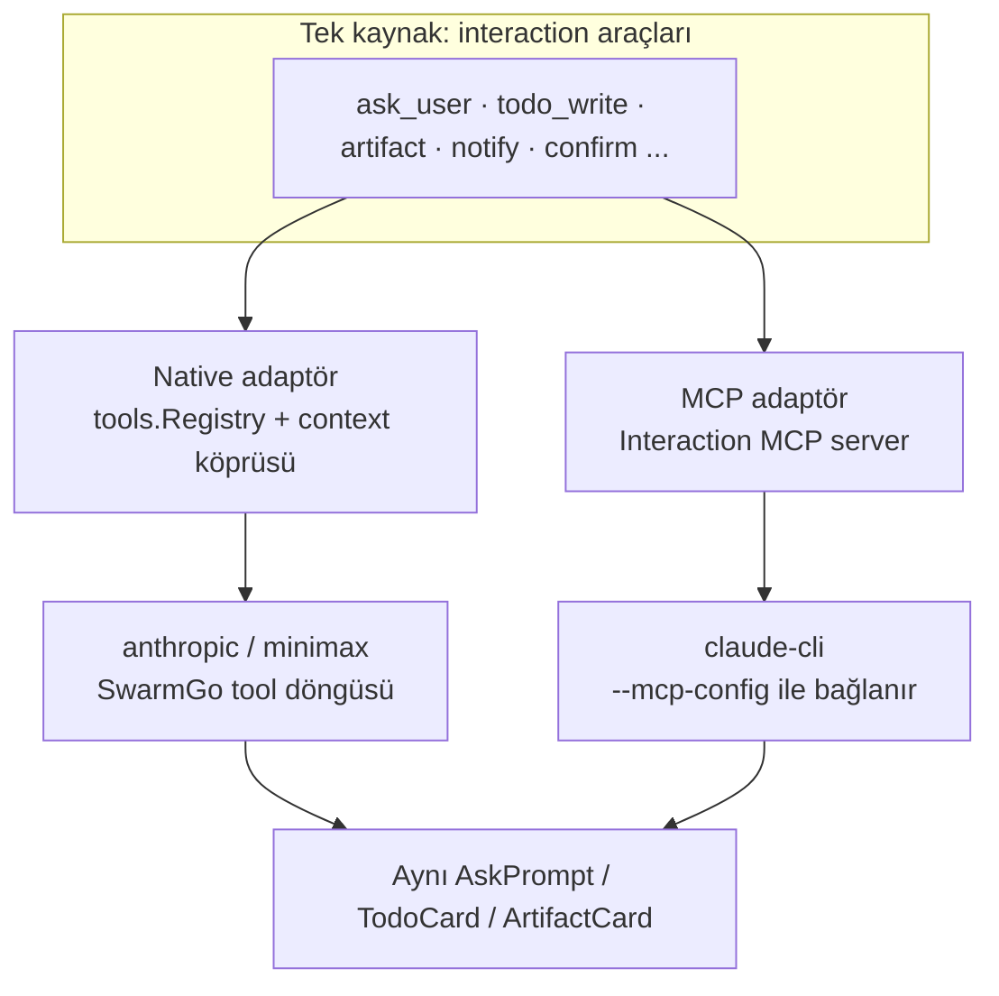
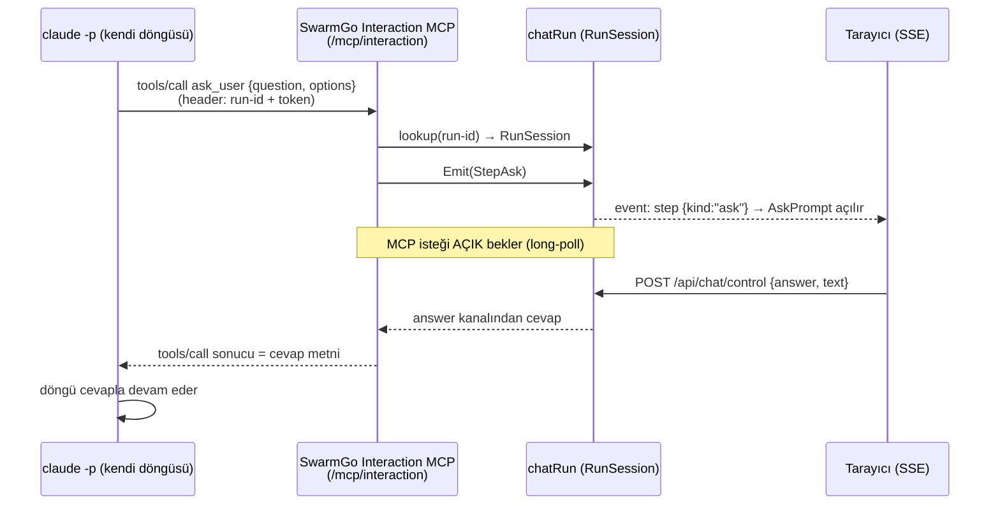

# 11 — SwarmGo Interaction MCP (Tasarım / Plan)

> **Durum:** Plan (uygulanmadı). Onay sonrası Faz 1 ile başlanacak.
> **Amaç:** Tüm insan-etkileşimli (human-in-the-loop) ve UI-etkileyen araçları
> (`ask_user`, `todo_write`, artifact, ileride workspace/onay/bildirim vb.)
> **tek bir ortak MCP sunucusu** üzerinden **claude-cli** (anahtarsız) yoluna da
> kazandırmak. Böylece native (anthropic/minimax) yolda zaten çalışan etkileşim
> araçları, claude-cli yolunda da **aynı davranışla** çalışır (SDK-parite — bkz.
> `09-CLAUDE-AGENT-SDK.md`).

---

## 1. Sorun

İki ayrı "soru sorma" mekanizması var, ikisi de claude-cli'de çıkmaz sokak:

| Mekanizma | Çalıştığı yol | claude-cli'de durum |
|-----------|---------------|---------------------|
| SwarmGo `ask_user` (Faz P1) → AskPrompt | native (anthropic/minimax) | **bağlı değil** — CLI kendi döngüsünü sürüyor |
| CLI'nin built-in `AskUserQuestion`'ı | claude-cli | `-p` non-interactive modda **cevaplanamaz** → iptal/red |

Aynı kopukluk `todo_write`, `create_artifact`/`update_artifact` gibi **diğer tüm
built-in etkileşim araçları** için de geçerli: claude-cli yolunda hiçbiri
SwarmGo UI'ına bağlı değil.

**Kök sebep:** claude-cli, `claude -p --mcp-config ...` ile **kendi** agentic tool
döngüsünü çalıştırır. SwarmGo yalnızca **dış** MCP sunucularını CLI'ye delege
eder; **kendi** etkileşim araçlarını CLI'ye hiç sunmaz.

**Belirti (kullanıcı):** "soru penceresi hiç çıkmıyor"; ajan "AskUserQuestion
çağrılabiliyor ama cevap gelmiyor" diyor.

---

## 2. Çözüm: tek kaynak + iki adaptör

Temel ilke: **her etkileşim aracı tek yerde tanımlansın**, iki farklı yola
adapte edilsin. Native yol bunları context-köprüsüyle (mevcut `WithAsker` deseni),
claude-cli yolu ise yeni **Interaction MCP** ile kullanır.



Ortak çekirdek soyutlama — **`RunSession`** (aktif sohbet turunu temsil eder):

```go
type RunSession interface {
    Emit(step TurnStep)                              // SSE'ye adım it (todo, artifact kartı, ...)
    Ask(ctx context.Context, question string, options []string) (string, error) // AskPrompt aç + cevabı bekle
    Artifacts() ArtifactSink                         // artifact üret/güncelle
    // ileride: Confirm, Notify, Pick, ...
}
```

`chatRun` bu arayüzü uygular. Hem native built-in'ler (context ile), hem MCP
sunucusu (run-id ile lookup) aynı `RunSession` üzerinden iş görür → **davranış
birebir aynı**.

---

## 3. Akış (ask_user, claude-cli üzerinden)



Aynı desen `todo_write` için bloklamadan çalışır (Emit → ok döner); `ask_user` /
gelecekteki `confirm` için bloklanır (cevap beklenir).

---

## 4. Transport kararı

| Seçenek | Artı | Eksi | Karar |
|---------|------|------|-------|
| **In-process HTTP (Streamable MCP)** — SwarmGo HTTP sunucusunda `/mcp/interaction` | Tek süreç; run registry'ye, SSE'ye, DB'ye **doğrudan** erişim; ekstra process yok | MCP-over-HTTP **server** protokolünü (initialize/tools/list/tools/call) yazmak gerek | **ÖNERİLEN** |
| stdio alt-komut (`swarmgo mcp-bridge`) | stdio JSON-RPC daha basit | Ayrı process → ana sürece IPC (HTTP) + korelasyon; iki sıçrama | Fallback |

claude `--mcp-config` `{"type":"http","url":...,"headers":{...}}` destekliyor
(zaten `climcp.go`'da `Type/URL` alanları var). Token header ile taşınır.

> Not: SwarmGo'da MCP **client** (`internal/mcp`) zaten var; bu plan MCP
> **server** tarafını ekler (minimal JSON-RPC: `initialize`, `tools/list`,
> `tools/call`). İlk implementasyonda CLI ile canlı el-sıkışma doğrulanacak;
> Streamable HTTP takılırsa stdio fallback'e geçilir.

---

## 5. Korelasyon & güvenlik

- mcp-config **tur başına** üretilir (mevcut `writeCLIMCPConfig` per-call zaten).
  Interaction server entry'sine `url` + `headers: {"X-Swarm-Run": <runID>, "X-Swarm-Token": <perRunSecret>}` gömülür.
- MCP handler `X-Swarm-Run` → `s.runs.get(runID)` ile turu bulur; `X-Swarm-Token`
  eşleşmezse 403. Token tur bitince geçersiz (run unregister).
- Sunucu yalnız loopback'e bind (mevcut davranış). Token, aynı makinedeki başka
  süreçlerin tura müdahalesini engeller.

---

## 6. Eşzamanlılık: SSE yazımını serileştir

Şu an `handleChatStream` içindeki `sse(...)` yalnız handler goroutine'inden
çağrılıyor. Interaction MCP **farklı goroutine'den** adım itmek isteyecek →
`http.ResponseWriter` üzerinde race. Çözüm: `chatRun`'a **mutex'li emit** eklenir.

```go
type chatRun struct {
    cancel context.CancelFunc
    steer  chan string
    answer chan string
    mu     sync.Mutex                     // SSE yazımını serileştirir
    write  func(event string, data any)   // handler kurar (sse closure)
    token  string                         // per-run secret
}

func (r *chatRun) emit(event string, data any) {
    r.mu.Lock()
    defer r.mu.Unlock()
    if r.write != nil {
        r.write(event, data)
    }
}
```

Hem `OnEvent` callback'i (native + cli trace), hem MCP handler `run.emit` kullanır.
Tur bitince `write=nil` → geç gelen MCP çağrıları sessizce yok sayılır / hata döner.

---

## 7. CLI tarafı wiring

`internal/agent/climcp.go` + claude-cli çağrısı:
1. mcp-config'e **her zaman** interaction server entry'si eklenir (dış MCP yoksa bile).
2. `--allowedTools` listesine `mcp__swarmgo_interaction__ask_user` vb. eklenir.
3. **Built-in çakışanlar kapatılır:** `--disallowedTools AskUserQuestion TodoWrite`
   (CLI artık SwarmGo MCP eşdeğerlerini kullanır; çıkmaz sokak biter).
   *(`claude.exe` `--disallowedTools` / `--allowedTools` bayraklarını destekliyor — doğrulandı.)*
4. `--append-system-prompt`'a kısa kullanım notu: "Kullanıcıya soru sormak için
   `ask_user`, ilerleme listesi için `todo_write` araçlarını kullan."

Wiring köprüsü: API katmanı `{interactionURL, runID, token}`'ı context ile
runtime'a geçirir (`tools.WithInteractionEndpoint(ctx, ...)` — mevcut context
köprü deseni); `writeCLIMCPConfig` bunu okuyup entry üretir.

---

## 8. İlk tool seti + genişleme

| Tool | Tip | İlk faz |
|------|-----|---------|
| `ask_user` | bloklayan (cevap bekler) | Faz 1 |
| `todo_write` | bloklamayan (UI kartı) | Faz 1 |
| `create_artifact` / `update_artifact` | bloklamayan | Faz 2 |
| `request_confirmation` (evet/hayır) | bloklayan | Faz 2 |
| `notify` (masaüstü bildirim) | bloklamayan | Faz 3 |
| workspace/oturum etkileşimleri | — | Faz 3+ |

Yeni tool eklemek = `RunSession`'a metot + tek tanım → her iki adaptöre otomatik.

---

## 9. Dosya değişiklikleri (tahmini)

**Yeni:**
- `internal/api/mcp_interaction.go` — MCP-over-HTTP server (initialize/tools/list/tools/call), run+token doğrulama, tool dispatch → `RunSession`.
- `internal/interaction/session.go` — `RunSession` arayüzü + ortak tool tanımları (schema + handler).
- `internal/api/mcp_interaction_test.go` — protokol + ask/answer round-trip testi.

**Değişen:**
- `internal/api/chat_control.go` — `chatRun`'a `mu`/`write`/`token` + `emit`; `register` token üretir.
- `internal/api/chat_stream.go` — `run.write = sse` kur; `OnEvent`/asker → `run.emit`; interaction endpoint'i context'e koy.
- `internal/agent/climcp.go` — interaction server entry + allowedTools.
- claude-cli çağrısı (`providers/claudecli.go` veya `agent/toolloop.go`/`climcp`) — `--disallowedTools` + system-prompt notu.
- `internal/tools/ask.go` benzeri — `WithInteractionEndpoint` context köprüsü.
- `_Docs/09-CLAUDE-AGENT-SDK.md` + `SKILL.md` — yeni mimari notu.

---

## 10. Fazlama

- **Faz 1 (MVP):** HTTP MCP server + `ask_user` (bloklayan) + `todo_write`; CLI wiring + built-in disallow; canlı claude-cli testi (soru penceresi açılır, cevap CLI'ye döner).
- **Faz 2:** `create_artifact`/`update_artifact` + `request_confirmation`; native built-in'lerle davranış paritesi testi.
- **Faz 3:** `notify` + workspace/oturum etkileşimleri; doküman + skill güncelleme.

---

## 11. Test planı

- **Birim:** MCP JSON-RPC handler (initialize/list/call), token reddi, `emit` mutex.
- **Entegrasyon (canlı, claude-cli):** "Bana net olmayan bir şey sor" promptu →
  AskPrompt açılır → Playwright/Chrome ile cevap ver → CLI cevapla devam eder.
- **Parite:** aynı senaryo anthropic anahtarıyla native yolda → aynı UI/davranış.
- **Regresyon:** dış MCP sunucuları + interaction birlikte; `--disallowedTools`
  diğer araçları bozmuyor.

---

## 12. Riskler & açık sorular

1. **claude CLI Streamable HTTP MCP uyumu** — protokol sürümü/handshake CLI ile
   doğrulanmalı; takılırsa **stdio fallback** (alt-komut). *(en büyük risk)*
2. **Eşzamanlı repo düzenlemesi** — bu repoda başka bir oturum aktif olabilir;
   çakışmayı önlemek için iş ayrı dosyalarda yoğunlaşır.
3. **Bloklayan tool zaman aşımı** — kullanıcı hiç cevaplamazsa: `clientGone` +
   makul timeout ile MCP çağrısı hata döner, model kendi devam eder.
4. **Token sızıntısı** — mcp-config temp dosyası tur sonunda silinir (mevcut
   cleanup); token kısa ömürlü.

---

## 13. Karar bekleyen
- Transport: **In-process HTTP** ile başlayalım mı (öneri), yoksa direkt stdio mı?
- Faz 1 kapsamı yeterli mi (`ask_user` + `todo_write`), yoksa artifact da Faz 1'e mi?

---

## İlgili dokümanlar
- `09-CLAUDE-AGENT-SDK.md` — SDK paritesi ADR (native vs claude-cli yol ayrımı)
- `07-CHAT-UX.md` — SSE adım akışı, `ask_user` (Faz P1) mevcut native mekaniği
- `SKILL.md` — Faz P1 (ask_user/todo_write), Faz 8 (MCP delegasyon) bağlamı
