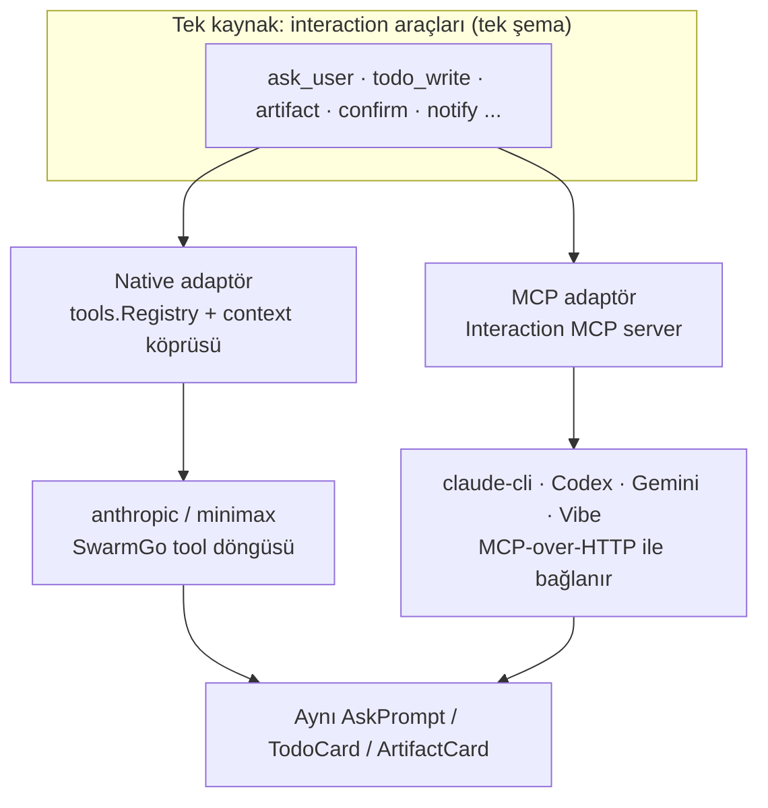
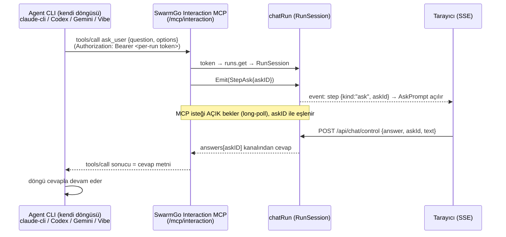

# 11 — SwarmGo Interaction MCP (Tasarım / Plan)

> **Durum:** Plan (uygulanmadı). Onay sonrası Faz 1 ile başlanacak.
> **Amaç:** Tüm insan-etkileşimli (human-in-the-loop) ve UI-etkileyen araçları
> (`ask_user`, `todo_write`, artifact, ileride onay/bildirim vb.) **tek bir ortak
> MCP sunucusu** üzerinden **kendi agentic döngüsünü çalıştıran her CLI ajanına**
> (claude-cli, Codex, Gemini, Mistral Vibe…) kazandırmak. Böylece native
> (anthropic/minimax) yolda zaten çalışan etkileşim araçları, CLI yollarında da
> **aynı davranışla** çalışır (SDK-parite — bkz. `09-CLAUDE-AGENT-SDK.md`).
>
> **Kapsam genişledi (2026-06-16):** Tasarım artık yalnız claude-cli'ye değil,
> MCP-over-HTTP destekleyen **tüm agent CLI'larına** CLI-agnostik biçimde yazılmıştır.
> İlk hedef claude-cli; Codex / Gemini / Mistral Vibe aynı sunucuya bağlanır.

---

## 1. Sorun

Kendi agentic tool döngüsünü çalıştıran her CLI ajanında "soru sorma" çıkmaz sokak:

| Mekanizma | Çalıştığı yol | CLI'de durum |
|-----------|---------------|--------------|
| SwarmGo `ask_user` (Faz P1) → AskPrompt | native (anthropic/minimax) | **bağlı değil** — CLI kendi döngüsünü sürüyor |
| claude-cli'nin built-in `AskUserQuestion`'ı | claude-cli | `-p` non-interactive modda **cevaplanamaz** → iptal/red |
| Codex / Gemini / Vibe'ın kendi soru mekanizması | ilgili CLI | non-interactive/headless modda SwarmGo UI'ına **bağlı değil** |

Aynı kopukluk `todo_write`, `create_artifact`/`update_artifact` gibi **diğer tüm
built-in etkileşim araçları** için de geçerli: CLI yollarında hiçbiri SwarmGo
UI'ına bağlı değil.

**Kök sebep:** Bu CLI'lar (`claude -p`, `codex exec`, `gemini`, `vibe`) **kendi**
agentic tool döngüsünü çalıştırır. SwarmGo yalnızca **dış** MCP sunucularını CLI'ye
delege eder (`internal/agent/climcp.go`); **kendi** etkileşim araçlarını CLI'ye hiç
sunmaz.

**Belirti (kullanıcı):** "soru penceresi hiç çıkmıyor"; ajan "AskUserQuestion
çağrılabiliyor ama cevap gelmiyor" diyor.

---

## 2. Çözüm: tek kaynak + iki adaptör

Temel ilke: **her etkileşim aracı tek yerde tanımlansın**, iki farklı yola
adapte edilsin. Native yol bunları context-köprüsüyle (mevcut `WithAsker` deseni),
CLI yolları ise yeni **Interaction MCP** ile kullanır.



**Tek şema kuralı (drift önleme):** İki adaptör de tool tanımlarını (ad + JSON
şema + handler) **`tools.Registry`'den** alır; MCP `tools/list` cevabı bunları
yeniden tanımlamaz, **enumerate eder**. Böylece native ve CLI yolları zamanla
ayrışamaz — tek doğruluk kaynağı `internal/tools`'taki built-in tanımlardır.

Ortak çekirdek soyutlama — **`RunSession`** (aktif sohbet turunu temsil eder):

```go
type RunSession interface {
    Emit(step TurnStep)                              // SSE'ye adım it (todo, artifact kartı, ...)
    Ask(ctx context.Context, askID, question string, options []string) (string, error) // AskPrompt aç + cevabı bekle
    Artifacts() ArtifactSink                         // artifact üret/güncelle
    // ileride: Confirm, Notify, Pick, ...
}
```

`chatRun` bu arayüzü uygular. Hem native built-in'ler (context ile), hem MCP
sunucusu (token → run lookup ile) aynı `RunSession` üzerinden iş görür → **davranış
birebir aynı**.

---

## 3. Akış (ask_user, herhangi bir CLI üzerinden)



Aynı desen `todo_write` için bloklamadan çalışır (Emit → ok döner); `ask_user` /
gelecekteki `confirm` için bloklanır (cevap beklenir). Her MCP tool çağrısı
`Emit` ile **`TurnStep` izine** yazılır → aktivite kartları (ActivityCard /
TodoCard / ArtifactCard) CLI yolunda da görünür.

---

## 4. Transport kararı (KARAR: In-process HTTP)

| Seçenek | Artı | Eksi | Karar |
|---------|------|------|-------|
| **In-process HTTP (Streamable MCP)** — SwarmGo HTTP sunucusunda `/mcp/interaction` | Tek süreç; run registry'ye, SSE'ye, DB'ye **doğrudan** erişim; ekstra process yok; **tüm CLI'lar HTTP MCP destekliyor** | MCP-over-HTTP **server** protokolünü yazmak gerek | ✅ **SEÇİLDİ** |
| stdio alt-komut (`swarmgo mcp-bridge`) | stdio JSON-RPC daha basit | Ayrı process → ana sürece IPC + korelasyon; iki sıçrama | Fallback (yalnız HTTP handshake takılırsa) |

**Neden HTTP kazandı:** Araştırma (2026-06) tüm hedef CLI'ların **Streamable HTTP
MCP** desteklediğini gösterdi (Codex: yalnız HTTP, SSE deprecated; Gemini: `httpUrl`;
claude: `type:"http"`; Vibe v2.0: MCP). Tek HTTP server hepsini karşılar.

### 4.1 Streamable HTTP server sözleşmesi (çiviyle sabit)

> En büyük risk handshake (§12.1). Bu yüzden protokol **önceden** pinlenir.

- **Endpoint:** tek yol `POST /mcp/interaction` (JSON-RPC gövde). Opsiyonel
  `GET /mcp/interaction` server→client SSE kanalı (ilk fazda gerekmez; tool
  sonuçları POST cevabında döner).
- **Protokol sürümü:** initialize'da anlaşılır. **(Spike doğruladı:** claude-code
  2.1.178 `2025-11-25` öneriyor; server `2025-06-18` dönünce **sorunsuz kabul etti**
  → downgrade negotiation çalışıyor. Server kendi desteklediği en yüksek ortak sürümü
  döner.**)** Sonraki isteklerde istemci `MCP-Protocol-Version` header'ını echo eder.
- **Accept:** istemci `application/json, text/event-stream` gönderir; biz tek
  cevap için `application/json`, akış gerekiyorsa `text/event-stream` döneriz.
- **Oturum:** `initialize` cevabında `Mcp-Session-Id` (kriptografik UUID) atanır;
  istemci sonraki isteklerde header'da geri yollar. (İlk fazda token zaten run'a
  bağladığından session-id opsiyonel; spec uyumu için döneriz.)
- **Metotlar (minimal):** `initialize`, `notifications/initialized`, `tools/list`,
  `tools/call`. Bunun dışındaki metotlara `-32601 Method not found`.
- **Hata modeli:** JSON-RPC `error{code,message}`; tool seviyesi hatalar
  `tools/call` sonucunda `isError:true` + `content[]` ile döner (model devam edebilsin).

> Not: SwarmGo'da MCP **client** (`internal/mcp`) zaten var; bu plan MCP **server**
> tarafını ekler. **Mesaj tipleri (`Request`/`Response`/`Error`) `internal/mcp`'ten
> yeniden kullanılır**, kopyalanmaz.

---

## 5. Korelasyon & güvenlik (tek opak bearer token)

CLI'ların header desteği farklı (Codex yalnız **bearer token**, Gemini `headers`,
claude `headers`). Bu yüzden korelasyon **tek opak per-run bearer token** ile yapılır —
her CLI'da çalışan en küçük ortak payda:

- mcp-config **tur başına** üretilir. Interaction entry'sine `url` + per-run
  **`Authorization: Bearer <token>`** gömülür (token kriptografik rastgele, run'a bağlı).
- MCP handler `Authorization: Bearer` → `s.runs.byToken(token)` ile turu bulur;
  eşleşmezse **401**. Token tur bitince geçersiz (run unregister + `write=nil`).
- Codex `bearer_token_env_var` kullandığından, o CLI için token **env değişkenine**
  yazılır ve config oradan referans verir (subprocess env'ini biz kontrol ederiz).
- Sunucu yalnız loopback'e bind (mevcut davranış). Token, aynı makinedeki başka
  süreçlerin tura müdahalesini engeller. Config temp dosyası tur sonunda silinir.

> Tek opak token sayesinde ayrı `X-Swarm-Run` header'ı **gerekmez**; isteğe bağlı
> debug için header de kabul edilebilir ama zorunlu değil.

---

## 6. Eşzamanlılık: SSE yazımını serileştir + ask korelasyonu

Şu an `handleChatStream` içindeki `sse(...)` yalnız handler goroutine'inden
çağrılıyor. Interaction MCP **farklı goroutine'den** adım itecek →
`http.ResponseWriter` üzerinde race. Çözüm: `chatRun`'a **mutex'li emit** +
**askID bazlı cevap yönlendirme** eklenir.

```go
type chatRun struct {
    cancel  context.CancelFunc
    steer   chan string
    mu      sync.Mutex                     // SSE yazımını serileştirir
    write   func(event string, data any)   // handler kurar (sse closure)
    token   string                         // per-run opak bearer secret
    answers map[string]chan string         // askID → cevap kanalı (race'siz, paralel sorulara hazır)
}

func (r *chatRun) emit(event string, data any) {
    r.mu.Lock()
    defer r.mu.Unlock()
    if r.write != nil {
        r.write(event, data)
    }
}
```

Hem `OnEvent` callback'i (native + cli trace), hem MCP handler `run.emit` kullanır.
Tur bitince `write=nil` → geç gelen MCP çağrıları sessizce yok sayılır / hata döner.
`POST /api/chat/control {action:"answer", askId, text}` cevabı doğru `answers[askId]`
kanalına yollar (mevcut tek-kanallı `answer` yerine).

---

## 7. CLI tarafı wiring (CLI-agnostik adaptör)

Her CLI'nin kendi mcp-config formatı + built-in-disable bayrağı var. Ortak çekirdek
(endpoint + token) aynı; CLI'ye özgü kısım küçük bir **adaptör** ile yazılır
(`climcp.go` deseni, her CLI provider'ı kendi yazıcısını taşır).

### 7.1 CLI yetenek matrisi

| CLI | Provider dosyası | MCP config | HTTP alanı | Per-run token taşıma | Built-in ask kapatma |
|-----|------------------|------------|------------|----------------------|----------------------|
| **claude-cli** (ilk hedef) | `providers/claudecli.go` + `agent/climcp.go` | `--mcp-config` JSON (temp) | `type:"http"`, `url` | `headers:{Authorization}` | `--disallowedTools AskUserQuestion TodoWrite` *(doğrulandı)* |
| **Codex CLI** | (yeni) `codexcli.go` | `config.toml` `[mcp_servers]` (veya `--config`) | `url` | `bearer_token_env_var` → env | doğrulanacak (Codex'in built-in ask'i farklı) |
| **Gemini CLI** | (yeni) `geminicli.go` | `settings.json` `mcpServers` | **`httpUrl`** (standart dışı) | `headers` | doğrulanacak |
| **Mistral Vibe** | (yeni) `vibecli.go` | Vibe MCP config | doğrulanacak | doğrulanacak | doğrulanacak |

> İlk fazda **yalnız claude-cli** kablolanır. Diğer CLI'lar için provider + adaptör
> ayrı, sonraki işlerdir; **Interaction MCP server'ı ortaktır** (yeniden yazılmaz),
> sadece her CLI'ye uygun config entry üretilir.

### 7.2 claude-cli wiring (Faz 1)

1. mcp-config'e **her zaman** interaction server entry'si eklenir (dış MCP yoksa bile).
   Bunun için `writeCLIMCPConfig` boş-dönüş davranışı değişir (entry her durumda var).
2. `--allowedTools` listesine `mcp__swarmgo_interaction__ask_user` vb. eklenir.
3. **Built-in çakışanlar kapatılır:** `--disallowedTools AskUserQuestion TodoWrite`
   (CLI artık SwarmGo MCP eşdeğerlerini kullanır; çıkmaz sokak biter).
4. `--append-system-prompt`'a kısa kullanım notu: "Kullanıcıya soru sormak için
   `ask_user`, ilerleme listesi için `todo_write` araçlarını kullan."

Wiring köprüsü: API katmanı `{interactionURL, token}`'ı context ile runtime'a
geçirir (`tools.WithInteractionEndpoint(ctx, ...)` — mevcut context köprü deseni);
`writeCLIMCPConfig` bunu okuyup entry üretir.

---

## 8. İlk tool seti + genişleme

| Tool | Tip | İlk faz |
|------|-----|---------|
| `ask_user` | bloklayan (cevap bekler) | Faz 1 |
| `todo_write` | bloklamayan (UI kartı) | Faz 1 |
| `create_artifact` / `update_artifact` | bloklamayan | Faz 2 |
| `request_confirmation` (evet/hayır) | bloklayan | Faz 2 |
| `schedule_wake` | bloklamayan | Faz 2 |
| `use_skill` | bloklamayan (skill gövdesi döndürür) | Faz 4 |
| `spawn_session` | bloklamayan (fire-and-forget) | Faz 4 |
| `notify` (masaüstü bildirim) | bloklamayan | Faz 3 |
| workspace/oturum etkileşimleri | — | Faz 3+ |

Yeni tool eklemek = `tools.Registry`'de tek tanım → her iki adaptöre (native +
MCP) otomatik yansır (tek şema kuralı, §2).

**`spawn_session` (Faz 4, 2026-06-19):** Bir self-management aracı olduğundan CLI
yolunda **yalnızca self-manage açıkken** ilan edilir (`interactionBackend.tun.
SelfManageEnabled()`), native yoldaki `buildRegistry` gating'ini birebir yansıtır.
Tur başına spawn bütçesi (`SpawnMaxPerTurn`) için, stream handler her ajan turunda
`chatRun`'a taze bir `*tools.SpawnSessionTool` örneği kurar (`setSpawnTool`);
native yoldaki per-turn tool örneğiyle aynı sıfırlama davranışı. `Call()` dispatch
bu örneğe `spawn_session` adıyla yönlendirir. Böylece claude-cli ajanları (Coder,
Fasty …) de bağımsız oturum başlatabilir — canlı doğrulandı.

**`use_skill` (Faz 4, 2026-06-19):** claude-cli ajanları sistem promptunda
`# Available Skills` kataloğunu **görüyordu** ama gövdeyi yükleyecek araçları
yoktu (`use_skill` native bir Go aracı; CLI'nin `--mcp-config`'inde yer almıyordu)
→ skill'ler CLI tarafından okunamıyordu. Çözüm: `use_skill` Interaction MCP'ye
köprülendi. Stream handler her turda `chatRun`'a, **yanıtlayan ajanın** izinli
setini (`AllowedFor`) uygulayan bir skill yükleyici kurar (`setSkillLoader` →
`Runtime.LoadSkillForAgent`); backend dispatch `use_skill` adıyla buna yönlendirir
ve çıktıyı native `UseSkillTool.Call` ile birebir aynı biçimde döndürür
(`# Skill: <slug>\n\n<body>`). Erişim kontrolü, sub-skill footer'ı ve lazy disk
okuma native yolla tam parite. Tek kaynak SwarmGo skill store'u kalır —
dosya kopyası/symlink yok.

**Self-management köprüsü (CLI-3, 2026-06-19):** claude-cli'nin native
`activate_tools` döngüsü yok; bu yüzden lazy self-management ailesi (agents/flows/
schedules/tasks/hooks/mcp/secret/skill/settings — bkz. `_Docs/24-SELF-MANAGEMENT.md`)
CLI ajanlarına görünmüyordu. Çözüm: bu lazy built-in'ler CLI tarafına **önden
advertise** edilip native registry üzerinden dispatch edilir. Mekanizma generic:
- `Runtime.BridgeTools(ctx, agent)` per-ajan registry'yi kurar → `Registry.BridgeableDefs`
  (lazy built-in'lerin **tam şeması**, MCP araçları hariç; per-ajan `toolFilter`
  uygulanır) + bir dispatcher closure'ı döner.
- Stream handler her ajan turunda `run.setBridge(defs, call)` ile bunu run'a kurar
  ve CLI endpoint'ini **birleşik allowlist** ile yeniden bağlar
  (`mergeInteractionToolNames`: statik interaction araçları + köprü araçları, dedup).
- `Backend.Tools(token)` artık **per-run**: token→run çözülür, statik spec'lere
  run'ın `bridgeDefs`'i eklenir (ad-bazlı dedup; `spawn_session` çift sayılmaz).
  `interaction.Backend.Tools()` imzası `Tools(token string)` oldu (handler zaten
  her istekte bearer'ı doğruluyor).
- `Call()` default case → `run.bridgeCallFor()` ile native registry'ye dispatch.
  Advertise edilen katalog (+ per-ajan filter) hangi adın çağrılabileceğinin kapısı.
- Self-manage kapalıyken katalog boş (lazy built-in yok) → köprü no-op.
- Test: `mcp_interaction_test.go TestInteractionBridge` (advertise + dispatch +
  token izolasyonu). claude-cli ile canlı uçtan-uca doğrulama **beklemede**.

**Tek-kaynak allowlist (CLI-2, 2026-06-19):** Önceden CLI'ye verilen araç
allowlist'i (`climcp.go` içindeki sabit `interactionToolNames`) ile backend'in
`Tools()` advertise listesi **iki ayrı yerde** elle senkron tutuluyordu — yeni
bir araç eklemek üç dokunuş (Tools + Call + allowlist) gerektiriyor, biri unutulsa
sessizce kırılıyordu. Artık tek kaynak var: backend `interactionToolSpecs(tun)`
hem `Tools()`'u (advertise) hem `interactionAdvertisedNames(tun)`'ı üretir; stream
handler bu isimleri her turda `InteractionEndpoint.ToolNames`'e koyar; `climcp.go`
allowlist'i bundan türetir. Sonuç: **araç eklemek = `interactionToolSpecs`'e bir
`Def()` + `Call()`'a bir `case`** — allowlist otomatik takip eder, ikinci liste
yok. (Self-manage'e bağlı `spawn_session` gating'i tek yerde kalır → advertise ve
allowlist ikisi de aynı koşula uyar.) Değişmez: `mcp_interaction_test.go`
`TestInteractionAdvertisedNames` advertise == allowlist isimlerini kilitler.

---

## 9. Dosya değişiklikleri (tahmini)

**Yeni:**
- `internal/api/mcp_interaction.go` — MCP-over-HTTP server (initialize/tools/list/tools/call), `internal/mcp` mesaj tiplerini reuse eder, bearer→run doğrulama, tool dispatch → `RunSession`.
- `internal/interaction/session.go` — `RunSession` arayüzü; tool tanımları `tools.Registry`'den enumerate edilir (yeniden tanımlanmaz).
- `internal/api/mcp_interaction_test.go` — protokol (initialize/list/call) + ask/answer round-trip + bearer reddi + emit mutex testi.

**Değişen:**
- `internal/api/chat_control.go` — `chatRun`'a `mu`/`write`/`token`/`answers` + `emit`; `register` token üretir; `answer` aksiyonu `askId`'ye yönlenir.
- `internal/api/chat_stream.go` — `run.write = sse` kur; `OnEvent`/asker → `run.emit`; interaction endpoint+token'ı context'e koy.
- `internal/agent/climcp.go` — interaction server entry'si **her zaman** eklenir + allowedTools; boş-dönüş davranışı kalkar.
- claude-cli çağrısı (`providers/claudecli.go` / `agent/toolloop.go`/`climcp`) — `--disallowedTools` + system-prompt notu.
- `internal/tools/ask.go` benzeri — `WithInteractionEndpoint` context köprüsü.
- `_Docs/09-CLAUDE-AGENT-SDK.md` + `SKILL.md` — yeni mimari notu.

**İleride (CLI başına, ayrı iş):**
- `internal/providers/codexcli.go` · `geminicli.go` · `vibecli.go` — her biri kendi MCP config yazıcısı + döngü shell-out'u; Interaction MCP server'ı ortak kullanır.

---

## 10. Fazlama

- **Faz 0 (Spike — KARAR: önce bu):** Minimal `/mcp/interaction` (yalnız
  `initialize` + `tools/list` + tek dummy tool). `claude -p --mcp-config` ile
  gerçekten `tools/list` çekilebiliyor mu **2-3 saatlik timebox** içinde doğrula.
  Tutarsa Faz 1; tutmazsa **stdio fallback**'e geç. En pahalı belirsizliği başta öldürür.
- **Faz 1 (MVP): ✅ TAMAMLANDI (2026-06-16, §15).** HTTP MCP server + `ask_user`
  (bloklayan) + `todo_write`; claude-cli wiring + built-in disallow; canlı
  claude-cli testi geçti (soru penceresi açıldı, cevap CLI'ye döndü, tur devam etti).
- **Faz 2: ✅ TAMAMLANDI (2026-06-16, §16).** `create_artifact`/`update_artifact`
  + `request_confirmation`; CLI izinde todo/artifact kart paritesi (namespace strip
  + todo promotion). Canlı claude-cli testi geçti.
- **Faz 3:** `notify` + workspace/oturum etkileşimleri; doküman + skill güncelleme.
- **Faz 4 (CLI genişleme):** Codex / Gemini / Mistral Vibe provider + adaptör;
  her biri aynı Interaction MCP'ye bağlanır; per-CLI built-in-disable + token taşıma
  matristen (§7.1) uygulanır.

---

## 11. Test planı

- **Birim:** MCP JSON-RPC handler (initialize/list/call), bearer reddi (401),
  `emit` mutex, askID yönlendirme.
- **Entegrasyon (canlı, claude-cli):** "Bana net olmayan bir şey sor" promptu →
  AskPrompt açılır → Playwright/Chrome ile cevap ver → CLI cevapla devam eder.
- **Parite:** aynı senaryo anthropic anahtarıyla native yolda → aynı UI/davranış.
- **Regresyon:** dış MCP sunucuları + interaction birlikte; `--disallowedTools`
  diğer araçları bozmuyor; interaction entry üretilemezse tur düşmüyor (§12.5).
- **CLI-agnostik (Faz 4):** Codex/Gemini handshake + ask/answer round-trip (her CLI
  kurulu ise).

---

## 12. Riskler & açık sorular

1. **CLI Streamable HTTP MCP uyumu** — ✅ **claude-cli için ÇÖZÜLDÜ** (Faz 0 spike,
   §14). Codex/Gemini/Vibe için Faz 4'te doğrulanacak; takılırsa **stdio fallback**.
   *(eski en büyük risk; claude tarafı artık yeşil)*
2. **Eşzamanlı repo düzenlemesi** — bu repoda başka bir oturum aktif olabilir;
   çakışmayı önlemek için iş ayrı dosyalarda yoğunlaşır.
3. **Bloklayan tool zaman aşımı** — ✅ **çözüldü/önemsiz.** claude-code'da
   `MCP_TOOL_TIMEOUT` varsayılanı **~28 saat** (unset); progress notification'lar
   zaten timeout'u uzatmaz (spec). Yani bloklayan `ask_user`/`request_confirmation`
   pratikte zaman aşımına uğramaz → §6'da ayrıca 15 dk'lık sunucu-tarafı backstop
   var (kullanıcı hiç cevaplamazsa model devam eder). Diğer CLI'larda kısa varsayılan
   varsa mcp-config entry'sine per-server `timeout` alanı eklenir (Faz 4).
4. **Token sızıntısı** — mcp-config temp dosyası tur sonunda silinir (mevcut
   cleanup); token kısa ömürlü, run'a bağlı.
5. **Zarif düşüş** — interaction entry üretilemez/bağlanamazsa CLI turu **düşmemeli**;
   `ask_user` yokmuş gibi devam etmeli (CLI kendi cevabını üretir). Wiring opsiyonel.
6. **CLI başına header farkı** — bearer-token tabanlı korelasyon (§5) bunu çözer;
   yine de her CLI'nin token taşıma yöntemi (header vs env) matriste doğrulanmalı.

---

## 13. Kararlar (kapatıldı)

- **Transport:** ✅ **In-process HTTP (Streamable MCP)** ile başla; stdio yalnız fallback.
- **Faz 1 kapsamı:** ✅ Yalnız `ask_user` + `todo_write`. Artifact Faz 2'ye —
  önce asıl ağrı ("soru penceresi çıkmıyor") uçtan uca çözülür.
- **İlk iş:** ✅ MVP değil **Faz 0 spike** (handshake doğrulama, timebox'lı).
- **Çoklu CLI:** ✅ Tasarım CLI-agnostik; Interaction MCP server ortak, CLI başına
  yalnız config-yazıcı adaptör. İlk hedef claude-cli, genişleme Faz 4.

---

## 14. Faz 0 spike sonucu (2026-06-16 — DOĞRULANDI ✅)

Tüm wiring'i yazmadan önce, en büyük riski (handshake) ölçmek için ~40 satırlık
bağımsız bir Go MCP-over-HTTP server'ı (`C:\Users\user\Desktop\Progs\mcp-spike`)
ile `claude -p --mcp-config` canlı test edildi. **Sonuç: tam başarı.**

**Doğrulanan akış** (server logundan):

```
1. POST initialize        client proto=2025-11-25 → server 2025-06-18 (kabul edildi)
2. POST notifications/initialized
3. GET  /mcp/interaction   (Accept: text/event-stream — server→client SSE kanalı)
4. POST tools/list         → ping + ask_user listelendi
5. POST tools/call ping    {msg:"hello-from-cli"} → "pong: hello-from-cli"
```

claude `system/init` çıktısı: `"mcp_servers":[{"name":"swarmgo_interaction",
"status":"connected"}]` ve araç listesinde `mcp__swarmgo_interaction__ping` +
`ask_user` göründü; tool sonucu modele döndü, tur `success` bitti.

**Kesinleşen kararlar / öğrenilenler:**

1. ✅ `--mcp-config` `{"type":"http","url":...,"headers":{"Authorization":"Bearer ..."}}`
   şeklinde **header desteği var** → per-run bearer token (§5) doğrudan çalışıyor.
2. ✅ **Sürüm anlaşması toleranslı** — server eski sürüm dönse de istemci kabul ediyor.
3. 🔎 **`progressToken`**: `tools/call` `_meta`'sında progress token geliyor
   (`{"_meta":{"claudecode/toolUseId":...,"progressToken":2}}`). Bloklayan `ask_user`
   için, açık `GET` SSE kanalı üzerinden **progress notification** ile keep-alive
   yapılabilir (uzun bekleyişte istemci timeout'unu önler). → Faz 1'de doğrulanacak.
4. 🔎 **`elicitation` capability**: claude-code initialize'da
   `capabilities:{roots:{},elicitation:{}}` ilan ediyor — MCP'nin standart
   "kullanıcıdan girdi iste" mekanizması. Ama bu **claude'un kendi UI'ına** sorar;
   biz soruyu **SwarmGo UI'ında** istediğimizden `ask_user` (long-poll → AskPrompt)
   doğru tercih. Elicitation yalnız alternatif/yedek olarak not edildi.
5. 🔎 **Açık iş (Faz 1):** bloklayan `tools/call` (gerçek kullanıcı beklerken) istemci
   tarafı timeout sınırı; gerekirse progress-notification keep-alive ile çözülecek.

Spike kodu repo dışında (throwaway); üretim implementasyonu §9 dosya planına göre
SwarmGo içinde yazılacak.

## 15. Faz 1 sonucu (2026-06-16 — TAMAMLANDI ✅)

MVP implemente edildi ve canlı claude-cli ile uçtan uca doğrulandı.

**Yeni dosyalar:**
- `internal/interaction/server.go` — MCP-over-HTTP server (initialize/tools-list/tools-call), bearer auth, protokol sürümü `2025-06-18`; saf protokol (agent/api importu yok). `server_test.go` (bearer reddi, initialize, list, call, GET→405).
- `internal/tools/interaction.go` — `WithInteractionEndpoint`/`InteractionFrom` context köprüsü (WithAsker deseni).
- `internal/api/mcp_interaction.go` — `interactionBackend` (token→run çözümü, `ask_user` bloklayan + `todo_write` bloklamayan dispatch; tool şemaları `tools` paketi tanımlarından enumerate). `mcp_interaction_test.go` (ask round-trip, turn-ended, todo, bilinmeyen token).

**Değişen dosyalar:**
- `internal/api/chat_control.go` — `chatRun`'a `token`/`done`/`mu`/`write` + `emit`/`setWrite`/`clearWrite`; `chatRuns.byToken`; register per-run token üretir, unregister `done`'ı kapatır.
- `internal/api/chat_stream.go` — SSE yazımı `run.emit` üzerinden serileştirildi (handler + MCP goroutine yarışmaz); interaction endpoint context'e konur.
- `internal/api/server.go` — `selfURL`/`interactionMCP` alanları, `SetBaseURL`, `/mcp/interaction` route (nil-guard'lı).
- `internal/agent/climcp.go` — `writeCLIMCPConfig(ctx, mcpEnabled, inter)` imzası; interaction entry (`type:http`, `headers: Bearer`) + allow/disallow listeleri; `cliMCPServer.Headers`.
- `internal/agent/toolloop.go` — claude-cli, MCP kapalı olsa bile interaction endpoint varsa MCP-delegasyon yoluna girer.
- `internal/providers/claudecli.go` — `ConfigureMCP(..., disallowedTools)`; `--disallowedTools` (AskUserQuestion/TodoWrite) + interaction sistem-prompt notu.
- `cmd/swarmgo/main.go` — `server.SetBaseURL(cfg.Addr)`.

**Canlı test (claude-cli, MCP kapalı yeni ajan):** "önce ask_user ile renk sor"
promptu → `cli mcp config written servers=1 interaction=true` → SSE'de `ask` adımı
(`options:[RED,BLUE,GREEN]`) → `POST /api/chat/control {answer:"BLUE"}` → CLI tool
sonucu `BLUE` aldı → final cevap **"Your color is BLUE."** `go build`/`vet`/`test`
yeşil. MCP **kapalı** ajanda çalışması, interaction'ın MCPEnabled'dan bağımsız
kablolandığını kanıtlar.

**Açık işler:** (1) ✅ keep-alive gereksiz çıktı (28h timeout — bkz. §12.3);
(2) ✅ todo/artifact kart paritesi Faz 2'de çözüldü (§16); (3) askID bazlı
çoklu-soru yönlendirme hâlâ ertelendi (şu an tek `answer` kanalı yeterli — tool
döngüsü senkron, aynı anda tek soru).

## 16. Faz 2 sonucu (2026-06-16 — TAMAMLANDI ✅)

Interaction MCP araç seti genişletildi ve CLI iz paritesi sağlandı.

**Yeni araçlar (CLI yolunda):**
- `request_confirmation` (bloklayan, yeni `internal/tools/builtin_confirm.go`):
  riskli/geri-dönülemez eylem öncesi evet/hayır onayı; cevap `confirmed`/`denied`
  olarak normalize edilir (`NormalizeConfirmation`, TR+EN kelime eşleşmesi). Native
  registry'ye de eklendi (`toolsetup.go`); `ask_user` ile aynı bloklama deseni.
- `create_artifact`/`update_artifact` (bloklamayan): zaten native'de vardı; artık
  CLI yolunda da çalışır. `chatRun`'a per-agent **artifact sink** (`setArtifacts`)
  eklendi (chat_stream her ajan turunda kurar); interaction backend sink'i context'e
  koyup mevcut tool'u çağırır → tek-kaynak.

**CLI iz paritesi (`agent/trace.go`):** `traceStepToTurnStep` artık (a) interaction
namespace'ini (`mcp__swarmgo_interaction__`) tool adından **soyar** → kartlar native
ile aynı bare adla eşleşir (artifact/ask), (b) `todo_write` çağrısını **`StepTodo`
checklist kartına** yükseltir. Böylece CLI yolunda da TodoCard + ArtifactCard kalıcı
izde doğru render olur (canlı emit yerine izden — çift kart yok).

**Wiring:** `climcp.go` interaction allow-listesi 5 araca çıktı
(`interactionToolNames`); interaction `Tools()` + backend dispatch eşitlendi.
> Güncelleme (CLI-2, 2026-06-19): bu iki liste **tek kaynağa** indirildi —
> `interactionToolNames` sabiti kaldırıldı; allowlist artık backend'in advertise
> ettiği isimlerden (`InteractionEndpoint.ToolNames`) türüyor. Bkz. §8 use_skill notu.

**Canlı test (claude-cli):** "todo_write → request_confirmation → (onay) →
create_artifact" promptu → SSE'de TodoCard `[in_progress,pending]`, ASK
`[Onayla,İptal]` → cevap "Onayla" → `request_confirmation -> confirmed` →
`create_artifact -> {id...}` → TodoCard `[completed,completed]` → "DONE".
`GET /api/artifacts` → `('Faz2 Test','markdown',1)` kalıcı. Tool adları izde
namespace'siz. `go build`/`vet`/`test` yeşil (yeni testler: confirm normalize,
artifact dispatch, todo no-emit).

## İlgili dokümanlar
- `09-CLAUDE-AGENT-SDK.md` — SDK paritesi ADR (native vs CLI yol ayrımı)
- `07-CHAT-UX.md` — SSE adım akışı, `ask_user` (Faz P1) mevcut native mekaniği
- `SKILL.md` — Faz P1 (ask_user/todo_write), Faz 8 (MCP delegasyon) bağlamı

## Dış referanslar (2026-06 doğrulandı)
- MCP Streamable HTTP transport spec — `Mcp-Session-Id`, protokol sürümü
- OpenAI Codex CLI — MCP `config.toml` `[mcp_servers]`, yalnız Streamable HTTP (`url` + `bearer_token_env_var`), SSE deprecated
- Google Gemini CLI — `settings.json` `mcpServers`, Streamable HTTP için `httpUrl`, `headers` desteği
- Mistral Vibe v2.0 (27 Oca 2026) — MCP desteği eklendi (`mistralai/mistral-vibe`)
