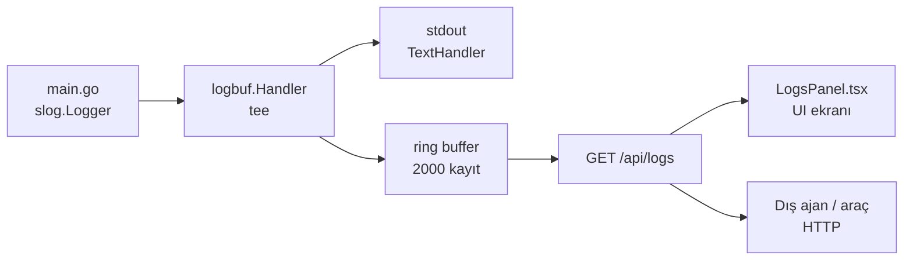
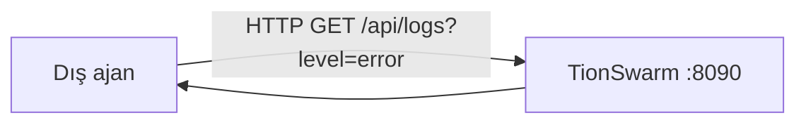

# TionSwarm — Loglama Sistemi

> Son güncelleme: **2026-07-13**
> Uygulama logları bir **bellek-içi ring buffer**'a yakalanır, **stdout'a** ve
> **disk dosyasına** yazılır, `GET /api/logs` ile UI'a + dış araçlara sunulur ve
> `/api/events` üzerinden **`log` SSE olayı** olarak canlı yayınlanır.

## Kaynak alanları + SSE canlı akış + UI yükseltmesi (2026-07-13)

- **Birinci sınıf kaynak alanları:** `logbuf.Entry` artık `component`, `session`,
  `agent`, `workspace` alanları taşır. Handler aynı-isimli slog attr'larını bu
  alanlara **terfi ettirir** (attrs map'inden çıkarır). Kablolama konvansiyonu:
  logger enjeksiyonunda `logger.With("component", "...")` — runtime `agent`
  (+`workspace=<id>`), scheduler `scheduler`, automation `automation`, API `api`,
  backup `backup`, workspace manager `workspace`, MCP havuzu `mcp`, claude-cli
  havuzu `provider`. Kayıt-anı attr'ı (`"session", id` gibi) da terfi eder.
- **SSE canlı akış:** `Buffer.SetNotify` her eklenen kaydı `events.Bus`'a
  `Type="log"` olayı olarak yayınlar (`app.Bootstrap` bağlar); `/api/events`
  bunu `log` SSE event adıyla iletir. Callback loglamaz → rekürsiyon yok;
  `Publish` non-blocking → yavaş abone kayıt düşürür, publisher'ı bloklamaz.
- **Yeni API filtreleri:** `GET /api/logs?component=&session=&since=&until=`
  (since/until unix **milisaniye**, kapsayıcı). `q` araması terfi eden
  alanları da kapsar.
- **`read_logs` aracı:** `q` mesaj + attrs + kaynak alanlarında arar (API ile
  tutarlı); `component` ve `session` filtre parametreleri eklendi.
- **Gürültü azaltma:** `toolloop` "tool call" logu INFO→DEBUG (block/deny INFO'da).
- **Sessiz bölgeler kapatıldı:** `db.atomicWriteBytes`/`nextID` yazım hataları
  WARN `component=db` (slog default tee'li olduğundan Loglar ekranında görünür);
  `tools/registry.go` MCP transport hatası WARN `component=mcp`.
- **UI:** bileşen filtresi (dropdown + satır rozeti tıklanabilir), zaman aralığı
  (15dk/1sa/24sa), debounce'lu arama + `<mark>` vurgusu, satır kopyalama,
  filtrelenmiş JSON indirme, takip kapalıyken "N yeni kayıt" rozeti,
  `content-visibility:auto` ile ucuz virtualization. Canlı mod artık SSE tail
  (+30sn mutabakat poll'u); eski 2.5sn tam-liste poll'u kaldırıldı.

## Disk log dosyası + UI'dan erişim (2026-06-23)

`SetupLogging` artık stdout'a ek olarak `io.MultiWriter` ile bir **disk dosyasına**
da yazar: `<dataDir>/logs/tionswarm.log` (append, best-effort — açılamazsa sessizce
stdout-only'e düşer). Yol çözümü `config.LogFilePath()` (= `config.DefaultDataDir()`
+ `logs/tionswarm.log`), böylece `api` paketi `app`'i import etmeden yolu bilir.

Loglar ekranında (`LogsPanel`) **yolu kopyala** + **klasörü aç** (Explorer
`/select`) eklendi. Endpoint'ler: `GET /api/logs/path`, `POST /api/logs/reveal`
(`api/logs_path.go`). Bellek-içi ring buffer (2000 kayıt) UI'ın canlı akışını,
disk dosyası ise tam geçmişi tutar.

## Takip edilmeyen hataları yakalama (son savunma hattı, 2026-06-18)

Açıkça `logger.Warn/Error` ile loglanmayan hataların da kaydı tutulur:

- **HTTP handler panic recovery** (`internal/api/middleware_recover.go`):
  `withRecover` her handler'ı sarar; bir panic'i yakalar, `Error("http handler
  panicked", method/path/panic/stack)` ile log akışına yazar ve istemciye temiz
  **500** döner. Önceden bu panic'ler yalnız net/http'nin per-request recover'ına
  düşüp **stderr**'de kalıyordu (logbuf'a/Loglar ekranına gelmiyordu).
  `http.ErrAbortHandler` yeniden panic'lenir (kasıtlı SSE abort'ları korunur).
  Zincir: `withCORS → withRequestLog → withRecover → withWorkspace → mux`.
- **Goroutine panic recovery**: `agent/flow.go` `driveFlow`,
  `orchestration/engine.go` paralel+sıralı node'lar
  — node panic'i süreç çökmesi yerine loglanan flow hatasına dönüşür.
- **Frontend hata köprüsü**: `POST /api/logs` (`handleClientLog`) istemci
  hatalarını aynı slog akışına yazar. Frontend `lib/reportError.ts`
  (`reportClientError` throttle'lı+keepalive'li + `installGlobalErrorHandlers`:
  `window.onerror` + `unhandledrejection`) ve `components/ErrorBoundary.tsx`
  (React render çökmesi → rapor + kurtarılabilir fallback) `main.tsx`'te kurulur.
  Böylece beyaz-ekran çökmeleri ve sessiz JS hataları da Loglar ekranında görünür.

## Genel Bakış

TionSwarm standart kütüphane `log/slog`'u kullanır. Boot'ta `main.go` tek bir
`slog.Logger` kurar; bu logger her workspace runtime'ına, scheduler'a, API
sunucusuna ve tüm alt sistemlere **enjekte edilir** (paket-geneli global logger
yok). Böylece tüm app + tüm workspace logları **tek akışta** toplanır.



## Mimari: tee'li slog handler + ring buffer

`internal/logbuf` paketi bir `slog.Handler` sarmalayıcısı sağlar (`Buffer.Handler`):
gelen her kaydı **hem** kalıcı `inner` handler'a (stdout `TextHandler`) **hem de**
sabit kapasiteli bir ring buffer'a yazar (tee deseni).

`main.go` kurulumu:

```go
logs := logbuf.New(2000) // ring buffer kapasitesi
logger := slog.New(logs.Handler(slog.NewTextHandler(os.Stdout, &slog.HandlerOptions{Level: slog.LevelInfo})))
```

- **Seviye eşiği:** `slog.LevelInfo` → `Debug` kayıtlar varsayılan olarak yazılmaz.
- **Ring buffer:** `internal/logbuf/logbuf.go`. `max` (2000) aşılınca en eski
  kayıtlar düşürülür (FIFO). Her kayıt artan bir `Seq` alır (UI'da React key).
- **Bellek-içi:** sunucu yeniden başlayınca buffer **sıfırlanır**. Kalıcı geçmiş
  için stdout'a bakılır (henüz dosyaya rotating log yok — bkz. *Gelecek*).

### `logbuf.Entry` şekli

```go
type Entry struct {
    Seq       int64             `json:"seq"`       // monoton artan sıra
    Time      int64             `json:"time"`      // unix milisaniye
    Level     string            `json:"level"`     // DEBUG|INFO|WARN|ERROR
    Message   string            `json:"message"`   // slog mesajı
    Component string            `json:"component"` // kaynak alt sistem (terfi eden attr)
    Session   string            `json:"session"`   // oturum id (terfi eden attr)
    Agent     string            `json:"agent"`     // ajan id (terfi eden attr)
    Workspace string            `json:"workspace"` // workspace id (terfi eden attr)
    Attrs     map[string]string `json:"attrs"`     // kalan key=value alanlar
}
```

`WithAttrs`/`WithGroup` desteklenir: grup öneki `group.key` olarak düzleştirilir.
`component`/`session`/`agent`/`workspace` attr'ları birinci sınıf alanlara terfi
eder ve map'ten çıkarılır.

## Loglanan olaylar

Loglar iki katmanda üretilir:

### 1. HTTP access-log (`internal/api/middleware_log.go`)

`withRequestLog` middleware'i **her API isteğini** loglar. `Routes()` zinciri:
`withCORS → withRequestLog → withRecover → withWorkspace` (withRecover, panik 500'ü
de access-log'a yansısın diye withRequestLog'un içinde).

- Mesaj: `"http request"`, alanlar: `method` / `path` / `status` / `dur`.
- Seviye eşlemesi: **2xx → INFO**, **4xx → WARN**, **5xx → ERROR**.
- `statusRecorder` durum kodunu yakalar; `Flush()` + `Unwrap()` ile
  `http.Flusher`'ı yeniden açar → SSE uçları (`chat/stream`, `events`)
  sarmalayıcıdan geçince akmaya devam eder.
- `skipRequestLog` atlananlar: `/api/logs` (kendi buffer'ını sel etmesin),
  `/api/events` (uzun-ömürlü SSE), `/health`. OPTIONS preflight `withCORS`'ta
  erken döndüğünden loglanmaz.
- **Akıllı gürültü azaltma** (`shouldLogRequest`, 2026-06-17): **başarılı okuma**
  istekleri (GET/HEAD + status < 400) **loglanmaz** — bunlar UI'ın yüksek-frekanslı
  poll'larıydı (sessions/settings/runtime…) ve tamponun ~%95'ini doldurup gerçek
  olayları ~2 saatte düşürüyordu. **Mutasyonlar** (POST/PUT/DELETE/PATCH) ve
  **başarısız** istekler (4xx/5xx) **her zaman** loglanır. İş-seviyesi INFO
  logları (chat/agent/…) bundan etkilenmez.

### 2. İş-seviyesi (business) loglar

"Hangi uç çağrıldı"nın ötesinde "ne oldu" anlamını veren semantik kayıtlar:

| Olay (mesaj) | Kaynak | Önemli alanlar |
|--------------|--------|----------------|
| `chat turn completed` | `api/chat.go`, `api/chat_stream.go` | agent, provider, model, in, out, steps, dur, stream |
| `agent created` / `updated` / `deleted` | `api/agents.go` | agent, id, provider, model |
| `session created` / `deleted` | `api/sessions.go` | session, agent |
| `task created` | `api/tasks.go` | task, title, owner |
| `task run finished` | `agent/executor.go` | task, trigger, status |
| `schedule created` / `toggled` | `api/schedules.go` | id, agent, cron, enabled |
| `mcp server toggled` / `tested` | `api/mcp.go` | server, tools (test başarısız → WARN) |
| `memory added` | `api/memory.go` | agent, kind, id |
| `flow run started` / `finished` | `agent/flow.go` | flow, run, status, steps |
| `agent reflected` | `agent/reflector.go` | agent, journals |

> Konvansiyon: log mesajları + alan değerleri **İngilizce** (kod kuralı). Hata
> yolları `s.logger.Warn/Error` ile zaten loglanır; başarı yolları yukarıdaki
> INFO kayıtlarıyla görünür kılınmıştır.

## API: `GET /api/logs`

`internal/api/logs.go` (`handleListLogs`). Uygulama-geneli — **workspace-scoped
değil** (tek ring buffer tüm workspace'leri kapsar).

| Query param | Açıklama | Varsayılan |
|-------------|----------|------------|
| `limit` | Filtreden sonra son N kayıt | 500 |
| `level` | Minimum seviye: `debug`/`info`/`warn`/`error` | hepsi |
| `q` | Mesaj + kaynak alanları + attrs üzerinde büyük/küçük harf duyarsız substring | yok |
| `component` | Kaynak alt sisteme tam eşleşme (`api`/`agent`/`scheduler`/`mcp`/`db`/…) | yok |
| `session` | Oturum id'sine tam eşleşme | yok |
| `since` / `until` | Zaman penceresi, unix **milisaniye** (kapsayıcı) | yok |

- `levelRank` minimum-seviye sıralaması yapar (boş/bilinmeyen → her şey geçer).
- `entryMatches` `q`'yu mesajda **ve** her attr key/value'da arar.
- Filtre uygulandıktan sonra en yeni `limit` kayıt döndürülür (oldest→newest).

Örnek:

```powershell
# Yalnız hatalar
Invoke-RestMethod "http://127.0.0.1:8090/api/logs?level=error&limit=50"
# "provider" geçen kayıtlar
Invoke-RestMethod "http://127.0.0.1:8090/api/logs?q=provider"
```

## UI: Loglar ekranı

`frontend/src/features/logs/LogsPanel.tsx` (NavRail → "📜 Loglar"):

- **Canlı takip (SSE):** "Canlı" açıkken kayıtlar `/api/events` `log` olayından
  canlı akar (30sn'de bir mutabakat poll'u SSE kopmalarını kapatır); yeni satıra
  otomatik kaydırır. Takip kapalıyken gelen eşleşen kayıtlar "N yeni kayıt —
  Yenile" rozetinde birikir.
- **Seviye chip'leri:** Hepsi / Debug / Info / Warn / Error.
- **Bileşen filtresi:** dropdown (mevcut kayıtlardan türetilir) + satırdaki
  bileşen rozetine tıklayınca o bileşene filtrelenir.
- **Zaman aralığı:** Tümü / 15 dk / 1 saat / 24 saat (`since` paramı).
- **Arama:** mesaj + alan üzerinde 300ms debounce'lu filtre (`q`); eşleşmeler
  satırda `<mark>` ile vurgulanır.
- **Satır kopyalama** (hover'da ikon) + **JSON indirme** (filtrelenmiş liste).
- **Performans:** satırlar `content-visibility:auto` ile ekran-dışında
  layout/paint atlar (1000 satırda pencere kütüphanesiz akıcılık).
- **Grupla** (varsayılan açık): ardışık **birebir aynı** kayıtları (aynı
  level + message + attrs) tek satıra katlar, `×N` rozeti + ilk→son zaman
  aralığı (tooltip) gösterir. Yalnız **ardışık** olanlar gruplanır (kronolojik
  akış bozulmaz); araya başka log girince yeni grup başlar. Mantık
  `lib/logGroup.ts` `groupConsecutive` (imza = level+message+sıralı attrs).
  Başlıkta "N satır · M kayıt" özeti. **Önemli:** bir attr bile farklıysa
  (ör. `dur=0s` vs `dur=1ms`) grup kırılır — bu kasıtlıdır.
- Seviye renkleri: ERROR kırmızı, WARN amber, INFO mavi, DEBUG soluk.

## Dış erişim (harici ajanlar)

`GET /api/logs` standart bir HTTP ucu olduğundan, ona erişebilen **herhangi bir
dış süreç/ajan** tüm app + workspace loglarını (hatalar dahil) okuyabilir.



Sınırlar ve güvenlik:

- **Loopback bind (varsayılan `127.0.0.1`):** yalnız **aynı makinedeki** süreçler
  erişir. Ağa açmak için `TIONSWARM_ADDR=0.0.0.0:8090` (bkz. `02-VERI-MODELI.md`,
  Windows Güvenlik Duvarı notu).
- **Kimlik doğrulama yok:** yerel tek-kullanıcı dev varsayımı. Ağa açılırsa
  bearer/token koruması eklenmeli (bkz. *Gelecek*).
- **Kapsam:** yalnız **backend `slog`** kayıtları. Tarayıcı/frontend (browser
  console) hataları bu tampona **düşmez** — istemcide kalır.

## Sınırlar / dikkat

- Ring buffer **bellek-içi**, 2000 kayıt; restart'ta sıfırlanır. Diske kalıcı log
  yok (stdout hariç).
- `Debug` seviyesi varsayılan kapalı (`HandlerOptions.Level = LevelInfo`).
- `/api/logs`, `/api/events`, `/health` access-log'a girmez; ayrıca **başarılı
  GET/HEAD** istekleri de loglanmaz (akıllı gürültü azaltma — yukarı bkz.). Bu
  sayede ~2000'lik tampon artık çoğunlukla mutasyon + hata + iş loglarıyla dolar,
  retention ciddi uzar.
- Çok-workspace logları tek akışta karışır; ayırt etmek için iş loglarına ilgili
  id'ler (agent/session/workspace) attr olarak eklenir.

## Genişletme rehberi

- **Yeni iş logu:** ilgili handler'da başarı yolunda `s.logger.Info("event name",
  "key", val, ...)`. İngilizce mesaj + düşük-kardinaliteli alanlar; ham/uzun
  içerik (tam prompt/cevap) basma.
- **Seviye seçimi:** beklenen akış = INFO; kurtarılabilir sorun = WARN; başarısız
  işlem = ERROR.
- **Runtime/agent paketinde:** enjekte edilen `r.logger`'ı kullan (global slog
  default'a yazma — tee'den geçmez, UI'da görünmez).

## Gelecek (öneri — henüz yok)

1. ~~**Canlı log SSE**~~ ✅ **Yapıldı (2026-07-13)** — `/api/events` `log` olayı;
   dış ajan da poll'suz canlı log (hatalar dahil) alabilir.
2. ~~**Frontend hata köprüsü**~~ ✅ **Yapıldı (2026-06-18)** — `POST /api/logs` +
   `ErrorBoundary` + global handler'lar (bkz. yukarıdaki "Takip edilmeyen
   hataları yakalama" bölümü).
3. **Kalıcı rotating log dosyası:** restart sonrası geçmiş korunur (UI'dan
   disk dosyası geçmişini okuma modu ile birlikte).
4. **Bearer auth + ağ bind:** gerçek uzak-ajan erişimi için token'lı koruma.
5. **Log satırı → oturum linki:** `session` alanından ilgili oturuma/
   SessionDebugModal'a atlama.

## İlgili dosyalar

- `internal/logbuf/logbuf.go` — ring buffer + tee'li slog handler + alan terfisi + `SetNotify`
- `internal/api/logs.go` — `GET /api/logs` (filtre: limit/level/q/component/session/since/until) + `POST /api/logs` (frontend hata köprüsü)
- `internal/api/events.go` — `log` SSE olayı (canlı tail)
- `internal/api/middleware_log.go` — HTTP access-log middleware
- `internal/api/middleware_recover.go` — HTTP panic-recovery middleware (son savunma hattı)
- `frontend/src/lib/reportError.ts` — istemci hata raporlayıcı + global handler kurulumu
- `frontend/src/components/ErrorBoundary.tsx` — React render çökmesi yakalayıcı
- `internal/api/{chat,chat_stream,agents,sessions,tasks,schedules,mcp,memory}.go` — iş logları
- `internal/agent/{worker,executor,flow,reflector}.go` — otonom/runtime logları
- `frontend/src/features/logs/LogsPanel.tsx` — Loglar ekranı (filtreler + gruplama + SSE tail)
- `frontend/src/features/logs/logGroup.ts` — ardışık aynı kayıtları katlama (`groupConsecutive`)
- `cmd/tionswarm/main.go` — logger kurulumu
