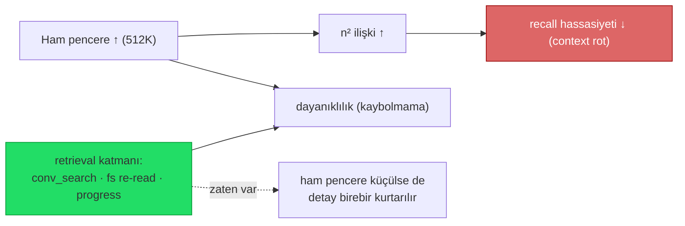

# 17 — Araç Çıktısı Token Optimizasyonu

> Ajan araç çıktılarının (shell, dosya, MCP) LLM context'ine girmeden önce küçültülmesi.
>
> **Not (2026-07-10): built-in araç-çıktısı sıkıştırması TAMAMEN KALDIRILDI.**
> TionSwarm artık hiçbir built-in (deterministik veya LLM tabanlı) araç-çıktısı
> sıkıştırması **içermez**. Eskiden var olan iki sistem — "Sistem A" (deterministik,
> kural tabanlı, `internal/tools/compact`) ve daha eski "Sistem B" (ucuz-model LLM
> özeti) — ilgili ayarlar (`compactToolOutput` / `compactMaxLines` / `compactMaxBytes`),
> tasarruf sayaçları (`CompactSavedBytes` / `compactSavedBytes`) ve tüm bütçe/UI
> hücreleriyle birlikte **çıkarıldı**. Bu iş artık tamamen **harici araçlara** devredildi:
>
> - **`rtk`** — komut-katmanında **agent tarafından** çağrılır (Bash sarmalayıcı; bkz.
>   kullanıcı `CLAUDE.md`'sindeki manuel fallback).
> - **`sqz`** — **PostToolUse hook** olarak bağlanır; araç çıktısını modele dönmeden
>   önce hook zincirinde kısaltır.
>
> Server-tarafı `clear_tool_uses` / API-native compaction (eskiyen/taşan sonuçlar) ve
> retrieval katmanı zaten transcript-düzeyi baskıyı karşılıyordu; ham araç-çıktısı
> kırpmasını harici bir hook/CLI katmanına taşımak built-in bir alt sistemi bakmaktan
> daha temiz. Aşağıda **harici araç tespiti + hook entegrasyonu** (artık ana yol)
> anlatılır; ardından prompt-cache ve bütçe konuları gelir.

## Neden harici?

TionSwarm'nun native agentic döngüsünde (`agent/toolloop.go`) her araç çağrısının çıktısı bir
`ToolResult` olarak konuşmaya eklenir ve sonraki model çağrısında **girdi token'ı** olarak ücretlenir.
`Bash` gibi araçlar 64 KB'ye kadar ham çıktı döndürebilir. `git status`, test runner, `ls -R`, `grep`
gibi komutlar context'i hızla şişirir. Bu baskıyı azaltmak artık **built-in bir katman değil**, harici
araçların (`rtk` CLI / `sqz` PostToolUse hook) sorumluluğundadır — mevcut `internal/conversation`
compaction'ı (transcript bütçesi) ve prompt-cache bu harici katmanı tamamlar.

Built-in tarafında geriye kalan tek koruma tool'ların kendi 64 KB hard-cap'idir; hata/boş sonuçlar
her zaman olduğu gibi **hiç dokunulmadan** modele gider.

## Bridged shell için in-process `sqz` (2026-07-25)

**Sorun:** `sqz hook claude` yalnız **native `Bash`** tool adını rewrite ediyor. TionSwarm
tüm shell'i bridged `mcp__tionswarm_interaction__Bash` (ve `…__PowerShell`) üzerinden
koşturduğu için sqz PostToolUse/PreToolUse hook'u bu araçları **tanımıyor** → hiç sıkıştırma
olmuyordu (doğrulandı: aynı `cat` komutu native adla rewrite edilir, bridged adla passthrough).

**Çözüm:** sıkıştırmayı **sunucu tarafında, in-process** uygula. Shell tool'ları opsiyonel bir
çıktı filtresi taşır (`ShellTool/PowerShellTool.WithOutputFilter`, `internal/tools/builtin_shell.go`);
foreground çalıştırmada, sonuç **modele dönmeden önce** ve yalnız `shellCompressMinBytes` (2 KB)
üstündeyse filtreden geçer. Canlı UI stream'i (`onChunk`) **ham** kalır — kullanıcı tam çıktıyı görür,
model sıkıştırılmış alır. Filtreyi `Runtime.sqzShellFilter` (`internal/agent/shell_optimizer.go`)
kurar: sqz **opt-in** (workspace'te sqz hook wired) **ve** binary PATH'te ise, çıktıyı
`sqz compress --cmd '<komut>'`'a stdin ile verir. Hata/eksiklikte **ham çıktı** döner + `Warn` log
(fail-open; sıkıştırma optimizasyondur, doğruluk değil). Hem **native** (buildRegistry) hem **bridged**
(NewShellRunner), hem **Bash** hem **PowerShell** aynı tek enjeksiyondan geçer.

**Workspace toggle:** `WSSettings.ShellOutputCompression` (`""`=auto → sqz-hook varlığını
izler, `"on"`=zorla aç [binary yeterli, hook gerekmez], `"off"`=kapat). Runtime'a
`SetShellCompression` ile push edilir; `sqzShellFilter` bunu okur. UI: Ayarlar ▸ Workspace ▸
"Shell çıktısı sıkıştırma (sqz)" seçici + workspace-oluşturma sonrası öneri kartı
(`recommendations.ts` `shell-compress`: sqz kurulu ama pasifse tek-tık `on`). Hook'u
kaldırmak zaten doğal bir kapatma anahtarıdır (auto modda).

**Ajan bilgilendirmesi `on` modunda da gider (fix 2026-07-28):** `tokenOptimizerCapability`
eskiden yalnız hook'lara bakıyordu → `on` ile hook'suz sıkıştırılan workspace'te ajan
uyarısız kalıyor, sqz'nin kısaltmalı çıktısını **truncation sanıp** komutu tekrar
çalıştırabiliyor ya da derleyici/test çıktısını yanlış ayrıştırabiliyordu. Artık
`Runtime.effectiveTokenOptimizers` hook tespitine in-process filtreyi de katıyor; `on`
her shell çağrısını kapsadığı için `*` matcher'ı ile gelir (daraltıcı kapsam notu
basılmaz). `off` bir gerçek sqz hook'unu **gizlemez** — o hook native araç adında hâlâ
ateşlenir. API DTO'su da `shellOutputCompression`'ı geri yansıtır; eskiden
yansıtmadığı için Ayarlar seçici gerçek değer ne olursa olsun daima "auto" gösteriyordu.

**Güvenlik/kayıpsızlık:** `sqz compress` kendi kendini gate'ler — küçük/precise çıktı (hash, key)
"0% reduction" ile **verbatim** döner; asıl mekanizma **lossless n-gram kısaltma** (sözlük çıktının
başına eklenir, model geri açabilir). `[sqz] N/N tokens` istatistik satırı **stderr**'e gider,
döndürülmez. Agent ham çıktıya her zaman erişebilir: (a) shell tool'una **`no_compress: true`**
argümanı (filtre aktifken şemada ilan edilir → o çağrıda byte-exact ham döner), veya (b)
`komut > dosya` (stdout boş → filtre tetiklenmez) + `Read`/`Grep` file tool'u. Testler:
`builtin_shell_test.go TestShellOutputFilter` (eşik + no_compress), `shell_optimizer_test.go
TestSqzShellFilter_Gate`.

## Harici araç tespiti (presence-only) — ana yol

Ayarlar → **Hooks** ekranındaki "Kurulu mu kontrol et" butonu (panel açılışında otomatik de çalışır), bu
cihazda isteğe bağlı harici CLI araçlarının **kurulu olup olmadığını** gösterir. Liste artık yalnız
token araçlarıyla sınırlı değil; **kategorilere** ayrılır:

| Kategori (`category`) | Araç | Kullanım (`wire`) |
|---|---|---|
| `token` (Token / bağlam optimizasyonu) | `rtk`, `sqz` | `hook` — tek tıkla PostToolUse hook'u bağlanır (`sqz`); `rtk` ise komut-katmanında agent tarafından Bash ile çağrılır |
| `render` (Render / diyagram) | `mmdc` (mermaid-cli) | `cli` — yerelde mermaid→SVG/PNG dosya çıktısı |

- Backend: `GET /api/external-tools` (`api/external_tools.go`) → `exec.LookPath` ile PATH'te arar.
  **Araçları kurmaz, çalıştırmaz, değiştirmez** (Windows'ta PATHEXT'e saygılı). Dönüş:
  `[{name,desc,url,category,wire,found,path}]`. Yeni araç eklemek = `knownExternalTools`'a tek giriş
  (yalnız `wire="hook"` ise frontend `TOOL_HOOK_TEMPLATES`'e ek şablon gerekir).
- Frontend: `systemApi.externalTools()` + `HooksPanel`; araçlar `category`'ye göre gruplanır, `wire`'a
  göre rozet/buton gösterilir (`hook`→Bağla/Aktif toggle, `mcp`→MCP rozeti, `cli`→CLI rozeti) + repo linki.
- Bu yalnızca **bilgilendirme + opsiyonel wire-up**'tır; TionSwarm bu araçları kendiliğinden çalıştırmaz.
  Araç-çıktısı sıkıştırması **artık yalnız bu harici yoldadır** (built-in `compact` alt sistemi
  kaldırıldı): `sqz` PostToolUse hook'u olarak bağlanır, `rtk` agent tarafından Bash ile çağrılır.
  `cli` araçları (`mmdc`) ajan tarafından geliştirme sırasında Bash ile kullanılır.

### `sqz` PostToolUse hook entegrasyonu

- `sqz` `token` kategorisinde, `wire="hook"` olarak listelenir → Ayarlar → **Hooks** ekranında
  tek tıkla **PostToolUse** hook'u olarak bağlanabilir (frontend `TOOL_HOOK_TEMPLATES`).
- PostToolUse zincirinde araç çıktısı, modele/transkripte dönmeden önce `sqz`'e verilir; hook
  kısaltılmış çıktıyı geri döndürür. TionSwarm bu kazanımı **ölçmez** (Claude Code hook sözleşmesi
  tasarruf sayacı sunmaz) — kazanç dolaylı olarak input-token düşüşünde görünür.
- `rtk` için ayrı bir hook şablonu gerekmez; agent gürültülü komutları doğrudan `rtk <cmd>` ile
  sarmalar (kullanıcı `CLAUDE.md`'sindeki manuel fallback listesi).

## Sınırlar / Notlar

- Built-in araç-çıktısı kırpması **yoktur**; kullanıcı, modele giden `ToolResult` ile UI'da
  gösterilen/persist edilen `TurnStep.Output`'u birebir aynı görür (harici hook uygulanmışsa her
  ikisi de hook'tan geçmiş haliyle gösterilir → tutarlılık korunur).
- Komut-özel akıllı kısaltma (git/test/grep'e özgü) built-in tarafta yok; bu iş harici `rtk`/`sqz`
  araçlarının komut-aile kurallarına bırakıldı.
- claude-cli delegasyon yolu kapsam dışıdır (çıktıları TionSwarm'nun `ToolResult` katmanından geçmez).

### Tool dizisi prompt-cache breakpoint'i (2026-07-02)

Anthropic prefix-cache sırası `tools → system → messages`. Eskiden cache breakpoint
yalnız static **system** bloğundaydı; tool şemaları dolaylı (system prefix'i sayesinde)
cache'leniyordu → system bloğu değişirse tool cache'i de düşerdi. Artık `toAnthropicTools`
caching açıkken **son tool'a bağımsız bir breakpoint** koyuyor (1s TTL, system'le aynı;
sıra `tools(1h)→system(1h)` geçerli). Böylece tool tanımları **kendi prefix'inde** cache'lenir
ve bir sistem-prompt düzenlemesi tool cache'ini bozmaz (Anthropic önerilen "son araca
breakpoint" pratiği). Politika değişmedi: yalnız `extendedCache` açıkken; kapalıyken hiçbir
tool breakpoint'i eklenmez. Kod: `internal/providers/anthropic.go` (`anthropicTool.CacheControl`,
`toAnthropicTools`). Test: `TestToAnthropicTools_*`.

### Konuşma geçmişi kayan breakpoint'i (2026-07-02)

Önceki iki breakpoint yalnız **statik** prefix'i (tools + system) cache'liyordu; her turda
**tüm transkript** için tam input ücreti ödeniyordu. Uzun oturumlarda (özellikle Fable 5'in
1M penceresinde) baskın maliyet kalemi ham geçmiştir. Artık `toAnthropicMessages` caching
açıkken **son mesajın son bloğuna** kayan bir breakpoint (1h TTL) koyuyor → tüm konuşma
prefix'i cache'lenir. Anthropic sırası `tools → system → messages`, breakpoint limiti 4;
`tools(1) + system-static(1) + history(1) = 3` güvenle içeride. Tur N'de prefix cache
**yazımı** olur, tur N+1'de aynı prefix cache **okuması** (0.10×) olur ve breakpoint en yeni
mesaja kayar (standart "sliding breakpoint"). Breakpoint son bloğa konur — rol/blok türü
farketmez (trailing `tool_result` da olur). Politika birleşik: yalnız `extendedCache` açıkken;
`req.MaxTokens==0` yolu etkilenmez. Kod: `contentBlock.CacheControl` + `toAnthropicMessages`
(iki çağrı yeri: `Complete`/`Stream`). Test: `TestToAnthropicMessages_*`.

> **Uyarı — thinking cache'i bozar:** adaptif thinking parametresi tur-arası değişirse
> mesaj prefix'i geçersiz olur (cache miss). `resolveThinkingBudget` deterministik olduğundan
> normalde sabit kalır; bir ajanın thinking seviyesini oturum ortasında değiştirmek yeni bir
> cache yazımı tetikler.

### Hedge breakpoint + blok-bazlı coalesce (2026-07-08)

Cache denetiminde bulunan iki kırılım senaryosunun kapatılması:

1. **Hedge breakpoint (4. breakpoint):** Anthropic cache araması bir breakpoint'ten
   yalnız **~20 content block** geriye bakar. Tek kayan breakpoint'le, büyük bir paralel
   tool batch'i (N `tool_use` + N `tool_result` bloğu > 20) önceki çağrının cached
   prefix'ini bu ufkun dışında bırakıp **tüm geçmişi** yeniden yazdırabiliyordu. Artık
   `toAnthropicMessages` kayan breakpoint'e ek olarak **bir önceki taşıyabilen mesajın son
   bloğuna** ikinci bir breakpoint (hedge) koyar — bu konum bir önceki çağrının breakpoint
   pozisyonudur (veya çok yakınıdır), yani eski prefix orada garantili bulunur ve yalnız
   yeni kuyruk yazılır. Raw (verbatim-echo) mesajlar marker taşıyamaz → yürüyüş en yeni
   Raw-olmayan öncüle düşer. Bütçe: `tools(1) + system(1) + hedge(1) + rolling(1) = 4`
   (API maksimumu, tam kullanım). Test: `TestToAnthropicMessages_RollingHistoryBreakpoint`,
   `_NoHedgeOnSingleMessage`, `_HedgeSkipsRaw`, `TestCacheBreakpointStability`.

2. **Blok-bazlı coalesce (anthropic yolu):** Çok-ajanlı oturumda art arda iki aynı-rol düz
   mesaj eskiden `coalescePlainSameRole` ile öncekinin `Text`'ine `"\n\n"` ekleyerek
   birleşiyordu — **cached prefix'in son mesajının baytları değişiyor**, o noktadan itibaren
   cache düşüyordu. Artık anthropic yolu birleştirmeyi `toAnthropicMessages` içinde
   **blok seviyesinde** yapar: sonraki tur, önceki mesaja **ayrı bir text bloğu** olarak
   eklenir; önceki blokların baytları aynen kalır, rol alternasyonu korunur. (Boş
   placeholder text bloğu yerinde doldurulur.) `coalescePlainSameRole` yalnız minimax chat
   yolunda kaldı (blok kavramı ve prefix cache'i yok). Test:
   `TestToAnthropicMessages_BlockWiseCoalesce`.

> **Bilinen kalanlar (bilinçli):** (a) tur-içi Raw echo ↔ tur-sonu persist bayt
> ıraksaması — her yeni turun ilk çağrısında yalnız son turun segmenti yeniden yazılır;
> (b) eski modellerdeki `foldSystemMessages` uyumluluk yolu hâlâ text-level katlar;
> (c) tüm breakpoint'ler tek `cacheTTL` (`1h`) — history için 5m adaptif TTL ayrı bir
> optimizasyon adayı (yazma primi 2.0× → 1.25×).

### Prompt Epoch — oturum-başı donmuş bağlam snapshot'ı (2026-07-08)

Yukarıdaki tur-içi düzeltmelerin tamamlayıcısı: **oturum-ortası** konfigürasyon
değişikliklerinin (skill kurulumu, ayar/talimat düzenlemesi, MCP araç listesi
değişimi, capability toggle, katılımcı değişimi) cache'i kırması, statik prefix'in
(tools + statik system) oturum başında **dondurulmasıyla** engellendi. Değişiklikler
diske anında iner ama prompt'a yalnız cache'in zaten öldüğü anlarda (compaction,
1h TTL soğuması, model/workdir/katılımcı değişimi, `/refresh-context`) adopte
edilir; bu arada ajan dinamik tarafta "snapshot eski" notu görür. Workspace ayarı
`PromptEpochEnabled` (default açık). Detay **[57-PROMPT-EPOCH.md](57-PROMPT-EPOCH.md)**.

## the external agent project'tan Aktarılan Fikirler

> Kaynak: `external-agent-oss` ([repo](https://github.com/external-agent-project/external-agent-oss)) bağlam-yönetimi
> incelemesi (2026-06-22). the external agent project çoğu bağlam işini Claude Agent SDK'ye devreder; TionSwarm'nun açık
> motoru genel olarak daha kontrollü. Aşağıda **sırada bekleyen** dokunuşlar (TODO) + **tamamlananların**
> tek-satır özeti (tam tarihçe → [05-ILERLEME.md](05-ILERLEME.md)).

### Sırada (TODO)

> **Not (2026-07-10):** Eski "komut-aile-bazlı deterministik bash sıkıştırıcı" ve
> "`_intent` açık niyet enjeksiyonu" TODO'ları **iptal edildi** — ikisi de kaldırılan
> built-in `compact`/özet alt sistemine dayanıyordu. Komut-aile-özel akıllı kısaltma
> ihtiyacı artık **harici araçlarla** (`rtk`/`sqz`) karşılanır; bu araçlar zaten
> `git diff`/`ls -R`/test-runner/`grep` gibi komutlar için komut-ailesine özel kurallar
> içerir. TionSwarm tarafında yapılacak tek iş varsa o da `sqz` hook şablonlarını /
> `rtk` sarmalama kılavuzunu güncel tutmaktır.

### Tamamlanan iyileştirmeler (özet)

> Tam tarihçe (test adları, canlı-test bulguları, ara-revizeler) → [05-ILERLEME.md](05-ILERLEME.md).
> **Not (2026-07-10):** Aşağıdaki "Sistem A/B" (built-in araç-çıktısı sıkıştırması)
> kayıtları **tarihseldir**; ilgili alt sistem kaldırıldı. Konuşma-özeti (transcript
> compaction) ve prompt-cache iyileştirmeleri geçerliliğini korur.

- **✅ Density-aware token tahmini** (CG-9/1, 2026-06-22) — `estimateText` yoğun içerikte ~1.5 chars/token, düz metinde ~3; `tokens_test.go`.
- **✅ charsPerToken kalibrasyonu 4→3** (2026-07-23) — yeni Claude tokenizer'ı (Sonnet 5 / Opus 4.7+) sabit metinde ~%35 daha çok token üretiyor; ~1.15M karakter gerçek oturum metni üzerinde ölçüm (o200k proxy) 3.29 chars/token (Türkçe 3.25) → eski `4` değeri token'ı ~%33 eksik sayıp geç compaction/bağlam taşması riski doğuruyordu. Yalnız bütçe/compaction tahmini ve UI ölçerini etkiler; **fatura gerçek `usage`'dan geldiği için değişmez.**
- **✅ Thinking-token atfı** (2026-07-23) — API `output_tokens`'ı thinking + görünürü ayırmıyor; `Usage.ThinkingTokens` agent katmanında `out − görünür(text+tool_use)` olarak türetilir (`budget.go deriveThinkingTokens`, native + `Calls<=1`), `llm_call.think` alanına yazılır, `GetDebugSummary/GetTurnDebug` → `thinkingShare` ile Debug kartı + mesaj panelinde "Düşünme %N" olarak görünür. Atıf amaçlı — `out`'un içinde zaten var, **faturaya eklenmez.** Ölçüm: thinking açık turlarda çıktının ~%40'ı gizli akıl yürütme. Detay `38`.
- **✅ Per-model context-window metadata** (2026-06-22) — `ModelInfo.ContextWindow` + `ContextWindowFor(provider,model)` aile-tablosu; UI + bütçe-tavanı guard için.
- **✅ Modele göre akıllı varsayılan bütçe** (2026-06-22) — `EffectiveBudget` model penceresine göre ölçekler; fraction/ceil canlı yapılandırılabilir. **Güncel değerler → [§12](#12--context-rot-farkındalığı-ve-bütçe-stratejisi-2026-06-25)** (256K + adaptif).
- **✅ Yapılandırılmış konuşma-özeti** (Claude Code parite, 2026-06-23) — `compactPrompt` 8-bölümlü yapı + anti-decay; `compactMaxOutputTokens=8192`; kapanış-cue'su claude-cli framing'ini bastırır.
- **✅ Post-compact kurtarma işaretçisi** (2026-06-23) — özet bloğu `conversationSummaryBlock` ile sarılır ("tahmin etme; `conversation_search` veya fs ile yeniden oku").
- **✅ `conversation_search` güçlendirme** (2026-06-24) — `full=true` (birebir tam metin) + `context=N` (çevre turlar) + `session_id`; bkz. [27-CROSS-SESSION-SEARCH.md](27-CROSS-SESSION-SEARCH.md).
- **✅ claude-cli oturum sürekliliği `--resume`** (2026-06-24, opt-in) — `ClaudeResume` ile sıcak prompt-cache; warm modda compaction CLI'a geçer (deneysel). Akış: `api/chat_resume.go`.

## Bütçe görünürlüğü — Tasarruf Merkezi + session bazlı

> **Güncelleme (2026-07-10):** Built-in araç-çıktısı sıkıştırması kaldırıldığı için
> tasarruf ölçerleri (`CompactSavedBytes` / `compactSavedBytes` **ve** LLM varyantı
> `CompactSavedBytesLLM` / `compactSavedBytesLLM`) ile ilgili API alanları, DB metotları
> (`AddCompactionSavings`, `AddLLMCompactionSavings`, `AddSessionCompactionSavings`,
> `AddSessionLLMCompactionSavings`) ve UI hücreleri **çıkarıldı**. Bütçe ekranında:
> - **Tasarruf Merkezi** artık **tek hücre** gösterir: **Prompt-cache USD** (gerçek
>   faturalandırma etkisi olan tek kaynak). "Sıkıştırma · kural" hücresi ve
>   "Toplam context tasarrufu" footer'ı kaldırıldı.
> - **Trend metrik seçici** artık **3 seri**dir: **Token · Maliyet · Cache tasarrufu**
>   (`TREND_METRICS`). "Sıkıştırma" serisi kaldırıldı.
> - Session/agent kartlarındaki "Sıkıştırma (kural)" satırı ve ilgili boş-durum koşulu
>   kaldırıldı; yalnız Prompt-cache kazancı kalır.

Cache tasarrufu ile session bazlı kullanım/maliyet dağınık/gizli değildir; kullanım hem
**ajan+gün** hem **session (ömür-boyu)** anahtarlı tutulur. Kalıcı olan iki mekanizma:

### Prompt-cache görünürlüğü
- API: `GET /api/usage` totals + cumulative + trend `savingsUSD` (prompt-cache USD tasarrufu) taşır.
- UI: Bütçe ekranında **Tasarruf Merkezi** bölümü tek hücre — **Prompt-cache** (gerçek USD).
  Bayt/token tahmin hücreleri artık yoktur.

### Session bazlı kullanım/maliyet
- DB: `SessionUsage` rollup (`internal/db/store_session_usage.go`) — **sessionID anahtarlı, ömür-boyu**
  (gün-reset YOK); ByKind/ByModel + cache sayaçları. Dosya `store/session-usage/<sid>.json`.
  Metotlar: `AddSessionUsageKind` · `GetSessionUsage`. Boş sessionID = no-op.
- Wiring: `RecordUsage` ctx'teki `SessionIDFrom`'u okuyup ajan kaydının **yanında** session
  rollup'a da yazar (chat/schedule/spawn/flow yolları zaten `WithSessionID` damgalı).
- API: `GET /api/sessions/{id}/usage-detail` (cost helper'ları `modelRowsFor` ile paylaşılır → workspace ekranıyla
  birebir tutarlı). UI: `SessionDetailPanel`'de **"Bu oturumun harcaması"** kartı (maliyet + prompt-cache
  kazancı) — eskiden yalnız "ajanın bugünkü toplamı" gösteriliyordu.

### Hesaplama düzeltmeleri (2026-07-08)
Bütçe / oturum-bilgisi / sohbet-debug / debug popup'larının hesap tutarlılık denetiminde bulunup düzeltilen dört nokta (hepsi ortak `billing.PriceStat` + fiyat tablosu + `session_info` filler yolunda → tek noktadan dört ekranı da düzeltir):

- **claude-cli tahmini cache tasarrufu artık sıfır değil** (`billing.PriceStat`): estimated (abonelik) dalı maliyeti eşdeğer-API ile tahmin ediyor ama tasarrufu `0` döndürüyordu. Anahtarsız varsayılan sağlayıcı olan claude-cli'de bu, tahmini bir maliyet gösterilirken **Tasarruf Merkezi / "Prompt-cache" / oturum kazancı / mesaj-debug "Cache tasarrufu"** satırlarının hepsinin `$0` görünmesine yol açıyordu. Artık `ep.CacheSavings(cacheRead)` da tahmin ediliyor (`priced=false` korunur → UI iki figürü de "~" ile işaretler). Regresyon: `billing_test.go`.
- **claude-cli cache-write primi doğru tier'a çekildi** (`providers.EstimateFor`): anthropic tablosundaki `claude-opus-4-8` vb. `CacheWrite1hMult` (2×) primini taşır — bu **yalnız TionSwarm'un native anthropic client'ına** özgü (o hep `ttl:"1h"` ister). claude-cli (Claude Code) kendi `cache_control`'unu **5 dakikalık TTL (1.25×)** ile yönetir, dolayısıyla EstimateFor artık override'ı sıfırlıyor → cache-write %60 fazla fiyatlanmıyor. Regresyon: `pricing_test.go`.
- **Bağlam penceresi çubuğu segment↔toplam tutarsızlığı** (`session_info.go`): "kullanılan" başlığı `EstimateTokens` (mesaj başına `+MsgOverhead=4`) ile hesaplanırken filler segmentleri bu framing'i saymıyordu → çubuk rapor edilen yüzdeye tam ulaşmıyordu. `buildFillers` artık mesaj başına `conversation.MsgOverhead` ekliyor **ve** `ContextTokens` doğrudan filler toplamından türetiliyor → başlık = görünür segmentler toplamı (birebir). `MsgOverhead` `conversation` paketinden dışa açıldı.
- **"Tasarrufsuz maliyet" tam-doğru baseline'a çevrildi** (`providers.Price.CostNoCaching` + `billing.NoCacheCost` + `Rollup.NoCacheCostUSD` → `cumulative.noCacheCostUSD`): kart eskiden `cost + savings` gösteriyordu; bu, cacheRead'i tam fiyatlıyor ama cache-write primini (1.25×/2×) içeride bırakıp "caching olmasaydı" senaryosunu `(writeMult−1)×cacheWrite×inP` kadar şişiriyordu. Yeni baseline, cacheRead **ve** cacheWrite tokenlarının tümünü taban girdi fiyatından (indirim/prim yok) + input + output ile hesaplar → gerçek "caching yokmuş" tutarı. (Not: 1s-TTL 2× primi nedeniyle tek soğuk yazma, o yazma için tasarrufsuz baseline'ı bile aşabilir — caching kazancı tekrar-okumada realize olur.) Regresyon: `billing_test.go` + `pricing_test.go`.

**Notlar / sınırlar:**
- Hook'lar (`PreToolUse`/`PostToolUse`) tasarruf **ölçmez** (Claude Code sözleşmesi). Araç-çıktısı
  sıkıştırması artık tamamen bu harici hook/CLI yolundadır (`sqz` PostToolUse hook · `rtk` Bash
  sarmalama); TionSwarm bu kazanımı sayaçlamaz — kazanç dolaylı olarak input-token düşüşünde görünür.
- Bütçe ekranında gösterilen tek gerçek tasarruf **prompt-cache USD**'sidir; built-in bayt/token
  sıkıştırma ölçeri yoktur.
- Geriye-uyumlu: eski usage dosyalarındaki artık-kullanılmayan `compactSavedBytes*` alanları yok sayılır
  (omitempty); session rollup yeni turlardan dolar.
- Testler: `store_session_usage_test.go` (session attribution + reload).

## Context reset (handoff) — in-place compaction'ın tamamlayıcısı

Bu doküman **in-place** compaction'ı anlatır (aynı oturum, rolling-summary). Anthropic'in
"harness design" bulgusu: uzun otonom görevlerde in-place compaction tek başına **"context
anxiety"**yi (model limite yaklaşınca erken toparlama) çözmez. Tamamlayıcı = **context reset**:
özetlemek yerine bir **handoff artifact** yaz + **temiz bir pencerede** (yeni oturum) devam et.

- **Ne zaman compact?** İnteraktif sohbet, çok-turlu gidip-gelme, kullanıcı sürücü. (Bu doküman.)
- **Ne zaman reset?** Uzun otonom iş, net kilometre taşları, "temiz sayfa" gerektiğinde — manuel
  `/handoff`, `handoff_session` aracı veya basınç eşiğinde otomatik. Detay: **[35-CONTEXT-RESET-HANDOFF.md](35-CONTEXT-RESET-HANDOFF.md)**.

Reset, compaction çekirdeğini (`summarizeRendered`/`compactMaxOutputTokens`) yeniden kullanır;
yalnız devam-odaklı bir prompt (`conversation.handoffPrompt`, 10 bölüm + DONE/TODO + Next Step) ve
bir env snapshot ekler.

## 12 — Context-rot farkındalığı ve bütçe stratejisi (2026-06-25)

**Bağlam.** Anthropic *Effective context engineering for AI agents* makalesi bir gerçeği netleştirir:
token sayısı arttıkça modelin o bağlamdan **doğru geri-çağırma** yeteneği düşer ("context rot").
Sebep transformer mimarisi — *"every token attends to every other token… n² pairwise relationships
for n tokens"*: `n` token → `n²` ikili dikkat ilişkisi; sabit "attention budget" daha çok ilişkiye
yayılır. Bu bir **uçurum değil, performans gradyanıdır** (*"a performance gradient rather than a hard
cliff: models remain highly capable at longer contexts but may show reduced precision for information
retrieval and long-range reasoning"*) — model uzun bağlamda hâlâ yetkin ama **hassasiyet kaybeder**.
İlke: *"the smallest possible set of high-signal tokens"* — bağlam değerli, sonlu bir kaynaktır.
Ham pencereye alternatifler: compaction · structured note-taking · just-in-time retrieval · sub-agent
izolasyonu.

**TionSwarm'nun önceki bahsi (§7, 2026-06-23).** `EffectiveBudget` `fraction=0.6 / ceil=512K`'ye
çıkarılmıştı ("1M pencerede her şeyi ham tut" → Claude Code/External Agent davranışına yaklaşmak). Bu,
**bilinçli olarak rot ile takastı**: ham pencere büyüdükçe `n²` yüzeyi ve recall hassasiyeti kaybı
büyür. Ayrıca Claude Code o davranışı **prompt-cache + fork**'la ucuzlatır; TionSwarm'nun birincil yolu
(`claude-cli`, anahtarsız) bu paylaşımı CC gibi kontrol edemez → büyük ham pencerenin getiri/maliyet
oranı TionSwarm'da daha zayıf.

**Kritik içgörü — dayanıklılık ≠ ham pencere boyutu.** Bir detayın kaybolmaması için 512K ham
transkript *gerekmez*. TionSwarm'nun dayanıklılığı zaten **retrieval katmanında**: `conversation_search`
(`full=true`/`context=N` ile **birebir** kurtarma, §10) · post-compact kurtarma notu ("tahmin etme;
ara ya da yeniden oku", §9). Katlanan detay **birebir geri
alınabilir** → ham pencereyi küçültmek retrieval'i **kaybettirmez**, sadece dayanıklılığı "büyük pencere"den
"ucuz retrieval"a kaydırır ve `n²` rot yükünü azaltır.

> **Not (2026-07-05):** Bu bölüm eskiden retrieval katmanının parçası olarak
> `memory_add` + lexical recall ve `core_memory_replace/append` (her tur enjekte
> working memory) mekanizmalarına da dayanıyordu. Memory alt sistemi kaldırıldığında
> bunlar çıktı; dayanıklılık artık `conversation_search` + fs re-read + kalıcı
> progress (`36-KALICI-ILERLEME.md`) ile sağlanır.



**Benimsenen strateji — retrieval-destekli adaptif pencere.** Üç seçenek tartıldı: (A) sabit 512K
"her şeyi ham tut" — yüksek rot; (C) note-taking ağırlıklı agresif kısma (0.25/128K) — sık katlama,
"neden bu kadar erken özetledi" hissi; (B) **orta, retrieval-destekli pencere** — seçilen. Gradyan
uçurum değil → ne aşırı büyük (rot) ne aşırı küçük (gereksiz sık katlama) optimaldir.

| Knob | Eski | Yeni | Gerekçe |
|---|---|---|---|
| `ContextBudgetCeil` | 512K | **256K** (`262144`) | `n²` yükü ~¼; gradyanın yüksek-hassasiyet bölgesi |
| `ContextBudgetFraction` | 0.6 (sabit) | **0 = otomatik** → adaptif 0.35–0.45 | aile-bazlı rot toleransı |
| ~~`memoryPressureWarn`~~ | ~~0.75~~ | ~~**0.70**~~ | **KALDIRILDI (2026-07-05):** memory alt sistemiyle birlikte çıkarıldı |

**Adaptif fraction (`providers.AdaptiveBudgetFraction`).** `ContextWindowFor`'un aile sınıflamasını
yeniden kullanır → yeni model ailesi eklenince tek yerde güncellenir. Uzun-bağlam-güvenilir aileler
daha yüksek pay alır, küçük/bilinmeyen modeller muhafazakâr kalır:

| Aile | Pencere | Fraction | Etkin (ceil 256K) |
|---|---|---|---|
| Opus 4.8 / Sonnet 4.6 / Fable 5 | 1M | 0.45 | 450K → **256K** (tavan) |
| Haiku 4.5 | 200K | 0.40 | **80K** |
| MiniMax / DeepSeek / Gemini | 1M | 0.35 | 350K → **256K** (tavan) |
| Genel Claude (bilinmeyen katman) | 200K | 0.40 | **80K** |
| Bilinmeyen | 0 | — | taban (`MaxContextTokens`) |

**Semantik & geriye-uyumluluk.** `ContextBudgetFraction = 0` artık **"otomatik/adaptif"** anlamına gelir
(negatif → 0'a clamp'lenir; pozitif → manuel sabit pay). `MaxContextTokens` (configured) **taban** olarak
korunur → kimse mevcut tabanının altına düşmez. `EffectiveBudget(provider, model, configured, fraction,
ceil)`: `fraction<=0` ise `AdaptiveBudgetFraction`, o da 0 ise paket fallback (0.4). `SetBudgetShape`
artık fraction 0'ı (auto) saklar (eskiden yok sayardı). Eski `settings.json`'larda kalan açık `0.6` değeri
**manuel sabit** olarak yaşamaya devam eder (kullanıcı sıfırlayana dek); yeni kurulumlar adaptif başlar —
her iki durumda da **ceil 256K** rot getirisini sağlar. Büyük ham pencere isteyen kullanıcı Ayarlar'dan
`ContextBudgetCeil`/`ContextBudgetFraction`'ı yükseltebilir; varsayılan artık **rot-bilinçli**.

**Sınırlar.** Bu bir *varsayılan politika* ayarıdır, sert sınır değil. claude-cli `--resume` warm modunda
bağlam yönetimi CLI'a geçer → bu bütçe o oturumda baypas edilir (bilinen gerilim, §11). Testler:
`budget_test.go` (`TestEffectiveBudgetAdaptive`), `context_window_test.go` (`TestAdaptiveBudgetFraction`).

## claude-cli Prompt-Cache Sıcaklığı (2026-06-29)

claude-cli sağlayıcısında modele giden gerçek girdi, TionSwarm'nun kendi enjekte
ettiği katmandan daha büyüktür (CLI kendi sistem promptu + araç şemaları + MCP
köprüsünü ekler; context-preview'daki `cliOverhead` bunu **num_turns ile bölünmüş
çağrı-başı** gerçek girdiyle gösterir). Bu yükün her tur yeniden **yazılması**
(premium `cacheWrite`) yerine **okunması** (ucuz `cacheRead`, ~10× ucuz) için
prefix'in sıcak kalması şarttır.

> **Kümülatif cacheRead + num_turns bölmesi (2026-06-30):** claude-cli'nin `result`
> zarfında bildirdiği `cache_read_input_tokens` (ve in/out/cacheWrite) **tek tur
> içindeki iç tool-loop adımlarının KÜMÜLATİF** toplamıdır — tek-geçiş bağlamını kat
> kat aşabilir (bir API çağrısı cache'ten yazılandan fazlasını okuyamaz). **Ham stream
> ile doğrulandı:** `num_turns=2`'lik bir turda result `cacheRead=46658 = 21628+25030`
> (iki iç çağrının toplamı); gerçek tek-geçiş bağlamlar 28.939 ve 32.446 idi.
> **Maliyet/billing için kümülatif DOĞRUDUR** (her iç çağrının cache-read'i ayrı
> faturalanır), ama **bağlam boyutu değildir**.
>
> **Çözüm:** claude-cli parser'ı `result.num_turns`'ü `Response.ProviderCalls`'a
> yakalar → `RecordUsage` debug `llm_call` olayına `Calls` olarak yazar →
> `computeCLIOverhead` çağrı başı bağlamı **`(in+cacheRead+cacheWrite)/num_turns`**
> ile bulur (örnekte (8+46658+14719)/2 = **30.692** ≈ gerçek). Eski "~5–7×" rakamı
> kümülatif-cache yansımasıydı; bir ara denenen `min(cacheRead, estimated)` sınırı ise
> **ters yönde** hata yapıp per-call'ı olduğundan az gösteriyordu (sıcak turda gerçek
> ~53K iken ~12K) — ikisi de num_turns bölmesiyle giderildi. Token/bütçe muhasebesinin
> geri kalanı (OpenAI-uyumlu `prompt_tokens`'tan cached çıkarımı, Anthropic ayrık
> sayaçlar, fiyat kademeleri, günlük/oturum çağrı-başı toplama) doğrulandı — hatasız.

### claude-cli ek yükü — ölçülmüş referans + önceden tahmin (2026-07-04)

`computeCLIOverhead` yükü ancak **ilk tur gönderildikten sonra** (debug journal'dan)
ölçebiliyordu; ondan önce `overhead=0` gösteriyordu. Artık yükün bileşenleri
**empirik ölçüldü** ve `internal/conversation/clioverhead.go` içinde generic bir
referans olarak sabitlendi → herhangi bir token-hesap kodu (context-preview, bütçe,
gelecekteki tahminciler) yükü **ilk turdan önce** projekte edebilir.

**Ölçüm (claude-cli 2.1.201, izole `claude-home`, gerçek API `usage`):**

```
claude -p "ok" --output-format stream-json --verbose \
  --strict-mcp-config --mcp-config '{"mcpServers":{}}' [--disallowedTools <tüm built-in>]
toplam girdi = usage.input_tokens + cache_creation_input_tokens + cache_read_input_tokens
```

| Bileşen | Ölçülen | Sabit |
|---|---|---|
| Saf sistem promptu (0 araç, tüm built-in disallow) | 17.067 | `CLIBaseSystemTokens` (17000) |
| + Claude Code dahili araç şemaları (~15 tool) | 26.265 → +9.198 | `CLIBuiltinToolsTokens` (9200) |
| **Taban zemin** (sistem + dahili araçlar) | ~26.200 | `CLIBaseTokens` |
| Köprülü TionSwarm aracı başına ort. şema (name+desc+inputSchema+`mcp__…__` ns) | ~215 (42–710) | `CLIAvgBridgedToolTokens` |

**Formül** (`conversation.PredictCLIOverhead(loadedTools)`):

$$\text{beklenen\_ek\_yük} \approx \underbrace{26.200}_{\text{sys}+\text{dahili}} + \text{yüklü\_araç} \times 215$$

Yalnız **eager** (always-load) araçlar tam şema taşır; deferred/lazy araçlar
`ToolSearch` ile açılana dek name-only stub'dır → yüklü sayı üst sınırdır (uyarı için
kabul edilebilir). Doğrulama: SES104'te Tahmin 29.573 → Gerçek 88.425 (Δ 58.852), bu
referansla (17K sys + 9K dahili + ~19–33K köprü araçları) ~%15 içinde örtüşür.

Rakamlar ±~15% (CLI, MCP şemalarını TionSwarm'nun ~3 karakter/token sezgisinden daha
ayrıntılı serileştirir + tokenizer farkı). **claude-cli major sürümü değişince
ölçümü yenile** (taban sistem promptu sürümler arası büyür). `cliOverheadPreview`
artık `predictedOverhead` alanı taşır → UI ilk turdan önce de uyarabilir.

- **Stabil prefix (Faz 1):** `providers.ClaudeCLI.buildSystemAndPrompt` — `--append-
  system-prompt` yalnız statik `req.System` taşır; volatil `req.SystemDynamic`
  (saniye-hassas saat + özet) konuşma prompt'una `[Context]` bloğu
  olarak gider. Aksi halde dinamik her tur cache'lenen ~30K prefix'i bozar (turn 2
  soğuk → ölçülen sorun).
- **Sistem promptu teslimi (`claudeSysPromptFile`, varsayılan kapalı = doğrudan):**
  statik prompt claude-cli'ye iki yoldan verilebilir. **Doğrudan (varsayılan):**
  `--append-system-prompt <metin>` komut satırı argümanı — basit, geçici dosya yok.
  **Dosya:** `os.CreateTemp` → `--append-system-prompt-file <yol>`; yalnız kısa bir yol
  komut satırında taşınır, böylece çok büyük promptlarda Windows'un ~32 KB komut satırı
  limiti (errno 206 / `ERROR_FILENAME_EXCED_RANGE`) aşılmaz. Tercih `providers.Request.
  SysPromptFile` ile taşınır (Tunables `ClaudeSysPromptFile` → `recordedComplete`); iki
  yol da (tek-atış `Complete` + kalıcı `startPersistent`) aynı dalı kullanır. **Not:**
  doğrudan mod, prompt ~32 KB'ı aşarsa süreci hiç başlatmadan çöktürebilir — o durumda
  dosya modunu açın.
- **`--resume` (Faz 2, varsayılan açık):** tek-ajan turunda `--resume <id>` + yalnız
  delta gönderilir; CLI server-side sıcak cache'ini yeniden kullanır. Canlı: turn 2
  `cache_read≈45K`, dinamikli turda `cache_read≈55K / cacheWrite≈61`.
  - **⚠️ Çok-katılımcılı guard (2026-07-06, `resumeGateEnabled` `multiParticipant`):**
    generic participant modelinde bir session **birden fazla ajanla** paylaşılabilir
    (her tur tek ajan, ama session'ın toplamı 2+). Bu durumda warm-resume **kapatılır**
    (`len(SessionParticipants(session)) > 1`): CLI oturum id'si session-başına tutulur,
    onu **başka bir ajan** için resume etmek (a) yanlış persona/claude-home sürdürür,
    (b) `labelMultiAgentHistory` etiketli geçmişi ham delta ile ezip **çapraz-ajan
    atfını yok eder** → yanıtlayan ajan diğerinin turunu kendi sesi sanır. Yalnız
    `agentCount==1` yetmiyordu (tur başına tekti). Cold-start'a düşerek tam etiketli
    geçmiş gider. Test: `TestResumeGateEnabled` (multi-participant vakası).
- **Deterministik statik prefix (Faz 3):** statik prompt aynı ajan için byte-aynı
  (kataloglar Name'e göre sort'lu) → cross-session reuse mümkün.
- **Kalıcı süreç (Faz 4, `claudePersistentSession` varsayılan AÇIK):**
  session başına uzun-ömürlü `claude --input-format stream-json`; sıcak turda yalnız
  yeni kullanıcı mesajı gider. Context korur; cache TTL'e bağlı ısınır. Hata → tek-
  atış fallback. `providers.CLISessionPool`, `Runtime.cliSessions`. (2026-07-05:
  canlı doğrulama sonrası deneysellikten çıkarıldı, varsayılan açık.)

> **⚠️ `--resume` ⟂ Kalıcı süreç KARŞILIKLI DIŞLAYAN (chat_resume.go:29):**
> `enabled := set.ClaudeResume && !set.ClaudePersistentSession && ...` →
> **`ClaudePersistentSession`, `ClaudeResume`'i EZER.** İkisi de açıksa `--resume`
> delta yolu devre dışı kalır (persistent süreç konuşmayı kendi tutar, cold restart'ta
> tam transcript ister → delta'ya kırpılmaz). İki ayrı sürerlik mekanizması aynı anda
> çalışamaz; **birini seç.**
>
> **UI (2026-07-05):** iki boolean artık tek bir 3'lü seçici olarak düzenlenir
> (`AppToolsPanel` `Segmented` "claude-cli cache/oturum modu"): **Kalıcı süreç** /
> **--resume (delta)** / **Kapalı**. Seçici aynı boolean'lara map'lenir (persistent →
> `{persistent:true}`, resume → `{persistent:false, resume:true}`, off → ikisi de false),
> böylece "ikisi de açık" belirsiz durumu UI'dan **artık erişilemez** (eski uyarı banner'ı
> kaldırıldı). Not: **--resume (delta)**, External Agent'ın kullandığı modun ta kendisidir
> (her tur respawn + `resume: sessionId`); kalıcı süreç TionSwarm'a özgüdür.

### Canlı ölçüm (2026-07-02) — resume vs persistent vs "hiçbiri"

AGT1/opus-4-8, aynı 3-turluk sohbet, per-session `usage-detail`:

| Konfig | Input | Cache Write | Cache Read | Maliyet | T3 durumu |
|--------|-------|-------------|------------|---------|-----------|
| Nominal ON/ON ama **hiçbiri devrede değil** | 4.164 | 152.113 | 69.148 | \$3.22 | **SOĞUK** (write 78K, read 0) |
| `resume=on, persist=off` | 1.318 | 75.232 | 143.705 | \$1.84 | sıcak (in=2 delta) |
| `persist=on` (gerçekten devrede) | 3.944 | **34.292** | 262.856 | **\$1.36** | sıcak (write 4K) |

**Soğuk-T3 kök-neden — DOĞRULANAMADI (önceki "stale-tunable" hipotezi ÇÜRÜTÜLDÜ):**
İlk elemede `tun`'un canlı runtime'a uygulanmadığından şüphelenildi; **ama `tun`
paylaşılan tek singleton'dur** (`app.go`: `agent.NewTunables()` hem `workspace.Manager`'a
hem `api.NewServer`'a AYNI pointer'la verilir; `applySettings` boot'ta + her PUT'ta onu
günceller → tüm workspace runtime'larına ulaşır). `chat_stream.go:288` session id'yi
ctx'e damgalar → pool erişilebilir. **Kontrollü tekrar (SES86, persistent=on, taze):
HER İKİ tur da sıcak** (cR≈69K, cW≈2.5K), fallback logu yok, cold-write yok — yani
persistent devredeyken **stabil çalışıyor** ve soğuk-T3 **yeniden üretilemedi**. En
olası açıklama SES83'ün o spesifik T3'ünde **Anthropic prompt-cache'inin geçici
tahliyesi/TTL'i** (byte-aynı prefix garanti değil; harici cache durumu). **Kod-seviyesi
bir sync bug'ı KANITLANAMADI.** Önlem olarak `CLISessionPool`'a **gözlemlenebilirlik**
eklendi (`SetLogger`, `runtime.go`'da bağlı): cold-start **nedeni** (new-session /
config-change / dead-process), warm-reuse, ve process-death artık in-app Logs'a düşer —
bir sonraki "sürpriz soğuk tur" sessiz değil, teşhis edilebilir olacak. Mutual-exclusion
gate saf fonksiyona çıkarıldı (`resumeGateEnabled`) + regresyon testi
(`TestResumeGateEnabled`). Anlamlı metrik **cacheWrite** (cold-write pahalıdır); output
turdan tura değiştiği için maliyeti tam normalize etme.

### Optimizasyon zinciri — uçtan uca vaka çalışması (2026-07-06)

Aynı 3-turluk sohbet (opus-4-8) hem TionSwarm'da (AGT1/AGT9, claude-cli) hem Craft
Agent'ta (native Anthropic API) çalıştırılıp `usage-detail` + `info` + ham `claude -p`
`usage` ile karşılaştırıldı. Amaç: TionSwarm claude-cli yolundaki her ek yükü ölçüp
teker teker kırmak. **Referans farkı:** aynı iş Craft native-API'de ~\$0.31 iken
TionSwarm claude-cli klasik başlangıçta ~\$2.59 (~8.4x) idi.

**Kaldıraç kaldıraç ölçülen kazanç (AGT9, tur-1 `cache_creation` prefix'i — deterministik):**

| Adım | Kaldıraç | Prefix | Not |
|---|---|---|---|
| 0 | Klasik (persistent kapalı, full tools, +instr) | ~66.6k | T2 cache-miss → her tur re-cache |
| 1 | **Persistent süreç** (`claudePersistentSession`) | — | maliyet −23%; T2 artık cache-**read** (yukarıdaki "Canlı ölçüm" ile tutarlı) |
| 2 | **Araç denylist** (`BlockedTools`, 140→18) | ~66.6k→**~60k** | CLI'de zayıf: 122 araç bloklamak yalnız ~6.8k düşürdü (native muhasebe 31k→4k gösterse de) |
| 3 | **Sistem-promptu kök nedeni** (bkz. altta) | ~66.6k→**52.6k** | −14k |
| 4 | **mcp-gateway** (MCP kataloğunu tek geçit aracına katlar) | 52.6k→**34.6k** | −18k; MCP araç payı ~24.5k→~6.5k |
| — | *Teorik taban* (yalnız CLI harness) | *~26.3k* | *native'e geçmeden inmez* |

**Kök neden (Adım 3) — devasa dosya `--append-system-prompt`'a sızmıştı:** 41.265
karakterlik bir `the external agent projectInstructions.md` yanlışlıkla statik sistem promptuna
ekleniyordu → `systemTokens` 10.317, prefix'e ~14k. Kaldırınca `systemTokens`
**10.317→913** (system 41.265→3.715 char), prefix 66.6k→52.6k. TionSwarm'ın kendi
sistem-promptu katkısı artık ~%3.

**Prefix dekompozisyon YÖNTEMİ (tekrar üretilebilir):** ham `claude -p`'yi izole
`claude-home` ile boş bir cwd'den (CLAUDE.md kapmasın) kademeli çalıştır, `result`
olayındaki `usage`'ı (input + cache_creation + cache_read) topla, farkı al:

```bash
export CLAUDE_CONFIG_DIR=~/.tionswarm/claude-home
echo "ok" | claude -p --output-format stream-json --verbose --model opus [EK]
# A: EK yok           → ~26.3k  (CLI harness: default sistem promptu + built-in tool docs)
# B: + --append-system-prompt-file <agent_sys>  → +~15.9k (TionSwarm sys+skills) — instr fix'ten ÖNCE
# gerçek: canlı turun T1 cache_creation (usage-detail) → toplam prefix
# MCP payı = gerçek − A − B  (çıkarma)
```

Bu ölçüm `clioverhead.go` sabitlerini (`CLIBaseTokens`~26.2k) canlı doğruladı.

**Gateway sonrası dekompozisyon (~34.6k):** CLI harness ~26.3k (%76, **sabit**) +
TionSwarm sys+skills ~1.8k + MCP araçlar ~6.5k. Yani claude-cli yolunda **pratik
tabana** ulaşıldı; kalan tek büyük kalem CLI'nin kendi harness'ı.

**Kapsam sınırları (deneyle doğrulandı):**
- **code-mode / run_code + MCP binding = NATIVE-PATH-ONLY.** claude-cli köprüsü
  `run_code`'u hiç sunmaz (`toolsetup.go` `cliLazyBridgeExcluded["run_code"]=true`;
  `catalogDisplayName(...,cli=true)` → `("",false)`). AGT1 canlı testte "run_code aracım
  yok" deyip PowerShell'e düştü. Ayrıca MCP aracı yoksa code-mode native tarafta bile
  kazanç vermez (run_code'un kendi ~490 tokenını **ekler**) — kazanç MCP şema yüzeyine
  orantılıdır.
- **⚠️ Ölçüm tuzağı:** `/api/sessions/{id}/info` **fillers** ve `/context-preview`
  **native-path kompozisyonunu** raporlar → claude-cli'ye GERÇEKTE gönderileni
  yansıtmaz (code-mode aktifken `run_code`'u listeler, denylist/gateway katlamasını
  göstermez). claude-cli tarafında **tek güvenilir ölçü** ham `claude -p` `usage`'ıdır
  (yukarıdaki yöntem) veya `usage-detail`'in `cacheWrite`'ı. Bütçe/context ekranı bu
  yüzden claude-cli kazançlarını olduğundan büyük/küçük gösterebilir.

**Açık kaldıraç (devam):** kalan ~26k CLI harness'ını kırpmanın tek yolu
`--append-system-prompt` yerine `--system-prompt` (default prompt'u TAMAMEN replace) —
ama CLI'nin tool-use/stream-json/permission davranışını bozma riski var. Beyin fırtınası
+ risk/fayda tasarımı ayrı bir çalışmada (Craft session "claude-cli --system-prompt
Brainstorm", 2026-07-06). Alternatif: native anthropic-API provider (harness tamamen
kalkar, anahtarsız/oauth avantajı gider).

## Dinamik bağlam (recall) gürültü kapısı — KALDIRILDI (2026-07-05)

> **KALDIRILDI (2026-07-05):** Bu bölüm memory alt sistemine ait recall/journal
> enjeksiyonu ile `journalMinLen`/`recallMinScore` gürültü kapılarını anlatıyordu.
> Memory alt sistemi (journal recall + core memory) projeden tamamen çıkarıldığında
> bu ayarlar ve dinamik "Relevant memory" bloğu da kaldırıldı. Bölüm yalnız tarihsel
> referans olarak korunur.

## Ayrıca Bakınız

- **[35-CONTEXT-RESET-HANDOFF.md](35-CONTEXT-RESET-HANDOFF.md)** — Context reset + handoff artifact
  (bu in-place compaction'ın tamamlayıcısı: özet yerine temiz pencerede devam).
- **[19-LAZY-TOOL-LOADING.md](19-LAZY-TOOL-LOADING.md)** — Araç şemalarının talep üzerine yüklenmesi
  (sistem promptundan araç token yükü azaltmanın tamamlayıcı yolu): self-management + MCP araçları
  katalog özetiyle yayımlanır, `activate_tools` çağrılınca tam şema gelir.
