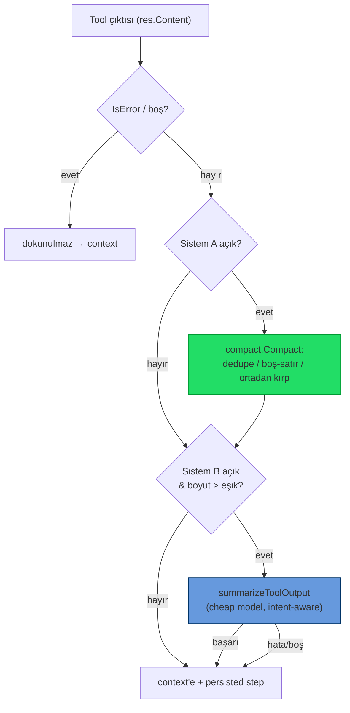

# 17 — Araç Çıktısı Token Optimizasyonu

> Ajan araç çıktılarının (shell, dosya, MCP) LLM context'ine girmeden önce küçültülmesi.
> **İki bağımsız sistem**, paralel veya tek başına çalışabilir; her biri Ayarlar'dan ayrı konfigüre edilir.

## Neden?

SwarmGo'nun native agentic döngüsünde (`agent/toolloop.go`) her araç çağrısının çıktısı bir
`ToolResult` olarak konuşmaya eklenir ve sonraki model çağrısında **girdi token'ı** olarak ücretlenir.
`Bash` gibi araçlar 64 KB'ye kadar ham çıktı döndürebilir. `git status`, test runner, `ls -R`, `grep`
gibi komutlar context'i hızla şişirir. Bu katman, çıktı transcript'e *girmeden önce* onu kırpar — mevcut
`internal/conversation` compaction'ı (transcript bütçesi) ve prompt-cache'i tamamlar.

## İki Sistem

| | **Sistem A — Deterministik** | **Sistem B — LLM Özeti** |
|---|---|---|
| Paket | `internal/tools/compact` | `internal/agent/compactor.go` |
| İlham | `rtk-ai/rtk` (Rust Token Killer) | `external-agent-oss` (Large Response Handling) |
| Yöntem | Kural tabanlı: dedupe + boş-satır sadeleştirme + ortadan kırpma | Ucuz modelle niyet-farkında özet |
| Maliyet | Sıfır (yerel) | Ekstra model çağrısı (`KindCompact`) |
| Tetik | Her başarılı araç çıktısı | Yalnız (A sonrası) eşik üstü çıktı |
| Varsayılan | **Açık** | **Kapalı** (opt-in, maliyetli) |

İkisi de açıksa **ardışık**: önce ücretsiz A, kalan hâlâ eşik üstündeyse B. Biri açıksa yalnız o çalışır.
İkisi de kapalıysa eski davranış (sadece tool'un kendi 64 KB hard-cap'i) korunur.

## Sistem A — `internal/tools/compact`

`Compact(output string, opts Options) (string, Stats)` — dep-siz, hata döndürmez (en kötü ihtimalle
orijinali verir).

- **Dedupe:** Ardışık aynı satırlar `satır  (×N)` olarak birleşir (trailing whitespace yok sayılır).
- **Boş satır blokları:** 2+ ardışık boş satır → tek boş satır.
- **Satır eleme:** `MaxLines` aşılırsa baş + son yarı korunur, ortaya `… N satır atlandı …` işareti.
- **Bayt kırpma:** `MaxBytes` aşılırsa baş (2/3) + son (1/3) korunarak ortaya `… [çıktı N bayt kırpıldı] …`;
  kesim **rune sınırında** yapılır (UTF-8 bozulmaz — Türkçe karakterler güvenli).
- `Stats{BeforeBytes, AfterBytes, Applied}` + `Saved()` — log ve tasarruf ölçümü.
- **Kalıcı tasarruf sayacı:** `Stats.Saved()` (Sistem A'nın kazandırdığı bayt) `compactToolResult` içinde
  `db.AddCompactionSavings(agentID, bytes)` ile günlük usage rollup'una yazılır →
  `Usage.CompactSavedBytes` (ajan+gün başına, `compactSavedBytes` JSON). LLM çağrısı/token sayaçlarından
  **bağımsız** bir ölçer (maliyet etkisi yok). **Bütçe ekranında gösteriliyor (2026-06-24):** bkz.
  [§Bütçe görünürlüğü](#bütçe-görünürlüğü--tasarruf-merkezi--session-bazlı-2026-06-24).

## Sistem B — `agent/compactor.go`

- `compactToolResult(ctx, agent, toolName, input, res)` — A'yı uygular, sonra B eşiğini kontrol eder.
  `IsError` veya boş sonuçlar **hiç dokunulmadan** geçer.
- `summarizeToolOutput(...)` — `guardedComplete` + `WithCallKind(ctx, KindCompact)`.
  **Model çözüm zinciri:** adanmış sıkıştırma modeli (`CompactModel`) → yoksa başlık modeli (`TitleModel`)
  → yoksa ajanın kendi modeli. **Sağlayıcı her zaman ajanın sağlayıcısıdır** (`guardedComplete`
  `r.providers.Get(agent.Provider)` ile çözer — ayrı seçilemez). `CompactModel` yalnızca bir model-id'dir;
  o yüzden ajanın sağlayıcısıyla uyumlu, ucuz bir model (ör. `claude-haiku-4-5`) verilmelidir.
  **Niyet** = tool adı + (varsa) input özeti (`intentInputRunes=300`).
  Sistem prompt: olguları (yol/kimlik/hata/sayı/sonuç) koru, uydurma yapma, sadece sonucu döndür.
- Bütçeyi **gate'lemez** (autonomous=false) — titler/summary/reflect ile aynı politika; usage yine işlenir.
- **Tasarruf sayacı (2026-06-24):** özet başarılıysa `len(içerik)-len(özet)` bayt `db.AddLLMCompactionSavings`
  ile günlük rollup'a (`Usage.CompactSavedBytesLLM`, `compactSavedBytesLLM` JSON) yazılır — Sistem A ölçerinden
  **ayrı** (özet çağrısının kendi token maliyeti `UsageKindCompact` altında zaten kayıtlı; bu, brüt çıktı azaltımı).
- Yalnız **native döngüde** (Anthropic/MiniMax) etkilidir; claude-cli delegasyonu kendi döngüsünü sürdürür
  (çıktıları SwarmGo'nun `ToolResult` katmanından geçmez).

## Ayarlar

`settings.Settings` / `DTO` / `Patch` (clamp'ler `store.go::validate`'de):

| Alan | Sistem | Vars. | Clamp |
|------|--------|-------|-------|
| `compactToolOutput` | A aç/kapa | `true` | — |
| `compactMaxLines` | A satır sınırı | `200` | 0 (=default) – 5000 |
| `compactMaxBytes` | A bayt sınırı | `16384` | 0 (=default) – 262144 |
| `compactLlmSummary` | B aç/kapa | `true` | — |
| `compactLlmThreshold` | B eşik (bayt) | `12288` | 0 (=default) – 262144 |
| `compactModel` | B model-id | `""` | trim'lenir; boş = TitleModel → ajan modeli |

Canlı push: `api/server.go::applySettings` → `Tunables.SetToolCompaction(...)`. 0 değerleri Tunables
getter'larında built-in default'a (`DefaultCompact*`) çevrilir. UI: **Ayarlar → Bağlam** içinde iki
ayrı bölüm (`frontend/.../settings/appPanels.tsx` `ContextPanel`).

> **Varsayılan politika değişikliği (2026-06-22):** Sistem B artık **varsayılan AÇIK**, the external agent project
> tarzı (~12KB eşik). Kritik bağımlılık: **A'nın bayt cap'i (16KB) B eşiğinin (12KB) ÜSTÜNDE** olmalı —
> aksi halde A çıktıyı B eşiğinin altına kırpıp B'yi hiç tetiklenmez bırakır. Yeni varsayılanlar bu
> sırayı korur: 12–16KB bandı A'dan geçip B'ye ulaşır, >16KB ise A 16KB'ye kırpar sonra B özetler.
> B bir ucuz model çağrısı maliyetlidir → `compactModel`'i ucuz bir modele (ör. `claude-haiku`) pinle.

## Harici araç tespiti (presence-only)

Ayarlar → **Tanılama** ekranındaki "Kurulu mu kontrol et" butonu, bu cihazda isteğe bağlı harici
token araçlarının (`rtk`, `sqz`, `context-mode`) **kurulu olup olmadığını** gösterir.

- Backend: `GET /api/external-tools` (`api/external_tools.go`) → `exec.LookPath` ile PATH'te arar.
  **Araçları kurmaz, çalıştırmaz, değiştirmez** (Windows'ta PATHEXT'e saygılı). Dönüş: `[{name,desc,url,found,path}]`.
- Frontend: `systemApi.externalTools()` + `DiagnosticsPanel` butonu; her araç için ✓ kurulu / — bulunamadı + repo linki.
- Bu yalnızca **bilgilendirme**dir; SwarmGo bu araçları otomatik kullanmaz (Sistem A/B native'dir). Kullanıcı
  isterse manuel entegrasyon için varlığı görür.

## Sınırlar / Notlar

- Sıkıştırma hem modele giden `ToolResult`'a **hem de** UI'da gösterilen/persist edilen `TurnStep.Output`'a
  uygulanır → kullanıcı, modelin gördüğü çıktıyı görür (tutarlılık).
- Komut-özel akıllı kısaltıcılar (git/test/grep'e özgü) henüz yok; A jeneriktir. → bkz. [Yapılacak](#yapılacak--craftagenttan-aktarılacak-fikirler).
- claude-cli delegasyon yolu kapsam dışıdır (yukarıdaki sebep).

## the external agent project'tan Aktarılan Fikirler

> Kaynak: `external-agent-oss` ([repo](https://github.com/external-agent-project/external-agent-oss)) bağlam-yönetimi
> incelemesi (2026-06-22). the external agent project çoğu bağlam işini Claude Agent SDK'ye devreder; SwarmGo'nun açık
> motoru genel olarak daha kontrollü. Aşağıda **sırada bekleyen** dokunuşlar (TODO) + **tamamlananların**
> tek-satır özeti (tam tarihçe → [05-ILERLEME.md](05-ILERLEME.md)).

### Sırada (TODO)

#### 1. Komut-aile-bazlı deterministik bash sıkıştırıcı (RTK tarzı) 🔶

the external agent project yerel **RTK (Rewrite Toolkit)** binary'siyle `git diff`, `ls -R`, `bun test`, `npm install`,
`grep` gibi gürültülü bash çıktılarını **model'e gitmeden önce** komut-ailesine özel kurallarla yeniden yazar
(tasarruf istatistiği de tutar). SwarmGo'da Sistem A jeneriktir (dedupe + boş-satır + ortadan kırpma);
komut-özel akıllı kısaltıcı yok.

- **Yapılacak:** `internal/tools/compact` içine komut-aile tanıyıcı bir katman (ör. `compact/rules_*.go`):
  `git diff`/`git status` → dosya başına özet, `ls -R`/`tree` → derinlik kırpma, test runner → yalnız
  fail+özet satırları, `grep` → eşleşme yoğunluğu kırpma.
- Tetik: `Bash` tool input'undaki komut adına göre kural seçimi; kural yoksa mevcut jenerik A'ya düş.
- Sistem A ile aynı sözleşme: dep-siz, hata döndürmez, `Stats.Saved()` rollup'a yazılır.

#### 2. `_intent` — açık niyet enjeksiyonu 🔶

the external agent project her MCP tool çağrısında şemaya bir **`_intent`** alanı enjekte eder; bu, büyük-sonuç
özetlemesinin **neye odaklanacağını** açıkça söyler. SwarmGo'da Sistem B niyeti *çıkarımla* buluyor
(tool adı + ilk `intentInputRunes=300` input). Açık niyet daha iyi sinyal verir.

- **Yapılacak:** native tool-use döngüsünde (`agent/toolloop.go`) modelin tool çağrısına opsiyonel bir
  `_intent` (kısa amaç cümlesi) taşımasını sağla; `summarizeToolOutput` bunu çıkarım yerine doğrudan
  niyet olarak kullansın. MCP araçlarında şema NormalizeSchema sırasında `_intent` alanı eklenebilir.
- Düşük maliyet / yüksek fayda: Sistem B özet kalitesini, ekstra model çağrısı olmadan artırır.

### Tamamlanan iyileştirmeler (özet)

> Tam tarihçe (test adları, canlı-test bulguları, ara-revizeler) → [05-ILERLEME.md](05-ILERLEME.md).

- **✅ B özet eşiğini the external agent project ile hizala** (2026-06-22) — Sistem B varsayılan AÇIK, eşik 12288 bayt; A bayt-cap 16384'e çıkarıldı (A→B sırası korunur).
- **✅ Density-aware token tahmini** (CG-9/1, 2026-06-22) — `estimateText` yoğun içerikte ~1.5 chars/token, düz metinde ~4; `tokens_test.go`.
- **✅ Bütçe-orantılı tool eşikleri** (CG-9/2, 2026-06-22) — A-cap + B-eşik `budget/12000` (clamp [1×,5×]) ile ölçeklenir, A>B değişmezi korunur.
- **✅ Per-model context-window metadata** (2026-06-22) — `ModelInfo.ContextWindow` + `ContextWindowFor(provider,model)` aile-tablosu; UI + bütçe-tavanı guard için.
- **✅ Modele göre akıllı varsayılan bütçe** (2026-06-22) — `EffectiveBudget` model penceresine göre ölçekler; fraction/ceil canlı yapılandırılabilir. **Güncel değerler → [§12](#12--context-rot-farkındalığı-ve-bütçe-stratejisi-2026-06-25)** (256K + adaptif).
- **✅ Yapılandırılmış konuşma-özeti** (Claude Code parite, 2026-06-23) — `compactPrompt` 8-bölümlü yapı + anti-decay; `compactMaxOutputTokens=8192`; kapanış-cue'su claude-cli framing'ini bastırır.
- **✅ Post-compact kurtarma işaretçisi** (2026-06-23) — özet bloğu `conversationSummaryBlock` ile sarılır ("tahmin etme; `conversation_search` veya fs ile yeniden oku").
- **✅ `conversation_search` güçlendirme** (2026-06-24) — `full=true` (birebir tam metin) + `context=N` (çevre turlar) + `session_id`; bkz. [27-CROSS-SESSION-SEARCH.md](27-CROSS-SESSION-SEARCH.md).
- **✅ claude-cli oturum sürekliliği `--resume`** (2026-06-24, opt-in) — `ClaudeResume` ile sıcak prompt-cache; warm modda compaction CLI'a geçer (deneysel). Akış: `api/chat_resume.go`.

## Bütçe görünürlüğü — Tasarruf Merkezi + session bazlı (2026-06-24)

Önceden tüm tasarruf mekanizmaları (cache, Sistem A/B) toplanıyordu ama dağınık/gizliydi; kullanım yalnız
**ajan+gün** anahtarlıydı (oturum-başına atfedilemiyordu). Üç fazlık geliştirme:

### Faz 1 — Sıkıştırma tasarrufunu görünür kıl
- DB: `Usage.CompactSavedBytesLLM` alanı + `AddLLMCompactionSavings` (Sistem B brüt çıktı azaltımı). Sistem A'nın
  `CompactSavedBytes`'ı zaten vardı.
- API: `GET /api/usage` totals + cumulative + trend artık `compactSavedBytes`/`compactSavedBytesLLM` taşır;
  `GET /api/agents/{id}/usage` de ekledi.
- UI: Bütçe ekranında **Tasarruf Merkezi** bölümü (3 hücre: Prompt-cache USD · Sistem A bayt · Sistem B bayt +
  token-eşdeğeri tahmini). Bayt ölçerdir, gerçek faturalandırma değil.

### Faz 2 — Session bazlı kullanım/maliyet
- DB: yeni `SessionUsage` rollup (`internal/db/store_session_usage.go`) — **sessionID anahtarlı, ömür-boyu**
  (gün-reset YOK); ByKind/ByModel + cache + her iki compaction ölçeri. Dosya `store/session-usage/<sid>.json`.
  Metotlar: `AddSessionUsageKind` · `AddSessionCompactionSavings` · `AddSessionLLMCompactionSavings` ·
  `GetSessionUsage`. Boş sessionID = no-op.
- Wiring: `RecordUsage` + `compactToolResult` ctx'teki `SessionIDFrom`'u okuyup ajan kaydının **yanında** session
  rollup'a da yazar (chat/schedule/spawn/flow yolları zaten `WithSessionID` damgalı; chat_stream.go:256).
- API: `GET /api/sessions/{id}/usage-detail` (cost helper'ları `modelRowsFor` ile paylaşılır → workspace ekranıyla
  birebir tutarlı). UI: `SessionDetailPanel`'de **"Bu oturumun harcaması"** kartı (maliyet + kazanç/tasarruf
  kırılımı) — eskiden yalnız "ajanın bugünkü toplamı" gösteriliyordu.

### Faz 3 — Tasarruf Merkezi (birleşik kazanç görünümü)
- Tüm tasarruf kaynakları tek panelde: cache (gerçek USD) + Sistem A (ücretsiz bayt) + Sistem B (LLM bayt) +
  toplam context tasarrufu (bayt → ~token tahmini, `bytes/4`). Bütçe ekranı kümülatif penceresinden beslenir.
- **Trend metrik seçici (2026-06-25):** günlük trend grafiği artık 4 seri arasında geçiş yapar —
  **Token · Maliyet · Cache tasarrufu · Sıkıştırma** (`TREND_METRICS`, `BudgetPanel`). Backend her `dayPoint`'e
  `compactSavedBytes`/`compactSavedBytesLLM` ekledi → trend bunları gün-bazında çizebiliyor; bar rengi+formatlayıcı
  metriğe göre değişir, altta pencere-toplamı gösterilir.

**Notlar / sınırlar:**
- Hook'lar (`PreToolUse`/`PostToolUse`) hâlâ tasarruf **ölçmez** (Claude Code sözleşmesi; gerçek token-tasarruf
  mekanizması Sistem A/B'dir). `context-mode`/`rtk`/`sqz` harici araçları yalnız **presence-only** tespit edilir,
  SwarmGo çıktıları onlardan geçirmez → ölçülen kazanç yok; yerel eşdeğer = Sistem A.
- Bayt→token→USD: Sistem A/B için yalnız bayt + ~token gösterilir, **USD'ye çevrilmez** (uydurma sayı olmaması
  için). Gerçek USD yalnız prompt-cache'te.
- Geriye-uyumlu: eski usage dosyaları yeni alanları taşımaz (omitempty → 0); session rollup yeni turlardan dolar.
- Testler: `store_session_usage_test.go` (session attribution + reload), `store_usage_test.go` (`AddLLMCompactionSavings`).

## Context reset (handoff) — in-place compaction'ın tamamlayıcısı

Bu doküman **in-place** compaction'ı anlatır (aynı oturum, rolling-summary). Anthropic'in
"harness design" bulgusu: uzun otonom görevlerde in-place compaction tek başına **"context
anxiety"**yi (model limite yaklaşınca erken toparlama) çözmez. Tamamlayıcı = **context reset**:
özetlemek yerine bir **handoff artifact** yaz + **temiz bir pencerede** (yeni oturum) devam et.

- **Ne zaman compact?** İnteraktif sohbet, çok-turlu gidip-gelme, kullanıcı sürücü. (Bu doküman.)
- **Ne zaman reset?** Uzun otonom iş, net kilometre taşları, "temiz sayfa" gerektiğinde — manuel
  `/handoff`, `handoff_session` aracı veya basınç eşiğinde otomatik. Detay: **[35-CONTEXT-RESET-HANDOFF.md](35-CONTEXT-RESET-HANDOFF.md)**.

Reset, compaction çekirdeğini (`summarizeRendered`/`compactMaxOutputTokens`) yeniden kullanır;
yalnız devam-odaklı bir prompt (`conversation.handoffPrompt`, 10 bölüm + DONE/TODO + Next Step) ve
bir env snapshot ekler.

## 12 — Context-rot farkındalığı ve bütçe stratejisi (2026-06-25)

**Bağlam.** Anthropic *Effective context engineering for AI agents* makalesi bir gerçeği netleştirir:
token sayısı arttıkça modelin o bağlamdan **doğru geri-çağırma** yeteneği düşer ("context rot").
Sebep transformer mimarisi — *"every token attends to every other token… n² pairwise relationships
for n tokens"*: `n` token → `n²` ikili dikkat ilişkisi; sabit "attention budget" daha çok ilişkiye
yayılır. Bu bir **uçurum değil, performans gradyanıdır** (*"a performance gradient rather than a hard
cliff: models remain highly capable at longer contexts but may show reduced precision for information
retrieval and long-range reasoning"*) — model uzun bağlamda hâlâ yetkin ama **hassasiyet kaybeder**.
İlke: *"the smallest possible set of high-signal tokens"* — bağlam değerli, sonlu bir kaynaktır.
Ham pencereye alternatifler: compaction · structured note-taking · just-in-time retrieval · sub-agent
izolasyonu.

**SwarmGo'nun önceki bahsi (§7, 2026-06-23).** `EffectiveBudget` `fraction=0.6 / ceil=512K`'ye
çıkarılmıştı ("1M pencerede her şeyi ham tut" → Claude Code/External Agent davranışına yaklaşmak). Bu,
**bilinçli olarak rot ile takastı**: ham pencere büyüdükçe `n²` yüzeyi ve recall hassasiyeti kaybı
büyür. Ayrıca Claude Code o davranışı **prompt-cache + fork**'la ucuzlatır; SwarmGo'nun birincil yolu
(`claude-cli`, anahtarsız) bu paylaşımı CC gibi kontrol edemez → büyük ham pencerenin getiri/maliyet
oranı SwarmGo'da daha zayıf.

**Kritik içgörü — dayanıklılık ≠ ham pencere boyutu.** Bir detayın kaybolmaması için 512K ham
transkript *gerekmez*. SwarmGo'nun dayanıklılığı zaten **retrieval katmanında**: `memory_add` + lexical
recall (uzun-dönem) · `core_memory_replace/append` (her tur enjekte working memory) · `conversation_search`
(`full=true`/`context=N` ile **birebir** kurtarma, §10) · post-compact kurtarma notu ("tahmin etme;
ara ya da yeniden oku", §9) · `memoryPressureWarn` ("şimdi yaz" uyarısı). Katlanan detay **birebir geri
alınabilir** → ham pencereyi küçültmek recall **kaybettirmez**, sadece dayanıklılığı "büyük pencere"den
"ucuz retrieval"a kaydırır ve `n²` rot yükünü azaltır.

**Benimsenen strateji — retrieval-destekli adaptif pencere.** Üç seçenek tartıldı: (A) sabit 512K
"her şeyi ham tut" — yüksek rot; (C) note-taking ağırlıklı agresif kısma (0.25/128K) — sık katlama,
"neden bu kadar erken özetledi" hissi; (B) **orta, retrieval-destekli pencere** — seçilen. Gradyan
uçurum değil → ne aşırı büyük (rot) ne aşırı küçük (gereksiz sık katlama) optimaldir.

| Knob | Eski | Yeni | Gerekçe |
|---|---|---|---|
| `ContextBudgetCeil` | 512K | **256K** (`262144`) | `n²` yükü ~¼; gradyanın yüksek-hassasiyet bölgesi |
| `ContextBudgetFraction` | 0.6 (sabit) | **0 = otomatik** → adaptif 0.35–0.45 | aile-bazlı rot toleransı |
| `memoryPressureWarn` | 0.75 | **0.70** | "şimdi yaz" penceresini katlamadan önce öne al |

**Adaptif fraction (`providers.AdaptiveBudgetFraction`).** `ContextWindowFor`'un aile sınıflamasını
yeniden kullanır → yeni model ailesi eklenince tek yerde güncellenir. Uzun-bağlam-güvenilir aileler
daha yüksek pay alır, küçük/bilinmeyen modeller muhafazakâr kalır:

| Aile | Pencere | Fraction | Etkin (ceil 256K) |
|---|---|---|---|
| Opus 4.8 / Sonnet 4.6 | 1M | 0.45 | 450K → **256K** (tavan) |
| Haiku 4.5 | 200K | 0.40 | **80K** |
| MiniMax / DeepSeek / Gemini | 1M | 0.35 | 350K → **256K** (tavan) |
| Fable / genel Claude | 200K | 0.40 | **80K** |
| Bilinmeyen | 0 | — | taban (`MaxContextTokens`) |

**Semantik & geriye-uyumluluk.** `ContextBudgetFraction = 0` artık **"otomatik/adaptif"** anlamına gelir
(negatif → 0'a clamp'lenir; pozitif → manuel sabit pay). `MaxContextTokens` (configured) **taban** olarak
korunur → kimse mevcut tabanının altına düşmez. `EffectiveBudget(provider, model, configured, fraction,
ceil)`: `fraction<=0` ise `AdaptiveBudgetFraction`, o da 0 ise paket fallback (0.4). `SetBudgetShape`
artık fraction 0'ı (auto) saklar (eskiden yok sayardı). Eski `settings.json`'larda kalan açık `0.6` değeri
**manuel sabit** olarak yaşamaya devam eder (kullanıcı sıfırlayana dek); yeni kurulumlar adaptif başlar —
her iki durumda da **ceil 256K** rot getirisini sağlar. Büyük ham pencere isteyen kullanıcı Ayarlar'dan
`ContextBudgetCeil`/`ContextBudgetFraction`'ı yükseltebilir; varsayılan artık **rot-bilinçli**.

**Sınırlar.** Bu bir *varsayılan politika* ayarıdır, sert sınır değil. claude-cli `--resume` warm modunda
bağlam yönetimi CLI'a geçer → bu bütçe o oturumda baypas edilir (bilinen gerilim, §11). Testler:
`budget_test.go` (`TestEffectiveBudgetAdaptive`), `context_window_test.go` (`TestAdaptiveBudgetFraction`).

## Ayrıca Bakınız

- **[35-CONTEXT-RESET-HANDOFF.md](35-CONTEXT-RESET-HANDOFF.md)** — Context reset + handoff artifact
  (bu in-place compaction'ın tamamlayıcısı: özet yerine temiz pencerede devam).
- **[19-LAZY-TOOL-LOADING.md](19-LAZY-TOOL-LOADING.md)** — Araç şemalarının talep üzerine yüklenmesi
  (sistem promptundan araç token yükü azaltmanın tamamlayıcı yolu): self-management + MCP araçları
  katalog özetiyle yayımlanır, `activate_tools` çağrılınca tam şema gelir.
