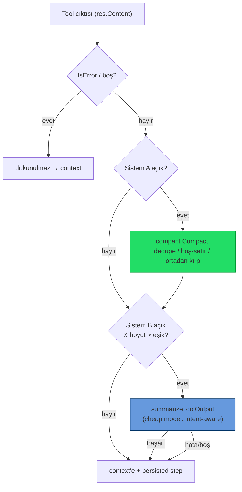

# 17 — Araç Çıktısı Token Optimizasyonu

> Ajan araç çıktılarının (shell, dosya, MCP) LLM context'ine girmeden önce küçültülmesi.
> **İki bağımsız sistem**, paralel veya tek başına çalışabilir; her biri Ayarlar'dan ayrı konfigüre edilir.

## Neden?

SwarmGo'nun native agentic döngüsünde (`agent/toolloop.go`) her araç çağrısının çıktısı bir
`ToolResult` olarak konuşmaya eklenir ve sonraki model çağrısında **girdi token'ı** olarak ücretlenir.
`shell` gibi araçlar 64 KB'ye kadar ham çıktı döndürebilir. `git status`, test runner, `ls -R`, `grep`
gibi komutlar context'i hızla şişirir. Bu katman, çıktı transcript'e *girmeden önce* onu kırpar — mevcut
`internal/conversation` compaction'ı (transcript bütçesi) ve prompt-cache'i tamamlar.

## İki Sistem

| | **Sistem A — Deterministik** | **Sistem B — LLM Özeti** |
|---|---|---|
| Paket | `internal/tools/compact` | `internal/agent/compactor.go` |
| İlham | `rtk-ai/rtk` (Rust Token Killer) | `external-agent-oss` (Large Response Handling) |
| Yöntem | Kural tabanlı: dedupe + boş-satır sadeleştirme + ortadan kırpma | Ucuz modelle niyet-farkında özet |
| Maliyet | Sıfır (yerel) | Ekstra model çağrısı (`KindCompact`) |
| Tetik | Her başarılı araç çıktısı | Yalnız (A sonrası) eşik üstü çıktı |
| Varsayılan | **Açık** | **Kapalı** (opt-in, maliyetli) |

İkisi de açıksa **ardışık**: önce ücretsiz A, kalan hâlâ eşik üstündeyse B. Biri açıksa yalnız o çalışır.
İkisi de kapalıysa eski davranış (sadece tool'un kendi 64 KB hard-cap'i) korunur.

## Sistem A — `internal/tools/compact`

`Compact(output string, opts Options) (string, Stats)` — dep-siz, hata döndürmez (en kötü ihtimalle
orijinali verir).

- **Dedupe:** Ardışık aynı satırlar `satır  (×N)` olarak birleşir (trailing whitespace yok sayılır).
- **Boş satır blokları:** 2+ ardışık boş satır → tek boş satır.
- **Satır eleme:** `MaxLines` aşılırsa baş + son yarı korunur, ortaya `… N satır atlandı …` işareti.
- **Bayt kırpma:** `MaxBytes` aşılırsa baş (2/3) + son (1/3) korunarak ortaya `… [çıktı N bayt kırpıldı] …`;
  kesim **rune sınırında** yapılır (UTF-8 bozulmaz — Türkçe karakterler güvenli).
- `Stats{BeforeBytes, AfterBytes, Applied}` + `Saved()` — log ve tasarruf ölçümü.
- **Kalıcı tasarruf sayacı:** `Stats.Saved()` (Sistem A'nın kazandırdığı bayt) `compactToolResult` içinde
  `db.AddCompactionSavings(agentID, bytes)` ile günlük usage rollup'una yazılır →
  `Usage.CompactSavedBytes` (ajan+gün başına, `compactSavedBytes` JSON). LLM çağrısı/token sayaçlarından
  **bağımsız** bir ölçer (maliyet etkisi yok). Henüz UI'da gösterilmiyor (Bütçe ekranı bağlama işi sonraya bırakıldı).

## Sistem B — `agent/compactor.go`

- `compactToolResult(ctx, agent, toolName, input, res)` — A'yı uygular, sonra B eşiğini kontrol eder.
  `IsError` veya boş sonuçlar **hiç dokunulmadan** geçer.
- `summarizeToolOutput(...)` — `guardedComplete` + `WithCallKind(ctx, KindCompact)`.
  **Model çözüm zinciri:** adanmış sıkıştırma modeli (`CompactModel`) → yoksa başlık modeli (`TitleModel`)
  → yoksa ajanın kendi modeli. **Sağlayıcı her zaman ajanın sağlayıcısıdır** (`guardedComplete`
  `r.providers.Get(agent.Provider)` ile çözer — ayrı seçilemez). `CompactModel` yalnızca bir model-id'dir;
  o yüzden ajanın sağlayıcısıyla uyumlu, ucuz bir model (ör. `claude-haiku-4-5`) verilmelidir.
  **Niyet** = tool adı + (varsa) input özeti (`intentInputRunes=300`).
  Sistem prompt: olguları (yol/kimlik/hata/sayı/sonuç) koru, uydurma yapma, sadece sonucu döndür.
- Bütçeyi **gate'lemez** (autonomous=false) — titler/summary/reflect ile aynı politika; usage yine işlenir.
- Yalnız **native döngüde** (Anthropic/MiniMax) etkilidir; claude-cli delegasyonu kendi döngüsünü sürdürür
  (çıktıları SwarmGo'nun `ToolResult` katmanından geçmez).

## Ayarlar

`settings.Settings` / `DTO` / `Patch` (clamp'ler `store.go::validate`'de):

| Alan | Sistem | Vars. | Clamp |
|------|--------|-------|-------|
| `compactToolOutput` | A aç/kapa | `true` | — |
| `compactMaxLines` | A satır sınırı | `200` | 0 (=default) – 5000 |
| `compactMaxBytes` | A bayt sınırı | `12288` | 0 (=default) – 262144 |
| `compactLlmSummary` | B aç/kapa | `false` | — |
| `compactLlmThreshold` | B eşik (bayt) | `8192` | 0 (=default) – 262144 |
| `compactModel` | B model-id | `""` | trim'lenir; boş = TitleModel → ajan modeli |

Canlı push: `api/server.go::applySettings` → `Tunables.SetToolCompaction(...)`. 0 değerleri Tunables
getter'larında built-in default'a (`DefaultCompact*`) çevrilir. UI: **Ayarlar → Bağlam** içinde iki
ayrı bölüm (`frontend/.../settings/appPanels.tsx` `ContextPanel`).

## Harici araç tespiti (presence-only)

Ayarlar → **Tanılama** ekranındaki "Kurulu mu kontrol et" butonu, bu cihazda isteğe bağlı harici
token araçlarının (`rtk`, `sqz`) **kurulu olup olmadığını** gösterir.

- Backend: `GET /api/external-tools` (`api/external_tools.go`) → `exec.LookPath` ile PATH'te arar.
  **Araçları kurmaz, çalıştırmaz, değiştirmez** (Windows'ta PATHEXT'e saygılı). Dönüş: `[{name,desc,url,found,path}]`.
- Frontend: `systemApi.externalTools()` + `DiagnosticsPanel` butonu; her araç için ✓ kurulu / — bulunamadı + repo linki.
- Bu yalnızca **bilgilendirme**dir; SwarmGo bu araçları otomatik kullanmaz (Sistem A/B native'dir). Kullanıcı
  isterse manuel entegrasyon için varlığı görür.

## Sınırlar / Notlar

- Sıkıştırma hem modele giden `ToolResult`'a **hem de** UI'da gösterilen/persist edilen `TurnStep.Output`'a
  uygulanır → kullanıcı, modelin gördüğü çıktıyı görür (tutarlılık).
- Komut-özel akıllı kısaltıcılar (git/test/grep'e özgü) henüz yok; A jeneriktir. Gelecek iş.
- claude-cli delegasyon yolu kapsam dışıdır (yukarıdaki sebep).
