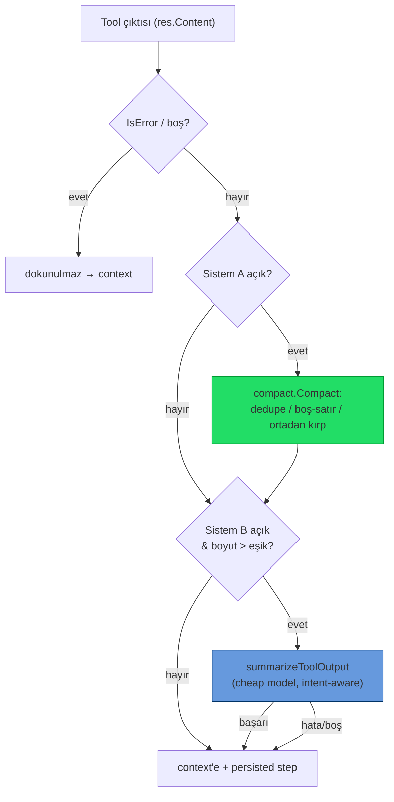

# 17 — Araç Çıktısı Token Optimizasyonu

> Ajan araç çıktılarının (shell, dosya, MCP) LLM context'ine girmeden önce küçültülmesi.
> **İki bağımsız sistem**, paralel veya tek başına çalışabilir; her biri Ayarlar'dan ayrı konfigüre edilir.

## Neden?

SwarmGo'nun native agentic döngüsünde (`agent/toolloop.go`) her araç çağrısının çıktısı bir
`ToolResult` olarak konuşmaya eklenir ve sonraki model çağrısında **girdi token'ı** olarak ücretlenir.
`Bash` gibi araçlar 64 KB'ye kadar ham çıktı döndürebilir. `git status`, test runner, `ls -R`, `grep`
gibi komutlar context'i hızla şişirir. Bu katman, çıktı transcript'e *girmeden önce* onu kırpar — mevcut
`internal/conversation` compaction'ı (transcript bütçesi) ve prompt-cache'i tamamlar.

## İki Sistem

| | **Sistem A — Deterministik** | **Sistem B — LLM Özeti** |
|---|---|---|
| Paket | `internal/tools/compact` | `internal/agent/compactor.go` |
| İlham | `rtk-ai/rtk` (Rust Token Killer) | `external-agent-oss` (Large Response Handling) |
| Yöntem | Kural tabanlı: dedupe + boş-satır sadeleştirme + ortadan kırpma | Ucuz modelle niyet-farkında özet |
| Maliyet | Sıfır (yerel) | Ekstra model çağrısı (`KindCompact`) |
| Tetik | Her başarılı araç çıktısı | Yalnız (A sonrası) eşik üstü çıktı |
| Varsayılan | **Açık** | **Kapalı** (opt-in, maliyetli) |

İkisi de açıksa **ardışık**: önce ücretsiz A, kalan hâlâ eşik üstündeyse B. Biri açıksa yalnız o çalışır.
İkisi de kapalıysa eski davranış (sadece tool'un kendi 64 KB hard-cap'i) korunur.

## Sistem A — `internal/tools/compact`

`Compact(output string, opts Options) (string, Stats)` — dep-siz, hata döndürmez (en kötü ihtimalle
orijinali verir).

- **Dedupe:** Ardışık aynı satırlar `satır  (×N)` olarak birleşir (trailing whitespace yok sayılır).
- **Boş satır blokları:** 2+ ardışık boş satır → tek boş satır.
- **Satır eleme:** `MaxLines` aşılırsa baş + son yarı korunur, ortaya `… N satır atlandı …` işareti.
- **Bayt kırpma:** `MaxBytes` aşılırsa baş (2/3) + son (1/3) korunarak ortaya `… [çıktı N bayt kırpıldı] …`;
  kesim **rune sınırında** yapılır (UTF-8 bozulmaz — Türkçe karakterler güvenli).
- `Stats{BeforeBytes, AfterBytes, Applied}` + `Saved()` — log ve tasarruf ölçümü.
- **Kalıcı tasarruf sayacı:** `Stats.Saved()` (Sistem A'nın kazandırdığı bayt) `compactToolResult` içinde
  `db.AddCompactionSavings(agentID, bytes)` ile günlük usage rollup'una yazılır →
  `Usage.CompactSavedBytes` (ajan+gün başına, `compactSavedBytes` JSON). LLM çağrısı/token sayaçlarından
  **bağımsız** bir ölçer (maliyet etkisi yok). Henüz UI'da gösterilmiyor (Bütçe ekranı bağlama işi sonraya bırakıldı).

## Sistem B — `agent/compactor.go`

- `compactToolResult(ctx, agent, toolName, input, res)` — A'yı uygular, sonra B eşiğini kontrol eder.
  `IsError` veya boş sonuçlar **hiç dokunulmadan** geçer.
- `summarizeToolOutput(...)` — `guardedComplete` + `WithCallKind(ctx, KindCompact)`.
  **Model çözüm zinciri:** adanmış sıkıştırma modeli (`CompactModel`) → yoksa başlık modeli (`TitleModel`)
  → yoksa ajanın kendi modeli. **Sağlayıcı her zaman ajanın sağlayıcısıdır** (`guardedComplete`
  `r.providers.Get(agent.Provider)` ile çözer — ayrı seçilemez). `CompactModel` yalnızca bir model-id'dir;
  o yüzden ajanın sağlayıcısıyla uyumlu, ucuz bir model (ör. `claude-haiku-4-5`) verilmelidir.
  **Niyet** = tool adı + (varsa) input özeti (`intentInputRunes=300`).
  Sistem prompt: olguları (yol/kimlik/hata/sayı/sonuç) koru, uydurma yapma, sadece sonucu döndür.
- Bütçeyi **gate'lemez** (autonomous=false) — titler/summary/reflect ile aynı politika; usage yine işlenir.
- Yalnız **native döngüde** (Anthropic/MiniMax) etkilidir; claude-cli delegasyonu kendi döngüsünü sürdürür
  (çıktıları SwarmGo'nun `ToolResult` katmanından geçmez).

## Ayarlar

`settings.Settings` / `DTO` / `Patch` (clamp'ler `store.go::validate`'de):

| Alan | Sistem | Vars. | Clamp |
|------|--------|-------|-------|
| `compactToolOutput` | A aç/kapa | `true` | — |
| `compactMaxLines` | A satır sınırı | `200` | 0 (=default) – 5000 |
| `compactMaxBytes` | A bayt sınırı | `16384` | 0 (=default) – 262144 |
| `compactLlmSummary` | B aç/kapa | `true` | — |
| `compactLlmThreshold` | B eşik (bayt) | `12288` | 0 (=default) – 262144 |
| `compactModel` | B model-id | `""` | trim'lenir; boş = TitleModel → ajan modeli |

Canlı push: `api/server.go::applySettings` → `Tunables.SetToolCompaction(...)`. 0 değerleri Tunables
getter'larında built-in default'a (`DefaultCompact*`) çevrilir. UI: **Ayarlar → Bağlam** içinde iki
ayrı bölüm (`frontend/.../settings/appPanels.tsx` `ContextPanel`).

> **Varsayılan politika değişikliği (2026-06-22):** Sistem B artık **varsayılan AÇIK**, the external agent project
> tarzı (~12KB eşik). Kritik bağımlılık: **A'nın bayt cap'i (16KB) B eşiğinin (12KB) ÜSTÜNDE** olmalı —
> aksi halde A çıktıyı B eşiğinin altına kırpıp B'yi hiç tetiklenmez bırakır. Yeni varsayılanlar bu
> sırayı korur: 12–16KB bandı A'dan geçip B'ye ulaşır, >16KB ise A 16KB'ye kırpar sonra B özetler.
> B bir ucuz model çağrısı maliyetlidir → `compactModel`'i ucuz bir modele (ör. `claude-haiku`) pinle.

## Harici araç tespiti (presence-only)

Ayarlar → **Tanılama** ekranındaki "Kurulu mu kontrol et" butonu, bu cihazda isteğe bağlı harici
token araçlarının (`rtk`, `sqz`, `headroom`) **kurulu olup olmadığını** gösterir.

- Backend: `GET /api/external-tools` (`api/external_tools.go`) → `exec.LookPath` ile PATH'te arar.
  **Araçları kurmaz, çalıştırmaz, değiştirmez** (Windows'ta PATHEXT'e saygılı). Dönüş: `[{name,desc,url,found,path}]`.
- Frontend: `systemApi.externalTools()` + `DiagnosticsPanel` butonu; her araç için ✓ kurulu / — bulunamadı + repo linki.
- Bu yalnızca **bilgilendirme**dir; SwarmGo bu araçları otomatik kullanmaz (Sistem A/B native'dir). Kullanıcı
  isterse manuel entegrasyon için varlığı görür.

## Sınırlar / Notlar

- Sıkıştırma hem modele giden `ToolResult`'a **hem de** UI'da gösterilen/persist edilen `TurnStep.Output`'a
  uygulanır → kullanıcı, modelin gördüğü çıktıyı görür (tutarlılık).
- Komut-özel akıllı kısaltıcılar (git/test/grep'e özgü) henüz yok; A jeneriktir. → bkz. [Yapılacak](#yapılacak--craftagenttan-aktarılacak-fikirler).
- claude-cli delegasyon yolu kapsam dışıdır (yukarıdaki sebep).

## Yapılacak — the external agent project'tan Aktarılacak Fikirler

> Kaynak: `external-agent-oss` ([repo](https://github.com/external-agent-project/external-agent-oss)) bağlam-yönetimi
> incelemesi (2026-06-22). the external agent project çoğu bağlam işini Claude Agent SDK'ye devreder; SwarmGo'nun açık
> motoru genel olarak daha kontrollü. Aşağıdakiler the external agent project'ta işe yarayan, SwarmGo'ya değer katacak
> birkaç pratik dokunuş — **henüz yapılmadı**.

### 1. Komut-aile-bazlı deterministik bash sıkıştırıcı (RTK tarzı) 🔶

the external agent project yerel **RTK (Rewrite Toolkit)** binary'siyle `git diff`, `ls -R`, `bun test`, `npm install`,
`grep` gibi gürültülü bash çıktılarını **model'e gitmeden önce** komut-ailesine özel kurallarla yeniden yazar
(tasarruf istatistiği de tutar). SwarmGo'da Sistem A jeneriktir (dedupe + boş-satır + ortadan kırpma);
komut-özel akıllı kısaltıcı yok.

- **Yapılacak:** `internal/tools/compact` içine komut-aile tanıyıcı bir katman (ör. `compact/rules_*.go`):
  `git diff`/`git status` → dosya başına özet, `ls -R`/`tree` → derinlik kırpma, test runner → yalnız
  fail+özet satırları, `grep` → eşleşme yoğunluğu kırpma.
- Tetik: `Bash` tool input'undaki komut adına göre kural seçimi; kural yoksa mevcut jenerik A'ya düş.
- Sistem A ile aynı sözleşme: dep-siz, hata döndürmez, `Stats.Saved()` rollup'a yazılır.

### 2. `_intent` — açık niyet enjeksiyonu 🔶

the external agent project her MCP tool çağrısında şemaya bir **`_intent`** alanı enjekte eder; bu, büyük-sonuç
özetlemesinin **neye odaklanacağını** açıkça söyler. SwarmGo'da Sistem B niyeti *çıkarımla* buluyor
(tool adı + ilk `intentInputRunes=300` input). Açık niyet daha iyi sinyal verir.

- **Yapılacak:** native tool-use döngüsünde (`agent/toolloop.go`) modelin tool çağrısına opsiyonel bir
  `_intent` (kısa amaç cümlesi) taşımasını sağla; `summarizeToolOutput` bunu çıkarım yerine doğrudan
  niyet olarak kullansın. MCP araçlarında şema NormalizeSchema sırasında `_intent` alanı eklenebilir.
- Düşük maliyet / yüksek fayda: Sistem B özet kalitesini, ekstra model çağrısı olmadan artırır.

### 3. Büyük-sonuç özet eşiğini the external agent project ile hizala ✅ YAPILDI (2026-06-22)

the external agent project büyük tool sonuçlarını Haiku ile **varsayılan otomatik** özetler. SwarmGo Sistem B eşiği
eskiden **8192 bayt** ve varsayılan **kapalı**ydı. Artık the external agent project tarzı: **Sistem B varsayılan AÇIK,
eşik 12288 bayt (~12KB)**; A'nın bayt cap'i 16384'e yükseltildi ki A→B sırası korunsun (yukarıdaki
"Varsayılan politika değişikliği" notu). Mekanizma zaten vardı; bu yalnızca varsayılan + eşik ayarıydı.

### 4. Density-aware token tahmini (CG-9, birinci yarı) ✅ YAPILDI (2026-06-22)

Transcript bütçesi (`conversation/tokens.go`) eskiden sabit **chars/4** kullanıyordu → base64/hex/
minified gibi yoğun içerik ~%60 eksik sayılıp gerçek context window'u sessizce taşırıyordu ("session
poisoning"). Artık `estimateText` **density-aware**: uzun ve neredeyse boşluksuz (`<%3` whitespace,
≥256 rune) içerik **~1.5 chars/token** (`runes*2/3`), düz metin **~4 chars/token**. Tek geçiş, bağımlılık
yok. `tokens_test.go`.

### 5. Bütçe-orantılı tool eşikleri (CG-9, ikinci yarı) ✅ YAPILDI (2026-06-22)

the external agent project araç-sonucu eşiğini context window'a göre ölçekler (`tokenLimitFor`, ctx×0.10). SwarmGo'nun
karşılığı: eşikleri **transcript bütçesine** (`settings.MaxContextTokens`) orantıla — büyük bütçe → büyük
tool sonucu compaction'dan önce tolere edilir. `Tunables.budgetScaleLocked()` = `budget / 12000`, clamp
**[1×, 5×]**. **Hem** A bayt cap'i **hem** B eşiği **aynı** faktörle çarpılır → `A-cap > B-threshold`
değişmezi her ölçekte korunur. `tunables_compact_test.go`.

- Varsayılan bütçe (12000) → 1× → tam yapılandırılmış değerler (A=16384, B=12288) — regresyon yok.
- 5× tavan → B≈60KB tetik, the external agent project'ın ~60KB özet tavanıyla örtüşür.
- Wiring: `applySettings` → `Tunables.SetContextBudget(MaxContextTokens)` (`s.convo.SetLimits` yanında).
  `contextBudgetTokens=0` → 1× (güvenli no-op). **Not:** runtime wiring tek satır; `api` paketi paralel
  oturumun MemGPT Parça-4 WIP'iyle geçici kırık olduğundan bu satır o paket bütünleşince commit'lenir
  (dormant — wiring olmadan da davranış birebir mevcut varsayılan).

### 6. Per-model context-window metadata (tokenLimitFor zemini) ✅ YAPILDI (2026-06-22)

`ModelInfo`'ya **`ContextWindow int`** (token) eklendi; `Catalog()` build-time'da merkezi
**`ContextWindowFor(provider, model)`** aile-tablosundan doldurur (manifest'ler temiz kalır). Aile-bazlı,
**bilinçli muhafazakâr**: yalnız emin olunan aileler (Claude 200K base; MiniMax/DeepSeek/Gemini 1M),
gerisi 0 = "bilinmiyor" → çağıran fallback yapar. UI model picker'ı artık pencere boyutunu gösterebilir.
`context_window_test.go`. **Mimari not — gerçek `tokenLimitFor` neden doğrudan takılmadı:** the external agent project
eşiği **model penceresine** (window×0.10) ölçekler çünkü tüm pencereyi SDK'ye kullandırır. SwarmGo
transcript'i **bilinçle 12K token'a** bütçeler (ucuz); eşiği 200K–1M pencereye ölçeklemek, tek bir tool
sonucunun **tüm transcript bütçesini aşmasına** yol açardı (tutarsız). Bu yüzden tool eşikleri **bütçeye**
(§5) bağlı kaldı; pencere metadata'sı **UI + bütçe-tavanı guard** için. Pencereyi gerçekten kullanmak
istenirse doğru hamle: **modele göre akıllı varsayılan bütçe** (flat 12K yerine `min(window, hedef)`),
sonra §5 zaten onu ölçekler.

### 7. Modele göre akıllı varsayılan bütçe (Option B) ✅ YAPILDI (2026-06-22)

Flat 12K transcript bütçesi büyük modelin penceresini boşa harcıyordu. `conversation.EffectiveBudget(provider,
model, configured)`: model penceresi biliniyorsa bütçeyi **`clamp(window × 0.10, configured, 32K)`**'a yükseltir
— yapılandırılmış değer **taban** (asla altına inmez), 32K **tavan** (1M modelde maliyet patlamasın). Bilinmeyen
pencere → değişmez. `Manager.Prepare` artık compaction tetiğini ve pressure oranını bu model-aware bütçeyle
hesaplıyor; `maxTokens≤0` (bütçe kapalı) dokunulmaz. `budget_test.go`.

- Claude 200K → 20K bütçe · MiniMax/DeepSeek/Gemini 1M → 32K (tavan) · bilinmeyen → 12K.
- **Tool eşikleriyle hizalama (follow-up):** §5 tool eşikleri hâlâ process-geneli bütçeyle ölçekleniyor
  (zaten dormant — `SetContextBudget` wiring `api` paketi bütünleşince commit'lenecek). Onları da
  per-model `EffectiveBudget`'a bağlamak temiz bir sonraki adım.

## Ayrıca Bakınız

- **[19-LAZY-TOOL-LOADING.md](19-LAZY-TOOL-LOADING.md)** — Araç şemalarının talep üzerine yüklenmesi
  (sistem promptundan araç token yükü azaltmanın tamamlayıcı yolu): self-management + MCP araçları
  katalog özetiyle yayımlanır, `activate_tools` çağrılınca tam şema gelir.
