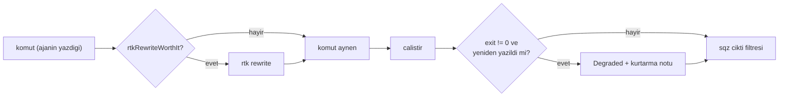
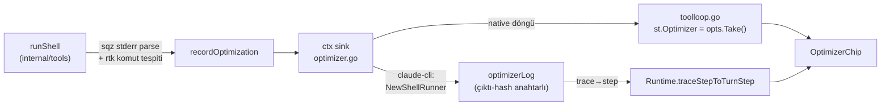
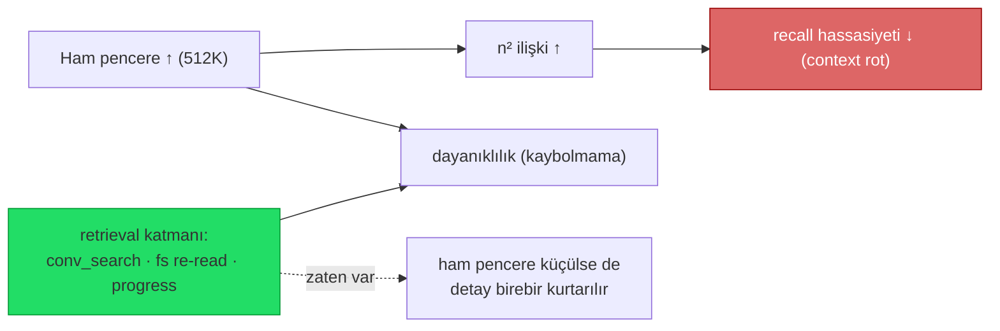

# 17 — Araç Çıktısı Token Optimizasyonu

> Ajan araç çıktılarının (shell, dosya, MCP) LLM context'ine girmeden önce küçültülmesi.
>
> **Not (2026-07-10): built-in araç-çıktısı sıkıştırması TAMAMEN KALDIRILDI.**
> TionHarness artık hiçbir built-in (deterministik veya LLM tabanlı) araç-çıktısı
> sıkıştırması **içermez**. Eskiden var olan iki sistem — "Sistem A" (deterministik,
> kural tabanlı, `internal/tools/compact`) ve daha eski "Sistem B" (ucuz-model LLM
> özeti) — ilgili ayarlar (`compactToolOutput` / `compactMaxLines` / `compactMaxBytes`),
> tasarruf sayaçları (`CompactSavedBytes` / `compactSavedBytes`) ve tüm bütçe/UI
> hücreleriyle birlikte **çıkarıldı**. Bu iş artık tamamen **harici araçlara** devredildi:
>
> - **`rtk`** — komut-katmanında **agent tarafından** çağrılır (Bash sarmalayıcı; bkz.
>   kullanıcı `CLAUDE.md`'sindeki manuel fallback).
> - **`sqz`** — **PostToolUse hook** olarak bağlanır; araç çıktısını modele dönmeden
>   önce hook zincirinde kısaltır.
>
> Server-tarafı `clear_tool_uses` / API-native compaction (eskiyen/taşan sonuçlar) ve
> retrieval katmanı zaten transcript-düzeyi baskıyı karşılıyordu; ham araç-çıktısı
> kırpmasını harici bir hook/CLI katmanına taşımak built-in bir alt sistemi bakmaktan
> daha temiz. Aşağıda **harici araç tespiti + hook entegrasyonu** (artık ana yol)
> anlatılır; ardından prompt-cache ve bütçe konuları gelir.

## Neden harici?

TionHarness'in native agentic döngüsünde (`agent/toolloop.go`) her araç çağrısının çıktısı bir
`ToolResult` olarak konuşmaya eklenir ve sonraki model çağrısında **girdi token'ı** olarak ücretlenir.
`Bash` gibi araçlar 64 KB'ye kadar ham çıktı döndürebilir. `git status`, test runner, `ls -R`, `grep`
gibi komutlar context'i hızla şişirir. Bu baskıyı azaltmak artık **built-in bir katman değil**, harici
araçların (`rtk` CLI / `sqz` PostToolUse hook) sorumluluğundadır — mevcut `internal/conversation`
compaction'ı (transcript bütçesi) ve prompt-cache bu harici katmanı tamamlar.

Built-in tarafında geriye kalan tek koruma tool'ların kendi 64 KB hard-cap'idir; hata/boş sonuçlar
her zaman olduğu gibi **hiç dokunulmadan** modele gider.

## CLI sağlayıcılarında trace çıktı cap'i (2026-08-27)

**Sorun:** `claude-cli` ve `codex-cli` araç döngüsünü kendileri koşturur; shell çağrısı
`internal/tools/builtin_shell.go`'dan geçmez, dolayısıyla oradaki 64 KB cap **ve** sqz/rtk
hook'ları hiç uygulanmaz. CLI ne bastıysa `TraceStep.Output`'a birebir yazılır ve transkripte
kalıcı olarak kaydedilir. Gerçek vaka (WS24/SES576): store'un `.jsonl` dosyaları üzerinde
koşan tek bir `rg -n` çağrısı **20 satırda 1 MB** döndürdü (her satır tam bir mesaj JSON'u) ve
tek asistan mesajını 1,88 MB'a çıkardı.

**Çözüm:** `internal/providers/traceoutput.go` → `CapToolOutput`. İki bağımsız limit:

- `traceOutputMaxLineBytes` = 4 KB — "az satır, her biri devasa" vakası (satır başına tam kayıt).
- `traceOutputMaxBytes` = 64 KB — "çok sayıda normal satır" vakası.

Kesme her zaman **görünürdür** (`…[line truncated at 4KB]`, `[output truncated at 64KB]`) ve
UTF-8 rune sınırını bölmez. Bağlandığı noktalar: `codexcli_events.go` → `setStep` (her adım tek
bir noktadan geçer), `claudecli_stream.go` → `tool_result` atama.

## Bridged shell için in-process `sqz` (2026-07-25)

**Sorun:** `sqz hook claude` yalnız **native `Bash`** tool adını rewrite ediyor. TionHarness
tüm shell'i bridged `mcp__tionharness_interaction__Bash` (ve `…__PowerShell`) üzerinden
koşturduğu için sqz PostToolUse/PreToolUse hook'u bu araçları **tanımıyor** → hiç sıkıştırma
olmuyordu (doğrulandı: aynı `cat` komutu native adla rewrite edilir, bridged adla passthrough).

**Çözüm:** sıkıştırmayı **sunucu tarafında, in-process** uygula. Shell tool'ları opsiyonel bir
çıktı filtresi taşır (`ShellTool/PowerShellTool.WithOutputFilter`, `internal/tools/builtin_shell.go`);
foreground çalıştırmada, sonuç **modele dönmeden önce** ve yalnız `shellCompressMinBytes` (2 KB)
üstündeyse filtreden geçer. Canlı UI stream'i (`onChunk`) **ham** kalır — kullanıcı tam çıktıyı görür,
model sıkıştırılmış alır. Filtreyi `Runtime.sqzShellFilter` (`internal/agent/shell_optimizer.go`)
kurar: sqz **opt-in** (workspace'te sqz hook wired) **ve** binary PATH'te ise, çıktıyı
`sqz compress --cmd '<komut>'`'a stdin ile verir. Hata/eksiklikte **ham çıktı** döner + `Warn` log
(fail-open; sıkıştırma optimizasyondur, doğruluk değil). Hem **native** (buildRegistry) hem **bridged**
(NewShellRunner), hem **Bash** hem **PowerShell** aynı tek enjeksiyondan geçer.

**Workspace toggle:** `WSSettings.ShellOutputCompression` (`""`=auto → sqz-hook varlığını
izler, `"on"`=zorla aç [binary yeterli, hook gerekmez], `"off"`=kapat). Runtime'a
`SetShellCompression` ile push edilir; `sqzShellFilter` bunu okur. UI: Ayarlar ▸ Workspace ▸
"Shell çıktısı sıkıştırma (sqz)" seçici + workspace-oluşturma sonrası öneri kartı
(`recommendations.ts` `shell-compress`: sqz kurulu ama pasifse tek-tık `on`). Hook'u
kaldırmak zaten doğal bir kapatma anahtarıdır (auto modda).

**Ajan bilgilendirmesi `on` modunda da gider (fix 2026-07-28):** `tokenOptimizerCapability`
eskiden yalnız hook'lara bakıyordu → `on` ile hook'suz sıkıştırılan workspace'te ajan
uyarısız kalıyor, sqz'nin kısaltmalı çıktısını **truncation sanıp** komutu tekrar
çalıştırabiliyor ya da derleyici/test çıktısını yanlış ayrıştırabiliyordu. Artık
`Runtime.effectiveTokenOptimizers` hook tespitine in-process filtreyi de katıyor; `on`
her shell çağrısını kapsadığı için `*` matcher'ı ile gelir (daraltıcı kapsam notu
basılmaz). `off` bir gerçek sqz hook'unu **gizlemez** — o hook native araç adında hâlâ
ateşlenir. API DTO'su da `shellOutputCompression`'ı geri yansıtır; eskiden
yansıtmadığı için Ayarlar seçici gerçek değer ne olursa olsun daima "auto" gösteriyordu.

**Güvenlik/kayıpsızlık:** `sqz compress` kendi kendini gate'ler — küçük/precise çıktı (hash, key)
"0% reduction" ile **verbatim** döner; asıl mekanizma **lossless n-gram kısaltma** (sözlük çıktının
başına eklenir, model geri açabilir). `[sqz] N/N tokens` istatistik satırı **stderr**'e gider,
döndürülmez. Agent ham çıktıya her zaman erişebilir: (a) shell tool'una **`no_compress: true`**
argümanı (filtre aktifken şemada ilan edilir → o çağrıda byte-exact ham döner), veya (b)
`komut > dosya` (stdout boş → filtre tetiklenmez) + `Read`/`Grep` file tool'u. Testler:
`builtin_shell_test.go TestShellOutputFilter` (eşik + no_compress), `shell_optimizer_test.go
TestSqzShellFilter_Gate`.

**sqz dedup önbelleği (2026-07-28):** sqz **kalıcı** bir dedup cache tutar; daha önce gördüğü
bir içerik tekrar gelirse **tüm çıktıyı** `§ref:<hash>§` handle'ıyla değiştirir ve stderr'e
`N/M tokens` yerine `[sqz] dedup hit: …` yazar. İki sonucu var:

1. **Test:** `TestSqzShellFilter_Gate` sabit payload ile **ilk koşuda geçip sonrakilerde
   düşüyordu** (ikinci koşuda istatistik satırı hiç yok). Test artık payload'a koşuya-özgü
   bir marker ekliyor → dedup'a takılmadan gerçek sıkıştırma yolunu ölçer.
2. **Ajan:** binlerce satır basan bir komut tek satırlık bir handle olarak dönebilir. Bunu
   bilmeyen ajan sonucu boş/bozuk sanıp komutu tekrar çalıştırır ve **aynı handle'ı** alır →
   döngü. `tokenOptimizerGuidance` artık iki çıktı biçimini de (`[Abbreviations]` sözlüğü ve
   çıplak `§ref:…§`) açıklıyor.

   **Kurtarma: `sqz expand '§ref:<hash>§'`** — orijinali tam olarak geri basar (doğrulandı:
   19.908 karakterlik çıktı birebir döndü). Rehber eskiden "geriye bak / `no_compress` ile
   tekrar çalıştır" diyordu; ikisi de gereksiz dolambaçtı — `expand` tam ve ucuz yol.
   İlgili: `sqz reset --cache-only` bayat `§ref:` token'ları temizler, `sqz tee list/get`
   sıkıştırılmamış kayıtları tutar.

`parseSqzStats` dedup satırını da tanır (`ShellOptimization{Kind:"sqz", Dedup:true}`) —
token çifti yok ama çip "sqz · yinelenen" olarak görünür, çünkü **kırık gibi görünen kart
tam olarak budur.**

## In-process `rtk` komut filtresi (2026-07-28)

**Sorun:** rtk hiç çalışmıyordu. SES14 + SES15'te **81 shell çağrısının 0'ı** rtk'dan
geçmiş. Sebep sqz'de çözdüğümüzün aynısı: rtk'nın PreToolUse hook'u araç **adı** olarak
`Bash`'i eşliyor, TionHarness ise her şeyi bridged `mcp__tionharness_interaction__Bash` ile
koşturuyor → hook hiç ateşlenmiyor. Manuel sarmalama da olmuyor (talimat yetmiyor).

**Çözüm:** sqz'nin çıktı filtresinin kardeşi olarak bir **komut** filtresi:
`tools.ShellCommandFilter` (`func(cmd string) (string, *ShellOptimization)`), `runShell`
içinde `build()`'den **önce** uygulanır. `Runtime.rtkCommandFilter`
(`internal/agent/rtk_optimizer.go`) kurar. Hem native hem bridged, hem Bash hem PowerShell.



### Neden beyaz liste (kara liste değil)

`rtk rewrite` her komuta bir karşılık üretmeye hazır, ama **sonucun daha kötü olduğu
aileler var**. Bu repoda ölçüldü (2026-07-28, token sayıları sqz'nin tokenizer'ından):

| Komut | Ham | sqz | rtk | rtk+sqz | Sonuç |
|---|---|---|---|---|---|
| `go test -v ./internal/tools` | 6107 | 3209 | **12** | 12 | rtk ezici |
| `git log -30` | 6595 | 2027 | 2157 | **1167** | istifleme |
| `git status` | 1090 | 876 | 811 | **549** | istifleme |
| `git diff _Docs` | 16184 | **7485** | 12556 | 10129 | **sqz kazanıyor** |
| `cat big.txt` (karakter) | 172.200 | — | **176.201** | — | **rtk büyütüyor** |

> Tablo **rtk 0.44.1** ile yenilendi (ilk ölçüm 0.42.4'teydi; `go test` 110 → 12 token'a
> indi, diğer kararlar aynı kaldı). Ham sütunlar repo o an ne durumdaysa ona göre değişir —
> önemli olan mutlak sayılar değil, aynı girdi üzerinde **sütunlar arası sıralama**.

Son iki satır yüzünden `rtk rewrite`'a körü körüne güvenilmiyor. `rtkRewriteWorthIt`
yalnız **doğrudan** test/build koşucularını geçirir (`go`, `cargo`, `npm`, `pytest`,
`jest`, `vitest`, `mvn`, …) + `git status`/`git log`. `git diff`, `cat` ve tüm
**dispatcher** komutlar (`npx`, `lint`, `prettier`, `format`, `uv`, `tsc`, `pip`) kapsam
dışı — gerekçeleri aşağıdaki ölçüm bölümünde. Ayrıca kabuk operatörü içeren satırlar
(`|`, `&&`, `;`, `$(…)`) atlanır — orada ilk token artık neyin çalıştığını anlatmıyor.

Listede olmayan bir aile "rtk başarısız olur" demek değil, **"henüz ölçülmedi"** demektir.
Genişletmek için ölçüm aracını kullan:

```powershell
python scripts/rtk_eval.py scripts/rtk_eval.spec.tsv
```

`scripts/rtk_eval.py` her komutu ham ve rtk-yeniden-yazılmış hâlde koşar, dördünü de
(`ham / sqz / rtk / rtk+sqz`) **tiktoken** ile sayar ve kararı basar. `spec` dosyası
kararların dayandığı komutları kaydeder — yolları kendi makinene göre düzenle.

### Ölçüm sonuçları (2026-07-28, rtk 0.44.1)

| Komut | Ham | sqz | rtk | rtk+sqz | Karar |
|---|---|---|---|---|---|
| `go test -v ./internal/tools` | 6107 | 3209 | **12** | 12 | ✅ listede |
| `cargo test -p sample-rules` | 929 | 874 | **16** | 30 | ✅ listede |
| `pytest -v` (182 test) | 3638 | 335 | **137** | 151 | ✅ listede |
| `npm run build` (vite) | 934 | 885 | 923 | **404** | ✅ listede |
| `npx vitest run` | 85 | 98 | 8 | 23 | ✅ (çıktı küçük, yön doğru) |
| `npx tsc --noEmit` (180 hata) | 4500 | **1832** | 4534 | 1700 | ❌ **çıkarıldı** |
| `npx eslint src` | 18943 | 10483 | 49 | 64 | ❌ **çıkarıldı — sayı YANLIŞ** |
| `pip list` | 2352 | **1230** | 2344 | — | ❌ eklenmedi |
| `uv pip list` | 55 | — | 2344 | — | ❌ **eklenmedi — farklı komut** |

> **`npm run build` ilginç:** rtk tek başına nötr (923 vs 934), kazanç rtk'nın çıktısının
> sqz tarafından **çok daha iyi sıkışmasından** geliyor (404). İki filtreyi ayrı ayrı
> değerlendirmenin yanıltıcı olabileceğinin örneği.

### Ölçümün zorla çıkarttığı üç aile

Beyaz listenin ilk hâli `go test` dışında **ölçümsüzdü** — "aynı şekle sahip" varsayımıyla
doldurulmuştu. Ölçünce varsayım 5 aileden 2'sinde çöktü ve biri **doğruluk hatası** çıktı:

**1. `npx` / `lint` / `prettier` / `format` — yanlış sayı üretiyor.**

```
Ham eslint : ✖ 109 problems (90 errors, 19 warnings)
rtk lint   : Lint: 2 errors, 0 warnings
             npm error could not determine executable to run
```

rtk `npx` önekini düşürüp `rtk lint`'e çeviriyor, projenin **yerel** eslint'ini bulamıyor,
ama yine de kendinden emin bir özet basıyor. Bu kayıplı değil, **yanlış**: ajan 90 hatalı
bir kod tabanını "neredeyse temiz" okur. (Çıkış kodu 1 olduğu için `Degraded` koruması
devreye giriyor — ama makul görünen yanlış bir sayı, beyaz listenin var oluş sebebidir.)

**2. `uv` — farklı yorumlayıcı.** `uv pip list` → `rtk pip list`, yani uv'nin ortamı yerine
**sistem python'u**. Daha kısa bir cevap değil, **başka** bir cevap.

**3. `tsc` — hak etmedi.** Dispatcher değil, sadece kazanç yok: rtk tek başına ham çıktıdan
**kötü** (4534 vs 4500), rtk+sqz ise sqz'den yalnız %7 iyi — eşiğin altında. sqz zaten
hallediyor.

Ortak desen: **dispatcher komutlar** (hangi aracı çalıştıracağına karar vermesi gerekenler)
rtk'da kırılıyor; doğrudan araç çağrıları (`go`, `cargo`, `pytest`, `npm run`) sorunsuz.
Bu ayrım `rtkWrapperPrograms` olarak kodda **gerekçesiyle** duruyor, ki "e canım lint de
bir koşucu değil mi" sezgisiyle geri eklenmesin. Test: `TestRtkWrapperProgramsExcluded`.

### Bunlar bize özgü değil — rtk'nın kendi issue'ları

Ölçümle bulduğumuz her vakanın upstream'de karşılığı var; yani yanlış kullanım değil,
bilinen sınırlar:

Durum **2026-07-28** itibarıyla (rtk 0.44.1 en güncel sürüm):

| Issue | Durum | Konu |
|---|---|---|
| [#950](https://github.com/rtk-ai/rtk/issues/950) | **AÇIK** | Windows'ta `.cmd`/shell sarmalayıcıları spawn edemiyor: **pnpm, npm, npx, tsc, tsserver, corepack**. Önerilen çözüm: Windows'ta `cmd.exe /c` ile çalıştırmak. Issue'nun kendi geçici çözümü de bizimkiyle aynı: *"bir PreToolUse hook bu komutlarda rtk'yı baypas ediyor"* |
| [#1080](https://github.com/rtk-ai/rtk/issues/1080) | **KAPANDI** (2026-04-26) | `npx <bilinmeyen-paket>` → `npm run` → ENOENT |
| [#1205](https://github.com/rtk-ai/rtk/issues/1205) | AÇIK | `uv run <araç>` / `uvx <araç>` registry aramasından önce açılmalı |
| [#294](https://github.com/rtk-ai/rtk/issues/294) | AÇIK | Hook rewrite kapsamı: `uv run`, `pnpm exec`, Python yol varyantları |

> **#1080 kapandı ama `npx` dışarıda kalmaya devam ediyor.** Bizim eslint hatamız
> `npm error could not determine executable to run` diyordu — bu #1080'in (yanlış
> dönüşüm → ENOENT) değil, **#950'nin** imzası. Yani `npx`'i dışarıda tutan gerekçe
> hâlâ açık. Kapanan issue'yu gerekçe sanıp `npx`'i geri almak, düzelmemiş bir hataya
> güvenmek olurdu.

**#950'nin listesi uygulandı** (`npx`, `tsc`, `tsserver`, `corepack`, `pnpm`) — **tek
istisna `npm`**. Kural şu oldu: *upstream'in listesi geçerlidir, doğrudan ölçüm onu
çürütmediği sürece.*

| Komut | Bu makinede ölçüldü mü? | Karar |
|---|---|---|
| `npx`, `tsc` | evet — kazanç yok / yanlış sayı | çıkarıldı |
| `pnpm`, `tsserver`, `corepack` | **hayır** (pnpm kurulu bile değil) | çıkarıldı |
| `npm` | **evet** — çalışıyor + kazanç doğrulandı | **kaldı** |

> **`pnpm` neden gitti:** beyaz listede yalnızca "npm'e benziyor" diye duruyordu, burada
> hiç ölçülmedi (kurulu değil), dolayısıyla hakkındaki **tek kanıt** upstream'inki ve o da
> "bozuk" diyor. Ölçülmemiş bir girdinin aleyhine kanıt varsa onu ayakta tutan hiçbir şey
> kalmaz — bu, "ölçülmemiş aileye dokunma" kuralının doğrudan sonucu.

> **`npm` neden kaldı — iki gerekçe:**
> 1. **Tekrar etmedi.** `rtk npm run build` gerçekten derledi (exit 0, 4497 modül, tam
>    vite çıktısı); 824 → 404 kazancı dedup cache'i her ölçümden önce temizlenerek yeniden
>    üretildi.
> 2. **Hata modu gürültülü.** rtk'nın npm filtresi çıktıyı **özetlemiyor**, olduğu gibi
>    geçiriyor (rtk tek başına 924 token vs ham 842 — hiçbir şeyi küçültmüyor). Dolayısıyla
>    `lint` filtresinin "2 errors" uydurması gibi bir sayaç yok. #950 ısırırsa komut sadece
>    çalışmaz: exit≠0, `Degraded` notu, görünür.
>
> **Kazancı rtk olmadan alamıyoruz.** Bariz teori — "rtk ANSI'yi temizliyor, sqz'ye o
> yarıyor" — test edilip **çürütüldü**: hamdan ANSI'yi kendimiz temizleyince hiçbir şey
> değişmedi (824 → 821), rtk'nın **daha büyük** çıktısı ise yine 404'e indi. sqz'nin rtk
> formatında bulduğu şey her neyse, bizim taklit edebileceğimiz bir şey değil.

Test: `TestRtkWrapperProgramsExcluded` hem çıkarılanları hem `npm`'in kalmasını kilitliyor,
ki ileride "upstream listesini harfiyen uygula" geçişi doğrulanmış kazancı sessizce silmesin.

> **`npm run build`'in kazancı nereden geliyor?** rtk çıktıyı özetlemiyor (921 vs ham 932) —
> kazanç rtk'nın çıktısının sqz tarafından **iki kat iyi sıkışmasından** geliyor (404 vs 883).
> Dedup cache'i her ölçümden önce temizlenerek iki kez doğrulandı.

Referans: [Command Rewrite System](https://deepwiki.com/rtk-ai/rtk/3.5-command-rewrite-system)
— `rtk rewrite`'ın registry kuralları ve `npx` passthrough listesi.

### `rtk rewrite`'ın çıkış kodu tuzağı

`rtk rewrite --help` "Exits 0 and prints the rewritten command if supported" diyor.
**Gerçekte rtk 3.x başarıda 3 dönüyor** (doğrulandı: `rtk rewrite "go test ./..."` →
stdout `rtk go test ./...`, exit **3**). Belgelenen koda göre kapı koymak özelliği
sessizce tamamen devre dışı bıraktı. Filtre artık çıkış kodunu **yok sayıyor**, bunun
yerine **çıktıyı doğruluyor**: boş olmayacak, değişmiş olacak ve `rtk ` ile başlayacak.
Beklenmedik bir şey dönerse orijinal komut çalışır + `Warn` log.

### Hata yutması koruması

rtk kayıplı bir özetleyici ve **gerçek hatayı kaybedebiliyor.** Ölçülen üç vaka:

| Vaka | rtk 0.42.4 | rtk 0.44.1 | Değerlendirme |
|---|---|---|---|
| Test başarısız | `[FAIL] TestX` + `fail_test.go:9: …` + tee log | aynı | ✅ tam korunuyor |
| Derleme hatası | `broken.go:3:22: syntax error: …` | aynı | ✅ tam korunuyor |
| **Bozuk `go.mod` (BOM)** | `Go test: No tests found` | **tamamen boş** | ❌ **gerçek hata kayıp** |

Üçünde de exit kodu 1. Yani çıkış kodu güvenilir, **mesaj** değil.

> **Sürüm yükseltmesi bu vakayı düzeltmedi, şekil değiştirdi** (0.44.1'de yanıltıcı metin
> yerine sıfır çıktı — ajan açısından daha da kötü). Koruma bu yüzden **koşulsuz**: belirli
> bir metni ("No tests found" gibi) yakalamaya çalışmıyor, "yeniden yazılmış komut
> başarısız oldu" olgusuna bakıyor. Sürümler arası kayan bir hata desenine kalıp bağlamak
> ilk yükseltmede sessizce kırılırdı.

Ham çıktıyı kurtarmak için komutu yeniden koşmak **seçilmedi**: her başarısız build'in
maliyetini ikiye katlar ve flaky bir testte **farklı** sonuç raporlayabilir. rtk'nın kendi
tee dosyası da çözüm değil — yutma vakasında tee hiç oluşmuyor (doğrulandı).

Bunun yerine **dürüst uyarı**: yeniden yazılmış bir komut başarısız olursa çıktının sonuna
`[optimizer note: …]` eklenir ("bu ham çıktı değil, rtk özeti; açıklamıyorsa aynı komutu
`no_compress: true` ile tekrar çalıştır") ve adım `Degraded` işaretlenir → kartta
**`rtk özet — ham değil`** çipi. Not, sqz filtresinden **sonra** eklenir ki kurtarma
talimatı kısaltılmadan ulaşsın. Tek çalıştırma, sıfır tahmin, kararı bilgiye en yakın olan
verir.

### Araçların kendi ayarları (TionHarness dışı)

Her ikisinin de kendi yapılandırması var; TionHarness'in ayarlarıyla **karışmaz**, alt katmanda
durur:

| Araç | Yapılandırma | İşe yarayan anahtarlar |
|---|---|---|
| rtk | `%APPDATA%\rtk\config.toml` (`rtk config --create` ile oluşur) | `[hooks] exclude_commands` — belirli komutları rtk'dan muaf tut · `[tee] enabled/mode` (varsayılan `failures`) · `[limits] grep_max_results`, `status_max_files`, `passthrough_max_chars` · `[filters] ignore_dirs/ignore_files` · `[telemetry] enabled=false` |
| sqz | `sqz init` ile kurulan preset'ler | `sqz reset --cache-only` (bayat `§ref:` token'ları) · `sqz expand` (ref → tam içerik) · `sqz tee list/get` · `sqz status`/`gain`/`stats` |

> **Neden beyaz listeyi rtk'nın `exclude_commands`'ine devretmiyoruz:** o dosya makineye
> özel ve sürüm kontrolünde değil. Kararı oraya taşımak, TionHarness'in davranışını
> **makineden makineye değiştirir** ve testle kilitlenemez hale getirir. Kod tarafındaki
> `rtkWrapperPrograms` gerekçesiyle birlikte repoda duruyor ve testi var.

#### Bakım paneli — Ayarlar ▸ Harici Araçlar (2026-07-28)

Aynı gerekçeyle bu araçların config **anahtarları** ayar olarak yansıtılmadı: onların
yapılandırması makine geneli, TionHarness ayarları workspace başına — anahtarı buraya koymak,
ayarın tutamayacağı bir kapsam sözü vermek olurdu. Bunun yerine iki **eylem**
(rtk config'i Explorer'da açan üçüncü eylem 2026-08-12'de kaldırıldı; config yolu
panelde hâlâ metin olarak gösterilir):

| Eylem | Uç nokta | Ne yapar |
|---|---|---|
| Tasarruf raporu | `GET /api/external-tools/token-report` | `rtk gain` + `sqz gain` çıktısını **birebir** gösterir; TionHarness yeniden hesaplamaz, böylece araçların muhasebesinden sapamaz |
| sqz dedup önbelleğini temizle | `POST /api/external-tools/sqz-reset-cache` | `sqz reset --cache-only` — bayat `§ref:…§` işaretçileri ajanı şaşırttığında sqz'nin kendi önerdiği işlem. İstatistikler korunur |

Güvenlik: iki uç nokta da **parametre almaz**; komutlar sabit argv. Kabuğa ulaşan hiçbir
istek alanı yok.

Panel ayrıca eski *"rtk ve sqz'yi aynı anda açma"* uyarısını taşıyordu — o metin de
ölçümle çeliştiği için düzeltildi: artık ikisini birden açmayı **öneriyor**.

### Ayar

`WSSettings.ShellCommandRewrite` — `ShellOutputCompression` ile birebir simetrik tri-state
(`""`=auto → rtk-hook varlığını izler, `"on"`=zorla, `"off"`=kapat). Ayrı knob, çünkü ikisi
karşı uçlarda çalışıyor ve bir workspace birini isteyip diğerini istemeyebilir. UI: Ayarlar
▸ Workspace ▸ "Shell komutu yeniden yazma (rtk)".

`no_compress: true` **ikisini birden** atlar — tek bayrak, tek kavram ("bu komutu bana
dokunulmamış ver"). Degraded notunun işaret ettiği kaçış yolunun gerçekten ham çıktı
vermesi buna bağlı.

Testler: `rtk_optimizer_test.go` (beyaz liste, gate, canlı rewrite),
`builtin_shell_cmdfilter_test.go` (rewrite gerçekten çalışıyor mu, degraded notu,
no_compress opt-out, iki filtrenin tek kayda birleşmesi).

> **Kaldırılan uyarı kartı:** `token-conflict` ("rtk ve sqz ikisi de komutu yeniden
> yazıyor — birini kapatmalısın") **silindi**. Ölçüm bunun tersini gösteriyor: karşı
> uçlarda çalışıyorlar ve istifleme her vakada en iyi sonucu veriyor. Kart kullanıcıyı
> **en iyi konfigürasyonunu kapatmaya** yönlendiriyordu.

## Tasarruf çipi — sohbet kartında görünür optimizasyon (2026-07-28)

**Sorun:** sqz çıktıyı yeniden yazıyordu ama **hiçbir yerde görünmüyordu**. Kullanıcı
kartta `«A1»` placeholder'ları ya da tek satırlık `§ref:…§` görüp bunu truncation/hata
sanıyordu; ajan da aynı belirsizliği yaşıyordu.

**Çözüm:** shell adımına `TurnStep.Optimizer` (`tools.ShellOptimization{Kind,InTokens,
OutTokens,Dedup}`) eklendi; UI `OptimizerChip` ile `sqz −%93` / `sqz · yinelenen` / `rtk`
çipi basar (hover'da `841 → 57 token`).

Sayılar **tahmin değil**: sqz zaten stderr'e `[sqz] 57/841 tokens (93% reduction)` yazıyor,
`parseSqzStats` onu okuyor. Ölçüm yoksa yüzde de yok — `rtk` komutu **sarmaladığı** için
öncesi/sonrası çifti hiç oluşmaz, o yüzden çip yalnız adı gösterir (uydurma yüzde yerine).

İki farklı yol, iki farklı mekanizma:



- **Native yol** temiz: `WithOptimizerSink` çağrı-başı ctx sink'i, `diff.go` deseninin aynısı.
- **claude-cli yolu** (WS16 worker'ları) ctx sink'e ulaşamaz: shell bizim bridge'imizde
  koşar ama **adımlar sonradan CLI'nin stream-json trace'inden** kurulur — farklı çağrı
  yığını. Bu yüzden `optimizerLog` (`internal/agent/optimizer_log.go`) devreye girer.
  **Anahtar komut değil, çıktının SHA-256'sıdır:** komutla anahtarlamak FIFO defter
  tutmayı gerektirirdi (aynı komut turda iki kez koşabilir) ve sıraya duyarlı olurdu;
  çıktı ise runner'dan trace adımına giden şeyin ta kendisi → arama **idempotent**
  (hem canlı `OnEvent` hem son toplu dönüşüm aynı adımı çözer, boşaltma gerekmez).
  Ring 128 girdi ile sınırlı, yalnız hash tutulur. Eşleşmezse çip **çıkmaz** — bir
  downstream hook sonucu yeniden yazarsa sessizce kaybolmak, yanlış rakam basmaktan iyidir.

Testler: `optimizer_test.go` (sink, `isRTKWrapped`, `Measured()` dürüstlüğü),
`optimizer_log_test.go` (round-trip, whitespace toleransı, ring sınırı),
`shell_optimizer_parse_test.go` (`parseSqzStats`'ın beş stderr biçimi).

## Ajan bağlamı — hangi optimizer aktifse ona göre (2026-07-28)

`tokenOptimizerGuidance` artık **üç ayrı şekil** üretiyor; her biri o kombinasyonun
kendine özgü "bu bozuk mu?" anını hedefliyor:

| Aktif | Bloğun anlattığı asıl şey |
|---|---|
| **rtk** | Çıktı bir **ÖZET** — kayıp bilinçli, yalnız geçen testler düşer; hatalar `dosya:satır` ile tam. Kısa sonuç "komut çalışmadı" demek değil. Başarısızlıkta `[optimizer note: …]` gelirse takip et. |
| **sqz** | Sıkıştırma **KAYIPSIZ**; iki biçim: `[Abbreviations]` sözlüğü ve çıplak `§ref:…§`. |
| **ikisi** | Karşı uçlarda çalışıyorlar ve **istifleniyorlar**. Kritik: rtk bir test koşusunu birkaç satıra indirince sonuç sqz'nin ~2KB eşiğinin **altında** kalır → o kartta **hiç kısaltma sözlüğü görünmez.** Bu boru hattının çalışması, sqz'nin bozulması değil. |

Son satır bu bloğun asıl varlık sebebi: "çıktın sıkıştırılıyor" denip sıkıştırılmamış
çıktı gösterilen ajan, optimizer'ın bozulduğu sonucuna varıp **olmayan bir soruna**
çözüm aramaya başlar.

Blok sonunda tek ortak kaçış yolu duyurulur: `no_compress: true`.
Test: `TestTokenOptimizerGuidance_PerCombination`.

## Canlı LLM doğrulaması ve çıkan üç kusur (2026-07-31)

Zincirin tamamı **yeni build + gerçek claude-cli turlarıyla** sınandı (`serve.ps1`,
WS10/AGT1). Her tur bir kusur açığa çıkardı — hepsi düzeltildi.

| # | Test | Sonuç |
|---|---|---|
| 1 | `cd … && go test ./internal/db/` | ✅ `cd … && rtk go test …` · `Go test: 78 passed` |
| 2 | `cd … && go test ./internal/tools/ 2>&1` | İlk turda **rewrite kaçtı** → `2>&1` muafiyeti eklendi → ✅ `230 passed` |
| 3 | Bozuk `go.mod` (Degraded yolu) | Not iletildi ama **kurtarma yolu kırıktı** → iki düzeltme → ✅ iki çağrıda çözüldü |

### Kusur 1 — `2>&1` rewrite'ı düşürüyordu

Ajanlar komuta refleks olarak `2>&1` ekliyor. Operatör kuralı bunu reddediyordu.
`2>&1` **hiçbir yere yazmaz**, akış birleştirir; rtk da token'ı olduğu gibi korur
(`go test ./x 2>&1` → `rtk go test ./x 2>&1`). Tek istisna olarak geçirildi
(`stripMergeStderr`). `2>dosya`, `> out`, `2>&1x` hâlâ reddediliyor.

### Kusur 2 — `no_compress` string olarak gelince reddediliyordu

Degraded notu ajana *"`no_compress: true` ile tekrar çalıştır"* diyor. Ajan dedi —
ve çağrı **reddedildi**:

```
cannot unmarshal string into Go struct field shellArgs.no_compress of type bool
```

Model `"true"` (string) göndermişti. `flexBool` eklendi (`builtin_ask.go`'daki
`flexOptions` deseninin aynısı): `true`/`"true"`/`"1"`/`"yes"`/`1` kabul,
`"maybe"` hâlâ **hata** — belirsizi sessizce `false` saymak, görünür bir hatayı
görünmezle takas etmek olurdu.

### Kusur 3 — bridged şema `no_compress`'i YASAKLIYORDU

Asıl sorun buydu. Bridge şemayı **filtresiz** bir araçtan üretiyordu:

```go
defs = append(defs, tools.NewShellTool(tools.Sandbox{}).Def())   // outFilter == nil
```

`Def()` ise `no_compress`'i yalnız `outFilter != nil` iken ilan ediyor — üstelik
şemada `"additionalProperties": false` var. Yani parametre belgesiz değil,
**yasaktı**. Oysa gerçek filtre tur başına `NewShellRunner` ile kuruluyor, dolayısıyla
çağrı anında çalışıyordu.

Sonuç: bir yerde önerilen kurtarma yolu başka bir yerde engelleniyordu. Ajan
şemayı okuyup "bu seçenek yok" diye `> dosya 2>&1`'e düştü. `AdvertiseOptimizerFlag()`
eklendi; bridge onu kullanıyor. Test: `TestBridgedShellAdvertisesNoCompress`.

**Düzeltme öncesi/sonrası** (aynı senaryo, gerçek LLM):

| | Çağrı sayısı | Nasıl |
|---|---|---|
| Önce | **4** | not → reddedilen `no_compress` → elle `ls`/`xxd` → elle `> dosya 2>&1` |
| Sonra | **2** | not → aynı komut + `no_compress: true` → ham hata → kök neden |

## `cd <dir> && …` kapsam boşluğu (2026-07-31)

SES63'ün ikinci dersi. Hook engeli kalktıktan sonra Bash çalıştı ama **hiçbir adımda
`optimizer` yoktu**. Sebep beklenmedik bir yerdeydi — komutların **şekli**:

| Ölçüm (SES63, 11 shell komutu) | |
|---|---|
| İlk token `cd` olan | **10 / 11** |
| Kabuk operatörü içeren | **10 / 11** |

`rtkRewriteWorthIt` operatör içeren satırları topluca reddediyordu, dolayısıyla bu ajanın
komutlarının **hiçbiri** yeniden yazılamazdı. Ajanlar dizini araç cwd'sine güvenmek yerine
her çağrıda `cd <dir> &&` ile yeniden kuruyor — bu istisna değil, **baskın kalıp**. Sonuç:
`go test` üzerinde ölçülen %99 kazanç pratikte hiç gerçekleşmiyordu.

**rtk bu şekli zaten doğru işliyormuş** (doğrulandı):

```
cd /tmp && grep -rn foo .   →   cd /tmp && rtk grep -rn foo .
```

Yani boşluk tamamen bizim taraftaydı. `splitCdPrefix` eklendi: tek seviyeli `cd <dizin> &&`
öneki ayrılır, **kuyruk** değerlendirilir, doğrulama `<aynı cd öneki> + "rtk "` bekler.

Korunan sınırlar: kuyrukta operatör varsa yine reddedilir — `cd x && cmd > dosya` olsaydı
rtk'nın **özeti dosyaya yazılırdı**. Çift `cd`, çıplak `cd`, `pushd` de kapsam dışı. Tırnaklı
yol tek kelime sayılır (`cd "/c/My Proj" && npm run build` — Windows'ta kural, istisna değil).

> **`grep` neden hâlâ listede değil:** aynı repoda ölçüldü — `rtk grep` çıktısı ham grep ile
> **birebir aynı** (15 satır, 2152 bayt). Sonuç rtk'nın limitlerinin altında kaldığı için
> passthrough oluyor. SES63'ün greplerini rtk kurtarmazdı; ölçüm bunu söylüyor.

Test: `TestRtkCommandFilter_Gate` içinde **canlı binary'ye karşı** uçtan uca doğrulama —
`cd /c/proj && go test ./...` → `cd /c/proj && rtk go test ./...`, ve kuyruktaki
yönlendirmenin hâlâ reddedildiği.

## rtk hook şablonu KALDIRILDI — shell'i bloke ediyordu (2026-07-31)

**Belirti:** WS10/SES63'te ajanın **hiçbir Bash çağrısı** çalışmadı. İki denemede de:

```
PreToolUse:mcp__tionharness_interaction__Bash hook error:
  [$j=[Console]::In.ReadToEnd()|ConvertFrom-Json; ...]:
  /usr/bin/bash: -c: line 1: syntax error near unexpected token `|'
```

Ajan pes edip PowerShell'e geçti. rtk hiç çalışmadı; **shell de çalışmadı.**

**Kök neden:** Ayarlar ▸ Harici Araçlar'daki "rtk'yi bağla" butonu gövdesi **PowerShell
tek satırlığı** olan bir PreToolUse hook'u yaratıyordu. TionHarness'in kendi hook runner'ı
Windows'ta PowerShell olduğu için native yolda çalışıyordu — ama `writeCLISettings` bu
hook'u claude-cli'ye devrettiğinde **CLI onu bash ile** çalıştırıyor ve ilk `|`'da ölüyor.
Başarısız bir PreToolUse hook'u **araç çağrısını bloke ettiği** için sonuç: o workspace'te
Bash tamamen kullanılamaz hale geliyor.

Risk `climcp.go:280`'de zaten yazılıydı: *"CLI hooks run under the CLI's own hook
runner/shell, which may differ from TionHarness's execHook (PowerShell on Windows)."*
Şablon bu uyarıyı ihlal ediyordu. HOK4 (sqz) aynı workspace'te sorunsuz çalışıyor çünkü
doğru deseni kullanıyor: `powershell -NoProfile -ExecutionPolicy Bypass -File "...ps1"` —
hem bash hem PowerShell için geçerli bir komut satırı.

**Çözüm — şablonu düzeltmek değil, kaldırmak.** Hook bash-uyumlu hale getirilebilirdi ama
zaten **yanlış mekanizmaydı**: her komutun başına `rtk ` ekliyordu — `git diff` ve `cat`
dahil, yani rtk'nın ölçümle kaybettiği yerler dahil. In-process filtre bunların hepsini
çözüyor (ölçülmüş beyaz liste + `Degraded` koruması + hem native hem bridged yol).

Yapılanlar:

| Yer | Değişiklik |
|---|---|
| `external_tools.go` | rtk'nın `wire`'ı `"hook"` → **`"setting"`** |
| `ExternalToolsPanel.tsx` | `TOOL_HOOK_TEMPLATES.rtk` **silindi**; `wire:'setting'` satırı `shellCommandRewrite`'ı aç/kapat eder |
| `recommendations.ts` | `RTK_HOOK` **silindi**; "token" kartı yalnız sqz önerir |
| `recommendations.test.ts` | `never offers an rtk HOOK…` + şablonun imzası (`ReadToEnd`) geri gelirse kırılan assert |
| WS10 (canlı) | HOK3 silindi; `shellCommandRewrite="on"`, `shellOutputCompression="on"` |

> **Ders:** iki farklı hook runner (TionHarness=PowerShell, claude-cli=bash) varken hook
> gövdesi **ikisinde de geçerli** olmalı. Tek satırlık PowerShell yerine
> `powershell -NoProfile -File <script.ps1>` deseni kullanılmalı — sqz'nin yaptığı gibi.

## Canlı doğrulama — WS16 / claude-cli (2026-07-28)

Zincirin tamamı gerçek bir turda, gerçek bir worker'da doğrulandı. WS16'da
`shellCommandRewrite="on"` yapıldı (workspace'te yalnız sqz hook'u vardı, rtk hook'u
yoktu → filtre `auto` modda nil kalıyordu) ve AGT1'e (claude-cli/opus) tek komutluk bir
görev verildi: `cargo test -p sample-rules`.

Persist edilen adım:

```json
{
  "kind": "tool", "tool": "Bash",
  "input":  { "command": "cargo test -p sample-rules" },
  "optimizer": {
    "kind": "rtk",
    "command": "rtk cargo test -p sample-rules",
    "degraded": true
  }
}
```

Dört şey birden kanıtlandı:

1. **Komut filtresi ateşledi** — `cargo test …` → `rtk cargo test …`
2. **Yeniden yazılan komut kaydedildi** → çip hover'ında gerçekte çalışan komut görünür
3. **`Degraded` koruması çalıştı** — komut başarısız oldu, bayrak set edildi
4. **claude-cli yolu tuttu** — bu **en riskli parçaydı**: adımlar CLI'nin stream-json
   trace'inden kuruluyor, ctx sink oraya ulaşmıyor. `optimizerLog`'un çıktı-hash
   eşleşmesi bridged runner ile trace adımını doğru bağladı.

Ajana dönen çıktının sonu (not sqz'den **sonra** ekleniyor, kısaltılmadan ulaşıyor):

```
rtk: Failed to resolve 'cargo' via PATH, falling back to direct exec: Binary 'cargo' not found on PATH
[exit error: exit status 1]

[optimizer note: this command FAILED and the text above is a token-optimized SUMMARY
produced by rtk, not the command's raw output. … re-run the SAME command with
no_compress: true to get the byte-exact output.]
```

> **Turun ortaya çıkardığı ayrı bir sorun:** `cargo` bridged shell'in PATH'inde yok —
> SES14/SES15'te üç çağrı harcatan israfın aynısı. git-bash normal bir kabuktan
> çağrıldığında `<home>/.cargo/bin/cargo`'yu görüyor, yani sorun git-bash'te
> değil: **TionHarness süreci dar bir PATH ile başlatılmış** ve tüm alt kabukları onu
> miras alıyor. Bu, token optimizasyonundan bağımsız bir dağıtım/başlatma konusu;
> `_Docs/17`'nin kapsamı dışında ama worker'ların Rust derleyememesine yol açıyor.

## Kabuk ortamı ipucu — `/c/` vs `/mnt/c` (2026-07-28)

Windows'ta `Bash` aracını **git-bash mi WSL mi** karşıladığı OS'tan türetilemez ama
komuttaki yol yazımını tamamen belirler. Prompt bunu söylemediği için ajan her oturumda
sıfırdan keşfediyordu: SES14 ve SES15 traceleri **ilk üç shell çağrısını** `/mnt/c/...`
deneyip `No such file or directory` alarak harcadı, sonra `/c/...`'a geçti — her yeni
oturumda yeniden.

`shellEnvironmentCapability` (`internal/agent/capabilities_shellenv.go`) çözülen lehçeyi
(`tools.POSIXShellFlavor()` → `gitbash` / `wsl` / `unix`) statik prefix'te **bir kez**
bildirir: mount kökü (`/c/` vs `/mnt/c/`), Windows PATH/`.exe` davranışı, `127.0.0.1`
erişilebilirliği. Native Unix'te blok **basılmaz** (model zaten o düzeni varsayıyor →
boşuna token). Diğer capability'ler gibi hem chat (`composeTurnRequest`) hem headless
(`autonomousSystemPrompt`) yolundan geçer. Test: `TestShellEnvironmentGuidance`.

## Harici araç tespiti (presence-only) — ana yol

Ayarlar → **Hooks** ekranındaki "Kurulu mu kontrol et" butonu (panel açılışında otomatik de çalışır), bu
cihazda isteğe bağlı harici CLI araçlarının **kurulu olup olmadığını** gösterir. Liste artık yalnız
token araçlarıyla sınırlı değil; **kategorilere** ayrılır:

| Kategori (`category`) | Araç | Kullanım (`wire`) |
|---|---|---|
| `token` (Token / bağlam optimizasyonu) | `rtk`, `sqz` | `hook` — tek tıkla PostToolUse hook'u bağlanır (`sqz`); `rtk` ise komut-katmanında agent tarafından Bash ile çağrılır |
| `render` (Render / diyagram) | `mmdc` (mermaid-cli) | `cli` — yerelde mermaid→SVG/PNG dosya çıktısı |

- Backend: `GET /api/external-tools` (`api/external_tools.go`) → `exec.LookPath` ile PATH'te arar.
  **Araçları kurmaz, çalıştırmaz, değiştirmez** (Windows'ta PATHEXT'e saygılı). Dönüş:
  `[{name,desc,url,category,wire,found,path}]`. Yeni araç eklemek = `knownExternalTools`'a tek giriş
  (yalnız `wire="hook"` ise frontend `TOOL_HOOK_TEMPLATES`'e ek şablon gerekir).
- Frontend: `systemApi.externalTools()` + `HooksPanel`; araçlar `category`'ye göre gruplanır, `wire`'a
  göre rozet/buton gösterilir (`hook`→Bağla/Aktif toggle, `mcp`→MCP rozeti, `cli`→CLI rozeti) + repo linki.
- Bu yalnızca **bilgilendirme + opsiyonel wire-up**'tır; TionHarness bu araçları kendiliğinden çalıştırmaz.
  Araç-çıktısı sıkıştırması **artık yalnız bu harici yoldadır** (built-in `compact` alt sistemi
  kaldırıldı): `sqz` PostToolUse hook'u olarak bağlanır, `rtk` agent tarafından Bash ile çağrılır.
  `cli` araçları (`mmdc`) ajan tarafından geliştirme sırasında Bash ile kullanılır.

### `sqz` PostToolUse hook entegrasyonu

- `sqz` `token` kategorisinde, `wire="hook"` olarak listelenir → Ayarlar → **Hooks** ekranında
  tek tıkla **PostToolUse** hook'u olarak bağlanabilir (frontend `TOOL_HOOK_TEMPLATES`).
- PostToolUse zincirinde araç çıktısı, modele/transkripte dönmeden önce `sqz`'e verilir; hook
  kısaltılmış çıktıyı geri döndürür. TionHarness bu kazanımı **ölçmez** (Claude Code hook sözleşmesi
  tasarruf sayacı sunmaz) — kazanç dolaylı olarak input-token düşüşünde görünür.
- `rtk` için ayrı bir hook şablonu gerekmez; agent gürültülü komutları doğrudan `rtk <cmd>` ile
  sarmalar (kullanıcı `CLAUDE.md`'sindeki manuel fallback listesi).

## Sınırlar / Notlar

- Built-in araç-çıktısı **sıkıştırması** yoktur; tek built-in müdahale, boyut için bir
  **backstop kırpması**dır (`internal/tools/registry.go`): eşik `maxToolOutputBytes`
  (varsayılan 100 KB; ayar `maxToolOutputKB`, `applySettings` → `SetMaxToolOutputBytes` ile
  process-global itilir). Eşiğin altındaki çıktı **hiç dokunulmadan** geçer, yani kullanıcı
  modele giden `ToolResult` ile UI'da gösterilen/persist edilen `TurnStep.Output`'u birebir
  aynı görür (harici hook uygulanmışsa her ikisi de hook'tan geçmiş haliyle gösterilir).
- Eşiği aşan çıktı **atılmaz, artifact'e taşınır** (2026-08-28, `capToolOutputOffload`):
  ctx'te bir artifact sink varsa (`tools.WithArtifacts` — her native turda oturuma bağlı
  olarak takılır) **tam çıktı** `text` türünde bir artifact olarak kalıcılaştırılır ve modele
  baş (`maxToolOutputBytes`'ın %70'i) + son (kalan bütçe) + artifact kimliği verilir. Elenen
  orta kısım `read_artifact` (`builtin_artifactmgmt.go`) ile geri okunabilir. Baş+son
  bölünmesinin nedeni: yalnız baş kırpması çıkışı (exit kodu, son satırlar, hata kuyruğu)
  kaybeder.
- Sink yoksa (oturumsuz tur, claude-cli köprü registry'si) veya artifact yazımı hata verirse
  davranış eskisiyle **bayt-bayt aynı** düz kırpmadır (`capToolOutput` → `…[truncated N bytes]`);
  depolama sorunu çıktıyı bozar ama tool çağrısını başarısız etmez. Test:
  `internal/tools/registry_cap_test.go`.
- Komut-özel akıllı kısaltma (git/test/grep'e özgü) built-in tarafta yok; bu iş harici `rtk`/`sqz`
  araçlarının komut-aile kurallarına bırakıldı.
- claude-cli delegasyon yolu kapsam dışıdır (çıktıları TionHarness'in `ToolResult` katmanından geçmez).

### Tool dizisi prompt-cache breakpoint'i (2026-07-02)

Anthropic prefix-cache sırası `tools → system → messages`. Eskiden cache breakpoint
yalnız static **system** bloğundaydı; tool şemaları dolaylı (system prefix'i sayesinde)
cache'leniyordu → system bloğu değişirse tool cache'i de düşerdi. Artık `toAnthropicTools`
caching açıkken **son tool'a bağımsız bir breakpoint** koyuyor (1s TTL, system'le aynı;
sıra `tools(1h)→system(1h)` geçerli). Böylece tool tanımları **kendi prefix'inde** cache'lenir
ve bir sistem-prompt düzenlemesi tool cache'ini bozmaz (Anthropic önerilen "son araca
breakpoint" pratiği). Politika değişmedi: yalnız `extendedCache` açıkken; kapalıyken hiçbir
tool breakpoint'i eklenmez. Kod: `internal/providers/anthropic.go` (`anthropicTool.CacheControl`,
`toAnthropicTools`). Test: `TestToAnthropicTools_*`.

### Konuşma geçmişi kayan breakpoint'i (2026-07-02)

Önceki iki breakpoint yalnız **statik** prefix'i (tools + system) cache'liyordu; her turda
**tüm transkript** için tam input ücreti ödeniyordu. Uzun oturumlarda (özellikle Fable 5'in
1M penceresinde) baskın maliyet kalemi ham geçmiştir. Artık `toAnthropicMessages` caching
açıkken **son mesajın son bloğuna** kayan bir breakpoint (1h TTL) koyuyor → tüm konuşma
prefix'i cache'lenir. Anthropic sırası `tools → system → messages`, breakpoint limiti 4;
`tools(1) + system-static(1) + history(1) = 3` güvenle içeride. Tur N'de prefix cache
**yazımı** olur, tur N+1'de aynı prefix cache **okuması** (0.10×) olur ve breakpoint en yeni
mesaja kayar (standart "sliding breakpoint"). Breakpoint son bloğa konur — rol/blok türü
farketmez (trailing `tool_result` da olur). Politika birleşik: yalnız `extendedCache` açıkken;
`req.MaxTokens==0` yolu etkilenmez. Kod: `contentBlock.CacheControl` + `toAnthropicMessages`
(iki çağrı yeri: `Complete`/`Stream`). Test: `TestToAnthropicMessages_*`.

> **Uyarı — thinking cache'i bozar:** adaptif thinking parametresi tur-arası değişirse
> mesaj prefix'i geçersiz olur (cache miss). `resolveThinkingBudget` deterministik olduğundan
> normalde sabit kalır; bir ajanın thinking seviyesini oturum ortasında değiştirmek yeni bir
> cache yazımı tetikler.

### Hedge breakpoint + blok-bazlı coalesce (2026-07-08)

Cache denetiminde bulunan iki kırılım senaryosunun kapatılması:

1. **Hedge breakpoint (4. breakpoint):** Anthropic cache araması bir breakpoint'ten
   yalnız **~20 content block** geriye bakar. Tek kayan breakpoint'le, büyük bir paralel
   tool batch'i (N `tool_use` + N `tool_result` bloğu > 20) önceki çağrının cached
   prefix'ini bu ufkun dışında bırakıp **tüm geçmişi** yeniden yazdırabiliyordu. Artık
   `toAnthropicMessages` kayan breakpoint'e ek olarak **bir önceki taşıyabilen mesajın son
   bloğuna** ikinci bir breakpoint (hedge) koyar — bu konum bir önceki çağrının breakpoint
   pozisyonudur (veya çok yakınıdır), yani eski prefix orada garantili bulunur ve yalnız
   yeni kuyruk yazılır. Raw (verbatim-echo) mesajlar marker taşıyamaz → yürüyüş en yeni
   Raw-olmayan öncüle düşer. Bütçe: `tools(1) + system(1) + hedge(1) + rolling(1) = 4`
   (API maksimumu, tam kullanım). Test: `TestToAnthropicMessages_RollingHistoryBreakpoint`,
   `_NoHedgeOnSingleMessage`, `_HedgeSkipsRaw`, `TestCacheBreakpointStability`.

2. **Blok-bazlı coalesce (anthropic yolu):** Çok-ajanlı oturumda art arda iki aynı-rol düz
   mesaj eskiden `coalescePlainSameRole` ile öncekinin `Text`'ine `"\n\n"` ekleyerek
   birleşiyordu — **cached prefix'in son mesajının baytları değişiyor**, o noktadan itibaren
   cache düşüyordu. Artık anthropic yolu birleştirmeyi `toAnthropicMessages` içinde
   **blok seviyesinde** yapar: sonraki tur, önceki mesaja **ayrı bir text bloğu** olarak
   eklenir; önceki blokların baytları aynen kalır, rol alternasyonu korunur. (Boş
   placeholder text bloğu yerinde doldurulur.) `coalescePlainSameRole` yalnız minimax chat
   yolunda kaldı (blok kavramı ve prefix cache'i yok). Test:
   `TestToAnthropicMessages_BlockWiseCoalesce`.

> **Bilinen kalanlar (bilinçli):** (a) tur-içi Raw echo ↔ tur-sonu persist bayt
> ıraksaması — her yeni turun ilk çağrısında yalnız son turun segmenti yeniden yazılır;
> (b) eski modellerdeki `foldSystemMessages` uyumluluk yolu hâlâ text-level katlar;
> (c) tüm breakpoint'ler tek `cacheTTL` (`1h`) — history için 5m adaptif TTL ayrı bir
> optimizasyon adayı (yazma primi 2.0× → 1.25×).

### Prompt Epoch — oturum-başı donmuş bağlam snapshot'ı (2026-07-08)

Yukarıdaki tur-içi düzeltmelerin tamamlayıcısı: **oturum-ortası** konfigürasyon
değişikliklerinin (skill kurulumu, ayar/talimat düzenlemesi, MCP araç listesi
değişimi, capability toggle, katılımcı değişimi) cache'i kırması, statik prefix'in
(tools + statik system) oturum başında **dondurulmasıyla** engellendi. Değişiklikler
diske anında iner ama prompt'a yalnız cache'in zaten öldüğü anlarda (compaction,
1h TTL soğuması, model/workdir/katılımcı değişimi, `/refresh-context`) adopte
edilir; bu arada ajan dinamik tarafta "snapshot eski" notu görür. Workspace ayarı
`PromptEpochEnabled` (default açık). Detay **[57-PROMPT-EPOCH.md](57-PROMPT-EPOCH.md)**.

## the external agent project'tan Aktarılan Fikirler

> Kaynak: `external-agent-oss` ([repo](https://github.com/external-agent-project/external-agent-oss)) bağlam-yönetimi
> incelemesi (2026-06-22). the external agent project çoğu bağlam işini Claude Agent SDK'ye devreder; TionHarness'in açık
> motoru genel olarak daha kontrollü. Aşağıda **sırada bekleyen** dokunuşlar (TODO) + **tamamlananların**
> tek-satır özeti (tam tarihçe → [05-ILERLEME.md](05-ILERLEME.md)).

### Sırada (TODO)

> **Not (2026-07-10):** Eski "komut-aile-bazlı deterministik bash sıkıştırıcı" ve
> "`_intent` açık niyet enjeksiyonu" TODO'ları **iptal edildi** — ikisi de kaldırılan
> built-in `compact`/özet alt sistemine dayanıyordu. Komut-aile-özel akıllı kısaltma
> ihtiyacı artık **harici araçlarla** (`rtk`/`sqz`) karşılanır; bu araçlar zaten
> `git diff`/`ls -R`/test-runner/`grep` gibi komutlar için komut-ailesine özel kurallar
> içerir. TionHarness tarafında yapılacak tek iş varsa o da `sqz` hook şablonlarını /
> `rtk` sarmalama kılavuzunu güncel tutmaktır.

### Tamamlanan iyileştirmeler (özet)

> Tam tarihçe (test adları, canlı-test bulguları, ara-revizeler) → [05-ILERLEME.md](05-ILERLEME.md).
> **Not (2026-07-10):** Aşağıdaki "Sistem A/B" (built-in araç-çıktısı sıkıştırması)
> kayıtları **tarihseldir**; ilgili alt sistem kaldırıldı. Konuşma-özeti (transcript
> compaction) ve prompt-cache iyileştirmeleri geçerliliğini korur.

- **✅ Density-aware token tahmini** (CG-9/1, 2026-06-22) — `estimateText` yoğun içerikte ~1.5 chars/token, düz metinde ~3; `tokens_test.go`.
- **✅ Auto-compaction görünürlüğü** (2026-08-11) — rutin bütçe-tabanlı rolling-summary fold'u (`Prepare`) artık iki yüzeyde görünür: (1) `debug.jsonl`'e `type:"compaction"` olayı (`Name:"auto"`/`"manual"`, `SavedBytes`+`Detail`) her tur-türünde (chat/spawned/wake/koordinatör); (2) interaktif chat turunda başa **görünür lead-step** ("🗜 Bağlam otomatik sıkıştırıldı — N mesaj katlandı") — manuel `/compact` ile **aynı hub kanalı** (canlı SSE + çok-pencere `publishHub` + kalıcı trace). **Queue notu:** auto-fold zaten serialize turn'ün içinde (inbox slotunu tutar), bu yüzden manuel komut gibi `acquireInboxSlot`'a girmez — girse self-deadlock olurdu. `Prepared.FoldedMsgs` step'i besler. Detay `38`.
- **✅ charsPerToken kalibrasyonu 4→3** (2026-07-23) — yeni Claude tokenizer'ı (Sonnet 5 / Opus 4.7+) sabit metinde ~%35 daha çok token üretiyor; ~1.15M karakter gerçek oturum metni üzerinde ölçüm (o200k proxy) 3.29 chars/token (Türkçe 3.25) → eski `4` değeri token'ı ~%33 eksik sayıp geç compaction/bağlam taşması riski doğuruyordu. Yalnız bütçe/compaction tahmini ve UI ölçerini etkiler; **fatura gerçek `usage`'dan geldiği için değişmez.**
- **✅ Thinking-token atfı** (2026-07-23) — API `output_tokens`'ı thinking + görünürü ayırmıyor; `Usage.ThinkingTokens` agent katmanında `out − görünür(text+tool_use)` olarak türetilir (`budget.go deriveThinkingTokens`, native + `Calls<=1`), `llm_call.think` alanına yazılır, `GetDebugSummary/GetTurnDebug` → `thinkingShare` ile Debug kartı + mesaj panelinde "Düşünme %N" olarak görünür. Atıf amaçlı — `out`'un içinde zaten var, **faturaya eklenmez.** Ölçüm: thinking açık turlarda çıktının ~%40'ı gizli akıl yürütme. Detay `38`.
- **✅ Per-model context-window metadata** (2026-06-22) — `ModelInfo.ContextWindow` + `ContextWindowFor(provider,model)` aile-tablosu; UI + bütçe-tavanı guard için.
- **✅ Modele göre akıllı varsayılan bütçe** (2026-06-22) — `EffectiveBudget` model penceresine göre ölçekler; fraction/ceil canlı yapılandırılabilir. **Güncel değerler → [§12](#12--context-rot-farkındalığı-ve-bütçe-stratejisi-2026-06-25)** (256K + adaptif).
- **✅ Yapılandırılmış konuşma-özeti** (Claude Code parite, 2026-06-23) — `compactPrompt` 8-bölümlü yapı + anti-decay; `compactMaxOutputTokens=8192`; kapanış-cue'su claude-cli framing'ini bastırır. **Güncelleme (2026-08-28):** şablona (`internal/prompts/defaults/compact.md`) 9. bölüm **Standing Constraints** eklendi — konuşma boyunca söylenmiş ve oturumun kalanında yürürlükte kalan kural/yasak/çalışma sözleşmeleri **birebir (verbatim)** taşınır; parafraz/birleştirme yasak, hiç yoksa bölüm atlanır. Fold başına eriyen kısıtlar ("kullanıcı bunu yasaklamıştı" bilgisinin kaybı) en sık görülen compaction regresyonuydu.
- **✅ Post-compact kurtarma işaretçisi** (2026-06-23) — özet bloğu `conversationSummaryBlock` ile sarılır ("tahmin etme; `conversation_search` veya fs ile yeniden oku").
- **✅ `conversation_search` güçlendirme** (2026-06-24) — `full=true` (birebir tam metin) + `context=N` (çevre turlar) + `session_id`; bkz. [27-CROSS-SESSION-SEARCH.md](27-CROSS-SESSION-SEARCH.md).
- **✅ claude-cli oturum sürekliliği `--resume`** (2026-06-24, opt-in) — `ClaudeResume` ile sıcak prompt-cache; warm modda compaction CLI'a geçer (deneysel). Akış: `api/chat_resume.go`.

## Bütçe görünürlüğü — Tasarruf Merkezi + session bazlı

> **Güncelleme (2026-07-10):** Built-in araç-çıktısı sıkıştırması kaldırıldığı için
> tasarruf ölçerleri (`CompactSavedBytes` / `compactSavedBytes` **ve** LLM varyantı
> `CompactSavedBytesLLM` / `compactSavedBytesLLM`) ile ilgili API alanları, DB metotları
> (`AddCompactionSavings`, `AddLLMCompactionSavings`, `AddSessionCompactionSavings`,
> `AddSessionLLMCompactionSavings`) ve UI hücreleri **çıkarıldı**. Bütçe ekranında:
> - **Tasarruf Merkezi** artık **tek hücre** gösterir: **Prompt-cache USD** (gerçek
>   faturalandırma etkisi olan tek kaynak). "Sıkıştırma · kural" hücresi ve
>   "Toplam context tasarrufu" footer'ı kaldırıldı.
> - **Trend metrik seçici** artık **3 seri**dir: **Token · Maliyet · Cache tasarrufu**
>   (`TREND_METRICS`). "Sıkıştırma" serisi kaldırıldı.
> - Session/agent kartlarındaki "Sıkıştırma (kural)" satırı ve ilgili boş-durum koşulu
>   kaldırıldı; yalnız Prompt-cache kazancı kalır.

Cache tasarrufu ile session bazlı kullanım/maliyet dağınık/gizli değildir; kullanım hem
**ajan+gün** hem **session (ömür-boyu)** anahtarlı tutulur. Kalıcı olan iki mekanizma:

### Prompt-cache görünürlüğü
- API: `GET /api/usage` totals + cumulative + trend `savingsUSD` (prompt-cache USD tasarrufu) taşır.
- UI: Bütçe ekranında **Tasarruf Merkezi** bölümü tek hücre — **Prompt-cache** (gerçek USD).
  Bayt/token tahmin hücreleri artık yoktur.

### Soğuma israfı rollup'ı (2026-08-03)
Tasarrufun tersi: geç gelen bir tur sıcak prompt-cache öneğini soğuttuğunda (TTL/eviction),
önek okuma yerine **yazma** tarifesinden yeniden ödenir; bu **önlenebilir** primin izole USD'si.
- **Kaynak:** cache-break tespiti (`agent/cachebreak.go`) yalnız `ttl-or-server-eviction` durumunda
  `providers.CoolingWaste` ile hesaplar (native Anthropic `cache_creation` token'ı; abonelikte tahmini,
  OpenRouter'da ~0) → hem debug olayına (`wasteUsd`) hem de günlük usage kaydına yazar
  (`db.AddCoolingWaste` → `Usage.CoolingWasteUSD`/`CoolingWasteEstimated`). **Token maliyetiyle çift-sayım
  yok** — o write token'ları zaten `ByModel`'de fiyatlı; bu yalnız kaçınılabilir kısmı ayırır.
- **API:** `GET /api/usage` totals + cumulative `coolingWasteUSD`/`coolingWasteEstimated`, trend
  `coolingWasteUsd`, per-agent satırda `coolingWasteUsd`.
- **UI:** Bütçe ekranında cumulative kart **"Soğuma israfı (son Ng)"** + Tasarruf Merkezi'nde negatif tonlu
  **"Soğuma israfı (önlenebilir)"** hücresi (ikisi de yalnız > 0 iken; abonelikte `~`). Detay `38-SESSION-DEBUG.md`.
- Test: `providers.TestCoolingWaste` · `db.TestAddCoolingWaste` · `db.TestDebugSummaryCoolingWaste`.

### Session bazlı kullanım/maliyet
- DB: `SessionUsage` rollup (`internal/db/store_session_usage.go`) — **sessionID anahtarlı, ömür-boyu**
  (gün-reset YOK); ByKind/ByModel + cache sayaçları. Dosya `store/session-usage/<sid>.json`.
  Metotlar: `AddSessionUsageKind` · `GetSessionUsage`. Boş sessionID = no-op.
- Wiring: `RecordUsage` ctx'teki `SessionIDFrom`'u okuyup ajan kaydının **yanında** session
  rollup'a da yazar (chat/schedule/spawn/flow yolları zaten `WithSessionID` damgalı).
- API: `GET /api/sessions/{id}/usage-detail` (cost helper'ları `modelRowsFor` ile paylaşılır → workspace ekranıyla
  birebir tutarlı). UI: `SessionDetailPanel`'de **"Bu oturumun harcaması"** kartı (maliyet + prompt-cache
  kazancı) — eskiden yalnız "ajanın bugünkü toplamı" gösteriliyordu.

### Hata turu faturalandırması (2026-08-31)

Sağlayıcı sözleşmesi hata durumunda `(nil, err)` döner; bu yüzden **başarısız tur
sıfır token** olarak kaydediliyordu. Oysa istek gönderildikten *sonra* düşen bir
tur (sonuç zarfında rate-limit/auth reddi, son iç tur sırasında CLI çökmesi)
girdi tokenlarını ve tamamlanmış her iç gidiş-dönüşü zaten ödemiştir — yani en
pahalı turlar tam olarak $0 faturalanıyordu.

**Sözleşme** (`internal/providers/usage_error.go`):

- `UsageError{Err, Model, Usage, ProviderCalls}` — hâlâ bir `error`'dır
  (`Error()`/`Unwrap()`), yanına *ayrıca* bir `*Response` konmaz. Bilinçli:
  `Complete`/`Turn` çağıranlarının tamamı "hata varsa yanıt yoktur" varsayar;
  hatanın yanına dolu bir yanıt koymak, `err` kontrolünü atlayan bir çağrı
  noktasında başarısız turu başarılı gösterirdi.
- `WithUsage(err, model, usage, providerCalls)` — hatayı usage ile sarar.
  `err == nil` **veya** usage tamamen sıfırsa hatayı **değiştirmeden** döndürür;
  zincirde zaten bir `UsageError` varsa yeniden sarmaz (en içteki sarmalama,
  ölçümü yapan ayrıştırıcıya en yakın olandır).
- `UsageFromError(err)` — `errors.As` ile taşınan usage'ı çıkarır.

**Kayıt yolu** (`internal/agent/toolloop.go`, `recordFailedUsage`): hata usage
taşımıyorsa **hiçbir şey kaydedilmez** (hiç istek gitmemiş demektir).
Taşıyorsa `ue.Model` (boşsa `req.Model`) ile normal `RecordUsage` çağrılır — yani
başarısız tur da ajan+gün ve session rollup'larına, `ByKind`/`ByModel` dahil,
başarılı tur ile aynı yoldan işlenir.

Çağrıldığı üç yer, ikiye ayrılır:

| Yol | Fonksiyon | Kapsam |
|-----|-----------|--------|
| Tool-loop içi | `recordedComplete` | Kalıcı (persistent) CLI turu düştüğünde **ve** ardından tek-atımlık `Complete` düştüğünde ayrı ayrı — fallback zaten ayrı faturalanır, atlanırsa bütün bir turun tokenları düşerdi |
| Tool-loop içi | `recordedStream` | Akış (`Stream`) hatası |
| Tool-loop dışı | `guardedComplete` (`budget.go:145-159`) | Yardımcı turlar: reflect (`coordination_stall.go`, `insightanalyzer.go`, `lessons.go`), summary (`summarizer.go`), title (`titler.go`), btw (`btw.go`) |

**Fold yolunun kendi kaydı var (2026-09-02).** `internal/conversation` iki yerde
sağlayıcıya **doğrudan** gider — `summarizeRendered` (rolling fold) ve
`BuildHandoff` — yani ne `guardedComplete`'ten ne de tool-loop'tan geçer;
`recordFailedUsage` bu ikisini hiç görmez. Bir fold **tüm bekleyen transkripti
tek istekte** gönderdiği için, prompt kabul edildikten sonra düşen bir deneme
oturumun en pahalı isteğidir ve hatayı çıplak döndürmek onu defterde $0
yapıyordu. Artık iki yer de hata dalında `recordFailedCompaction`
(`manager.go`) çağırır: usage **taşıyan** hata `UsageKindCompact` altına,
sağlayıcının bildirdiği model (`ue.Model`) ve `ue.ProviderCalls` ile yazılır;
usage taşımayan hata hiçbir şey yazmaz — uydurulmuş bir rakam, kapattığı
boşluktan kötüdür. Çift faturalandırma yoktur: bu iki çağrı noktası başka hiçbir
kayıt hunisinden geçmez. Testler:
`internal/conversation/foldfailedusage_test.go`.

**Başarısız fold artık turu öldürmüyor (2026-09-02).** Önceden `Prepare`
özetleyici hatasını yukarı taşıyordu ve `chat_turn_phases.go` bunu
`failTurn("compaction_failed")` yapıyordu — yani fold sağlayıcısındaki tek bir
geçici 429 kullanıcının turunu yok ediyordu. Artık fold gövdesi
`applyRollingFold` (`internal/conversation/fold.go`) içindedir ve **yalnız
özetleyici LLM çağrısının** hatası `errFoldSummary` ile işaretlenir; `Prepare` bu
sınıfı yutup turu **sıkıştırılmamış** sürdürür, geri kalan her hata (özetin
oturuma yazılması, persisted-step yükünün yeniden ölçülmesi) ölümcül kalır.

Sessizlik yok — ikisi de zorunlu: (1) `Prepared.FoldFailed` + `FoldError`,
ekranda `foldFailedLeadStep` ile ("⚠ Bağlam sıkıştırılamadı — bu tur tam
geçmişle çalışıyor"), başarılı fold'un kullandığı hub kanalının aynısından;
(2) `debug.jsonl`'e `fold_failed` olayı (`ErrorKind: compaction_failed`).
Sağlayıcının serbest metni journal'a yazılmaz, yalnız ekrana çıkar.

Başarısız fold ayak izini değiştirmediği için kapı bir sonraki turda yine
açıktır; bu yüzden oturum başına **45 sn stand-down** vardır
(`foldFailureCooldown`, `internal/conversation/foldfailure.go`). Stand-down
süresince fold denenmez ve `fold_cooldown` olayı düşer; `compacted` false
kaldığından basınç uyarısı da normal şekilde ateşler. Manuel `/compact`
(`ForceCompact`) stand-down'a **hiç bakmaz** — açık kullanıcı isteği her zaman
gerçek bir deneme hak eder. Sıkıştırmasız devam eden turun tur-içi taşma riski
zaten reactive fold (`CompactInFlightMessages`) tarafından yakalanır. Testler:
`internal/conversation/foldfailure_test.go`. Karşılaştırma ve gerekçe:
`_Docs/analiz-hermes-baglam-yonetimi.md` §6, §11-Ö2.

**Çift faturalandırma yok:** `guardedComplete`'e gelen çağıranlar sağlayıcıya
yalnız bu huniden erişir, hiçbiri `recordedComplete`/`recordedStream`'den
geçmez. `guardedComplete` ayrıca `recordedComplete` ile aynı `Warn` logunu atar
(`provider complete failed`), böylece yardımcı tur hatası sessizce yukarı
sızmaz.

**Kapanan açıklar** (yukarıdaki liste 2026-08-31'de üç açıkla yazılmıştı;
üçü de kapandı, kayıt burada tutuluyor çünkü aynı hatalar kolayca geri gelir):

- ~~**Üretici taraf tek sağlayıcıda bağlı.**~~ **Kapandı.**
  `internal/providers/codexcli.go` artık her hata dönüşünü `p.usageError` ile
  sarar (`runAttempt` içindeki tüm `return nil, …, p.usageError(...)` yolları),
  yani codex-cli hata turunda harcanan token da faturalanır.
- ~~**claude-cli retry'ında ilk denemenin usage'ı kaybolur.**~~ **Kapandı.**
  `ClaudeCLI.completeWithArgs` düşen denemelerin hatalarını `failed` dilimde
  biriktirir ve başarı hâlinde `foldFailedAttempts(resp, failed)` ile onların
  usage'ını başarılı yanıta katar — attempt 0 retryable düşüp attempt 1
  başarılı olsa bile ölü denemenin tokenları defterde kalır.
- ~~**Fold yolu hiç faturalanmıyor.**~~ **Kapandı** (2026-09-02) —
  `recordFailedCompaction`, yukarıda.

### Hesaplama düzeltmeleri (2026-07-08)
Bütçe / oturum-bilgisi / sohbet-debug / debug popup'larının hesap tutarlılık denetiminde bulunup düzeltilen dört nokta (hepsi ortak `billing.PriceStat` + fiyat tablosu + `session_info` filler yolunda → tek noktadan dört ekranı da düzeltir):

- **claude-cli tahmini cache tasarrufu artık sıfır değil** (`billing.PriceStat`): estimated (abonelik) dalı maliyeti eşdeğer-API ile tahmin ediyor ama tasarrufu `0` döndürüyordu. Anahtarsız varsayılan sağlayıcı olan claude-cli'de bu, tahmini bir maliyet gösterilirken **Tasarruf Merkezi / "Prompt-cache" / oturum kazancı / mesaj-debug "Cache tasarrufu"** satırlarının hepsinin `$0` görünmesine yol açıyordu. Artık `ep.CacheSavings(cacheRead)` da tahmin ediliyor (`priced=false` korunur → UI iki figürü de "~" ile işaretler). Regresyon: `billing_test.go`.
- **claude-cli cache-write primi doğru tier'a çekildi** (`providers.EstimateFor`): anthropic tablosundaki `claude-opus-4-8` vb. `CacheWrite1hMult` (2×) primini taşır — bu **yalnız TionHarness'in native anthropic client'ına** özgü (o hep `ttl:"1h"` ister). claude-cli (Claude Code) kendi `cache_control`'unu **5 dakikalık TTL (1.25×)** ile yönetir, dolayısıyla EstimateFor artık override'ı sıfırlıyor → cache-write %60 fazla fiyatlanmıyor. Regresyon: `pricing_test.go`.
- **Bağlam penceresi çubuğu segment↔toplam tutarsızlığı** (`session_info.go`): "kullanılan" başlığı `EstimateTokens` (mesaj başına `+MsgOverhead=4`) ile hesaplanırken filler segmentleri bu framing'i saymıyordu → çubuk rapor edilen yüzdeye tam ulaşmıyordu. `buildFillers` artık mesaj başına `conversation.MsgOverhead` ekliyor **ve** `ContextTokens` doğrudan filler toplamından türetiliyor → başlık = görünür segmentler toplamı (birebir). `MsgOverhead` `conversation` paketinden dışa açıldı.
- **"Tasarrufsuz maliyet" tam-doğru baseline'a çevrildi** (`providers.Price.CostNoCaching` + `billing.NoCacheCost` + `Rollup.NoCacheCostUSD` → `cumulative.noCacheCostUSD`): kart eskiden `cost + savings` gösteriyordu; bu, cacheRead'i tam fiyatlıyor ama cache-write primini (1.25×/2×) içeride bırakıp "caching olmasaydı" senaryosunu `(writeMult−1)×cacheWrite×inP` kadar şişiriyordu. Yeni baseline, cacheRead **ve** cacheWrite tokenlarının tümünü taban girdi fiyatından (indirim/prim yok) + input + output ile hesaplar → gerçek "caching yokmuş" tutarı. (Not: 1s-TTL 2× primi nedeniyle tek soğuk yazma, o yazma için tasarrufsuz baseline'ı bile aşabilir — caching kazancı tekrar-okumada realize olur.) Regresyon: `billing_test.go` + `pricing_test.go`.

**Notlar / sınırlar:**
- Hook'lar (`PreToolUse`/`PostToolUse`) tasarruf **ölçmez** (Claude Code sözleşmesi); kazanç
  dolaylı olarak input-token düşüşünde görünür. **İstisna:** in-process sqz shell filtresi
  (hook değil) sqz'nin kendi stderr istatistiğini okur → o **adım** için gerçek token çifti
  bilinir ve sohbet kartında çip olarak gösterilir. Bu **adım-başı görünürlüktür**; bütçe
  ekranındaki toplamlara **girmez** (orada tek gerçek tasarruf kalemi prompt-cache USD'sidir).
- Bütçe ekranında gösterilen tek gerçek tasarruf **prompt-cache USD**'sidir; built-in bayt/token
  sıkıştırma ölçeri yoktur.
- Geriye-uyumlu: eski usage dosyalarındaki artık-kullanılmayan `compactSavedBytes*` alanları yok sayılır
  (omitempty); session rollup yeni turlardan dolar.
- Testler: `store_session_usage_test.go` (session attribution + reload).

## Context reset (handoff) — in-place compaction'ın tamamlayıcısı

Bu doküman **in-place** compaction'ı anlatır (aynı oturum, rolling-summary). Anthropic'in
"harness design" bulgusu: uzun otonom görevlerde in-place compaction tek başına **"context
anxiety"**yi (model limite yaklaşınca erken toparlama) çözmez. Tamamlayıcı = **context reset**:
özetlemek yerine bir **handoff artifact** yaz + **temiz bir pencerede** (yeni oturum) devam et.

- **Ne zaman compact?** İnteraktif sohbet, çok-turlu gidip-gelme, kullanıcı sürücü. (Bu doküman.)
- **Ne zaman reset?** Uzun otonom iş, net kilometre taşları, "temiz sayfa" gerektiğinde — manuel
  `/handoff`, `handoff_session` aracı veya basınç eşiğinde otomatik. Detay: **[35-CONTEXT-RESET-HANDOFF.md](35-CONTEXT-RESET-HANDOFF.md)**.

Reset, compaction çekirdeğini (`summarizeRendered`/`compactMaxOutputTokens`) yeniden kullanır;
yalnız devam-odaklı bir prompt (`conversation.handoffPrompt`, 10 bölüm + DONE/TODO + Next Step) ve
bir env snapshot ekler.

## 12 — Context-rot farkındalığı ve bütçe stratejisi (2026-06-25)

**Bağlam.** Anthropic *Effective context engineering for AI agents* makalesi bir gerçeği netleştirir:
token sayısı arttıkça modelin o bağlamdan **doğru geri-çağırma** yeteneği düşer ("context rot").
Sebep transformer mimarisi — *"every token attends to every other token… n² pairwise relationships
for n tokens"*: `n` token → `n²` ikili dikkat ilişkisi; sabit "attention budget" daha çok ilişkiye
yayılır. Bu bir **uçurum değil, performans gradyanıdır** (*"a performance gradient rather than a hard
cliff: models remain highly capable at longer contexts but may show reduced precision for information
retrieval and long-range reasoning"*) — model uzun bağlamda hâlâ yetkin ama **hassasiyet kaybeder**.
İlke: *"the smallest possible set of high-signal tokens"* — bağlam değerli, sonlu bir kaynaktır.
Ham pencereye alternatifler: compaction · structured note-taking · just-in-time retrieval · sub-agent
izolasyonu.

**TionHarness'in önceki bahsi (§7, 2026-06-23).** `EffectiveBudget` `fraction=0.6 / ceil=512K`'ye
çıkarılmıştı ("1M pencerede her şeyi ham tut" → Claude Code/External Agent davranışına yaklaşmak). Bu,
**bilinçli olarak rot ile takastı**: ham pencere büyüdükçe `n²` yüzeyi ve recall hassasiyeti kaybı
büyür. Ayrıca Claude Code o davranışı **prompt-cache + fork**'la ucuzlatır; TionHarness'in birincil yolu
(`claude-cli`, anahtarsız) bu paylaşımı CC gibi kontrol edemez → büyük ham pencerenin getiri/maliyet
oranı TionHarness'te daha zayıf.

**Kritik içgörü — dayanıklılık ≠ ham pencere boyutu.** Bir detayın kaybolmaması için 512K ham
transkript *gerekmez*. TionHarness'in dayanıklılığı zaten **retrieval katmanında**: `conversation_search`
(`full=true`/`context=N` ile **birebir** kurtarma, §10) · post-compact kurtarma notu ("tahmin etme;
ara ya da yeniden oku", §9). Katlanan detay **birebir geri
alınabilir** → ham pencereyi küçültmek retrieval'i **kaybettirmez**, sadece dayanıklılığı "büyük pencere"den
"ucuz retrieval"a kaydırır ve `n²` rot yükünü azaltır.

> **Not (2026-07-05):** Bu bölüm eskiden retrieval katmanının parçası olarak
> `memory_add` + lexical recall ve `core_memory_replace/append` (her tur enjekte
> working memory) mekanizmalarına da dayanıyordu. Memory alt sistemi kaldırıldığında
> bunlar çıktı; dayanıklılık artık `conversation_search` + fs re-read + kalıcı
> progress (`36-KALICI-ILERLEME.md`) ile sağlanır.



**Benimsenen strateji — retrieval-destekli adaptif pencere.** Üç seçenek tartıldı: (A) sabit 512K
"her şeyi ham tut" — yüksek rot; (C) note-taking ağırlıklı agresif kısma (0.25/128K) — sık katlama,
"neden bu kadar erken özetledi" hissi; (B) **orta, retrieval-destekli pencere** — seçilen. Gradyan
uçurum değil → ne aşırı büyük (rot) ne aşırı küçük (gereksiz sık katlama) optimaldir.

| Knob | Eski | Yeni | Gerekçe |
|---|---|---|---|
| `ContextBudgetCeil` | 512K | **256K** (`262144`) | `n²` yükü ~¼; gradyanın yüksek-hassasiyet bölgesi |
| `ContextBudgetFraction` | 0.6 (sabit) | **0 = otomatik** → adaptif 0.35–0.45 | aile-bazlı rot toleransı |
| ~~`memoryPressureWarn`~~ | ~~0.75~~ | ~~**0.70**~~ | **KALDIRILDI (2026-07-05):** memory alt sistemiyle birlikte çıkarıldı |

**Adaptif fraction (`providers.AdaptiveBudgetFraction`).** `ContextWindowFor`'un aile sınıflamasını
yeniden kullanır → yeni model ailesi eklenince tek yerde güncellenir. Uzun-bağlam-güvenilir aileler
daha yüksek pay alır, küçük/bilinmeyen modeller muhafazakâr kalır:

| Aile | Pencere | Fraction | Etkin (ceil 256K) |
|---|---|---|---|
| Opus 4.8 / Sonnet 4.6 / Fable 5 | 1M | 0.45 | 450K → **256K** (tavan) |
| Haiku 4.5 | 200K | 0.40 | **80K** |
| MiniMax / DeepSeek / Gemini | 1M | 0.35 | 350K → **256K** (tavan) |
| Genel Claude (bilinmeyen katman) | 200K | 0.40 | **80K** |
| Bilinmeyen | 0 → **128K varsayılır** | — | `min(MaxContextTokens, 102400)` + tek seferlik uyarı log'u |

**Pencere tavanı (2026-08-28, TSK341).** Her sonuç — tabanın yükselttiği değer dahil —
modelin **gerçek penceresinin %80'i** (`budgetWindowShare`) ile sınırlanır. Öncesinde taban
fizikten üstündü: sevk edilen varsayılan `MaxContextTokens = 800000` ile 200K'lık bir modele
"800K transcript tut" deniyordu; sıkıştırma API isteği reddedilmeden önce hiç tetiklenemiyor,
her uzun tur temiz bir fold yerine bağlam-taşması kurtarma yoluna düşüyordu. Bütçe mesajlar
**artı** sabit tur yükü ile karşılaştırıldığından kalan %20 yanıt ve tahmin hata payı içindir.
Aynı sebeple **bilinmeyen aile** artık tabanı olduğu gibi miras almaz: `ContextWindowFor` 0
döndürdüğünde güvenli bir varsayılan pencere (128K) varsayılır ve model bir kez
`unknown model context window; using safe transcript budget` uyarısıyla Log ekranına düşer —
sessizce yutulmaz. **1M ↔ 200K anahtarı ayrıca gerekmez:** `ContextBudgetCeil` zaten odur
(200000'e çekince her 1M model 200K'ya iner); taban tavanı eziyordu, bu düzeltme onu geri
işler hale getirir.

**Semantik & geriye-uyumluluk.** `ContextBudgetFraction = 0` artık **"otomatik/adaptif"** anlamına gelir
(negatif → 0'a clamp'lenir; pozitif → manuel sabit pay). `MaxContextTokens` (configured) **taban** olarak
korunur → kimse mevcut tabanının altına düşmez (ama yukarıda anlatılan pencere tavanının üstüne de
çıkamaz). `EffectiveBudget(provider, model, configured, fraction,
ceil)`: `fraction<=0` ise `AdaptiveBudgetFraction`, o da 0 ise paket fallback (0.4). `SetBudgetShape`
artık fraction 0'ı (auto) saklar (eskiden yok sayardı). Eski `settings.json`'larda kalan açık `0.6` değeri
**manuel sabit** olarak yaşamaya devam eder (kullanıcı sıfırlayana dek); yeni kurulumlar adaptif başlar —
her iki durumda da **ceil 256K** rot getirisini sağlar. Büyük ham pencere isteyen kullanıcı Ayarlar'dan
`ContextBudgetCeil`/`ContextBudgetFraction`'ı yükseltebilir; varsayılan artık **rot-bilinçli**.

**`autoCompactMode` ayarı (2026-08-31).** Otomatik sıkıştırma tetiklendiğinde *ne* yapılacağı artık
Ayarlar ▸ Bağlam'dan seçilir: `rolling` (varsayılan — yukarıda anlatılan TionHarness fold'u, yükseltmede
davranış değişmez), `native` (CLI sağlayıcısının kendi compaction'ı — **bedeli:** warm CLI oturumunu
düşürür, sonraki tur cold start olur) veya `auto` (sağlayıcı destekliyor + warm oturum canlıysa native,
aksi halde rolling).

**Hibrit kapı (2026-08-31).** `Prepare` artık modu okuyup dallanır: bütçe aşıldığında `native`/`auto`
modunda önce CLI'ın kendi compaction'ı denenir (`conversation.WithNativeCompact` ctx-seam'i →
`api.runNativeCompact(..., nativeCompactAuto)`), yalnız o **başarısız olursa** rolling fold'a düşülür.
`rolling` modunda kod yolu bire bir eskisi gibidir. Native yol transcript'i değiştirmediğinden sonuç
`Prepared.Compacted` yerine ayrı `Prepared.NativeCompacted` ile raporlanır — `Compacted` çağıranlarda
warm CLI oturumunu düşürür, ki native compaction'dan sonra tam olarak istenmeyen şey odur —
ve `Compaction.Mode` (`rolling` | `native`) ile ayırt edilir.

**Anti-loop.** Native compaction CLI'ın penceresini küçültür, TionHarness'in pending transcript'ini
değil; yani `EstimateTokens` aynı kalır ve kapı sonraki turda yine aşımı görür. Bu yüzden bir oturumda
native deneme **rolling sınırı (`SummaryMsgCount`) başına yalnız bir kez** yapılır
(`Manager.claimNativeAttempt`, `nativecompact.go`): sınır önceki denemeden ileri gitmediyse claim
reddedilir ve tur rolling fold'a düşer. Sınır olarak history uzunluğu kullanılamaz — her tur mesaj
eklediği için hep büyür ve kapı hiç reddetmezdi. Native turu fold yapmadığından sınır sabit kalır,
sonraki tur gerçek bir rolling fold olur, sınır ilerler ve native tekrar serbest kalır; iki tür tur
dönüşümlü koşarak yakınsar. Testler: `internal/conversation/nativecompact_test.go`.

Mod tablosunun tamamı ve compaction journal satırının neden bağlam ölçeriyle aynı sayıyı
göstermediği `38-SESSION-DEBUG.md`'de anlatılır.

**Sınırlar.** Bu bir *varsayılan politika* ayarıdır, sert sınır değil. claude-cli `--resume` warm modunda
bağlam yönetimi CLI'a geçer → bu bütçe o oturumda baypas edilir (bilinen gerilim, §11). Testler:
`budget_test.go` (`TestEffectiveBudgetAdaptive`), `context_window_test.go` (`TestAdaptiveBudgetFraction`).

## claude-cli Prompt-Cache Sıcaklığı (2026-06-29)

claude-cli sağlayıcısında modele giden gerçek girdi, TionHarness'in kendi enjekte
ettiği katmandan daha büyüktür (CLI kendi sistem promptu + araç şemaları + MCP
köprüsünü ekler; context-preview'daki `cliOverhead` bunu **num_turns ile bölünmüş
çağrı-başı** gerçek girdiyle gösterir). Bu yükün her tur yeniden **yazılması**
(premium `cacheWrite`) yerine **okunması** (ucuz `cacheRead`, ~10× ucuz) için
prefix'in sıcak kalması şarttır.

> **Kümülatif cacheRead + num_turns bölmesi (2026-06-30):** claude-cli'nin `result`
> zarfında bildirdiği `cache_read_input_tokens` (ve in/out/cacheWrite) **tek tur
> içindeki iç tool-loop adımlarının KÜMÜLATİF** toplamıdır — tek-geçiş bağlamını kat
> kat aşabilir (bir API çağrısı cache'ten yazılandan fazlasını okuyamaz). **Ham stream
> ile doğrulandı:** `num_turns=2`'lik bir turda result `cacheRead=46658 = 21628+25030`
> (iki iç çağrının toplamı); gerçek tek-geçiş bağlamlar 28.939 ve 32.446 idi.
> **Maliyet/billing için kümülatif DOĞRUDUR** (her iç çağrının cache-read'i ayrı
> faturalanır), ama **bağlam boyutu değildir**.
>
> **Çözüm:** claude-cli parser'ı `result.num_turns`'ü `Response.ProviderCalls`'a
> yakalar → `RecordUsage` debug `llm_call` olayına `Calls` olarak yazar →
> `computeCLIOverhead` çağrı başı bağlamı **`(in+cacheRead+cacheWrite)/num_turns`**
> ile bulur (örnekte (8+46658+14719)/2 = **30.692** ≈ gerçek). Eski "~5–7×" rakamı
> kümülatif-cache yansımasıydı; bir ara denenen `min(cacheRead, estimated)` sınırı ise
> **ters yönde** hata yapıp per-call'ı olduğundan az gösteriyordu (sıcak turda gerçek
> ~53K iken ~12K) — ikisi de num_turns bölmesiyle giderildi. Token/bütçe muhasebesinin
> geri kalanı (OpenAI-uyumlu `prompt_tokens`'tan cached çıkarımı, Anthropic ayrık
> sayaçlar, fiyat kademeleri, günlük/oturum çağrı-başı toplama) doğrulandı — hatasız.

### claude-cli ek yükü — ölçülmüş referans + önceden tahmin (2026-07-04)

`computeCLIOverhead` yükü ancak **ilk tur gönderildikten sonra** (debug journal'dan)
ölçebiliyordu; ondan önce `overhead=0` gösteriyordu. Artık yükün bileşenleri
**empirik ölçüldü** ve `internal/conversation/clioverhead.go` içinde generic bir
referans olarak sabitlendi → herhangi bir token-hesap kodu (context-preview, bütçe,
gelecekteki tahminciler) yükü **ilk turdan önce** projekte edebilir.

**Ölçüm (claude-cli 2.1.201, izole `claude-home`, gerçek API `usage`):**

```
claude -p "ok" --output-format stream-json --verbose \
  --strict-mcp-config --mcp-config '{"mcpServers":{}}' [--disallowedTools <tüm built-in>]
toplam girdi = usage.input_tokens + cache_creation_input_tokens + cache_read_input_tokens
```

| Bileşen | Ölçülen | Sabit |
|---|---|---|
| Saf sistem promptu (0 araç, tüm built-in disallow) | 17.067 | `CLIBaseSystemTokens` (17000) |
| + Claude Code dahili araç şemaları (~15 tool) | 26.265 → +9.198 | `CLIBuiltinToolsTokens` (9200) |
| **Taban zemin** (sistem + dahili araçlar) | ~26.200 | `CLIBaseTokens` |
| Köprülü TionHarness aracı başına ort. şema (name+desc+inputSchema+`mcp__…__` ns) | ~215 (42–710) | `CLIAvgBridgedToolTokens` |

**Formül** (`conversation.PredictCLIOverhead(loadedTools)`):

$$\text{beklenen\_ek\_yük} \approx \underbrace{26.200}_{\text{sys}+\text{dahili}} + \text{yüklü\_araç} \times 215$$

Yalnız **eager** (always-load) araçlar tam şema taşır; deferred/lazy araçlar
`ToolSearch` ile açılana dek name-only stub'dır → yüklü sayı üst sınırdır (uyarı için
kabul edilebilir). Doğrulama: SES104'te Tahmin 29.573 → Gerçek 88.425 (Δ 58.852), bu
referansla (17K sys + 9K dahili + ~19–33K köprü araçları) ~%15 içinde örtüşür.

Rakamlar ±~15% (CLI, MCP şemalarını TionHarness'in ~3 karakter/token sezgisinden daha
ayrıntılı serileştirir + tokenizer farkı). **claude-cli major sürümü değişince
ölçümü yenile** (taban sistem promptu sürümler arası büyür). `cliOverheadPreview`
artık `predictedOverhead` alanı taşır → UI ilk turdan önce de uyarabilir.

**Ölçülen "Gerçek" tur-tipi ile eşleşmeli (fix 2026-08-03):** `computeCLIOverhead`
`MeasuredTokens`'ı debug journal'daki `llm_call`'dan okur, ama tahmin bir **chat**
turunu modeller (`composeTurnRequest`). Koordinatör oturumlarında en yeni `llm_call`
çoğu zaman ağır bir **headless** tur (`kind=spawned/task/flow`; canlı worker-state
bloğu + tek-çağrı → `in+cacheRead+cacheWrite` çok büyük); onu chat tahminiyle kıyaslamak
hayali ~150k ek yük gösterirdi. Artık ölçüm **son `kind=="chat"` `llm_call`** ile
eşleştiriliyor (`ReadDebugEvents` yalnız `Type` filtreler → tümü okunup geriden ilk chat
seçilir), böylece raporlanan ek yük gerçek CLI tax'e iner. Worker-state bloğu chat
turuna girmediği (yalnız `autonomousDynamicSuffix`) ve küçük (worker listesi) olduğu için
tahmine katılmaz.

**Chat/worker gerçek bağlam ayrımı (TSK503, 2026-08-31):** Context preview artık
debug journal'ı geriye doğru tek geçişte tarayıp en yeni `kind=="chat"` ile en yeni
`kind!="chat"` ölçümlerini bağımsız seçer. Her biri
`(input+cacheRead+cacheWrite)/max(Calls,1)` olarak raporlanır. Yeni alanlar
`chatMeasuredTokens/chatCalls` ve
`workerMeasuredTokens/workerCalls/workerKind`'dır; eski
`measuredTokens/calls/overheadTokens` alanları geriye uyumlu chat alias'larıdır.
Usage rollup fallback'i yalnız chat ölçümünü doldurur; worker journal olayı yoksa
worker değeri sıfır kalır. Ek yük yalnız chat tahminiyle hesaplanır ve negatif sonuç
sıfıra clamp edilir; worker bağlamından tahmini ek yük çıkarılmaz.

- **Stabil prefix (Faz 1):** `providers.ClaudeCLI.buildSystemAndPrompt` — `--append-
  system-prompt` yalnız statik `req.System` taşır; volatil `req.SystemDynamic`
  (saniye-hassas saat + özet) konuşma prompt'una `[Context]` bloğu
  olarak gider. Aksi halde dinamik her tur cache'lenen ~30K prefix'i bozar (turn 2
  soğuk → ölçülen sorun).
- **Sistem promptu teslimi (`claudeSysPromptFile`, varsayılan kapalı = doğrudan):**
  statik prompt claude-cli'ye iki yoldan verilebilir. **Doğrudan (varsayılan):**
  `--append-system-prompt <metin>` komut satırı argümanı — basit, geçici dosya yok.
  **Dosya:** `os.CreateTemp` → `--append-system-prompt-file <yol>`; yalnız kısa bir yol
  komut satırında taşınır, böylece çok büyük promptlarda Windows'un ~32 KB komut satırı
  limiti (errno 206 / `ERROR_FILENAME_EXCED_RANGE`) aşılmaz. Tercih `providers.Request.
  SysPromptFile` ile taşınır (Tunables `ClaudeSysPromptFile` → `recordedComplete`); iki
  yol da (tek-atış `Complete` + kalıcı `startPersistent`) aynı dalı kullanır. **Not:**
  doğrudan mod, prompt ~32 KB'ı aşarsa süreci hiç başlatmadan çöktürebilir — o durumda
  dosya modunu açın.
- **`--resume` (Faz 2, varsayılan açık):** tek-ajan turunda `--resume <id>` + yalnız
  delta gönderilir; CLI server-side sıcak cache'ini yeniden kullanır. Canlı: turn 2
  `cache_read≈45K`, dinamikli turda `cache_read≈55K / cacheWrite≈61`.
  - **⚠️ Çok-katılımcılı guard (2026-07-06, `resumeGateEnabled` `multiParticipant`):**
    generic participant modelinde bir session **birden fazla ajanla** paylaşılabilir
    (her tur tek ajan, ama session'ın toplamı 2+). Bu durumda warm-resume **kapatılır**
    (`len(SessionParticipants(session)) > 1`): CLI oturum id'si session-başına tutulur,
    onu **başka bir ajan** için resume etmek (a) yanlış persona/claude-home sürdürür,
    (b) `labelMultiAgentHistory` etiketli geçmişi ham delta ile ezip **çapraz-ajan
    atfını yok eder** → yanıtlayan ajan diğerinin turunu kendi sesi sanır. Yalnız
    `agentCount==1` yetmiyordu (tur başına tekti). Cold-start'a düşerek tam etiketli
    geçmiş gider. Test: `TestResumeGateEnabled` (multi-participant vakası).
- **Deterministik statik prefix (Faz 3):** statik prompt aynı ajan için byte-aynı
  (kataloglar Name'e göre sort'lu) → cross-session reuse mümkün.
- **Kalıcı süreç (Faz 4, `claudePersistentSession` varsayılan AÇIK):**
  session başına uzun-ömürlü `claude --input-format stream-json`; sıcak turda yalnız
  yeni kullanıcı mesajı gider. Context korur; cache TTL'e bağlı ısınır. Hata → tek-
  atış fallback. `providers.CLISessionPool`, `Runtime.cliSessions`. (2026-07-05:
  canlı doğrulama sonrası deneysellikten çıkarıldı, varsayılan açık.)

> **⚠️ `--resume` ⟂ Kalıcı süreç KARŞILIKLI DIŞLAYAN (chat_resume.go:29):**
> `enabled := set.ClaudeResume && !set.ClaudePersistentSession && ...` →
> **`ClaudePersistentSession`, `ClaudeResume`'i EZER.** İkisi de açıksa `--resume`
> delta yolu devre dışı kalır (persistent süreç konuşmayı kendi tutar, cold restart'ta
> tam transcript ister → delta'ya kırpılmaz). İki ayrı sürerlik mekanizması aynı anda
> çalışamaz; **birini seç.**
>
> **UI (2026-07-05):** iki boolean artık tek bir 3'lü seçici olarak düzenlenir
> (`AppToolsPanel` `Segmented` "claude-cli cache/oturum modu"): **Kalıcı süreç** /
> **--resume (delta)** / **Kapalı**. Seçici aynı boolean'lara map'lenir (persistent →
> `{persistent:true}`, resume → `{persistent:false, resume:true}`, off → ikisi de false),
> böylece "ikisi de açık" belirsiz durumu UI'dan **artık erişilemez** (eski uyarı banner'ı
> kaldırıldı). Not: **--resume (delta)**, External Agent'ın kullandığı modun ta kendisidir
> (her tur respawn + `resume: sessionId`); kalıcı süreç TionHarness'e özgüdür.

### Canlı ölçüm (2026-07-02) — resume vs persistent vs "hiçbiri"

AGT1/opus-4-8, aynı 3-turluk sohbet, per-session `usage-detail`:

| Konfig | Input | Cache Write | Cache Read | Maliyet | T3 durumu |
|--------|-------|-------------|------------|---------|-----------|
| Nominal ON/ON ama **hiçbiri devrede değil** | 4.164 | 152.113 | 69.148 | \$3.22 | **SOĞUK** (write 78K, read 0) |
| `resume=on, persist=off` | 1.318 | 75.232 | 143.705 | \$1.84 | sıcak (in=2 delta) |
| `persist=on` (gerçekten devrede) | 3.944 | **34.292** | 262.856 | **\$1.36** | sıcak (write 4K) |

**Soğuk-T3 kök-neden — DOĞRULANAMADI (önceki "stale-tunable" hipotezi ÇÜRÜTÜLDÜ):**
İlk elemede `tun`'un canlı runtime'a uygulanmadığından şüphelenildi; **ama `tun`
paylaşılan tek singleton'dur** (`app.go`: `agent.NewTunables()` hem `workspace.Manager`'a
hem `api.NewServer`'a AYNI pointer'la verilir; `applySettings` boot'ta + her PUT'ta onu
günceller → tüm workspace runtime'larına ulaşır). `chat_stream.go:288` session id'yi
ctx'e damgalar → pool erişilebilir. **Kontrollü tekrar (SES86, persistent=on, taze):
HER İKİ tur da sıcak** (cR≈69K, cW≈2.5K), fallback logu yok, cold-write yok — yani
persistent devredeyken **stabil çalışıyor** ve soğuk-T3 **yeniden üretilemedi**. En
olası açıklama SES83'ün o spesifik T3'ünde **Anthropic prompt-cache'inin geçici
tahliyesi/TTL'i** (byte-aynı prefix garanti değil; harici cache durumu). **Kod-seviyesi
bir sync bug'ı KANITLANAMADI.** Önlem olarak `CLISessionPool`'a **gözlemlenebilirlik**
eklendi (`SetLogger`, `runtime.go`'da bağlı): cold-start **nedeni** (new-session /
config-change / dead-process), warm-reuse, ve process-death artık in-app Logs'a düşer —
bir sonraki "sürpriz soğuk tur" sessiz değil, teşhis edilebilir olacak. Mutual-exclusion
gate saf fonksiyona çıkarıldı (`resumeGateEnabled`) + regresyon testi
(`TestResumeGateEnabled`). Anlamlı metrik **cacheWrite** (cold-write pahalıdır); output
turdan tura değiştiği için maliyeti tam normalize etme.

### Optimizasyon zinciri — uçtan uca vaka çalışması (2026-07-06)

Aynı 3-turluk sohbet (opus-4-8) TionHarness'te (AGT1/AGT9, claude-cli) çalıştırılıp
`usage-detail` + `info` + ham `claude -p` `usage` ile karşılaştırıldı; referans olarak
aynı iş native Anthropic API üzerinden de ölçüldü. Amaç: TionHarness claude-cli
yolundaki her ek yükü ölçüp teker teker kırmak. **Referans farkı:** claude-cli klasik
başlangıcı (~\$2.59) native-API yoluna göre yaklaşık bir büyüklük derecesi pahalıydı.

**Kaldıraç kaldıraç ölçülen kazanç (AGT9, tur-1 `cache_creation` prefix'i — deterministik):**

| Adım | Kaldıraç | Prefix | Not |
|---|---|---|---|
| 0 | Klasik (persistent kapalı, full tools, +instr) | ~66.6k | T2 cache-miss → her tur re-cache |
| 1 | **Persistent süreç** (`claudePersistentSession`) | — | maliyet −23%; T2 artık cache-**read** (yukarıdaki "Canlı ölçüm" ile tutarlı) |
| 2 | **Araç denylist** (`BlockedTools`, 140→18) | ~66.6k→**~60k** | CLI'de zayıf: 122 araç bloklamak yalnız ~6.8k düşürdü (native muhasebe 31k→4k gösterse de) |
| 3 | **Sistem-promptu kök nedeni** (bkz. altta) | ~66.6k→**52.6k** | −14k |
| 4 | **mcp-gateway** (MCP kataloğunu tek geçit aracına katlar) | 52.6k→**34.6k** | −18k; MCP araç payı ~24.5k→~6.5k |
| — | *Teorik taban* (yalnız CLI harness) | *~26.3k* | *native'e geçmeden inmez* |

**Kök neden (Adım 3) — devasa dosya `--append-system-prompt`'a sızmıştı:** 41.265
karakterlik bir `the external agent projectInstructions.md` yanlışlıkla statik sistem promptuna
ekleniyordu → `systemTokens` 10.317, prefix'e ~14k. Kaldırınca `systemTokens`
**10.317→913** (system 41.265→3.715 char), prefix 66.6k→52.6k. TionHarness'in kendi
sistem-promptu katkısı artık ~%3.

**Prefix dekompozisyon YÖNTEMİ (tekrar üretilebilir):** ham `claude -p`'yi izole
`claude-home` ile boş bir cwd'den (CLAUDE.md kapmasın) kademeli çalıştır, `result`
olayındaki `usage`'ı (input + cache_creation + cache_read) topla, farkı al:

```bash
export CLAUDE_CONFIG_DIR=~/.tionharness/claude-home
echo "ok" | claude -p --output-format stream-json --verbose --model opus [EK]
# A: EK yok           → ~26.3k  (CLI harness: default sistem promptu + built-in tool docs)
# B: + --append-system-prompt-file <agent_sys>  → +~15.9k (TionHarness sys+skills) — instr fix'ten ÖNCE
# gerçek: canlı turun T1 cache_creation (usage-detail) → toplam prefix
# MCP payı = gerçek − A − B  (çıkarma)
```

Bu ölçüm `clioverhead.go` sabitlerini (`CLIBaseTokens`~26.2k) canlı doğruladı.

**Gateway sonrası dekompozisyon (~34.6k):** CLI harness ~26.3k (%76, **sabit**) +
TionHarness sys+skills ~1.8k + MCP araçlar ~6.5k. Yani claude-cli yolunda **pratik
tabana** ulaşıldı; kalan tek büyük kalem CLI'nin kendi harness'ı.

**Kapsam sınırları (deneyle doğrulandı):**
- **code-mode / run_code + MCP binding = NATIVE-PATH-ONLY.** claude-cli köprüsü
  `run_code`'u hiç sunmaz (`toolsetup.go` `cliLazyBridgeExcluded["run_code"]=true`;
  `catalogDisplayName(...,cli=true)` → `("",false)`). AGT1 canlı testte "run_code aracım
  yok" deyip PowerShell'e düştü. Ayrıca MCP aracı yoksa code-mode native tarafta bile
  kazanç vermez (run_code'un kendi ~490 tokenını **ekler**) — kazanç MCP şema yüzeyine
  orantılıdır.
- **⚠️ Ölçüm tuzağı:** `/api/sessions/{id}/info` **fillers** ve `/context-preview`
  **native-path kompozisyonunu** raporlar → claude-cli'ye GERÇEKTE gönderileni
  yansıtmaz (code-mode aktifken `run_code`'u listeler, denylist/gateway katlamasını
  göstermez). claude-cli tarafında **tek güvenilir ölçü** ham `claude -p` `usage`'ıdır
  (yukarıdaki yöntem) veya `usage-detail`'in `cacheWrite`'ı. Bütçe/context ekranı bu
  yüzden claude-cli kazançlarını olduğundan büyük/küçük gösterebilir.

**Açık kaldıraç (devam):** kalan ~26k CLI harness'ını kırpmanın tek yolu
`--append-system-prompt` yerine `--system-prompt` (default prompt'u TAMAMEN replace) —
ama CLI'nin tool-use/stream-json/permission davranışını bozma riski var. Beyin fırtınası
+ risk/fayda tasarımı ayrı bir çalışmada (Craft session "claude-cli --system-prompt
Brainstorm", 2026-07-06). Alternatif: native anthropic-API provider (harness tamamen
kalkar, anahtarsız/oauth avantajı gider).

## Dinamik bağlam (recall) gürültü kapısı — KALDIRILDI (2026-07-05)

> **KALDIRILDI (2026-07-05):** Bu bölüm memory alt sistemine ait recall/journal
> enjeksiyonu ile `journalMinLen`/`recallMinScore` gürültü kapılarını anlatıyordu.
> Memory alt sistemi (journal recall + core memory) projeden tamamen çıkarıldığında
> bu ayarlar ve dinamik "Relevant memory" bloğu da kaldırıldı. Bölüm yalnız tarihsel
> referans olarak korunur.

## Ayrıca Bakınız

- **[35-CONTEXT-RESET-HANDOFF.md](35-CONTEXT-RESET-HANDOFF.md)** — Context reset + handoff artifact
  (bu in-place compaction'ın tamamlayıcısı: özet yerine temiz pencerede devam).
- **[19-LAZY-TOOL-LOADING.md](19-LAZY-TOOL-LOADING.md)** — Araç şemalarının talep üzerine yüklenmesi
  (sistem promptundan araç token yükü azaltmanın tamamlayıcı yolu): self-management + MCP araçları
  katalog özetiyle yayımlanır, `activate_tools` çağrılınca tam şema gelir.
