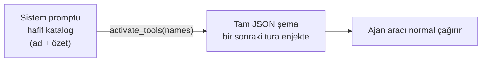

# 19 — Lazy Tool Loading (Tasarım + Uygulama)

> Durum: **UYGULANDI** (2026-06-18) — 3 fazın tamamı. Skill sisteminin
> "progressive disclosure" yaklaşımı built-in + MCP araçlarına taşındı.
> Tamamlayıcı: [44-CODE-EXECUTION-MCP](44-CODE-EXECUTION-MCP.md) — MCP araçlarını
> şema yerine üretilmiş Python binding'leri olarak sunan `run_code` kod-modu
> (occupancy ekseni; tier sistemi deferral eksenini çözer, ikisi birlikte çalışır).

## Uygulanan davranış (özet)

- `ToolDef.Lazy` alanı; `Registry` lazy seti tutar. **Self-management suite +
  tüm MCP araçları lazy.**
- **Eager çekirdek küçültmesi (2026-06-19):** her zaman kurulan ama turların
  azında kullanılan 8 araç da lazy'ye indirildi (`toolsetup.go`, açık `MarkLazy`):
  `read_config`/`write_config`/`list_config` (workspace prompt/instruction
  editing — nadir), `secret_list`/`secret_get` (yalnız kimlik-bilgili görevler),
  `list_sessions` (context bloğu zaten push'lanıyor), `memory_recall` (recall
  `ContextBlock` ile otomatik enjekte), `WebFetch` (çoğu tur dış istek yapmıyor).
  `MarkLazy` builtins'te olmayan ada **no-op** olduğundan gate'li araçlar (vault/
  config kapalı) için ek koruma gerekmez.
- **Kalan eager çekirdek:** `Read`/`Write`/`Edit`/`LS`/
  `Glob`/`Grep`, `Bash` (gate'li), `todo_write`, `ask_user`,
  `request_confirmation`, `schedule_wake`, `create_artifact`/`update_artifact`,
  `use_skill` + 3 meta-araç. (Etkileşim primitifleri ve artifact çıktı yolu,
  aktive turu beklememesi için eager bırakıldı.) Not (2026-06-22): çekirdek araçlar
  claude-cli ile aynı isimleri taşır; `get_current_time` kaldırıldı (tarih artık
  sistem prompt'unun dinamik bloğunda).
- **claude-cli yolu (CLI-3, `fc7d30e`):** CLI'de native `activate_tools` döngüsü
  yok; lazy built-in'ler Interaction MCP üzerinden **bridge** edilir
  (`Registry.BridgeableDefs` → tüm lazy built-in'ler, MCP hariç). Bu yüzden eager→
  lazy indirme CLI ajanlarında **erişim kaybına yol açmaz** — yeni lazy araçlar
  otomatik köprülenir. Not: CLI yolunda bridge, lazy araçların **tam şemasını** her
  koşuda ilan eder (native yol yalnız ad+özet katalog satırı taşır).
- **Bridge alt-küme sınırı (2026-06-19):** CLI tam şema ilan ettiği için köprü
  yüzeyi `tools.bridgeExcluded` ile budanır — **CLI'de native karşılığı olan**
  (`WebFetch` → CLI'nin kendi WebFetch'i) ve **native-loop context'i gereken** (`call_agent`,
  dispatch `DelegationFrom(ctx)` ister — bridge ctx'inde yok) araçlar köprülenmez.
  Native ajanlar etkilenmez; bunlara `activate_tools` ile erişir. Test:
  `TestBridgeableDefsExcludesCLINative`.
- **Rol-bazlı eager (2026-06-19):** `Agent.PermissionMode == "read-only"` ise
  yazma araçları (`Write`/`Edit`; `write_config` zaten lazy) eager'dan
  düşürülür — read-only ajanda yazma zaten onaylanmaz, şemayı her tur göndermek
  israf. "ask"/"auto" ajanlar bunları eager tutar. Test:
  `TestReadOnlyAgentDemotesWriteTools`.
- **call_agent (2026-06-19, tarihsel):** senkron delegasyon tool'u o tarihte lazy
  hale getirilmişti — ancak A2 refactor'u (2026-06-19) kapsamında `run_subagent`'a
  birleştirildi ve `call_agent` aracı **kaldırıldı**. `run_subagent` delegation
  gate'li ve eagerly yüklenir.
- **input_examples (2026-06-19):** `ToolDef.Examples []json.RawMessage` — şemanın
  ifade edemediği kullanım konvansiyonlarını (tarih/cron formatı, ID deseni, hangi
  opsiyonel alanın birlikte geldiği) gösteren somut örnek çağrılar. Anthropic
  "advanced tool use" `input_examples` alanının muadili. **Yalnız tam şemaya**
  katlanır (`registry.go foldExamples` → InputSchema'ya JSON Schema `examples`
  dizisi olarak); hafif lazy katalog (yalnız ad+özet) **etkilenmez** → lazy araçta
  örnek yalnız aktive sonrası, yani kullanılacağı anda token harcar. Pilot:
  `create_schedule` (cron) + `create_flow` (graf JSON string'i) — ikisi de lazy,
  yani eager bütçeye sıfır etki. Hatalı-çağrı + retry turunu önlediğinden genelde
  **net token kazandırır**. Test: `TestExamplesFoldIntoSchemaNotCatalog`,
  `TestPilotToolExamplesAreValid`.
  - **2. dalga pilotlar (2026-06-19):** `create_hook` (matcher araç-adı glob'u +
    command'in stdin/stdout JSON sözleşmesi), `update_settings` (`patch`
    `additionalProperties:true` → şema anahtarları tamamen opak; örnek doğru
    anahtarları gösterir), `create_mcp_server` (stdio vs sse/http; `args`/`env`
    escaped JSON string). Not: "permission-pattern" aday değil — ajan-yüzlü tool
    girdisi değil, kullanıcı onay katmanı (`permpattern.go`).
  - **3. dalga — edit/create araçları (2026-06-19):** `update_flow` (graph string +
    kısmi güncelleme), `update_schedule` (cron + kısmi), `update_task`
    (`dependencies` escaped JSON array + `flowId:""`=unlink + kısmi), `create_agent`
    (provider/model eşleşmesi — claude-cli modelsiz, anthropic model ister).
    **Silme araçları aday değil** (girdi yalnız
    `{id}` — belirsizlik yok); `move_task` da değil (`boardState` zaten `enum`).
    Edit aracında örnek ana faydası **kısmi-güncelleme konvansiyonunu** öğretmek
    (id + yalnız değişen alan; `""`=temizle).
- **Eager şema sadeleştirme (2026-07-01):** araç JSON şemaları, claude-cli/API
  context'inin en ağır segmenti (~%56). Bilinçli **eager** bırakılan üç araçta
  davranışsal nudge'ı bozmadan şema maliyeti düşürüldü (Strateji A — sıfır davranış
  riski, lazy yapılmadı):
  - `run_subagent` (`subagent.go`): açıklama ~yarıya indi, field açıklamaları
    kısaltıldı, `Examples` dizisi **3 → 1** (en öğretici objective/output_format/
    boundaries örneği tutuldu). Örnekler `foldExamples` ile **her tur** eager şemaya
    katlandığından bu en büyük kalemdi.
  - `create_artifact` (`builtin_artifact.go`): açıklama kısaltıldı (image/binary
    yönergesi + base64-etmeyin uyarısı korundu).
  - `core_memory_append`/`core_memory_replace` (`builtin_memory_core.go`): iki
    araçta tekrar eden core-memory tanımı tek `coreMemoryDesc` const'una çıkarıldı;
    her açıklama bu ortak cümleye + role özgü tek satıra indi. Core memory araçları
    **lazy yapılmadı** (bağlam-basıncı anında gerekir → eager kalmalı).
  - Tahmini kazanç: ~1.3 KB ham metin / her eager tur ≈ **~300-350 token**.
    Build temiz, `go test ./internal/tools/...` 152 geçti; şema/örnek JSON
    geçerliliği doğrulandı. **Öneri (Strateji B, uygulanmadı):** `run_subagent` +
    `create_artifact`'ı `MarkNameOnly` ile lazy yapıp sistem prompt'a tek satır
    nudge eklemek daha agresif kazanç verir; ancak nudge'ın prompt'a doğru
    yerleştirilmesi gerektiğinden ayrı bir görevde değerlendirilmeli.
- Sistem promptuna **"Available Tools (load on demand)"** bloğu eklenir
  (`Runtime.LazyToolsCatalogBlock` → `renderLazyToolCatalog`), yalnızca ad+özet.
- **NameOnly katmanı (2026-06-26):** workspace Tools ekranındaki "NameOnly" çipi
  (eski "Gizle"; veri modeli `HiddenTools` aynı kaldı) artık aracı `MarkLazy`
  yerine **`MarkNameOnly`** ile işaretler. NameOnly araç katalog bloğunda **yalnız
  adıyla** listelenir (özet bastırılır) — Claude Code'un "deferred tool"
  mekaniğinin muadili: model adı görür, ne yaptığını `tool_search` ile keşfeder,
  şemayı `activate_tools` ile çeker. `nameOnly ⊆ lazy`, `hidden`'dan ayrık
  (`hidden` tamamen düşürülür; `nameOnly` listede kalır). Render: `VisibleLazyCatalog`
  NameOnly araçların `Description`'ını boşaltır, `renderLazyToolCatalog` boş özetli
  satırı `- \`ad\`` (özetsiz) basar (`writeLazyToolLine`). `Unlazy` ("Göster")
  `nameOnly` işaretini de temizler. Native yolda token kazandırır; **claude-cli
  yolunda NameOnly tek başına etkisiz** (bridge tam şema ilan eder) — ama bu artık
  aşağıdaki **iki-tier köprü** ile çözüldü: lazy/NameOnly araçlar `swarmgo_extended`
  sunucusuna gidip CLI'ın kendi ToolSearch deferral'ına tabi olur.
  Test: `TestMarkNameOnlyKeepsNameDropsSummary`.
- **claude-cli 2.1.x+ iki-tier köprü (`alwaysLoad` + `ENABLE_TOOL_SEARCH`, 2026-06-26):**
  CLI'da eager/lazy ayrımı artık gerçekten uygulanıyor. `writeCLIMCPConfig` Interaction
  MCP'yi **iki sunucu anahtarına** böler (aynı in-process endpoint'e farklı path
  son-ek'leriyle bağlanır):
  - **`swarmgo_interaction`** (CORE, `alwaysLoad: true`) → eager tier
    (`coreInteractionTools`: `Bash`, `ask_user`, `request_confirmation`, `todo_write`,
    `create_artifact`/`update_artifact`, `use_skill`, `skill_search`, `run_subagent`,
    `core_memory_replace`/`append`, `permission_prompt`). CLI tool-search'ten **muaf**
    → ilk turda `ToolSearch` gerekmeden hazır. Eski anahtar adı korundu → mevcut
    namespaced referanslar (`use_skill`, `core_memory`, trace stripping) bozulmaz.
  - **`swarmgo_extended`** (EXTENDED) → self-management suite + NameOnly oturum
    araçları (`notify`, `focus_view`, `set_session_goal`/`complete_goal`,
    `set_session_title`/`set_working_dir`/`archive_session`, `schedule_wake`,
    `spawn_session`, `conversation_search`, `read_session_debug`, …). `alwaysLoad`
    yok → `ENABLE_TOOL_SEARCH=auto` (CLI process env'inde) ile %10 eşiğini aşınca
    CLI ToolSearch ile **lazy** keşfeder.
  - Tier sınıflandırması tek kaynak: `interactionTier(name)` / `splitInteractionTiers`
    (allowlist) + `Backend.Tools(token, tier)` (advertise). Bridged self-management
    def'leri **daima extended**. Endpoint: `interaction.tierFromPath` path son-ek'ini
    (`/core`,`/extended`) okur; `api/server.go` subtree mount (`/mcp/interaction/`).
    Lazy katalog extended built-in'leri `extendedToolPrefix` ile namespace'ler;
    `trace.go` her iki prefix'i de soyar.
  - **Kapsam:** yalnız claude-cli 2.1.x ve üzeri (kurulu: 2.1.186). Sürüm guard'ı yok;
    2.1.x öncesinde `alwaysLoad`/`ENABLE_TOOL_SEARCH` sessiz yok sayılır.
  - Test: `TestWriteCLIMCPConfigTwoTierInteraction` (config çıktısı + alwaysLoad +
    tier-namespaced allowlist), `TestInteractionTierSplit` (tier partisyonu),
    `TestLazyCatalogCLIFormNamespacesNames` (extended prefix). Detay: `_Docs/11`.
- **Dış MCP araçları da NameOnly (2026-07-01):** `AttachMCP` artık her MCP aracını
  `lazy` **VE** `nameOnly` işaretliyor (önceden yalnız `lazy`). Sebep: katalog
  bloğunda dış MCP araçları (ör. `mcp__mcp-chrome__*`, ~30 araç) ≤ `lazyCatalogMCPListLimit`
  iken **tam açıklamalarıyla** dökülüyordu — `swarmgo_extended` (NameOnly) araçların
  yalnız-ad davranışıyla çelişiyor ve kullanıcı o aracı kullanmasa bile her tur
  ~800–1200 ölü token harcıyordu. Artık tutarlı: **hiçbir deferred araç katalogda
  tam açıklama taşımaz.** Mekanizma tekrar kullanıldı (yeni render yolu yok):
  `VisibleLazyCatalog` zaten `nameOnly` araçların `Description`'ını boşaltıyor →
  `writeLazyToolLine` `- \`mcp__server__tool\`` (özetsiz) basar. **İsimler listede
  kalır** → `tool_search`/`activate_tools` (native) ve `ToolSearch select:<name>`
  (CLI) ile araçlar hâlâ keşfedilip yüklenir. Server-başına özet satırı (>limit)
  Description kullanmaz → etkilenmez. `Unlazy` ("Göster") `nameOnly`'yi de temizler,
  yani kullanıcı bir MCP aracını eager'a yükseltebilir.
- **Sunucu-seviyesi görünürlük hızlı eylemi (2026-07-01, UI):** Harici MCP araçları artık
  varsayılan NameOnly olduğundan, kullanıcının bunu **manuel** override edebilmesi için
  `ToolsPanel` MCP sunucu yönetim kartına her sunucu satırında **"Tümü NameOnly" / "Tümü
  Göster"** butonları + `(eager/total tam şema)` sayacı eklendi. Per-tool toggle'ın
  (`ToolDetail`) ve çoklu-seçim toplu eyleminin (`SelectionBar`) sunucu-seviyesi muadili;
  yeni backend yok — mevcut `setWorkspaceToolsVisibility` (`HiddenTools`=MarkNameOnly /
  `ShownTools`=Unlazy→eager) tekrar kullanılır. `setServerVisibility` o sunucunun tüm MCP
  araç adlarını toplayıp tek PUT'ta uygular. Test-id: `mcp-server-nameonly-all` /
  `mcp-server-show-all`. `tsc --noEmit` temiz.
  > **Not (2026-07-01):** Bu 2-durumlu (`setWorkspaceToolsVisibility`) API + per-server
  > NameOnly/Göster butonları aşağıdaki **4-tier** modelle değiştirildi; test-id'ler
  > `mcp-server-visibility-all` (per-tier) oldu.
- **4-tier tek-seçim görünürlük modeli + self-manage master toggle kaldırıldı (2026-07-01):**
  Araç görünürlüğü artık **tek seçilebilir 4 tier**: `full` (Tam — tam şema/tur) ·
  `summary` (Özet — isim + kısa özet satırı) · `name-only` (İsim — yalnız isim) ·
  `hidden` (Gizli — katalogda hiç yok, `tool_search`'le bulunur). **Her araç**
  (built-in + MCP) tam olarak bir tier taşır; skill görünürlük mantığının araç muadili.
  - **Registry:** `tools.Visibility{Full,Summary,NameOnly,Hidden}` sabitleri +
    `SetVisibility(name,tier)` (karşılıklı-dışlayan işaretleri temizleyip birini kurar)
    + `VisibilityOf(name)`. Mekanizma zaten vardı (`lazy`/`nameOnly`/`hidden`) — yeni
    tier eklenmedi, yalnız tek-seçim API'ye sarıldı.
  - **Persistans:** `WorkspaceToolConfig.ToolVisibility map[string]string` (araç→tier).
    Eski iki liste (`HiddenTools`→name-only, `ShownTools`→full) yükleme sırasında map'e
    **migrate** edilir (`loadToolConfig`), yazımda temizlenir.
  - **Uygulama sırası:** kod varsayılanları (self-mgmt→hidden, curated→name-only,
    MCP→name-only) baz; sonra `AttachMCP`; **en son** `ToolVisibility` override'ları
    `SetVisibility` ile — override kazanır. Geçersiz tier API'de (`validVisibility`)
    reddedilir (sessiz yutma yok).
  - **Self-management daima açık:** `enableSelfManage` master toggle'ı (ayar UI +
    `toolsetup` gate) kaldırıldı; paket **daima kurulur**, varsayılan tier `hidden`
    (token davranışı aynı). **Tam sökme (2026-07-01):** `settings.EnableSelfManage`
    alanı (+ Snapshot/Patch/applyBool), `SWARMGO_ENABLE_SELFMANAGE` env seed'i,
    `Tunables.selfManage` + `Set/SelfManageEnabled` metodları ve tüm çağrı yerleri
    (`chat_stream`/`autonomous_interaction`/`mcp_interaction` artık spawn_session'ı
    koşulsuz ilan eder) **silindi**. `SelfManageEnabled` gate'i kalmadı.
  - **UI:** `ToolsPanel` per-tool **Tam/Özet/İsim/Gizli** segment kontrolü + tek
    `VisibilityBadge` (tier-renkli); toplu eylem + per-server hızlı eylem 4 tier'a
    genişledi. Eski `NameOnly/Self-mgmt` rozetleri + `Göster` düğmesi kalktı.
  - **CLI uyumu:** Native yol 4 tier'ı tam onurlandırır (ActiveDefs). CLI yolunda tier
    esas olarak render edilen katalog bloğu metnini etkiler; gerçek yükleme CLI'nin
    kendi ToolSearch/`alwaysLoad` mekanizmasıyladır. Bir built-in'i `full` yapmak
    native'de eager yapar; CLI'da eager olması için ayrıca core (`alwaysLoad`)
    tier'ında olması gerekir (`interactionTier` statik) — dış MCP araçlarında CLI'nin
    `ENABLE_TOOL_SEARCH` deferral'ı geçerli kalır. Yani CLI'da `full` = "en fazla ilan",
    "kesin eager" değil.
  - **UI'da araç bilgisi:** detay görünümü artık **örnek çağrıları** (`ToolDef.Examples`
    → workspace-tools API `examples`) ve çok-paragraflı açıklamaları (`whitespace-pre-wrap`,
    MCP "when to use" dahil) gösterir.
  - Test: `store_tools_test.go` (visibility round-trip + `TestWorkspaceToolConfig_LegacyMigration`).
    `go build ./...` + tüm ilgili testler yeşil, `tsc --noEmit` temiz.
- **Default NameOnly seti (2026-06-26):** `buildRegistry` artık küçük, kendini
  açıklayan ve turların azınlığında kullanılan bir grup built-in aracı **kod
  varsayılanı** olarak `MarkNameOnly` ile işaretler (eski `MarkLazy` bloğunun
  yerine geçti). Bu, her workspace'e (mevcut + yeni) otomatik uygulanır — ayrıca
  per-workspace `HiddenTools` config'i yazmaya gerek yok. Set:
  - **Oturum yaşam döngüsü & navigasyon** (önceden eager): `set_session_goal`,
    `complete_goal`, `set_session_title`, `set_working_dir`, `archive_session`,
    `notify`, `focus_view`, `schedule_wake`
  - **Çapraz-oturum & öz-tanılama** (önceden eager): `list_sessions`,
    `conversation_search`, `read_session_debug`
  - **Workspace config düzenleme** (önceden lazy+özet): `read_config`,
    `write_config`, `list_config`
  - **Secret kasası okuma** (önceden lazy+özet): `secret_list`, `secret_get`
  - **Web + bellek** (önceden lazy+özet): `WebFetch`, `memory_recall`
  - **Doğrulama araçları (2026-06-29)**: `skill_validate`, `config_validate`,
    `mermaid_validate` — salt-okuma, yalnız authoring/diyagram anlarında kullanılır.
    Native builtin + NameOnly → lazy olduğundan claude-cli'da `swarmgo_extended`
    köprüsünden ToolSearch ile gelir (BridgeableDefs otomatik kapsar).

  **Eager kalanlar** (davranışsal dürtü veya yüksek frekans): `todo_write`,
  `ask_user`, `request_confirmation`, `create_artifact`/`update_artifact`,
  `core_memory_*`, `use_skill`/`skill_search`, `run_subagent`,
  `Read`/`Write`/`Edit`/`LS`/`Glob`/`Grep`, `Bash`. Self-management ailesi
  `MarkHidden` kalır (katalogdan tamamen düşer — name-only'den daha agresif).
  Etki (ölçüm, WS5/AGT1): eager 30→20 araç, eager şema **~5931→3857 token**
  (≈ turn/agent başına **~2074 token** tasarruf, cache prefix'inde). 10 araç
  şeması her turdan tamamen kalktı; 8 araç özet satırını kaybetti.
- Üç eager meta-araç: **`activate_tools`** (şema yükle), **`deactivate_tools`**,
  **`tool_search`** (katalogda anahtar kelime arama). `internal/tools/builtin_activate.go`.
- Per-turn **aktif set** (`internal/tools/activetools.go`, context üzerinden
  `buildRegistry`'ye taşınır). Tool loop her iterasyonda
  `reg.ActiveDefs(filter, active.Snapshot())` ile gönderilen şemayı yeniden
  hesaplar → aktive edilen aracın şeması bir sonraki adımda gelir.
- **Faz 3 prune**: `ActiveTools.Prune` — `activeToolMaxIdle=3` iterasyon
  kullanılmayan aktif araç düşürülür (uzun turda şema yükünü düşük tutar).
- Bağlam önizlemesi (`agent_context.go`): gönderilen araçlar = eager
  (`ShippedToolCatalog`); lazy'ler sistem bloğunda sayılır → dürüst token ayrımı.
- Doğrulama: `/api/agents/{id}/context` — MCP araçları lazy blokta, eager listede
  yalnızca çekirdek + meta-araçlar.

## Sorun

Bugün `buildRegistry` her ajan için **bütün** araçları (built-in + etkin MCP
sunucularının tüm araçları) peşinen kayıtlar ve hepsinin tam JSON şeması her
turda sistem promptuna girer. Self-management açıkken katalog ~2 katına çıkıyor,
MCP sunucuları (ör. mcp-gateway yüzlerce araç) eklenince şema token maliyeti
hızla şişiyor. Ajan çoğu turda bu araçların küçük bir kısmını kullanıyor.

Skill sisteminde bunu zaten çözdük: katalogta yalnızca **özet** durur, tam gövde
`use_skill` ile talep üzerine yüklenir. Aynı deseni araçlara uygulayalım.

> Simetri (SK-2, 2026-06-23): skill tarafı da araçlardaki `tool_search`'ün ikizini
> kazandı — **`skill_search`**. `paths:` taşıyan **koşullu skill** katalogda hiç
> görünmez (özeti bile prompt'a girmez), gerektiğinde `skill_search` ile bulunup
> `use_skill` ile yüklenir. Böylece yüzlerce skill içe aktarılsa bile prompt şişmez.

> **Deferred-not tekilleştirme (2026-07-01):** "DEFERRED / `ToolSearch select:` ile
> yükle / unloaded ad → `No such tool available`" açıklaması hem Skills hem Tools
> bloğunda tekrar ediyordu. Mekanizmanın **tam** açıklaması artık yalnız
> `renderLazyToolCatalog` CLI intro'sunda (`toolsetup.go`); skills tarafı (`store.go`
> `renderCatalog` `deferNote`) tek kısa cümle + "Available Tools notuna bak" referansı.
> Native (eager) varyantta not yok — değişmedi.

> **UI tier chip'leri (2026-06-26):** Workspace Tools ekranı artık üç tier'ı ayrı
> gösterir: **eager** (chip yok), **NameOnly** (amber — lazy, isimle listelenir),
> **Self-mgmt** (gri — hidden tier, katalogda ismi bile yok, skill pointer'a katlanır).
> Backend `WorkspaceToolCatalogWithState` artık `(defs, lazy, hidden)` döndürür;
> `workspaceTool.selfManaged = hidden[name]` (registry `IsHidden`). UI'da `SelfMgmtBadge`.
> "Göster" toggle'ı self-mgmt aracı için onu eager'a çıkarır (ShownTools).

> **Tier rafine (2026-06-26):** admin/nadir araçlar NameOnly'den **hidden**
> self-management grubuna taşındı: `read_config`/`write_config`/`list_config` (ajanın
> kendi promptunu düzenler) ve `secret_list`/`secret_get` (kasa okuma). Gerekçe: her
> turda enumerate edilmeye değmeyecek kadar nadir + yazma kardeşleri
> (`secret_set`/`secret_delete`) zaten hidden — okuma+yazma artık aynı tier'da.
> Pointer metnine "your own prompts/config" eklendi. **Kural:** NameOnly = "var
> olduğunu bil, ara sıra kullan"; hidden = "toplu/nadir admin, per-turn ödeme yok".
> Self-management ailesinin tamamını (46) name-only enumerate ETMEME kararı: patlamalı/
> nadir admin; CLI'de satır başına ~15 token (namespaced) → ~600 token/tur düşük getiri;
> kategori-pointer + `swarmgo-self-management` skill + tool_search zaten keşfi sağlıyor.

> **CLI-uyumlu Tools kataloğu (2026-06-26):** "# Available Tools (load on demand)"
> bloğu artık **claude-cli için doğru namespaced adları** basıyor — skills bloğunun
> (`CatalogBlockForAgentTool`) zaten yaptığını araç tarafına da taşıdık. claude-cli
> tüm bu araçları MCP aracı olarak görür: built-in'ler `mcp__swarmgo_interaction__<ad>`,
> MCP araçları `mcp__<server>__<tool>` olarak listelenir; yönerge native
> `activate_tools` yerine **`ToolSearch`** (CLI'nin kendi deferred-tool mekanizması);
> CLI-native built-in'ler (WebFetch) CLI formundan düşürülür. Native (anthropic/minimax)
> form değişmedi (bare ad + `activate_tools`). `LazyToolsCatalogBlock` ajanın
> `provider`'ına göre dallanır; `catalogDisplayName` ad eşlemesini yapar. Önceden blok
> tamamen native biçimdeydi (bare adlar + native yönerge) — bir claude-cli ajanı için
> yanıltıcıydı; Default-NameOnly değişikliği 10 built-in'i daha bu bloğa ekleyince fark
> belirginleşti. Test: `TestLazyCatalogCLIFormNamespacesNames`.

> **Skill NameOnly (2026-06-26):** araçlardaki NameOnly katmanının skill muadili.
> Frontmatter `name_only: true` ile işaretlenen skill "# Available Skills" bloğunda
> **yalnız slug** olarak listelenir (`- \`slug\``) — açıklama+when bastırılır. Skill
> **listede kalır** (model varlığını görür, ne yaptığını `skill_search` ile keşfeder,
> `use_skill` ile yükler); bu, "tam özet" ile "tamamen düşür" (`auto_summary:false` /
> `paths`) arasındaki orta katman. **Default KAPALI, skill-başına opt-in** —
> araçlardaki gibi küratörlü bir default-açık set YOK, çünkü skill'lerde açıklama ana
> tetikleme sinyalidir; toptan kaldırmak keşfi zayıflatır. Render: `renderCatalog`
> NameOnly skill'de slug-only satır basar; footer notu slug-only girişler için
> `skill_search`'e yönlendirir. Toggle: `Store.SetNameOnly` + `PUT /api/skills/{slug}/name-only`,
> UI'da SkillsPanel "NameOnly" çipi/butonu. `isNameOnly`/`setFrontmatterNameOnly`
> `auto_summary` desenini yansıtır. Etki (ölçüm, WS5): tek bir verbose skill
> (`swarmgo-autonomous-ops`) NameOnly olunca satırı **839→26 karakter**, blok
> **3376→2563** (~813 karakter ≈ ~200 token). Test: `TestNameOnlySkillRendersSlugOnly`.

> **Skill 4-tier görünürlük (tek seçici, 2026-07-01):** skiller artık araçlarla
> **birebir aynı** 4-tier modeli taşır: `full` (Tam — slug + açıklama + when) ·
> `summary` (Özet — slug + açıklama, when bastırılır) · `name-only` (İsim — yalnız
> slug) · `hidden` (Gizli — katalogdan tamamen düşer, `skill_search` ile bulunur).
> Önceden yalnız 3 durum vardı (full / name-only / `auto_summary:false`≈hidden);
> eksik olan **summary** tier'ı eklendi. Türetilmiş `Skill.Visibility` alanı
> (`skillVisibility()` — flag'lerden hesaplanır, araçlardaki `VisibilityOf`'un
> muadili) tek okunan/yazılan değerdir; `Store.SetVisibility(slug, tier)` üç
> frontmatter flag'ini (`auto_summary`/`name_only`/`summary_only`) **tek yazımda**
> tutarlı kurar. Yeni: `SummaryOnly` alanı + `isSummaryOnly` + `setFrontmatterSummaryOnly`
> (`name_only` desenini yansıtır); `renderCatalog` summary'de when-to-use'u atlar.
> API: `PUT /api/skills/{slug}/visibility` (`{visibility}`; geçersiz tier 400).
> UI: SkillsPanel'de eski Özet/NameOnly toggle çiftinin yerine `SkillVisibilitySelector`
> — araçların `VISIBILITY_TIERS` metadata'sını (Tam/Özet/İsim/Gizli renk+ipucu)
> paylaşan 4'lü segmented kontrol. Eski `SetAutoSummary`/`SetNameOnly` + endpoint'leri
> geriye-uyum için korunur.

## Hedef

Ajana başlangıçta sadece **hafif bir araç kataloğu** (ad + tek satır açıklama)
ver; tam JSON şemalar talep üzerine "etkinleştirilsin". Bu, bu ortamdaki
`ToolSearch` / deferred-tools mekanizmasının birebir muadili.

## Tasarım

### 1. Araç meta katmanı
Her `Tool`/`ToolDef` için zaten `Name` + `Description` var. Eklenecek:
- `Lazy bool` — araç "her zaman açık" mı yoksa "lazy" mı. (`providers.ToolDef.Lazy`, JSON serileşmez: `json:"-"`)
- Çekirdek, sık kullanılan araçlar (Read, Write, memory_recall,
  todo_write…) **eager** kalır — şemaları hep yüklü.
- Geri kalan built-in'ler (self-management suite) ve **tüm MCP araçları** **lazy**
  olur.

### 2. Hafif katalog bloğu
`renderToolCatalog(lazyTools)` → sistem promptuna `# Available Tools (load on
demand)` bloğu: her satır `ad — özet`. Skill kataloğunun (`renderCatalog`) ikizi.

### 3. `activate_tools` meta aracı
Yeni built-in (eager): `activate_tools(names: []string)`.
- Verilen araç adlarının tam `ToolDef`'lerini o oturumun "aktif şema" setine ekler.
- Dönüşte kısa onay verir ("3 tool activated: …").
- Bir sonraki tur isteğinde bu araçların tam şeması provider'a gönderilir.
- Opsiyonel `deactivate_tools` ile geri çıkarılır (uzun oturumda şişmeyi tutmak için).

### 4. Oturum-kapsamlı aktif set
Aktif edilen araçlar **oturum/tur durumu** olarak tutulur (ör. worker veya turn
context üzerinde `activeTools map[string]bool`). `composeTurnRequest`/registry
`Defs()` çağrısı bu seti dikkate alır:
- gönderilecek şemalar = eager tools ∪ activeTools.
- Ajanın allowlist'i ve workspace denylist'i yine üstte uygulanır.

### 5. Eşleştirme / arama (opsiyonel, faz 2)
`ToolSearch` benzeri bir `tool_search(query)` — anahtar kelimeyle lazy katalogda
arama. Küçük kataloglarda gerekmez; MCP-ağır workspace'lerde değerli.

## Dosya dokunuşları (tahmini)

| Dosya | Değişiklik |
|---|---|
| `internal/providers/tooldef.go` | `ToolDef`'e `Lazy bool` (veya tier) alanı |
| `internal/tools/registry.go` | `Defs()` lazy filtre + `LazyCatalog()` üretimi |
| `internal/tools/builtin_activate.go` (yeni) | `activate_tools` / `deactivate_tools` |
| `internal/agent/toolsetup.go` | lazy işaretleme; MCP araçlarını lazy yap |
| `internal/agent/activetools_ctx.go` + `worker.go` | aktif-set context bağlantısı + `Defs()` filtresine bağla |
| `internal/api/agent_context.go` | önizlemede lazy katalog + token ayrımı |
| `_Docs/17-TOKEN-OPTIMIZASYON.md` | çapraz bağlantı |

## Riskler / kararlar

- **Çift tur gecikmesi:** ajan aracı kullanmadan önce bir tur `activate_tools`
  harcar. Çözüm: sık beraber kullanılan araçları gruplayıp tek çağrıda aktive
  etmeye teşvik eden katalog metni; çekirdek araçları eager bırakmak.
- **Eager/lazy sınırı** dikkatli seçilmeli — yanlış sınıflama ya token kazancını
  düşürür ya da gereksiz tur ekler. İlk sürümde: tüm MCP + self-management lazy,
  gerisi eager.
- **Geriye dönük uyum:** `Lazy` default `false` → işaretlenmeyen her araç eager
  kalır, davranış değişmez.

## Aşamalandırma

1. **Faz 1** — `Lazy` alanı + lazy katalog + `activate_tools` + aktif-set. MCP
   araçlarını lazy yap. (token kazancının çoğu burada)
2. **Faz 2** — `deactivate_tools` + `tool_search(query)` arama.
3. **Faz 3** — otomatik kısma: uzun oturumda kullanılmayan aktif araçları düşürme.

## İlişki

Bu plan, skill `subskills` (progressive disclosure) deseninin araç tarafındaki
karşılığıdır; bkz. `05-ILERLEME.md` (Skill sistemi) ve `17-TOKEN-OPTIMIZASYON.md`.

## POC — Hidden tier'i claude-cli köprüsünden çıkarma (2026-07-01)

**Sorun.** Native yolda 4 görünürlük tier'i (full/summary/name-only/hidden) ayrı
render edilir ve hidden bir araç tur-içinde `activate_tools` ile yüklenebilir.
claude-cli köprüsünde bu granülarite erir: MCP üzerinde bir aracın çağrılabilir
olması için **tam şema** `tools/list`'te bulunmalı, ve CLI'ın `--allowedTools`
seti süreç başında sabitlenir → tur-içi "henüz ilan edilmemiş aracı aktive et"
adımı yok. Bu yüzden `BridgeableDefs` tüm lazy built-in'leri (summary+name-only+
hidden) tam şemayla köprüler ve ertelemeyi CLI'ın kendi `ENABLE_TOOL_SEARCH=auto`'suna
bırakır.

**POC.** Hidden tier (self-management suite, onlarca araç) CLI'ya **hiç
köprülenmezse** o şemalar o tur CLI sürecine hiç gitmez. Araçlar tur-içi
çağrılamaz; "aktive" muadili **bir sonraki tur** yeniden-allowlist olur (model/
kullanıcı isteyince SwarmGo yeniden ilan eder).

**Kod (izole, geri-alınır):**
- `internal/tools/bridge_filter.go` — `BridgeableDefsFiltered(allow, skipHidden)`
  (+ `HiddenBridgeableCount` ölçüm helper'ı). `BridgeableDefs` artık buna
  `skipHidden=false` ile delege eder → davranış değişmez.
- `internal/agent/clibridge_tunable.go` + `Tunables.cliBridgeSkipHidden` alanı —
  `SetCLIBridgeSkipHidden`/`CLIBridgeSkipHidden` accessor'ları (**default true**).
- `internal/agent/runtime.go` `BridgeTools` — gate'i okur, `skipHidden` iken
  atlanan hidden araç sayısını Logs'a yazar (ölçüm).
- `internal/app/app.go` — boot'ta `SWARMGO_CLI_BRIDGE_SKIP_HIDDEN` env'iyle seed.

**Default:** **AÇIK** (2026-07-01, `NewTunables`) — hidden araçlar CLI'ya
köprülenmez. `SWARMGO_CLI_BRIDGE_SKIP_HIDDEN` env'i iki yönlü override:
`0/false/off` → kapatır (eski davranış: hidden köprülenir), `1/true/on` → açar.
Test: `TestBridgeableDefsFilteredSkipsHidden`.

> **Davranış etkisi:** açıkken bir claude-cli ajanı self-management araçlarını
> **tur-içinde çağıramaz**; erişim bir sonraki tur yeniden-allowlist ile gelir.
> Native yol etkilenmez (hidden tier orada `activate_tools` ile tur-içi yüklenir).

**Ölçülecek:** kapalı vs açık — CLI'ya giden şema baytı / prompt token farkı ve
self-management araçlarına erişimin tur-ötesine kaymasının ajan davranışına etkisi.
