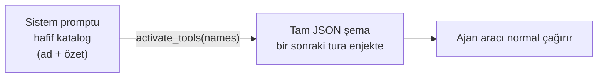

# 19 — Lazy Tool Loading (Tasarım + Uygulama)

> Durum: **UYGULANDI** (2026-06-18) — 3 fazın tamamı. Skill sisteminin
> "progressive disclosure" yaklaşımı built-in + MCP araçlarına taşındı.
> Tamamlayıcı: [44-CODE-EXECUTION-MCP](44-CODE-EXECUTION-MCP.md) — MCP araçlarını
> şema yerine üretilmiş Python binding'leri olarak sunan `run_code` kod-modu
> (occupancy ekseni; tier sistemi deferral eksenini çözer, ikisi birlikte çalışır).

## Uygulanan davranış (özet)

- `ToolDef.Lazy` alanı; `Registry` lazy seti tutar. **Self-management suite +
  tüm MCP araçları lazy.**
- **Eager çekirdek küçültmesi (2026-06-19):** her zaman kurulan ama turların
  azında kullanılan 8 araç da lazy'ye indirildi (`toolsetup.go`, açık `MarkLazy`):
  `read_config`/`write_config`/`list_config` (workspace prompt/instruction
  editing — nadir), `secret_list`/`secret_get` (yalnız kimlik-bilgili görevler),
  `list_sessions` (context bloğu zaten push'lanıyor), `WebFetch` (çoğu tur dış istek yapmıyor).
  `MarkLazy` builtins'te olmayan ada **no-op** olduğundan gate'li araçlar (vault/
  config kapalı) için ek koruma gerekmez.
- **Kalan eager çekirdek:** `Read`/`Write`/`Edit`/`LS`/
  `Glob`/`Grep`, `Bash` (gate'li), `todo_write`, `ask_user`,
  `request_confirmation`, `schedule_wake`, `create_artifact`/`update_artifact`,
  `use_skill` + 3 meta-araç. (Etkileşim primitifleri ve artifact çıktı yolu,
  aktive turu beklememesi için eager bırakıldı.) Not (2026-06-22): çekirdek araçlar
  claude-cli ile aynı isimleri taşır; `get_current_time` kaldırıldı (tarih artık
  sistem prompt'unun dinamik bloğunda).
- **claude-cli yolu (CLI-3, `fc7d30e`):** CLI'de native `activate_tools` döngüsü
  yok; lazy built-in'ler Interaction MCP üzerinden **bridge** edilir
  (`Registry.BridgeableDefs` → tüm lazy built-in'ler, MCP hariç). Bu yüzden eager→
  lazy indirme CLI ajanlarında **erişim kaybına yol açmaz** — yeni lazy araçlar
  otomatik köprülenir. Not: CLI yolunda bridge, lazy araçların **tam şemasını** her
  koşuda ilan eder (native yol yalnız ad+özet katalog satırı taşır).
- **Bridge alt-küme sınırı (2026-06-19):** CLI tam şema ilan ettiği için köprü
  yüzeyi `tools.bridgeExcluded` ile budanır — **CLI'de native karşılığı olan**
  (`WebFetch` → CLI'nin kendi WebFetch'i) ve **native-loop context'i gereken** (`call_agent`,
  dispatch `DelegationFrom(ctx)` ister — bridge ctx'inde yok) araçlar köprülenmez.
  Native ajanlar etkilenmez; bunlara `activate_tools` ile erişir. Test:
  `TestBridgeableDefsExcludesCLINative`.
- **Rol-bazlı eager (2026-06-19):** `Agent.PermissionMode == "read-only"` ise
  yazma araçları (`Write`/`Edit`; `write_config` zaten lazy) eager'dan
  düşürülür — read-only ajanda yazma zaten onaylanmaz, şemayı her tur göndermek
  israf. "ask"/"auto" ajanlar bunları eager tutar. Test:
  `TestReadOnlyAgentDemotesWriteTools`.
- **call_agent (2026-06-19, tarihsel):** senkron delegasyon tool'u o tarihte lazy
  hale getirilmişti — ancak A2 refactor'u (2026-06-19) kapsamında `run_subagent`'a
  birleştirildi ve `call_agent` aracı **kaldırıldı**. `run_subagent` delegation
  gate'li ve eagerly yüklenir.
- **input_examples (2026-06-19):** `ToolDef.Examples []json.RawMessage` — şemanın
  ifade edemediği kullanım konvansiyonlarını (tarih/cron formatı, ID deseni, hangi
  opsiyonel alanın birlikte geldiği) gösteren somut örnek çağrılar. Anthropic
  "advanced tool use" `input_examples` alanının muadili. **Yalnız tam şemaya**
  katlanır (`registry.go foldExamples` → InputSchema'ya JSON Schema `examples`
  dizisi olarak); hafif lazy katalog (yalnız ad+özet) **etkilenmez** → lazy araçta
  örnek yalnız aktive sonrası, yani kullanılacağı anda token harcar. Pilot:
  `create_schedule` (cron) + `create_flow` (graf JSON string'i) — ikisi de lazy,
  yani eager bütçeye sıfır etki. Hatalı-çağrı + retry turunu önlediğinden genelde
  **net token kazandırır**. Test: `TestExamplesFoldIntoSchemaNotCatalog`,
  `TestPilotToolExamplesAreValid`.
  - **2. dalga pilotlar (2026-06-19):** `create_hook` (matcher araç-adı glob'u +
    command'in stdin/stdout JSON sözleşmesi), `update_settings` (`patch`
    `additionalProperties:true` → şema anahtarları tamamen opak; örnek doğru
    anahtarları gösterir), `create_mcp_server` (stdio vs sse/http; `args`/`env`
    escaped JSON string). Not: "permission-pattern" aday değil — ajan-yüzlü tool
    girdisi değil, kullanıcı onay katmanı (`permpattern.go`).
  - **3. dalga — edit/create araçları (2026-06-19):** `update_flow` (graph string +
    kısmi güncelleme), `update_schedule` (cron + kısmi), `update_task`
    (`dependencies` escaped JSON array + `flowId:""`=unlink + kısmi), `create_agent`
    (provider/model eşleşmesi — claude-cli modelsiz, anthropic model ister).
    **Silme araçları aday değil** (girdi yalnız
    `{id}` — belirsizlik yok); `move_task` da değil (`boardState` zaten `enum`).
    Edit aracında örnek ana faydası **kısmi-güncelleme konvansiyonunu** öğretmek
    (id + yalnız değişen alan; `""`=temizle).
- **Eager şema sadeleştirme (2026-07-01):** araç JSON şemaları, claude-cli/API
  context'inin en ağır segmenti (~%56). Bilinçli **eager** bırakılan üç araçta
  davranışsal nudge'ı bozmadan şema maliyeti düşürüldü (Strateji A — sıfır davranış
  riski, lazy yapılmadı):
  - `run_subagent` (`subagent.go`): açıklama ~yarıya indi, field açıklamaları
    kısaltıldı, `Examples` dizisi **3 → 1** (en öğretici objective/output_format/
    boundaries örneği tutuldu). Örnekler `foldExamples` ile **her tur** eager şemaya
    katlandığından bu en büyük kalemdi.
  - `create_artifact` (`builtin_artifact.go`): açıklama kısaltıldı (image/binary
    yönergesi + base64-etmeyin uyarısı korundu).
  - _(Core memory araçları — `core_memory_append`/`replace` — 2026-07-05'te memory alt sistemiyle birlikte KALDIRILDI.)_
  - Tahmini kazanç: ~1.3 KB ham metin / her eager tur ≈ **~300-350 token**.
    Build temiz, `go test ./internal/tools/...` 152 geçti; şema/örnek JSON
    geçerliliği doğrulandı. **Öneri (Strateji B, uygulanmadı):** `run_subagent` +
    `create_artifact`'ı `MarkNameOnly` ile lazy yapıp sistem prompt'a tek satır
    nudge eklemek daha agresif kazanç verir; ancak nudge'ın prompt'a doğru
    yerleştirilmesi gerektiğinden ayrı bir görevde değerlendirilmeli.
- Sistem promptuna **"Available Tools (load on demand)"** bloğu eklenir
  (`Runtime.LazyToolsCatalogBlock` → `renderLazyToolCatalog`), yalnızca ad+özet.
- **NameOnly katmanı (2026-06-26):** workspace Tools ekranındaki "NameOnly" çipi
  (eski "Gizle"; veri modeli `HiddenTools` aynı kaldı) artık aracı `MarkLazy`
  yerine **`MarkNameOnly`** ile işaretler. NameOnly araç katalog bloğunda **yalnız
  adıyla** listelenir (özet bastırılır) — Claude Code'un "deferred tool"
  mekaniğinin muadili: model adı görür, ne yaptığını `tool_search` ile keşfeder,
  şemayı `activate_tools` ile çeker. `nameOnly ⊆ lazy`, `hidden`'dan ayrık
  (`hidden` tamamen düşürülür; `nameOnly` listede kalır). Render: `VisibleLazyCatalog`
  NameOnly araçların `Description`'ını boşaltır, `renderLazyToolCatalog` boş özetli
  satırı `- \`ad\`` (özetsiz) basar (`writeLazyToolLine`). `Unlazy` ("Göster")
  `nameOnly` işaretini de temizler. Native yolda token kazandırır; **claude-cli
  yolunda NameOnly tek başına etkisiz** (bridge tam şema ilan eder) — ama bu artık
  aşağıdaki **iki-tier köprü** ile çözüldü: lazy/NameOnly araçlar `tionharness_extended`
  sunucusuna gidip CLI'ın kendi ToolSearch deferral'ına tabi olur.
  Test: `TestMarkNameOnlyKeepsNameDropsSummary`.
- **claude-cli 2.1.x+ iki-tier köprü (`alwaysLoad` + `ENABLE_TOOL_SEARCH`, 2026-06-26):**
  CLI'da eager/lazy ayrımı artık gerçekten uygulanıyor. `writeCLIMCPConfig` Interaction
  MCP'yi **iki sunucu anahtarına** böler (aynı in-process endpoint'e farklı path
  son-ek'leriyle bağlanır):
  - **`tionharness_interaction`** (CORE, `alwaysLoad: true`) → eager tier
    (`coreInteractionTools`: `Bash`, `ask_user`, `request_confirmation`, `todo_write`,
    `create_artifact`/`update_artifact`, `use_skill`, `skill_search`, `run_subagent`,
    `permission_prompt`). CLI tool-search'ten **muaf**
    → ilk turda `ToolSearch` gerekmeden hazır. Eski anahtar adı korundu → mevcut
    namespaced referanslar (`use_skill`, trace stripping) bozulmaz.
  - **`tionharness_extended`** (EXTENDED) → self-management suite + NameOnly oturum
    araçları (`notify`, `focus_view`, `set_session_goal`/`complete_goal`,
    `set_session_title`/`set_working_dir`/`archive_session`, `schedule_wake`,
    `spawn_session`, `conversation_search`, `read_session_debug`, …). `alwaysLoad`
    yok → `ENABLE_TOOL_SEARCH=auto` (CLI process env'inde) ile %10 eşiğini aşınca
    CLI ToolSearch ile **lazy** keşfeder.
  - Tier sınıflandırması tek kaynak: `interactionTier(name)` / `splitInteractionTiers`
    (allowlist) + `Backend.Tools(token, tier)` (advertise). Bridged self-management
    def'leri **daima extended**. Endpoint: `interaction.tierFromPath` path son-ek'ini
    (`/core`,`/extended`) okur; `api/server.go` subtree mount (`/mcp/interaction/`).
    Lazy katalog extended built-in'leri `extendedToolPrefix` ile namespace'ler;
    `trace.go` her iki prefix'i de soyar.
  - **Kapsam:** yalnız claude-cli 2.1.x ve üzeri (kurulu: 2.1.186). Sürüm guard'ı yok;
    2.1.x öncesinde `alwaysLoad`/`ENABLE_TOOL_SEARCH` sessiz yok sayılır.
  - Test: `TestWriteCLIMCPConfigTwoTierInteraction` (config çıktısı + alwaysLoad +
    tier-namespaced allowlist), `TestInteractionTierSplit` (tier partisyonu),
    `TestLazyCatalogCLIFormNamespacesNames` (extended prefix). Detay: `_Docs/11`.
- **Dış MCP araçları da NameOnly (2026-07-01):** `AttachMCP` artık her MCP aracını
  `lazy` **VE** `nameOnly` işaretliyor (önceden yalnız `lazy`). Sebep: katalog
  bloğunda dış MCP araçları (ör. `mcp__<server>__*`, ~30 araç) ≤ `lazyCatalogMCPListLimit`
  iken **tam açıklamalarıyla** dökülüyordu — `tionharness_extended` (NameOnly) araçların
  yalnız-ad davranışıyla çelişiyor ve kullanıcı o aracı kullanmasa bile her tur
  ~800–1200 ölü token harcıyordu. Artık tutarlı: **hiçbir deferred araç katalogda
  tam açıklama taşımaz.** Mekanizma tekrar kullanıldı (yeni render yolu yok):
  `VisibleLazyCatalog` zaten `nameOnly` araçların `Description`'ını boşaltıyor →
  `writeLazyToolLine` `- \`mcp__server__tool\`` (özetsiz) basar. **İsimler listede
  kalır** → `tool_search`/`activate_tools` (native) ve `ToolSearch select:<name>`
  (CLI) ile araçlar hâlâ keşfedilip yüklenir. Server-başına özet satırı (>limit)
  Description kullanmaz → etkilenmez. `Unlazy` ("Göster") `nameOnly`'yi de temizler,
  yani kullanıcı bir MCP aracını eager'a yükseltebilir.
- **Sunucu-seviyesi görünürlük hızlı eylemi (2026-07-01, UI):** Harici MCP araçları artık
  varsayılan NameOnly olduğundan, kullanıcının bunu **manuel** override edebilmesi için
  `ToolsPanel` MCP sunucu yönetim kartına her sunucu satırında **"Tümü NameOnly" / "Tümü
  Göster"** butonları + `(eager/total tam şema)` sayacı eklendi. Per-tool toggle'ın
  (`ToolDetail`) ve çoklu-seçim toplu eyleminin (`SelectionBar`) sunucu-seviyesi muadili;
  yeni backend yok — mevcut `setWorkspaceToolsVisibility` (`HiddenTools`=MarkNameOnly /
  `ShownTools`=Unlazy→eager) tekrar kullanılır. `setServerVisibility` o sunucunun tüm MCP
  araç adlarını toplayıp tek PUT'ta uygular. Test-id: `mcp-server-nameonly-all` /
  `mcp-server-show-all`. `tsc --noEmit` temiz.
  > **Not (2026-07-01):** Bu 2-durumlu (`setWorkspaceToolsVisibility`) API + per-server
  > NameOnly/Göster butonları aşağıdaki **4-tier** modelle değiştirildi; test-id'ler
  > `mcp-server-visibility-all` (per-tier) oldu.
- **4-tier tek-seçim görünürlük modeli + self-manage master toggle kaldırıldı (2026-07-01):**
  Araç görünürlüğü artık **tek seçilebilir 4 tier**: `full` (Tam — tam şema/tur) ·
  `summary` (Özet — isim + kısa özet satırı) · `name-only` (İsim — yalnız isim) ·
  `hidden` (Gizli — katalogda hiç yok, `tool_search`'le bulunur). **Her araç**
  (built-in + MCP) tam olarak bir tier taşır; skill görünürlük mantığının araç muadili.
  - **Registry:** `tools.Visibility{Full,Summary,NameOnly,Hidden}` sabitleri +
    `SetVisibility(name,tier)` (karşılıklı-dışlayan işaretleri temizleyip birini kurar)
    + `VisibilityOf(name)`. Mekanizma zaten vardı (`lazy`/`nameOnly`/`hidden`) — yeni
    tier eklenmedi, yalnız tek-seçim API'ye sarıldı.
  - **Persistans:** `WorkspaceToolConfig.ToolVisibility map[string]string` (araç→tier).
    Eski iki liste (`HiddenTools`→name-only, `ShownTools`→full) yükleme sırasında map'e
    **migrate** edilir (`loadToolConfig`), yazımda temizlenir.
  - **Uygulama sırası:** kod varsayılanları (self-mgmt→hidden, curated→name-only,
    MCP→name-only) baz; sonra `AttachMCP`; **en son** `ToolVisibility` override'ları
    `SetVisibility` ile — override kazanır. Geçersiz tier API'de (`validVisibility`)
    reddedilir (sessiz yutma yok).
  - **Self-management daima açık:** `enableSelfManage` master toggle'ı (ayar UI +
    `toolsetup` gate) kaldırıldı; paket **daima kurulur**, varsayılan tier `hidden`
    (token davranışı aynı). **Tam sökme (2026-07-01):** `settings.EnableSelfManage`
    alanı (+ Snapshot/Patch/applyBool), `TIONHARNESS_ENABLE_SELFMANAGE` env seed'i,
    `Tunables.selfManage` + `Set/SelfManageEnabled` metodları ve tüm çağrı yerleri
    (`chat_stream`/`autonomous_interaction`/`mcp_interaction` artık spawn_session'ı
    koşulsuz ilan eder) **silindi**. `SelfManageEnabled` gate'i kalmadı.
  - **UI:** `ToolsPanel` per-tool **Tam/Özet/İsim/Gizli** segment kontrolü + tek
    `VisibilityBadge` (tier-renkli); toplu eylem + per-server hızlı eylem 4 tier'a
    genişledi. Eski `NameOnly/Self-mgmt` rozetleri + `Göster` düğmesi kalktı.
  - **CLI uyumu:** Native yol 4 tier'ı tam onurlandırır (ActiveDefs). CLI yolunda tier
    esas olarak render edilen katalog bloğu metnini etkiler; gerçek yükleme CLI'nin
    kendi ToolSearch/`alwaysLoad` mekanizmasıyladır. Bir built-in'i `full` yapmak
    native'de eager yapar; CLI'da eager olması için ayrıca core (`alwaysLoad`)
    tier'ında olması gerekir (`interactionTier` statik) — dış MCP araçlarında CLI'nin
    `ENABLE_TOOL_SEARCH` deferral'ı geçerli kalır. Yani CLI'da `full` = "en fazla ilan",
    "kesin eager" değil.
  - **UI'da araç bilgisi:** detay görünümü artık **örnek çağrıları** (`ToolDef.Examples`
    → workspace-tools API `examples`) ve çok-paragraflı açıklamaları (`whitespace-pre-wrap`,
    MCP "when to use" dahil) gösterir.
  - Test: `store_tools_test.go` (visibility round-trip + `TestWorkspaceToolConfig_LegacyMigration`).
    `go build ./...` + tüm ilgili testler yeşil, `tsc --noEmit` temiz.
- **Default NameOnly seti (2026-06-26):** `buildRegistry` artık küçük, kendini
  açıklayan ve turların azınlığında kullanılan bir grup built-in aracı **kod
  varsayılanı** olarak `MarkNameOnly` ile işaretler (eski `MarkLazy` bloğunun
  yerine geçti). Bu, her workspace'e (mevcut + yeni) otomatik uygulanır — ayrıca
  per-workspace `HiddenTools` config'i yazmaya gerek yok. Set:
  - **Oturum yaşam döngüsü & navigasyon** (önceden eager): `set_session_goal`,
    `complete_goal`, `set_session_title`, `set_working_dir`, `archive_session`,
    `notify`, `focus_view`, `schedule_wake`
  - **Çapraz-oturum & öz-tanılama** (önceden eager): `list_sessions`,
    `conversation_search`, `read_session_debug`
  - **Workspace config düzenleme** (önceden lazy+özet): `read_config`,
    `write_config`, `list_config`
  - **Secret kasası okuma** (önceden lazy+özet): `secret_list`, `secret_get`
  - **Web** (önceden lazy+özet): `WebFetch`
  - **Doğrulama araçları (2026-06-29)**: `skill_validate`, `config_validate`,
    `mermaid_validate` — salt-okuma, yalnız authoring/diyagram anlarında kullanılır.
    Native builtin + NameOnly → lazy olduğundan claude-cli'da `tionharness_extended`
    köprüsünden ToolSearch ile gelir (BridgeableDefs otomatik kapsar).
  - **Insight araçları (2026-08-15)**: `insight_scan`, `insight_list_findings`,
    `insight_apply_finding` (önceden eager) — adları kendini açıklar, turların çok
    küçük bir kısmında (retrospektif tarama/triyaj) kullanılır; şema `tool_search`/
    `activate_tools` ile çekilir. Detay: `_Docs/60`.
  - **Düşük-frekanslı eager taraması (2026-08-15)**: 355 `debug.jsonl` günlüğündeki
    gerçek çağrı sayıları ile eager şema maliyeti karşılaştırıldı; beş araç daha
    NAME-ONLY'e indi: `archive_sessions` (~820 tok / tüm geçmişte 4 çağrı),
    `expand` (~761 / 12), `apply_patch` (~403 / 1), `read_lessons` (~181 / 2),
    `delete_lesson` (~146 / 0). `expand` güvenli çünkü **eager kalan `get_view`'ün
    açıklaması onu adıyla anıyor** ("the same ones `expand` hands you refs for") →
    keşfedilebilirlik kaybolmuyor. `apply_patch` batch (çok-hunk) editör; tekil
    `Edit` eager kaldığı için normal düzenleme etkilenmez. Salt-okunur ajan dalındaki
    `MarkLazy("Write","Edit","apply_patch")` → `apply_patch` zaten yukarıda lazy
    olduğu için listeden çıkarıldı.
    **Ölçüm (Audit, anthropic ajanı, shell kapalı, örnekler HARİÇ):** eager 23→18
    araç, **~9031 → ~6720 token** (tur/ajan başına **~2311 token**, %26). Not: bu
    baseline zaten insight sonrası alındı → insight'ın ~700'ü bu 2311'in dışında.
- **`get_view` şema kısaltması (2026-08-20):** en pahalı eager araç ertelenmedi
  (51 gerçek çağrı; alternatifi ham state okumak daha pahalı) — bunun yerine
  **açıklaması sıkıştırıldı**: kind başına paragraf → tek satır, "sayılar hesaplanır"
  paragrafı tek cümleye indi. Ayrıca `Examples` 7→4: örnekler `foldExamples` ile
  **gönderilen şemaya** katıldığı için her biri tur maliyeti; kalan dördü şemanın
  anlatamadığı tüm konvansiyonları (singleton id, `sub` drill-down, `level`)
  kapsıyor. `expand` referansı bilerek korundu (name-only `expand`'in tek keşif yolu).
  **~1087 → ~858 token.**
- **`run_subagent` → SUMMARY tier (2026-08-20, "Strateji B" kapandı):** 791 token'lık
  şema tüm günlük geçmişinde 13 çağrı için her turda taşınıyordu. Name-only YAPILMADI:
  delegasyon **davranışsal** — aracı göremeyen model işi kendisi yapar, özet satırının
  düşmesi fan-out'u sessizce öldürürdü. Bunun yerine `MarkLazy` (özet tier) + açıklamanın
  **ilk satırı tek cümlelik nudge** olacak şekilde yeniden yazıldı (`lazyDescription`
  ilk satırı alır, 200 karakter cap). Katalogda artık şu satır duruyor:
  `- run_subagent — Delegate a self-contained task to an isolated subagent and get back
  ONLY its final result — its intermediate tool output never enters your context.`
  claude-cli yolu etkilenmez: `run_subagent` `coreInteractionTools` üyesi → orada
  görünürlükten bağımsız eager.
- **Davranışsal eager araçlarda şema sıkıştırması (2026-08-20):** tier'ı değiştirmeden
  üç araç daha inceldi — hepsi eager KALDI (davranışsal dürtü), yalnız ölü metin atıldı.
  - `ask_user` **684 → 422**: şişkinliğin kaynağı açıklama değil, `options` içindeki
    string/`{label}` `oneOf` bloğuydu — üstelik `questions[]` dalında **ikinci kez**
    tekrarlanıyordu. `flexOptions` zaten string / `{label}`/`{value}`/`{text}` objesi /
    karışık dizi / tek skaler hepsini çözdüğü için `oneOf` parser'ın kabul ettiğinden
    fazlasını anlatmıyordu → `"items": {}` + tek cümlelik prose. Kabul edilen şekiller
    aynı (claude-cli `AskUserQuestion` uyumu korundu).
  - `transform_data` **528 → 412**: argv sözleşmesi, "çıktı dosyasını YAZMAK zorundasın"
    kuralı ve "dosya editörü DEĞİL" guardrail'i korundu; gerisi kısaltıldı.
  - `create_artifact` **497 → 422**: davranış kuralları (neyin artifact olduğu, medya
    için `sourcePath` — asla base64) korundu, alan açıklamaları kısaldı.
  - `todo_write` **533 → 471** (kuyruğun sonu, küçük kazanç): iki davranış kuralı
    (`set`'i tercih et, aynı anda tek `in_progress`) ve `{"set":{"1":"completed"}}`
    örneği korundu — string-anahtarlı 1-tabanlı indeks modellerin en sık yanlış
    yaptığı şey. `category`/`steps` alanları SİLİNMEDİ (progress dosyasına kadar
    taşınıyorlar, silmek sıkıştırma değil yetenek kesme olurdu), yalnız açıklamaları
    kısaldı.
- **Ölçüm (2026-08-20, shell AÇIK + örnekler dahil, `git worktree` ile HEAD baseline):**
  eager **21 → 20** araç, **~8022 → ~6487 token**; katalog bloğu ~429 → ~485 (nudge
  satırı). **Net tur/ajan başına ~1479 token (%17).** Kalan en pahalı eager araç
  `get_view` (858); 500 token'ı aşan başka eager araç kalmadı.
- **Blok taraması (2026-08-20): asıl şişkinlik araçlarda değil, SKILL kataloğundaydı.**
  Statik prefix'in üç parçası gerçek veriyle ölçüldü (WS5): eager şemalar ~6487,
  araç kataloğu ~485, **"# Available Skills" bloğu ~1399** — yani tek başına en
  pahalı parça, hiçbir aracın yaklaşamadığı boyutta.
  - **Sebep:** araç kataloğunda lazy özet 200 karaktere kırpılıyor
    (`lazyCatalogDescMaxChars`), ama skill satırı **kırpılmıyordu**. `description` +
    `when_to_use` frontmatter'ı kullanıcı-yazımı serbest metin olduğu için tek uzun
    skill her ajanı, her turda, süresiz vergilendiriyordu (en pahalısı 240 token).
  - **Düzeltme:** `renderCatalog` artık `catalogLine` ile kırpıyor —
    `catalogDescMaxChars=200`, `catalogWhenMaxChars=160` (ilk boş-olmayan satır,
    rune sınırında kesim + `…`). Kayıp yok: `skill_search` tam frontmatter'ı,
    `use_skill` gerçek gövdeyi döner. Ölçüm: **WS5 1399→1026, WS1 1163→820,
    WS17 1372→1029** (~%25–30); kırpma sonrası hiçbir skill satırı 110 token'ı geçmiyor.
  - **Araç kataloğu prose'u** (blok'un ~%36'sı) sıkıştırıldı: giriş + self-management
    işaretçisi paragrafları mekanizmayı koruyarak kısaldı ve işaretçideki **"memory"**
    silindi — hafıza alt sistemi 2026-07-05'te kaldırılmıştı, blok var olmayan araçları
    reklam ediyordu. **~485 → ~432.** Ölçüm yöntemi: geçici audit testi
  `ShippedToolCatalog` + `LazyToolsCatalogBlock` üzerinden `conversation.EstimateText`.
  Uyarı: `Examples` yalnız **eager** şemaya katılır (`foldExamples`) → lazy araçta
  örnek maliyeti sıfırdır; eski (2026-08-15) ölçüm örnekleri saymadığı için düşük çıktı.

  **Eager kalanlar** (davranışsal dürtü veya yüksek frekans): `todo_write`,
  `ask_user`, `request_confirmation`, `create_artifact`/`update_artifact`,
  `use_skill`/`skill_search`, `run_subagent`,
  `Read`/`Write`/`Edit`/`LS`/`Glob`/`Grep`, `Bash`. Self-management ailesi
  `MarkHidden` kalır (katalogdan tamamen düşer — name-only'den daha agresif).
  Etki (ölçüm, WS5/AGT1): eager 30→20 araç, eager şema **~5931→3857 token**
  (≈ turn/agent başına **~2074 token** tasarruf, cache prefix'inde). 10 araç
  şeması her turdan tamamen kalktı; 8 araç özet satırını kaybetti.
- Üç eager meta-araç: **`activate_tools`** (şema yükle), **`deactivate_tools`**,
  **`tool_search`** (katalogda anahtar kelime arama). `internal/tools/builtin_activate.go`.
  **Namespace toleransı (2026-07-23):** model adı uydurma bir `mcp__server__` önekiyle
  verirse (`mcp__foo__bar`), son `__`-segmenti katalogda **tekil** eşleşiyorsa o araca
  çözülür; belirsiz ad `unknown` kalır (asla yanlış yönlendirmez). Test:
  `builtin_activate_ns_test.go`.
  **Önek üretimi idempotent (2026-08-24):** ad-alanı üretiminin tek kaynağı
  `mcp.NamespaceTool`'dur. Araç adı istenen `<server>__` önekini veya CLI'ın
  `mcp__` önekini zaten taşıyorsa ad değişmeden döner; böylece katalog uyarlaması
  `mcp__mcp__...` gibi çift önek üretemez. Ayrı bir
  `NamespaceToolIdempotent` sembolü yoktur. Testler:
  `manager_namespace_test.go`, `toolsetup_prefix_test.go`.
  **Arama semantiği: terim-skorlama (OR + sıralama) (2026-08-04):** `tool_search`
  eskiden sorgu terimlerini **AND**'liyordu — model tek sorguya birden çok tam araç
  adı verince (`list_tasks move_task create_task`) hiçbir araç hepsini içermediği için
  **boş** dönüyordu (yanlışlıkla "araç yok" sanılıyordu). Artık **en az bir terimi**
  içeren araçlar, eşleşen terim sayısına (ad eşleşmesi bonuslu) göre sıralanarak döner;
  çoklu-ad sorgusu ilgili tüm araçları yüzeye çıkarır. Test: `TestToolSearchMultiNameOR`.
  **Bundle (demet) anahtarı (2026-08-28, ADIM B):** `activate_tools`'a bir araç adı
  yerine **bundle anahtarı** da verilebilir: `group:<kategori>` (built-in kategorisi,
  `categories.go`) veya `mcp:<sunucu>` (`bundles.go`). Sözleşme — **bundle açmak
  hiçbir şema yüklemez**: aktif sete (`ActiveTools`) tek bir araç bile eklenmez,
  `ActiveDefs`/`shipDefs` değişmez; tool sonucu yalnız o demetin üyelerini
  `ad — özet` satırlarıyla listeler. Şema isteyen model, ardından **isimle** ikinci
  bir `activate_tools` çağırır. Liste `bundleListLimit = 40` üyede kesilir ve kaç
  üyenin gizlendiği + `tool_search` yönlendirmesi yazılır (300 araçlı bir MCP
  sunucusu tek çağrıda 20k token'lık sonuç üretmesin diye). Geçersiz/boş anahtar
  `unknown bundle: …; known bundles: …` olarak raporlanır — bulanık ad eşleştirme
  yoluna **düşmez**. Açılan demetler `ActiveTools.OpenBundle`/`CloseBundle` ile
  kaydedilir (yalnız "zaten açıldı" notu için; şema tutmadıkları için `Prune`
  onlara dokunmaz), `deactivate_tools` da bir bundle anahtarını kapatır.
  `tool_search` her eşleşme satırına üyenin demet anahtarını (`[group:diagnostics]`)
  ekler ve 30'da kesildiğinde kalanların hangi demetlerde olduğunu yazar; native
  katalog bloğu ise sonuna tek bir `Bundles: group:… (n), mcp:… (n)` satırı koyar
  (demet yoksa satır hiç yazılmaz → blok bayt-aynı kalır; CLI formunda yazılmaz,
  çünkü orada üyelik gateway'in kendi aday kümesinden çözülür). Testler:
  `builtin_activate_bundle_test.go`, `TestLazyCatalogBundleLine`,
  `gateway_bundle_test.go`.
- Per-turn **aktif set** (`internal/tools/activetools.go`, context üzerinden
  `buildRegistry`'ye taşınır). Tool loop her iterasyonda
  `reg.ActiveDefs(filter, active.Snapshot())` ile gönderilen şemayı yeniden
  hesaplar → aktive edilen aracın şeması bir sonraki adımda gelir.
- **Faz 3 prune**: `ActiveTools.Prune` — `activeToolMaxIdle=3` iterasyon
  kullanılmayan aktif araç düşürülür (uzun turda şema yükünü düşük tutar).
- Bağlam önizlemesi (`agent_context.go`): gönderilen araçlar = eager
  (`ShippedToolCatalog`); lazy'ler sistem bloğunda sayılır → dürüst token ayrımı.
- Doğrulama: `/api/agents/{id}/context` — MCP araçları lazy blokta, eager listede
  yalnızca çekirdek + meta-araçlar.
- **Oturum bağlam önizlemesi de lazy ayrımını gösterir (2026-07-06):**
  `session_context.go` yanıtı artık `agent_context.go` gibi `lazyTools` alanı
  taşır (`Runtime.LazyToolCatalog`), `SessionContextModal` bunu **"Talep-üzerine
  (N)"** chip'i + ayrı lazy liste bölümüyle render eder. Motivasyon: "Oturum
  bilgisi/araçlar ekranı **129** araç sayarken bağlam popup'ı **az** gösteriyor"
  kafa karışıklığı. Kök neden bug değil, **kapsam farkı**: info ekranı efektif
  kataloğu (eager + lazy) sayar; popup'ın "Araçlar" satırı yalnız her tur şeması
  gönderilen **eager** kümedir. Özellikle **claude-cli** ajanda (ör. `Manager`/AGT4)
  lazy küme = deferred MCP + self-management araçları; oturum boyunca `ToolSearch`
  ile aktive edilir, `--resume` ile sıcak kalır ama popup'ın eager sayısına girmez.
  Artık ikisi de görününce fark açıkça okunur. **Bütçe paneli** (`BudgetPanel.tsx`)
  claude-cli ek-yük notu da aynı eager↔lazy ayrımını açıklar: deferred araçların
  `--resume` sıcak bağlamı gerçek faturalanan girdiyi büyütür ama popup'ın eager
  "Araçlar" sayısına girmez → kullanıcı "129 vs az"ı faturayla ilişkilendirir.

## Sorun

Bugün `buildRegistry` her ajan için **bütün** araçları (built-in + etkin MCP
sunucularının tüm araçları) peşinen kayıtlar ve hepsinin tam JSON şeması her
turda sistem promptuna girer. Self-management açıkken katalog ~2 katına çıkıyor,
MCP sunucuları (ör. mcp-gateway yüzlerce araç) eklenince şema token maliyeti
hızla şişiyor. Ajan çoğu turda bu araçların küçük bir kısmını kullanıyor.

Skill sisteminde bunu zaten çözdük: katalogta yalnızca **özet** durur, tam gövde
`use_skill` ile talep üzerine yüklenir. Aynı deseni araçlara uygulayalım.

> Simetri (SK-2, 2026-06-23): skill tarafı da araçlardaki `tool_search`'ün ikizini
> kazandı — **`skill_search`**. `paths:` taşıyan **koşullu skill** katalogda hiç
> görünmez (özeti bile prompt'a girmez), gerektiğinde `skill_search` ile bulunup
> `use_skill` ile yüklenir. Böylece yüzlerce skill içe aktarılsa bile prompt şişmez.

> **Deferred-not tekilleştirme (2026-07-01):** "DEFERRED / `ToolSearch select:` ile
> yükle / unloaded ad → `No such tool available`" açıklaması hem Skills hem Tools
> bloğunda tekrar ediyordu. Mekanizmanın **tam** açıklaması artık yalnız
> `renderLazyToolCatalog` CLI intro'sunda (`toolsetup.go`); skills tarafı (`store.go`
> `renderCatalog` `deferNote`) tek kısa cümle + "Available Tools notuna bak" referansı.
> Native (eager) varyantta not yok — değişmedi.

> **UI tier chip'leri (2026-06-26):** Workspace Tools ekranı artık üç tier'ı ayrı
> gösterir: **eager** (chip yok), **NameOnly** (amber — lazy, isimle listelenir),
> **Self-mgmt** (gri — hidden tier, katalogda ismi bile yok, skill pointer'a katlanır).
> Backend `WorkspaceToolCatalogWithState` artık `(defs, lazy, hidden)` döndürür;
> `workspaceTool.selfManaged = hidden[name]` (registry `IsHidden`). UI'da `SelfMgmtBadge`.
> "Göster" toggle'ı self-mgmt aracı için onu eager'a çıkarır (ShownTools).

> **Tier rafine (2026-06-26):** admin/nadir araçlar NameOnly'den **hidden**
> self-management grubuna taşındı: `read_config`/`write_config`/`list_config` (ajanın
> kendi promptunu düzenler) ve `secret_list`/`secret_get` (kasa okuma). Gerekçe: her
> turda enumerate edilmeye değmeyecek kadar nadir + yazma kardeşleri
> (`secret_set`/`secret_delete`) zaten hidden — okuma+yazma artık aynı tier'da.
> Pointer metnine "your own prompts/config" eklendi. **Kural:** NameOnly = "var
> olduğunu bil, ara sıra kullan"; hidden = "toplu/nadir admin, per-turn ödeme yok".
> Self-management ailesinin tamamını (46) name-only enumerate ETMEME kararı: patlamalı/
> nadir admin; CLI'de satır başına ~15 token (namespaced) → ~600 token/tur düşük getiri;
> kategori-pointer + `tionharness-self-management` skill + tool_search zaten keşfi sağlıyor.

> **CLI-uyumlu Tools kataloğu (2026-06-26):** "# Available Tools (load on demand)"
> bloğu artık **claude-cli için doğru namespaced adları** basıyor — skills bloğunun
> (`CatalogBlockForAgentTool`) zaten yaptığını araç tarafına da taşıdık. claude-cli
> tüm bu araçları MCP aracı olarak görür: built-in'ler `mcp__tionharness_interaction__<ad>`,
> MCP araçları `mcp__<server>__<tool>` olarak listelenir; yönerge native
> `activate_tools` yerine **`ToolSearch`** (CLI'nin kendi deferred-tool mekanizması);
> CLI-native built-in'ler (WebFetch) CLI formundan düşürülür. Native (anthropic/minimax)
> form değişmedi (bare ad + `activate_tools`). `LazyToolsCatalogBlock` ajanın
> `provider`'ına göre dallanır; `catalogDisplayName` ad eşlemesini yapar. Önceden blok
> tamamen native biçimdeydi (bare adlar + native yönerge) — bir claude-cli ajanı için
> yanıltıcıydı; Default-NameOnly değişikliği 10 built-in'i daha bu bloğa ekleyince fark
> belirginleşti. Test: `TestLazyCatalogCLIFormNamespacesNames`.

> **Skill NameOnly (2026-06-26):** araçlardaki NameOnly katmanının skill muadili.
> Frontmatter `name_only: true` ile işaretlenen skill "# Available Skills" bloğunda
> **yalnız slug** olarak listelenir (`- \`slug\``) — açıklama+when bastırılır. Skill
> **listede kalır** (model varlığını görür, ne yaptığını `skill_search` ile keşfeder,
> `use_skill` ile yükler); bu, "tam özet" ile "tamamen düşür" (`auto_summary:false` /
> `paths`) arasındaki orta katman. **Default KAPALI, skill-başına opt-in** —
> araçlardaki gibi küratörlü bir default-açık set YOK, çünkü skill'lerde açıklama ana
> tetikleme sinyalidir; toptan kaldırmak keşfi zayıflatır. Render: `renderCatalog`
> NameOnly skill'de slug-only satır basar; footer notu slug-only girişler için
> `skill_search`'e yönlendirir. Toggle: `Store.SetNameOnly` + `PUT /api/skills/{slug}/name-only`,
> UI'da SkillsPanel "NameOnly" çipi/butonu. `isNameOnly`/`setFrontmatterNameOnly`
> `auto_summary` desenini yansıtır. Etki (ölçüm, WS5): tek bir verbose skill
> (`tionharness-autonomous-ops`) NameOnly olunca satırı **839→26 karakter**, blok
> **3376→2563** (~813 karakter ≈ ~200 token). Test: `TestNameOnlySkillRendersSlugOnly`.

> **Skill 4-tier görünürlük (tek seçici, 2026-07-01):** skiller artık araçlarla
> **birebir aynı** 4-tier modeli taşır: `full` (Tam — slug + açıklama + when) ·
> `summary` (Özet — slug + açıklama, when bastırılır) · `name-only` (İsim — yalnız
> slug) · `hidden` (Gizli — katalogdan tamamen düşer, `skill_search` ile bulunur).
> Önceden yalnız 3 durum vardı (full / name-only / `auto_summary:false`≈hidden);
> eksik olan **summary** tier'ı eklendi. Türetilmiş `Skill.Visibility` alanı
> (`skillVisibility()` — flag'lerden hesaplanır, araçlardaki `VisibilityOf`'un
> muadili) tek okunan/yazılan değerdir; `Store.SetVisibility(slug, tier)` üç
> frontmatter flag'ini (`auto_summary`/`name_only`/`summary_only`) **tek yazımda**
> tutarlı kurar. Yeni: `SummaryOnly` alanı + `isSummaryOnly` + `setFrontmatterSummaryOnly`
> (`name_only` desenini yansıtır); `renderCatalog` summary'de when-to-use'u atlar.
> API: `PUT /api/skills/{slug}/visibility` (`{visibility}`; geçersiz tier 400).
> UI: SkillsPanel'de eski Özet/NameOnly toggle çiftinin yerine `SkillVisibilitySelector`
> — araçların `VISIBILITY_TIERS` metadata'sını (Tam/Özet/İsim/Gizli renk+ipucu)
> paylaşan 4'lü segmented kontrol. Eski `SetAutoSummary`/`SetNameOnly` + endpoint'leri
> geriye-uyum için korunur.

## Hedef

Ajana başlangıçta sadece **hafif bir araç kataloğu** (ad + tek satır açıklama)
ver; tam JSON şemalar talep üzerine "etkinleştirilsin". Bu, bu ortamdaki
`ToolSearch` / deferred-tools mekanizmasının birebir muadili.



## Tasarım

### 1. Araç meta katmanı
Her `Tool`/`ToolDef` için zaten `Name` + `Description` var. Eklenecek:
- `Lazy bool` — araç "her zaman açık" mı yoksa "lazy" mı. (`providers.ToolDef.Lazy`, JSON serileşmez: `json:"-"`)
- Çekirdek, sık kullanılan araçlar (Read, Write, todo_write…) **eager** kalır —
  şemaları hep yüklü.
- Geri kalan built-in'ler (self-management suite) ve **tüm MCP araçları** **lazy**
  olur.

### 2. Hafif katalog bloğu
`renderToolCatalog(lazyTools)` → sistem promptuna `# Available Tools (load on
demand)` bloğu: her satır `ad — özet`. Skill kataloğunun (`renderCatalog`) ikizi.

Blok **iki yolda da** enjekte edilir ve her ikisinde de Skills bloğundan hemen
sonra gelir (cache prefix'i aynı kalsın diye):

- sohbet: `internal/api/chat_turn.go` → `Runtime.LazyToolsCatalogBlock`
- otonom (scheduler / flow / `run_subagent` / `spawn_worker`):
  `internal/agent/runtime.go` → `autonomousSystemPrompt`

Otonom yolda blok eksikken model deferred bir aracı şema yüklemeden çağırıp
`InputValidationError` alıyordu.

### 3. `activate_tools` meta aracı
Yeni built-in (eager): `activate_tools(names: []string)`.
- Verilen araç adlarının tam `ToolDef`'lerini o oturumun "aktif şema" setine ekler.
- Dönüşte kısa onay verir ("3 tool activated: …").
- Bir sonraki tur isteğinde bu araçların tam şeması provider'a gönderilir.
- Opsiyonel `deactivate_tools` ile geri çıkarılır (uzun oturumda şişmeyi tutmak için).

#### Deferred çağrıda otomatik aktivasyon

Native araç döngüsünde model, henüz aktive edilmemiş fakat izinli bir deferred veya
NameOnly aracı doğrudan çağırırsa `Registry.Call` artık hemen `unknown tool`
döndürmez. Katalog adı tekil olarak çözülebiliyorsa araç otomatik aktive edilir.

İlk çağrı **kasıtlı olarak çalıştırılmaz**: model tam şemayı görmeden argüman üretmiş
olabilir. Bunun yerine hata işaretli tool-result, aracın aktive edildiğini ve şema
göründükten sonra aynı çağrının yeniden üretilmesi gerektiğini bildirir. Otomatik
aktivasyon aynı araç için tur başına yalnız bir kez denenir; böylece şemasız aynı
çağrı bir döngüye dönüşmez. Araç artık aktif olduğundan sonraki doğrudan çağrı normal
çalışır.

Şema ayrıca elle taşınmaz. Native araç döngüsü her provider isteğinden önce
`req.Tools` listesini eager araçlar ile o ana dek aktive edilmiş araçlardan yeniden
kurar. Bu nedenle otomatik aktive edilen aracın tam şeması aynı turun bir sonraki
LLM adımında bağlama girer.

Çözümleme ve izin sınırları:

- `hidden` veya ajan/workspace politikasıyla `disallowed` olan araç otomatik aktive
  edilmez. Sonuç, aracın var olduğunu fakat devre dışı ya da izinsiz olduğunu açıkça
  söyleyen permission hatasıdır; `unknown tool` değildir.
- Namespace'siz bare ad birden fazla araca eşleşirse seçim yapılmaz. Sonuç
  `unknown tool` olur ve mümkünse yakın araç adlarını önerir; model tam adı
  `tool_search` ile bulmalıdır.
- Bu koruma yalnız TionHarness'in **native araç döngüsünde** geçerlidir.
  `claude-cli` ve `codex-cli` sağlayıcılarında araç döngüsünü CLI yürütür; çağrı
  `Registry.Call` yoluna ulaşmaz. Bu sağlayıcılarda aktive edilmemiş araç
  `No such tool available: ...` ile reddedilir ve otomatik aktivasyon yapılmaz.

İlgili uygulama noktaları: `internal/tools/registry.go` (`Registry.Call`, katalog
adı çözümleme ve yakın-ad önerileri), `internal/tools/activetools.go`
(`ActiveTools.AutoActivate`), `internal/agent/toolloop.go` (`req.Tools` yeniden
kurulumu) ve CLI sınırı için `internal/api/mcp_interaction.go`.

### 4. Oturum-kapsamlı aktif set
Aktif edilen araçlar **oturum/tur durumu** olarak tutulur (ör. worker veya turn
context üzerinde `activeTools map[string]bool`). `composeTurnRequest`/registry
`Defs()` çağrısı bu seti dikkate alır:
- gönderilecek şemalar = eager tools ∪ activeTools.
- Ajanın allowlist'i ve workspace denylist'i yine üstte uygulanır.

### 5. Eşleştirme / arama (opsiyonel, faz 2)
`ToolSearch` benzeri bir `tool_search(query)` — anahtar kelimeyle lazy katalogda
arama. Küçük kataloglarda gerekmez; MCP-ağır workspace'lerde değerli.

## Dosya dokunuşları (tahmini)

| Dosya | Değişiklik |
|---|---|
| `internal/providers/tooldef.go` | `ToolDef`'e `Lazy bool` (veya tier) alanı |
| `internal/tools/registry.go` | `Defs()` lazy filtre + `LazyCatalog()` üretimi |
| `internal/tools/builtin_activate.go` (yeni) | `activate_tools` / `deactivate_tools` |
| `internal/agent/toolsetup.go` | lazy işaretleme; MCP araçlarını lazy yap |
| `internal/agent/activetools_ctx.go` + `worker.go` | aktif-set context bağlantısı + `Defs()` filtresine bağla |
| `internal/api/agent_context.go` | önizlemede lazy katalog + token ayrımı |
| `_Docs/17-TOKEN-OPTIMIZASYON.md` | çapraz bağlantı |

## Riskler / kararlar

- **Çift tur gecikmesi:** ajan aracı kullanmadan önce bir tur `activate_tools`
  harcar. Çözüm: sık beraber kullanılan araçları gruplayıp tek çağrıda aktive
  etmeye teşvik eden katalog metni; çekirdek araçları eager bırakmak.
- **Eager/lazy sınırı** dikkatli seçilmeli — yanlış sınıflama ya token kazancını
  düşürür ya da gereksiz tur ekler. İlk sürümde: tüm MCP + self-management lazy,
  gerisi eager.
- **Geriye dönük uyum:** `Lazy` default `false` → işaretlenmeyen her araç eager
  kalır, davranış değişmez.

## Aşamalandırma

1. **Faz 1** — `Lazy` alanı + lazy katalog + `activate_tools` + aktif-set. MCP
   araçlarını lazy yap. (token kazancının çoğu burada)
2. **Faz 2** — `deactivate_tools` + `tool_search(query)` arama.
3. **Faz 3** — otomatik kısma: uzun oturumda kullanılmayan aktif araçları düşürme.

## İlişki

Bu plan, skill `subskills` (progressive disclosure) deseninin araç tarafındaki
karşılığıdır; bkz. `05-ILERLEME.md` (Skill sistemi) ve `17-TOKEN-OPTIMIZASYON.md`.

## POC — Hidden tier'i claude-cli köprüsünden çıkarma (2026-07-01)

**Sorun.** Native yolda 4 görünürlük tier'i (full/summary/name-only/hidden) ayrı
render edilir ve hidden bir araç tur-içinde `activate_tools` ile yüklenebilir.
claude-cli köprüsünde bu granülarite erir: MCP üzerinde bir aracın çağrılabilir
olması için **tam şema** `tools/list`'te bulunmalı, ve CLI'ın `--allowedTools`
seti süreç başında sabitlenir → tur-içi "henüz ilan edilmemiş aracı aktive et"
adımı yok. Bu yüzden `BridgeableDefs` tüm lazy built-in'leri (summary+name-only+
hidden) tam şemayla köprüler ve ertelemeyi CLI'ın kendi `ENABLE_TOOL_SEARCH=auto`'suna
bırakır.

**POC.** Hidden tier (self-management suite, onlarca araç) CLI'ya **hiç
köprülenmezse** o şemalar o tur CLI sürecine hiç gitmez. Araçlar tur-içi
çağrılamaz; "aktive" muadili **bir sonraki tur** yeniden-allowlist olur (model/
kullanıcı isteyince TionHarness yeniden ilan eder).

**Kod (izole, geri-alınır):**
- `internal/tools/bridge_filter.go` — `BridgeableDefsFiltered(allow, skipHidden)`
  (+ `HiddenBridgeableCount` ölçüm helper'ı). `BridgeableDefs` artık buna
  `skipHidden=false` ile delege eder → davranış değişmez.
- `internal/agent/clibridge_tunable.go` + `Tunables.cliBridgeSkipHidden` alanı —
  `SetCLIBridgeSkipHidden`/`CLIBridgeSkipHidden` accessor'ları (**default true**).
- `internal/agent/runtime.go` `BridgeTools` — gate'i okur, `skipHidden` iken
  atlanan hidden araç sayısını Logs'a yazar (ölçüm).
- `internal/app/app.go` — boot'ta `TIONHARNESS_CLI_BRIDGE_SKIP_HIDDEN` env'iyle seed.

**Default:** **AÇIK** (2026-07-01, `NewTunables`) — hidden araçlar CLI'ya
köprülenmez. `TIONHARNESS_CLI_BRIDGE_SKIP_HIDDEN` env'i iki yönlü override:
`0/false/off` → kapatır (eski davranış: hidden köprülenir), `1/true/on` → açar.
Test: `TestBridgeableDefsFilteredSkipsHidden`.

> **Davranış etkisi:** açıkken bir claude-cli ajanı self-management araçlarını
> **tur-içinde çağıramaz**; erişim bir sonraki tur yeniden-allowlist ile gelir.
> Native yol etkilenmez (hidden tier orada `activate_tools` ile tur-içi yüklenir).

**Ölçülecek:** kapalı vs açık — CLI'ya giden şema baytı / prompt token farkı ve
self-management araçlarına erişimin tur-ötesine kaymasının ajan davranışına etkisi.

## Görünürlük tier'ının claude-cli teline HİZALANMASI (2026-07-05)

> **Durum: UYGULANDI + gerçek claude-cli turlarıyla doğrulandı.** İzole backend
> (`TIONHARNESS_DATA_DIR` ayrı, port 8099) + 4 gerçek tur, çalışan `claude.exe`'nin
> komut satırı (`--mcp-config` / `--allowedTools`) CIM ile yakalanarak ölçüldü.

**Sorun (ampirik).** 4-tier görünürlük (`full/summary/name-only/hidden`) **native
yolda** tam çalışıyordu (`ActiveDefs`: full→eager, gerisi→lazy), ama **claude-cli
yolunda tier büyük ölçüde yok sayılıyordu**: core/extended ayrımı statik
`coreInteractionTools` haritasına bağlıydı, `VisibilityOf()`'a değil. Ölçülen üç
kırık:

| Kırık | Önce (CLI teli) | Sebep |
|---|---|---|
| `full` ≠ eager | `update_session`/`notify` full → hâlâ EXTENDED (deferred) | statik harita full'ü core'a taşımıyor |
| `hidden` yok sayılıyor | statik araç hidden → hâlâ CORE/EXTENDED ilan ediliyor | advertisement görünürlüğe bakmıyor |
| `full` self-mgmt aracını **siliyor** | `create_agent` full → ABSENT | `BridgeableDefs` yalnız *lazy* araçları köprüler; full=non-lazy=köprülenmez |

**Çözüm.** CLI core/extended ayrımı, TionHarness'in 4-tier modelini claude-cli'nın
kendi **iki durumlu** modeline (alwaysLoad eager vs ToolSearch deferred) iz düşüren
görünürlük-farkında bir sınıflandırıcıya (`api.cliTier`) bağlandı:

- **full → core** (alwaysLoad/eager) — native "her tur şema" ile eşleşir.
- **summary + name-only → extended** (deferred) — claude-cli bu ikisini zaten
  ayıramaz; tek deferred duruma birleşir.
- **hidden → hiçbir sunucuda ilan edilmez** — bir sonraki turda görünürlük
  yükseltilirse re-allowlist olur (native `activate_tools`'un CLI muadili).
- **Zorunlu-core istisnası:** `coreInteractionTools` üyeleri (permission_prompt,
  bridged shell, ask_user/request_confirmation, artifact/skill/todo yolu) görünürlükten
  bağımsız **daima core** — davranışsal/correctness primitifleri. Bunlar zaten
  varsayılan `full` olduğundan hiçbir mevcut eager araç regresyona uğramaz.

**Kod dokunuşları:**
- `tools/registry.go` — kararlı `selfManaged` üyelik seti (`MarkSelfManaged`/
  `IsSelfManaged`): görünürlük override'ı full'e çekip lazy bayrağını temizlese bile
  self-mgmt aracının köprülenebilir kalmasını sağlar (#3 fix).
- `tools/bridge_filter.go` — `BridgeableDefsFiltered` gate'i `lazy || selfManaged`
  oldu; full'e çıkarılmış self-mgmt aracı da köprülenir (non-self-managed eager
  built-in'ler hâlâ dışarıda).
- `agent/toolsetup.go` — self-manage paketi `MarkSelfManaged` ile damgalanır;
  yeni `Runtime.ToolVisibilityFunc(ctx, agent)` per-ajan `VisibilityOf` verir.
- `api/mcp_interaction.go` — `cliTier(name, visOf)` sınıflandırıcı (core/extended/
  **hidden**); `interactionTier` = `cliTier(_, nil)` (preview için statik fallback);
  `splitInteractionTiers(..., visOf)` hidden'ı her iki tier'dan düşürür; `Tools()`
  run'ın visOf'uyla aynı sınıflandırmayı yapar (tools/list ↔ allowlist tutarlı).
- `api/chat_control.go` — `chatRun.tierVis` alanı + `setTierVis`/`tierVisFor`
  (bridge ile lockstep kurulur).
- `api/chat_stream.go` + `api/autonomous_interaction.go` — gerçek turda
  `ToolVisibilityFunc` ile visOf hesaplanıp run'a kurulur ve split'e geçirilir.

**Ampirik öncesi/sonrası** (aynı harness, gerçek `claude-fable-5` turları):

| tool | tier | native | CLI önce | CLI sonra |
|---|---|---|---|---|
| update_session | full | EAGER | EXTENDED ❌ | **CORE** ✓ |
| notify | full | EAGER | EXTENDED ❌ | **CORE** ✓ |
| create_agent | full | EAGER | ABSENT ❌ | **CORE** ✓ |
| update_session | hidden | LAZY | EXTENDED ❌ | **ABSENT** ✓ |
| notify | hidden | LAZY | EXTENDED ❌ | **ABSENT** ✓ |
| todo_write | hidden | LAZY | CORE | CORE (zorunlu-core, kasıtlı) |
| create_agent | summary/name-only | LAZY | EXTENDED ✓ | EXTENDED ✓ |

**Tasarım notu — neden 4 tier'ı 2'ye indirmedik.** `summary`/`name-only`/`hidden`
native yolda gerçek token farkı yaratır (ad+özet vs yalnız-ad vs katalog-dışı), bu
yüzden kaynak model 4 tier kalır. claude-cli inherently 2 durumludur → 4 tier CLI'da
**iyi tanımlı bir projeksiyona** iz düşer. Tests: `api/clitier_test.go`
(`TestCLITierProjectsVisibility`, `TestSplitInteractionTiersHonorsVisibility`),
`tools/bridge_filter_test.go` (`TestBridgeableDefsIncludesFullSelfManaged`).

## Extended tier wildcard allowlist + persistent config kararlılığı (2026-07-06)

> **Not:** Gateway entegrasyonunun (Doc **52**) Faz 0-b'si. Extended tier'ın CLI
> allowlist'i **per-tool → sunucu-seviyesi wildcard**'a geçti; ayrıca persistent
> claude-cli oturumunun her tur cold-restart olmasına yol açan config kararsızlığı düzeltildi.

- **`mcp__tionharness_extended` wildcard** (`climcp.go`): extended araçlar artık tek tek
  (`mcp__tionharness_extended__<tool>`) değil, dış MCP'lerin `mcp__<key>` deseniyle aynı
  **tek wildcard** ile allowlist'lenir. Sonuç: (a) `tools/list_changed` ile sonradan
  gelen araç zaten izinli (gateway ön koşulu, Doc 52 Q2 doğruladı), (b) allowlist
  turn-arası **sabit** → persistent launch fingerprint churn'ü kalkar. Core tier per-tool
  kaldı. Test: `TestWriteCLIMCPConfigTwoTierInteraction` güncellendi.
- **İçerik-hash fingerprint** (`claudecli_session.go`): `persistentFingerprint` config
  dosyası **yolunu** değil **içeriğini** hash'ler → aynı içerik farklı temp yolda warm kalır.
- **Stable per-(session,agent) token** (`chat_control.go`/`chat_stream.go`/
  `autonomous_interaction.go`): Interaction MCP Bearer token per-run uuid yerine
  (session,agent) başına kararlı sır; `byToken` `active` map ile in-flight run'a çözer.
- **Etki:** persistent+MCP birlikte artık turn-arası **warm** kalır (önceden her tur soğuk).
  Detay + spike sonuçları: Doc **52** §3-E, §12.

### Gateway dinamik extended yüzeyi — TEK DAVRANIŞ (2026-07-06, Faz 1-b; flag kaldırıldı)

> **Not:** Başta `GatewayDynamicExtended` feature-flag'i vardı (default OFF); 2026-07-06'da
> kullanıcı onayıyla **flag tamamen kaldırıldı** — dinamik extended yüzeyi CLI'ın **tek
> davranışı** (geri dönük uyum yok, temiz kurulum). `tunable`, env seed ve OFF-yolu silindi.

- claude-cli extended tier'ı **her zaman boş başlar**; model core'daki **`activate_tools`**
  meta-tool'unu çağırınca backend aracı kaydeder + `tools/list_changed` push eder → CLI
  re-list eder → **aynı turda** çağrılabilir (Doc 52 spike Q1/Q2 + canlı validation).
  `deactivate_tools` bağlamı boşaltır, `active_tools` aktif olanları listeler.
- **Bundle anahtarı gateway'de (2026-08-28, ADIM B7):** `callActivate` girdiyi ad ve
  bundle anahtarı olarak ayırır (`tools.SplitBundleKey`; anahtarlar `bareToolName`
  normalizasyonuna sokulmaz). Bundle dalı `activateExtended` **ve**
  `PushToolsChangedAndWait` **çağırmaz** — üyeleri kaydetmek onların tam şemasını
  `tionharness_extended` üzerinde ilan etmek demektir, yani tasarımın kaçındığı token
  patlaması. Üyeler `bundleIndex(run)` ile `candidateDefs` üzerinden gruplanır
  (`toolAllowedFor` zaten uygulanmıştır → workspace'te kapalı bir araç listeye
  sızamaz) ve **namespace'li çağrılabilir adla** (`mcp__tionharness_extended__<ad>`)
  yazılır; limit `gatewayBundleListLimit = 40`. codex-cli (`-full` varyantı) için
  savunma dalı: her non-core araç zaten ilan edildiğinden
  `"all on-demand tools are already advertised on this provider"` döner.
  `cliTier`/`splitInteractionTiers` **değişmedi** (bundle anahtarı hiçbir zaman araç
  adı olmadığı için sınıflandırmaya ulaşmaz). Test:
  `TestGatewayBundleActivateListsWithoutAdvertising` — bundle açıldıktan sonra
  `b.Tools(token,"extended")` uzunluğu **değişmez**.
- `renderLazyToolCatalog` CLI formunda nudge'ı daima "yüklemek için `activate_tools` çağır"
  (ToolSearch değil; harici MCP araçları hâlâ ToolSearch ile) olarak render eder.
- **CLI'da 2-durum projeksiyonu:** summary/name-only zaten `cliTier`'da tek `extended`
  durumuna iner; artık extended de gerçekten "tools/list'te yok, activate ile gelir" =
  **deferred-usable**. summary/name-only CLI'da anlamsız (yalnız native token farkı için).
- **hidden → deferred-usable + `tool_search` (2026-07-06 follow-up):** Gateway hiçbir
  extended aracı activate'e kadar ilan etmediğinden, `hidden` araçları köprülemek artık
  **sıfır token** — bu yüzden `cliBridgeSkipHidden` POC'si **kaldırıldı** (`clibridge_tunable.go`
  silindi, `BridgeTools` daima `skipHidden=false`). Artık hidden araçlar da köprüleniyor ama
  activate'e kadar ilan edilmiyor. Yeni core meta-tool **`tool_search`** (`callToolSearch`)
  katalogda görünmeyen hidden dahil TÜM aktive-edilebilir araçları keyword ile arar →
  `activate_tools` ile yüklenir. `Tools("extended")` artık aktive edilmiş **non-core**
  (extended+hidden) araçları ilan eder; `extendedCandidates`/`candidateDefs` non-core'u kapsar.
  Böylece CLI'da native hidden-tier'ın (`tool_search`+activate) tam muadili kuruldu.
- Kod: `api/mcp_interaction.go` (`callActivate`/`callActiveTools`/`callToolSearch`/`activated`/
  `Tools`/`candidateDefs` — koşulsuz), `agent/runtime.go` (`BridgeTools` skipHidden=false),
  `interaction/server.go` (push). Detay: Doc **52** §12.

## Per-ajan araç override'ları + "Yasaklı Araçlar" birleşimi (2026-07-27)

Görünürlük tier'ları o güne kadar yalnız **workspace** seviyesinde ayarlanabiliyordu;
ajan seviyesinde ise ayrı bir **yasaklı araç** denylist'i (`Agent.BlockedTools`) vardı —
iki ayrı model, iki ayrı UI. Artık tek bir **5 değerli** ajan override haritası var:

`full | summary | name-only | hidden | **blocked**`

"Yasaklı", tier skalasının en uç durağı; ayrı bir liste değil.

### Öncelik zinciri

```
kayıt default (full)  <  bundle default  <  tool default
    <  workspace ToolVisibility  <  agent ToolOverrides
```

**Bundle + tool default katmanı VERİDİR (2026-08-28).** İlk iki "kod default"
katmanı artık `toolsetup.go` içinde elle yazılmış `MarkNameOnly`/`MarkHidden`
argüman listeleri değil; `internal/tools/tierdefaults.go` içindeki
`DefaultTiers()` tablosudur — `Tool` (araç adı → tier) `Bundle`'ı (bundle
anahtarı → tier, bkz. `internal/tools/bundles.go`) yener. `buildRegistry`
tabloyu `reg.ApplyToolDefaults` ile **ada göre koşulsuz** damgalar (`VisibilityOf`
bu registry'de derlenmemiş **köprülenmiş** adları da sınıflandırır), MCP
girdileri oluştuktan sonra `AttachMCP`'nin ardından `reg.ApplyBundleDefaults`
çalışır. Bundle katmanı bugün tek satır taşır: `mcp:*` → `name-only` (eski
`AttachMCP` sabit damgası). Yerleşik `group:*` bundle'ları bilerek boştur —
kategoriler tier-homojen değildir. Davranış eşdeğerliği
`internal/agent/tierparity_test.go` altın tablosuyla kilitlidir.

`blocked` **registry'ye girmez** — registry hâlâ yalnız 4 görünürlük tier'ını bilir.
`blocked` bir katman yukarıda, `toolFilter`'da çözülür ve aracı ajanın kataloğundan
tamamen düşürür. Böylece görünürlük semantiği kirlenmez; birleşme *config + UI*
seviyesinde olur.

### Persistans + geriye uyum

- **`Agent.ToolOverrides`** (JSON object: araç adı **veya `prefix*` deseni** → tier).
- **`Agent.BlockedTools` silinmedi**: `UpdateAgentTools` her yazışta `blocked`
  girdilerinden **türetip** (sıralı) yazar → tek yönlü ayna. Market paketleri
  (`market/pack.go`), workspace şablonları (`api/templates.go`) ve eski build'in
  yazdığı ajan dosyaları bozulmadan okunur.
- **Okuma tek noktadan**: `agent.ParseToolOverrides(db.Agent)` iki kaynağı **birleştirir**
  — legacy denylist `blocked` olarak katlanır (migrasyon budur), ama açık bir override
  daima kazanır (aynasında hâlâ yasaklı görünen bir aracı bilerek serbest bırakan ajan
  onurlandırılır). Bozuk JSON **sessizce yutulmaz ama fatal de değildir**: override'sız
  duruma düşer, ajan çalışmaz hale gelmez.

### Desen (`prefix*`) genişletmesi

`SetVisibility` tek bir tam isim alır; override anahtarı `mcp__linear__*` gibi bir desen
olabildiği için `applyVisibilityOverrides` deseni katalog üzerinde genişletir. Anahtarlar
**sıralı** işlenir → daha uzun (daha özel) desen sonra uygulanır ve kazanır (map iterasyon
sırası rastgele olurdu). `blocked` tarafında desen zaten `patternPredicate` ile çalışıyordu.

### UI — sadece FARKLAR

Ajan detayı ▸ Araçlar ekranı artık 140 satırlık ikinci bir katalog değil, workspace
varsayılanlarına karşı bir **diff**:

- Üst liste yalnız override'lı araçlar: `varsayılan → seçili` rozet çifti + 5'li tier
  seçici + "Varsayılana dön".
- Varsayılana **eşit** tier seçilirse override haritadan **silinir** (gereksiz kayıt birikmez).
- Katalogda karşılığı olmayan anahtarlar (desen veya o an kapalı bir araç) ayrı bir
  "kesikli çerçeve" bölümünde korunur — sessizce düşürmek bir yasağı kaldırırdı.
- Alt picker: arama + "tıklayınca uygulanacak tier" seçici; çoklu seçim + `SelectionBar`
  ile 5 tier'ın hepsi toplu uygulanabilir.

### Araç GRUPLARI (2026-08-21)

Tek tek 10 araç yasaklamak yerine **grup anahtarı** yazılabilir. Override haritasının
anahtarı artık üç biçimden biri olabilir:

| Anahtar | Anlamı |
|---------|--------|
| `Read` | tam isim (en özel) |
| `mcp__linear__*` / `<ns>__*` | prefix deseni (MCP sunucusu grubu buradan gelir) |
| `group:files` | built-in **fonksiyonel kategori** (`internal/tools/categories.go`) |

- `group:<kategori>` **yalnız namespace'siz built-in** araçlara uyar; MCP araçları
  kategoriye değil sunucuya gruplanır (`<ns>__*`).
- **Özgüllük kuralı açıkça uygulanır** (sıralamaya bırakılmaz): önce geniş anahtarlar
  (grup + desen), sonra tam isimler → tam isim daima kazanır. Yasaklama tarafında da
  aynısı: `group:files` yasaklıyken `Read` başka bir tier'a sabitlenmişse Read kullanılır
  (`blockFunc` muafiyeti — muafiyet **yalnız tam isimlere** açıktır).
- Geçersiz grup anahtarı (`group:yok`) API'de **400** ile reddedilir; sessizce düşürülmez.
- `GET /api/agents/{id}/tools` yanıtı `groups` dizisi taşır: aktif katalogda gerçekten
  aracı olan her kategori + her MCP sunucusu (`key`, `kind`, `label`, `count`, `tools`).
  UI bunları "Gruplar" bloğunda tier seçicisiyle listeler (`AgentToolGroupRow.tsx`,
  `data-testid="agent-tool-group-row"`).
- Kod: `internal/tools/categories.go` (`GroupPrefix`/`Categories`/`IsGroupKey`/
  `ValidGroupKey`/`MatchesGroup`), `agent/toolsetup.go` (`patternPredicate`, `blockFunc`),
  `agent/tooloverrides.go` (`applyVisibilityOverrides`), `api/agent_tools.go`
  (`agentToolGroups` + anahtar doğrulama).
  Testler: `tools/categories_group_test.go`, `agent/toolgroups_test.go`,
  `api/agent_tool_groups_test.go`.

### Kod + testler

- `internal/agent/tooloverrides.go` (`ParseToolOverrides`/`ValidAgentTier`/
  `blockedPatterns`/`visibilityOverrides`/`applyVisibilityOverrides`)
- `internal/agent/toolsetup.go` (`buildRegistry` iki-katmanlı override zinciri,
  `blockFunc` override'dan türer, yeni `ActiveToolCatalogWithState`)
- `internal/db/models.go` (`Agent.ToolOverrides`), `internal/db/store_mcp.go`
  (`UpdateAgentTools` + `db.TierBlocked`)
- `internal/api/agent_tools.go` (`defaultVisibility` + `toolOverrides`; legacy
  `blockedTools` gövdesi hâlâ kabul edilir, geçersiz tier 400)
- Frontend: `types/workspace.ts` (`AgentToolTier`), `features/tools/toolMeta.ts`
  (`AGENT_TIERS`), `features/tools/VisibilityControls.tsx` (`AgentTierSelector`/
  `AgentTierBadge`), `features/agents/AgentToolsSection.tsx` + `AgentToolOverrideRow.tsx`
- Testler: `agent/tooloverrides_test.go` (parse/migrasyon/desen),
  `agent/tooloverrides_integration_test.go` (ajan workspace'i ezer, `blocked` katalogdan
  düşer, legacy denylist hâlâ yasaklar, `BlockedTools` aynası)

## Sohbet composer'ında araç müfettişi (salt bilgi)

Eager/lazy ayrımı artık ayarlar ekranına girmeden, sohbetin içinden görülebilir:
composer toolbar'ındaki 🔧 butonu `ToolAccessPanel`'i açar.

- Kaynak: `GET /api/agents/{id}/tool-access` (`internal/api/agent_tool_access.go`) —
  `Runtime.ShippedToolCatalog` (eager) + `Runtime.LazyToolCatalog` (lazy) +
  `Runtime.ToolVisibilityFunc` (tier) + `ListMCPServers` + `MCPPool().Stats()`.
  Ajan-kapsamlı ve **read-only**; hiçbir yapılandırmayı değiştirmez.
- Sekmeler: **Aktif** (her tur şeması gönderilenler), **Talep üzerine** (ajanın
  `tool_search`/`activate_tools` ile açabilecekleri), **MCP** (tanımlı sunucular;
  devre dışı olanlar da listelenir → "neyi açabilirim" görünür, canlı bağlantı
  sayısı ve scoped reaper penceresi rozetle).
- Ajan yasakları (`blocked`) ve ajanda MCP kapalıysa uyarı panelin altında.
- Frontend: `features/chat/composer/ToolAccessPanel.tsx` (kabuk + sekmeler),
  `ToolAccessList.tsx` (gruplu satırlar + sunucu listesi), `toolAccessGroups.ts`
  (saf grup/filtre yardımcıları).

### "Bağlamda mı?" verdikti (MCP sunucuları)

`tool-access` yanıtı her sunucu için tek bir `status` alanı taşır — kullanıcının
gerçekten sorduğu soru bu: *bu (özel) MCP'nin araçları şu an promptta mı, değilse neden?*

| status | anlamı |
|--------|--------|
| `in-context` | en az bir aracı promptta (eager şema veya katalog satırı) |
| `hidden-only` | araçları var ama hepsi **Gizli** tier → katalogda listelenmez, yalnız `tool_search` bulur |
| `disabled` | sunucu workspace'te kapalı |
| `agent-mcp-off` | sunucu açık ama ajanın MCP ana anahtarı kapalı |
| `no-tools` | açık ama araç gelmiyor (bağlantı kurulamamış ya da tümü yasaklı) |

Sıra önemli: dıştaki sebep önce raporlanır (workspace anahtarı → ajan anahtarı → içerik),
böylece kullanıcı boş listeyi kovalamak yerine doğru düğmeye gider. Sayaçlar:
`eagerCount` (her tur tam şema) · `lazyCount` (katalogda isim/özet) · `hiddenCount`
(bağlamda **yok**) · `contextCount = eager + lazy`. Araç satırlarında karşılığı
`inContext` (eager ⇒ hep true; lazy ⇒ tier `hidden` değilse true).

### Gizli tier "bağlam dışı" değildir (isimlendirme notu)

`hidden` tier'ın maliyeti sıfır değil, **~40 token**: `renderLazyToolCatalog`
bloğun sonuna tek paragraflık bir işaretçi yazar — "N self-management tools
(manage agents, flows, schedules, …) are available but not listed here to save
context. Load the `tionharness-self-management` skill via `use_skill`, or find one
with `tool_search` — then `activate_tools`." Yani ajan **varlıklarını bilir**;
kaybolan tek şey isim listesidir, onu da `tool_search` çözer.

Ölçek (2026-07-29): `toolsetup_selfmanage.go` içinde **49** self-management aracı var.

| yaklaşım | her turdaki maliyet |
|---|---|
| tam şema (eager) | ~10–15k token |
| katalogda isim+özet | ~800–1000 token |
| **gizli + işaretçi (mevcut)** | **~40 token** |

Bu yüzden UI'da gizli araçlar **"katalog dışı"** diye etiketlenir, "bağlam dışı" diye
değil — ikincisi "kullanılamaz" gibi okunurdu. Sürekli self-management yapan bir ajan
için doğru hamle tier'ı `summary`/`full`'e çekmektir (workspace `ToolVisibility` veya
ajan `ToolOverrides`); karar sabit değil, ayarlanabilir.

## Grup başına tahmini token maliyeti (2026-08-28)

Yukarıdaki tablo elle ölçülmüştü; artık aynı hesap **kod tarafında** yapılıyor ve
UI'da grup satırında görünüyor. Böylece "bu grubu `full` tier'a çekersem tur başına
ne öderim?" sorusu tahminle değil ölçüyle cevaplanır.

**Hesap** — `internal/tools/toolcost.go` (saf yardımcı, `conversation.EstimateText`
tahmincisiyle):

| tier | fiyatlanan içerik |
|---|---|
| `full` | ad + açıklama + serileştirilmiş `InputSchema` (+ `foldExamples` ile katlanan `Examples`) + sabit çerçeve payı |
| `summary` | ad + açıklama (katalog satırı) |
| `name-only` | yalnız ad |
| `hidden` | 0 — katalogdan tamamen katlanır |

`foldExamples` idempotent olduğu için `prepDef`'ten geçmiş (şemasına örnekler zaten
gömülü) bir def'i fiyatlamak çift sayıma yol açmaz.

- `tools.FullSchemaTokens(defs)` — hepsi `full` olsaydı.
- `tools.CurrentTokens(defs, tierOf)` — mevcut tier'larıyla. `tierOf` nil ise
  panic eder: sessizce 0 raporlamak her grubu ucuz gösterirdi.

**API** — `agentToolGroups` (`internal/api/agent_tools.go`) artık def listesi + tier
çözücü alıyor ve her grup satırına `fullTokens` / `currentTokens` ekliyor. Alanlar iki
uçta da görünür: `GET /api/agents/{id}/tools` (`groups[]`) ve
`GET /api/agents/{id}/tool-access` (yeni `groups[]` alanı). Tool-access tarafında
maliyet **tam katalogdan** (`Runtime.ToolCatalog`) hesaplanır; lazy katalog yalnız
ad+açıklama taşıdığı için oradan hesaplansa her on-demand aracın şeması eksik sayılırdı.

**UI** — `AgentToolGroupRow.tsx` satırında `~3.1k tok/tur` rozeti
(`features/tools/toolCostLabel.ts`); tooltip `full`'e çekmenin farkını yazar. Backend
alanları göndermezse rozet hiç çizilmez — sahte "0" gösterilmez.

Sayılar **tahmindir**: gruplar arası karşılaştırma için, faturalama için değil. Bu
yüzden testleri de mutlak değere değil ilişkiye bakar (boş liste 0, uzun şema daha
pahalı, `Examples` yalnız `full` tier'ı büyütür).
