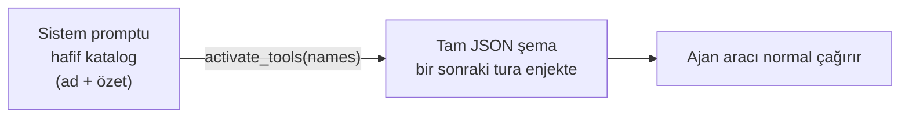

# 19 — Lazy Tool Loading (Tasarım + Uygulama)

> Durum: **UYGULANDI** (2026-06-18) — 3 fazın tamamı. Skill sisteminin
> "progressive disclosure" yaklaşımı built-in + MCP araçlarına taşındı.

## Uygulanan davranış (özet)

- `ToolDef.Lazy` alanı; `Registry` lazy seti tutar. **Self-management suite +
  tüm MCP araçları lazy**; çekirdek araçlar (read/write/edit/grep/glob, memory,
  todo, artifacts, use_skill, secrets, config, http, time) **eager**.
- Sistem promptuna **"Available Tools (load on demand)"** bloğu eklenir
  (`Runtime.LazyToolsCatalogBlock` → `renderLazyToolCatalog`), yalnızca ad+özet.
- Üç eager meta-araç: **`activate_tools`** (şema yükle), **`deactivate_tools`**,
  **`find_tools`** (katalogda anahtar kelime arama). `internal/tools/builtin_activate.go`.
- Per-turn **aktif set** (`internal/tools/activetools.go`, context üzerinden
  `buildRegistry`'ye taşınır). Tool loop her iterasyonda
  `reg.ActiveDefs(filter, active.Snapshot())` ile gönderilen şemayı yeniden
  hesaplar → aktive edilen aracın şeması bir sonraki adımda gelir.
- **Faz 3 prune**: `ActiveTools.Prune` — `activeToolMaxIdle=3` iterasyon
  kullanılmayan aktif araç düşürülür (uzun turda şema yükünü düşük tutar).
- Bağlam önizlemesi (`agent_context.go`): gönderilen araçlar = eager
  (`ShippedToolCatalog`); lazy'ler sistem bloğunda sayılır → dürüst token ayrımı.
- Doğrulama: `/api/agents/{id}/context` — MCP araçları lazy blokta, eager listede
  yalnızca çekirdek + meta-araçlar.

## Sorun

Bugün `buildRegistry` her ajan için **bütün** araçları (built-in + etkin MCP
sunucularının tüm araçları) peşinen kayıtlar ve hepsinin tam JSON şeması her
turda sistem promptuna girer. Self-management açıkken katalog ~2 katına çıkıyor,
MCP sunucuları (ör. mcp-gateway yüzlerce araç) eklenince şema token maliyeti
hızla şişiyor. Ajan çoğu turda bu araçların küçük bir kısmını kullanıyor.

Skill sisteminde bunu zaten çözdük: katalogta yalnızca **özet** durur, tam gövde
`use_skill` ile talep üzerine yüklenir. Aynı deseni araçlara uygulayalım.

## Hedef

Ajana başlangıçta sadece **hafif bir araç kataloğu** (ad + tek satır açıklama)
ver; tam JSON şemalar talep üzerine "etkinleştirilsin". Bu, bu ortamdaki
`ToolSearch` / deferred-tools mekanizmasının birebir muadili.

## Tasarım

### 1. Araç meta katmanı
Her `Tool`/`ToolDef` için zaten `Name` + `Description` var. Eklenecek:
- `Tier` / `Lazy bool` — araç "her zaman açık" mı yoksa "lazy" mı.
- Çekirdek, sık kullanılan araçlar (read_file, write_file, time, memory_recall,
  todo_write…) **eager** kalır — şemaları hep yüklü.
- Geri kalan built-in'ler (self-management suite) ve **tüm MCP araçları** **lazy**
  olur.

### 2. Hafif katalog bloğu
`renderToolCatalog(lazyTools)` → sistem promptuna `# Available Tools (load on
demand)` bloğu: her satır `ad — özet`. Skill kataloğunun (`renderCatalog`) ikizi.

### 3. `activate_tools` meta aracı
Yeni built-in (eager): `activate_tools(names: []string)`.
- Verilen araç adlarının tam `ToolDef`'lerini o oturumun "aktif şema" setine ekler.
- Dönüşte kısa onay verir ("3 tool activated: …").
- Bir sonraki tur isteğinde bu araçların tam şeması provider'a gönderilir.
- Opsiyonel `deactivate_tools` ile geri çıkarılır (uzun oturumda şişmeyi tutmak için).

### 4. Oturum-kapsamlı aktif set
Aktif edilen araçlar **oturum/tur durumu** olarak tutulur (ör. worker veya turn
context üzerinde `activeTools map[string]bool`). `composeTurnRequest`/registry
`Defs()` çağrısı bu seti dikkate alır:
- gönderilecek şemalar = eager tools ∪ activeTools.
- Ajanın allowlist'i ve workspace denylist'i yine üstte uygulanır.

### 5. Eşleştirme / arama (opsiyonel, faz 2)
`ToolSearch` benzeri bir `find_tools(query)` — anahtar kelimeyle lazy katalogda
arama. Küçük kataloglarda gerekmez; MCP-ağır workspace'lerde değerli.

## Dosya dokunuşları (tahmini)

| Dosya | Değişiklik |
|---|---|
| `internal/providers/tooldef.go` | `ToolDef`'e `Lazy bool` (veya tier) alanı |
| `internal/tools/registry.go` | `Defs()` lazy filtre + `LazyCatalog()` üretimi |
| `internal/tools/builtin_activate.go` (yeni) | `activate_tools` / `deactivate_tools` |
| `internal/agent/toolsetup.go` | lazy işaretleme; MCP araçlarını lazy yap |
| `internal/agent/chat_turn.go` / worker | aktif-set durumu + `Defs()` filtresine bağla |
| `internal/api/agent_context.go` | önizlemede lazy katalog + token ayrımı |
| `_Docs/17-TOKEN-OPTIMIZASYON.md` | çapraz bağlantı |

## Riskler / kararlar

- **Çift tur gecikmesi:** ajan aracı kullanmadan önce bir tur `activate_tools`
  harcar. Çözüm: sık beraber kullanılan araçları gruplayıp tek çağrıda aktive
  etmeye teşvik eden katalog metni; çekirdek araçları eager bırakmak.
- **Eager/lazy sınırı** dikkatli seçilmeli — yanlış sınıflama ya token kazancını
  düşürür ya da gereksiz tur ekler. İlk sürümde: tüm MCP + self-management lazy,
  gerisi eager.
- **Geriye dönük uyum:** `Lazy` default `false` → işaretlenmeyen her araç eager
  kalır, davranış değişmez.

## Aşamalandırma

1. **Faz 1** — `Lazy` alanı + lazy katalog + `activate_tools` + aktif-set. MCP
   araçlarını lazy yap. (token kazancının çoğu burada)
2. **Faz 2** — `deactivate_tools` + `find_tools(query)` arama.
3. **Faz 3** — otomatik kısma: uzun oturumda kullanılmayan aktif araçları düşürme.

## İlişki

Bu plan, skill `subskills` (progressive disclosure) deseninin araç tarafındaki
karşılığıdır; bkz. `05-ILERLEME.md` (Skill sistemi) ve `17-TOKEN-OPTIMIZASYON.md`.
