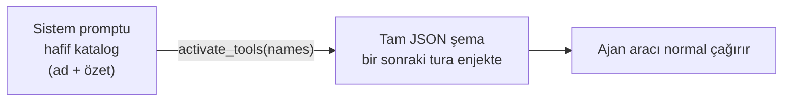

# 19 — Lazy Tool Loading (Tasarım + Uygulama)

> Durum: **UYGULANDI** (2026-06-18) — 3 fazın tamamı. Skill sisteminin
> "progressive disclosure" yaklaşımı built-in + MCP araçlarına taşındı.

## Uygulanan davranış (özet)

- `ToolDef.Lazy` alanı; `Registry` lazy seti tutar. **Self-management suite +
  tüm MCP araçları lazy.**
- **Eager çekirdek küçültmesi (2026-06-19):** her zaman kurulan ama turların
  azında kullanılan 8 araç da lazy'ye indirildi (`toolsetup.go`, açık `MarkLazy`):
  `read_config`/`write_config`/`list_config` (workspace prompt/instruction
  editing — nadir), `secret_list`/`secret_get` (yalnız kimlik-bilgili görevler),
  `list_sessions` (context bloğu zaten push'lanıyor), `memory_recall` (recall
  `ContextBlock` ile otomatik enjekte), `http_get` (çoğu tur dış istek yapmıyor).
  `MarkLazy` builtins'te olmayan ada **no-op** olduğundan gate'li araçlar (vault/
  config kapalı) için ek koruma gerekmez.
- **Kalan eager çekirdek:** `read_file`/`write_file`/`edit_file`/`list_dir`/
  `glob`/`grep`, `shell` (gate'li), `todo_write`, `ask_user`,
  `request_confirmation`, `schedule_wake`, `create_artifact`/`update_artifact`,
  `use_skill`, `get_current_time` + 3 meta-araç. (Etkileşim primitifleri ve
  artifact çıktı yolu, aktive turu beklememesi için eager bırakıldı.)
- **claude-cli yolu (CLI-3, `fc7d30e`):** CLI'de native `activate_tools` döngüsü
  yok; lazy built-in'ler Interaction MCP üzerinden **bridge** edilir
  (`Registry.BridgeableDefs` → tüm lazy built-in'ler, MCP hariç). Bu yüzden eager→
  lazy indirme CLI ajanlarında **erişim kaybına yol açmaz** — yeni lazy araçlar
  otomatik köprülenir. Not: CLI yolunda bridge, lazy araçların **tam şemasını** her
  koşuda ilan eder (native yol yalnız ad+özet katalog satırı taşır).
- **Bridge alt-küme sınırı (2026-06-19):** CLI tam şema ilan ettiği için köprü
  yüzeyi `tools.bridgeExcluded` ile budanır — **CLI'de native karşılığı olan**
  (`http_get` → WebFetch) ve **native-loop context'i gereken** (`call_agent`,
  dispatch `DelegationFrom(ctx)` ister — bridge ctx'inde yok) araçlar köprülenmez.
  Native ajanlar etkilenmez; bunlara `activate_tools` ile erişir. Test:
  `TestBridgeableDefsExcludesCLINative`.
- **Rol-bazlı eager (2026-06-19):** `Agent.PermissionMode == "read-only"` ise
  yazma araçları (`write_file`/`edit_file`; `write_config` zaten lazy) eager'dan
  düşürülür — read-only ajanda yazma zaten onaylanmaz, şemayı her tur göndermek
  israf. "ask"/"auto" ajanlar bunları eager tutar. Test:
  `TestReadOnlyAgentDemotesWriteTools`.
- **call_agent (2026-06-19):** senkron delegasyon (gate'li) artık lazy — turların
  azında kullanılıyor; native'de `activate_tools` ile gelir, CLI'ye köprülenmez.
- **input_examples (2026-06-19):** `ToolDef.Examples []json.RawMessage` — şemanın
  ifade edemediği kullanım konvansiyonlarını (tarih/cron formatı, ID deseni, hangi
  opsiyonel alanın birlikte geldiği) gösteren somut örnek çağrılar. Anthropic
  "advanced tool use" `input_examples` alanının muadili. **Yalnız tam şemaya**
  katlanır (`registry.go foldExamples` → InputSchema'ya JSON Schema `examples`
  dizisi olarak); hafif lazy katalog (yalnız ad+özet) **etkilenmez** → lazy araçta
  örnek yalnız aktive sonrası, yani kullanılacağı anda token harcar. Pilot:
  `create_schedule` (cron) + `create_flow` (graf JSON string'i) — ikisi de lazy,
  yani eager bütçeye sıfır etki. Hatalı-çağrı + retry turunu önlediğinden genelde
  **net token kazandırır**. Test: `TestExamplesFoldIntoSchemaNotCatalog`,
  `TestPilotToolExamplesAreValid`.
- Sistem promptuna **"Available Tools (load on demand)"** bloğu eklenir
  (`Runtime.LazyToolsCatalogBlock` → `renderLazyToolCatalog`), yalnızca ad+özet.
- Üç eager meta-araç: **`activate_tools`** (şema yükle), **`deactivate_tools`**,
  **`tool_search`** (katalogda anahtar kelime arama). `internal/tools/builtin_activate.go`.
- Per-turn **aktif set** (`internal/tools/activetools.go`, context üzerinden
  `buildRegistry`'ye taşınır). Tool loop her iterasyonda
  `reg.ActiveDefs(filter, active.Snapshot())` ile gönderilen şemayı yeniden
  hesaplar → aktive edilen aracın şeması bir sonraki adımda gelir.
- **Faz 3 prune**: `ActiveTools.Prune` — `activeToolMaxIdle=3` iterasyon
  kullanılmayan aktif araç düşürülür (uzun turda şema yükünü düşük tutar).
- Bağlam önizlemesi (`agent_context.go`): gönderilen araçlar = eager
  (`ShippedToolCatalog`); lazy'ler sistem bloğunda sayılır → dürüst token ayrımı.
- Doğrulama: `/api/agents/{id}/context` — MCP araçları lazy blokta, eager listede
  yalnızca çekirdek + meta-araçlar.

## Sorun

Bugün `buildRegistry` her ajan için **bütün** araçları (built-in + etkin MCP
sunucularının tüm araçları) peşinen kayıtlar ve hepsinin tam JSON şeması her
turda sistem promptuna girer. Self-management açıkken katalog ~2 katına çıkıyor,
MCP sunucuları (ör. mcp-gateway yüzlerce araç) eklenince şema token maliyeti
hızla şişiyor. Ajan çoğu turda bu araçların küçük bir kısmını kullanıyor.

Skill sisteminde bunu zaten çözdük: katalogta yalnızca **özet** durur, tam gövde
`use_skill` ile talep üzerine yüklenir. Aynı deseni araçlara uygulayalım.

## Hedef

Ajana başlangıçta sadece **hafif bir araç kataloğu** (ad + tek satır açıklama)
ver; tam JSON şemalar talep üzerine "etkinleştirilsin". Bu, bu ortamdaki
`ToolSearch` / deferred-tools mekanizmasının birebir muadili.

## Tasarım

### 1. Araç meta katmanı
Her `Tool`/`ToolDef` için zaten `Name` + `Description` var. Eklenecek:
- `Tier` / `Lazy bool` — araç "her zaman açık" mı yoksa "lazy" mı.
- Çekirdek, sık kullanılan araçlar (read_file, write_file, time, memory_recall,
  todo_write…) **eager** kalır — şemaları hep yüklü.
- Geri kalan built-in'ler (self-management suite) ve **tüm MCP araçları** **lazy**
  olur.

### 2. Hafif katalog bloğu
`renderToolCatalog(lazyTools)` → sistem promptuna `# Available Tools (load on
demand)` bloğu: her satır `ad — özet`. Skill kataloğunun (`renderCatalog`) ikizi.

### 3. `activate_tools` meta aracı
Yeni built-in (eager): `activate_tools(names: []string)`.
- Verilen araç adlarının tam `ToolDef`'lerini o oturumun "aktif şema" setine ekler.
- Dönüşte kısa onay verir ("3 tool activated: …").
- Bir sonraki tur isteğinde bu araçların tam şeması provider'a gönderilir.
- Opsiyonel `deactivate_tools` ile geri çıkarılır (uzun oturumda şişmeyi tutmak için).

### 4. Oturum-kapsamlı aktif set
Aktif edilen araçlar **oturum/tur durumu** olarak tutulur (ör. worker veya turn
context üzerinde `activeTools map[string]bool`). `composeTurnRequest`/registry
`Defs()` çağrısı bu seti dikkate alır:
- gönderilecek şemalar = eager tools ∪ activeTools.
- Ajanın allowlist'i ve workspace denylist'i yine üstte uygulanır.

### 5. Eşleştirme / arama (opsiyonel, faz 2)
`ToolSearch` benzeri bir `tool_search(query)` — anahtar kelimeyle lazy katalogda
arama. Küçük kataloglarda gerekmez; MCP-ağır workspace'lerde değerli.

## Dosya dokunuşları (tahmini)

| Dosya | Değişiklik |
|---|---|
| `internal/providers/tooldef.go` | `ToolDef`'e `Lazy bool` (veya tier) alanı |
| `internal/tools/registry.go` | `Defs()` lazy filtre + `LazyCatalog()` üretimi |
| `internal/tools/builtin_activate.go` (yeni) | `activate_tools` / `deactivate_tools` |
| `internal/agent/toolsetup.go` | lazy işaretleme; MCP araçlarını lazy yap |
| `internal/agent/chat_turn.go` / worker | aktif-set durumu + `Defs()` filtresine bağla |
| `internal/api/agent_context.go` | önizlemede lazy katalog + token ayrımı |
| `_Docs/17-TOKEN-OPTIMIZASYON.md` | çapraz bağlantı |

## Riskler / kararlar

- **Çift tur gecikmesi:** ajan aracı kullanmadan önce bir tur `activate_tools`
  harcar. Çözüm: sık beraber kullanılan araçları gruplayıp tek çağrıda aktive
  etmeye teşvik eden katalog metni; çekirdek araçları eager bırakmak.
- **Eager/lazy sınırı** dikkatli seçilmeli — yanlış sınıflama ya token kazancını
  düşürür ya da gereksiz tur ekler. İlk sürümde: tüm MCP + self-management lazy,
  gerisi eager.
- **Geriye dönük uyum:** `Lazy` default `false` → işaretlenmeyen her araç eager
  kalır, davranış değişmez.

## Aşamalandırma

1. **Faz 1** — `Lazy` alanı + lazy katalog + `activate_tools` + aktif-set. MCP
   araçlarını lazy yap. (token kazancının çoğu burada)
2. **Faz 2** — `deactivate_tools` + `tool_search(query)` arama.
3. **Faz 3** — otomatik kısma: uzun oturumda kullanılmayan aktif araçları düşürme.

## İlişki

Bu plan, skill `subskills` (progressive disclosure) deseninin araç tarafındaki
karşılığıdır; bkz. `05-ILERLEME.md` (Skill sistemi) ve `17-TOKEN-OPTIMIZASYON.md`.
