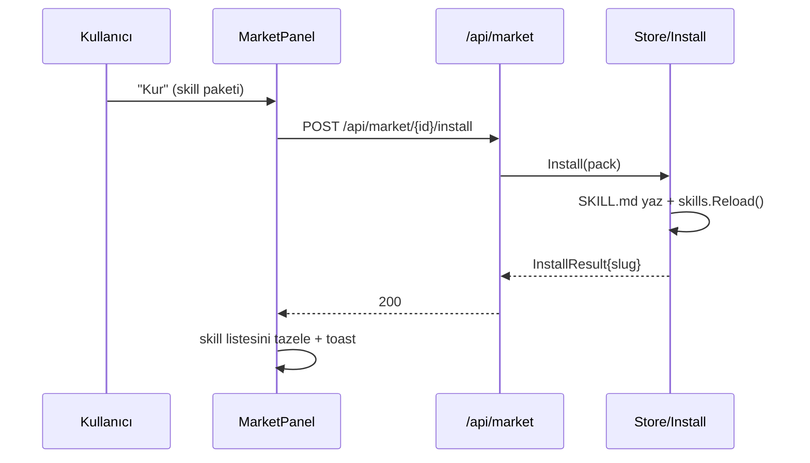

# 21 — Uygulama İçi Market Sistemi (Marketplace)

> **Durum:** Tasarım + **dört türde de kurulum çalışır** (skill/agent/provider/flow install).
> Yayınlama (publish) şimdilik yalnız skill için; agent/provider/flow publish + import/export UI sonraki dilim.
> **Hedef:** Skiller, Agentlar, Sağlayıcılar (Providers) ve Flow taslakları uygulama
> içinden paketlenip (publish), gözatılıp (browse) ve kurulabilsin (install).
>
> **Gömülü örnekler (23 paket):** 10 skill (web-research, code-review, technical-writing,
> data-analysis, debugging, prompt-engineering, sql-expert, git-workflow, api-design,
> summarization), 5 agent (researcher/coder/editor/planner/support), 4 provider
> (openrouter/groq/ollama/deepseek), 4 flow (research-synthesis/review-and-fix/
> parallel-brainstorm/draft-edit-finalize). Üreteç: `internal/market/gen_examples.py`
> (in-tree authoring helper; ürettiği JSON'lar `//go:embed` ile gömülür).

---

## 1. Amaç ve kapsam

SwarmGo'da dört "paylaşılabilir varlık" var:

| Tür | Kaynak | Depolama | Kurulum hedefi |
|-----|--------|----------|----------------|
| **skill** | `internal/skills` | `<dir>/<slug>/SKILL.md` (dosya) | workspace skills dizini |
| **agent** | `db.Agent` | JSON entity | `db.CreateAgent` |
| **provider** | `settings.CustomProvider` | şifreli settings.json | `settings.Upsert` |
| **flow** | `db.Flow` (graph JSON) | JSON entity | `db.CreateFlow` |

Market, bu dört türü **tek bir paket formatı (SwarmPack)** altında toplar; bir
varlığı dışa paketler (publish), bir kayıt defterinde (registry) listeler ve bir
workspace'e geri kurar (install). Mimari, mevcut `skills.Store`'un birebir
kardeşidir: çok-katmanlı (tier), tembel (lazy) dosya-tabanlı bir mağaza.

**Tasarım ilkeleri:**

1. **Bağımlılıksız & dosya-tabanlı** — registry, `*.swarmpack.json` dosyalarından
   oluşan bir dizin. DB yok, ağ zorunluluğu yok (uzak registry ileride additive).
2. **Sır sızdırmaz** — provider paketi **asla** `keyEnc` taşımaz; agent paketi
   ID/CreatedBy/secret taşımaz. Kurulumda kullanıcı kendi anahtarını girer.
3. **Agent-agnostik taslaklar** — flow ve agent paketleri, hedef workspace'in
   kendi ajanlarına bağlanır (flow graph'taki `agentId` slotları boşaltılır;
   `flowTemplates.ts`'teki `instantiateTemplate` kalıbının aynısı).
4. **Provenance** — kurulan varlıklar `CreatedBy=""` (kullanıcı eylemi) damgalanır.

---

## 2. Paket formatı — SwarmPack v1

Her paket bir **manifest zarfı + tür-özel payload**'tan oluşur. Tek dosya:
`<id>.swarmpack.json`.

```jsonc
{
  "schema": "swarmpack/v1",
  "id": "skill.web-research",        // kararlı paket kimliği (kind.slug)
  "kind": "skill",                   // skill | agent | provider | flow
  "name": "Web Research",
  "description": "Derin web araştırması için adım adım yöntem.",
  "version": "1.0.0",
  "author": "bilal",
  "icon": "🔎",
  "color": "#7c3aed",
  "tags": ["research", "web"],
  "createdAt": 1718750000,
  "payload": { /* türe göre değişir, bkz. §3 */ }
}
```

Manifest (payload hariç) **ucuz** tutulur: katalog yalnız manifestleri tarar,
payload yalnız detay/kurulum anında okunur (skills'teki body-lazy kalıbı).

### 2.1 Türe göre payload

**skill** — SKILL.md'nin taşınabilir hâli:
```jsonc
"payload": {
  "slug": "web-research",
  "body": "---\nname: Web Research\n...\n---\n\n# ...markdown gövdesi..."
}
```
> `body` = tam SKILL.md metni (frontmatter dâhil). Kurulum = bu metni
> `<workspace skills>/<slug>/SKILL.md`'e yazmak. Basit, kayıpsız.

**agent** — sterilize edilmiş ajan konfigürasyonu (ID/secret yok):
```jsonc
"payload": {
  "name": "Researcher",
  "soul": "...", "identity": "...",
  "provider": "anthropic", "model": "claude-...",
  "capabilities": "[...]", "planningMode": "...", "thinkingLevel": "...",
  "permissionMode": "ask", "avatar": "🤖", "color": "#...",
  "mcpEnabled": true, "allowedTools": "[...]",
  "skills": ["web-research"]   // slug referansı; eksikse kurulumda atlanır
}
```

**provider** — özel sağlayıcı, **anahtarsız**:
```jsonc
"payload": {
  "label": "OpenRouter", "kind": "openai",
  "baseUrl": "https://openrouter.ai/api/v1",
  "defaultModel": "...", "models": "..."
  // keyEnc YOK — kurulumda kullanıcı kendi anahtarını girer
}
```

**flow** — agent-agnostik orchestration taslağı:
```jsonc
"payload": {
  "name": "Map-Reduce Araştırma",
  "description": "...",
  "graph": "{...JSON...}"   // node agentId slotları boş (kurulumda atanır)
}
```

---

## 3. Backend — `internal/market` paketi

`internal/skills` ile simetrik:

```
internal/market/
├── pack.go          # SwarmPack + payload tipleri, schema sabitleri
├── store.go         # Store: tier tarama + lazy payload (skills.Store kardeşi)
├── install.go       # her tür için Install* (skill→dosya, flow/agent→db, provider→settings)
├── publish.go       # var olan varlık → SwarmPack paketleme (sanitize)
├── defaults.go      # //go:embed defaults — gömülü başlangıç paketleri
├── defaults/        # *.swarmpack.json başlangıç paketleri
└── *_test.go
```

### 3.1 Registry katmanları (tier)

`skills` ile aynı: artan öncelik, sonraki kazanır.

| Tier | Dizin | İçerik |
|------|-------|--------|
| **bundled** | `//go:embed defaults` | SwarmGo ile gelen başlangıç paketleri |
| **global** | `<DataDir>/market` | makine-geneli (publish edilen / indirilen) |
| **workspace** | `<workspace>/market` | workspace'e özel publish edilenler |

`market.EnsureDefaults(globalDir)` boot'ta gömülü paketleri global dizine yazar
(skills.EnsureDefaults aynası; mevcut dosyanın üzerine yazmaz).

### 3.2 Store API

```go
func New(bundledFS, globalDir, workspaceDir string) *Store
func (s *Store) List() []Pack                  // manifestler (payload'sız)
func (s *Store) ListKind(kind string) []Pack
func (s *Store) Get(id string) (Pack, bool)    // payload dâhil (lazy okur)
func (s *Store) Reload()
func (s *Store) Publish(p Pack) error           // workspace tier'a yazar
```

### 3.3 Install (kurulum) — ✅ dört tür de çalışır

`market.InstallSkill` dosya işidir (market paketinde); agent/provider/flow ise db/
settings gerektirdiğinden **API handler'ında** (`api/market.go`) yapılır — market
paketini db/settings bağımlılığından uzak tutar (publish'in `BuildSkillPack` kalıbı).
`handleInstallMarketPack` türe göre `switch`'ler:

- **skill** → `market.InstallSkill`: `<workspace skills>/<slug>/SKILL.md` yaz +
  `skillStore.Reload()`. Çakışma: `overwrite=false` ise 409, true ise üzerine yaz.
- **agent** → `installAgentPack`: bilinmeyen skill slug'ları elenir (workspace'te
  çözülemeyen skill kurulumu bloklamaz), `db.CreateAgent` (CreatedBy=""). Provider/
  model boşsa db varsayılanlarına düşer.
- **flow** → `installFlowPack`: `db.CreateFlow`. Graph agent-agnostik (boş agentId);
  **hemen çalışsın diye** boş slotlar workspace'in ilk ajanına atanır (motor boş
  agentId'yi reddeder — `flowTemplates` `instantiateTemplate` kuralının aynısı).
- **provider** → `installProviderPack`: `settings.UpsertCustomProvider` + `applySettings()`
  (canlı registry push). Key (pakette **yok**) gövdedeki `apiKey`'den gelir, AES-GCM
  şifrelenir; boşsa yine kurulur (kullanıcı sonra Ayarlar'dan girer). Provider id =
  pack id'den (`provider.<slug>` → `<slug>`).

### 3.4 Publish (paketleme) — `publish.go`

`PublishSkill(slug)`, `PublishAgent(id)`, `PublishProvider(id)`, `PublishFlow(id)`
→ ilgili store/db'den varlığı çekip **sanitize** ederek `Pack` üretir, `Store.Publish`
ile workspace tier'a yazar. Sanitize = secret/ID/CreatedBy temizliği (§1.2).

---

## 4. API yüzeyi

`internal/api/market.go` (skills.go aynası), `registerMarketRoutes`:

| Metot | Yol | İş |
|-------|-----|-----|
| GET | `/api/market` | katalog (manifestler), `?kind=` filtresi |
| GET | `/api/market/{id}` | paket detayı (payload dâhil) |
| POST | `/api/market/{id}/install` | workspace'e kur (gövde: `{overwrite?, apiKey?, ...}`) |
| POST | `/api/market/publish` | gövde: `{kind, sourceId}` → yerel registry'e paketle |
| POST | `/api/market/reload` | yeniden tara |
| POST | `/api/market/import` | gövde: ham SwarmPack JSON → registry'e ekle |
| GET | `/api/market/{id}/export` | paket JSON'unu indir (dosya paylaşımı) |

`Runtime`'a `Market() *market.Store` accessor'ı (Skills() aynası); dizinler
`marketGlobalDir()` / `workspaceMarketDir(workDir)`.

---

## 5. Frontend

- **NavRail**: yeni görünüm `market` — `{ key:'market', label:'Market', icon: Store }`.
- **`components/panels/MarketPanel.tsx`**: tür sekmeleri (Tümü / Beceri / Ajan /
  Sağlayıcı / Akış), kart ızgarası (ikon + ad + açıklama + sürüm + yazar + "Kur"),
  sağ detay çekmecesi (skill → markdown önizleme, flow → salt-okunur
  `FlowCanvas readOnly` önizleme, agent/provider → alan özeti), "Yayınla" akışı
  (var olan varlığı seç → registry'e paketle).
- **`api/market.ts`** + **`types/market.ts`**: Pack/PackDetail tipleri, list/get/
  install/publish/import çağrıları.
- Kurulum sonrası ilgili panel verisi tazelenir (skill listesi, flows, agents).
- **Provider API anahtarı = secret vault'tan seçim** (serbest metin değil — Ayarlar →
  Sağlayıcılar paneliyle aynı politika): provider detayında `listSecrets` ile dolu bir
  dropdown; seçilince `revealSecret(name)` ile değer çözülür ve install gövdesine
  `apiKey` olarak gider (UI'da plaintext tutulmaz/gösterilmez). "Sırlar →" butonu
  (`onManageSecrets` prop'u, App'te `setView('secrets')`) Sırlar ekranına atlar.
  Sır yoksa anahtarsız kurulur (sonra Ayarlar'dan girilebilir).

### 5.1 Kurulum akışı (UML)



---

## 6. Gerçekleşen kapsam

**Dilim 1 (skill MVP):** pack.go + store.go + skill install/publish + 2 gömülü
paket + testler; API list/get/install/publish/import/reload; MarketPanel + NavRail.

**Dilim 2 (bu oturum):** **dört türde de kurulum** + **20 yeni örnek paket**:
- `api/market.go`: `installAgentPack`/`installFlowPack`/`installProviderPack` (§3.3).
- 23 gömülü örnek (`gen_examples.py` üreteci): 10 skill / 5 agent / 4 provider / 4 flow.
- Frontend: MarketPanel artık her tür için "Kur" gösterir (provider'da API-key
  girişi), tür-özel önizleme (`PackPreview`: skill→markdown, agent→persona+alanlar,
  provider→baseUrl+modeller, flow→düğüm listesi).
- **Doğrulama:** `go build/vet/test` + `tsc` yeşil; **canlı API E2E** (port 8090):
  agent→`CreateAgent`, flow→`CreateFlow`(ilk-ajan otomatik atama), provider→`Upsert`+
  AES-GCM key (`keySet:true`), skill→workspace+reload — dördü de 200 + entity oluştu.

**Sonraki dilim:** agent/provider/flow **publish** (sanitize), import/export UI,
Playwright UI smoke, uzak registry (§7).

---

## 7. Açık sorular / sonraki adımlar

- **Uzak registry**: HTTP index.json + paket indirme (imza/doğrulama?). Tasarım
  bunu additive bırakıyor (4. tier).
- **Sürümleme/güncelleme**: kurulu paket sürümü < registry → "güncelle" akışı.
- **Bağımlılıklar**: agent paketi referans verdiği skill paketlerini de önerebilir.
- **Çakışma politikası**: slug çakışmasında yeniden adlandırma vs. üzerine yazma.
