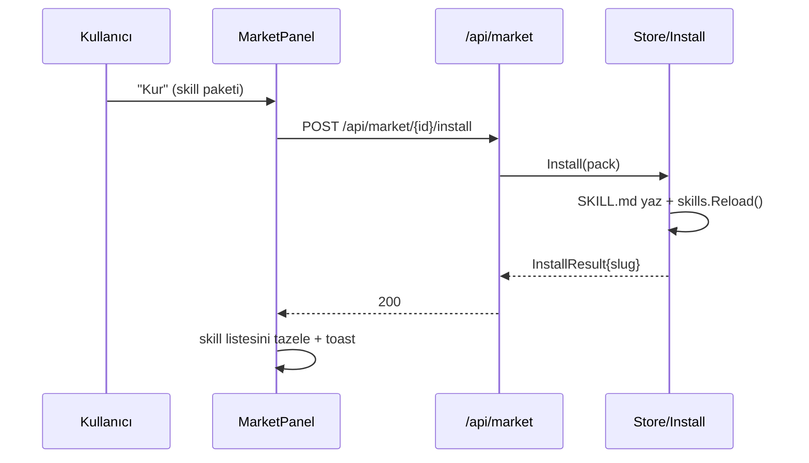

# 21 — Uygulama İçi Market Sistemi (Marketplace)

> **Durum:** Tasarım + **yedi türde de kurulum çalışır** (skill/agent/provider/flow/
> **workspace/memory/mcp** install). Yeni türler (workspace/memory/mcp) 2026-06-24'te
> eklendi. (Board türü kısa süre denendi, 2026-06-24'te **kaldırıldı** — workspace
> şablonu zaten opsiyonel kanban düzeni taşıyor.)
> **Uzak kayıt defteri (remote registry) — 2026-06-25:** market artık harici
> sunuculardan paket çekebilir (`swarmregistry/v1` index). Kaynak ekle/çıkar/yenile,
> uzak paketleri listele+kur (lazy indirme, opsiyonel sha256), ve **sürüm bazlı
> "Güncelle"** algısı (install ledger). Detay §7.
> Yayınlama (publish) şimdilik yalnız skill için; diğer türlerin publish + import/export UI sonraki dilim.
> **Hedef:** Skiller, Agentlar, Sağlayıcılar, Flow taslakları, **Workspace şablonları,
> Bellek tohumları ve MCP araç sunucuları** uygulama içinden paketlenip (publish),
> gözatılıp (browse) ve kurulabilsin (install).
>
> **Katman sadeleştirme (2026-06-25):** bundled (binary'e gömülü) ve workspace
> pack tier'ları **kaldırıldı**. Paketler artık **yalnız global dizinde**
> (`<DataDir>/market`, ~/.swarmgo/market) ve **uzak registry'lerde** yaşar.
> `//go:embed defaults` + `EnsureDefaults` + `internal/market/defaults/` silindi →
> binary market item taşımıyor, workspace'te market klasörü yok. Mevcut başlangıç
> paketleri (31 adet; 2026-06-25'te **GAN üçlüsü** eklendi — `flow.gan-generator-evaluator`
> + `agent.skeptical-evaluator` + `mcp.playwright`, generator↔evaluator döngüsü için, bkz.
> `_Docs/15-FLOW-CANVAS.md`) global dizinde duruyor; yeni kurulumlarda market boş başlar
> ve global dizine elle paket konarak ya da uzak registry eklenerek doldurulur.
>
> **UI (2026-06-24):** Market ekranı **sol dikey kategori menüsü** kullanır (Skills/
> Agents/Providers/Flows/Workspaces/Memories/Tools(MCP)); "Tümü" seçeneği yok,
> ilk kategori varsayılan. **Claude Code skill içe aktarma** Skills ekranından markete
> taşındı (Skills kategorisi başlığındaki "İçe Aktar" butonu → `SkillImportDialog`).
> **Memory kurulumu hedef ajan seçtirir** (detayda dropdown; varsayılan ilk ajan).
> Bir item'a tıklayınca detay **ortada açılan popup/modal** olarak gelir (eski yan-panel
> yerine; `market-detail-modal`, backdrop'a tıklayınca kapanır).
>
> **Koleksiyon içe aktarma (SK-IMP2, 2026-06-25):** içe aktarma artık **çok-skilli
> koleksiyonları** destekler — tek skill klasörü yerine bir **GitHub repo / Claude
> Code plugin / `skills/` klasörü** (ör. `juliusbrussee/caveman`, `leonxlnx/taste-skill`,
> `coreyhaines31/marketingskills`) baştan sona taranır, içindeki **her `SKILL.md`**
> keşfedilir. Akış üç adım: **Tara → Seç → İçe aktar** (`SkillImportDialog` artık
> önizleme + çoklu seçim taşır). GitHub yolu repo'yu **tek tarball indirmeyle**
> (`codeload.github.com`, API rate-limit'ine tabi DEĞİL) çeker → 1 istekle tüm
> skill'leri isim/açıklama + dosyalarıyla keşfeder. **Nested kaynaklar** (`references/`,
> `evals/`, `scripts/` …) korunur (artık düz dosya değil ağaç kopyalanır). Slug
> çakışmaları **batch'i durdurmaz**, atlanır ve raporlanır; opsiyonel **slug öneki**
> ile koleksiyon isim-uzayına alınabilir (ör. `caveman-commit`). `owner/repo` kısayolu
> + `> / |` YAML block-scalar açıklamalar desteklenir. crossaitools.com / skillsmp.com /
> claudeskillsmarket.com gibi dizinler **doğrudan kazınmaz** ama oraların işaret ettiği
> GitHub repo URL'si yapıştırılarak içe aktarılır. Detay: §"Skill içe aktarma" aşağıda.

---

## 1. Amaç ve kapsam

SwarmGo'da yedi "paylaşılabilir varlık" var:

| Tür | Kaynak | Depolama | Kurulum hedefi |
|-----|--------|----------|----------------|
| **skill** | `internal/skills` | `<dir>/<slug>/SKILL.md` (dosya) | workspace skills dizini |
| **agent** | `db.Agent` | JSON entity | `db.CreateAgent` |
| **provider** | `settings.CustomProvider` | şifreli settings.json | `settings.Upsert` |
| **flow** | `db.Flow` (graph JSON) | JSON entity | `db.CreateFlow` |
| **workspace** | `workspace.Manager` | workspace registry + ws-settings | `Manager.Create` + `UpdateSettings` (yeni workspace; opsiyonel kanban düzeni dahil) |
| **memory** | `db.KnowledgeSource` | JSON entity (ajan-başına) | `Runtime.Memory().Remember` (**seçilen** ajana tohum) |
| **mcp** | `db.MCPServer` | JSON entity | `db.CreateMCPServer` (enabled; sonraki turda yüklenir) |

**Kurulum semantiği farkları:**
- **memory** bir **eylem** (tohum ekle), benzersiz-kimlikli varlık yaratmaz → "zaten kurulu" işareti yok, tekrar çalıştırılabilir ("Belleğe ekle").
- **memory** kurulumu **seçilen ajana** yazar (install body `agentId`; verilmezse ilk ajan; ajan yoksa hata verir, UI'da buton pasif).
- **workspace** kurulumu **yeni bir workspace oluşturur** (ad çakışırsa engellenir); workspace şablonu opsiyonel kanban kolon düzeni taşıyabilir (`WorkspacePayload.Columns` → `WSSettings.BoardColumns`).
- **mcp** ve **workspace** ad-bazlı dedup; **agent**/**flow** ad-bazlı; **skill** slug; **provider** id (Upsert → "Güncelle").

**Built-in araçlar markete eklenemez:** yerleşik araçlar (`Read`/`Write`/`Bash`…) Go ile
binary'e derilidir, dosya-tabanlı değildir. Markete "araç eklemenin" karşılığı **mcp**
türüdür (harici MCP sunucu config'i).

Market, bu türleri **tek bir paket formatı (SwarmPack)** altında toplar; bir
varlığı dışa paketler (publish), bir kayıt defterinde (registry) listeler ve bir
workspace'e geri kurar (install). Mimari, mevcut `skills.Store`'un birebir
kardeşidir: çok-katmanlı (tier), tembel (lazy) dosya-tabanlı bir mağaza.

**Tasarım ilkeleri:**

1. **Bağımlılıksız & dosya-tabanlı** — registry, `*.swarmpack.json` dosyalarından
   oluşan bir dizin. DB yok, ağ zorunluluğu yok (uzak registry ileride additive).
2. **Sır sızdırmaz** — provider paketi **asla** `keyEnc` taşımaz; agent paketi
   ID/CreatedBy/secret taşımaz. Kurulumda kullanıcı kendi anahtarını girer.
3. **Agent-agnostik taslaklar** — flow ve agent paketleri, hedef workspace'in
   kendi ajanlarına bağlanır (flow graph'taki `agentId` slotları boşaltılır;
   `flowTemplates.ts`'teki `instantiateTemplate` kalıbının aynısı).
4. **Provenance** — kurulan varlıklar `CreatedBy=""` (kullanıcı eylemi) damgalanır.

---

## 2. Paket formatı — SwarmPack v1

Her paket bir **manifest zarfı + tür-özel payload**'tan oluşur. Tek dosya:
`<id>.swarmpack.json`.

```jsonc
{
  "schema": "swarmpack/v1",
  "id": "skill.web-research",        // kararlı paket kimliği (kind.slug)
  "kind": "skill",                   // skill|agent|provider|flow|workspace|memory|mcp
  "name": "Web Research",
  "description": "Derin web araştırması için adım adım yöntem.",
  "version": "1.0.0",
  "author": "bilal",
  "icon": "🔎",
  "color": "#7c3aed",
  "tags": ["research", "web"],
  "createdAt": 1718750000,
  "payload": { /* türe göre değişir, bkz. §3 */ }
}
```

Manifest (payload hariç) **ucuz** tutulur: katalog yalnız manifestleri tarar,
payload yalnız detay/kurulum anında okunur (skills'teki body-lazy kalıbı).

### 2.1 Türe göre payload

**skill** — SKILL.md'nin taşınabilir hâli:
```jsonc
"payload": {
  "slug": "web-research",
  "body": "---\nname: Web Research\n...\n---\n\n# ...markdown gövdesi..."
}
```
> `body` = tam SKILL.md metni (frontmatter dâhil). Kurulum = bu metni
> `<workspace skills>/<slug>/SKILL.md`'e yazmak. Basit, kayıpsız.

**agent** — sterilize edilmiş ajan konfigürasyonu (ID/secret yok):
```jsonc
"payload": {
  "name": "Researcher",
  "soul": "...", "identity": "...",
  "provider": "anthropic", "model": "claude-...",
  "planningMode": "...", "thinkingLevel": "...",
  "permissionMode": "ask", "avatar": "🤖", "color": "#...",
  "mcpEnabled": true, "allowedTools": "[...]",
  "skills": ["web-research"]   // slug referansı; eksikse kurulumda atlanır
}
```

**provider** — özel sağlayıcı, **anahtarsız**:
```jsonc
"payload": {
  "label": "OpenRouter", "kind": "openai",
  "baseUrl": "https://openrouter.ai/api/v1",
  "defaultModel": "...", "models": "..."
  // keyEnc YOK — kurulumda kullanıcı kendi anahtarını girer
}
```

**flow** — agent-agnostik orchestration taslağı:
```jsonc
"payload": {
  "name": "Map-Reduce Araştırma",
  "description": "...",
  "graph": "{...JSON...}"   // node agentId slotları boş (kurulumda atanır)
}
```

---

## 3. Backend — `internal/market` paketi

`internal/skills` ile simetrik:

```
internal/market/
├── pack.go            # SwarmPack + payload tipleri, schema sabitleri
├── store.go           # Store: global tier tarama + lazy payload + remote birleştirme
├── remote.go          # uzak registry çekme (fetchIndex/fetchPayload) + semver
├── registry_store.go  # kaynak config + remote cache + install ledger
├── install.go         # InstallSkill (dosya); diğerleri API handler'ında
├── publish.go         # var olan varlık → SwarmPack paketleme (sanitize)
└── *_test.go
```

### 3.1 Registry katmanları (tier) — sadeleştirildi (2026-06-25)

Eskiden bundled/global/workspace üçlüsü vardı; **bundled ve workspace pack tier'ları
kaldırıldı**. Kalan yerel tek tier **global**; uzak registry'ler 4. (en düşük öncelikli)
kaynaktır. Yerel (global) paketler, id çakışmasında uzak paketleri gölgeler.

| Tier | Dizin | İçerik |
|------|-------|--------|
| **global** | `<DataDir>/market` | tek yerel kaynak (publish edilen / elle konan) |
| **remote** | uzak `registry.json` | harici registry'lerden çekilenler (§7) |

Embed/seed yok: binary market item taşımaz, workspace'te market klasörü yok. Install
ledger (`installed.json`) per-workspace olarak workspace kökünde tutulur (pack değil,
yalnız "hangi sürüm kuruldu" takibi).

### 3.2 Store API

```go
func New(globalDir, ledgerDir string) *Store   // tek yerel tier = global; ledger per-workspace
func (s *Store) List() []Pack                  // global + remote manifestler (payload'sız)
func (s *Store) ListKind(kind string) []Pack
func (s *Store) Get(id string) (Pack, bool)    // payload dâhil (yerel disk / uzak indir)
func (s *Store) Reload()
func (s *Store) Publish(p Pack) error           // global dizine yazar
```

### 3.3 Install (kurulum) — ✅ dört tür de çalışır

`market.InstallSkill` dosya işidir (market paketinde); agent/provider/flow ise db/
settings gerektirdiğinden **API handler'ında** (`api/market.go`) yapılır — market
paketini db/settings bağımlılığından uzak tutar (publish'in `BuildSkillPack` kalıbı).
`handleInstallMarketPack` türe göre `switch`'ler:

- **skill** → `market.InstallSkill`: `<workspace skills>/<slug>/SKILL.md` yaz +
  `skillStore.Reload()`. Çakışma: `overwrite=false` ise 409, true ise üzerine yaz.
- **agent** → `installAgentPack`: bilinmeyen skill slug'ları elenir (workspace'te
  çözülemeyen skill kurulumu bloklamaz), `db.CreateAgent` (CreatedBy=""). Provider/
  model boşsa db varsayılanlarına düşer.
- **flow** → `installFlowPack`: `db.CreateFlow`. Graph agent-agnostik (boş agentId);
  **hemen çalışsın diye** boş slotlar workspace'in ilk ajanına atanır (motor boş
  agentId'yi reddeder — `flowTemplates` `instantiateTemplate` kuralının aynısı).
- **provider** → `installProviderPack`: `settings.UpsertCustomProvider` + `applySettings()`
  (canlı registry push). Key (pakette **yok**) gövdedeki `apiKey`'den gelir, AES-GCM
  şifrelenir; boşsa yine kurulur (kullanıcı sonra Ayarlar'dan girer). Provider id =
  pack id'den (`provider.<slug>` → `<slug>`).

**Tekrar-kurulum koruması (dedup):** agent/flow kurulumu, aynı **ada** sahip bir varlık
zaten varsa **409** döner (`nameExists` + `agentNames`/`flowNames`) — kullanıcının işini
çoğaltmaz. skill zaten dosya çakışmasında 409 verir (overwrite guard). provider id-keyed
(`Upsert`) olduğundan tekrar kurulum **çoğaltmaz, günceller**.

### 3.4 Publish (paketleme) — `publish.go`

`PublishSkill(slug)`, `PublishAgent(id)`, `PublishProvider(id)`, `PublishFlow(id)`
→ ilgili store/db'den varlığı çekip **sanitize** ederek `Pack` üretir, `Store.Publish`
ile global dizine yazar. Sanitize = secret/ID/CreatedBy temizliği (§1.2).

---

## 4. API yüzeyi

`internal/api/market.go` (skills.go aynası), `registerMarketRoutes`:

| Metot | Yol | İş |
|-------|-----|-----|
| GET | `/api/market` | katalog (manifestler), `?kind=` filtresi |
| GET | `/api/market/{id}` | paket detayı (payload dâhil) |
| POST | `/api/market/{id}/install` | workspace'e kur (gövde: `{overwrite?, apiKey?, ...}`) |
| POST | `/api/market/publish` | gövde: `{kind, sourceId}` → yerel registry'e paketle |
| POST | `/api/market/reload` | yeniden tara |
| POST | `/api/market/import` | gövde: ham SwarmPack JSON → registry'e ekle |
| GET | `/api/market/{id}/export` | paket JSON'unu indir (dosya paylaşımı) |

`Runtime`'a `Market() *market.Store` accessor'ı (Skills() aynası); dizinler
`marketGlobalDir()` / `workspaceMarketDir(workDir)`.

### 4.1 Skill içe aktarma (SK-IMP / SK-IMP2)

Skill içe aktarma kodu **markette değil** `internal/skills`'tedir (market UI'ı yalnız
`SkillImportDialog`'u barındırır). Endpoint'ler `internal/api/skills.go`:

| Metot | Yol | İş |
|-------|-----|-----|
| POST | `/api/skills/import` | **tek** skill (geriye uyumlu): `{source, path\|url, slug?, shared?}` |
| POST | `/api/skills/import/scan` | **koleksiyon önizleme**: `{source, path\|url}` → keşfedilen skill listesi (yazma yok) |
| POST | `/api/skills/import/bulk` | **toplu içe aktar**: `{source, path\|url, paths[], slugPrefix?, shared?}` |

- `source` = `github` (repo/tree URL ya da `owner/repo` kısayolu) veya `local` (klasör ağacı).
- **GitHub yolu** (`internal/skills/collection.go`): `fetchGitHubArchive` repo'yu
  `codeload.github.com/<owner>/<repo>/tar.gz/<ref>` üzerinden **tek tarball** indirir
  (`main`→`master` fallback), `archive/tar`+`compress/gzip` ile bellek-içi ayıklar
  (yeni bağımlılık yok). Bu, contents-API'yi klasör-klasör gezmeye göre **anonim
  rate-limit'e çok daha dostudur** (1 istek = tüm keşif + içerik). Üst dizin (`repo-ref/`)
  soyulur; `skipDirs` (.git/.github/node_modules/dist/build/benchmarks…) elenir;
  dosya başına 4 MB / toplam 64 MB cap.
- **Keşif** (`discoverInTree`): her `SKILL.md`'nin ebeveyni bir skill klasörüdür;
  her kaynak dosya **en derin** ata-skill klasörüne atanır → nested sub-skill kendi
  kaynaklarını korur, ebeveyn onları sahiplenmez. Kök-skill (`SKILL.md` repo kökünde)
  de desteklenir. `prefix` (URL'deki alt-yol) ile alt-ağaca daraltılır.
- **Nested kaynaklar korunur:** `ImportCCSkill` artık alt klasörleri (`references/`,
  `evals/`, `scripts/`) yazar; `safeBundledPath` mutlak yol + `..` kaçışını reddeder,
  nested göreli yola izin verir. `readLocalSkillDir` de tek-skill local import'ta ağacı
  `WalkDir` ile toplar.
- **Slug çakışması batch'i durdurmaz:** çakışan skill `Skipped`'a (sebep ile) düşer,
  diğerleri devam eder. Opsiyonel `slugPrefix` koleksiyonu isim-uzayına alır.
- **Frontmatter `>`/`|` block-scalar** (folded/literal) açıklamalar artık parse edilir
  (`frontmatter.go::collectBlockScalar`) — community SKILL.md'lerinde yaygın.
- **Dizin siteleri** (crossaitools.com / skillsmp.com / claudeskillsmarket.com)
  doğrudan kazınmaz; oraların işaret ettiği **GitHub repo URL'si** yapıştırılarak
  içe aktarılır (hepsi GitHub-tabanlı). İleride: bu dizinleri **uzak registry**
  (`swarmregistry/v1`) olarak köprüleyen bir adaptör eklenebilir.
- Testler: `collection_test.go` (gruplama/prefix/kök-skill/çakışma/block-scalar),
  `collection_live_test.go` (network-gated, `SWARMGO_LIVE_TEST=1`).

---

## 5. Frontend

- **Paylaşılan `Button` primitifi:** Market paneli, uygulamanın ortak `Button`
  bileşenini (`components/common/Button.tsx`, `variant: primary|secondary|danger`,
  `size: sm|md|lg`) benimser. Aynı bileşen uygulama genelinde ~15 panelde kullanılır;
  renk ve boyut tutarlılığı tek noktadan sağlanır.
- **NavRail**: yeni görünüm `market` — `{ key:'market', label:'Market', icon: Store }`.
- **`components/panels/MarketPanel.tsx`**: tür sekmeleri (Tümü / Beceri / Ajan /
  Sağlayıcı / Akış), kart ızgarası (ikon + ad + açıklama + sürüm + yazar + "Kur"),
  sağ detay çekmecesi (skill → markdown önizleme, flow → salt-okunur
  `FlowCanvas readOnly` önizleme, agent/provider → alan özeti), "Yayınla" akışı
  (var olan varlığı seç → registry'e paketle).
- **`api/market.ts`** + **`types/market.ts`**: Pack/PackDetail tipleri, list/get/
  install/publish/import çağrıları.
- Kurulum sonrası ilgili panel verisi tazelenir (skill listesi, flows, agents).
- **Provider API anahtarı = secret vault'tan seçim** (serbest metin değil — Ayarlar →
  Sağlayıcılar paneliyle aynı politika): provider detayında `listSecrets` ile dolu bir
  dropdown; seçilince `revealSecret(name)` ile değer çözülür ve install gövdesine
  `apiKey` olarak gider (UI'da plaintext tutulmaz/gösterilmez). "Sırlar →" butonu
  (`onManageSecrets` prop'u, App'te `setView('secrets')`) Sırlar ekranına atlar.
  Sır yoksa anahtarsız kurulur (sonra Ayarlar'dan girilebilir).
- **Zaten kurulu işareti:** panel açılışta mevcut skill/agent/flow/provider'ları çeker
  (`loadExisting`); bir paketin hedefi varsa kartta "Kuruldu" rozeti + detayda buton
  **disabled "Zaten kurulu"** (provider'da "Güncelle"). `packTargetKey`: skill→slug,
  agent/flow→ad, provider→id.
- **Kurulum sonrası tazeleme:** `onInstalled(kind)` prop'u host'a haber verir; App
  `kind==='agent'` olunca `listAgents()`→`setAgents` ile App-state ajan listesini yeniler
  → yeni ajan **Ajanlar ekranında manuel yenileme olmadan** görünür (flow/skill/provider
  panelleri zaten mount'ta yüklenir).

### 5.1 Kurulum akışı (UML)



---

## 6. Gerçekleşen kapsam

**Dilim 1 (skill MVP):** pack.go + store.go + skill install/publish + 2 gömülü
paket + testler; API list/get/install/publish/import/reload; MarketPanel + NavRail.

**Dilim 2 (bu oturum):** **dört türde de kurulum** + **20 yeni örnek paket**:
- `api/market.go`: `installAgentPack`/`installFlowPack`/`installProviderPack` (§3.3).
- 23 gömülü örnek (`gen_examples.py` üreteci): 10 skill / 5 agent / 4 provider / 4 flow.
- Frontend: MarketPanel artık her tür için "Kur" gösterir (provider'da API-key
  girişi), tür-özel önizleme (`PackPreview`: skill→markdown, agent→persona+alanlar,
  provider→baseUrl+modeller, flow→düğüm listesi).
- **Doğrulama:** `go build/vet/test` + `tsc` yeşil; **canlı API E2E** (port 8090):
  agent→`CreateAgent`, flow→`CreateFlow`(ilk-ajan otomatik atama), provider→`Upsert`+
  AES-GCM key (`keySet:true`), skill→workspace+reload — dördü de 200 + entity oluştu.

**Sonraki dilim:** agent/provider/flow **publish** (sanitize), import/export UI,
Playwright UI smoke, uzak registry (§7).

---

## 7. Uzak kayıt defteri (Remote Registry) — 2026-06-25

Market artık uzak sunuculardan paket çekebilir — yerel tek tier (**global**) uzak
paketleri **id çakışmasında gölgeler** (yerel kazanır).

### 7.1 Index formatı — `swarmregistry/v1`

Bir registry, tek bir `registry.json` sunar (HTTP/HTTPS):

```jsonc
{
  "schema": "swarmregistry/v1",
  "name": "Test Registry",
  "updatedAt": 1750000000,
  "packs": [
    {
      "id": "skill.web-research", "kind": "skill", "name": "...",
      "description": "...", "version": "2.0.0", "author": "...",
      "icon": "🔎", "tags": ["research"],
      "url": "https://.../skill.web-research.swarmpack.json", // payload (lazy indirilir)
      "sha256": "abc…",          // OPSİYONEL bütünlük (boşsa atlanır)
      "minAppVersion": "0.9.0"   // taşınır; şimdilik zorlayıcı değil
    }
  ]
}
```

Index = ucuz (yalnız manifest + `url`); payload **kurulum anında** `url`'den indirilir
(yerel lazy kalıbının HTTP karşılığı). `sha256` verildiyse indirme doğrulanır, **verilmediyse
atlanır** (doğrulama opsiyonel, kullanıcı tercihi).

### 7.2 Backend (`internal/market`)

- `remote.go`: index/pack çekme (`fetchIndex`/`fetchPayload`), boyut sınırı (8MiB/4MiB),
  20sn timeout, yalnız http(s), opsiyonel sha256, `compareVersions` (semver-lite).
- `registry_store.go`: kaynak config'i `registries.json` (global market dir), index cache'i
  `<global>/.remote-cache/<hash>.json` (restart-safe; `scanDir` dizinleri atladığı için
  yerel katalogu kirletmez), per-workspace **install ledger** `<workspace>/market/installed.json`
  (packID→version → "Güncelle" algısı).
- `store.go`: `List()` yerel + uzak birleştirir (uzak `Source=remote`, `RegistryName`),
  `Get()` yerelde yoksa uzaktan indirir. `New(globalDir, workspaceDir)` artık `globalDir`'i saklar.
- Eşzamanlılık: her workspace'in Store'u aynı global cache'i okur (salt-okunur paylaşım).

### 7.3 API

| Endpoint | İş |
|----------|-----|
| `GET /api/market/registries` | kaynakları listele |
| `POST /api/market/registries` `{name,url}` | ekle (+ ilk refresh, best-effort) |
| `POST /api/market/registries/delete` `{url}` | kaldır (+ cache temizle) |
| `POST /api/market/registries/refresh` | tüm enabled kaynakları yeniden çek |
| `GET /api/market` | yerel+uzak katalog; her pack `installedVersion` ile dekore |
| `POST /api/market/{id}/install` | yerel/uzak fark etmez; başarıda ledger'a `version` yazılır |

### 7.4 UI (`MarketPanel.tsx` + `RegistryManager.tsx`)

- Header'da **"Kaynaklar"** butonu → `RegistryManager` modal (ekle/sil/yenile,
  `market-registries-modal`). **"Yenile"** butonu artık önce uzak index'leri çeker.
- Pack kartında **kaynak rozeti** (Yerel / registry adı) + **"Güncelle (vX→vY)"** rozeti
  (catalog version > installedVersion).
- Detay popup'ında install butonu güncelleme varsa **"Güncelle"** (overwrite=true).

### 7.5 Doğrulama (uçtan uca, 2026-06-25)

Yerel HTTP sunucusunda `registry.json` + pack yayınlandı → ekle → uzak pack `source=remote`
ile listede → kur (payload indirildi, skill oluştu) → ledger `installedVersion=2.0.0` →
registry sürümü 3.0.0'a çıkarıldı + refresh → "güncelleme var" = true. ✅

### 7.6 Sonraki adımlar

- İmza (ed25519) / publish-to-remote (Faz 5).
- `minAppVersion` zorlaması (şimdilik yalnız taşınıyor).
- Bağımlılıklar (agent paketi referans skill paketlerini önersin).
- Çakışma politikası (slug çakışmasında yeniden adlandırma vs üzerine yazma).
