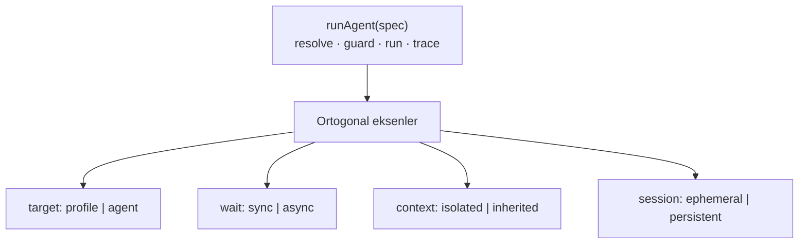
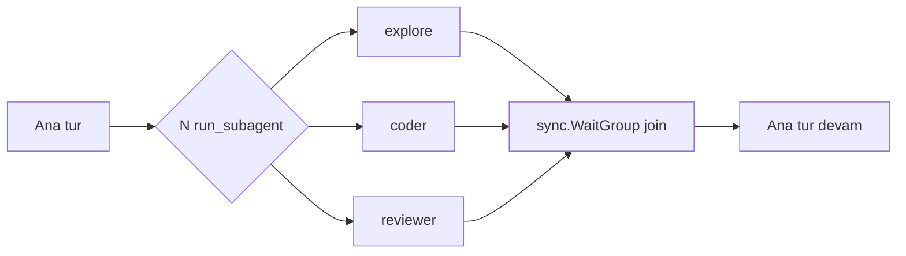

# 25 — Generic Ajan Yürütme Çekirdeği + Alt-Ajan (Subagent) İzolasyonu

> **Durum:** **UYGULANDI (2026-06-19).** Yol haritasında **Faz A2** — A2.0–A2.4
> tamamlandı, `go build`/`go vet`/`go test ./...` + frontend `tsc -b` yeşil.
> Erken notlarda `12-SUBAGENT-ISOLATION.md` adıyla anılmıştı; kalıcı numara **25**.

## Amaç

İki hedef tek tasarımda:

1. **Alt-ajan izolasyonu (A2):** Ana ajan, ana bağlamını kirletmeden **geçici**,
   **izole bağlamlı**, **tipli**, **paralel** alt-ajanlar başlatabilsin; alt-ajan
   işi kendi temiz bağlamında bitirip ana ajana **yalnız final sonucu** döndürsün.
   (Claude Code / External Agent `Task` aracının TionHarness karşılığı.)
2. **Primitif birleştirme:** Bugünkü üç çatallı çok-ajan primitifini
   (`call_agent`, `spawn_session`, `send_agent_message`) **tek generic çekirdeğe**
   indir; heartbeat kaldırıldıktan sonra anlamsız kalanı **sil**.

## Önemli bağlam: heartbeat kaldırıldı

Otonom **heartbeat ticker** uygulamadan çıkarılıyor/çıkarıldı. Geriye kalan
yürütme tetikleyicileri:

| Tetikleyici | Kaynak | Hâlâ geçerli? |
|-------------|--------|---------------|
| Kullanıcı sohbeti / `@mention` | `chat_stream.go` | ✅ |
| Scheduler (cron) | `agent/scheduler.go` | ✅ |
| `schedule_wake` (tek-atımlık self-wake timer) | `runtime.go ScheduleWake` (yalnız interaktif tur) | ✅ |
| `spawn` (detached arka plan turu) | `agent/spawn.go` (`go runSpawn`) | ✅ heartbeat'ten bağımsız |
| Flows (graf motoru) | `agent/flow.go` | ✅ |
| ~~Heartbeat ticker~~ | ~~periyodik otonom uyanma~~ | ❌ **kaldırıldı** |
| ~~`Wake(agentID)`~~ (çalışan heartbeat goroutine'ini dürtme) | ~~delegate.go~~ | ❌ **kaldırıldı** (working tree'de `r.Wake` çağrısı çıkarıldı) |

**Sonuç:** Bir ajanı "arka planda kendi kendine çalıştırmanın" tek yolu artık
**aktif bir tur başlatmak** (spawn / schedule / flow). Bir mesajı kuyruğa atıp
"bir ara işlenir" beklemek artık çalışmıyor — onu işleyecek döngü yok.

## Bu üç primitifin kaderi

| Primitif | Bugünkü model | Heartbeat sonrası | Karar |
|----------|---------------|-------------------|-------|
| `call_agent` | senkron, mevcut ajan, parent bağlamını miras alır | turla çalışır, etkilenmez | **Çekirdeğe katla** (flag kombinasyonu) |
| `spawn_session` | async detached, yeni kalıcı oturum | `go runSpawn` → etkilenmez | **Çekirdeğe katla** (`wait:async` modu) |
| `send_agent_message` | inbox'a yaz + `Wake` ile işlet | `Wake` gitti → **işleyici yok, ölü mektup** | **SİL** (gereksiz/kırık) |

`send_agent_message` neden silinir: heartbeat olmadan mesaj inbox'a düşer ama
hiçbir şey onu işlemez. "Bir ajana iş verip beklememe" ihtiyacı zaten
`wait:async` ile karşılanır (aktif tur başlatır). Yarı-kırık bir primitifi
generic sistemde taşımak anlamsız.

## Tasarım: tek generic çekirdek

Hepsi tek `runAgent(spec)` çekirdeği üstünde; davranış **ortogonal eksenlerle**
belirlenir:



| Eksen | Değerler | Anlam |
|-------|----------|-------|
| `target` | `profile` (ör. explore/coder/reviewer) **veya** mevcut ajan adı/id | Geçici tip mi, kalıcı ajan mı |
| `wait` | `sync` (varsayılan) / `async` | Cevabı bekle / detached arka plan |
| `context` | `isolated` (varsayılan) / `inherited` | Temiz bağlam / parent konuşmasını miras al |
| `session` | `ephemeral` (varsayılan) / `persistent` | İz parent'a gömülü / kendi oturumu feed'de |

> **Hedef çözümleme sırası (2026-07-03, fix):** `resolveSubagentTarget` **önce
> mevcut workspace ajanına** bakar, bulamazsa built-in profile (`explore`/`coder`/
> `reviewer`) düşer. Böylece kullanıcının **kendi adlandırdığı ajanı** aynı isimli
> bir profille **çakışmaz/gölgelenmez** — ör. gerçek bir "Reviewer" (AGTx) ajanı,
> built-in `reviewer` profiliyle örtüşse bile isimle çözülür. (Eskiden ters sıraydı;
> "Reviewer" gibi bir ajan `run_subagent` ile **async** çağrılamıyordu çünkü profil
> ephemeral'dı → `async subagents require an existing agent target, not a profile`.
> Regresyon: `TestResolveSubagentAgentBeatsProfile`.)
>
> **async + profile (ephemeral) geçersiz kombinasyon:** profilin kalıcı oturumu
> olmadığından `wait:async` bir profile verilemez; provider çözümlemesi/bütçe
> harcamasından **önce** açıklayıcı hatayla reddedilir (Guard 4). Profili async
> istiyorsan onu kalıcı bir ajana dönüştür ya da `wait:sync` kullan. Regresyon:
> `TestAsyncProfileRejected`.

Eski primitifler artık bu eksenlerin birer kombinasyonu:

| Eski | runAgent kombinasyonu |
|------|------------------------|
| **Alt-ajan (Task)** | `target:profile, wait:sync, context:isolated, session:ephemeral` |
| `call_agent` | `target:agent, wait:sync, context:inherited` |
| `spawn_session` | `target:agent, wait:async, session:persistent` |
| ~~`send_agent_message`~~ | (silindi — gerekirse `target:agent, wait:async`) |

## Tek araç yüzeyi: `run_subagent`

Generic tek araç. Model için sade; eksenler opsiyonel parametre (mantıklı
varsayılanlarla → en yaygın kullanım = izole senkron alt-ajan):

```jsonc
{
  "name": "run_subagent",
  "input": {
    "target": "explore",          // profil id VEYA mevcut ajan adı/id
    "task": "…",                  // serbest metin görev
    "wait": "sync",               // "sync" (vars.) | "async"
    "context": "isolated",        // "isolated" (vars.) | "inherited"
    "model": ""                   // opsiyonel model override
  }
}
```

- **Geri uyumluluk:** İstenirse `call_agent` ve `spawn_session` adları **ince
  alias** olarak bırakılabilir (aynı çekirdeğe sabit flag'lerle); ama generic
  hedef için **tercih: tek `run_subagent`**, diğer ikisi kaldırılır.
- **Paralel:** Tek turda birden çok `run_subagent` çağrısı eşzamanlı koşar.

## Yapılandırılmış görev sözleşmesi (objective / output_format / boundaries) — 2026-06-25

Anthropic'in [Multi-agent research system](https://www.anthropic.com/engineering/multi-agent-research-system)
rehberi: bir subagent'a **objective + output format + tool/source guidance + boundaries**
verilmezse iş tekrarı ve boşluk oluşur ("research the X" gibi belirsiz talimat →
ajanlar aynı işi yapar, boşluk bırakır). [Context-engineering](https://www.anthropic.com/engineering/effective-context-engineering-for-ai-agents)
makalesi de subagent'ın dar kapsamlı görev alıp **damıtılmış** (1–2K token) özet
döndürmesini ister.

Bu yüzden `run_subagent` şemasına **üç opsiyonel alan** eklendi:

```jsonc
{
  "target": "explore",
  "task": "Map how sessions are persisted.",
  "objective":     "Locate every read/write of session JSONL files",  // hedef (tek cümle)
  "output_format": "bulleted file:line list, one per call site",      // dönüş şekli
  "boundaries":    "only internal/db; no frontend; no code edits"     // kapsam sınırı
}
```

- **Enjeksiyon:** üçü de `RunAgentSpec`'e taşınır; `runAgent()` bunlardan bir
  **"Task contract"** bloğu üretir (`delegationContract()`, `subagent.go`) ve
  subagent system-prompt'una persona'dan **sonra** ekler (en spesifik talimat en sonda):

  ```
  ## Task contract
  This work was delegated to you. Honor every clause below; your single reply is all the caller sees.
  - Objective: <objective>
  - Output format: <output_format>
  - Boundaries (do NOT exceed): <boundaries>
  Stay strictly within the boundaries and return your result in exactly the requested output format.
  ```

- **Yalnız dolu alanlar** satır olur; **hiçbiri yoksa blok boştur** → eski düz-`task`
  davranışı bayt-bazında korunur (geriye-uyumlu).
- **Tool/source guidance** (4. alan) için yeni alan eklenmedi; TionHarness'da profil
  allowlist'leri (explore/coder/reviewer) + `task` bunu zaten karşılıyor.
- **Profil etkileşimi:** persona (kim olduğun) **kalır**, sözleşme (bu çağrıda ne/nasıl)
  altına eklenir — `explore` yine read-only davranır ama bu çağrının objective/format/
  boundaries'ini uygular. Named-agent hedefi için de aynı.
- **İki yol da** (native tool-loop + CLI köprüsü) `runAgent`'tan geçtiği için tek
  noktada enjeksiyon her iki yürütmeyi kapsar.
- **Native launcher gölgeleme (2026-06-25, fix):** claude-cli'ın kendi delegasyon
  aracı (eski sürüm `Task`, yeni sürüm `Agent`) çocuğu **tamamen CLI süreci içinde**
  başlatır → TionHarness'ya görünmez, bridged `run_subagent`'ı baypas eder (`subagent`
  trace yok, TionHarness ajan/profil hedefi yok, bütçe muhasebesi yok). `climcp.go::
  writeCLIMCPConfig` artık `--disallowedTools` ile `Task` + `Agent`'ı bastırır
  (`run_subagent` daima kurulu muadildir — 2026-07-02'den beri gate yok, görünürlük
  araç-bazlı). `TodoWrite`/`Skill` ile aynı gölgeleme sınıfı (bkz. `_Docs\36` native
  araç gölgeleme notu).
- **Açık karar (async):** sözleşme şu an yalnız **sync** dalda enjekte edilir (kritik
  izole-sync subagent senaryosu). `async` dal `SpawnSession`'a gider; istenirse
  ileride sözleşme `spec.Task` önüne eklenebilir.

## Çekirdek yapılar

```go
// internal/agent/subagent.go (yeni)

// AgentContext is one isolated execution scope. Shared infra (db, providers,
// registry, tunables) is borrowed by pointer from the root Runtime; only the
// request/messages are private to this scope (A2 selective-sharing).
type AgentContext struct {
    rt       *Runtime
    agent    db.Agent          // real agent OR ephemeral profile persona
    req      providers.Request // PRIVATE: clean (isolated) or cloned (inherited)
    callKind CallKind          // KindSubagent / KindSpawn
    deleg    delegState        // depth / visited / shared per-turn budget
}

type RunSpec struct {
    Target   string // profile id or existing agent ref
    Task     string
    Wait     RunWait    // sync | async
    Context  RunCtx     // isolated | inherited
    Session  RunSession // ephemeral | persistent
    Model    string
    ParentReq *providers.Request // only used when Context==inherited
}

type RunResult struct {
    AgentName string
    Reply     string // sync: final text; async: "" (handle in SessionID)
    SessionID string // persistent/async only
}

// runAgent is the single entry point. Sync returns the final text; async detaches
// (go) and returns a session handle, reusing spawn's slot + feed-event machinery.
func (r *Runtime) runAgent(ctx context.Context, spec RunSpec) (RunResult, error)
```

**Paylaşılan (root'a yazar):** db/store, providers, `tools.Registry`, tunables,
usage sayaçları, eşzamanlılık slotları. **İzole (parent'ı ezemez):**
`req.Messages`, alt-ajan transcript'i, bağlam penceresi.

### Profiller (tipler)

İlk sürümde kod sabiti; sonra `settings.json`'a taşınabilir. Mevcut ajanlar da
`target` olarak kullanılabilir.

```go
type SubagentProfile struct {
    ID           string   // "explore" | "coder" | "reviewer"
    SystemPrompt string
    AllowedTools []string // registry r.toolFilter ile kesişir
    Model        string   // "" = parent modeli
}
```

| Profil | Amaç | Allowlist (öneri) |
|--------|------|-------------------|
| `explore` | Salt-okunur keşif | Read, Glob, Grep, LS |
| `coder` | Kod yazma/düzenleme | + Write, Edit, Bash |
| `reviewer` | Bağımsız inceleme | Read, Glob, Grep (yazma yok) |

## Guard'lar (yeniden kullanım)

`agent/delegate.go`'daki guard'lar ortak helper'a çıkarılıp tüm modlarca paylaşılır:
- **depth** (`DefaultMaxDelegationDepth=3`) — iç içe alt-ajan derinliği
- **tur-başı bütçe** (`DefaultMaxDelegationCalls=8`) — fan-out freni (atomik sayaç)
- **visited-set** — cycle/self koruması (yalnız `target:agent` için anlamlı)
- **eşzamanlılık slotu** (`acquireSpawnSlot`/`SpawnMaxConcurrent`) — `wait:async` için

## Trace + UI: `subagent` StepKind

- `agent/trace.go`: `StepSubagent StepKind = "subagent"` + `TurnStep.SubSteps
  []TurnStep` (alt-ajan iz ağacı iç içe). E3 "kalan" maddesi bununla kapanır.
- `frontend/src/components/chat/SubagentStep.tsx` (yeni): katlanabilir iç içe ajan
  kartı (başlık = profil/ad + görev özeti; açılınca alt-adımlar). `lib/stepKinds.ts`
  + `lib/tools.ts` kaydı.

### Canlı kart (2026-08-21)

Her araç gibi `run_subagent` da çağrı başında generic `liveCard` açar. Kartın
`ID` değeri araç çağrısının `call.ID` değeridir ve `Running: true` taşır.
`subStepSink`, alt-ajanın her adımında aynı kartı biriken `SubSteps` ile
`liveCard.Update` üzerinden yeniler; paralel fan-out emitleri ortak serileştirilmiş
kanaldan geçer.

Bitişte nihai `StepSubagent` aynı ID ile yayınlanır, `Running`/`Append` taşımaz ve
canlı kartı yerinde değiştirir. İptal veya panic nedeniyle final kartı gelemiyorsa
`StepTombstone` kartı geri çeker. "çalışıyor…" rozeti subagent'a özel değildir;
`TurnSteps` bütün `Running` adımlarına generic olarak uygular. Genel sözleşme için
bkz. [07-CHAT-UX.md](07-CHAT-UX.md#canlı-adım-kartı-sözleşmesi-2026-08-21).

## Paralel fan-out



Native döngü (`toolloop.go`) tek turda çoklu `tool_use` döndürür; bunlar goroutine
+ `sync.WaitGroup` ile paralel; ortak `*calls` ve slot sayaçları atomik. Üst sınır
`min(SpawnMaxConcurrent, DelegationMaxCalls)`.

## Dosya haritası

| Dosya | Tür | İş |
|-------|-----|-----|
| `internal/agent/subagent.go` | **yeni** | `AgentContext`, `RunSpec`, `runAgent`, profiller, paralel fan-out |
| `internal/tools/subagent.go` | **yeni** | tek `run_subagent` tool def + `WithRunAgent(ctx, fn)` |
| `internal/agent/delegate.go` | **düzenle/küçült** | guard'ları ortak helper'a çıkar; `call_agent` runner'ı `runAgent`'a delege (veya kaldır); `SendAgentMessage` **sil** |
| `internal/tools/delegate.go` | **kaldır/sadeleş** | `call_agent` ya alias ya silinir |
| `internal/tools/builtin_spawn.go` | **kaldır/alias** | `spawn_session` → `runAgent(wait:async)` |
| `internal/agent/spawn.go` | **düzenle** | detached koşu + feed-event çekirdeğe taşınır (`wait:async` yolu) |
| `internal/tools/builtin_agentmsg.go` | **SİL** | `send_agent_message` kaldırılır |
| `internal/agent/callkind.go` + `internal/db/` | düzenle | `KindSubagent` / `UsageKindSubagent` |
| `internal/agent/trace.go` | düzenle | `StepSubagent` + `TurnStep.SubSteps` |
| `internal/agent/toolloop.go` | düzenle | çoklu `tool_use` paralel; subagent iz gömme |
| `internal/agent/toolsetup.go` | düzenle | tek `run_subagent` kaydı; eski 3 kaydın çıkarılması |
| `internal/agent/tunables.go` | düzenle | guard tunable'larını paylaş (`Subagent*` veya mevcut delegation/spawn alanları) |
| `frontend/src/components/chat/SubagentStep.tsx` | **yeni** | iç içe katlanabilir kart |
| `frontend/src/lib/{stepKinds,tools}.ts`, `types/*.ts` | düzenle | `subagent` kind + `run_subagent` |

> **Dokümantasyon temizliği ✅ (tamamlandı):** `00-GENEL-BAKIS`, `05-ILERLEME`,
> `24-SELF-MANAGEMENT` ve proje SKILL'inde artık "heartbeat/`Wake`/`send_agent_message`"
> referansı yok; otonomi anlatımı scheduler + `schedule_wake` + `spawn` + flows'a
> dayandırıldı. `tionharness-autonomous-ops` ve `tionharness-self-management` skill'lerinde
> kalan tek geçiş bilinçli **negatif ifadedir** ("heartbeat ticker yoktur",
> "`send_agent_message` diye ayrı bir araç yoktur") — korunmalıdır.

## Fazlama

- **A2.0 ✅ — Çekirdek + guard birleştirme.** `AgentContext` + `runAgent`;
  `delegate.go` guard'larını ortak helper'a çıkar (davranış korunur).
- **A2.1 ✅ — `run_subagent` (profil · izole · senkron) + profiller.** Çekirdek değer.
- **A2.2 ✅ — Paralel fan-out.**
- **A2.3 ✅ — `subagent` StepKind + iç içe UI.**
- **A2.4 ✅ — Birleştirme/temizlik:** `call_agent` kaldırıldı; `spawn_session` native
  tool'dan kaldırıldı (`run_subagent` async moduna taşındı); `send_agent_message`
  **silindi**; heartbeat dokümanları arındırıldı.

> Her faz ayrı atomik commit + `go build`/`vet`/`test ./...` + frontend `tsc` yeşil.

## Test planı

- `agent/subagent_test.go`: izolasyon (alt-ajan parent mesajlarını görmez), guard
  (depth/budget/visited), profil çözümleme, ephemeral ajan kalıcı olmaz, `wait:async`
  detached + feed-event.
- `agent/delegate_test.go`: `call_agent` davranışı (alias/inherit) refactor sonrası
  yeşil — geri uyumluluk kanıtı (alias bırakılırsa).
- `send_agent_message` testleri **kaldırılır**.
- Paralel: N alt-ajan eşzamanlı + ortak bütçe sayacı atomikliği (race detector).
- `trace_test.go`: `StepSubagent` + `SubSteps` JSON round-trip.

## Riskler / açık sorular

1. **Geri uyumluluk:** `call_agent`/`spawn_session` adları alias olarak kalsın mı,
   yoksa tamamen `run_subagent`'a mı taşınsın? **Öneri:** generic hedef için ikisini
   de kaldır, tek `run_subagent`; istenirse kısa geçiş dönemi alias'ı.
2. **`send_agent_message` peer-mesajlaşma:** Silince "ajana not bırak" senaryosu
   `wait:async` ile karşılanır (aktif tur başlatır). Eğer ileride gerçek bir
   asenkron işleyici (örn. inbox'ı tarayan scheduler job'u) gelirse yeniden
   değerlendirilir.
3. **Bütçe muhasebesi:** alt-ajan token'ları aynı ajan-kimliğine yazılır
   (paylaşılan altyapı), `KindSubagent` ile ayrıştırılır.
4. **Ephemeral kalıcılık:** `run_subagent` (sync/ephemeral) ayrı session açmaz;
   iz parent turunun `SubSteps`'inde gömülü. `wait:async` ise kalıcı session açar.
5. **İptal yayılımı (A3):** parent iptalinde alt-ajanlara sentetik `cancelled`
   (`toolloop.go fillCancelledResults` zaten var).
6. **Profil kaynağı:** önce kod sabiti (A2.1), sonra `settings.json`.

## İlgili dokümanlar
- `10-KAVRAMSAL-TASARIM-NOTLARI.md` §A2/A3, E3 (subagent StepKind)
- `03-YOL-HARITASI.md` A2 maddesi
- `22-SPAWN-SESSION.md` (spawn primitifi — `wait:async` moduna evrilir)
- `24-SELF-MANAGEMENT.md` (call_agent/send_agent_message araç yüzeyi — güncellenecek)
- `20-SCHEDULE-WAKE.md` (heartbeat sonrası kalan otonomi tetikleyicisi)
