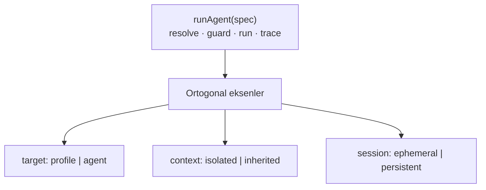
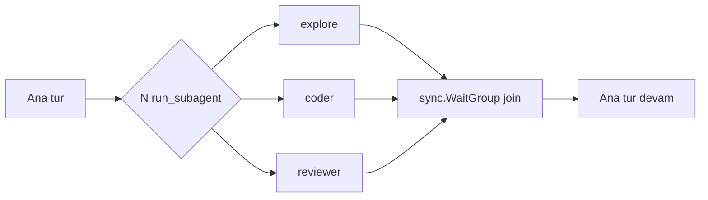

# 25 — Generic Ajan Yürütme Çekirdeği + Alt-Ajan (Subagent) İzolasyonu

> **Durum:** **UYGULANDI (2026-06-19).** Yol haritasında **Faz A2** — A2.0–A2.4
> tamamlandı, `go build`/`go vet`/`go test ./...` + frontend `tsc -b` yeşil.
> Erken notlarda `12-SUBAGENT-ISOLATION.md` adıyla anılmıştı; kalıcı numara **25**.
>
> **Özet (2026-09-06):** `run_subagent` tek generic alt-ajan primitifidir: izole ya
> da miras bağlam, yerleşik profil ya da mevcut ajan, bloklayan çağrı, geri dönen
> yalnız final sonuç + artifact **referansları**. Tek çağrıdan **fan-out/fan-in**
> (`tasks[]` + `strategy` + `max_concurrency`) destekler; stratejiler iki ailedir:
> *toplayıcı* (`all`, `first-success` — bacakları raporlar) ve *seçici*
> (`majority`, `reviewer-selects` — birini kazanan ilan edip yalnız onun yanıtını
> basar, TSK835). Bütçe/derinlik/döngü guard'ları tek yerde (`runAgent`); her
> çakışma öncelik kuralı değil **hata**dır.

## Amaç

İki hedef tek tasarımda:

1. **Alt-ajan izolasyonu (A2):** Ana ajan, ana bağlamını kirletmeden **geçici**,
   **izole bağlamlı**, **tipli**, **paralel** alt-ajanlar başlatabilsin; alt-ajan
   işi kendi temiz bağlamında bitirip ana ajana **yalnız final sonucu** döndürsün.
   (Claude Code / External Agent `Task` aracının TionHarness karşılığı.)
2. **Primitif birleştirme:** Bugünkü üç çatallı çok-ajan primitifini
   (`call_agent`, `spawn_session`, `send_agent_message`) **tek generic çekirdeğe**
   indir; heartbeat kaldırıldıktan sonra anlamsız kalanı **sil**.

## Önemli bağlam: heartbeat kaldırıldı

Otonom **heartbeat ticker** uygulamadan çıkarılıyor/çıkarıldı. Geriye kalan
yürütme tetikleyicileri:

| Tetikleyici | Kaynak | Hâlâ geçerli? |
|-------------|--------|---------------|
| Kullanıcı sohbeti / `@mention` | `chat_stream.go` | ✅ |
| Scheduler (cron) | `agent/scheduler.go` | ✅ |
| `schedule_wake` (tek-atımlık self-wake timer) | `runtime.go ScheduleWake` (yalnız interaktif tur) | ✅ |
| `spawn` (detached arka plan turu) | `agent/spawn.go` (`go runSpawn`) | ✅ heartbeat'ten bağımsız |
| Flows (graf motoru) | `agent/flow.go` | ✅ |
| ~~Heartbeat ticker~~ | ~~periyodik otonom uyanma~~ | ❌ **kaldırıldı** |
| ~~`Wake(agentID)`~~ (çalışan heartbeat goroutine'ini dürtme) | ~~delegate.go~~ | ❌ **kaldırıldı** (working tree'de `r.Wake` çağrısı çıkarıldı) |

**Sonuç:** Bir ajanı "arka planda kendi kendine çalıştırmanın" tek yolu artık
**aktif bir tur başlatmak** (spawn / schedule / flow). Bir mesajı kuyruğa atıp
"bir ara işlenir" beklemek artık çalışmıyor — onu işleyecek döngü yok.

## Bu üç primitifin kaderi

| Primitif | Bugünkü model | Heartbeat sonrası | Karar |
|----------|---------------|-------------------|-------|
| `call_agent` | senkron, mevcut ajan, parent bağlamını miras alır | turla çalışır, etkilenmez | **Çekirdeğe katla** (flag kombinasyonu) |
| `spawn_session` | async detached, yeni kalıcı oturum | `go runSpawn` → etkilenmez | **SİL** (native yüzeyden kaldırıldı; yerine `spawn_worker`) |
| `send_agent_message` | inbox'a yaz + `Wake` ile işlet | `Wake` gitti → **işleyici yok, ölü mektup** | **SİL** (gereksiz/kırık) |

`send_agent_message` neden silinir: heartbeat olmadan mesaj inbox'a düşer ama
hiçbir şey onu işlemez. "Bir ajana iş verip beklememe" ihtiyacı koordinatör
modundaki `spawn_worker` ile karşılanır (aktif tur başlatır). Yarı-kırık bir
primitifi generic sistemde taşımak anlamsız.

## Tasarım: tek generic çekirdek

Hepsi tek `runAgent(spec)` çekirdeği üstünde; davranış **ortogonal eksenlerle**
belirlenir:



| Eksen | Değerler | Anlam |
|-------|----------|-------|
| `target` | `profile` (ör. explore/coder/reviewer) **veya** mevcut ajan adı/id | Geçici tip mi, kalıcı ajan mı |
| `context` | `isolated` (varsayılan) / `inherited` | Temiz bağlam / parent konuşmasını miras al |
| `session` | `ephemeral` (varsayılan) / `persistent` | İz parent'a gömülü / kendi oturumu feed'de |

**Bekleme ekseni yoktur: `run_subagent` daima senkrondur.** Çağrı, alt-ajan
bitene kadar bloklar ve final metnini döndürür; detached/arka plan modu yoktur.
Geçiş dönemi boyunca no-op olarak kabul edilen `wait` alanı **2026-09-06'da
şemadan tamamen kaldırıldı** (TSK747); araç girdisinde böyle bir eksen yoktur.
Turdan uzun sürecek iş için ya görev kendi içinde
tamamlanan birkaç küçük `run_subagent` çağrısına bölünür ya da koordinatör moduna
geçilip (`set_coordinator_mode`) `spawn_worker` ile arka plan işçisi başlatılır.

> **Hedef çözümleme sırası (2026-07-03, fix):** `resolveSubagentTarget` **önce
> mevcut workspace ajanına** bakar, bulamazsa built-in profile (`explore`/`coder`/
> `reviewer`) düşer. Böylece kullanıcının **kendi adlandırdığı ajanı** aynı isimli
> bir profille **çakışmaz/gölgelenmez** — ör. gerçek bir "Reviewer" (AGTx) ajanı,
> built-in `reviewer` profiliyle örtüşse bile isimle çözülür. Regresyon:
> `TestResolveSubagentAgentBeatsProfile`.

Eski primitifler artık bu eksenlerin birer kombinasyonu:

| Eski | runAgent kombinasyonu |
|------|------------------------|
| **Alt-ajan (Task)** | `target:profile, context:isolated, session:ephemeral` |
| `call_agent` | `target:agent, context:inherited` |
| ~~`spawn_session`~~ | (native yüzeyden silindi — arka plan için `spawn_worker`) |
| ~~`send_agent_message`~~ | (silindi — arka plan için `spawn_worker`) |

## Tek araç yüzeyi: `run_subagent`

Generic tek araç. Model için sade; eksenler opsiyonel parametre (mantıklı
varsayılanlarla → en yaygın kullanım = izole senkron alt-ajan):

```jsonc
{
  "name": "run_subagent",
  "input": {
    "target": "explore",          // profil id VEYA mevcut ajan adı/id
    "task": "…",                  // serbest metin görev
    "context": "isolated",        // "isolated" (vars.) | "inherited"
    "model": ""                   // opsiyonel model override
  }
}
```

- **Geri uyumluluk:** İstenirse `call_agent` ve `spawn_session` adları **ince
  alias** olarak bırakılabilir (aynı çekirdeğe sabit flag'lerle); ama generic
  hedef için **tercih: tek `run_subagent`**, diğer ikisi kaldırılır.
- **Paralel:** Tek turda birden çok `run_subagent` çağrısı eşzamanlı koşar.

## Yapılandırılmış görev sözleşmesi (objective / output_format / boundaries) — 2026-06-25

Anthropic'in [Multi-agent research system](https://www.anthropic.com/engineering/multi-agent-research-system)
rehberi: bir subagent'a **objective + output format + tool/source guidance + boundaries**
verilmezse iş tekrarı ve boşluk oluşur ("research the X" gibi belirsiz talimat →
ajanlar aynı işi yapar, boşluk bırakır). [Context-engineering](https://www.anthropic.com/engineering/effective-context-engineering-for-ai-agents)
makalesi de subagent'ın dar kapsamlı görev alıp **damıtılmış** (1–2K token) özet
döndürmesini ister.

Bu yüzden `run_subagent` şemasına **üç opsiyonel alan** eklendi:

```jsonc
{
  "target": "explore",
  "task": "Map how sessions are persisted.",
  "objective":     "Locate every read/write of session JSONL files",  // hedef (tek cümle)
  "output_format": "bulleted file:line list, one per call site",      // dönüş şekli
  "boundaries":    "only internal/db; no frontend; no code edits"     // kapsam sınırı
}
```

- **Enjeksiyon:** üçü de `RunAgentSpec`'e taşınır; `runAgent()` bunlardan bir
  **"Task contract"** bloğu üretir (`delegationContract()`, `subagent.go`) ve
  subagent system-prompt'una persona'dan **sonra** ekler (en spesifik talimat en sonda):

  ```
  ## Task contract
  This work was delegated to you. Honor every clause below; your single reply is all the caller sees.
  - Objective: <objective>
  - Output format: <output_format>
  - Boundaries (do NOT exceed): <boundaries>
  Stay strictly within the boundaries and return your result in exactly the requested output format.
  ```

- **Yalnız dolu alanlar** satır olur; **hiçbiri yoksa blok boştur** → eski düz-`task`
  davranışı bayt-bazında korunur (geriye-uyumlu).
- **Tool/source guidance** (4. alan) için yeni alan eklenmedi; TionHarness'te profil
  allowlist'leri (explore/coder/reviewer) + `task` bunu zaten karşılıyor.
- **Profil etkileşimi:** persona (kim olduğun) **kalır**, sözleşme (bu çağrıda ne/nasıl)
  altına eklenir — `explore` yine read-only davranır ama bu çağrının objective/format/
  boundaries'ini uygular. Named-agent hedefi için de aynı.
- **İki yol da** (native tool-loop + CLI köprüsü) `runAgent`'tan geçtiği için tek
  noktada enjeksiyon her iki yürütmeyi kapsar.
- **Native launcher gölgeleme (2026-06-25, fix):** claude-cli'ın kendi delegasyon
  aracı (eski sürüm `Task`, yeni sürüm `Agent`) çocuğu **tamamen CLI süreci içinde**
  başlatır → TionHarness'e görünmez, bridged `run_subagent`'ı baypas eder (`subagent`
  trace yok, TionHarness ajan/profil hedefi yok, bütçe muhasebesi yok). `climcp.go::
  writeCLIMCPConfig` artık `--disallowedTools` ile `Task` + `Agent`'ı bastırır
  (`run_subagent` daima kurulu muadildir — 2026-07-02'den beri gate yok, görünürlük
  araç-bazlı). `TodoWrite`/`Skill` ile aynı gölgeleme sınıfı (bkz. `_Docs\36` native
  araç gölgeleme notu).
- **Tek dal:** `run_subagent` senkron olduğundan sözleşme enjeksiyonunun tek bir
  yolu vardır; koşullu/atlanabilir bir dal yoktur.

## Çekirdek yapılar

```go
// internal/agent/subagent.go (yeni)

// AgentContext is one isolated execution scope. Shared infra (db, providers,
// registry, tunables) is borrowed by pointer from the root Runtime; only the
// request/messages are private to this scope (A2 selective-sharing).
type AgentContext struct {
    rt       *Runtime
    agent    db.Agent          // real agent OR ephemeral profile persona
    req      providers.Request // PRIVATE: clean (isolated) or cloned (inherited)
    callKind CallKind          // KindSubagent / KindSpawn
    deleg    delegState        // depth / visited / shared per-turn budget
}

type RunSpec struct {
    Target   string // profile id or existing agent ref
    Task     string
    Context  RunCtx     // isolated | inherited
    Session  RunSession // ephemeral | persistent
    Model    string
    ParentReq *providers.Request // only used when Context==inherited
}

type RunResult struct {
    AgentName string
    Reply     string // the subagent's final text
}

// runAgent is the single entry point. It always runs the subagent to completion
// and returns its final text; there is no detached mode.
func (r *Runtime) runAgent(ctx context.Context, spec RunSpec) (RunResult, error)
```

**Paylaşılan (root'a yazar):** db/store, providers, `tools.Registry`, tunables,
usage sayaçları, eşzamanlılık slotları. **İzole (parent'ı ezemez):**
`req.Messages`, alt-ajan transcript'i, bağlam penceresi.

### Profiller (tipler)

İlk sürümde kod sabiti; sonra `settings.json`'a taşınabilir. Mevcut ajanlar da
`target` olarak kullanılabilir.

```go
type SubagentProfile struct {
    ID           string   // "explore" | "coder" | "reviewer"
    SystemPrompt string
    AllowedTools []string // registry r.toolFilter ile kesişir
    Model        string   // "" = parent modeli
}
```

| Profil | Amaç | Allowlist (öneri) |
|--------|------|-------------------|
| `explore` | Salt-okunur keşif | Read, Glob, Grep, LS |
| `coder` | Kod yazma/düzenleme | + Write, Edit, Bash |
| `reviewer` | Bağımsız inceleme | Read, Glob, Grep (yazma yok) |

**Allowlist'ten muaf iki yüzey.** Profilin `AllowedTools` listesi yalnız **iş**
araçlarını tarif eder. `toolFilter` iki grubu allowlist'e bakmadan geçirir:
koordinasyon araçları (`tools.IsCoordinationTool` — oturum-kapılı) ve skill-keşif
araçları (`tools.IsSkillTool` = `use_skill`, `skill_search`). Skill muafiyetinin
sebebi, sistem promptunun "# Available Skills" bloğunu her ajana basıp skill
yüklemesini söylemesi; allowlist'li bir profil aracı göremeyince skill'i sessizce
atlıyordu. Muafiyet yalnız allowlist'i atlar — workspace düzeyinde kapatılmış veya
ajanın denylist'inde olan bir skill aracı hâlâ engellidir. Katman sırası ve gerekçe:
`_Docs/47-KOORDINATOR-COKLU-AJAN.md` §15.5–15.7.

## Guard'lar (yeniden kullanım)

`agent/delegate.go`'daki guard'lar ortak helper'a çıkarılıp tüm modlarca paylaşılır:
- **depth** (`DefaultMaxDelegationDepth=3`) — iç içe alt-ajan derinliği
- **tur-başı bütçe** (`DefaultMaxDelegationCalls=8`) — fan-out freni (atomik sayaç)
- **visited-set** — cycle/self koruması (yalnız `target:agent` için anlamlı)
- **eşzamanlılık slotu** (`acquireSpawnSlot`/`SpawnMaxConcurrent`) — detached spawn
  yüzeyi (`spawn_worker`, köprülenen `spawn_session`, flow/otomasyon) için

## Trace + UI: `subagent` StepKind

- `agent/trace.go`: `StepSubagent StepKind = "subagent"` + `TurnStep.SubSteps
  []TurnStep` (alt-ajan iz ağacı iç içe). E3 "kalan" maddesi bununla kapanır.
- `frontend/src/features/chat/SubagentStep.tsx` (yeni): katlanabilir iç içe ajan
  kartı (başlık = profil/ad + görev özeti; açılınca alt-adımlar).
  `shared/stepKinds.ts` + `features/chat/tools.ts` kaydı.

### Canlı kart (2026-08-21)

Her araç gibi `run_subagent` da çağrı başında generic `liveCard` açar. Kartın
`ID` değeri araç çağrısının `call.ID` değeridir ve `Running: true` taşır.
`subStepSink`, alt-ajanın her adımında aynı kartı biriken `SubSteps` ile
`liveCard.Update` üzerinden yeniler; paralel fan-out emitleri ortak serileştirilmiş
kanaldan geçer.

Bitişte nihai `StepSubagent` aynı ID ile yayınlanır, `Running`/`Append` taşımaz ve
canlı kartı yerinde değiştirir. İptal veya panic nedeniyle final kartı gelemiyorsa
`StepTombstone` kartı geri çeker. "çalışıyor…" rozeti subagent'a özel değildir;
`TurnSteps` bütün `Running` adımlarına generic olarak uygular. Genel sözleşme için
bkz. [07-CHAT-UX.md](07-CHAT-UX.md#canlı-adım-kartı-sözleşmesi-2026-08-21).

## Paralel fan-out



Native döngü (`toolloop.go`) tek turda çoklu `tool_use` döndürür; bunlar goroutine
+ `sync.WaitGroup` ile paralel; ortak `*calls` ve slot sayaçları atomik. Üst sınır
`min(SpawnMaxConcurrent, DelegationMaxCalls)`.

## Dosya haritası

| Dosya | Tür | İş |
|-------|-----|-----|
| `internal/agent/subagent.go` | **yeni** | `AgentContext`, `RunSpec`, `runAgent`, profiller, paralel fan-out |
| `internal/tools/subagent.go` | **yeni** | tek `run_subagent` tool def + `WithRunAgent(ctx, fn)` |
| `internal/agent/delegate.go` | **düzenle/küçült** | guard'ları ortak helper'a çıkar; `call_agent` runner'ı `runAgent`'a delege (veya kaldır); `SendAgentMessage` **sil** |
| `internal/tools/delegate.go` | **kaldır/sadeleş** | `call_agent` ya alias ya silinir |
| `internal/tools/builtin_spawn.go` | **kaldır** | `spawn_session` native yüzeyden çıkar |
| `internal/agent/spawn.go` | **düzenle** | detached koşu + feed-event ortak `launchSpawn`'a taşınır (`spawn_worker`/köprü/flow yolu) |
| `internal/tools/builtin_agentmsg.go` | **SİL** | `send_agent_message` kaldırılır |
| `internal/agent/callkind.go` + `internal/db/` | düzenle | `KindSubagent` / `UsageKindSubagent` |
| `internal/agent/trace.go` | düzenle | `StepSubagent` + `TurnStep.SubSteps` |
| `internal/agent/toolloop.go` | düzenle | çoklu `tool_use` paralel; subagent iz gömme |
| `internal/agent/toolsetup.go` | düzenle | tek `run_subagent` kaydı; eski 3 kaydın çıkarılması |
| `internal/agent/tunables.go` | düzenle | guard tunable'larını paylaş (`Subagent*` veya mevcut delegation/spawn alanları) |
| `frontend/src/features/chat/SubagentStep.tsx` | **yeni** | iç içe katlanabilir kart |
| `frontend/src/shared/stepKinds.ts`, `frontend/src/features/chat/tools.ts`, `types/*.ts` | düzenle | `subagent` kind + `run_subagent` |

> **Dokümantasyon temizliği ✅ (tamamlandı):** `00-GENEL-BAKIS`, `05-ILERLEME`,
> `24-SELF-MANAGEMENT` ve proje SKILL'inde artık "heartbeat/`Wake`/`send_agent_message`"
> referansı yok; otonomi anlatımı scheduler + `schedule_wake` + `spawn` + flows'a
> dayandırıldı. `tionharness-autonomous-ops` ve `tionharness-self-management` skill'lerinde
> kalan tek geçiş bilinçli **negatif ifadedir** ("heartbeat ticker yoktur",
> "`send_agent_message` diye ayrı bir araç yoktur") — korunmalıdır.

## Fazlama

- **A2.0 ✅ — Çekirdek + guard birleştirme.** `AgentContext` + `runAgent`;
  `delegate.go` guard'larını ortak helper'a çıkar (davranış korunur).
- **A2.1 ✅ — `run_subagent` (profil · izole · senkron) + profiller.** Çekirdek değer.
- **A2.2 ✅ — Paralel fan-out.**
- **A2.3 ✅ — `subagent` StepKind + iç içe UI.**
- **A2.4 ✅ — Birleştirme/temizlik:** `call_agent` kaldırıldı; `spawn_session` native
  tool'dan kaldırıldı; `send_agent_message` **silindi**; heartbeat dokümanları
  arındırıldı. (Bu adımda `run_subagent`'a eklenen async modu daha sonra tekrar
  kaldırıldı — aşağıdaki "Senkron-tek mod" bölümü.)

> Her faz ayrı atomik commit + `go build`/`vet`/`test ./...` + frontend `tsc` yeşil.

## Test planı

- `agent/subagent_test.go`: izolasyon (alt-ajan parent mesajlarını görmez), guard
  (depth/budget/visited), profil çözümleme, ephemeral ajan kalıcı olmaz.
- `agent/delegate_test.go`: `call_agent` davranışı (alias/inherit) refactor sonrası
  yeşil — geri uyumluluk kanıtı (alias bırakılırsa).
- `send_agent_message` testleri **kaldırılır**.
- Paralel: N alt-ajan eşzamanlı + ortak bütçe sayacı atomikliği (race detector).
- `trace_test.go`: `StepSubagent` + `SubSteps` JSON round-trip.

## Riskler / açık sorular

1. **Geri uyumluluk:** `call_agent`/`spawn_session` adları alias olarak kalsın mı,
   yoksa tamamen `run_subagent`'a mı taşınsın? **Öneri:** generic hedef için ikisini
   de kaldır, tek `run_subagent`; istenirse kısa geçiş dönemi alias'ı.
2. **`send_agent_message` peer-mesajlaşma:** Silince "ajana not bırak" senaryosu
   koordinatör modundaki `spawn_worker` ile karşılanır (aktif tur başlatır).
   Eğer ileride gerçek bir
   asenkron işleyici (örn. inbox'ı tarayan scheduler job'u) gelirse yeniden
   değerlendirilir.
3. **Bütçe muhasebesi:** alt-ajan token'ları aynı ajan-kimliğine yazılır
   (paylaşılan altyapı), `KindSubagent` ile ayrıştırılır.
4. **Ephemeral kalıcılık:** `run_subagent` (ephemeral) ayrı session açmaz;
   iz parent turunun `SubSteps`'inde gömülü. Kalıcı ajan hedefi kendi child
   oturumunu açar.
5. **İptal yayılımı (A3):** parent iptalinde alt-ajanlara sentetik `cancelled`
   (`toolloop.go fillCancelledResults` zaten var).
6. **Profil kaynağı:** önce kod sabiti (A2.1), sonra `settings.json`.

## Kalıcı child session gözlemlenebilirliği (2026-08-30)

Kalıcı `subagent` session detayında hedef (`targetProfile` / `targetAgentId`),
`contextMode`, parent bağlantısı, `executionType` / `category`, `runState` ve
terminal işareti gösterilir. Assistant mesajlarından süre, giriş/çıkış tokenları,
stop reason ve kalıcı `TurnStep` sayısı türetilir; session header'daki araç çağrı
sayısı aynı kartta sunulur. Hata özeti yalnız kararlı `TurnStep.reason` değeridir.
Ham hata metni ile tool input/output detail API'ye kopyalanmaz; internal child
transcript görünürlüğü böylece genişlemez. Legacy session alanları ve handoff parent
bağlantısı korunur.

Child oluşturma ile çalıştırma başlangıcı arasında yarım kalmış `running` satırı
bırakılmaz. Subagent ve spawn yolları aynı başlangıç kapısını kullanır: önce açılış
user mesajı kalıcılaşır, sonra `runState="running"` yazılır. İki yazımdan biri başarısızsa
provider çağrısı/goroutine başlamaz, child `failed` yapılır ve asıl hata ile olası
terminal-state yazım hatası birlikte çağırana ve loga taşınır. Böylece disk hatası,
iptal veya spawn başlangıç hatası Activity görünümünde sonsuza dek çalışan child
üretmez; terminal sonuç yazımı başarısız olduğunda da `failed` yazımı denenir ve
iki hata birlikte raporlanır. Depolama bütünüyle yazılamıyorsa son kalıcı durum
değiştirilemez, fakat hata sessiz kalmaz.

## Child oturum başlığı ebeveyni adlandırıyor (TSK727, 2026-09-06)

Kalıcı bir child oturumun başlığı tek yerde, `subagentTitle`
(`internal/agent/subagent.go`) içinde kurulur ve üç parçadan oluşur:
`🧩 <ajan ya da profil> — <kısa görev> ⤴ <köken>`.

- **Köken parçasını** `subagentParentRef` çözer: ebeveyn oturumun başlığı varsa o
  kullanılır, yoksa ebeveyn oturum kimliği (`SES42`); ebeveyn hiç yoksa parça
  tümden düşer — boş bir `⤴` bırakılmaz.
- **Uzun ebeveyn başlığı** `maxParentRefRunes = 28` ile rune bazında kırpılır:
  köken çocuğun kendi görev metnini listede dışarı itmemelidir.
- **Ebeveyn okuması başarısız olursa** hata yutulmaz — `logger.Warn` yazılır ve
  başlık kimliğe düşer; delegasyon bu yüzden iptal edilmez.

Örnekler: `🧩 Kâşif — graf taramasını çalıştır ⤴ Rota ekranı düzeltmesi`,
`🧩 Kâşif — testi düzelt ⤴ SES42`, `🧩 Kâşif — testi düzelt`.

Neden: aynı ajana arka arkaya verilen benzer işler oturum listesinde neredeyse
aynı satırı üretiyordu; köken parçası satırı oturum detayına girmeden ayırt
edilebilir kılar. Testler: `internal/agent/subagent_title_test.go`.

## Senkron-tek mod (async ve `stop_subagent` kaldırıldı)

`run_subagent` artık **her zaman senkron** çalışır ve `stop_subagent` aracı
silindi. Geçiş sürümünde no-op olarak kabul edilen `wait` alanı **2026-09-06'da
(TSK747) şemadan, girdi yapısından ve doğrulamadan tamamen silindi**. Alan
kaldırıldığında geriye dönük bir kırılma oluşmaz: araç girdisi
`encoding/json`'un varsayılan gevşek çözümlemesiyle okunur
(`internal/tools/toolbuilder.go:25`), dolayısıyla donmuş bir prompt epoch'undan
gelen fazladan bir `wait` anahtarı hata üretmez, sessizce yok sayılır. Ayrıca
donmuş araç şemaları yalnız bellekte tutulur — `prompt_epoch.json` yan
dosyasında araç dizisi kalıcılaşmadığı için yeniden başlatmadan sonra şema her
zaman canlı kayıttan üretilir.

Gerekçe: durdurulabilir bir alt-ajan koşusunun tek üreticisi async daldı. Senkron
çağıran, çocuğu koşarken araç çağrısının içinde bloklu bekler; o turda ikinci bir
araç çağrısı — dolayısıyla bir iptal çağrısı — yayınlayamaz. Async gidince
`stop_subagent`'ın hedefleyebileceği erişilebilir bir koşu kalmadı; araç dar
değil, ölü hale geldi. (Koordinatör işçileri `Kind="worker"` taşır ve ayrı bir
araçla — `stop_worker` — durdurulur; bu kaldırmadan etkilenmez.)

Turdan uzun sürebilecek iş için doğru yanıt artık ikiden biridir: işi kendi
içinde tamamlanan birkaç küçük `run_subagent` çağrısına böl, ya da koordinatör
moduna geç (`set_coordinator_mode`) ve
`spawn_worker` ile arka planda koştur. Spawn guard'ları (`SpawnMaxConcurrent`,
`SpawnQueueMax`, `SpawnMaxPerTurn`, `SpawnTimeoutMin`) ve `launchSpawn`'ın iptal
kaydı **yerinde kalır** — hâlâ `spawn_worker`'a, köprülenen `spawn_session`'a,
peer mesajlarına, otomasyonlara ve flow'lara hizmet ederler.

## Yeniden deneme (TSK597, 2026-08-31)

### `retry_of` — denemeleri zincirleme

`run_subagent`'a `retry_of` alanı eklendi. Yeniden deneme **oturumu tekrar
kullanmaz**: başarısız transkript, ikinci denemenin değip değmediğini yargılamak
için gereken şeydir, bu yüzden dokunulmadan kalır ve yeni koşu ona bağlı taze bir
child olur. `db.Session` iki alan kazandı:

- `RetryOfSessionID` — **bir önceki** denemeyi işaret eder (ilkini değil), böylece
  geriye yürüyünce zincir sırayla kurulur.
- `Attempt` — zincirdeki sıra numarası (ilk deneme 1). Tek satır okunduğunda
  "bu 3. deneme" bilgisi zinciri yürümeden görünsün diye vardır.

Retry olmayan koşu **damgalanmaz** (`Attempt` 0 kalır): "retry zincirinin parçası"
tek bir okunur koşul olarak kalsın ve mevcut hiçbir `session.json` sahip olmadığı
bir alan kazanmasın diye. Lineage doğrulaması bütçe harcanmadan **önce** yapılır —
hatalı referans çağırana hiçbir şeye mal olmaz. Hâlâ koşan bir deneme reddedilir:
aynı sözleşmeye yanıt veren iki canlı koşu bütçeyi iki kez harcar ve raporlamada
yarışır; çağıran o denemenin bitmesini beklemelidir.

Testler: `subagent_retry_test.go` (numaralama, zincirin zinciri, sahiplik/canlı/tür/
eksik reddi, damgasız düz koşu).

## Artifact çıkışı (TSK599, 2026-08-31)

Subagent'ın ürettiği artifact **kendi child oturumuna** yazılır ve çağırana
**referans** olarak döner.

### Sahiplik: sink child'a yeniden bağlanır

Artifact sink çağıranın bağlamından miras kalır ve tur döngüsü yalnız **hiç sink
yoksa** fallback kurar (`toolloop.go`). Bu yüzden yeniden bağlama olmadan
subagent'ın yarattığı artifact **çağıranın** oturumuna ve **çağıranın** ajanına
yazılıyordu — delegasyonun provenance'ı tam da en çok gerektiği yerde kayboluyor,
alt-ajanın ürettiği dosya ana ajan yazmış gibi görünüyordu. `runAgent` artık child
oturumu yarattıktan hemen sonra `tools.WithCurrentSession` + `tools.WithArtifacts`
ile ikisini de child'a yeniden bağlar.

### Teslim: gövde değil referans

`RunAgentResult.Artifacts` (`[]tools.SubagentArtifact{ID,Title,Kind}`) koşu bittikten
sonra `collectChildArtifacts` ile child oturumundan toplanır ve araç çıktısına
"Artifacts it produced … read one with read_artifact" bloğu olarak eklenir.
**Gövde taşınmaz:** delegasyonun varlık sebebi alt görevin çıktısının çağıranın
bağlamını doldurmamasıdır; üretilen bir dokümanı satır içine almak bunu çıktının en
büyük olduğu durumda geri alırdı. Çağıran gerektiğinde `read_artifact` ile id'den
okur. Artifact üretmeyen koşu **hiç blok kazanmaz**.

**Listeleme hatası koşuyu düşürmez.** Alt-ajanın işi o noktada bitmiş ve
kalıcılaşmıştır; eksik bir indeks satırı yüzünden tamamlanmış koşuyu çöpe atmak
yanlış olurdu — çağıran yalnız referansları görmez, artifact'lar child oturumunda
erişilebilir kalır (uyarı loglanır).

**Başarısız/iptal koşu:** artifact'lar silinmez. Child oturumu terminal durumuyla
(`failed`/`killed`) durur ve ürettikleri orada incelenebilir; referans dönmez çünkü
çağrı hata ile döner. `sourcePath` güvenliği mevcut `db.ImportMediaSource`
yolundadır (workspace dışındaki dosya içeri kopyalanır).

**Kapsam dışı (takip):** artifact'ı bir board task'ına otomatik bağlama.

## Tek çağrıdan fan-out / fan-in (TSK598, 2026-09-01)

Model zaten tek turda birden çok `run_subagent` çağırıp `launchParallelSubagents`
ile paralel koşturabiliyordu — eksik olan **fan-in**'di: sonuçları toplama kuralı
yoktu, birleştirmeyi modelin kendisi yapıyordu. Artık tek çağrı N alt-ajan koşturup
sonuçları adı konmuş bir stratejiyle döndürüyor.

**API: ayrı araç değil, mevcut aracın alanı.** `run_subagent` üç eksen kazandı:

| Alan | Anlam |
|------|-------|
| `tasks[]` | Çoklu biçim. `task` ile **birlikte kullanılamaz**. Her eleman `{task}` zorunlu, `{target,context,model,objective,output_format,boundaries}` isteğe bağlı |
| `strategy` | `all` (varsayılan) \| `first-success` \| `majority` \| `reviewer-selects` |
| `max_concurrency` | Aynı anda koşacak bacak sayısı (varsayılan `DefaultFanOutConcurrency` = 4) |

Üst düzey `target/context/model/objective/output_format/boundaries` bacakların
**varsayılanı** olur; yaygın kalıp — tek hedef, birkaç farklı görev — tekrar
gerektirmez. Bacak kendi değerini verirse o kazanır, vermediği eksenleri yine
miras alır. `required` artık yalnız `target`; `task`/`tasks` seçimi çalışma
zamanında doğrulanır.

**Her çakışma hata, öncelik kuralı değil.** `task`+`tasks` birlikte gelirse iki
okuma vardır ve birini sessizce seçmek çağıranın istemediği işi koşturur; tekil
çağrıya iliştirilen `strategy`/`max_concurrency` kabul edilmiş görünüp hiçbir şey
yapmazdı. `retry_of` + `tasks` de reddedilir: retry **tek** bitmiş koşuyu hedefler.
Bilinmeyen `strategy`, boş `task`, hiçbir yerde `target` olmaması ve bacaktaki
geçersiz `context` de aynı şekilde reddedilir (`buildFanOutSpec`).

**Stratejiler — iki aile.** *Toplayıcı* stratejiler bacakları raporlar, yargılamaz;
*seçici* (rank-and-pick) stratejiler bacaklardan birini **kazanan ilan eder**.

Toplayıcılar (`internal/tools/subagent_fanout.go`):

- **`all`** — her bacağı bekler, hepsini **girdi sırasında** raporlar. Başarısız
  bacak raporlanır ama çağrıyı düşürmez; **hepsi** başarısızsa çağrı hata döner
  (elde kısmi cevap yoktur ve hata listesini "başarı" diye döndürmek modele onları
  bulgu gibi okutur).
- **`first-success`** — ilk başarılı bacakta kalanları iptal eder. İptal için
  çağıranın ctx'i değil **ayrı bir alt-context** kullanılır; çağıranın turunu
  düşürmek fan-out'un işi değildir.

Seçiciler (`internal/tools/subagent_aggregate.go` + `internal/agent/subagent_aggregate.go`,
TSK835, 2026-09-06):

- **`majority`** — aynı soru N alternatif rotada koşulur, en çok bacağın verdiği
  cevap döner.
- **`reviewer-selects`** — tüm adaylar koşulur, ayrı bir **reviewer** alt-ajanı
  birini seçer.

### Seçici stratejiler: açık tasarım kararları

Karar noktalarının hepsi kodda da yorumla gerekçelendirilmiştir; buradaki liste
özetidir.

**`majority` — "aynı cevap" nedir?** Yanıtlar **normalize metin** olarak
karşılaştırılır (trim + küçük harf + iç boşlukların tek boşluğa indirgenmesi),
anlamsal olarak değil. Anlamsal karşılaştırma bir yargıç turu demektir; o zaten
`reviewer-selects`'tir ve ikisini birden yapmak `majority`'yi anlamsız kılardı.
Normalize eşitlik ucuz, kesin ve tekrarlanabilirdir — bedeli yalnız **kısa ve
kısıtlı** cevaplarda çalışmasıdır, bu yüzden `majority` her bacakta
**`output_format` zorunlu** kılar (`validateAggregateStrategy`). Şema-tipli yanıt
zorunluluğu değerlendirildi ve reddedildi: bacaklara "tek kelimeyle cevapla"
demek aynı karşılaştırılabilirliği tek cümleyle sağlıyor.

**`majority` — beraberlik nasıl bozulur?** En büyük sınıf kazanır; eşit boyuttaki
sınıflar arasında **ilk üyesinin girdi indeksi en küçük** olan kazanır. Bacakları
çağıran numaraladı ve elde tek kararlı sıralama sinyali budur; map iterasyonuna
bırakmak aynı girdinin koşudan koşuya farklı kazanan seçmesi demekti.

**`majority` — çoğunluk oluşmazsa?** **Hata.** En büyük sınıf tek üyeliyse (her
bacak farklı cevap verdi ya da yalnız biri hayatta kaldı) "en büyük sınıfı yine de
döndür" yapılmaz: çağıran `majority`'yi tam da **doğrulama** almak için seçti;
rastgele tek cevabı "çoğunluk" etiketiyle döndürmek hiç gerçekleşmemiş bir
mutabakatı iddia etmek olurdu. Hata metni kaç cevabın karşılaştırıldığını ve
`all` ile yeniden koşma yolunu söyler.

**`reviewer-selects` — hakem kim?** Her zaman yerleşik, salt-okunur `reviewer`
profili; çağıranın seçebileceği bir hakem alanı **yok**. N cevaptan en iyisini
seçmek genel bir iştir ve kimsenin istemediği bir eksen eklemek API yüzeyi
büyütür; alan uzmanı bir hakem gerekiyorsa `all` koşulup kendi turunda yargılanır.
Hakem sıradan bir alt-ajan koşusudur: **aynı tur bütçesine** yazılır ve aynı
guard'lardan geçer (doğrusu budur — gerçekten bir koşu daha), yani bütçesi ancak
yeten bir fan-out hakemini kaybedebilir; hata metni bunu açıkça söyler.

**`reviewer-selects` — adaylar hakemin bağlamına sığmazsa?** Yargılama kopyası
aday başına `maxReviewerCandidateChars` (4000) karakterde **görünür bir işaretle**
kesilir; çağrı düşürülmez, hiçbir şey sessizce atılmaz. Hakemin bağlam penceresi
buradan bilinemez, dolayısıyla sabit aday-başı bütçe tek dürüst sınırdır. Kesme
çağırana **ulaşmaz**: kazanan, kısaltılmış yargı kopyası değil **tam özgün
yanıtıyla** döner.

**`reviewer-selects` — hakem düşerse?** **Hata**, `all` gibi hepsini döndürmek
değil. Tek cevap vaat eden bir stratejiden N cevap dönerse tek cevaba göre
kurulmuş çağıran (ya da prompt) yığını bulgu diye okur. N aday koşusu kaybedilir;
bu, sözleşme hakkında yalan söylememenin bedelidir ve hata metni kaç aday
olduğunu + `all` ile yeniden koşma yolunu söyler. Hakemin **okunamayan hükmü**
(sayı içermeyen, aralık dışı ya da cevap üretmemiş bacağı gösteren yanıt) de aynı
şekilde hatadır — "o zaman ilkini al" yedeği, fazladan bir ajan koşusu satın
alınmasının tam olarak engellemek istediği rastgele seçim olurdu.

**Seçicilerde yalnız kazananın yanıtı basılır.** Stratejinin bütün amacı N cevabı
bire indirmektir; kaybedenlerin metnini geri yapıştırmak çağırana tam da
delege ederek kaçındığı yığını vermek olurdu. Kaybedenler yine de **tek satırla**
raporlanır (`majority`'de "çoğunlukla aynı" / `DISSENTED`, `reviewer-selects`'te
"not selected") ve ürettikleri artifact id'leri listelenir — koşan ya da yazılan
hiçbir şey rapordan kaybolmaz.

**Ön koşullar çağrı anında reddedilir.** İki seçici de en az **2 task** ister
(tek cevap neyle karşılaştırılacak?), `majority` ayrıca her bacakta
`output_format` ister. İkisi de N alt-ajan koşup parası ödendikten *sonra* değil,
`buildFanOutSpec` içinde önden reddedilir.

**Toplayıcılar bit bit aynı kaldı.** `aggregateFanOut` `all`/`first-success`
(ve boş strateji) için hemen `nil` döner; yeni doğrulamalar da yalnız seçicilerde
çalışır. Bilinmeyen strateji `default:` dalında **hata**dır — sessiz `default`
gelecekteki bir stratejinin adı başka şey vaat ederken `all` gibi davranmasına
izin verirdi.

**Sıra girdi sırasıdır, bitiş sırası değil.** Bacakları çağıran numaraladı; koşudan
koşuya kendini yeniden dizen bir liste ne "ikincisi" diye atıfla anılabilir ne de
turlar arasında karşılaştırılabilir.

**İptal edilen bacak `SKIPPED`, `FAILED` değil.** Kazanan çıktığı için sıraya
giremeyen ya da koşarken kesilen bacak bir hüküm üretmemiştir; onu başarısız diye
raporlamak çağırana "bu rota denendi ve olmadı" demek olurdu — ki yanlıştır.

**Bütçe ve guard'lar tek yerde.** Her bacak sıradan `runAgent`'a girer: derinlik,
döngü, tur başına paylaşılan delegasyon sayacı, child session yaratımı ve artifact
sahipliği aynen uygulanır, fan-out bunları kopyalamaz. Dispatcher'ın **kendisi**
guard'lardan geçmez — kendi başına alt-ajan koşturmadığı için turu bir çağrıyla
borçlandırmak yanlış olurdu. `legSpec` fan-out eksenlerini düşürür, böylece bir
bacak aynı çağrı üzerinden yeni bir fan-out'a giremez. `max_concurrency` bir
verimlilik ayarıdır; toplam harcamayı sınırlayan hâlâ `DelegationMaxCalls`'tır.

Testler: `internal/tools/subagent_fanout_test.go` (varsayılan miras, dokuz reddetme
vakası, tekil çağrının dokunulmadan kalması, sıra + SKIPPED render'ı),
`internal/agent/subagent_fanout_test.go` (hepsi-başarısız, bütçe paylaşımı,
dispatcher'ın guard'lanmaması, `legSpec`, `firstError`),
`internal/tools/subagent_aggregate_test.go` (normalize eşitlik, beraberlik
bozma determinizmi, çoğunluksuzluk hatası, oy vermeyen bacaklar, hakem prompt'u
numaralandırma/kesme, hüküm ayrıştırma, ön koşullar, seçici render'ı ve
`all`/`first-success` için **golden string** regresyon testi),
`internal/agent/subagent_aggregate_test.go` (toplayıcıların hiç değişmemesi,
kazanan işaretleme, hakem düşünce çağrının düşmesi, bilinmeyen strateji).

## İlgili dokümanlar
- `03-YOL-HARITASI.md` A2 maddesi
- `22-SPAWN-SESSION.md` (spawn primitifi — native yüzeyden kaldırıldı)
- `24-SELF-MANAGEMENT.md` (call_agent/send_agent_message araç yüzeyi — güncellenecek)
- `20-SCHEDULE-WAKE.md` (heartbeat sonrası kalan otonomi tetikleyicisi)
