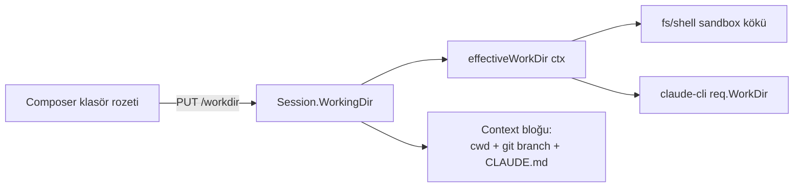

# Çalışma Dizini (Working Directory) — Oturum-Başına cwd

> Eklendi: **2026-06-22**. the external agent project (external-agent-oss) "working directory"
> mekaniğinin TionSwarm'ya uyarlaması.

## Amaç

Her sohbet oturumunun, ajanın dosya/kabuk araçlarının çalışacağı bir **çalışma
dizini (cwd)** olabilir — tıpkı terminalde `cd /path/to/proje` yapmak gibi.
Böylece bir oturumu doğrudan bir proje klasörüne bağlayıp ajana o repoda kod
yazdırabilir, test çalıştırabilir, git kullandırabilirsin.

Bu özellik, daha önce kaldırılan **fs/shell sandbox kilidinin** (bkz.
`06-WORKSPACES.md`) doğal devamıdır: araçlar artık her yere erişebildiği için,
"nerede çalışacağını" oturum başına seçmek anlamlı hale geldi.

## Katmanlar



### 1. Veri
- `db.Session.WorkingDir` (`workingDir` JSON) — oturuma özel cwd. Boş = workspace
  varsayılanı (`Runtime.workDir`). `SetSessionWorkingDir` ile yazılır.

### 2. Çözümleme (`internal/agent/workdir_ctx.go`)
- `Runtime.effectiveWorkDir(ctx)` — ctx'teki session id'den oturumu okur;
  `WorkingDir` set ve gerçek bir dizinse onu, değilse `r.workDir`'i döndürür.
- `completeTraced` her turda çözer → `req.WorkDir` (CLI cwd) + ctx'e koyar
  (`withResolvedWorkDir`). `buildRegistry` bu ctx'ten sandbox kökünü alır.
- Chat yolları artık `agent.WithSessionID` ile session id'yi ctx'e basıyor
  (`chat_stream.go`, `chat.go`); otonom yollar (scheduler/spawn) zaten basıyordu.

### 3. Bağlam enjeksiyonu (`internal/api/workdir_context.go`)
- `workdirContextBlock(dir)` — sistem promptunun dinamik (cache-dışı) kısmına
  "Working directory" bloğu ekler: cwd yolu + git branch (`git rev-parse
  --abbrev-ref HEAD`) + `CLAUDE.md` varsa onu okuma hatırlatması.
- `composeTurnRequest` (chat_turn.go) bu bloğu goal'dan hemen sonra ekler.

### 4. UX (`frontend`)
- `components/chat/WorkDirBadge.tsx` — Composer'da klasör rozeti (Thinking/Permission
  rozetlerinin yanında). Klasör ikonu + dizin adı + git branch gösterir; tıklayınca
  dizin gezgini popover'ı açılır (alt klasörlere in/çık, "Bu klasörü kullan",
  "Sıfırla"). `sessionId` ile kendi kendine yeter.
- API: `GET/PUT /api/sessions/{id}/workdir`, `GET /api/fs/browse?path=`
  (`internal/api/workdir.go`). Browse boş path'te kökleri döndürür (Windows'ta
  sürücü harfleri, POSIX'te `/`).

## Otonomi frenleri (güvenlik)

Araçlar kilitsiz olduğundan, **insan döngüde olmayan** (scheduler/spawn/flow) turlar
için iki fren var (Ayarlar ▸ MCP & Araçlar):

| Ayar | Varsayılan | Etki |
|---|---|---|
| `autonomousConfine` | **açık** | Otonom turda fs araçları çalışma dizinine **kilitlenir** (mutlak yol + `..` reddi) ve shell'de `git push` engellenir. İnteraktif sohbet etkilenmez. |
| `gitWorktreeIsolation` | kapalı | Çalışma dizini git deposuysa, otonom oturuma özel **git worktree + dal** verilir (`<workspace>/worktrees/<sessionID>`). Paralel ajan çakışmasını önler. Oturum silinince temizlenir. |

- Confine, `Sandbox.Confined` bayrağını yeniden kullanır (`internal/tools/sandbox.go`):
  interaktif = `NewSandbox` (kilitsiz), otonom+confine = `NewConfinedSandbox`.
- `git push` engeli `builtin_shell.go isNetworkMutatingGit` ile (best-effort substring;
  gerçek sınır confine'ın kendisidir).
- Worktree mantığı `internal/agent/worktree.go` (`ensureWorktree` /
  `RemoveSessionWorktree`); git yoksa veya repo değilse sessizce taban dizine düşer.

### Geliştirici worktree'leri (`scripts\worktree.ps1`) — ajan izolasyonundan AYRI

Yukarıdaki `gitWorktreeIsolation` **çalışma-zamanı** özelliğidir (otonom oturuma worktree
verir). Bunun yanında, **insan geliştirici** için aynı anda birden çok dalda çalışmayı
(stash/checkout gidip-gelmesi olmadan) kolaylaştıran bir yardımcı script vardır:

```powershell
.\scripts\worktree.ps1 add    feat-login                        # yeni dal: feature/feat-login
.\scripts\worktree.ps1 add    hotfix -Branch fix/crash -Existing # mevcut dalı bağla
.\scripts\worktree.ps1 list
.\scripts\worktree.ps1 remove feat-login
.\scripts\worktree.ps1 prune
```

Worktree'ler reponun **kardeşi** olarak açılır (ör. `...\Projects\TionSwarm-feat-login`);
tek `.git` deposu paylaşılır, her worktree'nin kendi çalışma dizini + dalı olur.
`add` sırasında `frontend/node_modules` ana repodan **junction** ile bağlanır (sıfırdan
`npm install` beklemezsin); `-NoLink` verirsen bunun yerine `npm install` koşar.

## Akış matrisi

| Tur tipi | Sandbox | git push | Worktree |
|---|---|---|---|
| İnteraktif sohbet | Kilitsiz | Serbest | Hayır |
| Otonom + confine açık | Çalışma dizinine kilitli | Engelli | İzolasyon açıksa evet |
| Otonom + confine kapalı | Kilitsiz | Serbest | İzolasyon açıksa evet |

## the external agent project ile fark

- **Eşit:** oturum-başına cwd, klasör rozeti, cwd değiştirme, git branch göstergesi,
  CLAUDE.md farkındalığı, makine geneli erişim.
- **TionSwarm'ya özgü:** otonom turlar (scheduler/flow/spawn) için confine + worktree
  frenleri — the external agent project interaktif olduğu için bunlara ihtiyaç duymaz.

## Workspace varsayılan çalışma dizini (2026-06-22)

the external agent project paritesi: workspace başına "varsayılan çalışma dizini".
- `WSSettings.DefaultWorkingDir` (`ws-settings.json`) — Ayarlar ▸ Bu Workspace ▸
  "Varsayılan çalışma dizini" alanından girilir (mutlak yol).
- Runtime'a `SetDefaultWorkDir` ile uygulanır; `Runtime.WorkspaceDefaultDir()`
  geçerli ve var olan bir dizinse onu, değilse fiziksel `workDir`'i döndürür.
- `effectiveWorkDir` çözüm sırası: **oturum `WorkingDir`** → **workspace
  `DefaultWorkingDir`** → fiziksel `workDir`.
- **Yeni oturuma seeding (2026-06-26):** `handleCreateSession` artık yeni oturumun
  `WorkingDir`'ini workspace'in `DefaultWorkingDir`'i ile **tohumlar** (istek kendi
  `workingDir`'ini vermezse). Böylece her yeni oturum o path'e **kilitli başlar** ve
  Composer rozeti yolu `Dir` olarak (yalnız `effective` fallback değil) gösterir.
  Path boşsa eskisi gibi fiziksel `workDir`'e düşer. Not: bu bir kopyadır —
  varsayılanı sonradan değiştirmek, zaten tohumlanmış eski oturumların `WorkingDir`'ini
  geriye dönük değiştirmez (runtime fallback yalnız `WorkingDir` boş kalan oturumlarda
  varsayılanı izlemeye devam eder).
- **Spawn/handoff seeding (2026-06-26):** `SpawnOptions.WorkingDir` eklendi;
  `Runtime.SpawnSession` yeni oturumun `WorkingDir`'ini açık seçenek varsa onunla,
  yoksa workspace'in yapılandırılmış default'u (`defaultWorkDir`) ile tohumlar →
  spawn edilen (ve `spawn_session` aracı/UI ile açılan) oturumlar da Path'e kilitli
  başlar. **Handoff** continuation'ı ayrıca ebeveyn oturumun `WorkingDir`'ini geçirir
  → context-reset sonrası taze oturum **aynı dizinde** devam eder. Default boşsa alan
  boş kalır (runtime fiziksel `workDir`'e düşer).

## Workspace penceresi + Proje sekmesi (2026-06-22)

Workspace + path ayarları artık Ayarlar'dan ayrı, **sol navbar'daki "Workspace"
butonuyla** açılan kendi penceresinde (`components/workspace/WorkspaceView.tsx`).
Sol alt-navbar (Settings/Logs benzeri) üç sekme:
- **Genel** — kimlik, sağlayıcı/model, otonomi, session bağlamı (`WorkspacePanel`).
- **Proje** (`ProjectPanel`) — proje dizini (path) seçici + **git**: depo durumu,
  `git init` (yoksa), origin remote URL + `user.name`/`user.email` ayarları.
- **Promptlar & Dosyalar** — düzenlenebilir config dosyaları (`WorkspaceFilesPanel`).

Git endpoint'leri (`internal/api/git.go`): `GET /api/fs/gitinfo?path=`,
`POST /api/git/init`, `POST /api/git/config` (origin remote + commit kimliği).
Secrets de NavRail'den çıkıp **Ayarlar ▸ Sırlar** alt-kategorisine taşındı; UI'da
"Beceri/Beceriler" terimleri **Skill/Skills**'e çevrildi.
