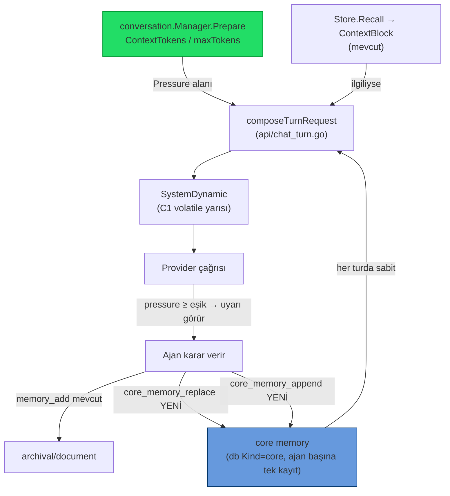
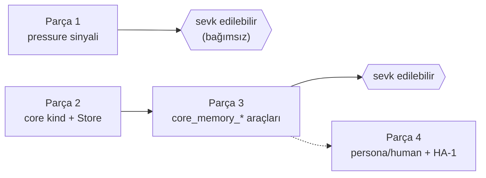

# 26 — MemGPT/Letta Tarzı Self-Editing Bellek (Mod C uygulama planı)

> **Durum (2026-06-22): Parça 1–3 UYGULANDI.** Parça 4 (persona/human ayrımı)
> bilinçli olarak sonraya bırakıldı. Uygulama özeti dosyanın sonunda
> ("Uygulama notu") + `05-ILERLEME.md`.
>
> **Roadmap maddesi:** `03-YOL-HARITASI.md` → **C6**.
> **Karar:** Letta'yı doğrudan koşmak yerine (Docker + Postgres + Python sidecar →
> SwarmGo'nun "tek binary, sunucusuz, dosya-tabanlı, offline" kimliğini bozar)
> Letta'nın *fikirlerini* native Go'da yeniden uyguluyoruz. Bu **Mod C**'dir.
> İnceleme: `letta-ai/letta` ([repo](https://github.com/letta-ai/letta)), 2026-06-22.

## Neden Mod C (doğrudan Letta değil)?

Letta artık bir kütüphane değil, kalıcı bir **sunucu servisi**: Docker'da kalkar
(`:8283/v1` REST), arka planda **PostgreSQL + pgvector zorunlu**, ~800MB taban
ayak izi + ajan başına ~50–200 MB/ay DB büyümesi. Doğrudan entegrasyon SwarmGo'nun
üç temel tasarım kararını birden kırar:

| SwarmGo kararı | Letta doğrudan kullanımıyla |
|---|---|
| Tek Go binary, DB-sunucusuz, dosya-tabanlı (`internal/db`) | ❌ Postgres+pgvector zorunlu |
| Offline / anahtarsız çalışabilme (lexical cosine recall) | ❌ Python servisi + embedding bağımlılığı |
| 5 sağlayıcı kendi `toolloop`'umuzla | ❌ ajan döngüsü Letta'ya devredilir |

SwarmGo zaten Letta'nın **okuma** tarafını yapıyor (tiered kinds + recall +
`SystemDynamic` injection). Eksik olan iki küçük parça: **ajana bağlam-basıncı
sinyali** ve **ajanın in-place düzenleyebildiği kalıcı core memory bloğu**.

## Mevcut durum — eşleştirme

| Letta/MemGPT mekanizması | SwarmGo karşılığı (bugün) | Durum |
|---|---|---|
| Tiered memory (core/recall/archival) | `db.Memory{Document,Journal,Reflection}` + `memory.Store` | 🔶 core yok |
| Recall (similarity) | `Store.Recall` (lexical cosine) → `ContextBlock` | ✅ |
| Self-editing insert | `MemoryAddTool` (`memory_add`) | 🔶 sadece insert/append |
| Self-editing **replace** (in-place core) | — | ❌ |
| Memory-pressure paging | `conversation.Manager.Prepare` **sessiz** katlar | ❌ ajana sinyal yok |
| Core block her prompt'ta sabit | `SystemDynamic` var ama ajan düzenleyemez | 🔶 altyapı var |

## Hedef mimari



İki parça tamamen bağımsız; ayrı ayrı veya birlikte sevk edilebilir. Her ikisi de
C1 iki-parçalı prompt sözleşmesine saygılıdır — **yalnız `SystemDynamic`'e** yazarlar,
statik cache prefix'ine asla dokunmazlar (bkz. `03-YOL-HARITASI.md` CG-11).

---

## Parça 1 — Memory-pressure sinyali

**Amaç:** Bağlam bütçesi dolmaya yaklaşınca ajana "önemliyi şimdi belleğe yaz"
uyarısı göster — sessiz oto-compaction'dan *önce*. Letta'nın memory-pressure
paging davranışının hafif karşılığı. Sıfır yeni araç, sıfır ekstra model çağrısı.

### Dokunulacak dosyalar

1. **`internal/conversation/manager.go`** — `Prepared` struct'ına alan ekle:
   ```go
   type Prepared struct {
       Summary       string
       Messages      []providers.Message
       ContextTokens int
       Compacted     bool
       Pressure      float64 // ContextTokens / maxTokens (0..1+); 0 if maxTokens<=0
   }
   ```
   `Prepare` dönüşünde hesapla (maxTokens zaten `m.limits()`'ten geliyor):
   ```go
   pressure := 0.0
   if maxTokens > 0 {
       pressure = float64(EstimateTokens(summary, pending)) / float64(maxTokens)
   }
   // ... Prepared{..., Pressure: pressure}
   ```

2. **`internal/api/chat_turn.go`** — `composeTurnRequest`, `prep.Pressure` eşik
   üstündeyse `SystemDynamic`'in **başına** kısa uyarı ekle:
   ```go
   if prep.Pressure >= pressureWarnThreshold { // e.g. 0.75
       warn := fmt.Sprintf(
         "⚠️ Context is %d%% full and older turns will soon be compacted into a summary. "+
         "If any fact, decision, or detail here must survive, call memory_add now.",
         int(prep.Pressure*100))
       dynamic = strings.TrimSpace(warn + "\n\n" + dynamic)
   }
   ```
   Uyarı volatile (her turda yeniden hesaplanır) → statik cache'i bozmaz, doğru
   yere (SystemDynamic) gider.

3. **Eşik ayarı** — `settings.Settings`/`DTO`/`Patch` + `Tunables`:
   `memoryPressureWarn` (float, vars. `0.75`, clamp `0` = kapalı – `1.0`).
   `0` → özellik kapalı (geri-uyum). Canlı push `api/server.go::applySettings`.

### Test
- `manager_test.go`: küçük `maxTokens` ile `Pressure` hesabı; `maxTokens<=0 → 0`.
- `chat_turn` seviyesinde: eşik altı → uyarı yok; eşik üstü → uyarı `SystemDynamic`
  başında, statik `System` değişmemiş.

### Efor / risk
~1 saat, 2–3 dosya. Risk minimal; eşik `0` iken tam no-op.

---

## Parça 2 — `core` bellek türü + Store API

**Amaç:** Ajan başına **tek**, kalıcı, in-place düzenlenebilen "çalışma belleği"
bloğu. Letta'nın human/persona memory-block'larının karşılığı. Ring-buffer değil:
yeni yazım eskisini **değiştirir** (append modu satır ekler).

### Veri modeli

1. **`internal/db/models_memory.go`** — yeni kind sabiti:
   ```go
   MemoryCore = "core" // agent-editable working memory, single row per agent
   ```
   `KnowledgeSource` struct'ı **değişmez** (Kind zaten string; migration yok,
   dosya-tabanlı depolama şema-esnek).

2. **`internal/db/store_memory.go`** — upsert metodu ekle. Bugün `UpdateKnowledge`
   **yok**; iki seçenek:
   - **(tercih)** `UpsertKnowledgeByKind(ctx, agentID, kind, content, embedding)`:
     o ajan+kind için mevcut satırı bul → varsa içeriği güncelle (ID/CreatedAt
     korunur, yeni `UpdatedAt` istersen ekle), yoksa `CreateKnowledge`. Tek satır
     invariant'ı burada zorlanır.
   - (alternatif) Mevcut `PruneKind(agentID, core, 0)` + `CreateKnowledge` —
     daha basit ama ID değişir, gereksiz silme/yaratma.

3. **`internal/memory/memory.go`** — `Store`'a iki ince metot:
   ```go
   func (s *Store) WriteCore(ctx, agentID, content string) error // upsert, vector cache
   func (s *Store) ReadCore(ctx, agentID string) (string, error)  // "" if none
   func (s *Store) AppendCore(ctx, agentID, line string) error    // ReadCore+"\n"+line → WriteCore
   ```
   `WriteCore` `buildVector` ile term vektörünü cache'ler (recall'a da girebilsin).

### `core`'un recall'a etkisi
`Store.Recall` varsayılan tüm kind'leri tarar → `core` otomatik recall havuzuna
girer. **İstenen davranış bu değil** (core zaten her turda sabit enjekte edilecek,
recall'da tekrar çıkmasın). İki yol:
- `Recall`/`ContextBlock` çağrılarında `core`'u hariç tut (kinds allowlist'i
  `document,journal,reflection` ile sınırla), **veya**
- `core` kind'ini recall taramasında atla (memory.go'da filtre).
Planda **birinci** tercih ediliyor (çağrı tarafında açık allowlist; mevcut
`ContextBlock` imzası zaten kinds almıyor → küçük genişletme gerek).

### Test
- `memory_test.go`: `WriteCore` iki kez → tek satır kalır (upsert), içerik
  güncellenir. `AppendCore` satır ekler. `ReadCore` boşta `""`.
- Recall'ın `core`'u döndürmediğini doğrula.

### Efor / risk
~yarım gün. Migration yok. Geri-uyum tam (yeni kind eski kayıtları etkilemez).

---

## Parça 3 — `core_memory_*` araçları (ajana açık yüzey)

**Amaç:** Ajanın core bloğunu doğrudan düzenlemesi. `MemoryAddTool` deseniyle
birebir aynı yapı.

### Yeni dosya: `internal/tools/builtin_memory_core.go`

İki araç (ya da tek araç + `mode` alanı — Letta ayrı tutar, biz de ayrı tutalım):

| Araç | Görev | Şema |
|---|---|---|
| `core_memory_replace` | Tüm core bloğunu yeni içerikle değiştir | `{content: string}` |
| `core_memory_append`  | Core bloğuna bir satır ekle | `{content: string}` |

```go
type CoreMemoryTool struct {
    mem     *memory.Store
    agentID string
    mode    string // "replace" | "append"
}
func NewCoreMemoryReplaceTool(mem *memory.Store, agentID string) CoreMemoryTool
func NewCoreMemoryAppendTool(mem *memory.Store, agentID string) CoreMemoryTool
```
`Call` → `WriteCore` / `AppendCore`; dönüş `{"action":"core_replaced"}` benzeri.
`mem == nil` → "memory not available" (mevcut desen).

### Araç kaydı: `internal/agent/toolsetup.go`
`memory_add`/`memory_recall`'ın kaydedildiği yere `core_memory_replace` +
`core_memory_append` ekle. **Opt-in** olabilir (ayar `coreMemoryTools bool`,
vars. açık) — böylece minimal araç-yüzeyi isteyen kullanıcı kapatabilir.

### Prompt entegrasyonu: `composeTurnRequest`
Core bloğunu **her turda** `SystemDynamic`'e enjekte et (recall'dan ayrı, üstte):
```go
if core := strings.TrimSpace(wsp.Runtime.Memory().ReadCore(ctx, agent.ID)); core != "" {
    block := "## Core memory (you maintain this; edit with core_memory_replace/append)\n" + core
    dynamic = strings.TrimSpace(block + "\n\n" + dynamic)
}
```
Letta'nın "core memory always in context" davranışı budur.

### Test
- `builtin_memory_core_test.go`: replace → ReadCore eşleşir; append → satır eklenir;
  boş content reddedilir.
- `composeTurnRequest` testinde core bloğu `SystemDynamic`'te, `System`'de değil.

### Efor / risk
~yarım gün (Parça 2'ye bağımlı). Araç opt-in → geri-uyum tam.

---

## Parça 4 — persona/human ayrımı (opsiyonel, sonraya)

Core bloğunu iki etiketli alt-bölüme ayır: `<persona>` (ajanın kendini tanımı) +
`<human>` (kullanıcı modeli). `<human>` bloğu doğrudan **HA-1 Honcho-benzeri
kullanıcı modelleme** ile birleşir (`03-YOL-HARITASI.md` HA-1). Bu fazda
`core_memory_replace`'e opsiyonel `section: "persona"|"human"` alanı eklenir.
Parça 1–3 olgunlaşmadan başlanmaz.

---

## Fazlama ve bağımlılıklar



| Adım | Efor | Bağımlılık | Geri-uyum |
|---|---|---|---|
| 1. Pressure sinyali | ~1 saat | yok | tam (eşik 0 = kapalı) |
| 2. `core` kind + Store API | ~yarım gün | yok | tam (yeni kind) |
| 3. `core_memory_*` araçları | ~yarım gün | Adım 2 | tam (araç opt-in) |
| 4. persona/human + HA-1 köprüsü | sonraya | Adım 3 + HA-1 | — |

**Önerilen sıra:** 1 → 2 → 3. Adım 1 tek başına en yüksek değer/risk oranı;
Letta'nın asıl fikri ("belleği ajandan gizleme, kontrolü ona ver") 1 + 3 ile gelir.

## Geri-uyumluluk ve felsefe uyumu

- **Migration yok** — `core` yeni bir string kind; eski kayıtlar etkilenmez.
- **Tek binary korunur** — sıfır yeni runtime bağımlılığı (Postgres/Python yok).
- **Offline korunur** — lexical cosine vektörü `WriteCore`'da yine yerel üretilir.
- **C1 cache güvenli** — tüm enjeksiyonlar `SystemDynamic`'e; statik prefix sabit.
- **Opt-in** — pressure eşiği `0` ve `coreMemoryTools=false` → bugünkü davranış birebir.

## Ayarlar özeti (yeni)

| Alan | Parça | Vars. | Clamp |
|---|---|---|---|
| `memoryPressureWarn` | 1 | `0.75` | 0 (=kapalı) – 1.0 |
| `coreMemoryTools` | 3 | `true` | — |

Hepsi `settings.Settings`/`DTO`/`Patch` + `Tunables` + `applySettings` canlı push,
mevcut Token-Optimizasyon ayarlarıyla (`17-TOKEN-OPTIMIZASYON.md`) aynı desen.

## Doğrulama

```powershell
cd C:\Users\user\Desktop\Projects\SwarmGo
go build ./...
go test ./internal/conversation/... ./internal/memory/... ./internal/tools/... ./internal/api/...
```

## Uygulama notu (2026-06-22)

Parça 1–3 sevk edildi. Plandan sapmalar:

- **Pressure hesabı** `conversation.Manager.Prepare` dönüşünde yapılır
  (`Prepared.Pressure = ContextTokens / maxTokens`, `maxTokens<=0 → 0`).
- **Uyarı enjeksiyonu** `api/chat_turn.go::composeTurnRequest`'te; eşik
  `Tunables.MemoryPressureWarn()` (ayar `memoryPressureWarn`, vars. `0.75`,
  clamp `[0,1]`, `0`=kapalı). Uyarı `SystemDynamic`'in başına yazılır; metin
  hem `memory_add` hem `core_memory_*`'a yönlendirir.
- **`core` kind** `db.MemoryCore`. Tek-satır invariant'ı yeni
  `db.UpsertKnowledgeByKind` ile zorlanır (ID/CreatedAt korunur). Store API:
  `memory.Store.WriteCore/ReadCore/AppendCore`.
- **Recall'dan core hariç** — `memory.go`'da `recallKinds` allowlist'i
  (`document,journal,reflection`); `Recall` boş kinds'te buna düşer, böylece
  `ContextBlock` ve `memory_recall` tool'u core'u asla döndürmez (plandaki
  "birinci tercih"in basitleştirilmiş hali: çağrı yerine Store içinde varsayılan).
- **Araçlar** `tools.NewCoreMemoryReplaceTool/AppendTool` (tek `CoreMemoryTool` +
  `mode`). `toolsetup.go`'da **eager**, `Tunables.CoreMemoryTools()` (ayar
  `coreMemoryTools`, vars. açık) ile gated.
- **Core bloğu enjeksiyonu** `composeTurnRequest`'te recall'ın üstünde, başlık
  `## Core memory (you maintain this; edit with core_memory_replace/append)`.
- **Ayar UI'si** `frontend .../settings/appPanels.tsx` ContextPanel → "Çekirdek
  bellek (MemGPT)" bölümü. Canlı push `api/server.go::applySettings` →
  `Tunables.SetMemoryControls`.
- **Testler** `conversation/manager_test.go` (pressure), `memory/memory_test.go`
  (upsert + recall-exclude), `tools/builtin_memory_core_test.go` (replace/append/
  boş/nil).

## Ayrıca bakınız

- **`03-YOL-HARITASI.md`** — C6 (bu plan), C2 (compaction), C3 (memory_write),
  C5 (recency+importance recall), HA-1 (kullanıcı modelleme).
- **`17-TOKEN-OPTIMIZASYON.md`** — bağlam bütçesi ve compaction'ın diğer yarısı.
- **`08-DEPOLAMA.md`** — `knowledge_sources` dosya-tabanlı depolama.
