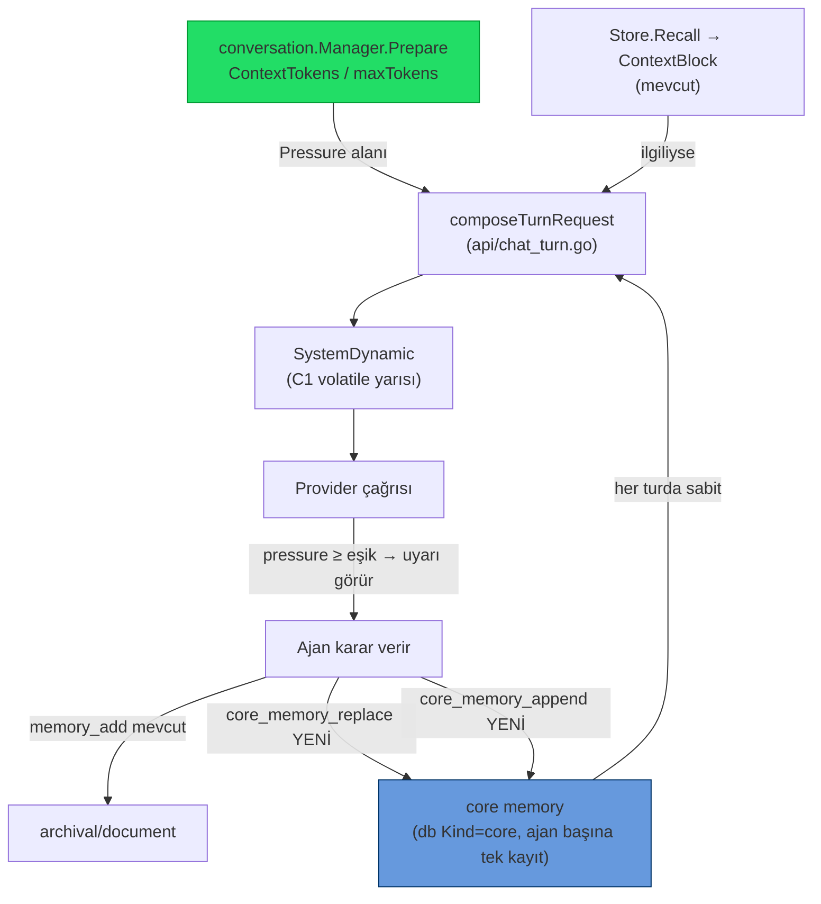
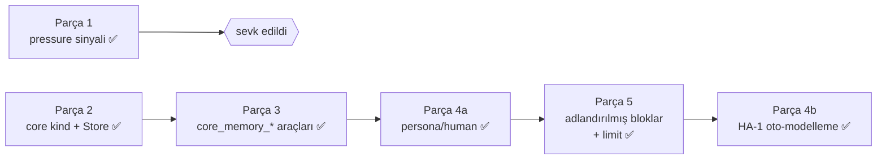
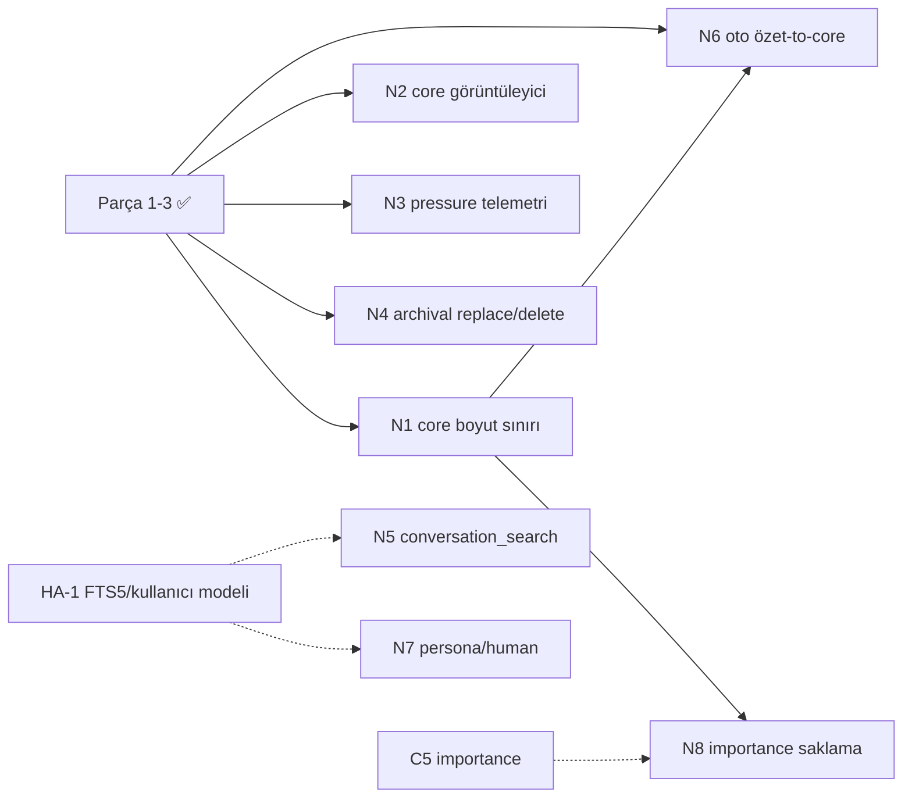

# 26 — MemGPT/Letta Tarzı Self-Editing Bellek (Mod C uygulama planı)

> **Durum (2026-06-23): Parça 1–5 + 4a + 4b UYGULANDI (TAMAMLANDI).** Çekirdek
> bellek **adlandırılmış bloklar + karakter limiti** (Parça 5); `human` bloğu
> dream-cycle ile **otomatik** doldurulur (Parça 4b/HA-1). Özet + `05-ILERLEME.md`.
>
> **Okuma rehberi:** Aşağıdaki **Parça 2–3** (tek `core` kind'i) ve **Parça 4a**
> (persona/human, `core_persona`/`core_human`, `section`) bölümleri **orijinal
> plan/tarihçedir** ve sonradan **Parça 5** (adlandırılmış bloklar, `core:<label>`,
> `label` parametresi) tarafından geçersiz kılınmıştır. Güncel API/tanımlayıcılar
> için **Parça 5**'i esas al; eski bölümler yalnız tarihsel kayıt.
>
> **CLI köprüsü (2026-06-22):** `core_memory_replace`/`core_memory_append` artık
> claude-cli ajanlarına da Interaction MCP üzerinden sunuluyor (önceden CLI ajanı
> core-memory bloğunu görüyor ama düzenleyemiyordu). Bkz. `11-INTERACTION-MCP.md`.
>
> **Roadmap maddesi:** `03-YOL-HARITASI.md` → **C6**.
> **Karar:** Letta'yı doğrudan koşmak yerine (Docker + Postgres + Python sidecar →
> SwarmGo'nun "tek binary, sunucusuz, dosya-tabanlı, offline" kimliğini bozar)
> Letta'nın *fikirlerini* native Go'da yeniden uyguluyoruz. Bu **Mod C**'dir.
> İnceleme: `letta-ai/letta` ([repo](https://github.com/letta-ai/letta)), 2026-06-22.

## Neden Mod C (doğrudan Letta değil)?

Letta artık bir kütüphane değil, kalıcı bir **sunucu servisi**: Docker'da kalkar
(`:8283/v1` REST), arka planda **PostgreSQL + pgvector zorunlu**, ~800MB taban
ayak izi + ajan başına ~50–200 MB/ay DB büyümesi. Doğrudan entegrasyon SwarmGo'nun
üç temel tasarım kararını birden kırar:

| SwarmGo kararı | Letta doğrudan kullanımıyla |
|---|---|
| Tek Go binary, DB-sunucusuz, dosya-tabanlı (`internal/db`) | ❌ Postgres+pgvector zorunlu |
| Offline / anahtarsız çalışabilme (lexical cosine recall) | ❌ Python servisi + embedding bağımlılığı |
| 5 sağlayıcı kendi `toolloop`'umuzla | ❌ ajan döngüsü Letta'ya devredilir |

SwarmGo zaten Letta'nın **okuma** tarafını yapıyor (tiered kinds + recall +
`SystemDynamic` injection). Eksik olan iki küçük parça: **ajana bağlam-basıncı
sinyali** ve **ajanın in-place düzenleyebildiği kalıcı core memory bloğu**.

## Mevcut durum — eşleştirme

| Letta/MemGPT mekanizması | SwarmGo karşılığı (bugün) | Durum |
|---|---|---|
| Tiered memory (core/recall/archival) | `db.Memory{Document,Journal,Reflection}` + `memory.Store` | 🔶 core yok |
| Recall (similarity) | `Store.Recall` (lexical cosine) → `ContextBlock` | ✅ |
| Self-editing insert | `MemoryAddTool` (`memory_add`) | 🔶 sadece insert/append |
| Self-editing **replace** (in-place core) | — | ❌ |
| Memory-pressure paging | `conversation.Manager.Prepare` **sessiz** katlar | ❌ ajana sinyal yok |
| Core block her prompt'ta sabit | `SystemDynamic` var ama ajan düzenleyemez | 🔶 altyapı var |

## Hedef mimari



İki parça tamamen bağımsız; ayrı ayrı veya birlikte sevk edilebilir. Her ikisi de
C1 iki-parçalı prompt sözleşmesine saygılıdır — **yalnız `SystemDynamic`'e** yazarlar,
statik cache prefix'ine asla dokunmazlar (bkz. `03-YOL-HARITASI.md` CG-11).

---

## Parça 1 — Memory-pressure sinyali

**Amaç:** Bağlam bütçesi dolmaya yaklaşınca ajana "önemliyi şimdi belleğe yaz"
uyarısı göster — sessiz oto-compaction'dan *önce*. Letta'nın memory-pressure
paging davranışının hafif karşılığı. Sıfır yeni araç, sıfır ekstra model çağrısı.

### Dokunulacak dosyalar

1. **`internal/conversation/manager.go`** — `Prepared` struct'ına alan ekle:
   ```go
   type Prepared struct {
       Summary       string
       Messages      []providers.Message
       ContextTokens int
       Compacted     bool
       Pressure      float64 // ContextTokens / maxTokens (0..1+); 0 if maxTokens<=0
   }
   ```
   `Prepare` dönüşünde hesapla (maxTokens zaten `m.limits()`'ten geliyor):
   ```go
   pressure := 0.0
   if maxTokens > 0 {
       pressure = float64(EstimateTokens(summary, pending)) / float64(maxTokens)
   }
   // ... Prepared{..., Pressure: pressure}
   ```

2. **`internal/api/chat_turn.go`** — `composeTurnRequest`, `prep.Pressure` eşik
   üstündeyse `SystemDynamic`'in **başına** kısa uyarı ekle:
   ```go
   if prep.Pressure >= pressureWarnThreshold { // e.g. 0.75
       warn := fmt.Sprintf(
         "⚠️ Context is %d%% full and older turns will soon be compacted into a summary. "+
         "If any fact, decision, or detail here must survive, call memory_add now.",
         int(prep.Pressure*100))
       dynamic = strings.TrimSpace(warn + "\n\n" + dynamic)
   }
   ```
   Uyarı volatile (her turda yeniden hesaplanır) → statik cache'i bozmaz, doğru
   yere (SystemDynamic) gider.

3. **Eşik ayarı** — `settings.Settings`/`DTO`/`Patch` + `Tunables`:
   `memoryPressureWarn` (float, vars. `0.75`, clamp `0` = kapalı – `1.0`).
   `0` → özellik kapalı (geri-uyum). Canlı push `api/server.go::applySettings`.

### Test
- `manager_test.go`: küçük `maxTokens` ile `Pressure` hesabı; `maxTokens<=0 → 0`.
- `chat_turn` seviyesinde: eşik altı → uyarı yok; eşik üstü → uyarı `SystemDynamic`
  başında, statik `System` değişmemiş.

### Efor / risk
~1 saat, 2–3 dosya. Risk minimal; eşik `0` iken tam no-op.

---

## Parça 2 — `core` bellek türü + Store API

**Amaç:** Ajan başına **tek**, kalıcı, in-place düzenlenebilen "çalışma belleği"
bloğu. Letta'nın human/persona memory-block'larının karşılığı. Ring-buffer değil:
yeni yazım eskisini **değiştirir** (append modu satır ekler).

### Veri modeli

1. **`internal/db/models_memory.go`** — yeni kind sabiti:
   ```go
   MemoryCore = "core" // agent-editable working memory, single row per agent
   ```
   `KnowledgeSource` struct'ı **değişmez** (Kind zaten string; migration yok,
   dosya-tabanlı depolama şema-esnek).

2. **`internal/db/store_memory.go`** — upsert metodu ekle. Bugün `UpdateKnowledge`
   **yok**; iki seçenek:
   - **(tercih)** `UpsertKnowledgeByKind(ctx, agentID, kind, content, embedding)`:
     o ajan+kind için mevcut satırı bul → varsa içeriği güncelle (ID/CreatedAt
     korunur, yeni `UpdatedAt` istersen ekle), yoksa `CreateKnowledge`. Tek satır
     invariant'ı burada zorlanır.
   - (alternatif) Mevcut `PruneKind(agentID, core, 0)` + `CreateKnowledge` —
     daha basit ama ID değişir, gereksiz silme/yaratma.

3. **`internal/memory/memory.go`** — `Store`'a iki ince metot:
   ```go
   func (s *Store) WriteCore(ctx, agentID, content string) error // upsert, vector cache
   func (s *Store) ReadCore(ctx, agentID string) (string, error)  // "" if none
   func (s *Store) AppendCore(ctx, agentID, line string) error    // ReadCore+"\n"+line → WriteCore
   ```
   `WriteCore` `buildVector` ile term vektörünü cache'ler (recall'a da girebilsin).

### `core`'un recall'a etkisi
`Store.Recall` varsayılan tüm kind'leri tarar → `core` otomatik recall havuzuna
girer. **İstenen davranış bu değil** (core zaten her turda sabit enjekte edilecek,
recall'da tekrar çıkmasın). İki yol:
- `Recall`/`ContextBlock` çağrılarında `core`'u hariç tut (kinds allowlist'i
  `document,journal,reflection` ile sınırla), **veya**
- `core` kind'ini recall taramasında atla (memory.go'da filtre).
Planda **birinci** tercih ediliyor (çağrı tarafında açık allowlist; mevcut
`ContextBlock` imzası zaten kinds almıyor → küçük genişletme gerek).

### Test
- `memory_test.go`: `WriteCore` iki kez → tek satır kalır (upsert), içerik
  güncellenir. `AppendCore` satır ekler. `ReadCore` boşta `""`.
- Recall'ın `core`'u döndürmediğini doğrula.

### Efor / risk
~yarım gün. Migration yok. Geri-uyum tam (yeni kind eski kayıtları etkilemez).

---

## Parça 3 — `core_memory_*` araçları (ajana açık yüzey)

**Amaç:** Ajanın core bloğunu doğrudan düzenlemesi. `MemoryAddTool` deseniyle
birebir aynı yapı.

### Yeni dosya: `internal/tools/builtin_memory_core.go`

İki araç (ya da tek araç + `mode` alanı — Letta ayrı tutar, biz de ayrı tutalım):

| Araç | Görev | Şema |
|---|---|---|
| `core_memory_replace` | Tüm core bloğunu yeni içerikle değiştir | `{content: string}` |
| `core_memory_append`  | Core bloğuna bir satır ekle | `{content: string}` |

```go
type CoreMemoryTool struct {
    mem     *memory.Store
    agentID string
    mode    string // "replace" | "append"
}
func NewCoreMemoryReplaceTool(mem *memory.Store, agentID string) CoreMemoryTool
func NewCoreMemoryAppendTool(mem *memory.Store, agentID string) CoreMemoryTool
```
`Call` → `WriteCore` / `AppendCore`; dönüş `{"action":"core_replaced"}` benzeri.
`mem == nil` → "memory not available" (mevcut desen).

### Araç kaydı: `internal/agent/toolsetup.go`
`memory_add`/`memory_recall`'ın kaydedildiği yere `core_memory_replace` +
`core_memory_append` ekle. **Opt-in** olabilir (ayar `coreMemoryTools bool`,
vars. açık) — böylece minimal araç-yüzeyi isteyen kullanıcı kapatabilir.

### Prompt entegrasyonu: `composeTurnRequest`
Core bloğunu **her turda** `SystemDynamic`'e enjekte et (recall'dan ayrı, üstte):
```go
if core := strings.TrimSpace(wsp.Runtime.Memory().ReadCore(ctx, agent.ID)); core != "" {
    block := "## Core memory (you maintain this; edit with core_memory_replace/append)\n" + core
    dynamic = strings.TrimSpace(block + "\n\n" + dynamic)
}
```
Letta'nın "core memory always in context" davranışı budur.

### Test
- `builtin_memory_core_test.go`: replace → ReadCore eşleşir; append → satır eklenir;
  boş content reddedilir.
- `composeTurnRequest` testinde core bloğu `SystemDynamic`'te, `System`'de değil.

### Efor / risk
~yarım gün (Parça 2'ye bağımlı). Araç opt-in → geri-uyum tam.

---

## Parça 4 — persona/human ayrımı

### Parça 4a — mekanik bölme ✅ (2026-06-22, UYGULANDI)

> ⚠️ **Parça 5 ile GEÇERSİZ KILINDI (2026-06-23).** Aşağıdaki tanımlayıcılar artık
> kodda **yok**: `db.MemoryCorePersona`/`MemoryCoreHuman` (`core_persona`/`core_human`)
> → `db.CoreKind("<label>")` = `core:<label>`; `section` parametresi → `label`
> (serbest, `section` geriye-alias); `ReadCoreSections → (persona,human)` →
> `ReadCoreBlocks → []BlockView`; `GET/PUT /core` `{persona,human}` → `{blocks}`.
> Güncel tasarım için **Parça 5**'e bak. Bölüm tarihsel kayıt olarak duruyor.

Core bloğu iki bağımsız bölüme ayrıldı: **persona** (ajanın kendini tanımı) +
**human** (kullanıcı modeli). Geri-uyum **gözetilmedi** (kullanıcı onayı) → eski
tek `core` kind'i kaldırıldı, yerine iki kind geldi.

- **Depolama:** `db.MemoryCorePersona = "core_persona"` + `db.MemoryCoreHuman =
  "core_human"`, her biri ajan başına tek satır (`UpsertKnowledgeByKind`). Eski
  `db.MemoryCore` kaldırıldı.
- **Store API:** `WriteCore/ReadCore/AppendCore(ctx, agentID, section, …)` artık
  `section` ("persona"|"human") alır; boş/bilinmeyen → persona (`coreKind`).
  Yeni `ReadCoreSections(agentID) → (persona, human)`. Recall ikisini de hariç
  tutar (zaten `recallKinds` allowlist'i dışında).
- **Araçlar:** `core_memory_replace`/`append` şemasına `section` (enum
  persona|human, vars. persona) eklendi; dönüş `{action, section}`. Constructor
  imzaları **değişmedi** (CLI köprüsü `runtime.go::BridgeTools` bozulmaz).
- **Enjeksiyon:** `composeTurnRequest` → `coreMemoryBlock(persona, human)`; iki
  alt başlık ("### Persona (who you are)", "### Human (what you know about the
  user)"), yalnız dolu bölümler basılır.
- **API:** `GET /api/agents/{id}/core` → `{persona, human}`; `PUT` gövdesi
  `{persona?, human?}` (yalnız verilen bölüm yazılır, pointer → kısmi güncelleme).
- **UI:** `CoreMemoryCard` iki bölümlü (Persona/Human), her biri ayrı düzenlenir.
- **Test:** `memory_test.go` (per-section upsert + bağımsızlık + recall-exclude),
  `builtin_memory_core_test.go` (section'lı replace/append), hepsi yeşil.

### Parça 4b — HA-1 Honcho-benzeri kullanıcı modelleme ✅ (2026-06-23, UYGULANDI)

`human` bloğu artık **otomatik** doldurulur: dream-cycle'a (reflect) piggyback eden
bir geçiş, son journal'lardan kullanıcı hakkındaki **kalıcı** çıkarımları mevcut
profile **merge** edip `human` çekirdek bloğuna yazar.

- **Tetik:** ayrı eşik yok — `reflect()` her çalıştığında (manuel veya auto),
  yansıma kaydedildikten sonra journal'lar silinmeden önce `updateUserModel`
  çağrılır. Reflect başına **bir ucuz model çağrısı** (usage `KindReflect`'e yazılır).
- **Dosya:** yeni `internal/agent/user_model.go` (`updateUserModel`/`writeUserModel`
  + `userModelPrompt`). `reflector.go` yalnız tek `if r.tun.UserModel()` satırı.
  `runtime.go`'ya **dokunulmadı**.
- **Davranış:** model mevcut profil + journal'ı alır, kısa "key: value" satırları
  üretir; değişiklik yoksa no-op; limit aşılırsa `human` limitine truncate edilir.
  Best-effort — hata yansımayı bozmaz.
- **Ayar:** `AutoUserModel` (varsayılan açık) — `settings` + `Tunables.UserModel()`
  + `applySettings` + frontend toggle ("Otomatik kullanıcı modelleme (HA-1)").
- **Test:** tunable default/toggle, over-limit truncation. `go test` 206 ✅.

---

## Parça 5 — Adlandırılmış bloklar + karakter limitleri ✅ (2026-06-23, UYGULANDI)

Letta'nın **memory blocks** kalbi: sabit persona/human ikilisi yerine ajanın
istediği etikette **dinamik blok** tanımlayabildiği, her biri **karakter limiti +
açıklama + salt-okunur** taşıyan model. Geri uyum **gerekmedi**; migration yok.

- **Encoding:** `kind = "core:" + label` (`db.CoreKind/IsCoreKind`). Eski tekil
  `core_persona`/`core_human` kaldırıldı; recall/display zaten allowlist olduğu
  için eski satırlar inert.
- **Tanım ↔ içerik ayrımı:** blok *tanımları* (`db.CoreBlock{Label,Description,
  CharLimit,ReadOnly,Order}`) ajan dosyasında `Agent.CoreBlocks`; *içerik*
  `knowledge_sources`'ta `core:<label>`. `CoreBlocks` boşsa `DefaultCoreBlocks`
  (persona+human, 2000 char) — eski ajanlar migration'sız çalışır.
- **Store:** `WriteCore/ReadCore/AppendCore(label)` + limit kontrolü
  (`*CoreBlockFullError`), `ErrUnknownCoreBlock`, `CoreBlocks`, `ReadCoreBlocks
  → []BlockView`, `DefineCoreBlock`/`DeleteCoreBlock` (custom blok ekle/sil;
  default'ları seed eder). Read-only **store'da değil tool/UI politikasında**.
- **Araçlar:** `section`→`label` (serbest string, `section` geriye-alias);
  bilinmeyen label → geçerli liste ile hata; read-only blok → reddedilir; limit
  aşımı → ajana sayaç+öneri. Constructor imzaları **sabit** (runtime.go/toolsetup.go
  dokunulmadı).
- **Enjeksiyon:** `coreMemoryBlock([]BlockView)` → her dolu blok için
  `### <label> (n/limit) — açıklama` + içerik.
- **API:** `GET /core → {blocks:[…]}`; `PUT /core` gövdesi `{blocks:{label:content}}`
  (limit/bilinmeyen → 400); `POST /core/blocks` (tanımla), `DELETE /core/blocks/{label}`.
- **Frontend:** `CoreMemoryCard` dinamik bloklar — limit/kullanım çubuğu, düzenle,
  read-only kilidi, "+ Yeni blok" ve sil.
- **Test:** limit reddi, bilinmeyen label, define/delete+seed, read-only reddi,
  recall-hariç. `go test` 141 ✅, `tsc` ✅.

---

## Fazlama ve bağımlılıklar



| Adım | Efor | Bağımlılık | Durum |
|---|---|---|---|
| 1. Pressure sinyali | ~1 saat | yok | ✅ UYGULANDI |
| 2. `core` kind + Store API | ~yarım gün | yok | ✅ UYGULANDI (→ Parça 5'te genelleşti) |
| 3. `core_memory_*` araçları | ~yarım gün | Adım 2 | ✅ UYGULANDI |
| 4a. persona/human bölme | ~yarım gün | Adım 3 | ✅ UYGULANDI (→ Parça 5 geçersiz kıldı) |
| 5. Adlandırılmış bloklar + limit | ~yarım gün | Adım 4a | ✅ UYGULANDI |
| 4b. HA-1 oto-modelleme | ~yarım gün | Parça 5 + Reflect | ✅ UYGULANDI |

**Önerilen sıra:** 1 → 2 → 3. Adım 1 tek başına en yüksek değer/risk oranı;
Letta'nın asıl fikri ("belleği ajandan gizleme, kontrolü ona ver") 1 + 3 ile gelir.

## Geri-uyumluluk ve felsefe uyumu

- **Migration yok** — `core` yeni bir string kind; eski kayıtlar etkilenmez.
- **Tek binary korunur** — sıfır yeni runtime bağımlılığı (Postgres/Python yok).
- **Offline korunur** — lexical cosine vektörü `WriteCore`'da yine yerel üretilir.
- **C1 cache güvenli** — tüm enjeksiyonlar `SystemDynamic`'e; statik prefix sabit.
- **Opt-in** — pressure eşiği `0` ve `coreMemoryTools=false` → bugünkü davranış birebir.

## Ayarlar özeti (yeni)

| Alan | Parça | Vars. | Clamp |
|---|---|---|---|
| `memoryPressureWarn` | 1 | `0.75` | 0 (=kapalı) – 1.0 |
| `coreMemoryTools` | 3 | `true` | — |
| `autoUserModel` | 4b | `true` | — (Tunables `UserModel()`) |

Hepsi `settings.Settings`/`DTO`/`Patch` + `Tunables` + `applySettings` canlı push,
mevcut Token-Optimizasyon ayarlarıyla (`17-TOKEN-OPTIMIZASYON.md`) aynı desen.

Ayrıca blok başına **karakter limiti**: blok tanımında `CharLimit` (0 →
`db.DefaultCoreCharLimit = 2000`); ayar değil, blok tanımının parçası (Parça 5).

## Doğrulama

```powershell
cd C:\Users\user\Desktop\Projects\SwarmGo
go build ./...
go test ./internal/conversation/... ./internal/memory/... ./internal/tools/... ./internal/api/...
```

## Uygulama notu (2026-06-22)

Parça 1–3 sevk edildi. Plandan sapmalar:

- **Pressure hesabı** `conversation.Manager.Prepare` dönüşünde yapılır
  (`Prepared.Pressure = ContextTokens / maxTokens`, `maxTokens<=0 → 0`).
- **Uyarı enjeksiyonu** `api/chat_turn.go::composeTurnRequest`'te; eşik
  `Tunables.MemoryPressureWarn()` (ayar `memoryPressureWarn`, vars. `0.75`,
  clamp `[0,1]`, `0`=kapalı). Uyarı `SystemDynamic`'in başına yazılır; metin
  hem `memory_add` hem `core_memory_*`'a yönlendirir.
- **`core` kind** `db.MemoryCore`. Tek-satır invariant'ı yeni
  `db.UpsertKnowledgeByKind` ile zorlanır (ID/CreatedAt korunur). Store API:
  `memory.Store.WriteCore/ReadCore/AppendCore`.
- **Recall'dan core hariç** — `memory.go`'da `recallKinds` allowlist'i
  (`document,journal,reflection`); `Recall` boş kinds'te buna düşer, böylece
  `ContextBlock` ve `memory_recall` tool'u core'u asla döndürmez (plandaki
  "birinci tercih"in basitleştirilmiş hali: çağrı yerine Store içinde varsayılan).
- **Araçlar** `tools.NewCoreMemoryReplaceTool/AppendTool` (tek `CoreMemoryTool` +
  `mode`). `toolsetup.go`'da **eager**, `Tunables.CoreMemoryTools()` (ayar
  `coreMemoryTools`, vars. açık) ile gated.
- **Core bloğu enjeksiyonu** `composeTurnRequest`'te recall'ın üstünde, başlık
  `## Core memory (you maintain this; edit with core_memory_replace/append)`.
- **Ayar UI'si** `frontend .../settings/appPanels.tsx` ContextPanel → "Çekirdek
  bellek (MemGPT)" bölümü. Canlı push `api/server.go::applySettings` →
  `Tunables.SetMemoryControls`.
- **Testler** `conversation/manager_test.go` (pressure), `memory/memory_test.go`
  (upsert + recall-exclude), `tools/builtin_memory_core_test.go` (replace/append/
  boş/nil).

### UI/API genişletmesi (ikinci tur)
- **Ayar UI'si (A+B):** basınç eşiği artık **sürgü** (`settings/primitives.tsx`
  yeni `Slider`) — canlı **%** rozeti + "≈ N token dolunca tetiklenir"
  (`maxContextTokens × eşik`) alt satırı + `0`→"Kapalı"; altında iki durum rozetli
  **canlı özet kartı** (araçlar açık/kapalı · uyarı %X).
- **Çekirdek bellek yönetimi (C):** Hafıza paneline `panels/CoreMemoryCard.tsx`
  — ajanın güncel core bloğunu gösterir + textarea ile düzenleme. API:
  `GET /api/agents/{id}/core` (→ `{content}`) ve `PUT /api/agents/{id}/core`
  (upsert; boş gövde temizler) — `api/memory.go` `handleGetCore`/`handlePutCore`.

## Sırada ne var — sonraki adımlar

Parça 1–3 sevk edildi; aşağıdakiler bunun **üstüne** kurulabilecek doğal devamlar.
Letta sadakati + SwarmGo felsefesi (tek binary, dosya-tabanlı, offline) korunarak
seçildi. Öncelik: yakın = düşük efor/yüksek değer, sonraki için zemin hazır.

### 🟢 Yakın (küçük, bağımsız sevk edilebilir)

- [ ] **N1 — Core memory boyut sınırı + taşma uyarısı.** Letta core block'lara
  karakter limiti koyar; bizde `AppendCore` sınırsız büyüyebilir → her turda bağlam
  yer. `Tunables.CoreMemoryMaxBytes` (vars. ~2KB) ekle; `WriteCore`/`AppendCore`
  aşımda en eski satırları düşürür **veya** araç `core memory full, replace to trim`
  hatası döndürür (Letta davranışı). Dosyalar: `memory/memory.go`, settings/tunables.
  İlişkili: **N4**, **C5**.
- [ ] **N2 — Core memory görüntüleyici (read-only).** Letta ADE'nin bellek
  editörünün hafif karşılığı: ajan detay/Ayarlar panelinde mevcut core bloğunu
  göster (+ son düzenleme zamanı). `GET /api/agents/{id}/core-memory` + frontend
  panel. Salt-okunur başlar; düzenleme ileride. Dosyalar: `api/agent_context.go`
  veya yeni handler, `frontend .../settings`.
- [ ] **N3 — Pressure olay telemetrisi.** Uyarının işe yarayıp yaramadığını ölç:
  pressure-eşik-aşımı sayısı + ardından ajanın `memory_add`/`core_memory_*` çağırma
  oranı, günlük usage rollup'una (Token-Optimizasyon'daki `CompactSavedBytes`
  deseni gibi). Etkinliği veriyle görmeden eşik ayarı körlemesine kalır.

### 🟡 Orta (Letta paritesi)

- [ ] **N4 — Archival bellek için self-editing (replace/delete).** Bugün ajan
  archival'a (`document`) sadece **ekleyebiliyor** (`memory_add`); Letta
  `archival_memory` üzerinde arama + düzenleme verir. `memory_replace(id, content)`
  + `memory_delete(id)` araçları ekle (Store `Delete`/`DeleteIDs` zaten var; yeni
  `Update` gerekir). Dosyalar: `tools/builtin_memory_*.go`, `db/store_memory.go`.
  İlişkili: **C3** (memory_write).
- [ ] **N5 — `conversation_search` aracı.** Letta'nın geçmiş-konuşma arama tool'u.
  Altyapısı **CG-16** (oturumlar-arası tam-metin arama) — planı çıkarıldı:
  [`27-CROSS-SESSION-SEARCH.md`](27-CROSS-SESSION-SEARCH.md), `conversation_search`
  aracı orada **Parça 2** olarak N5'i doğrudan karşılıyor. İlişkili: **CG-16**, **HA-1**.
- [ ] **N6 — Pressure-tetikli otomatik özet-to-core.** Uyarı pasif; ajan görmezden
  gelirse bağlam yine sessizce katlanır. `pressure ≥ ~0.9`'da, compaction'dan
  **önce**, son N önemli turu ucuz modelle özetleyip core/reflection'a otomatik
  yaz (opt-in, `KindCompact` politikası). Letta paging'inin asıl otomatik yarısı.
  Dosyalar: `conversation/manager.go`, `agent/compactor.go`. İlişkili: **C2**, **N1**.

### 🔵 İleri / araştırma

- [ ] **N7 — Parça 4: persona/human ayrımı + HA-1 köprüsü.** (Bu dokümanda zaten
  tanımlı.) Core'u `<persona>`/`<human>` alt-bloklarına böl; `<human>` =
  Honcho-benzeri kullanıcı modeli. **HA-1 olgunlaşınca** başla. İlişkili: **HA-1**.
- [ ] **N8 — Importance-ağırlıklı core saklama.** Core dolunca en az-önemli satırı
  düş (FIFO yerine). **C5 (`Memory.Importance`)** geldiğinde anlamlı; ona bağla.
  İlişkili: **C5**, **N1**.
- [ ] **N9 — Embedding-tabanlı core/archival recall (opsiyonel backend).** Eğer
  ileride semantik recall istenirse, lexical cosine'i opsiyonel embedding sağlayıcıyla
  **değiştirilebilir** kıl (harici-araç-tespiti deseni: varsa kullan, yoksa lexical'e
  düş). Bu, "doğrudan Letta" tartışmasının (Mod A) tek gerçekten cazip parçasıdır —
  ama varsayılan offline kalmalı. İlişkili: Faz 6, Mod A notu (yukarı).

### Bağımlılık haritası



**Öneri:** Sırayla **N1 → N3 → N2**. N1 mevcut özelliğin tek gerçek açığını (sınırsız
core büyümesi) kapatır; N3 eşik ayarını veriyle besler; N2 kullanıcıya görünürlük
verir. N4–N6 Letta paritesini artırır ama daha büyük; N5/N7/N8 başka maddelere
(HA-1, C5) bağlı, onlar olgunlaşınca açılır.

## Ayrıca bakınız

- **`03-YOL-HARITASI.md`** — C6 (bu plan), C2 (compaction), C3 (memory_write),
  C5 (recency+importance recall), HA-1 (kullanıcı modelleme).
- **`17-TOKEN-OPTIMIZASYON.md`** — bağlam bütçesi ve compaction'ın diğer yarısı.
- **`08-DEPOLAMA.md`** — `knowledge_sources` dosya-tabanlı depolama.
