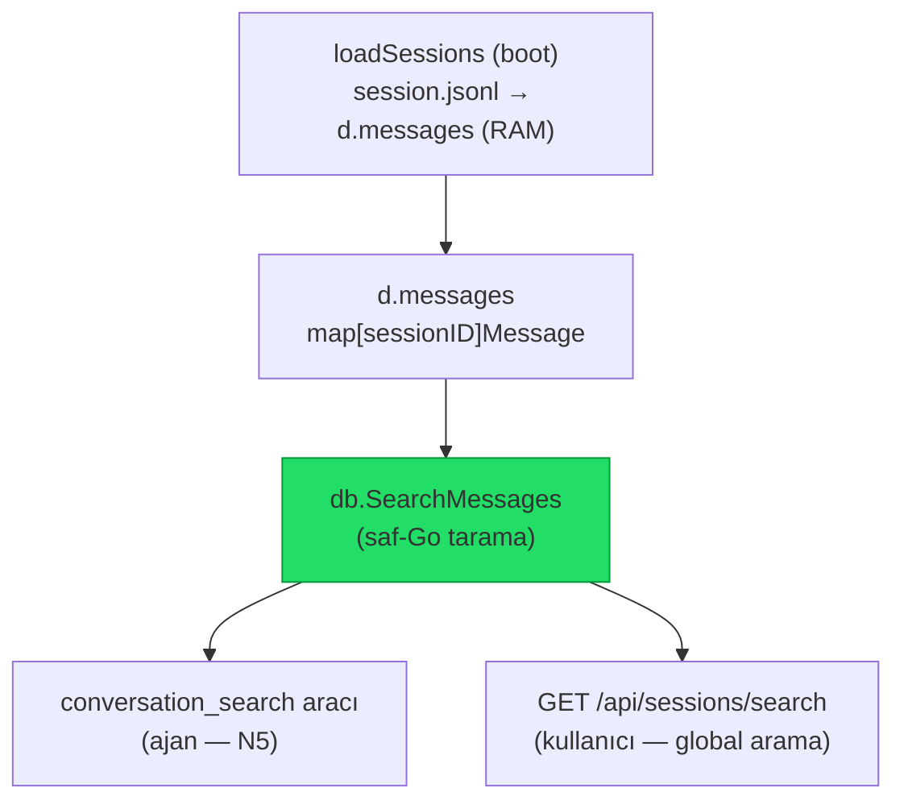
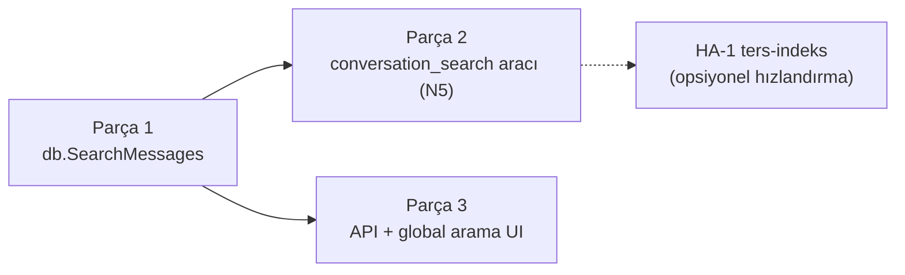

# 27 — Oturumlar-Arası Tam-Metin Arama (CG-16)

> **Güncelleme (2026-07-11):** Çapraz-session farkındalığı artık **her zaman açık ve
> hiç ayarı yok** (diğer pull araçları gibi). `Session bağlamı` (master), `Her turda ver`
> ve `Listelenecek geçmiş session sayısı` (RecentCount) — hepsi kaldırıldı. Pushed özet
> bloğu daima yalnız session'ın **ilk turunda**, sabit 5 geçmiş session ile verilir.
> `list_sessions` artık **sayfalanır**: `offset` argümanı + yanıtta "Showing X–Y of Z"
> ile tüm sessionlar (aktif/geçmiş) gezilebilir; `archive_sessions`/`conversation_search`
> daima sunulur.
>
> **Durum (2026-06-22): Parça 1, 2, 3 TAMAMEN UYGULANDI — görsel arama dahil.**
> Sidebar arama kutusu artık başlık + mesaj-içeriği arıyor; sonuca tıklayınca
> oturum açılıp ilgili mesaja kaydırılıp flash'lanıyor. Uygulama özeti dosyanın sonunda.
>
> **CLI köprüsü (2026-06-22):** `conversation_search` artık claude-cli ajanlarına da
> Interaction MCP üzerinden sunuluyor (eager built-in, native'de değişmeden kalır).
> Bkz. `11-INTERACTION-MCP.md`.
>
> **Roadmap maddesi:** `03-YOL-HARITASI.md` → **CG-16** (external-agent-oss P4).
> **Zemin olduğu işler:** **HA-1** (gelişmiş hafıza / FTS) ve **N5**
> (`conversation_search` aracı, bkz. `31-MEMGPT-CORE-MEMORY.md` — bu araçla kapandı).
> İnceleme/karar: 2026-06-22.

## Amaç

Bir workspace'teki **tüm oturumların mesaj geçmişinde** anahtar-kelime/ifade
araması: hem kullanıcı için global arama kutusu, hem ajan için `conversation_search`
aracı. Bugün yalnız oturum **başlığı + rolling summary** üzerinden farkındalık var
(`list_sessions` tool + `sessionsContextBlock`); **mesaj gövdelerinde arama yok**.

## Kilit gerçek — neden ripgrep/indeks gerekmez

TionHarness dosya-tabanlı ama **boot'ta tüm oturumları belleğe yükler**:
`internal/db/store.go` içinde `d.messages map[sessionID][]Message` (her oturumun
`session.jsonl`'i `loadSessions` ile okunup RAM'e alınır, bkz. `08-DEPOLAMA.md`).
Yani aranacak veri **zaten bellekte**. Sonuç:

- **Birincil tasarım = saf-Go bellek-içi tarama.** Yeni indeks, yeni dosya okuma,
  yeni bağımlılık yok. En basit yol aynı zamanda yeterli yol.
- **ripgrep yalnızca** ileride *lazy oturum yükleme*ye geçilirse (oturumlar RAM'de
  değilse) anlam kazanır → şimdilik **kapsam dışı**, sadece not. Başlıktaki
  "ripgrep/Go" ikileminde **Go kazanıyor** çünkü veri hâlihazırda yüklü.
- FTS5 (HA-1) de aynı sebeple **şart değil**; ters-indeks ancak corpus RAM'e
  sığmayacak kadar büyürse gerekir. CG-16 onsuz teslim edilir, HA-1 üzerine
  ters-indeks **opsiyonel hızlandırma** olarak gelebilir.



---

## Parça 1 — DB arama çekirdeği (`db.SearchMessages`)

**Dosya:** `internal/db/store_search.go` (yeni).

```go
type SearchHit struct {
    SessionID   string
    SessionTitle string
    MessageID   string
    Role        string // user | assistant | tool
    AgentID     string
    Snippet     string // eşleşme çevresi, vurgulu
    Score       float64
    CreatedAt   int64
}

type SearchOpts struct {
    Query       string   // boşluk = AND'lenen terimler
    Kinds       []string // vars. ["chat"]; boş = tümü
    Roles       []string // boş = tümü
    ExcludeID   string   // mevcut oturumu hariç tut (opsiyonel)
    SinceUnix   int64    // 0 = sınır yok
    Limit       int      // vars. 20
}

func (d *DB) SearchMessages(ctx context.Context, o SearchOpts) ([]SearchHit, error)
```

**Algoritma (RLock altında, mevcut `ListMessages` deseni):**
1. Sorguyu küçük harfe çevir, boşlukla terimlere böl (AND semantiği).
2. `d.sessions` üzerinde gez → `Kinds`/`ExcludeID` filtreleri; eşleşen oturumun
   `d.messages[sid]`'inde her mesajın `Text`'inde (gerekirse `ReasoningContent`)
   **tüm terimleri** ara (case-insensitive `strings.Contains`).
3. **Skor** = terim-eşleşme yoğunluğu + recency tazeliği
   (`C5` felsefesiyle uyumlu: `α·matchCount + β·recency`). Basit başlar; C5 gelince
   ortak ağırlık fonksiyonuna bağlanabilir.
4. Eşleşme çevresinden **snippet** üret (ilk terim etrafında ~160 rune pencere,
   rune-sınırında kes — Türkçe güvenli, mevcut `clip` deseni).
5. Skora göre sırala, `Limit`'e kes.

**Felsefe uyumu:** dep-siz, kilit-güvenli, sıfır I/O (RAM'den okur), sıfır LLM çağrısı.

### Test
- `store_search_test.go`: çok-oturumlu seed → tek terim, çok terim (AND), rol
  filtresi, `ExcludeID`, limit, snippet rune-sınırı, boş sorgu → boş sonuç.

---

## Parça 2 — Ajan aracı `conversation_search` (= N5)

**Dosya:** `internal/tools/builtin_conversation_search.go` (yeni).

`ListSessionsTool` deseniyle birebir. Letta'nın `conversation_search` tool'unun
karşılığı; **N5'i doğrudan karşılar**.

```go
type ConversationSearchTool struct{ db *db.DB }
func NewConversationSearchTool(database *db.DB) ConversationSearchTool
```

| Alan | Şema |
|---|---|
| Ad | `conversation_search` |
| Açıklama | "Search the full message history of this workspace's sessions for a keyword or phrase. Returns matching turns with a snippet, session title and age — use it to recall what was said or decided in past conversations." |
| Girdi | `{ query: string (req), limit?: int=15, role?: "user"\|"assistant"\|"all", exclude_current?: bool }` |

`Call` → `db.SearchMessages` → her hit'i tek satır biçimle:
`- [assistant] "Session Title" · 3d ago — …snippet…`. Sonuç yoksa
"No matching messages." döndür.

**Güçlendirme — birebir kurtarma (2026-06-24):** compact sonrası **kelime kelime** geri-getirme için araca
üç parametre eklendi (snippet tek başına kırpık olduğundan §17.10):

| Parametre | Etki |
|---|---|
| `full: bool` | Eşleşen mesajın **tam metni** birebir döner (snippet yerine). |
| `context: int` (0–5) | Her isabetin **N tur öncesi+sonrası** birebir eklenir; isabet `»»` ile işaretlenir. |
| `session_id: string` | Aramayı tek oturuma daraltır (`db.SearchOpts.OnlyID`). |

Tam/çevre metni `db.MessagesAround(sid, mid, before, after)` ile bellekteki transkriptten çekilir (LLM'siz).
Çıktı çok-satırlı: başlıkta `session_id` de var (ajan yeniden daraltabilsin). Header'da yaş hâlâ gösterilir.

**Kayıt:** `internal/agent/toolsetup.go` — `NewListSessionsTool`'un yanında,
**her zaman aktif** (cross-session context / `list_sessions` ile birlikte; toggle yok).
Lazy-load kataloğuna girebilir (`19-LAZY-TOOL-LOADING.md` deseni) — `activate_tools`
ile çekilir; sürekli prompt'ta durmasına gerek yok.

**`list_sessions` kapsam + sayfalama:** Araç **varsayılan olarak TÜM kind'leri**
listeler (chat + spawn/worker/flow/task/schedule) — eski `Kind=="chat"` sabit
filtresi kaldırıldı (2026-07-13), çünkü otonom koşular UI'nın sidebar/Overview'ında
görünürken ajanın `list_sessions`'ında görünmüyordu. Args: `state` (`active`|`all`,
vars. `active`) + **`kind`** (tek kind'e daralt; boş = hepsi) + `limit` (vars. 20) +
`offset` (vars. 0). Her satır `[kind·state]` ön ekiyle başlar. Yanıt sonunda
`Showing X–Y of Z` ve daha varsa `… pass offset:Y for the next page` — böylece tüm
sessionlar sayfa sayfa okunur.

### Test
- `builtin_conversation_search_test.go`: eşleşme biçimi, rol filtresi, boş sonuç,
  geçersiz girdi (boş query reddi).

---

## Parça 3 — Kullanıcı için global arama (API + UI)

**API:** `internal/api/sessions_search.go` (yeni) →
`GET /api/sessions/search?q=...&limit=...&role=...`. `withWorkspace` middleware
altında (workspace-scoped), `db.SearchMessages`'ı çağırır, `[]SearchHit` JSON döner.
Her hit `sessionId` + `messageId` taşır → UI sonuca tıklayınca oturumu açıp ilgili
mesaja kaydırır (deep-link).

**Frontend:** mevcut "/" komut paleti (`Runtime.Summarize` / talep-üzerine özetler)
veya sidebar arama kutusu içine bir **"Mesajlarda ara"** modu. Sonuç listesi:
oturum başlığı + snippet (eşleşme vurgulu) + yaş; tıkla → oturum + mesaj. Mevcut
sessions-only sidebar + okundu/okunmadı altyapısıyla uyumlu.

### Test
- `sessions_search_test.go`: endpoint workspace-izolasyonu (başka ws'in mesajı
  sızmaz), q boşsa 400, limit clamp.

---

## Kapsam ve sınırlar

- **Workspace-scoped** — `db` zaten per-workspace; çapraz-workspace arama yok
  (izolasyon felsefesi, `06-WORKSPACES.md`).
- **Eşleşme:** substring + AND (case-insensitive). Fuzzy/stemming/dizimsel arama
  **yok** (gerekirse HA-1 ters-indeksiyle gelir).
- **Alanlar:** `Message.Text` (birincil) + opsiyonel `ReasoningContent`. `ToolCalls`/
  `Steps` JSON'u **hariç** (gürültü); istenirse opsiyon eklenir.
- **Snippet** salt-okunur; arama sonucu mesajı değiştirmez.

## Geri-uyumluluk ve felsefe uyumu

- **Sıfır yeni bağımlılık** — saf-Go, RAM-içi; ripgrep/FTS5/SQLite yok.
- **Tek binary / offline korunur.**
- **Yeni veri yok** — mevcut `d.messages` üzerinden okur; migration yok.
- **Opt-in araç** — `conversation_search` lazy-load + capability gate; varsayılan
  davranış değişmez.

## Fazlama



| Adım | Efor | Bağımlılık | Değer |
|---|---|---|---|
| 1. `db.SearchMessages` çekirdek | ~yarım gün | yok | tüm üstyapının temeli |
| 2. `conversation_search` aracı (N5) | ~2 saat | Adım 1 | ajan recall'ı; N5 kapanır |
| 3. API + UI global arama | ~yarım gün | Adım 1 | kullanıcı değeri |

**Önerilen sıra:** 1 → 2 → 3. Adım 1 tek başına hiçbir şey göstermez ama 2 ve 3'ün
ortak temelidir; Adım 2 en düşük eforla en görünür ajan-değerini verir (N5'i de kapatır).

## Doğrulama

```powershell
cd <repo>
go build ./...
go test ./internal/db/... ./internal/tools/... ./internal/api/...
```

## Uygulama notu (2026-06-22)

Parça 1, 2 ve Parça 3'ün backend/contract'ı sevk edildi. Plandan sapma yok.

- **Çekirdek:** `db.SearchMessages` (`internal/db/store_search.go`) — saf-Go RAM-içi
  tarama, AND-terim eşleşme, `score = matchCount + recency` (C5 felsefesi),
  rune-sınırlı snippet. `SearchHit`/`SearchOpts` tipleri. Test: `store_search_test.go`
  (AND, rol filtresi, ExcludeID, limit, Türkçe snippet UTF-8 güvenliği).
- **Ajan aracı (N5):** `tools.ConversationSearchTool` (`builtin_conversation_search.go`),
  `conversation_search` — `ListSessionsTool` deseni. `toolsetup.go`'da artık
  **her zaman aktif** (list_sessions ile aynı; 2026-07-11'de toggle kaldırıldı). Test:
  `builtin_conversation_search_test.go`. **Not:** plandaki `exclude_current`
  düşürüldü — `tools`→`agent` import döngüsü olurdu; API tarafında `exclude` query
  param'ı ile karşılanıyor.
- **API:** `GET /api/sessions/search?q=&limit=&role=&exclude=`
  (`api/sessions_search.go`), `server.go`'da `active`'in yanında kayıtlı (literal
  segment, `{id}` ile çakışmaz). `[]SearchHit` döner.
- **Frontend contract:** `SearchHit` tipi (`types/session.ts`) +
  `sessionApi.searchMessages(q, {limit,role,exclude})` (`api/sessions.ts`).
  `tsc --noEmit` temiz.
- **Doğrulama:** `go build ./...` + db/tools/api/agent testleri (200) yeşil.
- **Görsel arama (2026-06-22):** `SessionsSidebar` arama kutusu artık çift işlevli —
  yereldeki başlık filtresi + `api.searchMessages` ile mesaj-içeriği araması (≥2 char,
  250ms debounce, `cancelled` guard'lı). "Mesajlarda (N)" bölümü rol-rozeti + snippet +
  yaş ile listeler; tıklayınca `onSelectSession(sessionId, messageId)`. App `selectSession`
  artık opsiyonel `messageId` taşır → `scrollToMsgId` state → `MessageList`. `MessageList`
  her satırı `data-msg-id` ile sarmalar; `highlightMessageId` değişince hedefe
  `scrollIntoView({block:'center'})` + 1.6sn accent-ring flash, sonra `onHighlightConsumed`
  ile temizlenir. `tsc --noEmit` + `npm run build` + `go build ./...` yeşil.

## Ayrıca bakınız

- **`03-YOL-HARITASI.md`** — CG-16 (bu plan), HA-1 (FTS/kullanıcı modelleme),
  CG-18 (session labels/batch — arama ile bütünleşir).
- **`31-MEMGPT-CORE-MEMORY.md`** — N5 (`conversation_search`), C5 (recency+importance
  ağırlıklandırma; arama skoruyla ortak felsefe).
- **`08-DEPOLAMA.md`** — `session.jsonl` + boot `loadSessions` → `d.messages` (RAM).
- **`19-LAZY-TOOL-LOADING.md`** — aracın talep-üzerine yüklenmesi.
