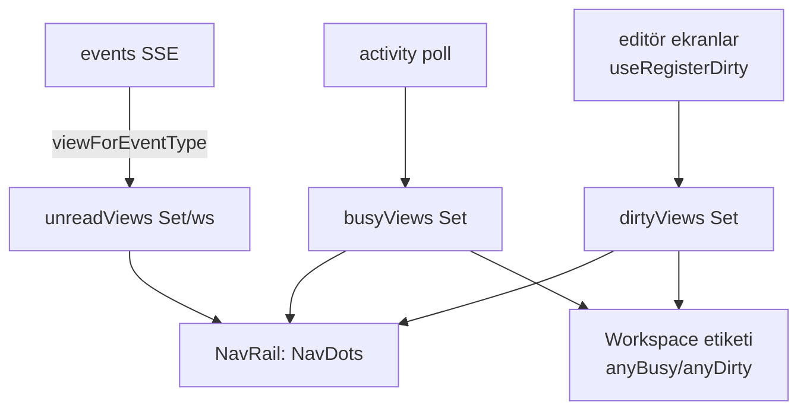

# Generic Bildirim Sinyalleri (nav + workspace)

> "Dışarıya ve kullanıcıya haber verme" katmanı tek bir generic sisteme toplandı.
> Son güncelleme: **2026-07-24** (çapraz-workspace "çalışıyor" nabzı eklendi)

## Üç dik sinyal

Her nav görünümü (View) için birbirinden bağımsız üç sinyal taşınır ve hepsi
workspace etiketine **yukarı toplanır**:

| Sinyal | Anlam | Görsel | Kaynak |
|--------|-------|--------|--------|
| **busy** | bir iş çalışıyor | accent **nabız** nokta | `GET /api/activity` (3sn poll) → `useActivity` |
| **unread** | görmediğin yeni etkinlik | accent **dolu** nokta | SSE `/api/events` → `useUnreadViews` |
| **dirty** | kaydedilmemiş yerel düzenleme | **amber** nokta (`--color-warning`) | `lib/dirtySignals` modül store → `useRegisterDirty` |

## Akış

## Parçalar

- **Backend — eksik event'ler eklendi** (`api/notify.go` → `publishEntityChange`):
  - `board` — `handleUpdateTask`'ta board-state değişince.
  - `artifact` — agent yolu (`artifactSink.CreateArtifact/UpdateArtifact`, en
    önemli "dışarıya haber" hali) + UI `handleCreate/UpdateArtifact`.
  - Bunlar chat/flow/spawned/schedule ile **aynı SSE borusunu** kullanır.
- **Event → View eşlemesi**: `lib/eventViews.ts` (`viewForEventType`). App-global
  tipler (settings/workspaces) `null` döner → view rozeti yok.
- **unread**: `hooks/useUnreadViews.ts` — workspace başına ayrı set, `localStorage`
  + `storage` event ile **cross-window** senkron (workspace-unread rozetiyle aynı
  desen). View görüntülenince temizlenir (App'te `markViewRead(view)` efekti).
- **busy — yerel gecikmesiz sinyal ve mutabakatı**: 3sn poll'a ek olarak
  `useChatStream.streamingSessions` (bu pencerenin canlı tur mandalı) anında
  `chat` noktasını yakar. Mandal **yalnız olayla** temizlenir ve tamamlanma
  olayları `useAppEvents`'te aktif workspace'e göre filtrelenir → kullanıcı tur
  bitmeden başka workspace'e geçerse mandal sekme kapanana dek asılı kalır.
  Oturum ID'leri store başına sayaçla üretildiği için (`SES1`, `SES2`… her
  workspace'te yeniden başlar) bu yetim ID karşı workspace'teki gerçek bir
  oturumla çakışır ve **iş yokken "Sohbet" noktasını yakardı**. Çözüm:
  her workspace geçişinde `GET /api/sessions/active` otoriter kabul edilir —
  `chat.reconcileActive(ids)` pending'i bu listeyle **değiştirir**, streaming'i
  listeye **daraltır** (`intersectWith`). Eski `markPending` yalnız eklerdi.
- **dirty**: `lib/dirtySignals.ts` — `useSyncExternalStore` tabanlı modül store
  (provider gerektirmez). Editörler `useRegisterDirty(view, isDirty)` ile kaydolur;
  unmount'ta otomatik temizlenir. Kayıtlı ekranlar: `SettingsPanel` (`settings`),
  `WorkspaceView` (`workspace`), `FlowsPanel` (`flows`).
- **NavRail**: `busyViews/unreadViews/dirtyViews` prop'ları + `NavDots` bileşeni
  (collapsed → köşe noktaları, expanded → sağ küme). Alt menü (Workspace/Ayarlar)
  yalnız dirty gösterir.
- **Workspace etiketi**: `WorkspaceSwitcher` (`activeBusy`/`activeDirty`) ve
  collapsed workspace ikonu, aktif workspace'in toplu sinyalini gösterir; diğer
  workspace'ler mevcut unread rozetinden gelir.

## `busy` sinyalinin kaynakları (merkezî: turn kuyruğu)

`handleActivity` / `workspaceRunning` (`internal/api/activity.go`) şu kaynakların
birleşimini alır:

| Kaynak | Kapsam |
|--------|--------|
| `chatRuns` (`s.runs`, server-wide → workspace'e scope'lanır) | Akan (streamed) sohbet turu |
| `Runtime.ActiveSessionIDs()` | Otonom invoke: schedule wake, spawn, inbox teslimi, flow ajan düğümü |
| **`Runtime.BusyTurnSessionIDs()`** (`internal/turnqueue` → `Queue.BusySessionIDs`) | **Slotu tutan HER tur** — merkezî kaynak |
| `DB.HasRunningFlowRuns()`, `Runtime.InsightScanActive()` | Flow run / içgörü taraması |

Bu birleşim tek yerde yapılır: **`Server.runningSessionIDs(wsp)`**
(`internal/api/running_sessions.go`). `handleActivity`, `/api/executions`,
ağ grafiği (`graph.go`) ve `/api/sessions/active` hepsi ondan okur — yeni bir
koşu kaynağı eklenince dört ayrı yer değil, tek fonksiyon güncellenir.

Turn kuyruğu merkezî kaynaktır çünkü süreçteki **her** tur giriş yolu
(`BeginSessionUserTurn`, `ClaimSessionCommandTurn`, `claimSessionTurnSlot`)
oturumun admission slotunu alır. Bu eklenmeden önce slash komutları
(`/compact`, `/handoff`) HTTP goroutine'inde koşuyor, hub'a canlı "working"
balonu yayınlıyor ama iki registry'de de yer almadığı için `/api/activity`
"boşta" diyordu → nav rail noktası hiç yanmıyordu. Yeni bir tur yolu eklerken
aktivite tarafında ek bir kayıt yapmak **gerekmez**; slotu almak yeterli.

## Çapraz-workspace "çalışıyor" (workspace listesi)

`busy` sinyali per-view olarak yalnız **aktif** workspace'i kapsar (`/api/activity`
o workspace-scoped). Workspace **listesinde** (switcher açılır menüsü) aktif olmayan
workspace'lerde de canlı koşuyu göstermek için ayrı bir çapraz-workspace sinyal var:

| Parça | Görev |
|-------|-------|
| **Backend** `GET /api/workspaces/activity` (`api/activity.go` → `handleWorkspacesActivity` + `workspaceRunning`) | Her workspace için tek `running` bayrağı: aktif oturum (server-wide `chatRuns` + runtime + turn kuyruğu), çalışan task/flow run. Global route (aktif workspace gerektirmez). |
| **Hook** `app/useWorkspaceActivity.ts` | 4sn poll + **iki** refresh sinyali → `busyWorkspaceIds: Set<string>`. `executions` (aktif ws'in kendi başlat/bitir) + `workspace-activity` (herhangi bir ws'te run-lifecycle olayı; aktif olmayan ws'ler için anlık). |
| **SSE anlık tazeleme** `useAppEvents` | Çapraz-workspace dalında (`markWorkspaceUnread` yanında) `bumpWorkspaceActivityForEvent(e)` → run-lifecycle tipleri (`chat/flow/schedule/spawned/worker/task`) `workspace-activity` sinyalini bumlar. Aktif-scoped `executions`/`activity` sinyalleri çapraz-ws'te **bilerek bumlanmaz** (boşuna refetch olmasın). |
| **UI** | `WorkspaceSwitcher` / `MobileWorkspaceButton` açılır listede her satırda **açık metin etiketi**: yeşil nabız + **"çalışıyor"** (`--color-success`) ya da accent nokta + **"tamamlandı"** (`--color-accent`). `running` `unread`'in **önüne** geçer. Aktif olmayan bir workspace çalışıyorsa switcher trigger'ı + collapsed rail ikonu accent noktayı **pulse** eder (`anyOtherBusy`). Aktif workspace'in kendi "tamamlandı"sı listede filtrelenir (`unreadWs` aktif ws'i çıkarır) çünkü zaten oturum listesinde `StatusPill` ile zengin gösterilir. |

**"Tamamlandı"** ayrı bir sinyal DEĞİL — biten koşu mevcut SSE `unread` accent
noktası olarak yansır (`markWorkspaceUnread`, cross-window kalıcı). Yani liste
satırında: yeşil nabız = çalışıyor, accent dolu nokta = tamamlandı/görülmemiş.

## Pencere dışı: tab başlığı + taskbar rozeti

Toplam **görülmemiş** öğe sayısı pencere dışına da taşınır:

- **Tab başlığı**: pencere **odakta değilken** `(N) TionHarness`, odaktayken sade
  `TionHarness`. (`hooks/useUnreadBadge.ts` — `focus`/`blur`/`visibilitychange`.)
- **Taskbar/dock rozeti**: `navigator.setAppBadge(N)` (Chromium Badging API).
  Edge/WebView2'de çalıştığı için **native masaüstü penceresi taskbar rozetini
  bedavaya** alır. Opsiyonel `window.tionharnessSetBadge(N)` host köprüsü de çağrılır
  (kabuk sağlarsa; yoksa no-op). `lib/appBadge.ts`.

`unreadTotal` = okunmamış sohbet oturumları (aktif ws) + etkinlik olan diğer
workspace'ler + chat-dışı view rozetleri (`App.tsx`). Hesap chat'i iki kez saymaz.

> Not: native ITaskbarList3 overlay ikonu istenirse `tionharnessSetBadge` köprüsü
> `cmd/tionharness-desktop` tarafında uygulanabilir; Badging API çoğu durumu kapsar.

## Ajan güdümlü bildirim: `notify` aracı

Ajan, bu boruyu **programatik** olarak `notify(title, body, level)` aracıyla tetikler
(Interaction MCP Faz 3, 2026-06-25 — `_Docs\11` §17). Araç `events.Event{Type:"agent"}`
yayınlar → aynı SSE borusu → OS toast (`agent` tipi `NOTIFY_TYPES`'ta, susturulabilir).
Bloklamaz; sink yoksa (otonom, açık client yok) graceful no-op. Native + claude-cli
yollarının ikisinde de çalışır; kaynak `internal/api/notifysink.go`. Kullanım: ajanın
kullanıcı uygulamaya bakmıyorken haber vermesi gereken durumlar ("uzun iş bitti", "hata").

## Masaüstü bildirim ana anahtarı: workspace override (3-durumlu)

Masaüstü OS-toast'larını kesen **ana anahtar** iki kaynaktan çözülür: uygulama-genel
varsayılan (`AppSettings.DesktopNotifications`) + **aktif workspace'in override'ı**.
Bu, TionHarness'in fiziksel workspace izolasyonuyla tutarlı — kullanıcı arka planda
koşan bir "otonom" workspace'i susturup üzerinde çalıştığını açık tutabilir (ya da
tersi).

| Katman | Alan | Anlam |
|--------|------|-------|
| **Backend model** `internal/workspace/settings.go` | `WSSettings.DesktopNotifications *bool` (`omitempty`) | `nil` = genel ayarı miras al (varsayılan); `*true`/`*false` = bu workspace için zorla aç/kapat. |
| **Patch** aynı dosya | `WSSettingsPatch.DesktopNotifications **bool` (`json:"-"`) + özel `UnmarshalJSON` | Üç durumu ayırır: nil (dokunma) / non-nil→nil iç (override'ı temizle) / non-nil bool (zorla). Tel string'i (`"inherit"\|"on"\|"off"`) `UnmarshalJSON` bu şekle map eder; tanınmayan değer hata verir. |
| **DTO** `internal/api/workspace_settings.go` | `desktopNotifications string` (`desktopNotificationsToString`) | `nil→"inherit"`, `true→"on"`, `false→"off"`. |
| **Frontend tip** `frontend/src/types/workspace.ts` | `DesktopNotificationsMode = 'inherit'\|'on'\|'off'` | `WorkspaceSettings.desktopNotifications` + patch alanı. |
| **Çözümleyici** `frontend/src/shared/lib/desktopNotifications.ts` | `resolveDesktopNotifications(wsMode, globalEnabled)` | Override `inherit` değilse onu, yoksa geneli döndürür. |
| **Efektif kapı** `frontend/src/app/useAppearance.ts` | `notifyEnabled` ref | Genel master + aktif-ws override iki ayrı ref'te; her biri değişince `applyResolvedNotify()` `notifyEnabled.current`'ı yeniden hesaplar. Bu ref, hem `useAppEvents` hem chat-stream toast yollarının **tek** ana kapısıdır. |
| **UI** `frontend/src/features/settings/NotificationsPanel.tsx` | `Segmented` 3-durumlu kontrol | Ana toggle'ın altında "Bu workspace için bildirimler". Kendi kendine yüklenir/kaydeder (`updateWorkspaceSettings`), sonra `onWorkspaceNotifySaved(mode)` ile canlı yeniden çözümlemeyi tetikler (workspace switch beklemeden). |

Not: **Tip-bazlı** mute (`notifyPrefs.ts`) hâlâ cihaz-özel (`localStorage`),
workspace-bağımsız. Yalnız ana anahtar workspace-scoped yapıldı. Susturulabilir
türlerin tam listesi artık tek registry'den gelir (aşağı bak) — `chat` (yanıt hazır)
ve `prompt` (onay/soru) dahil.

## Masaüstü toast: tek funnel + tek registry (2026-07-24 refactor)

Önceden "bu olay toast olsun mu?" kararı **üç ayrı yerde** kopyalanmıştı (SSE chat
dalı, SSE generic dalı, session-stream ask yolu) → tip-bazlı mute yalnız birinde
çalışıyor, chat-yanıtı ve ask/onay bildirimleri hiç susturulamıyordu. Ayrıca
susturulabilir tiplerin listesi backend string literalleri + `NOTIFY_TYPES` +
`viewForEventType`'a dağılmıştı → ayarlar ekranı gerçeği yansıtmıyordu (ör. hiç
yayınlanmayan bir `task` tipini listeliyordu; oysa görev değişiklikleri `board`
event'i). Refactor bunu tek kaynağa topladı:

| Katman | Dosya | Görev |
|--------|-------|-------|
| **Backend registry** | `internal/events/types.go` | Tüm event tipleri için isimli sabitler (`TypeChat`/`TypeBoard`/…) + kullanıcıya-dönük **`NotifyKinds`** seti + `IsNotifyKind`. Toast üreten emit noktaları artık string literal yerine bu sabitleri kullanır. |
| **Frontend registry** | `shared/lib/notifyTypes.ts` | Tek `NOTIFY_TYPES` listesi: `{type,label,hint,view,cue}`. `NotifyKinds`'ı yansıtır + yalnız-frontend `prompt` tipini ekler (ask/onay; backend event'i yok). `viewForEventType` (`eventViews.ts`) ve `notifyPrefs.NOTIFY_TYPES` bundan türer → ayarlar ekranı **tüm** tipleri otomatik yansıtır. |
| **Tek funnel** | `shared/lib/notifyBus.ts` | `emitToast({type,enabled,title,body,tag,onClick})`: (1) tipin ses uyarısını çalar (`playCue` — yalnız ses-efektleri tercihine bağlı, tip-mute'tan bağımsız), (2) tip Ayarlar'da susturulmuşsa çıkar, (3) `clientPrefs.notify` ile master-gate + arka-plan kuralıyla OS toast. `useAppEvents` (chat + generic dal) ve `chatStreamHub` (ask) hepsi bunu çağırır. |

`chat` ve `prompt` artık gerçek susturulabilir tip: türü kapatmak yalnız OS toast'ı
susturur; ses uyarısı Ses ekranındaki "Ses efektleri" tercihini izlemeye devam eder.

## Yeni bir bildirim tipi eklemek

1. Backend'de `internal/events/types.go`: sabiti tanımla ve toastable ise
   **`NotifyKinds`**'e ekle. Mutasyon noktasında sabiti kullan
   (`publishEntityChange(wsp, events.Type<X>, …)` ya da `Runtime.Emit`).
2. Frontend'de `shared/lib/notifyTypes.ts` → `NOTIFY_TYPES`'a `{type,label,hint,view,cue}`
   satırı ekle. Ayarlar ekranı, view badge'i ve toast gating'i otomatik gelir.
3. (Opsiyonel) editör ekranıysa `useRegisterDirty('<view>', isDirty)` ekle.
