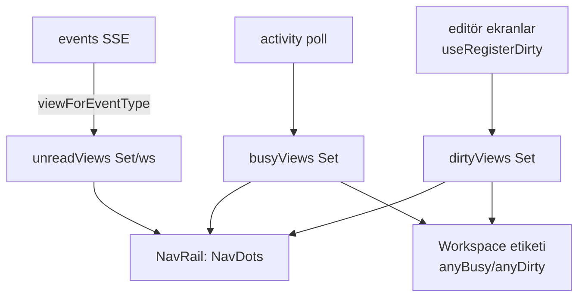

# Generic Bildirim Sinyalleri (nav + workspace)

> "Dışarıya ve kullanıcıya haber verme" katmanı tek bir generic sisteme toplandı.
> Son güncelleme: **2026-06-23**

## Üç dik sinyal

Her nav görünümü (View) için birbirinden bağımsız üç sinyal taşınır ve hepsi
workspace etiketine **yukarı toplanır**:

| Sinyal | Anlam | Görsel | Kaynak |
|--------|-------|--------|--------|
| **busy** | bir iş çalışıyor | accent **nabız** nokta | `GET /api/activity` (3sn poll) → `useActivity` |
| **unread** | görmediğin yeni etkinlik | accent **dolu** nokta | SSE `/api/events` → `useUnreadViews` |
| **dirty** | kaydedilmemiş yerel düzenleme | **amber** nokta (`--color-warning`) | `lib/dirtySignals` modül store → `useRegisterDirty` |

## Akış

## Parçalar

- **Backend — eksik event'ler eklendi** (`api/notify.go` → `publishEntityChange`):
  - `board` — `handleUpdateTask`'ta board-state değişince.
  - `artifact` — agent yolu (`artifactSink.CreateArtifact/UpdateArtifact`, en
    önemli "dışarıya haber" hali) + UI `handleCreate/UpdateArtifact`.
  - Bunlar chat/flow/spawned/schedule ile **aynı SSE borusunu** kullanır.
- **Event → View eşlemesi**: `lib/eventViews.ts` (`viewForEventType`). App-global
  tipler (settings/workspaces) `null` döner → view rozeti yok.
- **unread**: `hooks/useUnreadViews.ts` — workspace başına ayrı set, `localStorage`
  + `storage` event ile **cross-window** senkron (workspace-unread rozetiyle aynı
  desen). View görüntülenince temizlenir (App'te `markViewRead(view)` efekti).
- **dirty**: `lib/dirtySignals.ts` — `useSyncExternalStore` tabanlı modül store
  (provider gerektirmez). Editörler `useRegisterDirty(view, isDirty)` ile kaydolur;
  unmount'ta otomatik temizlenir. Kayıtlı ekranlar: `SettingsPanel` (`settings`),
  `WorkspaceView` (`workspace`), `FlowsPanel` (`flows`).
- **NavRail**: `busyViews/unreadViews/dirtyViews` prop'ları + `NavDots` bileşeni
  (collapsed → köşe noktaları, expanded → sağ küme). Alt menü (Workspace/Ayarlar)
  yalnız dirty gösterir.
- **Workspace etiketi**: `WorkspaceSwitcher` (`activeBusy`/`activeDirty`) ve
  collapsed workspace ikonu, aktif workspace'in toplu sinyalini gösterir; diğer
  workspace'ler mevcut unread rozetinden gelir.

## Yeni bir event tipi/görünüm eklemek

1. Mutasyon noktasında `publishEntityChange(wsp, "<type>", title, body, target)` çağır.
2. `viewForEventType` içine `case "<type>": return '<view>'` ekle.
3. (Opsiyonel) editör ekranıysa `useRegisterDirty('<view>', isDirty)` ekle.
