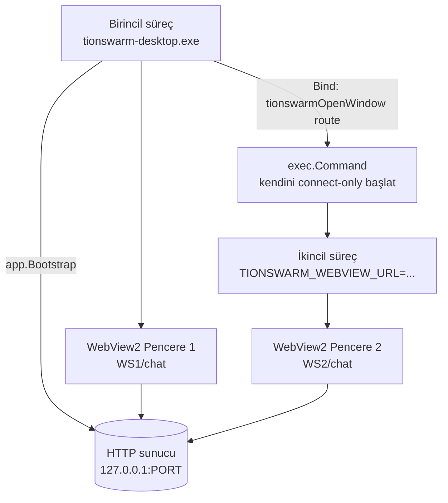

# TionSwarm — Masaüstünde Çoklu Pencere (Workspace'i Yeni Pencerede Aç)

> Durum: **UYGULANDI ✅ (2026-06-23)** — N süreç / N pencere modeli. "Workspace'i yeni
> pencerede aç" artık Edge'e sızmadan, aynı sunucuya bağlı yeni bir native TionSwarm
> penceresi açar. Canlı doğrulandı: birincil (Bind çökmedi) + connect-only ikincil
> (kendi sunucusunu kurmaz, aynı porta bağlanır) + loopback-dışı URL reddi.
>
> Gerçekleşen wiring: `cmd/tionswarm-desktop/main.go` (`runPrimary`/`runSecondary` + `w.Bind
> ("tionswarmOpenWindow")` + HTTP `fetchAppearance` ile connect-only başlık teması),
> `openwindow_windows.go` (`spawnWindow` self-exec), frontend
> `WorkspaceSwitcher.openInNewWindow` (WebView2 köprüsü + tarayıcı fallback).
>
> **Önemli incelik (düzeltildi):** `spawnWindow` **`proc.Command` DEĞİL düz `exec.Command`**
> kullanır. `proc.Command`, konsol yanıp sönmesini önlemek için `HideWindow`
> (`STARTF_USESHOWWINDOW`+`SW_HIDE`) ayarlar; bu, GUI çocuğunun WebView2 penceresini de
> **gizli** başlatırdı → "imleçte loading çıkar ama pencere açılmaz" belirtisi. İkincil zaten
> `-H windowsgui` (konsolsuz) olduğundan gizlemeye gerek yok. Görünürlük canlı doğrulandı:
> ikincil başlatınca görünür pencere sayısı 1→2.

## Tek-instance store kilidi (2026-07-25)

Bu modelin geçerliliği **tek sunucu, N pencere** varsayımına dayanır: hub (per-session
seq/ring), serial send-queue, coordSlot tur kilidi, interaction CAS ve cron scheduler
hepsi **tek process'in belleğinde**. Aynı file store'a **iki server process** hizmet
ederse ikisi de olur → cross-process eşzamanlı tur, çift ateşlenen schedule, boot'ta
çift re-dispatch, last-writer-wins entity ezmesi (store bozulması).

Masaüstü birincil `:0` portu bağladığından (double-launch'ı yakalayacak port çakışması
yok) ve store seviyesinde kilit yoktu → binary iki kez başlatılırsa iki birincil aynı
store'u ezerdi. **Çözüm (sert ret):** `app.Bootstrap` artık store'a girmeden **DataDir
üzerinde process-ömürlü exclusive advisory kilit** alır (`internal/app/instancelock*.go`;
Windows `CreateFile` share=0, Unix `flock` — yeni bağımlılık yok, process çıkışında OS
otomatik bırakır → crash sonrası stale kilit kalmaz). Kilit tutuluysa net hatayla başlamayı
reddeder. Connect-only ikincil pencereler `Bootstrap` çağırmadığından etkilenmez. Test:
`instancelock_test.go`. Not: bu **sert ret**; ileride masaüstü için "zarif yönlendirme"
(ikinci launch → mevcut instance'a connect-only pencere) opsiyonel bir iyileştirme.

## Sorun (bugün)

`frontend/.../WorkspaceSwitcher.tsx` `openInNewWindow` → `window.open(url, '_blank')`.
Tarayıcıda aynı app'in yeni sekmesi açılır (çalışır). Ama WebView2 masaüstü uygulaması
`window.open`'ı handle etmediğinden WebView2 varsayılanı URL'yi **sistem tarayıcısında (Edge)**
açar → üstte adres çubuğu + kopuk bağlam; composer ajan seçili olmadığından mesaj gönderilemez.

## Mimari karar — pencere başına ayrı süreç

go-webview2'nin `Run()`'ı **süreç başına tek, bloklayan bir mesaj döngüsüdür**; tek süreçte
ikinci bir WebView2 penceresi açmak zahmetli/desteklenmiyor. Bu yüzden:

> **Her ek pencere = `tionswarm-desktop.exe`'nin yeni bir "connect-only" örneği**, aynı
> halihazırda çalışan sunucuya (loopback portu) bağlanır. Sunucu tek (birincil süreçte);
> ek pencereler yalnız o sunucuyu render eder.

Bu, go-webview2'nin tek-pencere modeline tam uyar ve tüm sunucu/durum mantığını tek noktada tutar.



## Akış

1. **Birincil süreç** (mevcut): `app.Bootstrap` ile sunucuyu `127.0.0.1:0`'da açar, Pencere 1'i
   gösterir. **Yeni:** WebView'e bir host fonksiyonu **bind** eder:
   `w.Bind("tionswarmOpenWindow", openWindow)`.
2. **Frontend** (`openInNewWindow`): WebView2 algılarsa (`window.chrome?.webview` **ve**
   `window.tionswarmOpenWindow` var) → `window.tionswarmOpenWindow(route)` çağırır; aksi halde
   (tarayıcı/dev) eski `window.open` davranışı korunur.
3. **`openWindow(route)` (Go, birincil)**: `exec.Command(os.Executable())`'ı
   `TIONSWARM_WEBVIEW_URL = baseURL + "/#" + route` env'i ile başlatır (düz `exec.Command` —
   `proc.Command` DEĞİL, çünkü onun `HideWindow`'u webview penceresini de gizlerdi → konsol
   yanıp sönmesi yok). Fire-and-forget.
4. **İkincil süreç** (connect-only): `TIONSWARM_WEBVIEW_URL` set ise **sunucu açmaz**
   (`app.Bootstrap` atlanır); yalnız DPI + WebView2 penceresi kurup o URL'ye `Navigate` eder.

## Kod değişiklikleri

### Backend — `cmd/tionswarm-desktop`

- **`main.go`**: başta `if url := os.Getenv("TIONSWARM_WEBVIEW_URL"); url != "" { runSecondary(url); return }`.
  - `runSecondary(url)`: loopback doğrula (`http://127.0.0.1:` öneki — güvenlik), `setDPIAware`,
    `LockOSThread`, WebView2 penceresi (aynı boyut/başlık), title bar temasını **HTTP'den** çek
    (`GET <base>/api/settings` → preset) `applyTitleBar`, `Navigate(url)`, `Run()`.
  - Birincil yol (mevcut): `app.Bootstrap` + Pencere; ek olarak `w.Bind("tionswarmOpenWindow", ...)`.
- **`openwindow_windows.go` (yeni)**: `spawnWindow(baseURL, route string)` →
  `exe, _ := os.Executable(); cmd := exec.Command(exe); cmd.Env = append(os.Environ(),
  "TIONSWARM_WEBVIEW_URL="+baseURL+"/#"+route); cmd.Start()`.
- **Title bar — connect-only varyantı**: `app.App.Appearance()` yok; küçük bir HTTP yardımcı
  `fetchAppearance(base) (preset, theme string)` (`GET /api/settings`, mevcut DTO `themePreset`/
  `theme` döner) + aynı `watchTitleBar` mantığı HTTP poll ile. (Basit v1: yalnız açılışta uygula.)

### Frontend — `WorkspaceSwitcher.tsx`

```ts
function openInNewWindow(id: string) {
  const route = buildRoute({ workspaceId: id, view: 'chat', id: null })
  const w = window as any
  if (w.chrome?.webview && typeof w.tionswarmOpenWindow === 'function') {
    w.tionswarmOpenWindow(route)          // native: yeni TionSwarm penceresi (ayrı süreç)
    return
  }
  // Tarayıcı/dev: eski davranış (aynı app, yeni sekme)
  window.open(`${location.origin}${location.pathname}#${route}`, '_blank', 'noopener')
}
```

(Opsiyonel: `lib/desktop.ts` `isDesktop()` / `openNativeWindow(route)` yardımcılarıyla
soyutla, ileride başka yerlerde de kullanılsın.)

## Yaşam döngüsü ve kenar durumlar

| Durum | Davranış |
|-------|----------|
| İkincil pencere kapatıldı | O süreç biter; sunucu ve diğer pencereler etkilenmez |
| **Birincil** pencere kapatıldı | Sunucu kapanır → ikincil pencereler backend'siz kalır (fetch'ler düşer) |
| Birincil kapanınca ikincilleri de kapat | **v1 kapsamı dışı.** İkincil pencere `/health` poll edip sunucu gidince kendini kapatabilir (v2 iyileştirmesi) |
| Güvenlik | `TIONSWARM_WEBVIEW_URL` yalnız `http://127.0.0.1:`/`http://localhost:` kabul; aksi halde reddet+çık |
| Çok sayıda pencere | Her biri ayrı süreç (~ek RAM); WebView2 runtime paylaşılır, makul |
| Tarayıcı/dev modu | Hiç değişmez — `window.open` ile eski davranış |

## Neden ayrı süreç (alternatifler)

- **NewWindowRequested handle etme**: go-webview2 bu olayı expose etmiyor; binding'i genişletmek
  veya farklı kütüphane gerekir → kapsam büyür.
- **Tek süreçte çoklu pencere**: go-webview2 `Run()` tek mesaj döngüsü; ikinci pencere için
  desteklenmiyor.
- **Ayrı süreç**: mevcut binary'yi yeniden kullanır, sıfır yeni bağımlılık, izole; **seçilen**.

## Doğrulama planı

1. `go build ./...`/`vet` yeşil; başsız `tionswarm` ve birincil masaüstü davranışı değişmedi.
2. Canlı: masaüstünü aç → WS2'yi "yeni pencerede aç" → **ayrı bir native TionSwarm penceresi**
   açılır (Edge değil, adres çubuğu yok), WS2/chat yüklenir, **mesaj gönderilebilir**.
3. Başlık çubuğu ikincil pencerede de temaya uygun.
4. İkincil pencereyi kapat → birincil etkilenmez. Tarayıcı/dev modunda eski davranış korunur.
5. Güvenlik: `TIONSWARM_WEBVIEW_URL=http://evil.com` ile başlat → reddedilir.

## Uygulama adımları (sıra)

1. `cmd/tionswarm-desktop/main.go`: connect-only dalı + `runSecondary` + `w.Bind("tionswarmOpenWindow")`.
2. `openwindow_windows.go`: `spawnWindow` (düz `exec.Command` ile self-exec; `proc.Command` değil).
3. Title bar connect-only: `fetchAppearance(base)` HTTP yardımcı.
4. Frontend `WorkspaceSwitcher.openInNewWindow`: WebView2 köprüsü + fallback (+ ops. `lib/desktop.ts`).
5. Build (UI + desktop) + canlı doğrulama (yukarıdaki 5 madde).
6. README/`32-NATIVE-PENCERE.md` güncelle, `05-ILERLEME.md` girdisi.

## Tahmini efor

Orta. En ince kısım: connect-only başlık çubuğu teması (HTTP'den okuma) ve Bind callback'inin
doğru thread'de süreç başlatması (Dispatch gerekmez; başlatma saf `os/exec`, UI thread'i bloklamaz).
v1 "açılışta tema + birincil kapanınca ikincil otomatik kapanmaz" sınırlarıyla küçük tutulabilir.
