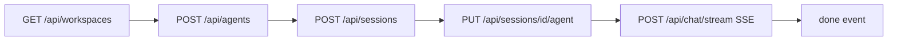

# 33 — Dış Ajan Otomasyonu (TionSwarm'yu Dışarıdan Sürmek)

> TionSwarm'yu **harici bir ajanın** (chrome-mcp, playwright-mcp veya düz HTTP istemcisi)
> baştan sona kontrol etmesi için referans. İki yol vardır; çoğu senaryoda **API yolu**
> tercih edilir, UI yolu yalnızca gerçek tarayıcı/oturum gerektiğinde kullanılır.

## TL;DR — Hangi Yol?

| Yol | Ne zaman | Sağlamlık |
|-----|----------|-----------|
| **HTTP API** (REST + SSE) | Varsayılan. Ajan workspace/agent/session yönetir, tur çalıştırır, akış tüketir. | Yüksek — kararlı sözleşme |
| **UI tıklama** (chrome-mcp / playwright) | Görsel doğrulama, gerçek kullanıcı oturumu, UI regresyon testi | Orta — `data-testid` ile sağlamlaştırıldı |

**Karar:** Bir işi API ile yapabiliyorsan API kullan. UI otomasyonu yalnızca "kullanıcı
gözünden" doğrulama veya tarayıcı-bağımlı senaryolar için.

---

## A. HTTP API Yolu

### A.1 Temel Bilgiler

- **Base URL (dev):** `http://127.0.0.1:8090` · **Varsayılan:** `http://127.0.0.1:8080` (`TIONSWARM_ADDR`)
- **Kimlik doğrulama: YOK.** Hiçbir token/anahtar gerekmez (`server.go:withCORS`). Yerel,
  tek-kullanıcılı runtime için bilinçli. Ağa açarsan (`0.0.0.0`) önüne reverse-proxy auth koy.
- **CORS: wildcard açık** — `Access-Control-Allow-Origin: *`, izinli header'lar
  `Content-Type, Authorization, X-Workspace-Id` (`server.go:491`). Yani tarayıcı içinden
  (`fetch`) de, sunucudan da çağrılabilir.
- **Workspace seçimi:** İstek `X-Workspace-Id: <id>` header'ı **veya** query
  parametresi ile kapsamlanır — `?ws=` · `?workspace=` · `?workspaceId=` ·
  `?workspace_id=` (hepsi eşdeğer; query, header'ı **ezer**). Hiçbiri yoksa
  **default workspace**'e düşer. Hiçbir auth kapısı yok; workspace = veri
  görünürlük sınırı.
  - **Bilinmeyen id:** query ile geldiyse **400 `unknown workspace <id>`** —
    sessiz yönlendirme YOK (aksi halde çağıran, başka bir workspace'in verisini
    kendi istediği id'nin cevabı sanar ve yanlış store'a yazabilir). Header ile
    geldiyse default'a düşer (bayat localStorage id'si UI'yi kilitlemesin) ve
    sunucuda warn loglanır.
  - **Yanıt daima `X-Workspace-Id` header'ı taşır** → isteğe hangi workspace'in
    cevap verdiğini varsayma, bu header'dan doğrula.
- **Format:** İstek/yanıt `application/json`; akışlar `text/event-stream`. Hata gövdesi
  `{ "error": "mesaj" }`.

### A.1.1 UTF-8 Gövde — Türkçe Karakter Tuzağı (önemli)

TionSwarm'nun depolama/bellek/conversation yolu **uçtan uca UTF-8 temizdir** (Go string'leri
UTF-8; `encoding/json` + atomik bayt yazımı; hiçbir yerde charset decode yok — doğrulandı:
asistan cevapları `×`/`÷`/`−` gibi çok-baytlı Unicode'u kusursuz saklar). Türkçe metin
bozulması (mojibake, ör. `Kısaca`→`Kısaca`, `kaç`→`kaç`) **yalnızca isteği gönderen
istemcide** doğar: gövde double-encode edilip gönderilir (doğru UTF-8 baytlar CP1254/ANSI
olarak çözülüp tekrar UTF-8'e kodlanır). Sunucu aldığı geçerli-UTF-8 baytı sadakatle saklar
— bunu meşru Latin-1 içerikten ayırt edemeyeceği için **sunucu tarafında otomatik onarım
YOKTUR** (yanlış pozitif riski; sınır istemcidir).

**En sık sebep (Windows PowerShell 5.1):**
- `Invoke-RestMethod -Body "<json-string>"` — string gövde, charset'siz `application/json`
  için Latin-1/ANSI encode edilir → Türkçe bozulur.
- Kaynak `.ps1`/`.json` dosyası **BOM'suz UTF-8** kaydedilmişse WinPS 5.1 onu **CP1254**
  okur → string daha bellekte bozulur (`dev.ps1` ASCII-only kuralının nedeni).

**Doğru desenler:**
```powershell
# 1) Gövdeyi UTF-8 BAYT dizisi olarak gönder (byte[] ham gider — IRM re-encode etmez)
$body = [System.Text.Encoding]::UTF8.GetBytes(($obj | ConvertTo-Json -Compress -Depth 10))
Invoke-RestMethod -Uri $url -Method Post -Headers @{ "Content-Type"="application/json" } -Body $body

# 2) curl ile BOM'suz UTF-8 temp dosya (Go JSON decoder BOM'u reddeder)
$tmp = [IO.Path]::GetTempFileName()
[IO.File]::WriteAllText($tmp, $json, (New-Object Text.UTF8Encoding($false)))
curl.exe -s -X POST $url -H "Content-Type: application/json" --data "@$tmp"
```
`scripts\e2e-smoke.ps1` her iki deseni de kullanır (`Api-Post`/`Api-Put` → byte[]; `Curl-Raw`
→ UTF-8 temp dosya) — kopyalanacak referans.

**Onarım:** Mevcut bozuk veri için `scripts\repair-encoding.ps1` (varsayılan dry-run; `-Apply`
ile `.bak-encfix` yedeği alıp düzeltir). Yalnız CP1254 double-encoding'i **güvenle** tersine
çevirir (geçerli-UTF-8 + lead-bayt `C2-C5/E2` kısıtı → temiz Türkçe harfler/sembollerde
yanlış pozitif yok); knowledge düzeltmelerinde stale `embedding`'i null'lar (Go yüklemede
düzeltilmiş içerikten yeniden hesaplar).

### A.2 Uçtan Uca Akış (sıfırdan sohbete)



1. **Workspace bul/oluştur:** `GET /api/workspaces` → bir `id` seç (veya `POST /api/workspaces`).
   Sonraki tüm çağrılarda `X-Workspace-Id` olarak gönder.
2. **Ajan oluştur:** `POST /api/agents` (gövde: `name`, `provider`, `model`, …). Dönen `id`.
   ⚠️ **Bilinmeyen alan artık 400 döner** (`POST`/`PUT /api/agents/{id}`, "sıkı" JSON
   decode — bilinmeyen alanı sessizce yutmak yerine reddeder). En sık karışan alan
   `workingDir`: bu bir **Session** alanıdır (agent'ta yok), oturum açarken
   `POST /api/sessions` gövdesine koy — agent gövdesine koyarsan artık 400 +
   "working directory is a session property…" mesajı alırsın, önceden sessizce
   düşüyordu.
3. **Oturum aç:** `POST /api/sessions` → `id`. Ardından `PUT /api/sessions/{id}/agent`
   `{ "agentId": "AGT.." }` ile oturumun ajanını sabitle.
4. **Tur çalıştır:** `POST /api/chat/stream` (aşağıda) veya bloklamalı `POST /api/chat`.

### A.3 SSE ile Tur Çalıştırma (`POST /api/chat/stream`)

**İstek gövdesi** (`chat.go:chatReq`):
```json
{
  "sessionId": "SES42",
  "message": "Merhaba, repo'yu özetle",
  "agentIds": ["AGT3"],
  "thinkingLevel": "",
  "permissionMode": ""
}
```
- `sessionId` + (`message` veya `attachments`) zorunlu.
- `agentIds` boş → oturumun varsayılan ajanı yanıtlar.
- `thinkingLevel`: `low|medium|high|off` (yalnız uzun-düşünme destekli sağlayıcılar).
- `permissionMode`: `read-only|ask|auto` (tek tur için kapı override'ı).

**Event akışı** (her satır `event: <ad>\ndata: <json>\n\n`):

| Event | Veri | Anlamı |
|-------|------|--------|
| `meta` | `{ userMessage, runId }` | Tur başladı; `runId` durdurma/yönlendirme için |
| `agent` | `{ agentId, index }` | Sıradaki ajan yanıtlamaya başlıyor |
| `step` | tek `TurnStep` | Anlık aktivite (text/thinking/tool/ask/permission/…) |
| `reply` | `{ replyMessage }` | Ajan yanıtını bitirdi |
| `done` | `{ sessionTitle }` | **Terminal — başarı.** Tur bitti |
| `error` | `{ error, reason }` | **Terminal — hata.** |

> **Tamamlanma sinyali = `done` (veya `error`) event'i.** Polling gerekmez.

**Örnek tüketim (curl):**
```bash
curl -N -X POST http://127.0.0.1:8090/api/chat/stream \
  -H "Content-Type: application/json" \
  -H "X-Workspace-Id: WS1" \
  -d '{"sessionId":"SES42","message":"selam","agentIds":["AGT3"]}'
```

**Tur kontrolü** (akış sürerken, `runId`/`sessionId` ile):
- `POST /api/chat/control` `{ action: "stop"|"steer"|"answer", ... }`
  - `stop`: turu iptal et · `steer`: çalışan tura canlı yönlendirme enjekte et ·
    `answer`: `ask_user` sorusunu yanıtla.

**Dayanıklılık:** Üretim, istemci bağlantısından ayrıktır (`context.WithoutCancel`) —
SSE fetch'i kapansa bile tur tamamlanıp kalıcılaşır; yalnız açık `stop` iptal eder.

### A.4 Otonom Olay Akışı (`GET /api/events`)

Global, uzun-ömürlü SSE. Zamanlama/görev/spawn sonuçları `notify` event'i olarak yayılır.
25 sn keepalive ping. Bir ajanın "arka planda biten işleri" dinlemesi için.

### A.5 Önemli Endpoint Kümeleri (138+ toplam)

Tam liste handler dosyalarında (`internal/api/server.go` route kayıtları). Özet:

| Alan | Örnek endpoint'ler |
|------|--------------------|
| Workspaces | `GET/POST /api/workspaces`, `DELETE /api/workspaces/{id}` |
| Agents | `GET/POST /api/agents`, `PUT/DELETE /api/agents/{id}`, `GET /api/agents/{id}/context` |
| Sessions | `GET/POST /api/sessions`, `POST /api/sessions/spawn`, `PUT /api/sessions/{id}/agent`, `GET/PUT /api/sessions/{id}/workdir` |
| Chat | `POST /api/chat`, `POST /api/chat/stream`, `POST /api/chat/control` |
| Flows | `GET/POST /api/flows`, `POST /api/flows/{id}/run-stream`, `GET /api/flow-runs` |
| Tasks | `GET/POST /api/tasks`, `PUT/DELETE /api/tasks/{id}` |
| Schedules | `GET/POST /api/schedules`, `POST /api/schedules/{id}/run`, `…/toggle` |
| MCP | `GET/POST /api/mcp-servers`, `…/toggle`, `…/test`, `GET/POST /api/agents/{id}/tools` |
| Memory | `GET/POST /api/agents/{id}/memories`, `GET/PUT /api/agents/{id}/core`, `…/reflect`, `…/recall` |
| Skills | `GET/POST /api/skills`, `PUT/DELETE /api/skills/{slug}` |
| Artifacts | `GET/POST /api/artifacts`, `PUT/DELETE /api/artifacts/{id}` |
| Settings | `GET/PUT /api/settings`, `GET /api/catalog`, `GET/PUT /api/providers` |
| Secrets | `GET/POST /api/secrets`, `GET /api/secrets/{name}/reveal`, `DELETE …` |
| Market | `GET /api/market`, `POST /api/market/{id}/install` |
| Logs/Events | `GET /api/logs`, `GET /api/events` (SSE) |

### A.6 Otomatik Smoke Testi (`scripts\e2e-smoke.ps1`)

Yukarıdaki API yolunu **baştan sona doğrulayan** tekrar-çalıştırılabilir test
(2026-06-23 eklendi). Çalışan bir sunucuya karşı koşar; regresyonları yakalar.

```powershell
.\scripts\e2e-smoke.ps1                                  # default ws + ilk ajan
.\scripts\e2e-smoke.ps1 -Workspace WS3 -AgentId AGT3     # belirli ws/ajan
.\scripts\e2e-smoke.ps1 -BaseUrl http://127.0.0.1:8095   # özel port
.\scripts\e2e-smoke.ps1 -SkipLLM                         # canlı LLM turlarını atla (hızlı/ucuz)
```

Adımlar (17): `GET /health` → **OPTIONS preflight** (CORS `*` + auth-yok) →
**hata sözleşmesi** (eksik alan→`400`, geçersiz oturum→`404`, ikisi de `{error}`)
→ `GET /api/workspaces` → `GET /api/agents` → `POST /api/sessions` →
**`PUT+GET /sessions/{id}/workdir`** (cwd set→git-repo doğrula→reset) →
**`POST /api/chat/stream` (gerçek LLM turu, SSE `done` + boş-olmayan yanıt)** →
**çok-turlu bağlam sürekliliği** (1. tur bir codeword öğretir, 2. tur hatırlatır →
recall assert'i) → **`permissionMode=read-only` tek-tur override turu** →
**flow run-stream** (`POST /api/flows` transform node + `POST /flows/{id}/run-stream`
SSE → `node`+`reply`, `run.status=success`, `flow-ok: PING` çıktısı doğrula →
`DELETE`; LLM'siz/deterministik) → **schedule "run now"** (`POST /api/schedules`
devre-dışı + uzak cron → `POST /schedules/{id}/run` → `lastDeliveryStatus=success`
+ `lastRunAt` doğrula → otonom oturumu temizle → `DELETE`; otonom LLM teslimi) →
**flow branch routing** (transform→branch→arm; `contains`/`equals`/`regex` üç mod,
her biri doğru "hit" arm'a yönlenmeli; LLM'siz) → **branch default (else) arm**
(hiçbir arm tutmayınca boş-`Contains` default'a düşmeli) → **flow parallel
fan-out + join** (iki agent node eşzamanlı koşar, join çıktısı her ikisini de
içermeli — `ALPHA`+`BETA`; gerçek LLM) → `GET /sessions/{id}/messages`
(user+assistant kalıcılığı) → `DELETE /sessions/{id}` (temizlik). Hepsi geçerse
`exit 0`, biri patlarsa `exit 1` (CI dostu). `-SkipLLM` 5 canlı LLM adımını atlar
(flow/branch node'ları LLM'siz olduğu için koşmaya devam eder → 12/12). Flow
testleri ortak `Run-FlowGraph` helper'ından geçer: flow oluştur→`run-stream`→flow
**ve** ürettiği transcript oturumunu sil (workspace temiz kalır). Notlar: gövde
**BOM'suz UTF-8** yazılır (Go decoder BOM'u reddeder); SSE curl çıktısı tek string'e
birleştirilir (PowerShell `-match` boolean'ı için); iç içe gövdeler (flow graph)
için `ConvertTo-Json -Depth 10` şart (varsayılan derinlik 2 string'e kırpar); curl
ham HTTP için kullanılır (`Invoke-WebRequest` bazı yanıtlarda NonInteractive modda
takılır). Script'in kendisi **UTF-8 BOM'lu** tutulmalı (PS 5.1 Türkçe karakterleri
doğru okusun).

### A.7 API Tarafı Bilinen Boşluklar

- Workspace `icon`/`color` yalnız oluşturmada set edilebilir (PATCH yok).
- Gönderilmiş mesaj **düzenleme** yok (sil + yeniden gönder var).
- Tema/yerleşim tercihleri yalnız `localStorage` (backend'e senkron değil) — masaüstü
  uygulaması için makul, API kapsamı dışında.

---

## B. UI Tıklama Yolu (chrome-mcp / playwright-mcp)

### B.1 URL Deep-Link (en güçlü giriş noktası)

Hash-tabanlı routing (`app/url.ts`): `#/w/{workspaceId}/{view}[/{entityId}][?k=v&…]`

```
#/w/WS1/chat/SES42        → belirli oturum
#/w/WS1/agents/AGT3       → ajan detayı
#/w/WS1/settings/providers→ ayarlar kategorisi
#/w/WS1/flows/FLW1        → flow editörü
```
View'lar: `chat · executions · agents · network · board · schedules · memory · flows ·
artifacts · skills · market · budget · logs · workspace · settings`.

**Hash query (alt-durum).** Tek `entityId` yuvası dolu olan ekranlarda alt-sekmeler
query'de taşınır (`routeQueryForView`); varsayılan değerler URL'e yazılmaz, yani
gündelik adres eskisiyle aynı kalır. Bugünkü tek müşteri sohbet listesi sekmeleridir:

```
#/w/WS1/chat?list=workers          → Workers sekmesi
#/w/WS1/chat/SES42?kind=task       → Görev türü filtresi + açık oturum
#/w/WS1/chat?list=archived&kind=flow
```
`list` ∈ `active`(vars.)·`archived`·`workers`, `kind` ∈ `''`(Tümü)·`chat`·`task`·`flow`·
`spawned`·`schedule`. Bilinmeyen değer sessizce varsayılana düşer; URL otoritedir
(query yoksa sekmeler varsayılana döner).

Ajan herhangi bir ekrana doğrudan `browser_navigate` ile zıplayabilir — menü gezmeye gerek yok.

### B.2 Stabil Seçici Haritası (`data-testid`, 2026-06-23 eklendi)

| testid | Öğe | Nerede |
|--------|-----|--------|
| `nav-{view}` | Sol menü view butonu (ör. `nav-chat`, `nav-agents`) | NavRail |
| `nav-workspace`, `nav-settings` | Alt sabit butonlar | NavRail |
| `workspace-switcher` | Workspace açılır tetiği | WorkspaceSwitcher |
| `workspace-menu` / `workspace-row` / `workspace-switch` | Liste + satır (`data-workspace-id`) + geç butonu | WorkspaceSwitcher |
| `workspace-create` / `workspace-create-modal` | Yeni workspace butonu + modal | WorkspaceSwitcher/Modal |
| `composer-input` | Mesaj textarea'sı | Composer |
| `composer-send` | Gönder | SendActions |
| `composer-stop` | Durdur (streaming/waiting) | SendActions |
| `composer-queue` / `composer-interrupt` / `composer-steer` | Streaming-içi aksiyonlar | SendActions |
| `composer-attach` | Dosya ekle | Composer |
| `agent-select` / `agent-select-menu` / `agent-option` | Hedef ajan seçici (`data-agent-id`) | AgentSelect |
| `chat-transcript` | Sohbet kaydırma kapsayıcısı (`role=log`, `aria-live`) | MessageList |
| `chat-message` | Tek mesaj satırı (`data-role`, **`data-streaming`**, `data-msg-id`) | MessageList |
| `spawn-session-modal`, `agent-settings-modal`, `agent-context-modal`, `session-context-modal`, `skill-editor-modal` | Modaller (hepsi `role=dialog` `aria-modal`) | İlgili modal |

#### Panel-içi form seçicileri (Faz 1+2+3, 2026-06-23)

Dinamik liste öğeleri **sabit `data-testid` + ayrı `data-*-id`** taşır → `nth` yerine id ile
hedefle (ör. `[data-testid="schedule-row"][data-schedule-id="SCH1"]`).

| Panel | Statik testid'ler | Liste öğesi (+ id attribute) |
|-------|-------------------|------------------------------|
| **Agents — roster** | `agent-create-toggle`, `agent-create-name-input`, `agent-create-soul-textarea`, `agent-create-provider-wrap`, `agent-create-submit` | `agent-roster-item`, `agent-settings-open` (`data-agent-id`) |
| **Agents — form** | `agent-name-input`, `agent-soul-textarea`, `agent-identity-textarea`, `agent-save`, `agent-cancel`, `agent-delete`, `agent-thinking-level`, `agent-permission-mode`, `agent-preview-context`, `agent-copy-path` | `agent-color` (`data-color`). Not: `planningMode` 2026-06-28'de, `agent-reveal-folder` 2026-08-12'de kaldırıldı (artık testid yok). |
| **Agents — provider/tools/skills** | `provider-select`, `model-select`/`model-custom-input`, `model-reset-to-list`, `agent-tools-enable-checkbox`, `agent-tools-select-all/none` | `agent-tool-checkbox` (`data-tool-name`), `skill-move-up/down`, `skill-remove`, `skill-add-restricted/shared` (`data-skill-slug`) |
| **Agents — picker/emoji** | `agent-picker-trigger`, `emoji-search-input`, `emoji-clear` | `agent-picker-option` (`data-agent-id`), `emoji-category` (`data-category`), `emoji-pick` (`data-emoji`) |
| **Tasks** | `task-board-columns-editor` (yalnızca "Durum" ekseninde görünür), `task-create-description-input`, `task-create-owner-wrap`, `task-create-flow-select`, `task-create-submit`, `task-detail-{close,save,delete,owner-wrap,deps-dropzone}`, `task-title-input`, `task-retitle-ai`, `task-description-textarea`, `task-boardstate-select`, `task-priority-select`, `task-start-date`, `task-due-date` | `task-card` (`data-task-id`) |
| **Tasks — görünüm çubuğu** | `board-filter-search`, `board-view-menu`, `board-view-save`, `board-group-by`, `board-sort`, `board-filter-count` | — Not: `task-sort-by-deps` 2026-07-31'de kaldırıldı; bağımlılık sıralaması artık `board-sort` içinde bir seçenek. Bkz. [67](67-BOARD-GORUNUMLERI.md) |
| **Tasks — sütun editörü** | `board-column-add`, `board-column-save` | `column-{label-input,color-toggle,color-preset,custom-color-input,hex-color-input,delete,move-up,move-down}` (`data-col-index`) |
| **Schedules** | `schedule-create-{agent-wrap,cron-preset-select,cron-input,expires-input,prompt-input,submit}` | `schedule-row`, `schedule-{enable-toggle,run-now,edit,delete}`, `schedule-edit-{cron-input,prompt-input,save,cancel}` (`data-schedule-id`) |
| **Settings — providers** | `custom-provider-{id-input,label-input,kind-select,default-model-input,base-url-input,models-input,save,cancel}` | `provider-{key-picker,clear-key,endpoint-input,test}` (`data-provider`), `custom-provider-{edit,delete}` (`data-provider-id`) |
| **Settings — tools/MCP** | `tools-mcp-servers`, `tools-search-input`, `tool-detail-toggle`, `mcp-server-{name,command,args,url}-input`, `mcp-server-transport-select`, `mcp-server-add` | `tools-group-toggle` (`data-group`), `tools-list-item` (`data-tool-name`), `mcp-server-{test,toggle,delete}` (`data-server-id`) |
| **Settings — hooks** | `hook-create`, `hook-{event-select,matcher-input,command-input,timeout-input,save}` (`data-hook-id`=düzenlenen) | `hook-toggle`, `hook-delete` (`data-hook-id`) |
| **Skills** | `skills-create`, `skills-rescan`, `skill-detail-{edit,toggle-access,toggle-summary,reveal,delete}` | `skills-list-item` (`data-skill-slug`) |
| **Market** | `market-import` (skill içe aktar), `market-memory-agent` (memory hedef ajan), `market-registries` (kaynaklar modalını aç), `registry-url`/`registry-name`/`registry-add` (kaynak ekle), `registry-item` (kayıt satırı) | `market-kind-tab` (`data-kind`; sol menü, 7 tür), `market-pack`, `market-detail-modal` (popup), `market-pack-install` (`data-pack-id`), `market-registries-modal` |
| **Secrets** | `secret-{name-input,description-input,value-input,save}` | `secret-{reveal,copy,delete}` (`data-secret-name`) |
| **Memory** | `memory-content-input`, `memory-add-document`, `memory-reflect` | `memory-filter` (`data-filter`), `memory-card-expand`, `memory-delete` (`data-memory-id`) |
| **Artifacts** | `artifacts-{search-input,create-new}`, `artifact-detail-{edit,copy,reveal,delete}`, `artifact-edit-{title-input,kind-select,content-textarea,save}` | `artifacts-filter` (`data-origin`), `artifacts-list-item` (`data-artifact-id`) |
| **Flows** | `flow-canvas-auto-layout`, `flow-canvas-root` | — |

> Not: Özel bileşenlere (`<Button>`, `<AgentPicker>`, `<ProviderModelSelect>`) testid bazen
> saran `<div data-testid=...>` ile verildi (ör. `*-wrap`, `*-submit`) — bunlar layout-nötr
> (`contents`/inline) tutuldu. Toplam ~183 testid, 32 dosya.

### B.3 Tur Tamamlanma Sinyali (UI'dan)

Streaming biten son asistan balonu DOM'dan okunabilir:
```
[data-testid="chat-message"][data-role="assistant"][data-streaming="true"]  → hâlâ üretiyor
                                                   [data-streaming="false"] → tamamlandı
```
**Playwright bekleme:** son mesajda `data-streaming="false"` olana kadar bekle.

### B.4 Playwright/chrome-mcp Reçeteleri

**Sohbet turu (saf UI):**
```js
await page.goto('http://127.0.0.1:8090/#/w/WS1/chat/SES42')
await page.click('[data-testid="agent-select"]')
await page.click('[data-testid="agent-option"][data-agent-id="AGT3"]')
await page.fill('[data-testid="composer-input"]', 'Repo özetini çıkar')
await page.click('[data-testid="composer-send"]')
// tamamlanmayı bekle:
await page.waitForSelector(
  '[data-testid="chat-message"][data-role="assistant"][data-streaming="false"]:last-of-type'
)
```

**Hibrit (önerilen): UI'da gez, turu API ile çalıştır + akışı dinle.**
playwright-mcp `browser_network_request` veya sayfa içi `fetch` ile `/api/chat/stream`'i
çağır; `done` event'ini bekle. Hem hızlı hem kırılgan-seçiciye bağımsız.

### B.5 UI Otomasyon Notları (mcp-gateway guide'dan)

- `chrome_javascript` dönüş değeri bazı oturumlarda güvenilmez — değeri DOM'a yazıp
  `chrome_get_web_content`/`chrome_read_page` ile oku.
- Çok sekme açıkken `chrome_screenshot` kırılgan — gerekiyorsa `playwright` (temiz instance)
  veya `vps-playwright` kullan.
- `mcp-chrome` gerçek kullanıcı oturumudur (cookie/login); `playwright` temiz profildir.

---

## Otonom Boot Sırası (otonom turların açılış disiplini)

Otonom bir tur (zamanlama/spawn/flow/subagent) **taze bağlamla** başlar — önceki turun
hafızası yoktur. Anthropic'in uzun-koşu-ajanı "harness" disiplinini uygulamak için bu
turlara bir **açılış (boot) sırası** dayatılır: yönelim → hatırlama → **tek** görev seç →
**temel testi (smoke/e2e) doğrula** → işi yap → döngüyü kapat (git commit + append-only not).

- **Enjeksiyon:** `agent/runtime.go autonomousSystemPrompt` her otonom turun sistem-promptuna
  kısa bir `autonomousBootReminder` (skill'e yönlendiren pointer) ekler. Tek nokta dört otonom
  yolu da kapsar (`executor.go` + `subagent.go` ortak kurucu); interaktif sohbet etkilenmez.
- **Tam reçete:** `tionswarm-autonomous-ops` becerisi **§10**. Ajan ihtiyaç duyarsa
  `use_skill "tionswarm-autonomous-ops"` ile açar.
- **Ayar:** `autonomousBootSeq` (vars. açık) — Ayarlar ▸ Çalışma dizini frenleri altında
  "Otonom boot doğrulama sırası" toggle'ı; kapatınca tur başına birkaç token geri kazanılır.
- **Dış-ajan açısından:** Bir schedule'ı `POST /api/schedules/{id}/run` ("Run now") ile
  tetikleyip turun ilk adımlarının orient/recall/**verify** sırasını izleyip izlemediği
  transkriptten (Aktivite/Executions) gözlemlenebilir — UI regresyon doğrulaması için kullanışlı.

## Sınırlar & Sıradaki İyileştirmeler

- **API auth yok:** Ağa açılırsa (`TIONSWARM_ADDR=0.0.0.0`) öncesinde token/proxy katmanı şart.
- **UI seçici kapsamı:** Çekirdek akışlar + tüm panel formları (Agents/Tasks/Schedules/Settings/
  Skills/Market/Secrets/Memory/Artifacts/Flows) testid taşır (Faz 1+2+3, ~183 testid). Yeni panel/
  form eklenince aynı konvansiyonu uygula (statik=`{panel}-{eylem}`, liste=sabit testid+`data-*-id`).
- **Tercih:** Yeni ajan-erişimli akış eklerken önce API endpoint'i sağla; UI'a testid eklemeyi
  ikincil tut.

İlgili: `_Docs\07-CHAT-UX.md` (chat akışı), `_Docs\24-SELF-MANAGEMENT.md` (ajanın iç araçları),
mcp-gateway kaynak rehberi (chrome/playwright araç disiplini).
