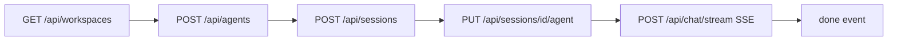

# 33 — Dış Ajan Otomasyonu (SwarmGo'yu Dışarıdan Sürmek)

> SwarmGo'yu **harici bir ajanın** (chrome-mcp, playwright-mcp veya düz HTTP istemcisi)
> baştan sona kontrol etmesi için referans. İki yol vardır; çoğu senaryoda **API yolu**
> tercih edilir, UI yolu yalnızca gerçek tarayıcı/oturum gerektiğinde kullanılır.

## TL;DR — Hangi Yol?

| Yol | Ne zaman | Sağlamlık |
|-----|----------|-----------|
| **HTTP API** (REST + SSE) | Varsayılan. Ajan workspace/agent/session yönetir, tur çalıştırır, akış tüketir. | Yüksek — kararlı sözleşme |
| **UI tıklama** (chrome-mcp / playwright) | Görsel doğrulama, gerçek kullanıcı oturumu, UI regresyon testi | Orta — `data-testid` ile sağlamlaştırıldı |

**Karar:** Bir işi API ile yapabiliyorsan API kullan. UI otomasyonu yalnızca "kullanıcı
gözünden" doğrulama veya tarayıcı-bağımlı senaryolar için.

---

## A. HTTP API Yolu

### A.1 Temel Bilgiler

- **Base URL (dev):** `http://127.0.0.1:8090` · **Varsayılan:** `http://127.0.0.1:8080` (`SWARMGO_ADDR`)
- **Kimlik doğrulama: YOK.** Hiçbir token/anahtar gerekmez (`server.go:withCORS`). Yerel,
  tek-kullanıcılı runtime için bilinçli. Ağa açarsan (`0.0.0.0`) önüne reverse-proxy auth koy.
- **CORS: wildcard açık** — `Access-Control-Allow-Origin: *`, izinli header'lar
  `Content-Type, Authorization, X-Workspace-Id` (`server.go:491`). Yani tarayıcı içinden
  (`fetch`) de, sunucudan da çağrılabilir.
- **Workspace seçimi:** İstek `X-Workspace-Id: <id>` header'ı ile kapsamlanır
  (alternatif `?ws=<id>` query — yalnız inline medya `` için). Header yoksa **default
  workspace**'e düşer. Hiçbir auth kapısı yok; workspace = veri görünürlük sınırı.
- **Format:** İstek/yanıt `application/json`; akışlar `text/event-stream`. Hata gövdesi
  `{ "error": "mesaj" }`.

### A.2 Uçtan Uca Akış (sıfırdan sohbete)



1. **Workspace bul/oluştur:** `GET /api/workspaces` → bir `id` seç (veya `POST /api/workspaces`).
   Sonraki tüm çağrılarda `X-Workspace-Id` olarak gönder.
2. **Ajan oluştur:** `POST /api/agents` (gövde: `name`, `provider`, `model`, …). Dönen `id`.
3. **Oturum aç:** `POST /api/sessions` → `id`. Ardından `PUT /api/sessions/{id}/agent`
   `{ "agentId": "AGT.." }` ile oturumun ajanını sabitle.
4. **Tur çalıştır:** `POST /api/chat/stream` (aşağıda) veya bloklamalı `POST /api/chat`.

### A.3 SSE ile Tur Çalıştırma (`POST /api/chat/stream`)

**İstek gövdesi** (`chat.go:chatReq`):
```json
{
  "sessionId": "SES42",
  "message": "Merhaba, repo'yu özetle",
  "agentIds": ["AGT3"],
  "thinkingLevel": "",
  "permissionMode": ""
}
```
- `sessionId` + (`message` veya `attachments`) zorunlu.
- `agentIds` boş → oturumun varsayılan ajanı yanıtlar.
- `thinkingLevel`: `low|medium|high|off` (yalnız uzun-düşünme destekli sağlayıcılar).
- `permissionMode`: `read-only|ask|auto` (tek tur için kapı override'ı).

**Event akışı** (her satır `event: <ad>\ndata: <json>\n\n`):

| Event | Veri | Anlamı |
|-------|------|--------|
| `meta` | `{ userMessage, runId }` | Tur başladı; `runId` durdurma/yönlendirme için |
| `agent` | `{ agentId, index }` | Sıradaki ajan yanıtlamaya başlıyor |
| `step` | tek `TurnStep` | Anlık aktivite (text/thinking/tool/ask/permission/…) |
| `reply` | `{ replyMessage }` | Ajan yanıtını bitirdi |
| `done` | `{ sessionTitle }` | **Terminal — başarı.** Tur bitti |
| `error` | `{ error, reason }` | **Terminal — hata.** |

> **Tamamlanma sinyali = `done` (veya `error`) event'i.** Polling gerekmez.

**Örnek tüketim (curl):**
```bash
curl -N -X POST http://127.0.0.1:8090/api/chat/stream \
  -H "Content-Type: application/json" \
  -H "X-Workspace-Id: WS1" \
  -d '{"sessionId":"SES42","message":"selam","agentIds":["AGT3"]}'
```

**Tur kontrolü** (akış sürerken, `runId`/`sessionId` ile):
- `POST /api/chat/control` `{ action: "stop"|"steer"|"answer", ... }`
  - `stop`: turu iptal et · `steer`: çalışan tura canlı yönlendirme enjekte et ·
    `answer`: `ask_user` sorusunu yanıtla.

**Dayanıklılık:** Üretim, istemci bağlantısından ayrıktır (`context.WithoutCancel`) —
SSE fetch'i kapansa bile tur tamamlanıp kalıcılaşır; yalnız açık `stop` iptal eder.

### A.4 Otonom Olay Akışı (`GET /api/events`)

Global, uzun-ömürlü SSE. Zamanlama/görev/spawn sonuçları `notify` event'i olarak yayılır.
25 sn keepalive ping. Bir ajanın "arka planda biten işleri" dinlemesi için.

### A.5 Önemli Endpoint Kümeleri (138+ toplam)

Tam liste handler dosyalarında (`internal/api/server.go` route kayıtları). Özet:

| Alan | Örnek endpoint'ler |
|------|--------------------|
| Workspaces | `GET/POST /api/workspaces`, `DELETE /api/workspaces/{id}` |
| Agents | `GET/POST /api/agents`, `PUT/DELETE /api/agents/{id}`, `GET /api/agents/{id}/context` |
| Sessions | `GET/POST /api/sessions`, `POST /api/sessions/spawn`, `PUT /api/sessions/{id}/agent`, `GET/PUT /api/sessions/{id}/workdir` |
| Chat | `POST /api/chat`, `POST /api/chat/stream`, `POST /api/chat/control` |
| Flows | `GET/POST /api/flows`, `POST /api/flows/{id}/run-stream`, `GET /api/flow-runs` |
| Tasks | `GET/POST /api/tasks`, `PUT/DELETE /api/tasks/{id}` |
| Schedules | `GET/POST /api/schedules`, `POST /api/schedules/{id}/run`, `…/toggle` |
| MCP | `GET/POST /api/mcp-servers`, `…/toggle`, `…/test`, `GET/POST /api/agents/{id}/tools` |
| Memory | `GET/POST /api/agents/{id}/memories`, `GET/PUT /api/agents/{id}/core`, `…/reflect`, `…/recall` |
| Skills | `GET/POST /api/skills`, `PUT/DELETE /api/skills/{slug}` |
| Artifacts | `GET/POST /api/artifacts`, `PUT/DELETE /api/artifacts/{id}` |
| Settings | `GET/PUT /api/settings`, `GET /api/catalog`, `GET/PUT /api/providers` |
| Secrets | `GET/POST /api/secrets`, `GET /api/secrets/{name}/reveal`, `DELETE …` |
| Market | `GET /api/market`, `POST /api/market/{id}/install` |
| Logs/Events | `GET /api/logs`, `GET /api/events` (SSE) |

### A.6 API Tarafı Bilinen Boşluklar

- Workspace `icon`/`color` yalnız oluşturmada set edilebilir (PATCH yok).
- Gönderilmiş mesaj **düzenleme** yok (sil + yeniden gönder var).
- Tema/yerleşim tercihleri yalnız `localStorage` (backend'e senkron değil) — masaüstü
  uygulaması için makul, API kapsamı dışında.

---

## B. UI Tıklama Yolu (chrome-mcp / playwright-mcp)

### B.1 URL Deep-Link (en güçlü giriş noktası)

Hash-tabanlı routing (`lib/url.ts`): `#/w/{workspaceId}/{view}[/{entityId}]`

```
#/w/WS1/chat/SES42        → belirli oturum
#/w/WS1/agents/AGT3       → ajan detayı
#/w/WS1/settings/providers→ ayarlar kategorisi
#/w/WS1/flows/FLW1        → flow editörü
```
View'lar: `chat · executions · agents · network · board · schedules · memory · flows ·
artifacts · skills · market · budget · logs · workspace · settings`.

Ajan herhangi bir ekrana doğrudan `browser_navigate` ile zıplayabilir — menü gezmeye gerek yok.

### B.2 Stabil Seçici Haritası (`data-testid`, 2026-06-23 eklendi)

| testid | Öğe | Nerede |
|--------|-----|--------|
| `nav-{view}` | Sol menü view butonu (ör. `nav-chat`, `nav-agents`) | NavRail |
| `nav-workspace`, `nav-settings` | Alt sabit butonlar | NavRail |
| `workspace-switcher` | Workspace açılır tetiği | WorkspaceSwitcher |
| `workspace-menu` / `workspace-row` / `workspace-switch` | Liste + satır (`data-workspace-id`) + geç butonu | WorkspaceSwitcher |
| `workspace-create` / `workspace-create-modal` | Yeni workspace butonu + modal | WorkspaceSwitcher/Modal |
| `composer-input` | Mesaj textarea'sı | Composer |
| `composer-send` | Gönder | SendActions |
| `composer-stop` | Durdur (streaming/waiting) | SendActions |
| `composer-queue` / `composer-interrupt` / `composer-steer` | Streaming-içi aksiyonlar | SendActions |
| `composer-attach` | Dosya ekle | Composer |
| `agent-select` / `agent-select-menu` / `agent-option` | Hedef ajan seçici (`data-agent-id`) | AgentSelect |
| `chat-transcript` | Sohbet kaydırma kapsayıcısı (`role=log`, `aria-live`) | MessageList |
| `chat-message` | Tek mesaj satırı (`data-role`, **`data-streaming`**, `data-msg-id`) | MessageList |
| `spawn-session-modal`, `agent-settings-modal`, `agent-context-modal`, `session-context-modal`, `skill-editor-modal` | Modaller (hepsi `role=dialog` `aria-modal`) | İlgili modal |

#### Panel-içi form seçicileri (Faz 1+2+3, 2026-06-23)

Dinamik liste öğeleri **sabit `data-testid` + ayrı `data-*-id`** taşır → `nth` yerine id ile
hedefle (ör. `[data-testid="schedule-row"][data-schedule-id="SCH1"]`).

| Panel | Statik testid'ler | Liste öğesi (+ id attribute) |
|-------|-------------------|------------------------------|
| **Agents — roster** | `agent-create-toggle`, `agent-create-name-input`, `agent-create-soul-textarea`, `agent-create-provider-wrap`, `agent-create-submit` | `agent-roster-item`, `agent-settings-open` (`data-agent-id`) |
| **Agents — form** | `agent-name-input`, `agent-soul-textarea`, `agent-identity-textarea`, `agent-save`, `agent-cancel`, `agent-delete`, `agent-{planning-mode,thinking-level,permission-mode}-select`, `agent-preview-context`, `agent-copy-path`, `agent-reveal-folder` | `agent-color` (`data-color`) |
| **Agents — provider/tools/skills** | `provider-select`, `model-select`/`model-custom-input`, `model-reset-to-list`, `agent-tools-enable-checkbox`, `agent-tools-select-all/none` | `agent-tool-checkbox` (`data-tool-name`), `skill-move-up/down`, `skill-remove`, `skill-add-restricted/shared` (`data-skill-slug`) |
| **Agents — picker/emoji** | `agent-picker-trigger`, `emoji-search-input`, `emoji-clear` | `agent-picker-option` (`data-agent-id`), `emoji-category` (`data-category`), `emoji-pick` (`data-emoji`) |
| **Tasks** | `task-board-columns-editor`, `task-create-description-input`, `task-create-owner-wrap`, `task-create-flow-select`, `task-create-submit`, `task-sort-by-deps`, `task-detail-{close,save,delete,owner-wrap,deps-dropzone}`, `task-title-input`, `task-retitle-ai`, `task-description-textarea`, `task-boardstate-select` | `task-card` (`data-task-id`) |
| **Tasks — sütun editörü** | `board-column-add`, `board-column-save` | `column-{label-input,color-toggle,color-preset,custom-color-input,hex-color-input,delete,move-up,move-down}` (`data-col-index`) |
| **Schedules** | `schedule-create-{agent-wrap,cron-preset-select,cron-input,expires-input,prompt-input,submit}` | `schedule-row`, `schedule-{enable-toggle,run-now,edit,delete}`, `schedule-edit-{cron-input,prompt-input,save,cancel}` (`data-schedule-id`) |
| **Settings — providers** | `custom-provider-{id-input,label-input,kind-select,default-model-input,base-url-input,models-input,save,cancel}` | `provider-{key-picker,clear-key,endpoint-input,test}` (`data-provider`), `custom-provider-{edit,delete}` (`data-provider-id`) |
| **Settings — tools/MCP** | `tools-mcp-servers`, `tools-search-input`, `tool-detail-toggle`, `mcp-server-{name,command,args,url}-input`, `mcp-server-transport-select`, `mcp-server-add` | `tools-group-toggle` (`data-group`), `tools-list-item` (`data-tool-name`), `mcp-server-{test,toggle,delete}` (`data-server-id`) |
| **Settings — hooks** | `hook-create`, `hook-{event-select,matcher-input,command-input,timeout-input,save}` (`data-hook-id`=düzenlenen) | `hook-toggle`, `hook-delete` (`data-hook-id`) |
| **Skills** | `skills-create`, `skills-rescan`, `skill-detail-{edit,toggle-access,toggle-summary,reveal,delete}` | `skills-list-item` (`data-skill-slug`) |
| **Market** | — | `market-kind-tab` (`data-kind`), `market-pack`, `market-pack-install` (`data-pack-id`) |
| **Secrets** | `secret-{name-input,description-input,value-input,save}` | `secret-{reveal,copy,delete}` (`data-secret-name`) |
| **Memory** | `memory-content-input`, `memory-add-document`, `memory-reflect` | `memory-filter` (`data-filter`), `memory-card-expand`, `memory-delete` (`data-memory-id`) |
| **Artifacts** | `artifacts-{search-input,create-new}`, `artifact-detail-{edit,copy,reveal,delete}`, `artifact-edit-{title-input,kind-select,content-textarea,save}` | `artifacts-filter` (`data-origin`), `artifacts-list-item` (`data-artifact-id`) |
| **Flows** | `flow-canvas-auto-layout`, `flow-canvas-root` | — |

> Not: Özel bileşenlere (`<Button>`, `<AgentPicker>`, `<ProviderModelSelect>`) testid bazen
> saran `<div data-testid=...>` ile verildi (ör. `*-wrap`, `*-submit`) — bunlar layout-nötr
> (`contents`/inline) tutuldu. Toplam ~183 testid, 32 dosya.

### B.3 Tur Tamamlanma Sinyali (UI'dan)

Streaming biten son asistan balonu DOM'dan okunabilir:
```
[data-testid="chat-message"][data-role="assistant"][data-streaming="true"]  → hâlâ üretiyor
                                                   [data-streaming="false"] → tamamlandı
```
**Playwright bekleme:** son mesajda `data-streaming="false"` olana kadar bekle.

### B.4 Playwright/chrome-mcp Reçeteleri

**Sohbet turu (saf UI):**
```js
await page.goto('http://127.0.0.1:8090/#/w/WS1/chat/SES42')
await page.click('[data-testid="agent-select"]')
await page.click('[data-testid="agent-option"][data-agent-id="AGT3"]')
await page.fill('[data-testid="composer-input"]', 'Repo özetini çıkar')
await page.click('[data-testid="composer-send"]')
// tamamlanmayı bekle:
await page.waitForSelector(
  '[data-testid="chat-message"][data-role="assistant"][data-streaming="false"]:last-of-type'
)
```

**Hibrit (önerilen): UI'da gez, turu API ile çalıştır + akışı dinle.**
playwright-mcp `browser_network_request` veya sayfa içi `fetch` ile `/api/chat/stream`'i
çağır; `done` event'ini bekle. Hem hızlı hem kırılgan-seçiciye bağımsız.

### B.5 UI Otomasyon Notları (mcp-gateway guide'dan)

- `chrome_javascript` dönüş değeri bazı oturumlarda güvenilmez — değeri DOM'a yazıp
  `chrome_get_web_content`/`chrome_read_page` ile oku.
- Çok sekme açıkken `chrome_screenshot` kırılgan — gerekiyorsa `playwright` (temiz instance)
  veya `vps-playwright` kullan.
- `mcp-chrome` gerçek kullanıcı oturumudur (cookie/login); `playwright` temiz profildir.

---

## Sınırlar & Sıradaki İyileştirmeler

- **API auth yok:** Ağa açılırsa (`SWARMGO_ADDR=0.0.0.0`) öncesinde token/proxy katmanı şart.
- **UI seçici kapsamı:** Çekirdek akışlar + tüm panel formları (Agents/Tasks/Schedules/Settings/
  Skills/Market/Secrets/Memory/Artifacts/Flows) testid taşır (Faz 1+2+3, ~183 testid). Yeni panel/
  form eklenince aynı konvansiyonu uygula (statik=`{panel}-{eylem}`, liste=sabit testid+`data-*-id`).
- **Tercih:** Yeni ajan-erişimli akış eklerken önce API endpoint'i sağla; UI'a testid eklemeyi
  ikincil tut.

İlgili: `_Docs\07-CHAT-UX.md` (chat akışı), `_Docs\24-SELF-MANAGEMENT.md` (ajanın iç araçları),
mcp-gateway kaynak rehberi (chrome/playwright araç disiplini).
