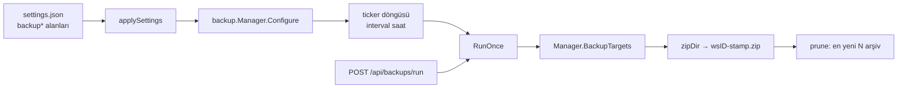

# SwarmGo — Workspace Yedekleme

> Her workspace'in tüm verisini belirli aralıklarla **zip arşivine** alan, saklama
> sınırı uygulayan ve elle tetiklenebilen periyodik yedekleme alt sistemi.
> Kod: `internal/backup/` · Ayarlar: `internal/settings` · Wiring: `internal/app/app.go`.

## Amaç

Dosya-tabanlı depolama (DB yok) sayesinde bir workspace'in tüm durumu tek bir
dizindedir (`store/`, `config/`, `workspace/`, `ws-settings.json`). Bu dizinin
periyodik bir kopyası alınırsa, kazara silme / bozulma / hatalı otonom düzenleme
sonrası geri dönüş mümkün olur. Yedekleme **ana akışı asla bloklamaz**: bir koşu
hatası loglanır, ölümcül değildir.

## Mimari



- **Tek süreç-geneli manager** (`backup.New`), `app.Bootstrap`'ta kurulur ve
  `server.SetBackupManager` ile API sunucusuna bağlanır. Sunucu `applySettings`
  her ayar değişiminde `Configure` çağırarak döngüyü canlı başlatır/durdurur/
  yeniden yapılandırır.
- **Workspace listesi her koşuda taze alınır** (`Lister` closure → `Manager.BackupTargets`),
  böylece start sonrası oluşturulan/silinen workspace'ler de kapsanır.
- **İlk otomatik yedek bir aralık SONRA** alınır (ticker), restart başına yedek
  patlaması olmaz. Anında yedek için `POST /api/backups/run` ya da UI butonu.

## Disk yapısı

```
<backupDir>/                     # vars. <dataDir>/backups
├── WS1/
│   ├── WS1-20260625-031500.zip  # <id>-YYYYMMDD-HHMMSS.zip
│   └── WS1-20260626-031500.zip
└── WS2/
    └── WS2-20260625-031500.zip
```

- Arşiv içinde yollar **göreli** tutulur (`store/a.json`, `config/instructions.md`…).
- `zipDir` yalnız **düzenli dosyaları** alır; backups kökü (ve altı) özyinelemeyi
  önlemek için **dışlanır** (bir workspace verisi backups klasörünün üstündeyse bile).
- İsim string olarak kronolojik sıralanır → budama (`prune`) en eski arşivleri siler,
  workspace başına en yeni `backupRetain` adedi kalır. Yalnız `<id>-*.zip` deseni
  budanır; klasördeki alakasız dosyalara dokunulmaz.

## Ayarlar (`settings.json`)

| Alan | Varsayılan | Açıklama |
|------|-----------|----------|
| `backupEnabled` | `false` | Otomatik zamanlama ana anahtarı |
| `backupIntervalHours` | `24` | İki otomatik yedek arası saat (≥1, ≤8760) |
| `backupRetain` | `7` | Workspace başına saklanan en yeni arşiv (≥1, ≤1000) |
| `backupDir` | `""` | Yedek kökü; boş → `<dataDir>/backups` |

Sayısal alanlar `normalize` ile clamp'lenir (reddedilmez). Değişiklikler **Kaydet**
sonrası canlı uygulanır.

## API

| Metod | Yol | Açıklama |
|-------|-----|----------|
| GET | `/api/backups` | Durum: config + son koşu (`enabled`/`intervalHours`/`retain`/`dir`/`running`/`lastRun`/`lastError`) |
| POST | `/api/backups/run` | Anında yedek koşusu; sonuç (`archives[]` + `failures{}`) döner. Zamanlama kapalı olsa da çalışır |
| GET | `/api/backups/archives` | Workspace başına arşiv listesi (en yeni önce): `[{workspaceId, workspaceName, archives:[{name, bytes, modified}]}]` |
| POST | `/api/backups/restore` | `{workspaceId, archive}` → workspace'i o arşivden geri yükler (yıkıcı: mevcut veriyi ezer, workspace canlı yeniden açılır) |
| DELETE | `/api/backups/archives` | `{workspaceId, archive}` → tek bir arşiv dosyasını siler (`ResolveArchive` ile ad doğrulanır) |

> Yedekleme bir **ajan aracı değildir** — yalnız kullanıcı/UI tetikler. (Otonom
> ajanların kendi yedeklerini fırlatması bilinçle kapsam dışı.)

## UI

**Ayarlar ▸ Yedekleme** — kendi **ayrı kategori sayfası** (sol menüde "Gelişmiş" ile
"Komutlar" arasında, `Archive` ikonu; `primitives.tsx` `APP_CATS`'e `backup` katı,
`SettingsPanel.tsx` `cat === 'backup' && <BackupPanel/>`). Tek bir sayfada **hem ayarlar
hem arşivler** toplu: otomatik yedekleme toggle'ı, aralık/saklama/klasör alanları, canlı
durum kartı (açık/kapalı + son yedek zamanı + klasör + son hata), **"Şimdi yedekle"** butonu
ve altında **"Mevcut yedekler"** bölümü — workspace başına gruplanmış arşiv listesi
(ad + tarih + boyut, en yeni önce) + her arşiv için **iki-adımlı onaylı "Geri yükle"**
(tıkla → "Eminim, geri yükle"/"İptal") ve **iki-adımlı onaylı "Sil"** (🗑 → "Eminim,
sil"/"İptal", `deleteBackupArchive`). Üstteki **Kaydet** butonu config alanlarını yazar.
Tipler `types/settings.ts`
(`BackupStatus`/`BackupResult`/`BackupArchive`/`BackupArchiveFile`/`WorkspaceArchives`),
api `api/system.ts` (`getBackupStatus`/`runBackup`/`listBackupArchives`/`restoreBackup`).
Bileşen `appPanels.tsx` → `BackupPanel`.

> **Neden app-geneli (workspace ekranında değil)?** Tek `backup.Manager` **tüm**
> workspace'leri birden yedekler — bu bir workspace'e özel ayar değildir. Bu yüzden
> kontroller per-workspace ekranında değil, uygulama-geneli ayarlarda kendi **Yedekleme**
> sayfasında durur. (Önce Gelişmiş altında bir alt-bölümdü; 2026-06-25 kendi sayfasına alındı.)

## Çakışma & dayanıklılık

- `RunOnce` baştan sona `runMu` ile serileştirilir → zamanlı koşu ile elle koşu
  aynı arşiv yoluna iki kez yazamaz.
- Yarım yazılan arşiv hata durumunda silinir; tek workspace hatası diğerlerini
  durdurmaz (`Result.Failures` ile raporlanır).
- `App.Shutdown` döngüyü `Stop` ile durdurur; uçuştaki koşu tamamlanır.

## Geri yükleme (UI'dan tek-tık)

`POST /api/backups/restore` → `workspace.Manager.RestoreFromArchive(id, archivePath, extract)`
lifecycle dansını yürütür:

1. Workspace'i registry'den **ayır** (scheduler `Stop`, runtime `CloseMCP`, DB `Close`)
   → açık dosya kilitleri serbest kalır (Windows).
2. Arşivi sibling bir **staging** dizinine aç (`backup.Unzip`, zip-slip korumalı). Açma
   hatasında staging silinir ve workspace **dokunulmadan** yeniden açılır (rollback).
3. Restore edilen üst-düzey girdileri (store/config/workspace + ws-settings.json) yerine
   **swap**'le (canlı kopyayı sil, staged kopyayı `rename` ile taşı — aynı volüm, hızlı).
4. Workspace'i diskten **yeniden aç** (`open(meta)`) → DB/runtime/scheduler taze kurulur,
   id/kimlik korunur.

`extract` fonksiyonu enjekte edilir (`backup.Unzip`) → `workspace` paketi backup formatına
bağımlı kalmaz. Restore sonrası `publishWorkspacesChanged` ile açık UI'lar listelerini
tazeler.

**Otomatik yenileme (koşullu, 2026-06-25):** Geri yükleme sonrası UI, geri yüklenen
workspace **o pencerede aktifse** sayfayı otomatik yeniler (`getActiveWorkspace() === id` →
`window.location.reload()`, ~1.2s mesaj sonrası). Yalnız aktif workspace'in bellek-içi
durumu (listeler, açık sohbet) bayatladığı için koşulludur; **başka** bir workspace'i geri
yüklerken yenileme yapılmaz — kullanıcı o workspace'e geçtiğinde zaten taze yüklenir, bu
yüzden alakasız bir reload ile rahatsız edilmez.

> Güvenlik: `ResolveArchive` arşiv adını doğrular (yol ayıracı/`..` reddi) → API'den
> path-traversal engellenir; `Unzip` ayrıca zip-slip'e karşı her girdiyi `destDir` altında
> tutar.

## Test

`internal/backup/backup_test.go`:
- `TestRunOnceArchivesAndPrunes` — bir geçiş bir arşiv yazar, zip göreli yolları
  doğru içerir, `prune` saklama sınırını uygular.
- `TestZipUnzipRoundTrip` — `zipDir`→`Unzip` round-trip dosyaları birebir korur.
- `TestResolveArchiveRejectsTraversal` — geçerli arşiv çözülür; `..`/alt-yol/yanlış
  uzantı reddedilir.
- `TestZipDirSkipsBackupsRoot` — kaynak içine yuvalanmış backups kökü dışlanır.

Canlı doğrulama (2026-06-25): WS1 (5 ajan/26 oturum) ve WS2 (9 ajan/11 oturum) en yeni
arşivleriyle hem API hem UI'dan geri yüklendi → veri round-trip'te korundu, server sağlıklı.

## Sırada (gelecek)

- Workspace dışa/içe aktarma (export/import) ile ortak arşiv formatı (`06-WORKSPACES.md`
  "Gelecek" maddesiyle örtüşür) — restore altyapısı temel oluşturur.
- Opsiyonel sıkıştırma seviyesi / arşivleme dışı tutma desenleri (ör. büyük geçici dosyalar).
- Arşivi **yeni** bir workspace olarak içe aktarma (mevcut id'yi ezmeden).
