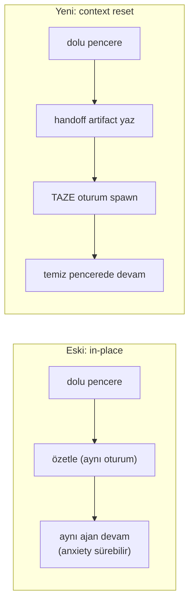

# 35 — Context Reset + Handoff Artifact

> Uzun otonom görevlerde, bağlam sınırına yaklaşan bir oturumu **yerinde
> özetlemek yerine** tamamen temiz bir pencerede sürdürmek: bir **handoff
> artifact** yaz, **taze bir oturum** başlat, işi oradan devral.

## Neden? (Anthropic "harness design" bulgusu)

Anthropic'in _"Harness design for long-running application development"_ makalesi:
in-place compaction (rolling-summary) tek başına **"context anxiety"**yi çözmez —
model bağlam limitine yaklaştığını sezince işi **erken toparlar** (premature
wrap-up). Çözüm = **context reset**: pencereyi tamamen temizle + bir sonraki
ajanın temiz pencerede devralabileceği yeterli state taşıyan bir **handoff
artifact** bırak. Compaction "süreklilik" verir ama "temiz sayfa" vermez; reset
ikisini ayırır.

SwarmGo'da önceden **yalnız** in-place rolling-summary vardı
(`internal/conversation/manager.go`). Bu özellik, onun **tamamlayıcısı** olarak
reset modunu ekler — mevcut compaction'ı değiştirmeden.

## Üç tetik, tek çekirdek

| Tetik | Kim | Varsayılan | Nerede |
|-------|-----|-----------|--------|
| **Manuel** `/handoff` | Kullanıcı (chat) | her zaman açık | `POST /api/sessions/{id}/handoff` → `handleSessionHandoff` |
| **Ajan aracı** `handoff_session` | Ajan kendisi | self-manage gated | `tools/builtin_handoff.go` + `toolsetup.go` kapanışı |
| **Otomatik** | Runtime, **yalnız otonom** tur | **KAPALI** (`HandoffAuto`) | `runSpawn` / `scheduler.deliverPrompt` tur-sonu |

Üçü de aynı çekirdeği çağırır: **`Runtime.HandoffSession`** (`internal/agent/handoff.go`).

### Çekirdek akış — `Runtime.HandoffSession`

1. Oturum geçmişini (`ListMessages`) render et (`conversation.RenderTranscript`).
2. **Handoff üret:** `conversation.BuildHandoff(...)` — compaction çekirdeğiyle aynı
   provider çağrısı (usage `KindCompact`), ama **devam-odaklı** `handoffPrompt` ile
   (9 bölüm, aşağıda). Env snapshot enjekte edilir.
3. **Artifact yaz:** eski oturuma first-class markdown artifact (`Handoff — <başlık>`).
   `db.SetSessionHandoffArtifact` ile eski oturuma id'si işlenir.
4. **(Ops.) Dosya yaz:** `HandoffWriteFile` açıksa `<workdir>/.swarmgo/handoff.md`
   (Anthropic'in "disk üstü progress dosyası" deseni; best-effort).
5. **Spawn:** `SpawnSession(agent, continuationPrompt, {ParentSessionID: eski})` —
   **taze** bağımsız oturum. `continuationPrompt` handoff'u **inline** gömer + eski
   SID + artifact id + recovery yönergesi taşır (tek-tur araç gezintisi gerekmez).
6. **Zincir + kapanış:** yeni oturum `ParentSessionID = eski`; eski oturuma
   **tombstone** asistan mesajı ("↪ Context reset — devam: SES…").

### Handoff artifact formatı (`handoffPrompt`, 9 bölüm)

Rolling-summary'nin 8 bölümünü **reset-kritik** parçalarla genişletir:

1. Objective / Primary Intent
2. Key Technical Concepts
3. Files and Code (path + neden + son durum)
4. Errors and Fixes
5. Decisions and User Feedback (kritik olanlar verbatim)
6. **Progress — DONE** (`- [x]` checklist)
7. **Pending — TODO** (sıralı `- [ ]` checklist)
8. Environment State (workdir, git branch/status, todos, artifacts — env snapshot'tan)
9. **Next Concrete Step** (tek, hemen yapılacak iş)

6/7/9 reset'in özüdür: taze ajan **net bir devam noktası** görür → "erken bitirme"
eğilimi kırılır. `HandoffEnv` (Goal/WorkingDir/GitBranch/GitStatus/Todos/Artifacts)
8. bölümü gerçek değerlerle besler.

## Otomatik tetik mekaniği

SwarmGo'da otonom turlar (scheduler/spawn) **tek-prompt + tool-loop**'tur; turlar
arası geçmiş modele gönderilmez. Bu yüzden basınç **tur içinde** birikir ve
reactive compaction (`toolloop.go` → `CompactInFlightMessages`) ile karşılanır.
"Limite yaklaşma" sinyali = **bu turun reactive compaction tetiklemesi**.

- `withOverflowFlag(ctx)` otonom tur başında bir `*atomic.Bool` kurar
  (`callkind.go`).
- Tool loop reactive compaction yapınca `markContextOverflow(ctx)` ile işaretler.
- Tur bitince `runSpawn` / `deliverPrompt` → `r.maybeAutoHandoff(ctx, sid, agent, overflowed)`.

`maybeAutoHandoff` no-op olur tüm şu koşullar sağlanmadıkça: `HandoffAuto` açık **ve**
turda overflow oldu **ve** `Pressure ≥ HandoffPressure` bandı **ve** reset zinciri
(`handoffChainDepth` = `ParentSessionID` lineage) `HandoffMaxChain` altında.

## Ayarlar

`settings.Settings` / DTO / Patch (clamp'ler `store.go::validate`):

| Alan | Anlam | Vars. | Clamp |
|------|-------|-------|-------|
| `handoffAuto` | otomatik reset aç/kapa | `false` | — |
| `handoffPressure` | otomatik reset basınç eşiği | `0.90` | 0=default; aksi 0.5–0.99 |
| `handoffMaxChain` | maks. ardışık reset | `20` | 0=default; aksi 1–100 |
| `handoffWriteFile` | handoff'u dosyaya da yaz | `false` | — |

Canlı push: `api/server.go::applySettings` → `Tunables.SetHandoff(...)`. UI:
**Ayarlar → Bağlam → "Context reset (handoff)"** bölümü. Knob'lar `0` iken
`agent.DefaultHandoff*` devreye girer.

## Oturum modeli + soyağacı

`db.Session`'a iki alan eklendi (her ikisi `omitempty`):

- `ParentSessionID` — bu oturumun devraldığı (handoff kaynağı) oturum.
- `HandoffArtifactID` — bu oturumdan reset anında **dışarı** yazılan handoff'un id'si.

`GET /api/sessions/{id}/info` ikisini de döner. UI: `SessionDetailPanel` başlığında
"↩ Devraldığı oturum: SES…" tıklanır link; chat'te eski oturumun tombstone'u ileri
yönlü link.

## claude-cli `--resume` ile etkileşim

Warm `--resume` modunda bağlam yönetimi CLI'a geçer (SwarmGo compaction'ı baypas).
Reset zaten **yeni oturum** açtığı için warm CLI session doğal olarak düşer; yeni
oturum cold başlar. Uyumlu — özel bir iş gerektirmez.

## Dosyalar

- `internal/conversation/handoff.go` — `handoffPrompt`, `HandoffEnv`, `BuildHandoff`, `RenderTranscript`.
- `internal/agent/handoff.go` — `HandoffSession`, `maybeAutoHandoff`, `handoffChainDepth`, `handoffEnv`, `buildContinuationPrompt`, git snapshot.
- `internal/agent/callkind.go` — `withOverflowFlag`/`markContextOverflow` overflow sinyali.
- `internal/agent/toolloop.go` — reactive compaction'da `markContextOverflow`.
- `internal/agent/spawn.go` — `SpawnOptions.ParentSessionID` + `runSpawn` tur-sonu kancası.
- `internal/agent/scheduler.go` — `deliverPrompt` tur-sonu kancası.
- `internal/agent/tunables.go` — `SetHandoff` + getter'lar + `DefaultHandoff*`.
- `internal/tools/builtin_handoff.go` — `handoff_session` aracı + `HandoffFunc`.
- `internal/db/models.go` + `store.go` — `Session.ParentSessionID`/`HandoffArtifactID` + `SetSessionHandoffArtifact`.
- `internal/settings/{settings,store}.go` — `Handoff*` alanları + clamp'ler.
- `internal/api/summary.go` — `handleSessionHandoff` (`POST /api/sessions/{id}/handoff`).
- `internal/api/session_info.go` — soyağacı alanları.
- Frontend: `hooks/useChatStream.ts` (`/handoff` komutu + `handoff()`), `api/sessions.ts`
  (`handoffSession`), `types/session.ts`, `types/settings.ts`,
  `components/settings/appPanels.tsx` (ContextPanel bölümü),
  `components/sessions/SessionDetailPanel.tsx` (soyağacı link).

## Testler

- `conversation/handoff_test.go` — `BuildHandoff` env+transcript enjeksiyonu, boş-transcript guard, env render.
- `agent/handoff_test.go` — chain-depth sayımı, `maybeAutoHandoff` no-op yolları (auto off / overflow yok / chain cap), continuation prompt içeriği, title temizleme.

## Ayrıca bakınız

- `_Docs/17-TOKEN-OPTIMIZASYON.md` — in-place compaction (rolling-summary) + tool-output sıkıştırma; reset onun tamamlayıcısıdır.
- `_Docs/22-SPAWN-SESSION.md` — reset'in motoru olan `SpawnSession`.
- `_Docs/31-MEMGPT-CORE-MEMORY.md` — bağlam-basıncı uyarısı (reset'ten önceki ilk savunma hattı).
