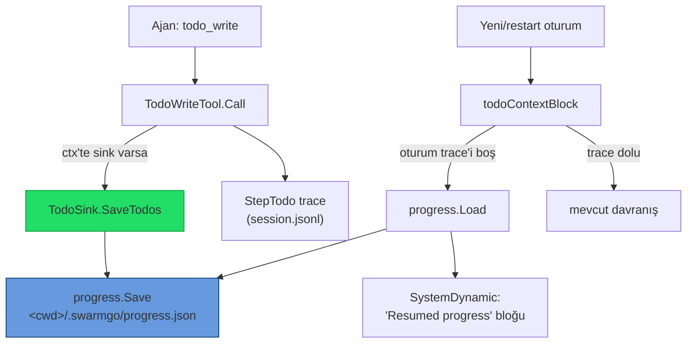

# 36 — Kalıcı Todo / PROGRESS Dosyası (Structured Note-Taking)

> **Durum (2026-06-25): UYGULANDI.** Anthropic'in *"Effective harnesses for
> long-running agents"* + *"Effective context engineering for AI agents"*
> makalelerindeki **kalıcı not dosyası** (`claude-progress.txt` + `feature_list.json`
> / `NOTES.md`) konvansiyonunun SwarmGo karşılığı.
>
> İlişkili: [`31-MEMGPT-CORE-MEMORY.md`](31-MEMGPT-CORE-MEMORY.md) (core memory),
> [`17-TOKEN-OPTIMIZASYON.md`](17-TOKEN-OPTIMIZASYON.md) (compaction),
> [`24-SELF-MANAGEMENT.md`](24-SELF-MANAGEMENT.md) (todo aracı).

## Sorun

`todo_write` aracı (`internal/tools/builtin_todo.go`) **stateless** idi: her çağrı
tüm listeyi taşır, sunucuda kalıcı durum tutmaz. Liste yalnızca dolaylı kalıcıydı —
çağrı bir `StepTodo` trace adımı olarak mesajın `Steps` alanına (`session.jsonl`)
yazılır, `todoContextBlock` (`internal/api/todos.go`) en son listeyi bu trace'ten
yeniden inşa edip her turda `SystemDynamic`'e enjekte eder (compaction'a dayanıklı).

**Boşluk:** Bu mekanizma **tek oturuma** bağlıydı. Oturum yeniden başlatıldığında /
yeni oturum açıldığında / ajan değiştiğinde liste görünmez olurdu. Anthropic modeli
ise tersi: ajan her oturum başında **diskteki** ilerleme dosyasını okuyup devralır
(*"read the progress files to get up to speed on what was recently worked on"*).

Core memory (MemGPT blokları) bu boşluğu doldurmaz: o serbest yapılı persona/human
belleğidir, yapılandırılmış görev durumu değil. Session `Goal` da oturum-başına tek
hedeftir, adım listesi değil.

## Tasarım

`todo_write` listesi **çalışma dizinine** (proje) bağlı bir progress dosyasına
yazılır ve fresh oturum açılışında geri yüklenir.

- **Konum:** `<cwd>/.swarmgo/progress.json` — session'ın working dir'i ayarlıysa
  (git-commit'lenebilir, proje'ye bağlı). cwd yoksa fallback: `<store>/progress/
  <agentID>/.swarmgo/progress.json` (ajan-başına devamlılık). Aynı `.swarmgo/`
  dizini handoff dosyasıyla (`handoff.md`) paylaşılır.
- **Format:** `internal/progress` paketi, `Record{Version, UpdatedAt, SessionID,
  AgentID, Todos[], Log[]}`. `Todos[].Status` = `pending|in_progress|completed`;
  `completed` ≡ Anthropic `feature_list` `passes:true`. `Log[]` = rolling ilerleme
  günlüğü (`claude-progress.txt` karşılığı), son 50 girdiye budanır. Atomik yazım
  (`*.tmp`→`rename`).



**Akış:** (1) Fresh oturum, ilk tur: oturumun todo trace'i yok → `progress.json`
diskten yüklenir → "## Resumed progress (from a previous session)" bloğu enjekte
edilir. (2) Ajan `todo_write` çağırır → adım oturuma yazılır **ve** sink dosyayı
günceller. (3) Sonraki turlar: oturum trace'i dolu → mevcut davranış, disk senkron
kalır. (4) Restart → (1)'e döner.

## Sink mekanizması (ArtifactSink ikizi)

Persist, context-tabanlı bir sink ile yapılır (artifact sink deseninin birebir
kopyası), böylece `todo_write` aracı bağımlılık-hafif kalır:

- `internal/tools/todosink.go` — `TodoSink` arayüzü + `WithTodoSink`/`HasTodoSink`
  (ctx). `builtin_todo.go::Call` ctx'te sink varsa `SaveTodos` çağırır (best-effort;
  hata todo dönüşünü bozmaz).
- `internal/agent/todosink.go` — `Runtime.NewTodoSink(sessionID, agentID, cwd)` →
  cwd çözer (boşsa store fallback), `progress.Load`+merge+`progress.Save`, `progress`
  event yayınlar.
- **Native yol:** `toolloop.go` artifact fallback'inin yanında todo sink fallback'i
  kurar (`SessionIDFrom(ctx)!="" && ProgressPersist && !HasTodoSink`); `workDir`
  zaten orada çözülü.
- **Chat (stream) yolu:** `chat_stream.go` her tur sink'i hem ctx'e hem run'a
  (`run.setTodoSink`) bağlar — native ctx üzerinden, CLI run üzerinden.
- **CLI yol:** `mcp_interaction.go::callTodo` run'ın todo sink'ini ctx'e takıp
  kanonik aracı çağırır; sink `chat_stream.go` (chat) + `autonomous_interaction.go`
  (scheduler/spawn/flow) tarafından run'a kurulur.

## Geri yükleme

`internal/api/todos.go::todoContextBlock(ctx, db, sessionID, cwd, agentID, resume)`:
oturumun kendi todo trace'i varsa onu render eder (mevcut davranış); yoksa ve
`resume` açıksa `progress.Load(progressDir(...))` ile diskten yükleyip
`renderResumedBlock` ile "Resumed progress" başlıklı bloğu döner (tamamlanmamış
liste; hepsi tamamsa boş). `chat_turn.go::composeTurnRequest` cwd + agentID +
`s.tun.ProgressResume()` geçirir. `progressDir` çözümü `NewTodoSink` ile **aynı**.

## Core Memory ile İlişki

| Katman | Ne tutar | Yapı | Kapsam | Kaynak |
|---|---|---|---|---|
| Core memory ([31](31-MEMGPT-CORE-MEMORY.md)) | Ajan kim / kullanıcı kim | Serbest metin | Ajan | `knowledge_sources` |
| Session Goal | Tek kuzey-yıldızı | Tek cümle | Oturum | `db.Session.Goal` |
| **Progress (bu doküman)** | Ne bitti / sırada ne var | Yapılı todo + log | **Proje (cwd)** | `<cwd>/.swarmgo/progress.json` |

Üçü tamamlayıcı, çakışmaz; üçü de `SystemDynamic`'e ayrı bloklar girer. Progress
recall'a girmez (disk dosyası, knowledge_source değil).

## Ayarlar

| Alan | Vars. | Açıklama |
|---|---|---|
| `progressPersist` | açık | `todo_write` listesini diske yaz (kapalı → eski efemeral davranış) |
| `progressResume` | açık | Fresh oturuma diskten "Resumed progress" bloğu enjekte et |

`settings.Settings`/`DTO`/`Patch` + `Tunables.SetProgress`/`ProgressPersist`/
`ProgressResume` + `applySettings` canlı push. UI: Ayarlar ▸ Bağlam ▸ "Kalıcı
ilerleme (progress)" (iki toggle). Migration yok; yeni dosya + yeni opsiyonel alanlar.

## `feature_list` zenginliği (opsiyonel alanlar)

`todo_write` öğeleri Anthropic `feature_list` paritesinde iki **opsiyonel** alan
taşır: `category` (gruplama etiketi, ör. `functional`/`tests`/`docs`) ve `steps`
(doğrulama alt-adımları, `[]string`). Boşken dosyadan tamamen düşer (`omitempty`).
Şema (`builtin_todo.go`), `tools.TodoSinkItem`, `progress.TodoItem` ve sink mapping
(`agent/todosink.go`) bu alanları uçtan uca taşır. `completed` statüsü `passes:true`.

## PROGRESS.md konvansiyon skill'i

Yeni default skill **`swarmgo-progress`** (`internal/skills/defaults/swarmgo-progress/
SKILL.md`, `access: shared`): ajana hem **otomatik** progress.json katmanını (her
`todo_write` diske yazılır, fresh oturum geri yükler) hem de **insan-okunur**
`PROGRESS.md` konvansiyonunu (mevcut kilitsiz `Read`/`Write`/`Edit` ile proje
kökünde tut: oturum başında oku → tek iş seç → bitince dated entry ekle) öğretir;
core memory/goal'dan ayrımı belirtir. `//go:embed` ile otomatik dahil; yeni
ajanların baseline skill setine girer.

## UI görüntüleyici (salt-okunur kart)

`GET /api/sessions/{id}/progress` (`api/progress.go::handleSessionProgress`) →
`{path, exists, record}` (sink ile **aynı** dizin çözümü). Frontend: `SessionDetailPanel`
"Kalıcı ilerleme · n/m" kartı (`ProgressCard`) — her madde statü işaretçisiyle
(✓/⟳/☐, tamamlanan üstü çizili) + opsiyonel `category` + son 3 log satırı. Yalnız
dosya varsa ve madde olduğunda gösterilir. `sessionProgress` API + `SessionProgress`
tipi (`types/session.ts`).

## Dosyalar

- **Yeni:** `internal/progress/progress.go` (+test), `internal/tools/todosink.go`,
  `internal/tools/builtin_todo_test.go`, `internal/agent/todosink.go` (+test),
  `internal/api/progress.go`, `internal/skills/defaults/swarmgo-progress/SKILL.md`.
- **Değişen:** `internal/tools/builtin_todo.go` (sink kancası + category/steps),
  `internal/agent/toolloop.go` (native fallback), `internal/agent/tunables.go` (knob),
  `internal/agent/workdir_ctx.go` (`SessionWorkdir`), `internal/db/db.go` (`Root()`),
  `internal/api/{todos.go,chat_turn.go,chat_stream.go,chat_control.go,mcp_interaction.go,autonomous_interaction.go,server.go}`,
  `internal/settings/{settings.go,store.go}`, `frontend/src/types/{settings.ts,session.ts}`,
  `frontend/src/api/sessions.ts`, `frontend/src/components/settings/appPanels.tsx`,
  `frontend/src/components/sessions/SessionDetailPanel.tsx`.

## Geri-Uyumluluk & Felsefe

- Migration yok; tek binary korunur (sıfır yeni runtime bağımlılığı); offline (saf
  dosya I/O); C1 cache güvenli (tüm enjeksiyon `SystemDynamic`'e); opt-in
  (`progressPersist=false` → bugünkü davranış birebir).

## Doğrulama

```powershell
cd C:\Users\user\Desktop\Projects\SwarmGo
go build ./...
go test ./internal/progress/... ./internal/agent/... ./internal/tools/... ./internal/api/... ./internal/settings/...
cd frontend; npm run build
```

## Sırada (olası devamlar)

İlk üç devam maddesi (feature_list zenginliği, PROGRESS.md skill'i, UI
görüntüleyici) **uygulandı** (yukarıdaki bölümlere bakın). Kalan fikirler:

- **Düzenlenebilir kart:** salt-okunur viewer'ı düzenlenebilir yap (madde durumu
  değiştir / sil) — şu an yalnız görüntüleme.
- **Log telemetrisi:** progress log girdilerinden "oturum başına tamamlanan madde"
  metriği (token-optimizasyon tasarruf kartı deseni).
- **Çoklu-ajan eşzamanlılık:** aynı cwd'de paralel ajanlar tek dosyayı paylaşır
  (Anthropic'in sıralı-oturum modeli); gerekirse ajan-başına dosya veya kilit.
