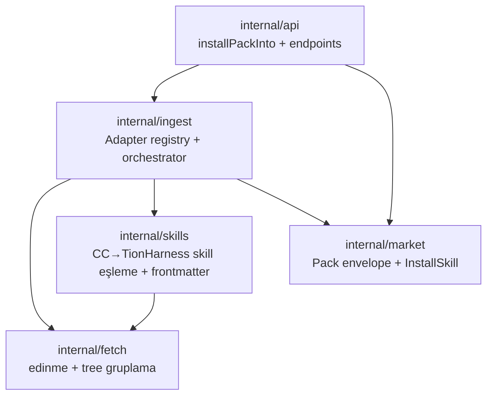

# 37 — Generic Import (Ingest) Mimarisi

> İçe aktarmanın jenerik, çok-türlü hâli (SK-IMP3, 2026-06-25). Tek skill / tek
> repodan çok-skilli koleksiyon (SK-IMP/SK-IMP2) üzerine kurulur; bu doküman
> **mimariyi** anlatır. Market dağıtımıyla ilişki için `21-MARKET.md` §4.1.

## 1. Neden ayrı bir "ingest"?

İki **dik eksen** vardı, eskiden iç içeydi:

| Eksen | İş | Eski durum |
|-------|----|-----------|
| **Edinme (acquisition)** | Byte'ları nereden al (GitHub tarball, local ağaç) | `skills` + `market-remote`'ta çift kod |
| **Çeviri (adapter)** | Yabancı format → native entity | Yalnız `mapCCSkill` (skill) |

Ayrıca **market** = TionHarness'in **kendi formatındaki** paketleri dağıtır (publish↔install,
sürümlü, registry; 7 entity türü kurar). **Import** = **yabancı formatı** (Claude Code
skill/agent/command, MCP config) alıp native entity'ye çevirir. Bunlar farklı işlerdir.

**Karar:** import ayrı bir `internal/ingest` paketidir; market'i **bağımlılık** olarak
kullanır (içine taşınmaz). Boru hattı:

```
fetch (edinme) → ingest adapters (keşif + çeviri) → []market.Pack → installPackInto (tek kurulum otoritesi)
```

Yeni bir içe-aktarılabilir özellik eklemek = **tek bir `Adapter` yazmak**.

## 2. Katmanlar ve bağımlılık yönü



Döngü yok: `fetch` ve `market` yapraktır; `skills→fetch`; `ingest→{fetch,skills,market}`;
yalnız `api` ingest'e bağlıdır.

## 3. `internal/fetch` — edinme + gruplama

- `TreeFrom(source, location) (Tree, prefix, warnings, err)` — `Tree = map[path][]byte`.
  - **github**: `codeload.github.com/<owner>/<repo>/tar.gz/<ref>` **tek tarball**
    (`main`→`master` fallback), `archive/tar`+`compress/gzip` ile bellek-içi açılır
    (**yeni bağımlılık yok**). Contents-API klasör-gezmesine göre anonim rate-limit'e
    çok daha dostu. `owner/repo` kısayolu (`NormalizeRepoRef`), `tree`/`blob` URL'leri
    (`ParseGitHubURL`). Üst dizin soyulur; `skipDirs` (.git/.github/node_modules/dist/
    build/benchmarks) elenir; 4 MB/dosya, 64 MB/toplam cap.
  - **local**: `WalkDir` ile aynı `Tree`.
- `GroupByMarker(tree, prefix, marker) []Group` — bir **marker** dosyasının (ör.
  `SKILL.md`) ebeveynlerini grup yapar; her kaynak dosya **en derin** ata-grup'a atanır
  (nested sub-skill kendi kaynaklarını korur). Kök-marker desteklenir. `skills` (tek
  import) ve `ingest` (skill adapter) ortak kullanır.
- `FindFiles(tree, prefix, pred) []string` — tek-dosya artifact'ları (agent/command/
  MCP) için isim-bazlı tarama.

## 4. `internal/ingest` — adapter boru hattı

```go
type Adapter interface {
    Kind() string
    Scan(tree fetch.Tree, prefix, baseURL string) []Discovered
}
type Discovered struct {
    Key, Kind, Slug, Name, Description, RelPath string
    Files    []string
    Warnings []string
    Exists   bool                          // API katmanı doldurur
    build    func(Options) (market.Pack, error) // serialize edilmez
}
```

- **`Scan(source, location)`** → tree'yi edinir, **tüm** adapter'ları çalıştırır,
  **(kind, slug) bazlı dedup** uygular (repo'nun `plugins/`/`dist/` altında kendini
  aynalaması → en **sığ** yol tutulur), sonuçları sıralı döndürür. Önizleme; yazma yok.
- **`BuildPacks(source, location, keys, opts)`** → yeniden tarar, seçili `key`'leri
  filtreler, her birinin `build(opts)` closure'ını çağırıp `[]market.Pack` üretir.
  Build hatası fatal değil — `SkipNote`.
- **Options:** `Shared` (skill'leri on-demand sun), `SlugPrefix` (isim-uzayı; yalnız
  slug-anahtarlı skill kind'inde uygulanır), `Group` (içe aktarılan skill'leri
  **Skills UI'da tek bir katlanabilir başlık** altında toplayan `group` frontmatter'ı;
  boşsa kaynağın kendi `group`'u korunur, doluysa onu **ezer** — böylece markette/
  linkten indirilen bir paket mevcut skiller'e karışmaz). skill+command adapter'larında
  uygulanır. UI (`SkillImportDialog`) taramada grubu kaynak adından (repo/owner-repo/
  klasör) **otomatik ön-doldurur**; kullanıcı düzenleyebilir/temizleyebilir.

### Adapter'lar (4)

| Adapter | Tespit | Üretir | Notlar |
|---------|--------|--------|--------|
| `skillAdapter` | `**/SKILL.md` | `skill` pack | `skills.RenderImportedSkill` ile eşler; nested kaynaklar `Pack.Files`'a |
| `agentAdapter` | `**/agents/*.md` (frontmatter `name`) | `agent` pack | body→Soul, `tools`→AllowedTools; CC `model` **eşlenmez** (uyarı) |
| `commandAdapter` | `**/commands/*.md` **ve** `*.toml` | `skill` pack | CC slash-command → loadable skill; `.md` (YAML frontmatter) + `.toml` (`description`/`prompt`, mini parser `toml.go`) |
| `mcpAdapter` | `.mcp.json` / `mcp.json` (`mcpServers`) | `mcp` pack | sunucu başına bir pack; args/env JSON string |

**marketplace.json güdümlü keşif** (`marketplace.go`): repo kökünde
`.claude-plugin/marketplace.json` varsa (ve kullanıcı alt-yol vermediyse), manifest'in
`plugins[].source` yolları **gerçek plugin kökleri** olarak hedeflenir → kör tarama
yerine isabetli keşif (aynalar/ilgisiz alt-ağaçlar baştan elenir) + marketplace adı
provenance. En **sığ** manifest seçilir (nested kopya kök'ü ezmez).

## 5. `Pack.Files` — nested kaynaklar

`market.Pack`'e `Files map[string][]byte` eklendi (JSON'da base64). `InstallSkill`
nested dosyaları (`references/`, `evals/`, `scripts/`) `safeRelPath` ile (mutlak yol +
`..` reddi) yazar. `BuildSkillPack(... , files)` ve publish (`collectSkillFiles`) de
taşır → yayınla/kur kaybsız.

## 6. Tek install otoritesi

`internal/api/market.go::installPackInto(r, wsp, pack, req) (InstallResult, error)` —
kind switch'i (skill/agent/flow/provider/mcp/workspace/memory) **tek** yerde; alt-
installer'lar `(InstallResult, error)` döndürür (`httpErr` ile HTTP kodu taşır). **Hem**
market install endpoint'i **hem** ingest install endpoint'i bunu çağırır → "GitHub'dan
import" ile "registry'den install" aynı yere düşer.

## 7. API + UI

| Metot | Yol | İş |
|-------|-----|-----|
| POST | `/api/ingest/scan` | `{source, path\|url}` → keşfedilen artifact'lar (kind/slug/name/desc/files/warnings/exists) |
| POST | `/api/ingest/install` | `{source, path\|url, keys[], slugPrefix?, shared?}` → seçilenleri kur (installed + skipped + warnings) |

- `scan` sonrası API `decorateExisting` ile her item'ı (skill slug / agent adı / mcp adı)
  zaten kurulu mu işaretler.
- Eski skill-özel `/api/skills/import/scan|bulk` **kaldırıldı**; `/api/skills/import`
  (tek skill, geriye uyumlu) korundu.
- **UI** `SkillImportDialog` → **kind-agnostik**: Tara → Seç (kind'e göre gruplu) → İçe
  aktar. Market ekranındaki "İçe Aktar" butonu artık her kategoride görünür.

## 8. Doğrulama

- Birim: `fetch` (group/find/parse/normalize), `ingest` (scan/build/adapters/dedup),
  `market` (InstallSkill nested + BuildSkillPack files), `skills` (block-scalar, safe path).
- Canlı (network-gated, `TIONHARNESS_LIVE_TEST=1`): `ingest.Scan` →
  **caveman 10** (3 agent + 7 skill; `plugins/` aynası dedup'landı),
  **taste-skill 13**, **marketingskills 45**.

## 9. Tamamlananlar

- ✅ **(2026-06-25)** `.toml` command desteği (`toml.go`) + `marketplace.json`
  güdümlü keşif (`marketplace.go`). Canlı: caveman artık 11 (3 agent + 8 skill; `.toml`
  komutlardan `caveman-init` eklendi, kalan 3 skill-folder ile dedup'landı).

## 10. Sırada (opsiyonel)

- **Dizin-sitesi adaptörü:** crossaitools/skillsmp/claudeskillsmarket'i `swarmregistry/v1`
  uzak registry olarak köprülemek (bkz. `39-DIZIN-SITE-REGISTRY.md`).
- CC `model` → TionHarness provider/model eşleme tablosu (agent adapter).
