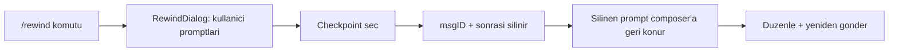

# 43 — Rewind (Sohbet Checkpoint Geri Sarma)

> Durum: **yalnız-sohbet MVP tamamlandı (2026-07-01)**. Dosya-restore modu ileride.

## Amaç

Bir tur kodu/akışı bozunca ajanla tartışıp bağlamı (context) kirletmek yerine, **hatadan
önceki temiz checkpoint'e** dönüp yeniden denemek. Claude Code'un `/rewind` (Esc-Esc)
özelliğinin sohbet ayağının TionHarness karşılığı.

**Tek cümle:** `/rewind` = seçilen prompt ve sonrasındaki tüm mesajları silip sohbeti o
ana geri sarar; silinen prompt, düzenleyip yeniden göndermen için mesaj kutusuna geri konur.

## Kapsam kararı

Kullanıcı kararıyla MVP **yalnız-sohbet**: sadece transcript geri alınır. **Dosya
değişiklikleri geri yüklenmez** — kod için git zaten kalıcı güvenlik ağı. Claude Code'un
3 modundan (kod / sohbet / ikisi) yalnız "sohbet" uygulandı; dosya-restore ileride
snapshot altyapısıyla eklenebilir.

## Mekanik

- **Checkpoint = kullanıcı promptu.** Dialog oturumun `role=user` mesajlarını yeniden→eskiye
  listeler; her satır kaç mesaj sileceğini gösterir.
- Geri sarma = anchor mesaj **dahil** sonrası silinir.

## Kod haritası

**Backend**
- `db.DeleteMessagesFrom(ctx, sessionID, messageID) (removed int, err error)` — `internal/db/store.go`.
  Anchor + sonrasını siler, JSONL yeniden yazılır (`writeSessionFileLocked`), `MessageCount`
  güncellenir. Truncation noktası özet sınırından önceyse (`SummaryMsgCount > idx`) geçersiz
  rolling-summary **sıfırlanır** (dangling özet önlenir). `ErrNotFound` bilinmeyen id'de.
- `handleRewindSession` — `internal/api/sessions.go` (`bindJSON[rewindReq]`, `writeError`/`writeDBError`,
  `session rewound` log). Route: `POST /api/sessions/{id}/rewind` (`server.go`).
- Test: `internal/db/rewind_test.go`.

**Frontend**
- `api.rewindSession(sessionId, messageId)` — `frontend/src/api/sessions.ts`.
- `useChatStream`: `rewindOpen`/`openRewind`/`closeRewind` + `rewindTo(msgId)` +
  `/rewind` komutu (`chatCommands`, ikon ⟲). `rewindTo` görünüm + sunucuyu atomik siler,
  silinen prompt metnini döndürür.
- `RewindDialog.tsx` — `frontend/src/components/chat/RewindDialog.tsx` (checkpoint picker).
- **Balon hover aksiyonu:** her kullanıcı balonunun altında ⟲ **"Buraya geri sar"** butonu
  (`RewindButton.tsx`, iki-adımlı onay — `DeleteButton` deseni) → picker açmadan doğrudan o
  mesaja geri sarar. `UserTurn` → `MessageList` (`onRewind`) → `App`.
- `App.tsx`: ortak `handleRewind` (dialog + balon aksiyonu ikisi de kullanır) → `rewindTo` +
  `writeSessionDraft` (silinen promptu composer draft'ına yaz) + `composerKey` bump ile
  Composer remount (draft yeniden okunur).
- `writeSessionDraft` — `frontend/src/hooks/useSessionDraft.ts` (hook dışından draft yazımı).

## Sınırlar

- Yalnız transcript geri alınır. `Bash` yan etkileri (`git push`, `npm install`, `rm`) ve
  dosya değişiklikleri geri **gelmez** — Claude Code ile aynı sınır.
- Yerel-only (persist edilmemiş) anchor'da sunucu çağrısı atlanır (yalnız görünüm dilimlenir).
- **Salt-okunur oturumlarda rewind yok.** Yazılabilir olmayan her kind (`task`, `flow`,
  `schedule`, `automation`, `flow-coordinator`, `worker`, `insight`) orkestratörün yazdığı
  bir çalışma günlüğüdür: composer gizli olduğu için checkpoint'ten devam etmenin yolu yok,
  dolayısıyla rewind yalnızca kaydı bozar. API `POST /api/sessions/{id}/rewind`'i
  `rejectReadOnlySession` ile **403** döndürür (`internal/api/session_readonly.go`),
  UI de `ChatView`'de `onRewind`'i o oturumlarda hiç geçmez — böylece balon üstündeki
  ⟲ butonu ve `RewindDialog` görünmez. Testler:
  `internal/api/session_writable_test.go` (`TestRewindRejectedOnReadOnlySessions`,
  `TestRewindAllowedOnWritableKinds`).

## Olası sonraki adımlar

- **Dosya-restore modu:** tur başına pre-image snapshot (`Write`/`Edit` hook'u,
  `sessions/<id>/checkpoints/`), rewind'de diske geri yaz → 3-mod (kod/sohbet/ikisi).
  Claude Code'daki `fileHistory.ts` deseni.
