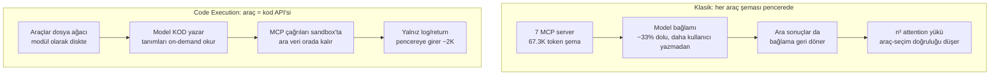
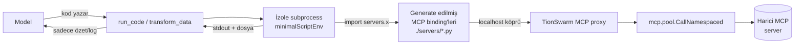
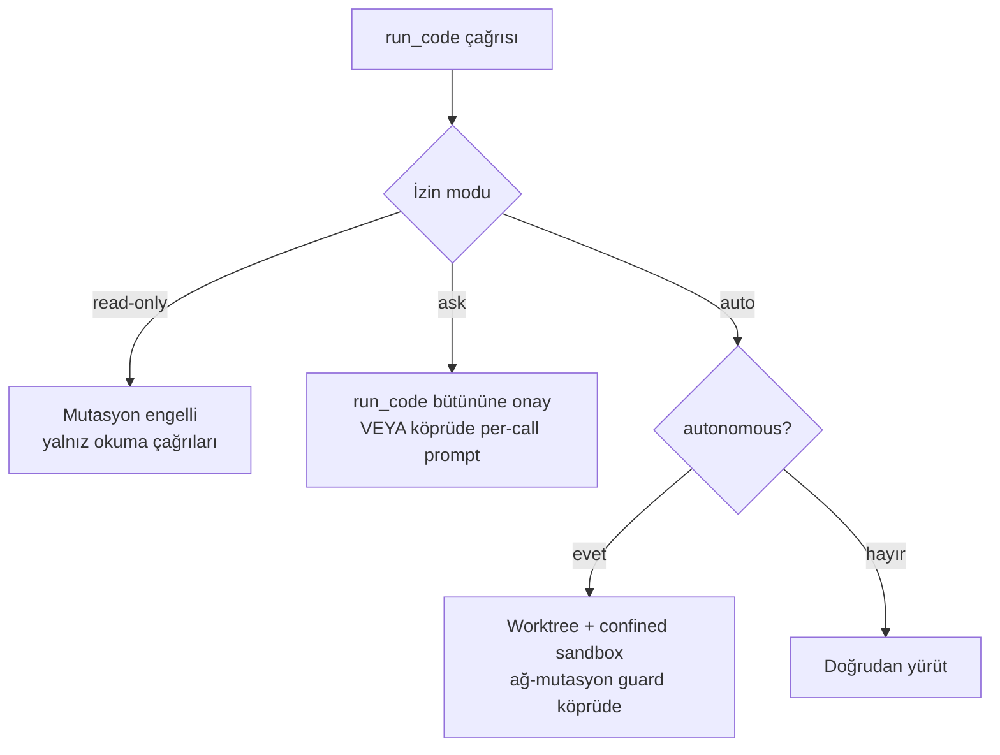
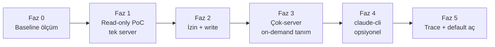
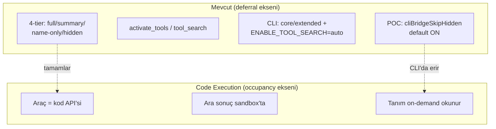

# 44 — Code Execution with MCP (Fizibilite + Faz Planı)

> **Durum:** Faz 0 (baseline, §11) + Faz 1 PoC + Faz 2 (per-call izin +
> gözlemlenebilirlik) + Settings/UI + **Faz 3 A/B ölçümü (§12)** + **built-in araç
> binding'leri (§13)** tamamlandı. Açık kalan: büyük-çıktılı senaryo tekrarı.
> **Tarih:** 2026-07-02 · **İlgili:** [17-TOKEN-OPTIMIZASYON](17-TOKEN-OPTIMIZASYON.md) ·
> [19-LAZY-TOOL-LOADING](19-LAZY-TOOL-LOADING.md) · [24-SELF-MANAGEMENT](24-SELF-MANAGEMENT.md) ·
> [25-SUBAGENT-ISOLATION](25-SUBAGENT-ISOLATION.md) · [38-SESSION-DEBUG](38-SESSION-DEBUG.md)

---

## 1. Problem & Motivasyon

Ajanlara çok sayıda araç (built-in + MCP source araçları) bağlanınca, **tüm araç
şemaları her turda modele gider**. Bu iki ayrı maliyet üretir; bunları karıştırmak
yanlış çözüm seçtirir:

| Boyut | Ne demek | Neyi etkiler |
|-------|----------|--------------|
| **Cost (maliyet)** | Token başına ödediğimiz para | Fatura |
| **Occupancy (pencere doluluğu)** | 200K bağlam penceresinin ne kadarının araç şemalarıyla dolduğu | Attention kalitesi + kalan çalışma alanı |

**Kritik ayrım:**

- **Prompt cache** → *cost*'u düşürür (cache-read ucuzdur) ama pencere **doluluğunu**
  ve attention yükünü **düşürmez**. Şema hâlâ pencerede, hâlâ modelin ilgi alanını
  n² ilişkiyle yoruyor.
- **Deferral / tier occupancy** (TionSwarm'nun mevcut 4-tier'i) → tier doluluğunu
  düşürür ama araç *gerektiğinde* tam şemayla pencereye girer.
- **Code execution with MCP** → araçları modele **hiç şema olarak vermez**. Araçları
  bir kod API'si gibi sunar; ara sonuçlar execution ortamında kalır, pencereye
  girmez. Bu, hem cost hem occupancy'yi aynı anda düşüren tek yaklaşım.

**Ölçek (Anthropic'in raporladığı):**

- 7 MCP server ≈ **67.300 token** — kullanıcı daha bir şey yazmadan, 200K pencerenin
  **~%33**'ü.
- Araç sayısı arttıkça araç-seçim doğruluğu **~3×** düşer (context-rot / n² attention).
- Code execution deseni: **150K → 2K token (~%98.7)** azaltım.
- Karşılaştırma: Tool Search Tool ~%85, Programmatic Tool Calling ~%37.



---

## 2. Desen Özeti — Code Execution with MCP

**Fikir:** MCP sunucularını modele *araç listesi* olarak sunmak yerine, bir **kod
API'si** (TypeScript/Python modül ağacı) olarak sun. Ajan, araç çağırmak için
JSON `tool_use` üretmez — **kod yazar**:

```python
# Model bunun gibi kod yazar; sandbox çalıştırır.
from servers.linear import list_issues
from servers.github import create_comment

issues = list_issues(team="ENG", state="open")   # 500 satır dönebilir
urgent = [i for i in issues if i.priority == 1]   # filtre SANDBOX'ta
for i in urgent[:3]:
    create_comment(i.id, "Bumping priority")       # sonuç pencereye girmez
print(f"{len(urgent)} urgent issue işlendi")        # SADECE bu döner
```

**Neden ~%98 kazanç:**

1. **Progressive disclosure** — Model tüm araç şemalarını görmez; yalnız kullandığı
   modülün tanımını *on-demand* okur (bir `search_tools` / dosya okuma adımıyla).
   Kullanılmayan 60 aracın şeması pencereye hiç girmez.
2. **Ara sonuçlar bağlamda kalmaz** — 500 satırlık `list_issues` çıktısı sandbox
   değişkeninde durur; modele yalnız `print` ile döndürülen özet girer. (TionSwarm'da
   `transform_data`'nın "data dosyada kalır, sadece log döner" davranışının aynısı.)
3. **Kontrol akışı kod tarafında** — döngü/filtre/koşul model turlarına değil,
   tek bir kod yürütmesine iner. Tur sayısı ve dolayısıyla tekrarlanan şema maliyeti
   düşer.

---

## 3. TionSwarm'ya Oturma Senaryoları

TionSwarm'nun iki yürütme yolu var; her biri için ayrı bir tasarım seçeneği ele
alınmalı. **İyi haber:** TionSwarm bu deseni kurmak için gereken parçaların
**çoğuna zaten sahip** — kod yürütme sandbox'ı (`transform_data`), fs araçları,
namespace'li MCP çağrı yolu, ve kod-dışı çağrı için `mcp.CallNamespaced`.

### Doğrulanmış mevcut zemin (repo üzerinden)

| Parça | Konum | Kod-execution için değeri |
|-------|-------|---------------------------|
| **`transform_data`** | `internal/tools/builtin_transform_data.go` | Zaten "modelin yazdığı script'i izole subprocess'te çalıştır, **data dosyada kalsın, yalnız stdout+path dönsün**" deseni. python3/node/bun; 30s timeout; 16KB log cap. Aranan desenin **prototipi**. |
| **Stripped env** | `internal/tools/transform_data_env.go` | `minimalScriptEnv()` — **allowlist** tabanlı; `ANTHROPIC_API_KEY` dahil hiçbir secret script'e geçmez. |
| **Shell (`Bash`/`PowerShell`)** | `internal/tools/builtin_shell.go` | RiskExec, `ShellEnabled` gate'i, 64KB cap, autonomous brake (`sb.Confined` → `git push` engeli). Genel kod yürütme kanalı. |
| **MCP çağrı yolu** | `internal/mcp/manager.go` (`CallNamespaced`, `NamespaceTool`, `nsSep="__"`) | `<server>__<tool>` namespace'i; kod API'sinin altına bağlanacak çağrı primitifi. |
| **MCP havuzu** | `internal/mcp/pool.go` (+ `client.go` stdio, `http.go` streamable) | Kalıcı bağlantı — kod içinden tekrarlı çağrılar yeni süreç açmaz. |
| **4-tier görünürlük** | `internal/tools/registry.go` (`VisibilityFull/Summary/NameOnly/Hidden`) | Kod moduyla birlikte yaşayacak; §8. |
| **Sandbox** | `internal/tools/sandbox.go` | `NewSandbox` (unconfined, izin katmanı sınır) / `NewConfinedSandbox` (config dizini). |
| **Worktree izolasyonu** | `internal/agent/worktree.go` (`ensureWorktree`) | Otonom turlarda per-session git worktree + branch (`tionswarm/session-<id>`). |
| **Ölçüm** | `internal/agent/debugjournal.go` + `GetTurnDebug` | `debug.jsonl` `llm_call` olayları (`in/out/cacheRead/cacheWrite`), `TurnID`. |

### Seçenek A — Native tool-loop için "MCP-as-code" (önerilen ana hat)

MCP araçlarını, sandbox'ın dosya sistemine yazılmış bir **kod API ağacı** olarak
sun. Ajana tek bir yürütme aracı (`transform_data`'nın genişletilmiş hâli ya da
`Bash`) ver; MCP çağrıları bu ortamdan bir **köprü** üzerinden yapılır.



**Nasıl kurulur (kavramsal):**

1. Tur başında TionSwarm, etkin MCP sunucularının araçlarını tarayıp sandbox
   çalışma dizinine bir **binding ağacı** yazar: `./servers/<server>/<tool>.py`
   (veya tek `servers.py`). Her binding, TionSwarm'da açılan bir **loopback köprüye**
   (kısa ömürlü localhost HTTP ya da named-pipe) çağrı yapan ince bir fonksiyon.
2. Köprü, gelen `(server, tool, args)` çağrısını `mcp.CallNamespaced` ile kalıcı
   havuz üzerinden gerçek MCP sunucusuna iletir; sonucu script'e döndürür.
3. Model, tanımları **on-demand** okur (bir `Grep`/`Read` ile `./servers/...`),
   sonra `run_code` ile kodu çalıştırır. Araç şemaları **pencereye hiç girmez.**

**Artı:**
- Anahtarsız değil, tam TionSwarm kontrolünde — çağrı `mcp.pool`'dan geçtiği için
  trace, izin, compaction, budget muhasebesi korunabilir.
- `transform_data`'nın secret-izolasyonu + timeout'u devralınır.
- Occupancy **ve** cost aynı anda düşer (deseninin tam kazancı).

**Eksi:**
- Loopback köprü + binding üretimi yeni bir alt-sistem (auth token, port yönetimi).
- Kod yürütmenin gözlemlenebilirliği düşer: bir `run_code` bloğu içinde N MCP
  çağrısı olur; her biri ayrı `tool_use` kartı olmadığından UI'da iz azalır (§7).
- İzin modeli tanesel (per-tool) çalışıyordu; kod içi çağrılar için izin **köprü
  seviyesinde** yeniden ele alınmalı (§4).

### Seçenek B — claude-cli yolu: yerleşik yeteneği devral

claude-cli'nin **kendi** code-execution / tool-search yeteneği var
(`ENABLE_TOOL_SEARCH=auto`, `internal/agent/climcp.go`). Burada iki alt-yol:

- **B1 — CLI'ya bırak:** MCP sunucularını `--mcp-config` ile CLI'a ver, CLI'ın
  kendi progressive-disclosure'ını (core/extended tier, `alwaysLoad`) kullan.
  Bu **zaten kısmen var**. Ek code-execution kazancı CLI sürümüne bağlı.
- **B2 — köprüde çöz:** Seçenek A'daki binding+loopback'i CLI için de kur; CLI'a
  yalnız tek bir `run_code` MCP aracı göster.

**Artı (B):** CLI zaten anahtarsız + kendi tool-search'ü olgun.
**Eksi (B):** CLI köprüsünde 4-tier "erir" (bkz. §8 / [19](19-LAZY-TOOL-LOADING.md)):
MCP'de araç çağrılabilmesi için tam şema `tools/list`'te olmalı, CLI allowlist'i
süreç başında sabit → **tur-içi activate yok**. Bu yüzden native yol (Seçenek A)
desenin tam kazancına daha uygun; CLI yolu için gerçekçi hedef B1'i olgunlaştırmak.

> **✅ KARAR (kapandı):** Ana hat **Seçenek A (native)** seçildi ve uygulandı
> (`internal/codemode`, Faz 0–3 + Faz 5). claude-cli tarafında B1 (extended-tier
> deferral) yeterli sayıldı; **B2 uygulanmadı**. Yukarıdaki A/B analizi kararın
> *gerekçesi* olarak korunur — özellikle CLI köprüsünde 4-tier'ın neden "eridiği".
> Ölçüm sonuçları ve mevcut durum: §10–13.

---

## 4. Güvenlik / Sandbox

Kod yürütme = keyfi host kodu. TionSwarm'nun mevcut sınırları ve boşlukları:

| Katman | Mevcut durum | Kod-execution için not |
|--------|--------------|------------------------|
| **Secret izolasyonu** | `minimalScriptEnv()` allowlist — API key'ler script'e geçmez | ✅ Devral. Loopback köprünün auth token'ı da script env'ine **girmemeli** (köprü ayrı kanaldan doğrulamalı). |
| **Kaynak sınırı** | 30s timeout, 16KB log cap (`transform_data`) / 64KB (shell) | ✅ Devral; kod-modu için timeout ayarlanabilir yapılmalı. |
| **Path sınırı** | `Sandbox` default **unconfined** — izin katmanı (read-only/ask/auto) gerçek sınır | ⚠️ Kod içi fs erişimi izin modunu **atlar**; kod-modu için `NewConfinedSandbox` benzeri bir confine seçeneği düşünülmeli. |
| **Otonom fren** | `sb.Confined` + `isNetworkMutatingGit` → `git push` engeli; `autonomousConfine` | ⚠️ Kod içinden `git push` substring guard'ı **atlar** (kod shell'i doğrudan çağırabilir). Kod-modunda ağ-mutasyon guard'ı köprü/subprocess seviyesine taşınmalı. |
| **Worktree izolasyonu** | `ensureWorktree` per-session branch | ✅ Kod-modu otonom turlarda worktree içinde çalışmalı — dosya çakışması önlenir. |
| **İzin (permission)** | Native: per-tool RiskExec gate; CLI: `--permission-prompt-tool` | ⚠️ **En kritik boşluk:** kod bloğu tek `run_code` çağrısı → içindeki N MCP/fs/shell çağrısı ayrı ayrı onaylanmaz. İzin ya (a) `run_code`'un tamamına bir kez, ya (b) köprü seviyesinde per-call verilmeli. |



**Sonuç:** Sandbox ve secret-izolasyonu hazır; **izin taneselliği** ve **otonom
ağ-mutasyon guard'ının kod-moduna taşınması** çözülmesi gereken iki gerçek boşluk.

---

## 5. Fazlandırma

Her faz küçük, tek başına doğrulanabilir ve ölçülebilir kazanç üretir.

### Faz 0 — Ölçüm zemini (kod yok, sadece baseline)
- Mevcut senaryoda (ör. 3–7 MCP server etkin) tur-başı token profilini
  `debug.jsonl` / `turn-debug` ile kaydet: `in` (şema payı), `cacheRead`, `out`.
- **Kazanç metriği:** "araç şemalarının tur-başı input token payı" baseline'ı.

### Faz 1 — Read-only "MCP-as-code" PoC (tek server)
- Tek bir güvenli MCP server için binding ağacı üret (`./servers/<x>/*.py`) +
  loopback köprü (yalnız **read** araçları).
- Ajana `transform_data`'yı genişleten veya yeni `run_code` aracını ver.
- **Kazanç:** o server'ın araç şeması pencereden **tamamen çıkar**; tur-başı input
  token'da ölçülebilir düşüş. Doğrulama: aynı görev iki yolla (klasik vs kod)
  koşturulup `turn-debug` karşılaştırması.

### Faz 2 — İzin + mutasyon (write araçları)
- Köprüde per-call izin kancası; `ask` modunda kod içi mutasyon çağrıları
  TionSwarm onay UI'ına düşer. Otonom ağ-mutasyon guard'ı köprüye taşınır.
- **Kazanç:** güvenli write; per-call gözlemlenebilirlik geri kazanılır.

### Faz 3 — Çok-server + on-demand tanım okuma
- N server için binding; model tanımları `Grep`/`Read` ile keşfeder.
- **Kazanç:** occupancy'nin asıl düşüşü burada (7 server senaryosunda 67K → ~birkaç K).

### Faz 4 — claude-cli entegrasyonu (opsiyonel/ileri)
- B1'i olgunlaştır (extended-tier deferral ölçümü) veya B2 köprüsü.

### Faz 5 — Trace/observability + varsayılan aç
- `run_code` içi MCP çağrılarını trace'e ayrı olay olarak yaz; UI kartı.
- Ölçülen kazanç + kabul edilir gözlemlenebilirlikte tunable default'u aç.



---

## 6. Ölçüm Planı

**Kaynak:** `debug.jsonl` (`internal/agent/debugjournal.go`) + `GetTurnDebug` +
`GET /api/sessions/{id}/turn-debug?turn={replyMessageId}` (bkz. [38](38-SESSION-DEBUG.md)).

**Ölçülecek metrikler (tur-başı, öncesi/sonrası):**

| Metrik | Kaynak alan | Ne gösterir |
|--------|-------------|-------------|
| Input token (şema payı) | `llm_call.in` | Occupancy'nin doğrudan göstergesi |
| Cache-read token | `llm_call.cacheRead` | Cost tarafı (cache'lenen şema) |
| Output token | `llm_call.out` | Kod yazımının ek maliyeti |
| Tur sayısı | `turn` olayları | Kontrol akışı kod tarafına inince düşmeli |
| Tool latency/bytes | `byTool` rollup | Kod-modu tek kart vs N kart farkı |

**Test senaryoları:**
1. **Az araç (1–2 server):** kazanç küçük, regresyon olmamalı (kod yazım maliyeti
   şema tasarrufunu yememeli).
2. **Çok araç (5–7 server):** asıl hedef; 67K→birkaç K beklentisi.
3. **Çok-adımlı görev (filtre+döngü):** tur sayısı düşüşü.

**Yöntem:** Aynı görev tanımı, aynı model, iki mod (klasik tool-loop vs kod-modu);
`turn-debug` çıktıları yan yana. `SessionUsage.byKind` ile günlük toplam doğrulama.

---

## 7. Riskler & Açık Sorular

| Risk / Soru | Detay | Azaltım |
|-------------|-------|---------|
| **Gözlemlenebilirlik kaybı** | `run_code` içi N çağrı tek kart → UI'da iz azalır, debug zorlaşır | Köprü her MCP çağrısını trace'e ayrı olay yazsın (Faz 2/5) |
| **İzin taneselliği** | Kod bloğu izin modunu bir kerede geçer | Per-call köprü izni ya da `run_code` bütününe explicit onay |
| **Doğruluk maliyeti** | Model kod yazmakta JSON tool_use'dan daha çok hata yapabilir; sözdizimi/exception | Katı script kontratı + net hata dönüşü (`transform_data` gibi loud fail) |
| **Provider bağımlılığı** | Anthropic native tool-loop'ta kod-modu bizim; CLI'da CLI sürümüne bağlı | Native yol ana hat; CLI opsiyonel |
| **Sandbox güvenliği** | `transform_data` "güvenlik sandbox'ı değil, secret-izolasyon + kaynak sınırı" | Confine + worktree + otonom guard'ı kod-moduna taşı (§4) |
| **Binding güncelliği** | MCP server araçları değişince binding ağacı bayatlar | Binding'i tur başında yeniden üret (stateless) |
| **Küçük ölçekte net zarar** | 1–2 araçta kod-modu şema tasarrufundan pahalı olabilir | Eşik: yalnız araç sayısı N üstündeyken kod-modu (tunable) |

---

## 8. Mevcut Tier / POC ile İlişki

Bu desen mevcut 4-tier'in **rakibi değil, tamamlayıcısı** — farklı ekseni çözer:



- **4-tier + activate_tools** ([19](19-LAZY-TOOL-LOADING.md)): araç şemasını *tur
  içinde erteler* ama gerektiğinde tam şemayla pencereye sokar. Code-execution ise
  şemayı hiç sokmaz — tanım diskte, model okur. **Birlikte:** built-in'ler tier'de
  kalır (insan-etkileşimli, sık); *MCP source araçları* kod-API'sine iner.
- **`cliBridgeSkipHidden` POC** (default **ON**, `internal/tools/bridge_filter.go`
  + `clibridge_tunable.go`): hidden-tier self-management araçlarını CLI köprüsüne
  hiç vermez. Code-execution, aynı "şemayı süreçten tamamen uzak tut" felsefesinin
  MCP-source araçlarına genişletilmiş hâli.
- **Tool cache breakpoint** (system bloğuna bağlı, bağımsız değil): code-execution
  şema payını küçülttüğü için bu iyileştirmenin önemi de azalır.
- **`transform_data`** ([17](17-TOKEN-OPTIMIZASYON.md)): "data dosyada kalır, log
  döner" — code-execution deseninin **zaten çalışan çekirdeği**. Bu planın ana
  kaldıracı budur.

---

## 9. Özet & Önerilen İlk Faz

**Özet:** Code execution with MCP, TionSwarm'nun *occupancy* sorununu (mevcut tier
sistemi *deferral*'ı çözüyor ama şema gerektiğinde hâlâ pencereye giriyor) kökten
çözen tek yaklaşım. En büyük avantaj: TionSwarm, deseni kurmak için gereken parçaların
çoğuna **zaten sahip** — `transform_data`'nın izole-subprocess + secret-allowlist +
"data dosyada kalır" çekirdeği, `mcp.pool.CallNamespaced` çağrı yolu, worktree
izolasyonu ve `debug.jsonl` ölçüm altyapısı. Sıfırdan inşa değil; mevcut çekirdeği
MCP çağrılarına **köprüleyip genişletme** işi.

**İki gerçek boşluk:** (1) izin taneselliği (kod bloğu içi çağrılar), (2) otonom
ağ-mutasyon guard'ının kod-moduna taşınması.

**Önerilen ilk faz — Faz 0 + Faz 1:**
1. **Faz 0:** 3–7 MCP server'lı bir senaryoda tur-başı token profilini
   `turn-debug` ile kaydet — "araç şemasının input token payı" baseline'ı.
2. **Faz 1:** Tek, güvenli, **read-only** bir MCP server için binding ağacı +
   loopback köprü PoC'si; `transform_data`'yı kaldıraç al. Aynı görevi klasik ve
   kod-modu ile koştur, `turn-debug` karşılaştır.

Kazanç ölçülüp regresyon (küçük ölçekte net zarar) elenmeden write/otonom fazlara
geçilmemeli.

---

## 10. Faz 1 + Faz 2 Uygulama Durumu (2026-07-02) ✅

Seçenek A'nın (native "MCP-as-code") ilk iki fazı uygulandı. Bileşenler:

| Bileşen | Konum | Not |
|---------|-------|-----|
| Loopback köprü | `internal/codemode/bridge.go` | Per-execution: 127.0.0.1 rastgele port, rastgele Bearer token (constant-time compare), 200 çağrı/koşu tavanı, 120s per-call timeout, çağrı sayacı + özet |
| Binding üreticisi | `internal/codemode/bindings.go` | `.tionswarm/mcp/` altına `_bridge.py` + server-başına Python modülü; docstring = açıklama + normalize schema; her çağrıda sıfırdan regen |
| `run_code` aracı | `internal/tools/builtin_runcode.go` | Boş script → discovery (modül/fonksiyon listesi); script → stripped env + `PYTHONPATH` + köprü env; yalnız stdout/stderr (16KB) + MCP çağrı özeti döner; 60s default / 300s max |
| Risk sınıfı | `internal/tools/classify.go` | `run_code` = RiskExec → "ask" modda bütünüyle onay, "read-only"de blok |
| Gate | `internal/agent/tunables.go` + `codemode_tunable.go` + `internal/app/app.go` | `TIONSWARM_CODE_MODE=1` (default KAPALI) **VE** `ShellEnabled` **VE** MCP kataloğu dolu |
| Kayıt | `internal/agent/toolsetup.go` (AttachMCP bloğu) | Köprüye ajanın kendi `toolFilter`'ı verilir; CLI köprüsüne verilmez (`bridgeExcluded`) |
| **Per-call izin (Faz 2)** | `codemode.Config.Gate` + `toolsetup.go` closure | Script içi her MCP çağrısı, native loop'un aynı çağrıya uygulayacağı **`permGate`'in birebir kendisinden** geçer: "ask" modda per-call onay kartı (standing "always allow" grant'ları geçerli), "read-only"de blok, otonom ask-turlarında prompter yok → red. Red, script'e loud `MCPError` olarak döner; ayrı politika kodu yok — tam parite. |
| **Per-call gözlemlenebilirlik (Faz 2)** | `codemode.Config.Observe` + `toolsetup.go` closure | Script içi her çağrı (dispatch edilen VEYA reddedilen) `debug.jsonl`'a `tool` tipi olay yazar (`Detail: "via run_code"` / `"permission denied (via run_code)"`, DurMs/OutBytes/Err) — per-message debug paneli köprü çağrılarını native araç çağrıları gibi listeler. Araç sonucundaki özet artık red sayısını da içerir. |

**Akış:** model `run_code` (boş) → listing → `Read .tionswarm/mcp/<module>.py` (tanım
on-demand) → `run_code(script)` → script `from <server> import <tool>` ile çağırır,
köprü `mcp.pool.Call`'a yönlendirir → modele yalnız `print()` çıktısı + çağrı özeti döner.

**Plandan sapmalar (gerekçeli):**
1. **"Yalnız read-only MCP araçları" yerine tool-filter parity.** MCP `Tool` yapısında
   `readOnlyHint` annotation'ı yok (kod üzerinden doğrulandı: `internal/mcp/client.go`
   yalnız Name/Description/InputSchema taşır); isim-heuristiği kırılgan olurdu. Bunun
   yerine köprü ajanın kendi tool filtresini uygular (**kod modu, ajanın doğrudan
   çağıramayacağı hiçbir aracı açmaz**) ve `run_code` RiskExec olduğundan izin katmanı
   bütünüyle devrede. Per-call izin Faz 2'de.
2. **Köprü token'ı subprocess'e env ile geçer** (§4'teki "env'e girmesin" hedefinden
   sapma): token host secret'ı değil — koşu-başına rastgele, yalnız o tek execution'ın
   köprüsünü açar, süreçle birlikte ölür. Diske yazmak (worktree'ye/commit'e sızma
   riski) daha kötü; `minimalScriptEnv` allowlist'i host secret'ları için geçerliliğini
   koruyor.

**Test kapsamı:** `internal/codemode/bridge_test.go` (auth 401 / filtre 403 /
namespaced-olmayan 400 / tavan 429 / dispatcher hatası loud IsError / özet),
`bindings_test.go` (sanitizasyon, keyword/dash, allow filtresi, stale-regen temizliği),
`internal/tools/builtin_runcode_test.go` (discovery, gerçek python ile uçtan uca MCP
çağrısı + ham verinin context'e sızmadığı, loud failure, script-içi `_bridge.call`
bypass denemesinin köprüde reddi).

**Faz 2 notları:**
- **"Ask" modda bekleme/timeout etkileşimi:** onay beklerken script HTTP yanıtında
  bloklanır; bekleme script'in wall-clock timeout'una sayılır (Python binding'in
  urllib timeout'u 125s). Araç açıklaması modeli uyarır: onay beklenen scriptlerde
  `timeout_sec` yükselt ya da kullanıcı "always allow" grant'ı versin.
- **Otonom ağ-mutasyon guard'ı (plandaki §5-Faz 2 maddesi):** shell'deki `git push`
  substring-guard'ının MCP karşılığı yok (annotation yok, çağrı semantiği opak) —
  bunun yerine parite kuralı geçerli: otonom tur native yolda hangi MCP çağrısını
  yapabiliyorsa köprüden de aynısını yapabilir, fazlasını değil. Ayrı bir guard
  eklenmedi (eklenirse native yolla asimetri yaratırdı).

**UI + settings entegrasyonu (2026-07-02, Faz 5'ten öne alındı):**
- **Settings toggle:** `enableCodeMode` alanı (settings.json, Ayarlar → Geçişli
  yetenekler ekranı, `AppToolsPanel`) — canlı uygulanır (`applySettings` →
  `SetCodeMode`). `TIONSWARM_CODE_MODE=1` artık doğrudan tunable değil, `EnableShell`
  gibi **tek seferlik boot seed**'i; source of truth Settings ekranı. Kabuk yetkisi
  kapalıyken UI uyarı gösterir (run_code kaydedilmez).
- **Trace kartları:** `CallObservation`'a `Args` eklendi; `toolsetup` observer'ı her
  script-içi çağrıyı call-ctx'teki sub-step sink'ine `StepTool` olarak yazar → tool
  loop'un generic promotion'ı `run_code` kartını **katlanabilir `StepSubagent`**
  yapar (run_subagent ile aynı render, frontend değişikliği gerekmedi). Satır başına
  girdi (2KB cap) + "N KB in M ms (result stays in the script)" çıktısı; reddedilen
  çağrı `permission_denied` reason'ı ile düşer. Args yalnız UI trace'ine gider —
  model bağlamına girmez.

**Kalan (sonraki fazlar):** Faz 3 A/B ölçümü — MCP-yoğun çok-adımlı senaryoda klasik
vs kod-modu, §11'deki güncellenmiş metrikle (görev-başına toplam token + tur sayısı
+ bağlama giren araç-çıktısı baytı; `cmd/measure-codemode` + `turn-debug`).

---

## 11. Faz 0 Baseline Sonuçları (2026-07-02) ✅

Ölçüm aracı: **`cmd/measure-codemode`** (`go run ./cmd/measure-codemode`) — data
dizinindeki tüm workspace'lerin etkin MCP sunucularına bağlanır, **gerçek** araç
kataloglarını çeker ve üç senaryonun tur-başı bağlam maliyetini raporlar. Token
tahmini: runtime'ın bütçelemede kullandığı `conversation.EstimateText`
(yoğunluk-duyarlı ~4 karakter/token) — UI metresiyle karşılaştırılabilir,
provider tokenizer'ı ile birebir değil.

### Ölçülen ortam (bu PC, gerçek sunucular)

| Server | Araç | Full şema |
|--------|------|-----------|
| codebase-memory | 14 | 11.815 B ≈ 3.210 tok |
| mcp-chrome | 29 | 36.433 B ≈ 9.125 tok |
| playwright | 23 | 13.906 B ≈ 3.492 tok |
| sqz-mcp | 6 | 4.896 B ≈ 1.222 tok |
| context-mode | — | ulaşılamadı (bayat konfig — `cmd /c context-mode` artık yok) |

### Üç senaryonun tur-başı occupancy'si (72 araç, 4 sunucu)

| Senaryo | Tur-başı maliyet | Eager-full'a göre |
|---------|------------------|-------------------|
| 1. Eager-full (endüstri baseline) | **67.050 B ≈ 17.049 tok** her tur | — |
| 2. Tier-lazy (TionSwarm bugünü) | 4 per-server özet satırı ≈ **69 tok**/tur (+~236 tok/aktive araç) | **−99,6%** |
| 3. Code-mode (`run_code`) | 1 şema ≈ **374 tok**/tur; binding'ler diskte 101.698 B (0 bağlam); discovery ≈ 375 tok (tek seferlik) | **−97,8%** |

### Gerçek kullanım profili (28 oturum, 204 `llm_call`, debug.jsonl)

- `in`: ort 1.490 · p50 1.967 · p90 2.219 · max 6.488 tok
- `cacheRead`: ort 107.569 · p50 68.299 · p90 186.387 · max 1.286.364 tok
- `out`: ort 673 · p50 515 tok
- Araç olayları: 336 toplam; MCP-namespaced 130'un **yalnız ~5'i gerçek harici MCP**
  (kalanı CLI köprüsünün `tionswarm_interaction`/`extended` built-in'leri) — harici MCP
  kullanımı henüz seyrek; A/B testi kasıtlı MCP-yoğun senaryo gerektirir.

### Dürüst bulgu — ölçüm odağı düzeltmesi

**Şema-occupancy savaşını tier-lazy zaten büyük ölçüde kazanmış** (69 tok/tur,
%99,6 azaltım): >30 MCP aracında katalog per-server özete düştüğünden, kod-modunun
tur-başı şema maliyeti (374 tok) bugünkü default'tan **yüksek** bile. Dolayısıyla
kod-modunun gerçek değeri bu ortamda şema tasarrufu DEĞİL; üç başka eksende:

1. **Aktivasyon churn'ü:** tier-lazy'de kullanılan her araç +~236 tok ile aktif sete
   girer ve orada kaldıkça her tur taşınır; kod-modunda şema hiç girmez (tanım
   diskte okunur).
2. **Ara veri:** klasik yolda her MCP çağrısının ÇIKTISI bağlama döner (gerçek
   kullanımda cacheRead p50 68K — geçmiş+çıktılar baskın); kod-modunda ara sonuçlar
   script değişkenlerinde kalır, yalnız `print()` döner.
3. **Tur sayısı:** N çağrılık zincir tek `run_code` turuna iner.

**Faz 3 ölçümü buna göre güncellendi:** karşılaştırma metriği "şema tokenı" değil,
**görev-başına toplam token (in+out) + tur sayısı + bağlama giren araç-çıktısı
baytı** olmalı — MCP-yoğun, çok-adımlı bir senaryoda (ör. mcp-chrome/playwright ile
50+ satır listeleme→filtreleme→toplama akışı).

---

## 12. Faz 3 A/B Ölçüm Sonuçları (2026-07-02) ✅

**Düzenek:** Kullanıcının canlı örneğine dokunmadan, aynı koddan derlenen **geçici
ikinci instance** (ayrı port + geçici data dizini, `credential-secret` +
`settings.json` kopyası). Native tool-loop ajanı: **minimax-anthropic / MiniMax-M3**
(anthropic anahtarı geçersiz çıktı — mevcut çalışan native kurulum bu). MCP:
gerçek `sqz-mcp` (stdio). Görev (tüm koşularda aynı): *"5 dizinin (internal/agent,
tools, api, db, mcp) girdi sayısını sqz_list_dir ile bul; yalnız tablo + toplam
raporla, listeleri yapıştırma."* Kod-modu koşularında prompt `run_code` kullanmayı
açıkça söylüyor (belgelenmiş fark). İzin modu `auto`. Metrikler `debug.jsonl`'dan.

### Sonuç tablosu (ground truth: 74+109+94+51+8 = **336**)

| Metrik | A — klasik | B1 — kod (naif) | B2 — kod (format-bilinçli) |
|--------|-----------|------------------|----------------------------|
| **Sonuç doğruluğu** | ✅ 336 | ❌ **533 (yanlış!)** | ✅ 336 |
| LLM iterasyonu | 3 | 2 | 10 |
| input token (uncached) | 18.761 | 16.370 | 19.551 |
| output token | 337 | 282 | 2.688 |
| **görev toplamı (in+out)** | **19.098** | 16.652 | 22.239 |
| cacheRead | 31.104 | 16.640 | 168.064 |
| MCP çağrısı | 5 | 5 | 25 (13 list + 11 expand + 1 diğer) |
| Bağlama giren araç çıktısı | 4.366 B (ham listeler) | 373 B (yalnız stdout) | ~2,6 KB (stdout, 7 run_code) |
| Süre | 7,3 s | 5,3 s | 55,5 s |

### Bulgular (dürüst okuma)

1. **Doğruluk riski (§7) canlı doğrulandı — bu ölçümün en değerli çıktısı.** B1'de
   script argümanları doğruydu ama dönüş *sıkıştırılmış metin*di; script `len()`
   ile **karakter saydı**, model veriyi hiç görmediği için 533'ü kendinden emin
   raporladı. Klasik yol aynı hatayı yapamaz — model çıktıyı gördüğü için doğal
   self-correction var. Kod-modunda bunun bedeli ya format-bilinçli prompt (B2) ya
   da Faz 4+ için bir "sonuç doğrulama" nudge'ı.
2. **Bu senaryo kasıtlı olarak kod-moduna en aleyhte senaryoydu:** `sqz-mcp` zaten
   token-sıkıştırma sunucusu — klasik yolda bağlama giren çıktı yalnız 4,4 KB'tı.
   Buna rağmen B1 (script doğru olsaydı) görev toplamında **−%13** öndeydi ve
   bağlama giren araç verisi 4.366 B → 373 B'ye (−%91) düştü. Çıktısı büyük
   sunucularda (mcp-chrome DOM dökümleri, playwright snapshot'ları) fark
   dramatik büyür — Faz 3 devamı için doğru hedef senaryo budur.
3. **B2 = kod-modunun gerçek agentic akışı:** model 7 `run_code` denemesiyle sqz
   formatını script içinden keşfetti (`expand(hash)` semantiğini kendisi çözdü),
   binding docstring'ini `Read` ile okudu — tanımın on-demand okunması tasarımı
   sahada çalıştı. Maliyet: 10 iterasyon, cacheRead 168K (ucuz ama iterasyon
   sayısının aynası) ve 55 s.
4. **Faz 1-2-UI zinciri uçtan uca sahada doğrulandı:** Settings toggle canlı
   (`PUT /api/settings` → `run_code` anında kayıtlı), binding üretimi + köprü +
   izin (auto) + `via run_code` debug olayları + **katlanabilir trace kartı**
   (`subagent` kind, 5 alt-satır "result stays in the script") hepsi gerçek
   koşuda görüldü.

### Sınırlılıklar

- Tek görev, tek model (MiniMax-M3 — Claude değil; Python yazım kalitesi modele
  bağlı), küçük çıktılı MCP sunucusu, B prompt'ları run_code'u açıkça istiyor.
- `cacheRead` karşılaştırması provider'ın cache muhasebesine bağlı; kesin metrik
  in+out + bağlama giren araç-çıktısı baytı.

**Sonraki adım (Faz 3 devamı):** Aynı düzeneği büyük-çıktılı senaryoyla tekrarla
(mcp-chrome/playwright: sayfa gezinme + N eleman çıkarma + toplama) — beklenti:
klasik yolda çıktılar bağlamı domine eder, kod-modu farkı belirginleşir.
`run_code` açıklamasına "opak/yapılandırılmamış dönüşlerde önce küçük bir örneği
print edip formatı doğrula" nudge'ı **eklendi** (2026-07-03, `builtin_runcode.go`
Def açıklaması "ACCURACY:" paragrafı — B1 hatasını sistemik önler).

---

## 13. Built-in araç binding'leri (2026-07-04)

İlk PoC yalnız **MCP** kataloğunu binding'e döküyordu; `run_code` MCP sunucusu
yoksa hiç açılmıyordu (`len(entries)==0`→hata). Bu faz built-in araçları da açar:
kod-modunun asıl kaldıracı — çok-araçlı iş akışını (list→filter→act) **tek** çağrıda
kod yazarak yapmak — artık TionSwarm'nun kendi araçlarını da kapsar.

- **Binding üretimi** (`codemode.WriteBindings(dir, entries, builtins, allow)`): MCP
  sunucu modüllerinin yanına tek **`tionswarm`** modülü yazılır (`from tionswarm import <tool>`),
  her fonksiyon `_bridge.call("tionswarm__<tool>", args)` çağırır. MCP entry'leri
  namespaced isimle, built-in'ler bare isimle `allow`'dan geçer. Rezerve `tionswarm`
  isimli gerçek bir MCP sunucusu çakışırsa `tionswarm_server`'a yeniden adlandırılır.
- **Köprü yönlendirme** (`codemode.Config.Builtin`): `handleCall` `SplitNamespaced`
  ile server'ı çözer; `server == BuiltinServer` ise dispatcher `cfg.Builtin`, ve
  allow/gate/observe **bare** isimle çalışır (native araç isimleriyle birebir; MCP
  yolu değişmez). Yeni `Config.Builtin` nil ise built-in çağrısı yüksek sesle hata.
- **Dispatch = direkt çağrı** (`toolsetup.go`): `callBI` built-in'i **tur ctx**'iyle
  `reg.Call`'a verir (bridge'in per-call ctx'i değil) → sink/oturum-scoped built-in'ler
  (`update_session`, `get_session_info`, artifacts…) script içinden de direkt-çağrıyla
  aynı davranır. Gate hâlâ `permGate` (RiskWrite/Exec "ask"'te sorar), observe hâlâ
  debug-journal + nested trace.
- **Eligibility** (`tools.CodeModeEligible`, hard-exclude): interaktif (ask_user/
  request_confirmation), exec-in-exec (Bash/PowerShell/transform_data/run_code/
  shell_manage), delegasyon/meta (run_subagent/use_skill/skill_search/activate/
  deactivate/tool_search/spawn_session) ve worker araçları binding'e girmez. Kalan
  her built-in ajan tool-filter'ından geçtiği sürece açılır → kod-modu ajanın direkt
  çağıramayacağı hiçbir aracı vermez.
- **MCP'siz kullanım:** `run_code` artık yalnız `CodeMode+Shell+cwd` ile açılır
  (eski `len(entries)>0` koşulu kaldı); built-in'ler tek başına yeterli.

**Testler:** `bindings_test` (built-in modül + collision guard), `builtin_runcode_test`
(built-in dispatch + MCP'siz discovery), `bridge_test` (routing). Tam suite yeşil.

---

## Kaynaklar

- Anthropic — Code Execution with MCP: https://www.anthropic.com/engineering/code-execution-with-mcp
- Anthropic — Advanced Tool Use: https://www.anthropic.com/engineering/advanced-tool-use
- MCP Directory — Context Bloat Fix (2026): https://mcp.directory/blog/mcp-context-bloat-fix-2026-tool-search-code-mode-progressive-disclosure
- The New Stack — Reduce MCP Token Bloat: https://thenewstack.io/how-to-reduce-mcp-token-bloat/
