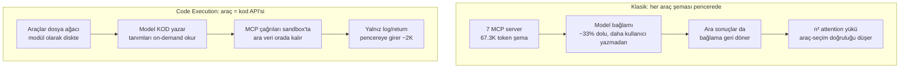
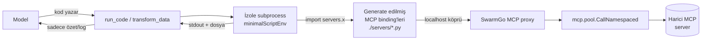
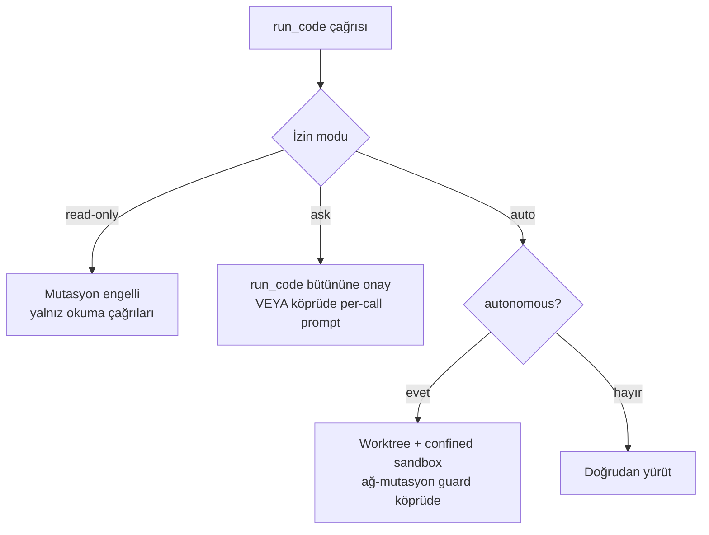
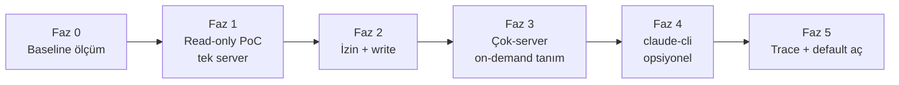
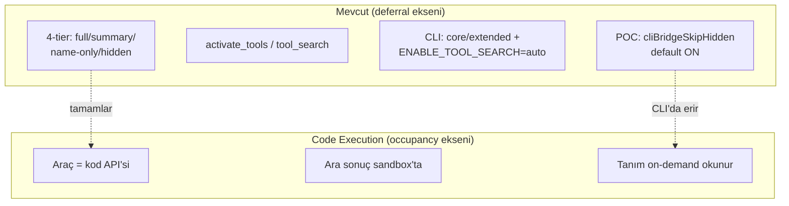

# 44 — Code Execution with MCP (Fizibilite + Faz Planı)

> **Durum:** Plan / fizibilite. Bu doküman kod üretmez; SwarmGo reposu üzerinde
> doğrulanmış mevcut durum + tasarım seçenekleri + fazlandırma içerir.
> **Tarih:** 2026-07-02 · **İlgili:** [17-TOKEN-OPTIMIZASYON](17-TOKEN-OPTIMIZASYON.md) ·
> [19-LAZY-TOOL-LOADING](19-LAZY-TOOL-LOADING.md) · [24-SELF-MANAGEMENT](24-SELF-MANAGEMENT.md) ·
> [25-SUBAGENT-ISOLATION](25-SUBAGENT-ISOLATION.md) · [38-SESSION-DEBUG](38-SESSION-DEBUG.md)

---

## 1. Problem & Motivasyon

Ajanlara çok sayıda araç (built-in + MCP source araçları) bağlanınca, **tüm araç
şemaları her turda modele gider**. Bu iki ayrı maliyet üretir; bunları karıştırmak
yanlış çözüm seçtirir:

| Boyut | Ne demek | Neyi etkiler |
|-------|----------|--------------|
| **Cost (maliyet)** | Token başına ödediğimiz para | Fatura |
| **Occupancy (pencere doluluğu)** | 200K bağlam penceresinin ne kadarının araç şemalarıyla dolduğu | Attention kalitesi + kalan çalışma alanı |

**Kritik ayrım:**

- **Prompt cache** → *cost*'u düşürür (cache-read ucuzdur) ama pencere **doluluğunu**
  ve attention yükünü **düşürmez**. Şema hâlâ pencerede, hâlâ modelin ilgi alanını
  n² ilişkiyle yoruyor.
- **Deferral / tier occupancy** (SwarmGo'nun mevcut 4-tier'i) → tier doluluğunu
  düşürür ama araç *gerektiğinde* tam şemayla pencereye girer.
- **Code execution with MCP** → araçları modele **hiç şema olarak vermez**. Araçları
  bir kod API'si gibi sunar; ara sonuçlar execution ortamında kalır, pencereye
  girmez. Bu, hem cost hem occupancy'yi aynı anda düşüren tek yaklaşım.

**Ölçek (Anthropic'in raporladığı):**

- 7 MCP server ≈ **67.300 token** — kullanıcı daha bir şey yazmadan, 200K pencerenin
  **~%33**'ü.
- Araç sayısı arttıkça araç-seçim doğruluğu **~3×** düşer (context-rot / n² attention).
- Code execution deseni: **150K → 2K token (~%98.7)** azaltım.
- Karşılaştırma: Tool Search Tool ~%85, Programmatic Tool Calling ~%37.



---

## 2. Desen Özeti — Code Execution with MCP

**Fikir:** MCP sunucularını modele *araç listesi* olarak sunmak yerine, bir **kod
API'si** (TypeScript/Python modül ağacı) olarak sun. Ajan, araç çağırmak için
JSON `tool_use` üretmez — **kod yazar**:

```python
# Model bunun gibi kod yazar; sandbox çalıştırır.
from servers.linear import list_issues
from servers.github import create_comment

issues = list_issues(team="ENG", state="open")   # 500 satır dönebilir
urgent = [i for i in issues if i.priority == 1]   # filtre SANDBOX'ta
for i in urgent[:3]:
    create_comment(i.id, "Bumping priority")       # sonuç pencereye girmez
print(f"{len(urgent)} urgent issue işlendi")        # SADECE bu döner
```

**Neden ~%98 kazanç:**

1. **Progressive disclosure** — Model tüm araç şemalarını görmez; yalnız kullandığı
   modülün tanımını *on-demand* okur (bir `search_tools` / dosya okuma adımıyla).
   Kullanılmayan 60 aracın şeması pencereye hiç girmez.
2. **Ara sonuçlar bağlamda kalmaz** — 500 satırlık `list_issues` çıktısı sandbox
   değişkeninde durur; modele yalnız `print` ile döndürülen özet girer. (SwarmGo'da
   `transform_data`'nın "data dosyada kalır, sadece log döner" davranışının aynısı.)
3. **Kontrol akışı kod tarafında** — döngü/filtre/koşul model turlarına değil,
   tek bir kod yürütmesine iner. Tur sayısı ve dolayısıyla tekrarlanan şema maliyeti
   düşer.

---

## 3. SwarmGo'ya Oturma Senaryoları

SwarmGo'nun iki yürütme yolu var; her biri için ayrı bir tasarım seçeneği ele
alınmalı. **İyi haber:** SwarmGo bu deseni kurmak için gereken parçaların
**çoğuna zaten sahip** — kod yürütme sandbox'ı (`transform_data`), fs araçları,
namespace'li MCP çağrı yolu, ve kod-dışı çağrı için `mcp.CallNamespaced`.

### Doğrulanmış mevcut zemin (repo üzerinden)

| Parça | Konum | Kod-execution için değeri |
|-------|-------|---------------------------|
| **`transform_data`** | `internal/tools/builtin_transform_data.go` | Zaten "modelin yazdığı script'i izole subprocess'te çalıştır, **data dosyada kalsın, yalnız stdout+path dönsün**" deseni. python3/node/bun; 30s timeout; 16KB log cap. Aranan desenin **prototipi**. |
| **Stripped env** | `internal/tools/transform_data_env.go` | `minimalScriptEnv()` — **allowlist** tabanlı; `ANTHROPIC_API_KEY` dahil hiçbir secret script'e geçmez. |
| **Shell (`Bash`/`PowerShell`)** | `internal/tools/builtin_shell.go` | RiskExec, `ShellEnabled` gate'i, 64KB cap, autonomous brake (`sb.Confined` → `git push` engeli). Genel kod yürütme kanalı. |
| **MCP çağrı yolu** | `internal/mcp/manager.go` (`CallNamespaced`, `NamespaceTool`, `nsSep="__"`) | `<server>__<tool>` namespace'i; kod API'sinin altına bağlanacak çağrı primitifi. |
| **MCP havuzu** | `internal/mcp/pool.go` (+ `client.go` stdio, `http.go` streamable) | Kalıcı bağlantı — kod içinden tekrarlı çağrılar yeni süreç açmaz. |
| **4-tier görünürlük** | `internal/tools/registry.go` (`VisibilityFull/Summary/NameOnly/Hidden`) | Kod moduyla birlikte yaşayacak; §8. |
| **Sandbox** | `internal/tools/sandbox.go` | `NewSandbox` (unconfined, izin katmanı sınır) / `NewConfinedSandbox` (config dizini). |
| **Worktree izolasyonu** | `internal/agent/worktree.go` (`ensureWorktree`) | Otonom turlarda per-session git worktree + branch (`swarmgo/session-<id>`). |
| **Ölçüm** | `internal/agent/debugjournal.go` + `GetTurnDebug` | `debug.jsonl` `llm_call` olayları (`in/out/cacheRead/cacheWrite`), `TurnID`. |

### Seçenek A — Native tool-loop için "MCP-as-code" (önerilen ana hat)

MCP araçlarını, sandbox'ın dosya sistemine yazılmış bir **kod API ağacı** olarak
sun. Ajana tek bir yürütme aracı (`transform_data`'nın genişletilmiş hâli ya da
`Bash`) ver; MCP çağrıları bu ortamdan bir **köprü** üzerinden yapılır.



**Nasıl kurulur (kavramsal):**

1. Tur başında SwarmGo, etkin MCP sunucularının araçlarını tarayıp sandbox
   çalışma dizinine bir **binding ağacı** yazar: `./servers/<server>/<tool>.py`
   (veya tek `servers.py`). Her binding, SwarmGo'da açılan bir **loopback köprüye**
   (kısa ömürlü localhost HTTP ya da named-pipe) çağrı yapan ince bir fonksiyon.
2. Köprü, gelen `(server, tool, args)` çağrısını `mcp.CallNamespaced` ile kalıcı
   havuz üzerinden gerçek MCP sunucusuna iletir; sonucu script'e döndürür.
3. Model, tanımları **on-demand** okur (bir `Grep`/`Read` ile `./servers/...`),
   sonra `run_code` ile kodu çalıştırır. Araç şemaları **pencereye hiç girmez.**

**Artı:**
- Anahtarsız değil, tam SwarmGo kontrolünde — çağrı `mcp.pool`'dan geçtiği için
  trace, izin, compaction, budget muhasebesi korunabilir.
- `transform_data`'nın secret-izolasyonu + timeout'u devralınır.
- Occupancy **ve** cost aynı anda düşer (deseninin tam kazancı).

**Eksi:**
- Loopback köprü + binding üretimi yeni bir alt-sistem (auth token, port yönetimi).
- Kod yürütmenin gözlemlenebilirliği düşer: bir `run_code` bloğu içinde N MCP
  çağrısı olur; her biri ayrı `tool_use` kartı olmadığından UI'da iz azalır (§7).
- İzin modeli tanesel (per-tool) çalışıyordu; kod içi çağrılar için izin **köprü
  seviyesinde** yeniden ele alınmalı (§4).

### Seçenek B — claude-cli yolu: yerleşik yeteneği devral

claude-cli'nin **kendi** code-execution / tool-search yeteneği var
(`ENABLE_TOOL_SEARCH=auto`, `internal/agent/climcp.go`). Burada iki alt-yol:

- **B1 — CLI'ya bırak:** MCP sunucularını `--mcp-config` ile CLI'a ver, CLI'ın
  kendi progressive-disclosure'ını (core/extended tier, `alwaysLoad`) kullan.
  Bu **zaten kısmen var**. Ek code-execution kazancı CLI sürümüne bağlı.
- **B2 — köprüde çöz:** Seçenek A'daki binding+loopback'i CLI için de kur; CLI'a
  yalnız tek bir `run_code` MCP aracı göster.

**Artı (B):** CLI zaten anahtarsız + kendi tool-search'ü olgun.
**Eksi (B):** CLI köprüsünde 4-tier "erir" (bkz. §8 / [19](19-LAZY-TOOL-LOADING.md)):
MCP'de araç çağrılabilmesi için tam şema `tools/list`'te olmalı, CLI allowlist'i
süreç başında sabit → **tur-içi activate yok**. Bu yüzden native yol (Seçenek A)
desenin tam kazancına daha uygun; CLI yolu için gerçekçi hedef B1'i olgunlaştırmak.

> **Karar önerisi:** Ana hat **Seçenek A (native)**. claude-cli için önce mevcut
> B1 (extended-tier deferral) yeterli sayılıp ölçülmeli; B2 ileri faza ertelenmeli.

---

## 4. Güvenlik / Sandbox

Kod yürütme = keyfi host kodu. SwarmGo'nun mevcut sınırları ve boşlukları:

| Katman | Mevcut durum | Kod-execution için not |
|--------|--------------|------------------------|
| **Secret izolasyonu** | `minimalScriptEnv()` allowlist — API key'ler script'e geçmez | ✅ Devral. Loopback köprünün auth token'ı da script env'ine **girmemeli** (köprü ayrı kanaldan doğrulamalı). |
| **Kaynak sınırı** | 30s timeout, 16KB log cap (`transform_data`) / 64KB (shell) | ✅ Devral; kod-modu için timeout ayarlanabilir yapılmalı. |
| **Path sınırı** | `Sandbox` default **unconfined** — izin katmanı (read-only/ask/auto) gerçek sınır | ⚠️ Kod içi fs erişimi izin modunu **atlar**; kod-modu için `NewConfinedSandbox` benzeri bir confine seçeneği düşünülmeli. |
| **Otonom fren** | `sb.Confined` + `isNetworkMutatingGit` → `git push` engeli; `autonomousConfine` | ⚠️ Kod içinden `git push` substring guard'ı **atlar** (kod shell'i doğrudan çağırabilir). Kod-modunda ağ-mutasyon guard'ı köprü/subprocess seviyesine taşınmalı. |
| **Worktree izolasyonu** | `ensureWorktree` per-session branch | ✅ Kod-modu otonom turlarda worktree içinde çalışmalı — dosya çakışması önlenir. |
| **İzin (permission)** | Native: per-tool RiskExec gate; CLI: `--permission-prompt-tool` | ⚠️ **En kritik boşluk:** kod bloğu tek `run_code` çağrısı → içindeki N MCP/fs/shell çağrısı ayrı ayrı onaylanmaz. İzin ya (a) `run_code`'un tamamına bir kez, ya (b) köprü seviyesinde per-call verilmeli. |



**Sonuç:** Sandbox ve secret-izolasyonu hazır; **izin taneselliği** ve **otonom
ağ-mutasyon guard'ının kod-moduna taşınması** çözülmesi gereken iki gerçek boşluk.

---

## 5. Fazlandırma

Her faz küçük, tek başına doğrulanabilir ve ölçülebilir kazanç üretir.

### Faz 0 — Ölçüm zemini (kod yok, sadece baseline)
- Mevcut senaryoda (ör. 3–7 MCP server etkin) tur-başı token profilini
  `debug.jsonl` / `turn-debug` ile kaydet: `in` (şema payı), `cacheRead`, `out`.
- **Kazanç metriği:** "araç şemalarının tur-başı input token payı" baseline'ı.

### Faz 1 — Read-only "MCP-as-code" PoC (tek server)
- Tek bir güvenli MCP server için binding ağacı üret (`./servers/<x>/*.py`) +
  loopback köprü (yalnız **read** araçları).
- Ajana `transform_data`'yı genişleten veya yeni `run_code` aracını ver.
- **Kazanç:** o server'ın araç şeması pencereden **tamamen çıkar**; tur-başı input
  token'da ölçülebilir düşüş. Doğrulama: aynı görev iki yolla (klasik vs kod)
  koşturulup `turn-debug` karşılaştırması.

### Faz 2 — İzin + mutasyon (write araçları)
- Köprüde per-call izin kancası; `ask` modunda kod içi mutasyon çağrıları
  SwarmGo onay UI'ına düşer. Otonom ağ-mutasyon guard'ı köprüye taşınır.
- **Kazanç:** güvenli write; per-call gözlemlenebilirlik geri kazanılır.

### Faz 3 — Çok-server + on-demand tanım okuma
- N server için binding; model tanımları `Grep`/`Read` ile keşfeder.
- **Kazanç:** occupancy'nin asıl düşüşü burada (7 server senaryosunda 67K → ~birkaç K).

### Faz 4 — claude-cli entegrasyonu (opsiyonel/ileri)
- B1'i olgunlaştır (extended-tier deferral ölçümü) veya B2 köprüsü.

### Faz 5 — Trace/observability + varsayılan aç
- `run_code` içi MCP çağrılarını trace'e ayrı olay olarak yaz; UI kartı.
- Ölçülen kazanç + kabul edilir gözlemlenebilirlikte tunable default'u aç.



---

## 6. Ölçüm Planı

**Kaynak:** `debug.jsonl` (`internal/agent/debugjournal.go`) + `GetTurnDebug` +
`GET /api/sessions/{id}/turn-debug?turn={replyMessageId}` (bkz. [38](38-SESSION-DEBUG.md)).

**Ölçülecek metrikler (tur-başı, öncesi/sonrası):**

| Metrik | Kaynak alan | Ne gösterir |
|--------|-------------|-------------|
| Input token (şema payı) | `llm_call.in` | Occupancy'nin doğrudan göstergesi |
| Cache-read token | `llm_call.cacheRead` | Cost tarafı (cache'lenen şema) |
| Output token | `llm_call.out` | Kod yazımının ek maliyeti |
| Tur sayısı | `turn` olayları | Kontrol akışı kod tarafına inince düşmeli |
| Tool latency/bytes | `byTool` rollup | Kod-modu tek kart vs N kart farkı |

**Test senaryoları:**
1. **Az araç (1–2 server):** kazanç küçük, regresyon olmamalı (kod yazım maliyeti
   şema tasarrufunu yememeli).
2. **Çok araç (5–7 server):** asıl hedef; 67K→birkaç K beklentisi.
3. **Çok-adımlı görev (filtre+döngü):** tur sayısı düşüşü.

**Yöntem:** Aynı görev tanımı, aynı model, iki mod (klasik tool-loop vs kod-modu);
`turn-debug` çıktıları yan yana. `SessionUsage.byKind` ile günlük toplam doğrulama.

---

## 7. Riskler & Açık Sorular

| Risk / Soru | Detay | Azaltım |
|-------------|-------|---------|
| **Gözlemlenebilirlik kaybı** | `run_code` içi N çağrı tek kart → UI'da iz azalır, debug zorlaşır | Köprü her MCP çağrısını trace'e ayrı olay yazsın (Faz 2/5) |
| **İzin taneselliği** | Kod bloğu izin modunu bir kerede geçer | Per-call köprü izni ya da `run_code` bütününe explicit onay |
| **Doğruluk maliyeti** | Model kod yazmakta JSON tool_use'dan daha çok hata yapabilir; sözdizimi/exception | Katı script kontratı + net hata dönüşü (`transform_data` gibi loud fail) |
| **Provider bağımlılığı** | Anthropic native tool-loop'ta kod-modu bizim; CLI'da CLI sürümüne bağlı | Native yol ana hat; CLI opsiyonel |
| **Sandbox güvenliği** | `transform_data` "güvenlik sandbox'ı değil, secret-izolasyon + kaynak sınırı" | Confine + worktree + otonom guard'ı kod-moduna taşı (§4) |
| **Binding güncelliği** | MCP server araçları değişince binding ağacı bayatlar | Binding'i tur başında yeniden üret (stateless) |
| **Küçük ölçekte net zarar** | 1–2 araçta kod-modu şema tasarrufundan pahalı olabilir | Eşik: yalnız araç sayısı N üstündeyken kod-modu (tunable) |

---

## 8. Mevcut Tier / POC ile İlişki

Bu desen mevcut 4-tier'in **rakibi değil, tamamlayıcısı** — farklı ekseni çözer:



- **4-tier + activate_tools** ([19](19-LAZY-TOOL-LOADING.md)): araç şemasını *tur
  içinde erteler* ama gerektiğinde tam şemayla pencereye sokar. Code-execution ise
  şemayı hiç sokmaz — tanım diskte, model okur. **Birlikte:** built-in'ler tier'de
  kalır (insan-etkileşimli, sık); *MCP source araçları* kod-API'sine iner.
- **`cliBridgeSkipHidden` POC** (default **ON**, `internal/tools/bridge_filter.go`
  + `clibridge_tunable.go`): hidden-tier self-management araçlarını CLI köprüsüne
  hiç vermez. Code-execution, aynı "şemayı süreçten tamamen uzak tut" felsefesinin
  MCP-source araçlarına genişletilmiş hâli.
- **Tool cache breakpoint** (system bloğuna bağlı, bağımsız değil): code-execution
  şema payını küçülttüğü için bu iyileştirmenin önemi de azalır.
- **`transform_data`** ([17](17-TOKEN-OPTIMIZASYON.md)): "data dosyada kalır, log
  döner" — code-execution deseninin **zaten çalışan çekirdeği**. Bu planın ana
  kaldıracı budur.

---

## 9. Özet & Önerilen İlk Faz

**Özet:** Code execution with MCP, SwarmGo'nun *occupancy* sorununu (mevcut tier
sistemi *deferral*'ı çözüyor ama şema gerektiğinde hâlâ pencereye giriyor) kökten
çözen tek yaklaşım. En büyük avantaj: SwarmGo, deseni kurmak için gereken parçaların
çoğuna **zaten sahip** — `transform_data`'nın izole-subprocess + secret-allowlist +
"data dosyada kalır" çekirdeği, `mcp.pool.CallNamespaced` çağrı yolu, worktree
izolasyonu ve `debug.jsonl` ölçüm altyapısı. Sıfırdan inşa değil; mevcut çekirdeği
MCP çağrılarına **köprüleyip genişletme** işi.

**İki gerçek boşluk:** (1) izin taneselliği (kod bloğu içi çağrılar), (2) otonom
ağ-mutasyon guard'ının kod-moduna taşınması.

**Önerilen ilk faz — Faz 0 + Faz 1:**
1. **Faz 0:** 3–7 MCP server'lı bir senaryoda tur-başı token profilini
   `turn-debug` ile kaydet — "araç şemasının input token payı" baseline'ı.
2. **Faz 1:** Tek, güvenli, **read-only** bir MCP server için binding ağacı +
   loopback köprü PoC'si; `transform_data`'yı kaldıraç al. Aynı görevi klasik ve
   kod-modu ile koştur, `turn-debug` karşılaştır.

Kazanç ölçülüp regresyon (küçük ölçekte net zarar) elenmeden write/otonom fazlara
geçilmemeli.

---

## Kaynaklar

- Anthropic — Code Execution with MCP: https://www.anthropic.com/engineering/code-execution-with-mcp
- Anthropic — Advanced Tool Use: https://www.anthropic.com/engineering/advanced-tool-use
- MCP Directory — Context Bloat Fix (2026): https://mcp.directory/blog/mcp-context-bloat-fix-2026-tool-search-code-mode-progressive-disclosure
- The New Stack — Reduce MCP Token Bloat: https://thenewstack.io/how-to-reduce-mcp-token-bloat/
