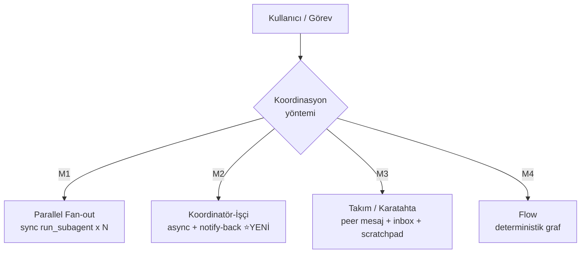
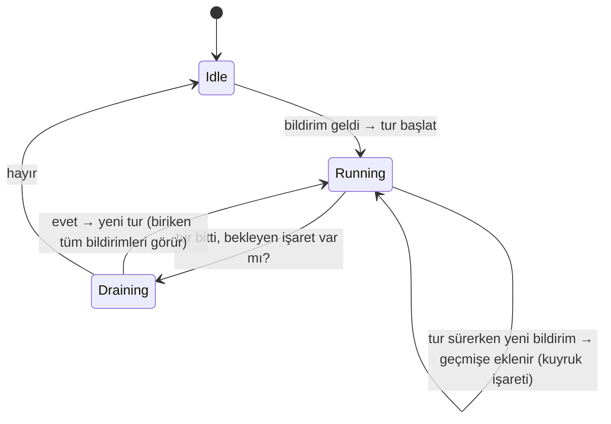

# 47 — Koordinatör & Çoklu-Ajan Koordinasyonu

> **Durum:** M2 TAM UYGULANDI ✅ (2026-07-03, F0–F5 + CLI köprüsü + ayar UI'si +
> M3 scratchpad + efemeral worker hedefi — bkz. §9 Uygulama Durumu). §1–§8 orijinal
> tasarım metnidir. **LLM-in-the-loop görsel deneme ✅ canlı doğrulandı (2026-07-03,
> bkz. §10)** — deneme sırasında bulunan non-stream CLI köprü boşluğu da düzeltildi.
> **Amaç:** TionSwarm'ya Claude Code'un "koordinatör modu"na denk bir çok-ajan
> koordinasyon katmanı eklemek — bir üst ajan (koordinatör) birden çok işçiyi
> (worker) paralel yönetir; ayrıca **birden fazla koordinasyon yöntemi**
> (parallel fan-out / koordinatör-işçi / takım-karatahta / flow) tek bir çatı
> altında seçilebilir olsun.

İlgili dokümanlar: `22-SPAWN-SESSION`, `28-PEER-MESAJLASMA`, `15-FLOW-CANVAS`,
`35-CONTEXT-RESET-HANDOFF`, `46-ETIKET-OTOMASYON`, `24-SELF-MANAGEMENT`.

---

## 1. Motivasyon

Claude Code'un koordinatör modu (`src/coordinator/coordinatorMode.ts`) şu deseni
uygular:

1. Koordinatör ajan, `Agent` aracıyla **async** işçiler başlatır (bloklamaz).
2. Bir işçinin turu bitince sonucu, koordinatörün oturumuna **user-rolünde bir
   `<task-notification>` mesajı** olarak enjekte edilir ve **yeni bir koordinatör
   turu tetiklenir**.
3. Koordinatör bulguları **kendisi sentezler**, işçileri `SendMessage` ile
   (yüklü bağlamlarıyla) devam ettirir veya yenisini spawn eder, `TaskStop` ile
   durdurur.
4. Fazlar: Araştırma (paralel işçiler) → Sentez (koordinatör) → Uygulama →
   Doğrulama.

TionSwarm bugün bu döngünün **çoğu parçasına sahip** ama "async işçi → koordinatöre
geri bildirim → koordinatör devam eder" halkası eksik.

### 1.1 TionSwarm'da bugün ne var (yeniden kullanılacak)

| Yetenek | Kod | Not |
|--------|-----|-----|
| Paralel sync fan-out | `agent/subagent.go: launchParallelSubagents` | goroutine + WaitGroup + atomik ortak bütçe. Tek turda N `run_subagent`. |
| Async detached spawn | `agent/spawn.go: SpawnSession`/`runSpawn` | fire-and-forget; `ParentSessionID`/`CreatedBy` kaydı; biten turda `FireTurnFinished`. |
| **Mevcut oturuma mesaj enjekte + history-aware tur** | `agent/agentmsg.go: runSessionTurn` → `api/wake_turn.go: wakeTurnRunner` | **Kilit mekanizma.** Scheduler wake + inbox teslimi bunu kullanır. |
| Tur-bitti kancası | `agent/runtime.go: FireTurnFinished` → `agent/automation.go: OnTurnFinished` | detached goroutine; chat/spawn/schedule/wake yollarından çağrılır. |
| Peer mesaj + inbox | `agent/agentmsg.go: DeliverAgentMessage`/`deliverOne`/`runInboxDelivery` | `<agent_message from=…>` Claude-Code tarzı etiket + broadcast. **Generic participant modeli (2026-07-06):** inbox mesajı `Role="user"` (recipient turunu sürer) ama katılımcı alanları gönderen ajana damgalanır — `AuthorKind=agent`, `AuthorID=fromAgentID`, `RecipientID=target.ID` — böylece roster + `labelMultiAgentHistory` mesajı `[Ada → Kai (you)]` diye **doğru atfeder** (insan "user" değil). `formatAgentMessage` wrapper'ı insan-görünümü + summary için korunur (bkz. `_Docs/07`). Test: `sendmessage_test.go`. |
| Delegasyon guard'ları | `agent/subagent.go: delegState` (depth/visited/calls) | döngü/derinlik/bütçe koruması. |
| Flow paralel node | `orchestration/engine.go` | deterministik fan-out (LLM koordinatörsüz). |

### 1.2 Eksik olan / riskli olan

1. **Async worker → koordinatör geri bildirimi yok.** Bugün `wait:async`
   ayrı bağımsız bir oturum açar; sonuç orada kalır, koordinatörün oturumuna
   dönmez. `FireTurnFinished` yalnızca **yeni** bir oturum spawn edebiliyor
   (automation), var olan koordinatör oturumuna besleme yapamıyor.
2. **Aynı oturumda eşzamanlı tur koruması YOK.** `activeSessions` (sync.Map,
   `trackSession`/`untrackSession`) yalnız UI "çalışıyor" göstergesi — **kilit
   değil**. 4 işçi aynı anda bitip koordinatöre `<task-notification>` yazıp tur
   tetiklerse: iç içe geçmiş mesajlar + çift tur = yarış. **Per-session tur
   kuyruğu şart.**
3. Koordinatör-farkında sistem promptu / işçi araç kısıtı yok.
4. Koordinatör/işçi ilişkisini modelleyen alanlar yok (`ParentSessionID` handoff
   için kullanılıyor, anlamı "devamı" — worker "tarafından-spawn-edildi" farklı).

---

## 2. Koordinasyon Yöntemleri (seçilebilir "methods")

Kullanıcı isteği: *"farklı agent koordinasyon methodlarını da kullanabilecek
şekilde"*. Dört yöntemi tek çatı altında topluyoruz. Üçü zaten var; asıl yeni
inşa **M2**.



| Yöntem | Ne zaman | Durum |
|--------|----------|-------|
| **M1 — Parallel fan-out (sync)** | Kısa, bağımsız alt-görevler; koordinatör hepsini aynı turda toplamak istiyor (araştırma taraması). | ✅ VAR (`run_subagent` ×N). Belgelenip "method 1" olarak sunulacak. |
| **M2 — Koordinatör-İşçi (async notify-back)** | Uzun/çok-fazlı iş; koordinatör turlar boyunca canlı kalıp fan-out + sentez + doğrulama yapmalı. | ⭐ **YENİ inşa.** Claude Code modeli. |
| **M3 — Takım / Karatahta (peer)** | Eşdüzey ajanlar birbirine mesaj atarak işbirliği; merkezi koordinatör yok. | ✅ VAR (`DeliverAgentMessage`/inbox/broadcast) + ortak **scratchpad** eklenecek. |
| **M4 — Flow (deterministik)** | LLM koordinatörü değil, sabit graf: paralel node + branch. | ✅ VAR (`orchestration`). Belgelenecek. |

Bu doküman ağırlıklı olarak **M2**'yi tasarlar; M1/M3/M4 mevcut ve "yöntem"
kavramı altında birleştirilir.

---

## 3. M2 — Koordinatör/İşçi Mimarisi

### 3.1 Akış

```mermaid
sequenceDiagram
    participant U as Kullanıcı
    participant C as Koordinatör oturumu
    participant K as CoordinationEngine
    participant Q as Per-session tur kuyruğu (C)
    participant W1 as Worker 1
    participant W2 as Worker 2

    U->>C: Görev
    C->>C: spawn_worker (async) x2
    Note over C: Tur biter, koordinatör "beklemede"
    C-->>W1: SpawnSession (CoordinatorSessionID=C)
    C-->>W2: SpawnSession (CoordinatorSessionID=C)
    W1->>K: turn finished (FireTurnFinished)
    W2->>K: turn finished
    K->>Q: NotifyCoordinator(<task-notification W1>)
    K->>Q: NotifyCoordinator(<task-notification W2>)
    Note over Q: C meşgulse kuyruğa al; boşalınca<br/>bekleyen TÜM bildirimleri TEK turda birleştir
    Q->>C: user msg = task-notification(W1)+(W2) → runSessionTurn
    C->>C: Sentez; gerekirse send_to_worker / yeni spawn_worker
    C->>U: Ara özet
```

### 3.2 Yeni araçlar (self-management "coordination" ailesi)

Koordinatör oturumundaki ajana açılır (worker oturumlarında gizli — recursion
guard):

| Araç | Karşılığı (Claude Code) | Davranış |
|------|-------------------------|----------|
| `spawn_worker` | `Agent` (async) | Yeni worker oturumu aç: `Kind="worker"`, `CoordinatorSessionID=<caller session>`, `CreatedBy=<caller agent>`. Hemen worker id döner; tur arka planda koşar (`SpawnSession` yeniden kullanılır + yeni opts). Tek turda çoklu çağrı = paralel. |
| `send_to_worker` | `SendMessage` (continue) | Var olan worker oturumuna mesaj ekle + turunu çalıştır (`runSessionTurn`/wake mekanizması). Yüklü bağlamı korur. |
| `stop_worker` | `TaskStop` | Çalışan worker turunu iptal et (context cancel). Kuyruktaki bekleyeni de düşürür. |
| `list_workers` | `TaskList` | Bu koordinatörün worker'ları + durumları (running/done/failed). |

> **Not:** M2 araçları, mevcut `run_subagent` (M1) ve `send_message` (M3) ile
> **birlikte** yaşar; koordinatör ajan görev tipine göre birini seçer.

### 3.3 Geri bildirim: `<task-notification>` formatı

Claude Code ile birebir uyumlu (worker sonucu koordinatöre user-rolünde gelir):

```xml
<task-notification>
<task-id>{workerSessionID}</task-id>
<status>completed|failed|killed</status>
<summary>{kısa özet}</summary>
<result>{worker'ın son yanıt metni}</result>
<usage><total_tokens>N</total_tokens><tool_uses>N</tool_uses><duration_ms>N</duration_ms></usage>
</task-notification>
```

Koordinatör sistem promptu bunun bir "kullanıcı mesajı gibi görünen ama
konuşma partneri olmayan iç sinyal" olduğunu öğretir (Claude Code'daki gibi:
"never thank or acknowledge them").

### 3.4 Kilit yeni bileşen: `CoordinationEngine` + per-session tur kuyruğu

Yeni dosya `internal/agent/coordination.go`:

```go
// CoordinationEngine, bir worker turu bittiğinde (FireTurnFinished) devreye
// girer: worker'ın CoordinatorSessionID'si varsa <task-notification> üretir ve
// koordinatör oturumuna enjekte edip tur tetikler — per-session kuyruk üzerinden.
type CoordinationEngine struct { db *db.DB; rt *Runtime; logger *slog.Logger }

func (e *CoordinationEngine) OnWorkerFinished(ctx, tf TurnFinished) {
    sess := e.db.GetSession(tf.SessionID)
    if sess.CoordinatorSessionID == "" { return }   // worker değil → çık
    note := formatTaskNotification(sess, tf.Output, "completed", usage)
    e.rt.NotifyCoordinator(sess.CoordinatorSessionID, note)
}
```

`Runtime.NotifyCoordinator(coordID, note)`:
1. `<task-notification>` mesajını koordinatör oturumuna **user** rolüyle
   `AddMessage` eder (Origin="worker-note" → UI "🤖 İşçi bildirimi" olarak
   render eder, kullanıcı balonu değil).
2. **Per-session tur kuyruğuna** bir "tur talebi" bırakır.

**Per-session tur kuyruğu** (`Runtime.sessionTurnQueue`): oturum başına tek bir
sıralayıcı. Amaç: (a) aynı oturumda iki tur ASLA eşzamanlı koşmaz; (b) koordinatör
meşgulken biriken **birden çok bildirim TEK sonraki turda birleşir** (4 worker
biterse 4 ayrı tur değil, hepsini gören 1 tur). Inbox'ın "history-aware tur"
mantığıyla aynı: tur çalışınca son user mesajları (tüm bekleyen bildirimler)
zaten geçmişte olur.



Uygulama seçeneği: oturum başına `struct{ mu sync.Mutex; pending atomic.Bool }`
veya oturum başına bir goroutine + buffered channel. **Tercih:** keyed-lock +
pending-flag (basit, kilitsiz drenaj). `sync.Map[sessionID]*coordSlot`.

### 3.5 Session modeli değişiklikleri

`internal/db/models.go` (`Session`):

```go
CoordinatorSessionID string   // worker → onu spawn eden koordinatör oturumu ("" = normal)
Role                 string   // "coordinator" | "worker" | "" (normal)
```

- `ParentSessionID`'yi **kirletmiyoruz** (o handoff "devamı" anlamında).
- `Kind="worker"` de eklenir (mevcut `spawned`/`inbox`/`scheduled` yanına).
- Worker → koordinatör bağı `CoordinatorSessionID` üzerinden; `list_workers` bunu
  sorgular.

### 3.6 Guard'lar (recursion/storm/loop)

| Risk | Önlem |
|------|-------|
| Worker kendi worker'ını spawn eder (sonsuz ağaç) | Worker oturumlarında `spawn_worker`/`send_to_worker` **gizli** (Role=worker → coordination araçları kapalı). + mevcut `delegState.depth`. |
| Spawn fırtınası | Mevcut `SpawnMaxConcurrent` slot + yeni `CoordinatorMaxWorkers` (koordinatör başına aktif worker). |
| Sonsuz notify döngüsü | Koordinatör turu sayacı `CoordinatorMaxTurns` (vars. ~50, automation MaxIterations gibi); aşılınca notify enjeksiyonu durur, kullanıcıya uyarı. |
| Koordinatör oturumu kapanınca kaçak worker | Oturum silme/arşivde `stop_worker` hepsine (cascade cancel). |
| Aynı oturumda çift tur | §3.4 per-session kuyruk. |

---

## 4. Koordinatör Sistem Promptu / Skill

Yeni gömülü skill `tionswarm-coordinator` (`internal/skills/defaults/`), Claude
Code'un `getCoordinatorSystemPrompt()`'undan uyarlanır (Türkçe doküman / İngilizce
prompt kuralına göre prompt İngilizce):

- Rolün = koordinatör; her mesajın kullanıcıya; worker bildirimleri iç sinyal,
  onlara teşekkür etme.
- Paralellik senin süper gücün: bağımsız worker'ları tek mesajda fan-out et.
- **Sentezi SEN yap** — "based on your findings" YASAK; dosya:satır içeren
  spesifik spec yaz.
- Continue-vs-spawn karar tablosu (bağlam örtüşmesi yüksek→continue,
  düşük→fresh).
- Fazlar: Araştırma(paralel)→Sentez(sen)→Uygulama(dosya-seti başına tek)→Doğrulama.
- Gerçek doğrulama: özelliği açıp test et, rubber-stamp etme.

Prompt yalnız `Session.Role=="coordinator"` iken enjekte edilir (workspace prompt
kompozisyonuna koşullu blok — `composeTurnRequest`).

İşçi profilleri: mevcut `explore`/`coder`/`reviewer` (subagent.go) yeniden
kullanılır; koordinatör bunları `spawn_worker(target=...)` ile hedefler ya da
gerçek workspace ajanı adı verir.

---

## 5. UI

- **Koordinasyon paneli** (yeni): koordinatör oturumu açıkken sağda worker
  kartları — ad, durum (⏳running / ✅done / ❌failed), süre, token, son özet;
  karta tık → worker transkripti (executions feed'e deep-link, zaten var).
- Composer'da **koordinasyon yöntemi rozeti** (M1–M4 seçimi; M2 için "Koordinatör"
  toggle → oturum `Role=coordinator` olur, prompt+araçlar açılır).
- SSE: mevcut `spawned`/`chat` event'lerine `worker`-tipli event (status geçişi)
  eklenir → panel canlı güncellenir. Backend `emitSpawnEvent` deseni kopyalanır.

---

## 6. Fazlama

| Faz | Kapsam | Dosyalar |
|-----|--------|----------|
| **F0** | Bu tasarım dokümanı + koordinatör skill taslağı | `_Docs/47`, `skills/defaults/tionswarm-coordinator` |
| **F1** | Çekirdek backend: session alanları + `NotifyCoordinator` + per-session tur kuyruğu + `CoordinationEngine.OnWorkerFinished` (workspace manager'a `SetTurnHook` zincirine ekle) | `db/models.go`, `agent/coordination.go`, `agent/runtime.go`, `workspace/manager.go` |
| **F2** | Araçlar: `spawn_worker`/`send_to_worker`/`stop_worker`/`list_workers` + worker araç kısıtı + guard'lar (`CoordinatorMaxWorkers`/`MaxTurns`) | `tools/builtin_coordination.go`, `agent/subagent.go`, `agent/tunables.go` |
| **F3** | Koordinatör sistem promptu (koşullu enjeksiyon) + `tionswarm-coordinator` skill | `agent/prompts*`, `api/*compose*`, `skills/defaults/` |
| **F4** | UI: koordinasyon paneli + yöntem seçici + `worker` SSE event | `frontend/src/components/`, `agent/coordination.go` (emit) |
| **F5** | M3 ortak scratchpad + M1/M4 birleşik "yöntem" belgeleme + testler + doküman güncelleme | `_Docs/28`,`15`,`47`, `*_test.go`, `SKILL.md` |

### 6.1 F1 için en kritik teknik detay

`FireTurnFinished` bugün **tek** hook'a gidiyor (`AutomationEngine.OnTurnFinished`,
`manager.go:245`). İki tüketici gerekiyor (automation + coordination). Çözüm:
`SetTurnHook`'u **çoklu-hook** yap (hook listesi) ya da manager'da tek bir
"dispatcher" hook kur; o hem `AutomationEngine.OnTurnFinished` hem
`CoordinationEngine.OnWorkerFinished` çağırsın. Basit ve geriye uyumlu:
`manager.go`'da bir kompozit fonksiyon.

---

## 7. Kabul Kriterleri (M2)

1. Koordinatör oturumunda `spawn_worker` ×3 (tek tur) → 3 worker paralel koşar,
   koordinatör turu **bloklanmadan** biter.
2. Worker'lar bitince koordinatör oturumuna `<task-notification>` düşer ve **tek**
   yeni koordinatör turu (hepsini gören) otomatik başlar.
3. İki worker aynı anda bitse bile koordinatörde **çift tur olmaz** (kuyruk).
4. `send_to_worker` biten worker'ı yüklü bağlamıyla devam ettirir; `stop_worker`
   çalışanı iptal eder.
5. Worker oturumu `spawn_worker` göremez (recursion engellendi).
6. `CoordinatorMaxTurns` aşılınca notify döngüsü durur + kullanıcı bilgilendirilir.
7. M1 (`run_subagent` sync) ve M3 (`send_message`/inbox) davranışları **değişmez**.

---

## 8. Açık Kararlar (ÇÖZÜLDÜ — kararlar §9'da)

1. **Kapsam:** F0–F5'in tamamı mı, yoksa önce yalnız F1+F2 (çalışan çekirdek M2,
   UI'sız) mı? (Öneri: F1+F2+F3'ü ilk PR, F4 UI ikinci PR.)
2. **`Role` alanı mı, yalnız `CoordinatorSessionID` mi?** (Öneri: ikisi de — Role
   prompt/araç koşulu, CoordinatorSessionID bağ.)
3. **Kuyruk uygulaması:** keyed-lock+flag (basit) vs per-session goroutine
   (temiz ama daha çok makine). (Öneri: keyed-lock+flag.)
4. **M3 scratchpad** bu turda mı yoksa sonraya mı? (Öneri: F5, opsiyonel.)

---

## 9. Uygulama Durumu (2026-07-03)

**Karar:** F0–F5 tamamı; hem `Role` hem `CoordinatorSessionID`; kuyruk =
keyed-lock+flag; M3 scratchpad ertelendi.

### Ne yapıldı (F1–F4 + test)

- **Session modeli** (`db/models.go`): `Role` + `CoordinatorSessionID`; worker
  spawn'ları `Kind="worker"`.
- **Çoklu turn-hook** (`agent/runtime.go`): `turnHook` → `turnHooks []` +
  `AddTurnHook`/`SetTurnHook` (mutex); `FireTurnFinished` her hook'u ayrı
  goroutine'de çağırır. (Automation hâlâ `SetTurnHook` kullanır.)
- **Koordinasyon çekirdeği** (`agent/coordination.go`, YENİ): `coordSlot`
  (per-session kuyruk `running`/`pending`/`turns`/`workers`) +
  `enqueueCoordinatorTurn`/`drainCoordinator` (serileştirme + coalescing) +
  `NotifyCoordinator` (`<task-notification>` `Origin="worker-note"`) +
  `SpawnWorker`/`SendToWorker`/`StopWorker`/`ListWorkers` + `runWorker`
  (history-aware; completed/failed/killed HER durumda notify) + `workerCancels` +
  `formatTaskNotification`/`countToolSteps`.
- **Araçlar** (`tools/builtin_coordination.go`, YENİ): `spawn_worker`/
  `send_to_worker`/`stop_worker`/`list_workers`; context-injection
  (`WithCoordination`) ile YALNIZ koordinatör oturumunda kayıtlı (recursion
  engeli). Wiring: `toolloop.go withCoordination` + `toolsetup.go` koşullu kayıt.
- **Prompt/skill** (F3): `api/coordinator_prompt.go` (`composeTurnRequest`'te
  `Role=="coordinator"` iken enjekte → wake yolunu da kapsar) + gömülü default
  skill `tionswarm-coordinator`.
- **Guard'lar** (`agent/tunables.go`): `CoordinatorMaxWorkers` (8) +
  `CoordinatorMaxTurns` (50) + `SetCoordinatorLimits`.
- **API** (F4): `session_info`'ya `role`+`coordinatorSessionId`; yeni
  `PUT /api/sessions/{id}/role` + `GET /api/sessions/{id}/workers`.
- **UI** (F4): `CoordinatorSection.tsx` (aç/kapa + canlı worker roster, running
  varken 3sn poll) SessionDetailPanel'de; roster **Çalışan/Tamamlanan iki sekme**
  (sayaçlı, `localStorage` ile kalıcı) + tüm listeyi katla/aç toggle;
  `worker`+`coordination` SSE tipleri `eventViews`'te executions'a bağlı.
  Oturum listesinde (`SessionsSidebar.tsx`) Aktif/Arşiv yanında **Workers sekmesi**
  (`role==='worker'` filtresi, sayaçlı); Aktif görünüm worker oturumlarını hariç
  tutar. `Session` tipi `role`+`coordinatorSessionId` taşır (liste `db.Session`'ı
  ham döndürür).
- **Test** (`agent/coordination_test.go`): kuyruk serileştirme+coalescing (kritik
  yarış), worker cap, coordinator-link, notification format, countToolSteps.
  **Tüm paket testleri (221) geçiyor.**

### Tasarımdan sapma (bilinçli)

§3.4'teki ayrı `CoordinationEngine` **turn-hook** yerine geri bildirim `runWorker`
içinden **doğrudan** (`NotifyCoordinator`) yapılır. Sebep: `runSpawn` başarısız
turda `FireTurnFinished` çağırmıyor → hook yolu worker hatalarını iletemezdi.
Explicit-notify başarı/başarısız/killed'ı kesin statüyle iletir, çift-tetiği eler.
`AddTurnHook` altyapısı ileride başka gözlemciler için yine de eklendi.

### İkinci tur — kalan adımların tamamı yapıldı ✅ (2026-07-03)

- **CLI köprüsü ✅:** koordinasyon araçları `BridgeTools`'a eklendi
  (`runtime.go`) — koordinatör oturumunda `coordinationBridgeDefs()` advertise
  edilir, dispatch `dispatchCoordinationBridge` ile koordinasyon runner'ı üzerinden
  (reg dışı). `autonomous_interaction.go` ctx'i `WithSessionID` ile stampliyor →
  claude-cli koordinatör de worker sürebilir. Bridge defs zaten allowlist'e
  (`splitInteractionTiers`) giriyor.
- **Ayar UI'si ✅:** `settings.CoordinatorMaxWorkers`/`CoordinatorMaxTurns` (ana +
  maskeli + patch struct'ları), `store.go` applyInt + clamp (worker 1–64, tur
  1–500), `server.go applySettings` → `SetCoordinatorLimits`. Frontend:
  `AppToolsPanel` "Koordinatör (çoklu-ajan) limitleri" + `types/settings.ts` +
  `SettingsPanel` patch. Canlı doğrulandı (8/50 default → 5/42 patch).
- **M3 ortak scratchpad ✅:** koordinatör + tüm worker'ları için ORTAK dizin
  (`<SessionDir(coordID)>/scratchpad`), `coordinationScratchpadBlock`
  (`coordinator_prompt.go`) ile context'e enjekte (`composeTurnRequest`);
  normal dosya araçlarıyla okunur/yazılır (koordinatör + worker aynı mutlak yolda).
- **spawn_worker efemeral hedef ✅:** profil (explore/coder/reviewer) hedefi
  `resolveWorkerTarget` ile kalıcı, yeniden-kullanılabilir `worker:<profile>`
  ajanına materyalize edilir (base ajandan provider/model/permission klonlanır,
  `profileWorkerMu` ile dup önlenir). Test: `TestSpawnWorkerMaterializesProfile`.
- **Canlı doğrulama ✅:** backend booted; API smoke (rol set/get, `/workers`,
  ayar round-trip) uçtan uca geçti. `go build ./...` + **624 test** + `tsc` yeşil.
- ~~**Kalan (opsiyonel):** LLM-in-the-loop görsel deneme~~ → ✅ yapıldı, bkz. §10.

---

## 10. LLM-in-the-loop Canlı Görsel Deneme ✅ (2026-07-03)

Gerçek modelle (claude-cli / opus, ajan "Manager", WS5) koordinatör oturumu
açılıp uçtan uca izlendi. **Sonuç: M2 döngüsü canlıda çalışıyor** — ayrıca deneme
sırasında bir köprü boşluğu bulunup düzeltildi.

### Doğrulanan akış (SES104)

1. UI composer'dan görev: "Spawn 2 workers in parallel … synthesize yourself".
2. İlk denemede model M1'i (`run_subagent` ×2, sync) seçti — meşru bir seçim
   (prompt her iki yolu da sunuyor). Async'i zorlayan takip mesajıyla M2 tetiklendi.
3. `spawn_worker` ×2 **tek turda** → `worker:explore` profili efemeral ajana
   materyalize edildi (AGT25), SES105+SES106 paralel koştu; koordinatör turu
   **19 sn'de bloklanmadan** bitti (kabul kriteri #1 ✅).
4. UI ▸ SessionDetailPanel ▸ Koordinasyon roster'ı **canlı doldu**: 2 kart
   "ÇALIŞIYOR" → bitişte 3 sn poll içinde "BITTI" + özet metni (kriter roster ✅).
5. Worker'lar ayrık bitti (22:08:47 / 22:09:23): her `<task-notification>`
   (Origin=worker-note, UI'da işçi bildirimi olarak) koordinatöre düştü ve
   **otomatik tur** tetiklendi; ilk turda koordinatör doğru şekilde "SES105'i
   bekliyorum" deyip turu kapattı, ikinci bildirimde sentezi yazdı (kriter #2 ✅,
   çift tur yok #3 ✅). (Yakın bitişte tek-tur coalescing bu denemede
   gözlenmedi — birim testi `coordination_test.go` kapsıyor.)

Görseller + API çıktısı: `_Docs/gorseller/coord-02-before-ses104.png` (öncesi),
`coord-03-workers-running.png` (roster canlı), `coord-04-workers-done.png`
(BITTI kartları), `coord-05-synthesis-chat.png` (bildirimler + sentez),
`coord-workers-api-output.json` (`GET /api/sessions/SES104/workers`).

### Bulunan ve düzeltilen boşluk: non-stream CLI turunda köprü yok

İlk deneme `POST /api/chat` (non-stream) ile yapılmıştı ve koordinatör TionSwarm'nun
`spawn_worker`'ı yerine **claude-cli'nin kendi `Agent` aracını** kullandı: worker
roster hiç dolmadı, log `cli mcp config written … interaction=false` gösterdi.

- **Kök neden:** Interaction MCP endpoint'ini yalnız `/api/chat/stream` kendisi
  kuruyordu; `toolloop.go`'daki on-demand kurulum ise `autonomous &&` koşuluyla
  sınırlıydı. Non-stream `/api/chat` + claude-cli ikisine de girmiyordu →
  köprü araçları (spawn_worker dahil) advertise edilmedi **ve** CLI'nin native
  `Agent`/`Task` araçları disallow edilmedi (shadowing).
- **Düzeltme:** `internal/agent/toolloop.go` — on-demand headless Interaction
  kurulumundaki `autonomous` şartı kaldırıldı: endpoint'siz **her** CLI turu
  (scheduler/spawn/flow + non-stream chat) `autoInteract` ile sarılır; stream
  yolu kendi endpoint'ini kurduğundan (inter.URL != "") etkilenmez.
  `go build ./...` + agent/tools 296 test yeşil.

### UI: task-notification'a özel kart render'ı (2026-07-04)

`<task-notification>` enjeksiyonları eskiden genel "Otomatik devam" notu olarak
ham XML'iyle basılıyordu (okunmaz bir blok). Artık `Origin=worker-note` mesajlar
kendi bileşeniyle çiziliyor: **`frontend/src/components/chat/TaskNotificationNote.tsx`**
(MessageList'te worker-note dalı). Kart; worker ajan adı + oturum id + durum
rozeti (tamamlandı/başarısız/durduruldu), araç sayısı + süre satırı ve
**varsayılan katlı** result gövdesi (tıklayınca açılır) gösterir. Parse
edilemeyen eski/yabancı formatlar ham metniyle katlı gösterilir — hiçbir şey
sessizce gizlenmez. DB'deki mesaj metni değişmez; salt görüntüleme. Görsel:
`_Docs/gorseller/coord-06-notification-card.png`. `npx tsc --noEmit` temiz.

### Canlı coalescing testi ✅ (2026-07-04)

SES104'e tek turda 3 hızlı worker açtırıldı (`worker:explore`, görev: tek kelime
yanıt — ALPHA/BETA/GAMMA, araçsız). Zaman çizelgesi (session.jsonl, epoch sn):

| t | Olay |
|---|---|
| 524 | user: test prompt'u (stream turu başlar) |
| 535 | worker-note **SES111** (ALPHA) → otomatik tur 1 başlar |
| 536 | worker-note **SES113** (GAMMA) → tur 1 çalışıyor → `pending=true` |
| 537 | stream turunun assistant yanıtı persist edilir ("üç worker başlatıldı") |
| 537 | worker-note **SES112** (BETA) → hâlâ `pending=true` (coalesce) |
| 564 | otomatik tur 1 yanıtı: yalnız ALPHA'yı gördü, "diğerlerini bekliyorum" |
| 588 | otomatik tur 2 yanıtı: **3/3 sentez tablosu** |

**Sonuç: 3 bildirim → 2 otomatik tur.** SES113+SES112 tek ek turda birleşti —
`coordSlot` coalescing'i canlıda doğrulandı (birim testin yanına saha kanıtı).
Tur 1'in yalnız ALPHA görmesi tasarım gereği: history anlık görüntüsü tur
başında alınır; sonradan gelenler pending'i işaretler.

### Bulgu: stream turu ile koordinatör oto-turu AYRI kilitte → DÜZELTİLDİ ✅

Aynı testte yarış canlı gözlendi: worker-note'lar (t=535/536) stream turunun
kendi yanıtından (t=537) ÖNCE history'ye düştü ve **oto-tur 1, stream turu hâlâ
çalışırken başladı**. Kod teyidi:

- `handleChatStream` (`api/chat_stream.go`) turu doğrudan koşar — `coordSlot`'a
  bakmaz, `trackSession` çağırmaz; `wake_turn.go`'da da oturum kilidi yok.
- `drainCoordinator` yalnız OTO turları serileştirir; `isSessionActive`
  kontrolü yapmaz.
- Yani kullanıcı stream'den yazarken oto-tur (veya tersi) aynı oturumda
  **paralel** koşabilirdi: history append'leri DB'de serileşir ama iki LLM turu
  birbirinin ara mesajlarını görmeden yanıt üretebilirdi (karışık sıra, mükerrer
  tepki riski).

**Düzeltme (2026-07-04, seçenek a+b birlikte):** koordinatör oturumunda "tek
oturumda tek tur" garantisi.

- `agent/coordination.go` — **`BeginCoordinatorUserTurn(sessionID) func()`**:
  interaktif tur coordSlot'u `running` olarak sahiplenir; çalışan oto-tur varsa
  `sync.Cond` ile bitmesini bekler (oto-tur `spawnTimeout` ile sınırlı → bekleme
  sınırlı). Tur sırasında gelen worker bildirimleri `enqueueCoordinatorTurn`'da
  `running=true` gördüğü için `pending`'e düşer; release'te pending varsa **tek**
  coalesced oto-tur tetiklenir. Kullanıcı turu ayrıca `turns`/`capWarn`'ı
  sıfırlar (insan döngüye girdi → cap sonrası oto-turlar yeniden açılır; uyarı
  mesajındaki "manuel mesajla devam" vaadi artık gerçekten cap'i resetler).
  `drainCoordinator`'ın iki çıkışı da `signalFree()` (Broadcast) yapar.
- `api/chat_stream.go` + `api/chat.go` — session yüklendikten hemen sonra
  `Role=="coordinator"` ise `BeginCoordinatorUserTurn` + `defer release()`.
- Testler: `TestUserTurnBlocksAutoTurnsAndDrainsPending` +
  `TestUserTurnWaitsForAutoTurnAndResetsCap` (`coordination_test.go`).
  `go build ./...` + **653 test / 34 paket** yeşil.
- **Otonom yollar da kapsandı (2026-07-04):**
  `claimTurnSlotIfCoordinator(ctx, sessionID)` (coordination.go) — oturum
  koordinatörse slotu claim eder (değilse no-op release döner). İç mekanizma
  `claimCoordinatorSlot(id, resetCap)` olarak ortaklandı: kullanıcı turu
  `resetCap=true` (insan döngüde → cap reset), otonom yollar `resetCap=false`
  (cap korunur — periyodik wake, notify-loop korumasını deldirmesin).
  Takılan yerler: **wake** (`scheduler.go` deliverWake — sc.SessionID
  koordinatör olabilir), **scheduled prompt** (`scheduler.go` deliverPrompt —
  schedule kind oturumuna rol verilmiş olabilir), **inbox** (`agentmsg.go`
  runInboxDelivery). Test: `TestClaimTurnSlotIfCoordinator`. Kapsam dışı kalan
  tek yol: `flow.go` (flow-run oturumları koordinatör olarak kullanılmıyor).

---

## 11. Workflow Desenleri (skill'e eklendi, 2026-07-14)

Anthropic'in "dynamic workflows" altı orkestrasyon deseni (Fanout-And-Synthesize,
Adversarial Verification, Loop Until Done, Classify-And-Act, Generate-And-Filter,
Tournament) `tionswarm-coordinator` skill'ine **§4 "Workflow desenleri"** olarak
eklendi. Bunlar yeni araç değil, M1–M4 mekanikleri üstünde koşan **stratejiler**:

- **Doğrudan M2 eşleşmesi (✅ mekanik):** Fanout-And-Synthesize (`spawn_worker`×N →
  sentez), Adversarial Verification (taze `spawn_worker(reviewer)`), Loop Until Done
  (notify + `CoordinatorMaxTurns` guard).
- **Prompt-seviyesi (aynı araçlarla):** Classify-And-Act (`resolveWorkerTarget`
  profile yönlendirme), Generate-And-Filter (fan-out + koordinatör rubric), Tournament
  (ardışık `spawn_worker(judge)` + coalescing).

**Gerçek boşluk (M5 adayı):** deseni "birinci-sınıf, isimli, tekrar-kullanılabilir
workflow" olarak *kaydetme* yok — her seferinde koordinatör prompt'undan doğuyor
(ephemeral). Claude Code'da workflow skill gibi saklanabiliyor; bizde M4 (Flow) buna
en yakın ama LLM-koordinatörsüz deterministik graf.

## 12. M5-A — Kayıtlı Koordinatör Recipe'leri (uygulandı, 2026-07-15)

Yukarıdaki boşluğu kapatan **Seçenek A** uygulandı: bir workflow = **özel
frontmatter'lı skill** (`kind: coordinator-workflow`). Skill altyapısını (seed,
market, import, frontmatter-aware re-seed) tümüyle devralır; LLM-döngü dinamizmi
korunur; yeni entity yok.

### Yapıldı
- **Frontmatter (`internal/skills/skill.go`, `store.go`):** `kind` + `pattern` +
  `worker_targets` + `stop_condition` + `max_turns` alanları `Skill`'e eklendi.
  `PatternValues` allow-list + `KnownPattern()` + `IsCoordinatorWorkflow()`.
  Geçersiz `max_turns` sessizce 0'a düşer (=default kullan); geçersiz `pattern`
  **apply anında** hata verir (sessiz yutma yok).
- **Session bağı (`internal/db/models.go`, `store.go`):** `CoordinatorWorkflow`
  (seçili recipe slug) + `CoordinatorMaxTurns` (per-session notify-loop cap
  override); `SetSessionCoordinatorWorkflow`.
- **Cap enforcement (`agent/coordination.go`):** `drainCoordinator` cap'i artık
  `Session.CoordinatorMaxTurns > 0` ise onu, yoksa workspace default'unu kullanır.
- **Prompt enjeksiyonu (`api/coordinator_prompt.go`, `chat_turn.go`):**
  `coordinatorRecipeBlock` recipe gövdesi + önerilen worker hedefleri + stop
  condition'ı koordinatör manual'ı ile persona arasına, **cache'li static
  prefix'e** enjekte eder. `ResolveCoordinatorRecipe` seçimi doğrular.
- **API (`api/session_role.go`, `server.go`):** `PUT /api/sessions/{id}/workflow`
  (recipe seç/temizle, geçersizi reddeder); `session_info`'da `coordinatorWorkflow`.
- **6 default recipe (`skills/defaults/coordinator-wf-*`):** fanout, adversarial,
  loop, classify, generate-filter, tournament (`access: shared`,
  `auto_summary: false` → picker'da listelenir, prompt'u şişirmez).
- **Test:** `skills/coordinator_workflow_test.go` + `api/coordinator_recipe_test.go`.
  `go build ./...` + skills/agent/api/db testleri yeşil.

### F4 UI ✅ (2026-07-15)
- **API client (`api/sessions.ts`):** `setSessionWorkflow(sessionId, slug)`.
- **Tipler:** `Skill`'e `kind`/`pattern`/`workerTargets`/`stopCondition`/`maxTurns`;
  `SessionInfo`'ya `coordinatorWorkflow`.
- **Picker (`CoordinatorSection.tsx`):** koordinatör modu açıkken **Workflow**
  dropdown'u — `kind==='coordinator-workflow'` skill'lerini listeler, seçince
  `PUT /api/sessions/{id}/workflow`; seçili recipe açıklaması altında gösterilir.
  "Serbest (recipe yok)" ile temizlenir. `npx tsc --noEmit` temiz.

### F5 Flow şablonları ✅ (2026-07-15)
Deterministik 3 desen `frontend/src/features/flows/flowTemplates.ts` galerisine
eklendi (mevcut `branch`+`parallel` düğümleri, **sıfır motor değişikliği**):
- **Sınıflandır & Yönlendir** (`classify-act`) — agent→branch 3-yollu router.
- **Üret & Süz** (`generate-filter`) — 3 paralel üretici → join → süzme ajanı.
- **Turnuva** (`tournament`) — 4 aday paralel → 2 yarı-final yargıcı (parallel→parallel)
  → final yargıcı. `Validate` geçer (joinNext yalnız varlık kontrolü).
