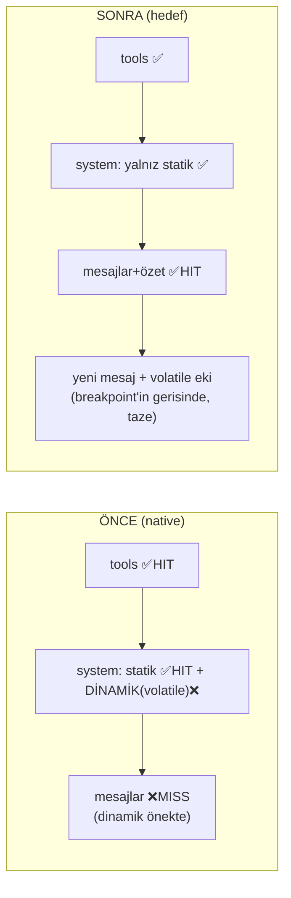

# 50 — Claude Code Cache/Context Paritesi Planı

> **Amaç:** TionSwarm'nun **native sağlayıcı** (anthropic / OpenAI-compat) context "paketini",
> Claude Code'un prompt-cache + compaction mekaniğine yaklaştırmak — **SDK'ya bağımlı
> olmadan** (çok-sağlayıcı, anahtarsız claude-cli, dosya-tabanlı felsefe korunur).
>
> Referanslar: `observed-behavior` (`services/api/promptCacheBreakDetection.ts`,
> `services/compact/{compact,apiMicrocompact,microCompact}.ts`, `services/api/claude.ts`)
> ve `external-agent-oss` (context/cache'i **Claude Agent SDK / native `claude` binary'ye
> devrediyor** — kendi cache/compaction kodu yok). Bağlam: `_Docs\17-TOKEN-OPTIMIZASYON.md`.

## 0. Tespit — mevcut durum (kod doğrulandı 2026-07-04)

| Yol | Cache breakpoint'leri | Gerçek durum |
|-----|----------------------|--------------|
| **claude-cli** | `--resume` warm prefix (System + ilk N mesaj server-side) | **Zaten Claude Code-benzeri.** Dinamik bağlam bilinçli olarak **son kullanıcı mesajına** dokunuyor (`claudecli_session.go withDynamic(lastUserText…)`) → sıcak prefix bozulmuyor. |
| **anthropic** (native) | 3 breakpoint: son tool, statik System, **son mesajda rolling history** (`anthropic.go` `systemField`/`attachHistoryBreakpoint`), 1h TTL | Tools + statik System **HIT** alıyor. **Ama** volatile Dinamik, `systemField`'de statik System'in ardında (yani tools+mesajların ÖNÜNDE `system` alanında) → **history breakpoint her tur ISKALIYOR** (prefix dinamikte ayrışıyor). Rolling history breakpoint pratikte **ölü**. |
| **OpenAI-compat** (minimax/openrouter) | statik System breakpoint + transcript-tail breakpoint (`minimax.go buildSystemMessage`/`attachHistoryBreakpoint`) | Aynı sorun: dinamik system mesajının içinde → tail breakpoint ıskalıyor. Yalnız statik prefix HIT. |
| **Compaction** | `session.Summary` + `SummaryMsgCount`; özet `conversationSummaryBlock` ile **Dinamik'e** enjekte | Özet volatile bölgede → **hiç cache'lenmiyor**, her tur taze. Katlanan mesajlar düşürülüyor (doğru). |

**Kök neden:** Native yolda büyüyen kısım (mesaj geçmişi + özet) cache breakpoint'inin
gerisinde ama **önünde duran volatile Dinamik** onları her tur geçersizleştiriyor. Tools ve
statik System (küçük, sabit) HIT alıyor; asıl tasarruf potansiyeli olan **geçmiş** alamıyor.

## 1. Hedef mekanik (Claude Code deseni)

1. **System tamamen STATİK ve cache'li.** Volatile içerik system alanından çıkar.
2. **Volatile per-tur içerik, cache breakpoint'inin GERİSİNDE** — yalnız **uçuştaki (yeni)
   kullanıcı mesajına** eklenir, **persist edilmez**. Rolling breakpoint son **persist edilmiş**
   mesaja (önceki turun sonu) konur → cache öneki tamamen değişmez (immutable) → **HIT**.
   (Bu, claude-cli'nin zaten yaptığı desenin native'e genellenmesi.)
3. **Özet = cache'li mesaj akışının parçası** (compact boundary mesajı), volatile blok değil.
4. **Tek rolling history breakpoint** son stabil mesajda; anthropic ≤4 breakpoint limitinde
   (tools + system + history = 3).
5. (Opsiyonel) **API-native context editing** (anthropic `clear_tool_uses_20250919`) ile
   eski tool-result'ları cache'i bozmadan yerinde buda — Claude Code microcompact muadili.
6. **Cache-break tespiti + telemetri** debug journal'a.

## 2. İş paketleri

### P1 — Volatile dinamiği system'den mesaj kuyruğuna taşı (native paritesi) — *en büyük kazanç* ✅ UYGULANDI (2026-07-04)
> **Durum:** anthropic + OpenAI-compat (openrouter) yollarında uygulandı; yalnız `extendedCache`/
> `cacheSystem` açıkken devreye girer (cache kapalı yol birebir korundu). `anthropic.go`:
> `systemField` artık statik-only, `toAnthropicMessages(msgs, cache, dynamic)` dinamiği son
> mesaja breakpoint'ten SONRA trailing blok olarak ekler. `minimax.go`: `buildSystemMessage`
> statik-only, `attachHistoryBreakpoint` işaretlediği indeksi döndürür, dinamik o mesaja eklenir.
> Testler: `anthropic_test.go` (yeni: `TestToAnthropicMessages_DynamicTrailsAfterBreakpoint`,
> `TestToAnthropicMessages_DynamicIgnoredWhenCacheOff`, güncellenen systemField testleri) +
> `minimax_test.go` `TestOpenRouter_SystemCacheControl` yeni yerleşimi doğrular. **289 test yeşil.**
> **Kalan:** canlı `cache_read>0` ölçümü (anthropic/openrouter anahtarı + gerçek tur gerekir).

- **Değişim:** `composeTurnRequest`/provider'lar `req.SystemDynamic`'i artık `system` alanına
  koymasın; **son (yeni) kullanıcı mesajına ek metin bloğu** olarak eklesin, **persist etmeden**.
- **anthropic.go:** `systemField` yalnız statik System döndürsün (breakpoint statik'te).
  `attachHistoryBreakpoint` rolling breakpoint'i **son persist edilmiş** mesaja koysun; volatile
  ek onun gerisinde ayrı bir content-block olsun.
- **minimax.go:** `buildSystemMessage` yalnız statik; dinamik son user mesajına eklensin.
- **Invariant (kritik):** cache öneki YALNIZ immutable içerik barındırmalı → volatile ek
  **hiçbir zaman persist edilmez**, sadece uçuştaki mesaja binlir; breakpoint son persist
  edilmiş mesajda. (claude-cli deseni birebir.)
- **Ne taşınır:** date/time, recall (memory ContextBlock), todo/artifact özetleri → volatile
  (tail). **Değerlendir:** core-memory persona + goal + cwd nispeten *stabil* — istenirse bunlar
  statik-yakını cache'li konumda kalabilir (Faz P1b), ama ilk sürümde tümünü tail'e taşımak en
  basit ve claude-cli ile simetrik.
- **Kod:** muhtemelen `providers.Request`'e `DynamicPlacement` ipucu veya provider'da ortak
  `appendVolatileToLastUser(msgs, dynamic)` helper'ı.
- **Kabul:** turn-2'de volatile dinamik varken `cache_read > 0` (yeni live test).

### P2 — Özeti mesaja çevir (compact boundary), cache'lenebilir yap
- **Değişim:** `conversationSummaryBlock`'u Dinamik'ten çıkar; özeti canlı mesaj dizisinin
  **başına** bir mesaj olarak koy (ör. `role=user`, `"[Önceki konuşmanın özeti]\n
"`),
  böylece cache önekinin parçası olur.
- **Depolama aynı:** `session.Summary`/`SummaryMsgCount` dosya-tabanlı kalır; yalnız istek-kurma
  anında blok yerine **head-message** olarak enjekte edilir.
- **Cache davranışı:** özet iki fold arasında sabit → cache'li önekte **HIT**. Fold anında özet
  mesajı değişir (bir cache-write), sonra stabil (Claude Code compact-boundary ile aynı).
- **Önizleme:** "Özet" bölümü (zaten var, `_Docs`/bu oturumda eklendi) artık **cache'li mesaj**
  olarak işaretlenir (yeşil); "Artık gönderilmeyen" turuncu grup korunur.
- **Bağımlılık:** P1'den sonra temiz (dinamik tail'de → özet head-message ile çakışmaz).

### P3 — API-native context editing (opsiyonel, anthropic-only) — *microcompact muadili*
- Anthropic `context_management` beta: `clear_tool_uses_20250919` (trigger `input_tokens`,
  `keep` son N tool_use, `clear_at_least`) + `clear_thinking_20251015`.
- Sunucu, cache'li önekteki eski tool-result/thinking'i **yerinde** siler (`cache_edits`),
  önek tam yeniden yazılmaz → sıcak kalır. TionSwarm'nun mevcut deterministik tool-output
  sıkıştırması (Sistem A/B, `CompactSavedBytes`) ile **tamamlayıcı**.
- `anthropic.go`'ya `extendedCache` açıkken ekle; beta header gerekir; ayar
  `anthropicContextEditing` (vars. kapalı). Client-side fold'a alternatif/ek.

### P4 — Cache-break tespiti + telemetri (debug journal)
- `promptCacheBreakDetection.ts` deseni: oturum-başına system+tools+cache_control hash'le,
  turdan tura karşılaştır; `cache_read` %5+ ve 2k+ token düşerse sebep ata (systemPromptChanged
  / toolSchemasChanged / modelChanged / TTL-expiry / server-side).
- Yeni debug olayı `cache_break` (`_Docs\38-SESSION-DEBUG.md`); Debug kartı + `computeDebugAnomalies`.
- Veri zaten var (`Usage.CacheRead/CacheWrite`) → yalnız atıf/attribution eklenir. P1/P2'nin
  gerçekten HIT ürettiğini **kanıtlamak** için şart.

### P5 — TTL / breakpoint kararlılığı (hardening)
- Claude Code 1h eligibility'yi **oturum-stabil latch**'liyor (mid-session flip cache bozar).
  TionSwarm tüm breakpoint'lerde sabit 1h TTL kullanıyor → doğrula: hiçbir ayar mid-session
  TTL/scope flip'i yapmıyor.
- "Tek mesaj-seviyesi marker" ilkesi: TionSwarm 3 breakpoint (limit 4) — history breakpoint P1
  sonrası **son stabil mesajda** (volatile ekte değil) olmalı.

### P6 — Önizleme cache haritasını gerçeğe hizala ✅ UYGULANDI (2026-07-04)
> `computeCachePreview` anthropic dalı: `CachedMsgCount = msgCount-1` (rolling), Araçlar+Sistem+
> geçmiş cache'li, dinamik "tail/taze" notu. `hasDynamic` artık system'de değil.

- P1/P2 sonrası `computeCachePreview` (anthropic dalı): `cachedMsgCount = msgCount-1` (rolling),
  `toolsCached`/`systemCached` = true, **özet mesajı cache'li**. Dinamik notu: "tail, cache-dışı,
  her tur taze". Bu, bu oturumda konuştuğumuz **önizleme-doğruluk boşluğunu** da kapatır.

## 3. Sıralama / bağımlılıklar
`P1` (mesaj cache'ini açar) → `P2` (özet cache'i) → `P6` (önizleme hizası) → `P4` (telemetriyle
kanıt) → `P3`/`P5` (opsiyonel/sağlamlaştırma). claude-cli yolu zaten optimal — **regresyon
yaptırma**; tüm değişiklikler **native-only**.

## 4. Riskler & azaltımlar
- **İçerik yeri (system↔message):** persona/core-memory system'de daha iyi olabilir. Azaltım:
  P1b'de stabil-dinamik (persona/goal/cwd) cache'li konumda tut, yalnız gerçek volatile (saat/
  recall/özet-tazeleme) tail'e. İlk sürüm: hepsi tail (basit, claude-cli simetrik), kalite ölç.
- **Persist tutarlılığı:** volatile ek **asla persist edilmemeli** (yoksa sonraki tur önek
  uyuşmazlığı → miss). Invariant testi ile kilitle.
- **İlk-tur maliyeti:** her değişiklikten sonraki ilk tur cache-write (ödenir); steady-state
  kazandırır — uzun oturumda net pozitif (`_Docs\17` resume≈−43% ölçümü metodolojisiyle doğrula).
- **Sağlayıcı paritesi:** OpenAI-compat'te tail-dinamik + head-özet aynı şekilde çalışmalı;
  openrouter 2 breakpoint sınırına dikkat.

## 5. Test / doğrulama
- **Live (native):** turn-2 volatile dinamikle `cache_read>0` (mirror `claudecli_live_test`).
- **Unit:** `composeTurnRequest` özeti head-message, dinamiği tail koyar; `systemField` statik-only.
- **Preview:** `cachedMsgCount` rolling'i yansıtır; SES2-benzeri oturumda özet cache'li görünür.
- **Bütçe ekranı:** 3-tur ölçümü ile cache tasarrufu artışını önce/sonra karşılaştır.

## 6. Kapsam dışı (bilinçli)
- **SDK'ya geçiş YOK** (external-agent gibi native `claude` binary'ye devretmek) — çok-sağlayıcı
  felsefesi korunur. Yalnız **mekanik/desen** ödünç alınır.
- Pi SDK / Claude-olmayan modeller: caching sağlayıcı-native kalır.

## 7. Özet — tek cümle
En büyük kazanç **P1**: native yolda volatile dinamiği system'den çıkarıp (claude-cli'nin zaten
yaptığı gibi) uçuştaki mesaja taşımak → **tools+System zaten HIT olan yapıya mesaj-geçmişi
cache'ini de eklemek**; ardından **P2** ile özeti cache'li mesaja çevirmek.
